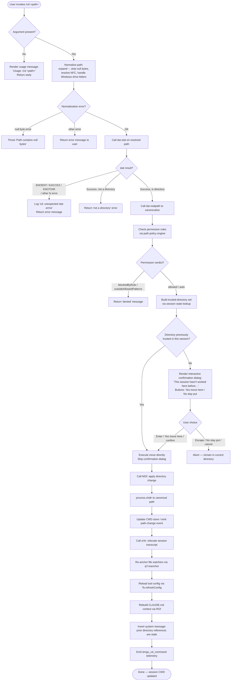

# `/cd`

> Analysis basis: CC v2.1.199 bundle.js (AST extraction + Claude interpretation)
> Minimum version: v2.1.199

---

## Overview

The `/cd` command moves the current Claude Code session to a new working directory specified by the user. It validates and normalizes the supplied path (resolving `~`, relative segments, and symlinks), checks whether the directory has been previously trusted, and—if not—presents an interactive confirmation dialog before committing the change. Once confirmed, the command updates the Node.js process working directory, re-anchors file-watching infrastructure, reloads configuration, rebuilds the CLAUDE.md instruction context for the new location, and injects a system message informing the model that prior path references are stale.

---

## Registration

| Field | Value |
|---|---|
| type | `local-jsx` |
| name | `cd` |
| description | Move this session to a new working directory |
| argumentHint | `<path>` |
| module_id | `f6l` |
| load_inline | `true` |
| loc_byte | `11825788` |
| loc_byte_end | `11825948` |
| loc_line | `8531` |
| arbor_handler.name | `PGf` |
| arbor_handler.fqn | `claude-2.1.199::PGf` |
| arbor_handler.kind | `AsyncFunction` |
| arbor_handler.resolution_path | `module_id` |
| arbor_handler.n_hits | `0` |

Analysis basis: CC v2.1.199 bundle.js:+11825788

---

## Input Branching

The command has more than three distinct execution branches (no argument supplied → usage error; path normalization failure → validation error; directory not found / inaccessible → stat error; directory not previously trusted → interactive confirmation dialog; previously trusted directory → direct move; move succeeds → state update cascade). A Mermaid flowchart is used below.



---

## Behavioral Spec

### 1. Argument Validation

```
async function handleCdCommand(rawArg, context):
    trimmed = rawArg.trim()
    if trimmed is empty:
        renderUsageHint("Usage: /cd <path>")   // bundle.js:+11824290
        return
    normalizedPath = normalizePath(trimmed)
    if normalizedPath is error:
        return normalizedPath.errorMessage
```

Analysis basis: CC v2.1.199 bundle.js:+11824270

### 2. Path Normalization (`fs` / path-canonicalization helper)

```
function normalizePath(rawPath):
    // Reject paths containing null bytes — bundle.js:+1105255
    if rawPath includes "\0":
        throw TypeError("Path contains null bytes")   // bundle.js:+1105048

    // Tilde expansion — bundle.js:+1105370
    if rawPath starts with "~/":
        rawPath = homedir() + rawPath.slice(2)        // bundle.js:+1105383

    // Windows drive-letter handling — bundle.js:+1105452
    if platform is "windows":
        apply drive-letter normalisation

    // NFC Unicode normalization — bundle.js:+67841
    path = vH(rawPath)   // calls e.normalize("NFC")

    // Resolve to absolute — bundle.js:+1105512 / +1105566
    if not path.isAbsolute():
        path = IN.resolve(currentCwd, path)
    else:
        path = IN.resolve(path)

    return path
```

Analysis basis: CC v2.1.199 bundle.js:+1105002

### 3. Filesystem Validation (`dar.stat` + `dar.realpath`)

```
async function validateDirectory(resolvedPath):
    try:
        stats = await dar.stat(resolvedPath)          // bundle.js:+11824381
    catch err:
        // Recognised error codes: ENOENT, EACCES, EPERM,
        // ENOTDIR, ELOOP, ENAMETOOLONG, EROFS              // bundle.js:+186519–186608
        if err.code in knownFsErrors:
            return { error: err.message }
        // Unexpected errno — log internally
        logError("cd: unexpected stat errno", err)    // bundle.js:+11824589
        return { error: err.message }

    if not stats.isDirectory():
        return { error: "not a directory" }

    canonicalPath = await dar.realpath(resolvedPath)  // bundle.js:+11824759
    return { ok: true, canonical: canonicalPath }
```

Analysis basis: CC v2.1.199 bundle.js:+11824381

### 4. Permission Policy Check (`c6l` — path-policy engine)

```
function checkPathPolicy(canonicalPath, sessionConfig):
    // Retrieve ordered list of allow/deny rules from session config
    rules = buildRuleList(sessionConfig)              // bundle.js:+11819333

    // Expand tilde prefixes in each rule pattern — bundle.js:+13918906
    rules = rules.map(expandTilde)

    // Check if any rule explicitly denies — bundle.js:+11819446
    for rule in rules:
        verdict = evaluateRule(rule, canonicalPath)   // calls xGf → CZt
        if verdict == "deny" or verdict == "blockedByRule":
            return { denied: true, reason: verdict }  // bundle.js:+11819592

    // Check if path falls outside allowed patterns — bundle.js:+11819826
    if not matchesAnyAllowedPattern(canonicalPath, rules):
        return { denied: true, reason: "outsideAllowedPatterns" }

    return { allowed: true }
```

Analysis basis: CC v2.1.199 bundle.js:+11819333

### 5. Trust-Check and Confirmation Dialog (`p6l` React component)

```
function renderCdComponent(canonicalPath, sessionState):
    // Look up whether this canonical path is in trusted-directory set
    // via Or (app-state reader) — bundle.js:+11824930
    previouslyTrusted = Or(sessionState, canonicalPath)

    if previouslyTrusted:
        proceedWithMove(canonicalPath)
        return

    // Render interactive confirmation UI — bundle.js:+11821331
    // Message fragments (illustrative, not verbatim):
    //   "This session hasn't worked here before …"
    //   "… read, edit, and execute files here."
    //   Security guide link: https://code.claude.com/docs/en/security
    //   Buttons: "Yes, move here" / "No, stay put"          // bundle.js:+11821953 / +11821982
    // Key bindings: enter/confirm → proceed, escape/cancel → abort
    //               // bundle.js:+11822188 / +11822203 / +11822232

    onUserConfirm:
        proceedWithMove(canonicalPath)
    onUserCancel:
        return   // stay in current directory
```

Analysis basis: CC v2.1.199 bundle.js:+11821037

### 6. Directory Change Execution (`MGf`)

```
async function applyDirectoryChange(canonicalPath, context):
    // 1. Change Node.js process CWD — bundle.js:+11822843
    process.chdir(canonicalPath)

    // 2. Update internal CWD store and emit path-change event — bundle.js:+11822860 / +11822866
    VH(canonicalPath)    // resolves absolute, updates async-local store
    v0(canonicalPath)    // normalizes and emits qTr event

    // 3. Reload per-directory configuration — bundle.js:+11823199
    await To.refreshConfig()

    // 4. Relocate session transcript to new directory path — bundle.js:+11822894
    await aYe(canonicalPath, context)

    // 5. Re-anchor file watchers — bundle.js:+11823148
    qY.reanchor(canonicalPath)

    // 6. Rebuild CLAUDE.md / rules context — bundle.js:+11823255
    RGf(canonicalPath, context)
    //   Scans for CLAUDE.md, CLAUDE.local.md, .claude/ rules files
    //   Labels: "Project", "Local", "AutoMem", "Managed"   // bundle.js:+5291531–5293964

    // 7. Escape HTML entities in display strings — bundle.js:+11823264
    par(canonicalPath)

    // 8. Emit telemetry — bundle.js:+11823220
    emit("tengu_cd_command", { path: canonicalPath })

    // 9. Insert system message warning model that prior dir references are stale
    //    ("previous directory — that information is stale. All tool calls and …")
    //    bundle.js:+11823414
    insertSystemMessage(staleDirectoryNotice)
```

Analysis basis: CC v2.1.199 bundle.js:+11822831

### 7. Transcript Relocation (`aYe`)

```
async function relocateTranscript(newPath, context):
    // Signal beginning of relocation — bundle.js:+13845202
    context.beginTranscriptRelocation()

    // Flush pending writes — bundle.js:+13845252
    await context.flush()

    // Mirror state — bundle.js:+13845297
    context.fireMirror()

    // Await all settled background tasks — bundle.js:+13845268
    await Ape()   // Promise.allSettled over active background sessions

    // Build new transcript directory path — bundle.js:+13845024
    newDir = jh.join(newPath, ".claude")
    await Ol.mkdir(newDir, { recursive: true })   // bundle.js:+13845531

    // Rename / copy transcript files — bundle.js:+13845586
    await i_c(oldTranscriptPath, newDir)

    // Re-register log writer at new path — bundle.js:+13845864
    await kj(context, newDir)

    // Signal end of relocation — bundle.js:+13845420
    context.endTranscriptRelocation()
```

Analysis basis: CC v2.1.199 bundle.js:+13844906

### 8. CLAUDE.md Context Rebuild (`RGf`)

```
function rebuildInstructionContext(newPath, context):
    // Walk directory tree upward collecting CLAUDE.md files — bundle.js:+11822636
    entries = []
    current = newPath
    loop:
        parsed = LZt.parse(current)
        entries.push(PI(current))       // normalize and add entry
        parent  = LZt.dirname(current)
        if parent == current: break
        current = parent
    entries.reverse()                   // root-first order — bundle.js:+11822749

    // Scan each directory for rules files via D6t — bundle.js:+11822777
    //   Looks for: CLAUDE.md, CLAUDE.local.md, .claude/*.md   // bundle.js:+5291497/5291665/5291564
    //   Classifies as: Project / Local / AutoMem / Managed / global

    // Build formatted context block — bundle.js:+11822796
    M6t(entries, context)
```

Analysis basis: CC v2.1.199 bundle.js:+11822636

---

## State & Side Effects

| Item | Detail |
|---|---|
| Telemetry: `tengu_cd_command` | Fired on every successful directory change (bundle.js:+11823220) |
| Telemetry: `tengu_shell_set_cwd` | Fired when the CWD async-local store is updated (bundle.js:+6856690) |
| Telemetry: `tengu_daemon_config_reload` | Fired when daemon config is reloaded after move (bundle.js:+18546460) |
| Telemetry: `tengu_disable_bypass_permissions_mode` | Fired if bypass-permissions mode is revoked during config reload (bundle.js:+3466547) |
| Telemetry: `tengu_bg_state_read_transient` | Fired during background-session state read (bundle.js:+4362670) |
| Telemetry: `tengu_paper_halyard` | Fired during CLAUDE.md rule-context scan (bundle.js:+5293593) |
| Telemetry: `tengu_claude_rules_md_permission_error` | Fired if CLAUDE.md cannot be read due to permissions (bundle.js:+5290528) |
| Telemetry: `tengu_config_lock_contention` | Fired if config-save lock is slow (bundle.js:+14384847) |
| Telemetry: `tengu_config_stale_write` | Fired if a stale config write is detected (bundle.js:+14384985) |
| Telemetry: `tengu_config_auto_repaired` | Fired if config auto-repair (parse error recovery) triggers (bundle.js:+14385384) |
| Telemetry: `tengu_config_auth_loss_prevented` | Fired if a config write that would erase auth is blocked (bundle.js:+14386054) |
| Telemetry: `tengu_config_fallback_write` | Fired on config fallback write path (bundle.js:+14384448) |
| `process.chdir()` | The Node.js process CWD is changed to the canonical target path (bundle.js:+11822843) |
| CWD async-local store | Updated via `VH` / `GOr` to reflect the new directory (bundle.js:+11822860) |
| `qTr` event emitter | Emits a path-change event after CWD store update (bundle.js:+47491) |
| File-watcher re-anchor | `qY.reanchor()` re-registers file watchers under the new path (bundle.js:+11823148) |
| Config reload | `To.refreshConfig()` re-reads per-directory `.claude` configuration (bundle.js:+11823199) |
| Transcript relocation | Session transcript files moved to `.claude/` under the new directory (bundle.js:+13845202) |
| CLAUDE.md context | Instruction context rebuilt from scratch for the new directory tree (bundle.js:+11822636) |
| System message injection | A `"system"` role message is inserted into the conversation warning the model that prior directory references are stale (bundle.js:+11825106, +11823414) |
| Trusted-directory set | The new canonical path is added to the session's trusted-directory set on confirmation (bundle.js:+11824792) |

---

## Version History

| Version | Change |
|---|---|
| v2.1.199 | Initial analysis |

---

## Common Mistakes

1. **Omitting the path argument** — `/cd` with no argument prints `Usage: /cd <path>` and does nothing. Always supply a path: `/cd ~/projects/myapp`.
2. **Expecting shell aliases or `cd -` semantics** — `/cd` does not support `cd -` (previous directory), shell environment variables such as `$OLDPWD`, or POSIX `CDPATH`. Only literal or tilde-prefixed paths are accepted.
3. **Symlink surprises** — the command resolves symlinks via `dar.realpath` before storing the canonical path and checking the trusted-directory set. A symlink target that has never been visited will trigger the confirmation dialog even if the symlink itself was previously trusted.
4. **Path outside allowed patterns** — if an organization policy or project configuration restricts allowed working directories, `/cd` will refuse the move with an `outsideAllowedPatterns` verdict without showing the confirmation dialog.
5. **Assuming model memory persists** — after a successful `/cd`, the system message explicitly tells the model that all prior path references are stale. Any file paths or directory listings the model had in context should be considered out-of-date.
6. **Interrupting during transcript relocation** — the relocation sequence (flush → mirror → rename files) is non-atomic. Interrupting Claude Code mid-relocation may leave transcript files in a partially migrated state.

---

## Appendix — Identifier Mapping

> For bundle debugging only. Identifiers change across versions.

| Identifier | Role |
|---|---|
| `PGf` | Main async handler for `/cd` command (Arbor-resolved entry point) |
| `fs` | Path normalization and validation utility (null-byte check, tilde expansion, NFC, absolute resolution) |
| `Dt` | CWD async-local store reader |
| `pHn` | Internal store accessor that calls `dHn.getStore` |
| `ule` | Fallback value provider for CWD store |
| `ar` | Utility: maps filesystem error codes to structured error objects |
| `Aw` | Low-level error-code constant table |
| `zt` | Platform detection / OS utility |
| `vH` | NFC Unicode normalizer for path strings |
| `Mo` | JSX rendering helper used in command output |
| `rn` | Error class / structured-error constructor |
| `ke` | Session history / recent-directories manager |
| `sr` | Error serializer (Error → String) |
| `at` | String coercion utility |
| `Pi` | Directory-history entry builder |
| `KTs` | History entry formatter (calls `at`) |
| `Gku` | Recent-directory ring-buffer manager (shift/push) |
| `c6l` | Path-policy engine: evaluates allow/deny rules against a target path |
| `vo` | App-state accessor primitive |
| `Ih` | Trusted-path checker: determines whether a canonical path is in the trusted set |
| `xc` | Path segment splitter |
| `Dp` | Path segment joiner |
| `eS` | Relative-path component resolver (handles `..`) |
| `Ukt` | Symlink-aware path resolver (uses `lstatSync` / `readlinkSync`) |
| `c` | Stat-result proxy (used in `Ukt` symlink check) |
| `d` | Background-session / supervisor state handler |
| `l` | Trusted-directory Set wrapper |
| `Wfc` | Session-level trusted-directory record creator |
| `Sle` | Realpath resolver with symlink expansion |
| `f` | Symbolic-link stat proxy (in `Sle`) |
| `o` | Padding/formatting helper for display strings |
| `fp` | Full-path resolver used in permission checks |
| `vZt` | Tilde-prefix expander for rule patterns |
| `xGf` | Rule-matching orchestrator (calls `CZt`, `YYe`) |
| `CZt` | Individual rule evaluator: pattern matching with glob-to-regex conversion |
| `Fym` | Rule evaluation context builder |
| `YYe` | Secondary rule matcher (`jt` / `ZM` based) |
| `kGf` | Rule post-processor / verdict finalizer |
| `jz` | Rule-list builder from config layers |
| `PXo` | Deny-rule accumulator |
| `Wg` | Pattern formatter / escaper |
| `AIe` | Allow-rule accumulator |
| `$Sc` | Allow-rule set constructor |
| `G7e` | Shell-command classifier (identifies dangerous shell invocations) |
| `uFo` | Shell-command pre-processor |
| `zXt` | Shell token recognizer |
| `XXt` | Shell-argument trimmer and boundary detector |
| `cFo` | Shell-token classifier helper |
| `Or` | App-state reader used to find previously visited / trusted paths |
| `Msr` | App-state sub-reader for `working_directory` field |
| `Dsr` | App-state sub-reader for `allowed_tools` / `disallowed_tools` fields |
| `wR` | Bypass-permissions mode checker |
| `Feo` | Organization-policy bypass-permissions enforcer |
| `ot` | Permission-mode state machine |
| `DGf` | Stale-directory warning message builder (inserts system prompt) |
| `qp` | Path string escaper for shell display |
| `kqu` | Regex-escape utility (`replaceAll` based) |
| `jUe` | Display-string formatter for directory move notice |
| `wDs` | Inline text renderer |
| `MGf` | Core directory-change executor (chdir + store update + config reload + RGf) |
| `VH` | CWD async-local store writer (absolute-resolve + store set + error codes) |
| `pn` | Structured error emitter (ENOENT/EACCES/etc.) |
| `GOr` | Async-local store getter + path normalizer |
| `$te` | Kxt-based path normalizer |
| `V` | React state setter / generic state updater |
| `v0` | CWD event emitter (normalizes path and fires `qTr`) |
| `Kxt` | Path normalizer used by `v0` |
| `aYe` | Session transcript relocation coordinator |
| `kt` | App-state reader (`Aw` backed) |
| `ru` | Signal handler registrar (`process.on` + `bfs.register`) |
| `Ai` | BFS-signal registrar |
| `K2` | Session-directory bootstrap (production/test env split) |
| `A_c` | Session-directory helper A |
| `X5` | Session-directory helper B |
| `I4e` | Session-directory helper C (`rx` / `Ef` / `fLd`) |
| `QA` | Filesystem-event emitter (`dfs` / `ufs`) |
| `dfs` | Direct-emit filesystem event |
| `ufs` | Filesystem event with `Lcn.emit` |
| `c_c` | Transcript copy helper |
| `Ape` | Awaiter for all active background sessions (`Promise.allSettled`) |
| `Vnn` | Transcript file appender / writer |
| `xe` | `JSON.stringify` wrapper |
| `T` | Log-entry formatter and writer |
| `gdu` | Log-message builder |
| `Nc` | Path redactor for log output (`[REDACTED]` substitution) |
| `ntt` | Log-entry type classifier |
| `Sdu` | Session log file manager (open / write / rotate) |
| `u_c` | Transcript writer coordinator |
| `kj` | Per-session log writer (append / mkdir / rotate logic) |
| `i_c` | Transcript file mover (rename / copy / rm) |
| `L_c` | Recursive directory copier |
| `qr` | React render root / app bootstrap |
| `$ln` | React render binder |
| `coa` | Background-session lifecycle manager |
| `ty` | Background-session state cleaner |
| `Yi` | Background-session state reader / config parser |
| `p` | Forced-shutdown helper (`process.exit` + `u.abort`) |
| `_d` | Structured-error wrapper (`rn` backed) |
| `Wt` | JSON parser wrapper |
| `Zio` | Config-object validator |
| `op` | Config persistence helper |
| `Qg` | Config state machine (`tk` backed) |
| `Uf` | Atomic config file writer (randomBytes temp file + rename) |
| `Ff` | Config finalizer / post-write hook |
| `ge` | String coercion helper (second instance) |
| `qY` | File-watcher re-anchor coordinator (`jY.reanchor`) |
| `ME` | Miscellaneous post-move state update |
| `RGf` | CLAUDE.md context rebuilder: walks directory tree, classifies rules files |
| `PI` | Path normalizer for CLAUDE.md scanning |
| `D6t` | Directory-tree scanner for CLAUDE.md / rules files |
| `om` | Context-loading helper (`HT` backed) |
| `rW` | Single-directory rules scanner (pattern matcher) |
| `tDe` | Recursive directory enumerator for rules files |
| `x6t` | Gitignore-aware directory traversal helper |
| `M6t` | Instruction-context block formatter |
| `par` | HTML-entity escaper for display strings |
| `MC` | Post-RGf miscellaneous context update |
| `xTt` | System-message formatter for stale-path notice |
| `Mt` | Config accessor (guarded: "Config accessed before allowed") |
| `BJo` | Config initializer |
| `GJo` | Config resolver |
| `hae` | Config post-load hook |
| `yV` | Path normalizer used inside system-message builder |
| `a` | Spend-limit / billing guard (Response.json path) |
| `Whe` | Spend-blocked response builder |
| `xZt` | Alternative system-message formatter |
| `Hn` | Conversation-context builder (Object.assign based) |
| `Hbc` | Context header builder (timestamp + `ite`) |
| `ite` | Timestamp formatter |
| `oon` | Context-entry object builder |
| `Wgr` | Object-entries mapper for context |
| `Ygr` | Config-store accessor with caching (`qgr` map) |
| `WJo` | Config-store writer with lock |
| `YTm` | Conversation-context assembler (calls `don`, `con`) |
| `don` | Config-file persistence orchestrator (lock, backup, rotate) |
| `con` | Config in-memory updater |
| `lon` | Config-store cache reader |
| `che` | Config change-notification helper |
| `Jgr` | Config-save coordinator |
| `p6l` | React component: `/cd` confirmation dialog UI |
| `H` | Background-process kill helper (SIGTERM loop) |
| `U` | Child-process map used by kill helper |