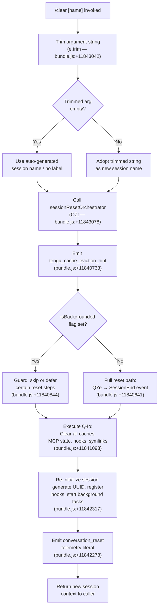

# `/clear`

> Analysis basis: CC v2.1.199 bundle.js (AST extraction + Claude interpretation)
> Minimum version: v2.1.199

---

## Overview

`/clear` (also accessible as `/reset` and `/new`) starts a fresh Claude Code session with an empty conversation context while preserving the previous session on disk. The previous session remains resumable via `/resume`. The command accepts an optional `[name]` argument to label the new session, trims any user-supplied input, then orchestrates a comprehensive state-reset across caches, hooks, MCP servers, background tasks, and transient process state before emitting a `SessionEnd` lifecycle event and initializing a clean session context.

---

## Registration

| Field | Value |
|---|---|
| type | `local` |
| name | `clear` |
| description | `Start a new session with empty context; previous session stays on disk (resumable with /resume)` |
| aliases | `reset`, `new` |
| argumentHint | `[name]` |
| supportsNonInteractive | `true` |
| thinClientDispatch | `post-text` |
| module_id | `L6l` |
| load_inline | `true` |
| loc_byte | `11843216` |
| loc_byte_end | `11843507` |
| loc_line | `8533` |
| arbor_handler.name | `tWf` |
| arbor_handler.fqn | `claude-2.1.199::tWf` |
| arbor_handler.kind | `AsyncFunction` |
| arbor_handler.resolution_path | `module_id` |
| arbor_handler.n_hits | `0` |

Analysis basis: CC v2.1.199 bundle.js:+11843216

---

## Input Branching

The handler has four distinct input/state paths (trimmed name absent, trimmed name present, backgrounded session guard, cache-eviction hint branch), requiring a Mermaid flowchart.



---

## Behavioral Spec

### 1. Argument Parsing

```
async function handleClear(rawArg, appContext):
    trimmedArg = rawArg.trim()            // bundle.js:+11843042
    if trimmedArg == "":
        sessionName = null
    else:
        sessionName = trimmedArg
    return sessionResetOrchestrator(appContext, sessionName)
```

Analysis basis: CC v2.1.199 bundle.js:+11843042

---

### 2. Session Reset Orchestrator (`sessionResetOrchestrator` / `OZt`)

This is the main coordinator called by `tWf`. It performs the following sequence:

```
async function sessionResetOrchestrator(appContext, sessionName):
    // 1. Compute scroll/viewport position prior to reset
    scrollPos = clampedScrollPosition(appContext)   // UZt → parseInt, Number.isFinite,
                                                    // Math.max, Math.min
                                                    // bundle.js:+13978198..13978429

    // 2. Emit SessionEnd lifecycle event
    fireSessionEndEvent(appContext)                 // QYe → Bd; literal "SessionEnd"
                                                    // bundle.js:+11840641, +13968660

    // 3. Emit cache eviction telemetry hint
    emit("tengu_cache_eviction_hint")              // bundle.js:+11840733

    // 4. Determine backgrounded status
    isBackgrounded = appContext.flags["isBackgrounded"]  // bundle.js:+11840844

    // 5. Run comprehensive cache/state reset
    comprehensiveCacheReset(appContext)            // Q4o — bundle.js:+11841093

    // 6. Reset conversation-level state
    conversationStateReset(appContext)             // p2 — bundle.js:+13978298

    // 7. Clear pending timers
    clearAllPendingTimers(appContext)              // clearTimeout — bundle.js:+11841533

    // 8. Flush write-behind buffers
    flushWriteBehindBuffers(appContext)            // uH, ECe.delete — bundle.js:+11841634

    // 9. Assign new session UUID
    newSessionId = crypto.randomUUID()            // v6l.randomUUID — bundle.js:+11842317

    // 10. Emit conversation_reset signal
    emitConversationReset(appContext, newSessionId)  // literal "conversation_reset"
                                                     // bundle.js:+11842278

    // 11. Re-register process signal handlers
    reRegisterSignalHandlers(appContext)           // ig, ru — bundle.js:+11842220

    // 12. Restart background session workers
    restartBackgroundWorkers(appContext)           // uoa, Yi — bundle.js:+11842466

    // 13. Re-initialize MCP connections
    reinitMcpConnections(appContext)              // xpe — bundle.js:+11842596

    // 14. Reload plugin hooks for new session
    reloadPluginHooks(appContext, sessionName)    // hK — bundle.js:+11842785

    return newSessionContext
```

Analysis basis: CC v2.1.199 bundle.js:+11843078

---

### 3. SessionEnd Event Dispatch (`fireSessionEndEvent` / `QYe`)

```
function fireSessionEndEvent(appContext):
    // Fires the "SessionEnd" hook event through the hook system
    hookResult = dispatchHookEvent("SessionEnd", appContext)  // Bd, literal "SessionEnd"
                                                              // bundle.js:+13968633, +13968660

    // Runs full agent turn loop with session-end context
    agentRunLoop(appContext, hookResult)           // g0 — bundle.js:+13968691

    // Stores session metadata for resumability
    storeSessionMetadata(appContext)               // kt — bundle.js:+13968888

    // Re-issues K1o transition callback
    issueStateTransitionCallback(appContext)       // K1o — bundle.js:+13968893
```

Analysis basis: CC v2.1.199 bundle.js:+11840641

---

### 4. Comprehensive Cache Reset (`comprehensiveCacheReset` / `Q4o`)

```
function comprehensiveCacheReset(appContext):
    // Clear skill index cache
    clearSkillIndexCache(appContext)           // ak → KW.clearSkillIndexCache
                                              // bundle.js:+11839597, +13810733

    // Clear agent/background process caches
    clearBgCaches(appContext)                 // BEa → gK.clear — bundle.js:+11839605, +5445020

    // Clear sub-agent session references
    clearSubagentRefs(appContext)             // D0t — bundle.js:+11839614

    // Reset session lifecycle state
    resetSessionState(appContext)             // Spe — bundle.js:+11839624
    //   - Clears compact/worktree caches     // ySa → fGt.clear, ugo.clear
    //   - Resets autonomous loop delivery    // wvp.resetAutonomousLoopDelivered
    //   - Clears tool state                  // cE → Object.values

    // Clear hook queue
    clearHookQueue(appContext)                // sW → QQt.clear — bundle.js:+11839638, +11560023

    // Clear various keyed caches
    clearQueryCaches(appContext)              // q_l → Sze.clear, lDo.clear
                                             // bundle.js:+11839888, +9465143

    clearTimestampCaches(appContext)          // YRl → tbt.clear, fJt.clear
                                             // bundle.js:+11839897, +10733731

    clearLocaleCaches(appContext)             // Z1r → HLe.clear — bundle.js:+11839906, +1169010

    clearPolicyCaches(appContext)             // Rba → P9n.clear — bundle.js:+11839921, +5610609

    clearCwdCaches(appContext)               // W1r → o9e.clear — bundle.js:+11839934, +1159893

    clearSkillCaches(appContext)             // sKa → $Vt — bundle.js:+11839940

    clearUiStateCaches(appContext)           // ZWa → bse.clear, cOe.clear
                                            // bundle.js:+11839946

    // Enumerate remaining runtime keys and clear them
    remainingKeys = Object.keys(runtimeStateMap)  // bundle.js:+11839736
    for key in remainingKeys:
        clearRuntimeEntry(key, appContext)

    // Resolve with empty state
    return Promise.resolve()                 // bundle.js:+11839952
```

Analysis basis: CC v2.1.199 bundle.js:+11841093

---

### 5. Conversation-Level State Reset (`conversationStateReset` / `p2`)

```
function conversationStateReset(appContext):
    // Reset conversation context map
    resetContextMap(appContext)              // zeo → wWi.get, wWi.set
                                            // bundle.js:+3486143, +3485473

    // Clear two primary LRU caches
    clearPrimaryCache(appContext)           // l_ → Ccn.clear, $Tr.clear
                                           // bundle.js:+3486180, +29358, +29370

    // Rebuild default conversation scaffolding
    rebuildConversationScaffold(appContext) // Yeo → kn, sc, cA, ts
                                           // bundle.js:+3486206
```

Analysis basis: CC v2.1.199 bundle.js:+13978298

---

### 6. Plugin Hook Reload (`reloadPluginHooks` / `hK`)

This sub-feature is invoked at the end of the reset sequence to configure the new session's hook subscriptions.

```
function reloadPluginHooks(appContext, sessionName):
    // Check safe-mode flag; skip plugin hooks if active
    if safeMode(appContext):                // literal "--safe-mode" — bundle.js:+72149
        logInfo("Safe mode: skipping plugin hook registration")
        // bundle.js:+5454310
        return

    // Check managed-only flag
    if allowManagedHooksOnly(appContext):   // bundle.js:+5457004
        logInfo("Skipping plugin hooks - allowManagedHooksOnly is enabled")
        return

    // Load plugin hooks asynchronously
    emit("load_plugin_hooks")              // literal "load_plugin_hooks" — bundle.js:+5457106

    // Register hook matchers: PreToolUse, PostToolUse, SessionStart, etc.
    registerHookMatchers(appContext)       // fJ → kn, Object.entries — bundle.js:+5456891

    // Emit startup/resume signal on hook session start
    hookSessionStartSignal = sessionName != null ? "resume" : "startup"
                                           // literals "startup", "resume" — bundle.js:+5458569, +5458584

    // Reload skills referenced from hook configuration
    emitSkillReload(appContext)            // literal "hook_session_start_reload_skills"
                                           // bundle.js:+5458522

    // Emit V2 hook event bus signal
    emitHookEventBus(appContext)           // V2.emit — bundle.js:+5458509

    // Apply additional context hook
    emitAdditionalContext(appContext)      // literal "hook_additional_context"
                                           // bundle.js:+5458650
```

Analysis basis: CC v2.1.199 bundle.js:+11842785

---

### 7. Background Worker Restart (`restartBackgroundWorkers` / `uoa`)

```
async function restartBackgroundWorkers(appContext):
    // Delete stale background-session transient entries
    deleteStaleBgEntries(appContext)       // ty → _oe.delete — bundle.js:+4365939, +4361720

    // Re-scan and reload background session files
    reloadBgSessionFiles(appContext)       // Yi → IE.lstat, IE.readFile, Promise.all
                                          // bundle.js:+4365957, +4361884, +4362872

    // Re-start session cron scheduler
    restartSessionCron(appContext)         // op → Qg (literal "session_cron")
                                          // bundle.js:+4366052, +4361142

    // Re-initialize session write paths
    reinitWritePaths(appContext)           // Ff → nV.has, ge, ke
                                          // bundle.js:+4366172
```

Analysis basis: CC v2.1.199 bundle.js:+11842466

---

## State & Side Effects

| Item | Detail |
|---|---|
| Telemetry — `tengu_cache_eviction_hint` | Fired during session reset orchestration (bundle.js:+11840733) |
| Telemetry — `tengu_run_hook` | Fired when dispatching hooks during the new-session setup (bundle.js:+14020422) |
| Telemetry — `tengu_feature_ok` | Fired on successful feature dispatch path (bundle.js:+1039941) |
| Telemetry — `tengu_feature_bad` | Fired on failed feature dispatch path (bundle.js:+1040008) |
| Telemetry — `tengu_hook_plugin_metrics` | Fired with plugin hook execution metrics (bundle.js:+13997245) |
| Telemetry — `tengu_repl_hook_finished` | Fired when REPL hook completes (bundle.js:+14003694) |
| Telemetry — `tengu_hook_plugin_injected` | Fired when a plugin hook is injected into the session (bundle.js:+14018674) |
| Telemetry — `tengu_session_renamed` | Fired if a new session name label is applied (bundle.js:+13865847) |
| Telemetry — `tengu_shell_set_cwd` | Fired when working directory is reestablished for the new session (bundle.js:+6856690) |
| Telemetry — `tengu_bg_state_read_transient` | Fired during background-session file reload (bundle.js:+4362670) |
| Telemetry — `tengu_transcript_write_failed` | Fired if transcript write fails during session boundary (bundle.js:+13871906) |
| Telemetry — `tengu_mcp_skills` | Fired during MCP skill re-initialization (bundle.js:+7444269) |
| Hook registration | Plugin hooks are fully torn down and re-registered for the new session via `reloadPluginHooks`; safe-mode disables plugin hooks but managed settings-file hooks still run (bundle.js:+5456911) |
| Hook lifecycle events | `SessionEnd` dispatched before teardown (literal `"SessionEnd"`, bundle.js:+13968660); new `SessionStart` equivalent emitted after UUID assignment |
| appState changes | Conversation context maps (`wWi`) cleared; LRU caches (`Ccn`, `$Tr`) cleared; skill index cache cleared; sub-agent references reset; autonomous-loop delivery counter reset; compact/worktree caches flushed |
| Cache clears | `QQt`, `Sze`, `lDo`, `tbt`, `fJt`, `HLe`, `P9n`, `o9e`, `bse`, `cOe`, `gK`, `fGt`, `ugo` (full enumeration from `Q4o` — bundle.js:+11841093) |
| Timer cleanup | All pending `setTimeout` handles cancelled via `clearTimeout` (bundle.js:+11841533) |
| Write-behind flush | `ECe` write-behind map flushed and deleted before session close (bundle.js:+11841634) |
| Session UUID | New UUID generated via `crypto.randomUUID` and assigned to the fresh session (bundle.js:+11842317) |
| Disk persistence | Previous session transcript is retained on disk and remains `/resume`-able; no data is deleted |
| Sound | <!-- TODO: not found in depth-2 traversal; needs --depth 4 --> |

---

## Version History

| Version | Change |
|---|---|
| v2.1.199 | Initial analysis |

---

## Common Mistakes

1. **Expecting the previous session to be lost.** `/clear` does not delete prior conversation data. The previous session remains on disk and is accessible via `/resume`. Use `/clear` when you want a fresh start without destroying history.

2. **Confusing `/clear` with terminal clear.** `/clear` resets Claude's conversational context and application state; it does not clear the terminal scrollback buffer. The visual display is unaffected beyond rendering the new empty session.

3. **Omitting the name argument when working across multiple named sessions.** The optional `[name]` argument (trimmed before use — bundle.js:+11843042) lets you label the new session immediately. Skipping it leaves the new session unlabeled, which can make later `/resume` selection ambiguous.

4. **Running `/clear` in safe mode and expecting plugin hooks to activate.** In safe mode, plugin hooks are suppressed for the new session (`--safe-mode` flag — bundle.js:+72149). Managed settings-file hooks still run, but custom plugin hooks registered via `.claude/settings.json` will not fire.

5. **Assuming `/reset` and `/new` are separate commands.** Both `reset` and `new` are registered as aliases for `clear` (registration aliases array — bundle.js:+11843216). They invoke identical behavior.

---

## Appendix — Identifier Mapping

> For bundle debugging only. Identifiers change across versions.

| Identifier | Role |
|---|---|
| `tWf` | Main handler (`handleClear` / `clearCommandHandler`) — async entry point for `/clear` |
| `OZt` | Session reset orchestrator — coordinates the full teardown and reinit sequence |
| `UZt` | Scroll position clamper — computes clamped viewport scroll before reset |
| `J_` | Policy settings resolver |
| `sc` | Safe-mode check helper |
| `$ue` | Policy settings fetcher (reads `policySettings`) |
| `p2` | Conversation-level state reset coordinator |
| `zeo` | Conversation context map reset helper |
| `l_` | LRU cache pair clear helper (`Ccn`, `$Tr`) |
| `Yeo` | Conversation scaffold rebuild helper |
| `QYe` | SessionEnd event dispatch coordinator |
| `Bd` | Hook event dispatcher (fires `SessionEnd`) |
| `kt` | Session metadata store helper |
| `fN` | Session file writer helper |
| `Sv` | Model-name inclusion checker (claude-3-*, opus, sonnet, haiku model literals) |
| `TO` | Effort-level resolver (literal `"high"`) |
| `$v` | Session context builder |
| `Dt` | Transcript append helper |
| `g0` | Agent run-loop main function |
| `w9` | App-state reader for run-loop |
| `T` | Output writer / stream flusher |
| `SCe` | Run-loop state check helper |
| `VYo` | Hook configuration enumerator |
| `Zyc` | Hook filter helper |
| `jYo` | Third-party hook filter |
| `nEc` | Hook existence check |
| `Bn` | Hook batch runner |
| `V` | Async value resolver |
| `xe` | JSON serializer wrapper |
| `ke` | Hook error logger |
| `we` | Feature-bad dispatcher |
| `W3e` | Feature-ok dispatcher |
| `lM` | Abort-controller timeout manager |
| `gae` | Hook event emitter helper |
| `G1` | Worktree create event helper |
| `Ymr` | Worktree block state handler |
| `$Yo` | MCP tool result handler |
| `Jmr` | Hook output JSON parser |
| `nge` | Hook plugin metrics aggregator |
| `FYo` | HTTP hook executor |
| `Jyc` | HTTP hook response parser |
| `nCe` | Hook context builder |
| `Qmr` | Shell/spawn hook executor |
| `v8e` | Hook execution finalizer |
| `Le` | Feature-ok emitter |
| `M2` | Telemetry event emitter (uses `$up.emit`, `sMe`) |
| `K1o` | State transition callback issuer |
| `qe` | Nonconforming signal handler |
| `mr` | Signal dispatch wrapper |
| `Zf` | Signal dispatcher base |
| `s` | Process set add/delete wrapper |
| `r` | Process set tracker |
| `Ts` | CLI error exit handler (`process.exit`) |
| `i` | Connection close pair handler |
| `n` | Input stream lowercaser |
| `f` | Path normalizer helper |
| `yV` | Path normalize/replaceAll helper |
| `Va` | Version/auth value holder |
| `d` | Supervisor MCP server manager |
| `vJe` | File stat and read helper (checks `ENOENT`, 1 MB limit) |
| `Qs` | Async local store getter (`EId.getStore`) |
| `ge` | String coercer |
| `o` | Column pad helper |
| `ihc` | Object key max-width calculator |
| `E` | SDK/SSE connection manager |
| `VQe` | SSE dynamic connection handler |
| `sr` | Error/string coercer |
| `b` | MCP server process manager |
| `KAr` | Array-type MCP config parser |
| `qAr` | MCP config string slicer |
| `H` | Process kill helper |
| `iru` | Heartbeat initializer (`Mue`) |
| `I` | Input handler with `Math.max`, `Math.floor` |
| `R` | HTTP request router (OAuth, healthz, token, etc.) |
| `p` | Forced-shutdown exit handler |
| `u` | Daemon stop coordinator (`Le`, `we`, `n2`, `w8`) |
| `n2` | Daemon control signal broadcaster |
| `w8` | Daemon shutdown race handler (`Promise.race`, `Promise.all`) |
| `PE` | Process event listener helper |
| `xGt` | `Sho` map get/set helper |
| `s1` | `zoe`/`Yoe` session-init state helper |
| `zoe` | `dDe.has` session dedup check |
| `Q4o` | Comprehensive cache reset orchestrator |
| `K4o` | Cache reset pre-check |
| `ak` | Skill index cache clear coordinator |
| `KW` | Skill cache clear with `clearSkillIndexCache` |
| `BEa` | Agent/background cache clear (`gK.clear`) |
| `jje` | DEa/PEa write-file helper with mkdir |
| `D0t` | Sub-agent reference clear |
| `Spe` | Session lifecycle reset (compact, worktree, autonomous loop) |
| `P6e` | Session-object state-order reset |
| `J3n` | Sub-agent exit cleanup |
| `k6t` | `Nx` helper |
| `M0t` | Session state model reset |
| `O0t` | `lle` output helper |
| `ySa` | Compact cache clear (`fGt.clear`, `ugo.clear`) |
| `gSa` | Compact state reset |
| `vDe` | Compact delivery reset |
| `cE` | Output token counter reset |
| `Igo` | Session init guard |
| `sW` | Hook queue clear (`QQt.clear`) |
| `q_l` | Query cache clear (`Sze.clear`, `lDo.clear`) |
| `YRl` | Timestamp cache clear (`tbt.clear`, `fJt.clear`) |
| `Z1r` | Locale cache clear (`HLe.clear`) |
| `C6l` | Additional cache clear |
| `Rba` | Policy cache clear (`P9n.clear`) |
| `zCr` | Runtime state check (`e.has`) |
| `W1r` | CWD cache clear (`o9e.clear`) |
| `sKa` | Skill state clear (`$Vt`) |
| `$Vt` | `E8n.get` / `UVt` skill table accessor |
| `ZWa` | UI state cache clear (`bse.clear`, `cOe.clear`) |
| `ar` | `Aw` log helper |
| `VH` | Working-directory path resolver |
| `zt` | Path existence check |
| `pn` | `rn` error throw helper |
| `GOr` | `dHn.getStore` context reader |
| `vH` | Path normalizer (NFC) |
| `$te` | `Kxt` store helper |
| `ol` | `Aw` log helper (alt) |
| `Bje` | Runtime state entry clearer |
| `BT` | Background-task batch tracker |
| `uH` | Write-behind flush coordinator (`ECe.get`, `ECe.delete`) |
| `Fmr` | Pending-set add/delete helper (`Nmr`) |
| `Amt` | `wRa` async-task map helper |
| `zT` | MCP connection re-initializer |
| `TA` | MCP skill reload coordinator |
| `nOe` | MCP config hash builder |
| `SL` | `ot` MCP skill table updater |
| `ot` | MCP skill registration helper |
| `Z4o` | `EHe` error handler for reset |
| `EHe` | Error boundary for cache reset |
| `ig` | Signal handler re-registrar |
| `ru` | `Ai`/`process.on` signal handler setup |
| `Ai` | `bfs.register` handler registry |
| `ML` | Model list helper |
| `Lg` | Session path joiner |
| `L3` | `Aw` path helper |
| `NZt` | Additional signal handler setup |
| `VTr` | Session UUID emitter (`Lcn.emit`) |
| `dfs` | UUID emit pre-hook |
| `ufs` | `Lcn.emit` wrapper |
| `N7a` | Runtime state initializer |
| `See` | Additional process handler setup |
| `uoa` | Background worker restart coordinator |
| `ty` | Stale bg-entry deleter (`_oe.delete`) |
| `Yi` | Background session file reloader |
| `_d` | `rn` error throw (bg context) |
| `Wt` | JSON parse wrapper |
| `Zio` | `Qio`/`UUn` session sort helper |
| `op` | Session cron restarter |
| `Qg` | `tk` active session tick |
| `Uf` | Session file write helper (randomBytes, writeFile, copyFile, chmod) |
| `Ff` | Write-path reinitializer |
| `Rj` | Transcript writer coordinator |
| `kj` | Transcript append-file helper |
| `K2` | Session header builder |
| `Pe` | `GZe` process-event helper |
| `xpe` | MCP symlink/connection re-initializer |
| `RYo` | MCP mkdir helper |
| `x8e` | MCP join/check helper |
| `Wp` | MCP path join helper |
| `Jym` | MCP lstat/realpath helper |
| `Mqe` | MCP open/connection re-open helper |
| `UT` | Sub-agent path builder |
| `qc` | Connection quality checker |
| `qr` | Module bootstrap helper |
| `Ym` | Session mode tracker |
| `wj` | Worktree-state emitter |
| `age` | Isolation-latch writer |
| `Dd` | Isolation latch dedup helper |
| `hK` | Plugin hook reload coordinator |
| `Mc` | `sc`/`Md` managed-hook check |
| `Md` | `pvr` managed hook policy reader |
| `fJ` | Hook matcher register helper |
| `kn` | `iyn`/`t9` hook key normalizer |
| `Crt` | `In` hook wait coordinator |
| `In` | `N8u`/`xe` hook invocation helper |
| `HAe` | `JEa` safe-mode hook guard |
| `cGt` | New-session run-loop launcher |
| `lE` | Session log emitter |
| `ew` | Session run-loop (main agent loop for new session) |
| `Oft` | `li`/`A$e.randomUUID` session entry initializer |
| `li` | `y9o.randomUUID`, `t.uuid`, `t.now` session item creator |
| `a` | `Whe`/`Response.json` spend-limit response handler |
| `Whe` | `JSON.stringify` spend response serializer |