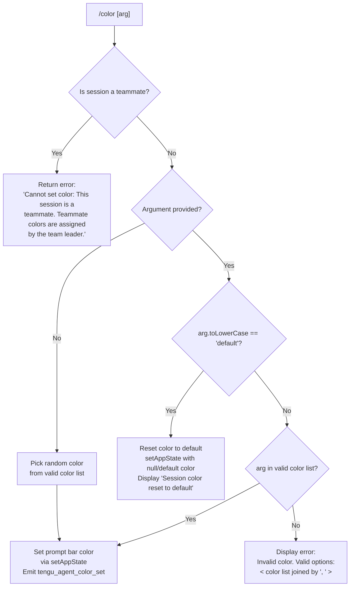

# `/color`

> Analysis basis: CC v2.1.199 bundle.js (AST extraction + Claude interpretation)
> Minimum version: v2.1.199

---

## Overview

The `/color` command sets the prompt bar color for the current Claude Code session. It accepts a named color argument (or `default` to reset), validates it against a known color list, then applies the selection by mutating application state and emitting a telemetry event. Color assignment is restricted: teammate sessions cannot use this command, as colors in that context are controlled by the team leader.

---

## Registration

| Field | Value |
|---|---|
| type | `local-jsx` |
| name | `color` |
| description | `Set the prompt bar color for this session` |
| loc_byte | `11845099` |
| loc_byte_end | `11845316` |
| loc_line | `8533` |
| argumentHint | `null` |
| immediate | `true` |
| module_id | `M6l` |
| load_inline | `true` |
| arbor_handler.name | `oWf` |
| arbor_handler.fqn | `claude-2.1.199::oWf` |
| arbor_handler.kind | `AsyncFunction` |
| arbor_handler.resolution_path | `module_id` |
| arbor_handler.n_hits | `0` |

Analysis basis: CC v2.1.199 bundle.js:+11845099

---

## Input Branching

The command has four distinct paths based on session type and the argument provided:



Analysis basis: CC v2.1.199 bundle.js:+11843936, +11843947, +11844076, +11844131, +11844155, +11844275, +11844317, +11844527, +11844536

---

## Behavioral Spec

### Top-Level Handler (`oWf`)

The Arbor-resolved handler is the async function `oWf` (FQN: `claude-2.1.199::oWf`, resolution path: `module_id`). It is the entry point called when the user invokes `/color`.

```
async function colorCommandHandler(context, arg):
    // Step 1: Delegate to core implementation
    prepareColorDisplay(context)
    await executeColorCommand(context, arg)
```

Analysis basis: CC v2.1.199 bundle.js:+11843867, +11843875

---

### Core Color Execution (`Sar`)

`Sar` is the primary implementation function called by `oWf`. It performs validation, branching, and state mutation.

```
async function executeColorCommand(context, arg):
    // Step 1: Check session type
    systemValue = getSessionSystemValue(context)   // reads "system" field
    if sessionIsTeammate(context):
        displayError("Cannot set color: This session is a teammate. "
                     "Teammate colors are assigned by the team leader.")
        return

    // Step 2: Normalize input
    if arg is provided:
        normalizedArg = arg.toLowerCase()
    else:
        normalizedArg = null

    // Step 3: Branch on argument
    if normalizedArg == null or normalizedArg == "":
        // Pick a random color from the valid list
        colorList = getValidColorList()    // rWf
        idx = Math.floor(Math.random() * colorList.length)
        chosenColor = colorList[idx]

    else if normalizedArg == "default":
        // Reset to default
        context.setAppState({ promptBarColor: null })
        displayMessage("Session color reset to default")
        logColorChange(context, "default")
        return

    else if validColorList.includes(normalizedArg):
        chosenColor = normalizedArg

    else:
        // Invalid color: show error with valid options
        validOptions = eyColorList.join(", ")
        displayError("Invalid color. Valid options: " + validOptions)
        return

    // Step 4: Apply chosen color
    context.setAppState({ promptBarColor: chosenColor })

    // Step 5: Get current app state for logging
    currentState = context.getAppState()

    // Step 6: Persist / broadcast color change to daemon
    emitColorChange(context, chosenColor)   // calls FZt → logs "agent-color"
    getCommandContext(context)              // GUn — refreshes context/watcher
    getSessionContext(context)              // Uy
    displayColorResult(context, chosenColor)   // XRe
    renderColorUI(context)                     // sWf
```

Analysis basis: CC v2.1.199 bundle.js:+11843875, +11843893, +11843936, +11843947, +11844076, +11844087, +11844113, +11844131, +11844155, +11844177, +11844259, +11844266, +11844306, +11844317, +11844336, +11844360, +11844465, +11844469, +11844474, +11844527

---

### Teammate Guard

The check at the start of `executeColorCommand` reads the `"system"` field from session context. If the session is identified as a teammate (sub-session controlled by a team leader), the command immediately returns with the error message:

> "Cannot set color: This session is a teammate. Teammate colors are assigned by the team leader."

Analysis basis: CC v2.1.199 bundle.js:+11843893, +11843947

---

### Valid Color Resolution

Two separate arrays appear in the traversal: `rWf` (used for random-pick inclusion check) and `ey` (used for validation and display, joined with `", "`). Both represent the set of named colors recognized by the command. The valid color list join separator is `", "`.

Analysis basis: CC v2.1.199 bundle.js:+11844131, +11844155, +11844177, +11844185

---

### Color Reset (default)

When the argument (case-insensitive) equals `"default"`, the command resets the prompt bar color to the application default. The confirmation message displayed is exactly:

> "Session color reset to default"

Analysis basis: CC v2.1.199 bundle.js:+11844275, +11844527, +11844536

---

### Daemon Color Broadcast (`FZt`)

After a color is chosen, `FZt` is called to persist the selection. This function:

```
async function emitColorChange(context, color):
    await buildColorPayload(color)    // $v — constructs payload including "default" fallback
    await writeColorToLog(context)    // kj — appends to log file, manages session log lifecycle
    await initLogSession(context)     // ru — registers process.on("exit") handler
    emitTelemetry("tengu_agent_color_set", { color: color })   // V
```

The literal `"agent-color"` appears at this depth, suggesting the log category or event label used when persisting the color entry.

Analysis basis: CC v2.1.199 bundle.js:+11844306, +13870855, +13870870, +13870881, +13870926, +13870931, +13870963, +13870965

---

### Color UI Renderer (`sWf`)

`sWf` is the JSX rendering function that constructs and returns the UI component for the `/color` result. It uses:

- `ME` — likely the color swatch or color preview component
- `jme` — message component
- `Promise.resolve` — for immediate resolution (consistent with `immediate: true` registration)
- `_Ue` — utility for rendering
- `r` / `Vme` — additional rendering helpers

```
function renderColorUI(context, chosenColor):
    component = buildColorComponent(chosenColor)   // ME
    message = buildMessage(context)                 // jme
    return Promise.resolve(renderResult(component, message))
```

Analysis basis: CC v2.1.199 bundle.js:+11844527, +11844620, +11844661, +11844667, +11844697, +11844749, +11844767

---

### Valid Color List Utility (`yar`)

`yar` is a helper that retrieves the set of valid color names, using `Object.keys` on a color definition object.

```
function getValidColorNames(colorMap):
    return Object.keys(colorMap)
```

Analysis basis: CC v2.1.199 bundle.js:+11844336, +11843640

---

## State & Side Effects

| Item | Detail |
|---|---|
| Telemetry | `tengu_agent_color_set` (emitted on successful color set, bundle.js:+13870965); `tengu_daemon_control` (daemon lifecycle, bundle.js:+18569105); `tengu_bg_state_read_transient` (background state read, bundle.js:+4362670); `tengu_daemon_config_reload` (daemon config reload, bundle.js:+18546460) |
| `setAppState` | Writes `promptBarColor` to application state with the chosen color name, or `null`/default on reset (bundle.js:+11844317) |
| `getAppState` | Reads current application state after the color mutation (bundle.js:+11844360) |
| Log file | `kj` appends a color-change entry to a session log file via `Ol.appendFile`; creates directory with `Ol.mkdir` if absent; uses file mode `384` (octal 0600) and `448` (octal 0700) (bundle.js:+13864961, +13864985, +13865003, +13865045) |
| Process exit hook | `ru` registers a `process.on("exit", ...)` handler to finalize log state (bundle.js:+13827589, +13827600) |
| Daemon interaction | `sWf` path invokes daemon stop/start/updateConfig cycle for the supervisor (bundle.js:+18545935, +18546055, +18546064, +18546082) |
| immediate | `true` — command executes without requiring an explicit confirmation step |

---

## Version History

| Version | Change |
|---|---|
| v2.1.199 | Initial analysis |

---

## Common Mistakes

1. **Using a color name with mixed case**: The command normalizes input via `.toLowerCase()` before comparison, so `"Blue"` and `"BLUE"` are treated the same as `"blue"`. However, supplying casing not present in the normalized valid list still triggers the invalid-color error path.
2. **Attempting to set color in a teammate session**: The command immediately returns an error if the session is identified as a teammate. This check occurs before any argument is evaluated — even `"default"` will be rejected.
3. **Omitting the argument expecting a prompt**: With no argument supplied, the command picks a **random** valid color rather than prompting the user for input. This is by design (`immediate: true`).
4. **Assuming `/color default` clears to transparent or no color**: The `"default"` keyword resets to the application's built-in default color theme, not to a colorless state. The confirmation message `"Session color reset to default"` is displayed.
5. **Expecting persistence across sessions**: The color is stored in `appState` for the current session and logged to a session log file. Behavior across new sessions depends on whether app state is rehydrated from that log.

---

## Appendix — Identifier Mapping

> For bundle debugging only. Identifiers change across versions.

| Identifier | Role |
|---|---|
| `oWf` | Top-level async handler for `/color` command (Arbor-resolved entry point) |
| `Sar` | Core color command execution function (validation, branching, state mutation) |
| `Ef` | Session/context accessor helper |
| `W0` | Store getter (calls `YWr.getStore`) |
| `kt` | Display/render utility (calls `Aw`) |
| `Lg` | Layout/formatting helper (calls `L3`, `cH`, `ar`, `CDe.join`, `kt`) |
| `L3` | Sub-layout component (calls `Aw`) |
| `ar` | Additional layout/render primitive (calls `Aw`) |
| `FZt` | Color-change persistence and telemetry emitter (calls `$v`, `kj`, `kt`, `ru`, `V`) |
| `$v` | Color payload builder (calls `kt`, `ML`, `Lg`, `cH`, `ar`, `jh.join`) |
| `ML` | Metadata/label formatter used during payload construction |
| `kj` | Session log writer (appends color event to log file; manages log lifecycle) |
| `K2` | Log entry constructor (calls `at`, `A_c`, `X5`, `I4e`) |
| `at` | String conversion utility (calls `String`) |
| `A_c` | Log field formatter |
| `X5` | Log field serializer |
| `I4e` | Context/state reader for log entry (calls `rx`, `Ef`, `fLd`) |
| `xe` | JSON serialization wrapper (calls `JSON.stringify`) |
| `ru` | Process exit hook registrar for log finalization |
| `Ai` | BFS/task registration helper (calls `bfs.register`) |
| `T` | Debug/output writer (calls `NBe`, `gdu`, `xe`, `Nc`, `ntt`, `Sdu`, `mN`, `o.write`) |
| `gdu` | Output stream manager (calls `i$`, `Vwr`, `vfs`) |
| `Nc` | Log line formatter/sanitizer (calls `phs`, `e.replace`, `r.at`, `n.lastIndexOf`, `n.slice`) |
| `ntt` | Terminal helper (calls `ths`) |
| `Sdu` | Stream/output handler (calls `Let`, `itt`, `Ile`, `Tle.dirname`, `stt.push`, `Ai`, `process.on`) |
| `ge` | String cast utility (calls `String`) |
| `V` | Telemetry emission function |
| `yar` | Valid color name extractor (calls `Object.keys` on color map) |
| `GUn` | Command context refresh / watcher manager (calls `Bl`, `Yi`, `ty`, `op`, `pn`, `Ff`) |
| `Bl` | Base context builder (calls `S_.join`, `MR`) |
| `MR` | Path merge helper (calls `S_.join`, `tr`) |
| `Yi` | File-based context reader / watcher (calls `S_.join`, `Promise.all`, `IE.lstat`, `IE.readFile`, etc.) |
| `Wfc` | File watcher lifecycle manager (calls `Qne`, `Date.now`, `Qs`, `Bnn`, `xe`) |
| `yV` | Path normalizer for Windows compatibility (calls `IN.normalize`, `jt`, `t.replaceAll`) |
| `p` | Forced-shutdown handler (calls `EI`, `process.exit`, `u.abort`) |
| `u` | Abort/teardown coordinator (calls `Le`, `we`, `n2`, `w8`) |
| `pn` | Error code resolver (calls `rn`) |
| `rn` | ENOENT / error code lookup primitive |
| `_d` | Error detail extractor (calls `rn`) |
| `Wt` | JSON parse wrapper (calls `JSON.parse`) |
| `vJe` | File stat and content reader (calls `shc.stat`, `Promise.reject`, `i.isFile`, `Qs`, `ge`, `Wa`) |
| `ihc` | Column-width calculator for display (calls `Object.keys`, `Math.max`, `Ch`) |
| `E` | Session/MCP stop coordinator (calls `VQe`, `VD`, `qD`, `Promise.all`, `tZ`, `v4`, `ke`, `sr`) |
| `b` | Daemon client (calls `KAr`, `qAr`, `H.userinfo`, stop/start/updateConfig) |
| `iru` | Heartbeat manager (calls `Mue`) |
| `I` | Input handler / key event processor (calls `Math.max`, `Math.floor`, `R.preventDefault`, `b`) |
| `Zio` | Context type discriminator (calls `Qio`, `UUn`) |
| `Qio` | Context sub-type resolver (calls `Sdt`, `Tde`) |
| `UUn` | Case-insensitive context lookup (calls `Hup.has`, `e.toLowerCase`) |
| `ty` | Cache entry eviction (calls `_oe.delete`) |
| `op` | Session context operator (calls `Qg`, `Uf`, `S_.join`, `xe`, `ty`) |
| `Qg` | Session cron/scheduler (calls `tk`) |
| `tk` | Scheduler tick handler (calls `yoe`) |
| `Uf` | Atomic file writer with locking (calls `WOr.randomBytes`, `FY.writeFile`, `FY.copyFile`, `FY.chmod`, `FY.unlink`) |
| `d_e` | File lock helper (calls `n`, `U0s`, `On`) |
| `Ff` | File change notifier (calls `rn`, `nV.has`, `T`, `ge`, `ke`) |
| `ke` | Error logging and notification (calls `sr`, `at`, `Pi`, `Gku`, `knt.push`, `fne.logError`) |
| `sr` | Error constructor wrapper (calls `Error`, `String`) |
| `Pi` | Traffic priority classifier (calls `KTs`) |
| `Gku` | Rolling log buffer manager (calls `ahn.shift`, `ahn.push`) |
| `Uy` | Session context accessor (calls `S_.basename`, `LX`, `kt`) |
| `LX` | Session label resolver |
| `XRe` | Color result display component |
| `sWf` | JSX color UI renderer (calls `ME`, `jme`, `Promise.resolve`, `_Ue`, `r`, `Vme`) |
| `ME` | Color swatch / preview component |
| `jme` | Message display component |
| `Vme` | Render result wrapper |
| `n` | Generic iteration variable / callback argument (context-dependent) |
| `i` | Generic iteration variable / inner scope (context-dependent) |
| `r` | Generic result / reference variable (context-dependent) |
| `Ts` | CLI error handler (calls `gJe`, `xI`, `process.exit`) |
| `s` | Generic scope variable (context-dependent) |
| `e` | Generic argument / event variable (context-dependent) |
| `t` | Generic context / target variable (context-dependent) |
| `o` | Generic output variable (context-dependent) |
| `l` | Generic list / lambda variable (context-dependent) |
| `f` | Generic file / function variable (context-dependent) |
| `d` | Generic data / descriptor variable (context-dependent) |
| `b` | Daemon client instance (context-dependent, see also above) |

---

Note: index built via Arbor fallback; some signals (telemetry, literals) may be missing — see arbor-fallback.js.