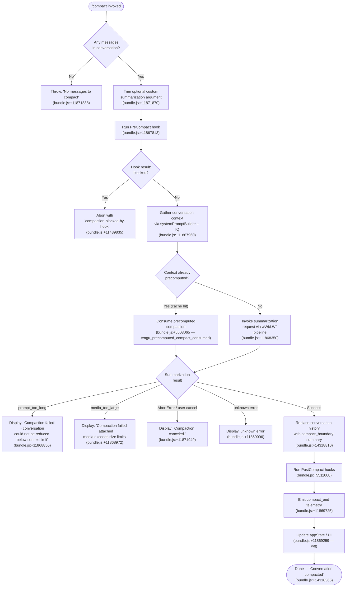

# `/compact`

> Analysis basis: CC v2.1.199 bundle.js (AST extraction + Claude interpretation)
> Minimum version: v2.1.199

---

## Overview

`/compact` frees up context window space by summarizing the current conversation into a compact representation, replacing the full message history with a single synthesized summary. It supports an optional argument that provides custom instructions to guide how the summary is produced. The command may also be triggered automatically (reactive compaction) when the context window approaches its limits.

---

## Registration

| Field | Value |
|---|---|
| type | `local` |
| name | `compact` |
| description | `Free up context by summarizing the conversation so far` |
| argumentHint | `<optional custom summarization instructions>` |
| supportsNonInteractive | `true` |
| thinClientDispatch | `post-text` |
| module_id | `gGl` |
| load_inline | `true` |
| loc_byte | `11872350` |
| loc_byte_end | `11872650` |
| loc_line | `8621` |
| **arbor_handler.name** | `vWf` |
| **arbor_handler.fqn** | `claude-2.1.199::vWf` |
| **arbor_handler.kind** | `AsyncFunction` |
| **arbor_handler.resolution_path** | `module_id` |
| **arbor_handler.n_hits** | `0` |
| `arbor_handler.name` | `vWf` |
| `arbor_handler.kind` | `AsyncFunction` |
| `arbor_handler.resolution_path` | `module_id` |
| `arbor_handler.fqn` | `claude-2.1.199::vWf` |
| `arbor_handler.n_hits` | `0` |

Analysis basis: CC v2.1.199 bundle.js:+11872350

---

## Input Branching

The command has more than three distinct branches across guard checks, compaction mode selection, and error outcomes, so a Mermaid flowchart is used.



---

## Behavioral Spec

### 1. Entry-Point Guard (handler `vWf`)

```
async function compactCommandHandler(context, customInstructions):
    // Guard: require at least one message
    if no messages in conversation:
        throw Error("No messages to compact")  // +11871838

    instructions = customInstructions.trim()   // +11871870

    // Delegate to core compaction orchestrator
    result = await coreCompactOrchestrator(context, instructions)

    if result.cancelled:
        display("Compaction canceled.")         // +11871949
        return

    display("Compacted " + summary_stats)       // +11871238
    return result
```

Analysis basis: CC v2.1.199 bundle.js:+11871807

---

### 2. Core Compaction Orchestrator (`wWf`)

```
async function coreCompactOrchestrator(context, instructions):
    startTime = performance.now()               // +11867896

    // Phase 1 – build context payload (system prompt, memory, hooks)
    contextPayload = await buildSystemContext(context)   // EC +11867918

    // Phase 2 – collect conversation messages
    [messages, metadata] = await Promise.all([
        gatherConversationMessages(context),    // IQ +11867960
        runPreCompactHook(context)              // kWf +11868035
    ])

    if preCompactHook.blocked:
        emit("compaction-blocked-by-hook")      // +11439835
        return { blocked: true }

    // Phase 3 – emit progress status
    emitStatus("compact_progress", "compacting") // +11867759, +11867875

    // Phase 4 – run summarization
    summaryResult = await runSummarizationPipeline(
        context, messages, instructions         // LWf +11868350
    )

    // Phase 5 – post-compact cleanup
    await postCompactCleanup(context)           // Spe +11869233

    // Phase 6 – persist state change
    updateConversationState(summaryResult)      // wft +11869259

    // Phase 7 – update UI
    updateUIAfterCompact(context, summaryResult) // xWf +11869461

    // Phase 8 – emit metrics
    emitMetric(context, summaryResult)          // iMe +11869742

    return summaryResult
```

Analysis basis: CC v2.1.199 bundle.js:+11867896

---

### 3. Pre-Compact Hook Runner (`kWf`)

```
async function runPreCompactHook(context):
    appState = context.getAppState()            // +11871294
    systemPromptData = buildSystemPromptData(appState) // uM +11871318

    // Collect conversation boundary info
    messages = Array.from(conversationMessages) // +11871361
    lastBoundary = findLastCompactBoundary(messages) // Or +11871372

    // Build hook input including working_directory, allowed_tools,
    // permission_mode, model, flag_settings (+11434666…+11435345)
    hookInput = assembleHookInputObject(appState, lastBoundary)

    // Fire hook pipeline (parallel: system prompt + hook execution)
    [systemPrompt, hookResult] = await Promise.all([
        buildSystemPromptForCompact(hookInput), // _j +11871418
        executePreCompactHooks(hookInput)       // hA +11871617
    ])

    return { systemPrompt, hookResult, blocked: hookResult?.block }
```

Analysis basis: CC v2.1.199 bundle.js:+11871294

---

### 4. Conversation Message Gatherer (`IQ`)

```
async function gatherConversationMessages(context):
    // Build message representations including:
    // - assistant, user, api_system roles (+11490204, +11490226, +11490243)
    // - attachment types: image, text, notebook, pdf, file (+14302040…+14301997)
    // - special injection types: todo_reminder, task_reminder,
    //   relevant_memories, diagnostics, plan_mode, mcp_resource, etc.
    rawMessages = buildMessageContext(context)  // Bd +13963792

    // Run agent-turn orchestrator to gather any pending context
    agentTurnData = await runAgentTurnGather(context) // g0 +13963900

    // Filter messages for compaction eligibility
    eligible = rawMessages.filter(isEligibleForCompaction) // +13963991

    // Construct final joined payload
    joined = eligible.map(formatMessage).join(separator) // +13964497
    return { messages: eligible, payload: joined }
```

Analysis basis: CC v2.1.199 bundle.js:+13963792

---

### 5. Summarization Pipeline (`LWf`)

```
async function runSummarizationPipeline(context, messages, instructions):
    startTime = performance.now()               // +11870106

    // Try precomputed compaction first
    precomputed = checkPrecomputedCompaction()  // Sgo +11870132
    if precomputed.available:
        emit("tengu_precomputed_compact_consumed") // +5503065
        result = applyPrecomputedResult(precomputed) // Gft +11870187
        return result

    // No precomputed: perform live summarization
    emit("compact_start")                        // +11868319

    // Select messages to summarize; find boundary
    [summarySet, boundary] = selectMessagesForSummary(messages) // bgo +11870469

    if boundary.uuid missing:
        emit("boundary_uuid_missing")            // +11870549

    // Issue API call with custom instructions
    summaryResponse = await callSummarizationAPI(
        context, summarySet, instructions       // EC +11871050
    )

    // Handle failure cases
    if summaryResponse.error == "prompt_too_long":
        emit("miss_custom_instructions")         // +11870034
        return { error: "prompt_too_long" }

    if summaryResponse.error == "miss_not_ready":
        emit("miss_not_ready")                   // +11870217

    if summaryResponse.aborted:
        emit("aborted")                          // +11870295

    // On success, record result with compact_boundary marker
    result = buildCompactResult(summaryResponse, boundary) // X3n +11870537
    emit("tengu_precomputed_compact_discarded") // +5503739 (if stale precomputed existed)

    return result
```

Analysis basis: CC v2.1.199 bundle.js:+11870106

---

### 6. Reactive Compaction Path (`wgo` / `e9n`)

Reactive compaction runs automatically when context pressure is detected (not user-triggered):

```
async function reactiveCompactLoop(context):
    // Entry point: wgo +5508775
    startTime = performance.now()               // +5508805

    groupCount = countMessageGroups(context)    // j3n +5508869

    if groupCount < 2:
        log("Reactive compact: fewer than 2 groups, nothing to compact")
        emit("too_few_groups")                  // +5482567
        return { status: "exhausted" }          // +5483227

    // Attempt summarization of oldest group(s)
    attempt = 0
    loop:
        emit("tengu_reactive_compact_attempt")  // +5483286
        result = await performReactiveCompact(context, attempt) // mvp +5483501

        if result.ok:
            emit("tengu_reactive_compact_succeeded") // +5511613
            return result

        if result.error == "media_too_large":
            log("Reactive compact: summarize hit media-size error, retrying stripped")
            attempt++
            continue                            // retry stripped +5484168

        if result.error == "media_unstrippable":
            emit("tengu_reactive_compact_failed")   // +5509123
            return { status: "failed" }

        if result.aborted:
            emit("compact_reactive_aborted")    // +5509632
            return { status: "aborted" }

    // Post-compact: restore file context etc.
    runPostCompactRestores(context)             // e9n +5509832
```

Analysis basis: CC v2.1.199 bundle.js:+5508775

---

### 7. Post-Compact Cleanup (`Spe`)

```
async function postCompactCleanup(context):
    // Finalize summarization session
    finalizeSession(context)                    // J3n +5505100
    clearCaches()                               // ySa +5505195 (fGt.clear, ugo.clear)
    resetStaticCaches()                         // gSa +5505201
    resetDynamicCaches()                        // vDe +5505207
    resetAutonomousLoopCounters()               // wvp.resetAutonomousLoopDelivered +5505227
    clearOutputTokenCounters()                  // cE +5505277 (outputTokens +49321)
    runPostCompactHook()                        // post_compact +5511008
    emit("post_compact_cleanup")                // +5505106
```

Analysis basis: CC v2.1.199 bundle.js:+5505090

---

### 8. Compact Boundary Marker

When a compaction result is stored, a synthetic system message with type `compact_boundary` is injected at the boundary position:

```
function buildCompactBoundaryMessage(summary):
    return {
        role: "system",              // +14318788
        type: "compact_boundary",    // +14318810
        content: summary,
        index: [1, 0]                // +14318864, +14318869
    }
    // Displayed to user as "Conversation compacted" +14318366
```

Analysis basis: CC v2.1.199 bundle.js:+14318788

---

## State & Side Effects

| Item | Detail |
|---|---|
| Telemetry | `tengu_run_hook` (+14020422), `tengu_feature_bad` (+1040008), `tengu_hook_plugin_metrics` (+13997245), `tengu_feature_ok` (+1039941), `tengu_silent_harbor` (+14088699), `tengu_slate_harrier` (+14098672), `tengu_orchid_mantis_v2` (+14083373), `tengu_orchid_mantis` (+14084222), `tengu_memdir_disabled` (+3539739), `tengu_herring_clock` (+3539935), `tengu_team_memdir_disabled` (+3540005), `tengu_sparrow_ledger` (+14088083), `tengu_heron_brook_applied` (+14068190), `tengu_heron_brook` (+14068263), `tengu_amber_sextant` (+14068428), `tengu_verified_vs_assumed` (+14075956), `tengu_agent_memory_loaded` (+9541049), `tengu_sepia_moth` (+5492662), `tengu_precomputed_compact_consumed` (+5503065), `tengu_precomputed_compact_discarded` (+5503739), `tengu_post_compact_file_restore_success` (+11457057), `tengu_post_compact_file_restore_error` (+11457099), `tengu_chair_sermon` (+14277353), `tengu_reactive_compact_succeeded` (+5511613), `tengu_compact_credits_clamp_rescue` (+5483129), `tengu_reactive_compact_attempt` (+5483286), `tengu_reactive_compact_failed` (+5509123), `tengu_feature_sad` (+1040089), `tengu_amber_packet` (+5492799), `tengu_keybinding_fallback_used` (+4062062) |
| Hook invocations | `PreCompact` hook fires before summarization (+11867813); `PostCompact` hook fires after successful compaction (+5511008) |
| appState changes | Conversation message list replaced with compact boundary entry; `compactMetadata` field written to appState (+11869180); conversation state updated via `tGt.setState` (+5423880) |
| UI / keybinding | Registers `app:toggleTranscript` keybinding (`Global`, `ctrl+o`) after compaction (+11871099, +11871131); status label "Compacted …" shown (+11871238) |
| Progress status | Emits `compact_progress` / `compacting` status during API call (+11867759, +11867875); `sdk_status` / `requesting` emitted during API request (+11867855, +11868194) |
| Caches cleared | Internal fast-path caches (`fGt`, `ugo`) cleared on post-compact (+5485817, +5485829) |
| Sound | <!-- TODO: not found in depth-2 traversal; needs --depth 4 --> |

---

## Version History

| Version | Change |
|---|---|
| v2.1.199 | Initial analysis |

---

## Common Mistakes

1. **Running `/compact` with an empty conversation** — the command immediately throws `"No messages to compact"` (+11871838). Ensure at least one exchange exists before invoking it.
2. **Expecting custom instructions to override hook blocks** — if a `PreCompact` hook returns a block decision, compaction is cancelled entirely regardless of the custom instructions argument (+11439835).
3. **Assuming compaction always uses live summarization** — CC maintains a precomputed compact cache; if it is valid the cache is consumed silently without a new API call (`tengu_precomputed_compact_consumed` +5503065).
4. **Believing `/compact` is equivalent to clearing history** — the command replaces history with a `compact_boundary` system message containing a summary; prior context is not permanently deleted from the session file, only from the active context window.
5. **Interrupting compaction mid-stream** — an abort produces `"Compaction canceled."` (+11871949) but may leave `post_compact_cleanup` partially run; restarting the command is safe.
6. **Providing very long custom summarization instructions** — if the resulting prompt exceeds the model's context limit, the error path `prompt_too_long` is triggered and compaction fails with a displayed error message (+11868850).

---

## Appendix — Identifier Mapping

> For bundle debugging only. Identifiers change across versions.

| Identifier | Role |
|---|---|
| `vWf` | Main `/compact` command handler (async entry point) |
| `wWf` | Core compaction orchestrator |
| `kWf` | Pre-compact hook runner / system context assembler |
| `LWf` | Summarization pipeline (precomputed check → live API call) |
| `e9n` | Post-compact restore and reactive-compact inner logic |
| `wgo` | Reactive compaction loop controller |
| `j3n` | Message group counter / group-selection for reactive compact |
| `mvp` | Single reactive compaction attempt executor |
| `gvp` | Gap-size calculator for reactive compaction |
| `IQ` | Conversation message gatherer |
| `g0` | Agent-turn orchestrator (called during message gather) |
| `Bd` | Base context builder (system prompt metadata) |
| `Qmr` | Hook subprocess spawn & execution manager |
| `FYo` | HTTP hook executor |
| `Jmr` | Hook output parser (JSON vs plain text) |
| `Jyc` | HTTP hook response parser |
| `nge` | Hook plugin metrics emitter |
| `uM` | System prompt assembly coordinator |
| `Or` | Last compact-boundary finder in conversation |
| `Msr` | Compact boundary marker resolver (forward) |
| `Dsr` | Compact boundary marker resolver (backward) |
| `$h` | Compact boundary message constructor |
| `aar` | Compact boundary helper |
| `xE` | Token-rounding utility |
| `Spe` | Post-compact cleanup coordinator |
| `J3n` | Compaction session finalizer / cache deleter |
| `Sgo` | Precomputed compaction cache checker |
| `Gft` | Precomputed compaction result applier |
| `bgo` | Boundary-finding / message-slice helper |
| `X3n` | Compact result builder (post-summarization) |
| `EC` | Summarization API caller |
| `O9f` | Message normaliser for API payload |
| `Xsr` | Conversation payload serialiser |
| `wft` | appState persistence writer (setState) |
| `xWf` | UI updater after compact (transcript toggle, status) |
| `g7e` | Model selector for compact UI display |
| `wv` | Action dispatcher for keybinding registration |
| `iMe` | Metrics/OTEL emitter for compaction stats |
| `iu` | OTEL event emitter |
| `bWe` | OTEL resource attribute builder |
| `lM` | Async hook timeout / abort manager |
| `hK` | Plugin hook loader |
| `Lvp` | Post-compact file / context restore orchestrator |
| `n9n` | File-attachment restore helper |
| `i9n` | Local-agent context restore helper |
| `r9n` | Plan-file reference restore helper |
| `s9n` | Conversation-plan restore helper |
| `o9n` | Remaining context-item restore helper |
| `EAe` | Post-restore event emitter (session_start subset) |
| `xDe` | File deduplication / restore sorter |
| `Zje` | Post-restore list builder |
| `li` | UUID / timestamp factory for new messages |
| `BR` | Full conversation payload serializer (all message types) |
| `Lf` | Token-count rounding helper |
| `b3n` | Per-message token accounting walker |
| `nCp` | Token-bucket updater per content block |
| `CR` | Model-capability router (Sv/TO) |
| `Sv` | Claude model version capability checker |
| `TO` | Effort-level capability checker |
| `sg` | appState reader for compact context |
| `h4` | PII / sensitive-value redactor for display |
| `ift` | Abort-signal cancellation handler |
| `BH` | AbortError type checker |
| `dGt` | Compact-boundary message type dispatcher |
| `uSa` | Math utility (max/floor for group sizing) |
| `F6t` | Token-limit fence calculator |
| `Mfo` | Per-message token max calculator |
| `T3n` | Token rounding wrapper |
| `_le` | Result finalizer / cleanup after handler |
| `_j` | System-prompt builder (main thread) |
| `Ec` | System-prompt component assembler |
| `_C` | Permission/auth context builder |
| `qr` | Module initialiser / export binder |
| `Pe` | Feature-flag evaluator (ok path) |
| `qe` | Feature-flag evaluator (error path) |
| `Ro` | UI output emitter (GZe) |
| `U3o` | Notification emitter during compact |
| `Usr` | Status-message formatter |
| `GEm` | Output-style system prompt injector |
| `WEm` | Confirm-before-action prompt injector |
| `jEm` | Task-continuity prompt injector |
| `zEm` | heron_brook prompt injector |
| `YEm` | amber_sextant prompt injector |
| `eSm` | Doing-tasks prompt injector |
| `nSm` | Tool-usage prompt injector |
| `sSm` | Session-guidance prompt injector |
| `gSm` | Background-session prompt injector |
| `ftr` | Scratchpad / context-management injector |
| `HSm` | Brief-mode enablement checker |
| `ESm` | Focus / flag-settings injector |
| `aSm` | Base identity prompt injector |
| `pSm` | Environment info prompt injector |
| `fSm` | Env-info-static injector |
| `JBt` | Memory loader / CLAUDE.md injector |
| `QWi` | Memory post-processor |
| `oke` | pewter_owl tool capability checker |
| `dXo` | Tool-registry snapshot builder |
| `SSm` | Tool-snapshot wrapper |
| `oSm` | Tool orchestration / scheduling helper |
| `EEc` | UI countdown / progress renderer |
| `Hir` | MCP server context collector |
| `$Ol` | Computed context cache manager |
| `iSm` | iXo-based context injector |
| `ZEm` | KEm/qK context injector |
| `iGi` | EBt identity injector |
| `eEe` | x$ capability injector |
| `ot` | Tool-registry core lookup |
| `Mz` | Lr-based context helper |
| `q6` | Zi state accessor |
| `t2t` | claude-fable prefix checker |
| `JEm` | Additional context injector |
| `XEm` | Extra context injector |
| `QEm` | Quiet-mode context injector |
| `tSm` | dXo-based snapshot injector |
| `cSm` | Compact-specific context injector |
| `yBe` | Yield / async continuation helper |
| `nEc` | Non-empty check utility |
| `Zyc` | Context filter utility |
| `jYo` | Hook-filter for third-party hooks |
| `VYo` | Hook loader / plugin hook registry |
| `$Yo` | MCP hook executor |
| `Ymr` | Agent-turn hook dispatcher |
| `G1` | Agent-turn state manager |
| `gae` | Global app-event emitter |
| `xe` | JSON.stringify wrapper |
| `ke` | Error logger (fne.logError) |
| `we` | Feature writer (V/Pe) |
| `W3e` | Zhn-based state updater |
| `V` | Feature flag reader |
| `Bn` | System-prompt line builder |
| `nCe` | Non-critical error swallower |
| `v8e` | Versioned context helper |
| `Le` | Feature logger (ok path) |
| `M2` | Telemetry metric emitter (Date.now / sMe) |
| `FIr` | OTEL span finaliser |
| `$Ir` | OTEL span error recorder |
| `lle` | Low-level output helper (Aw) |
| `Igo` | Post-cleanup notification emitter |
| `wfo` | Compact-end status renderer |
| `Et` | Feature sad-path emitter |
| `py` | System-prompt parameter builder |
| `Ec` | System-prompt component list assembler |
| `wR` | Feo-based turn router |
| `M0t` | Metadata finaliser |
| `O0t` | Output token counter resetter |
| `ySa` | Cache clear coordinator |
| `gSa` | Static context resetter |
| `vDe` | Dynamic context resetter |
| `cE` | Output token counter clearer |
| `k6t` | Nx-based compact credit clamper |
| `_go` | ot/K2 state accessor |
| `Y3n` | mgo promise chain handler |
| `K3n` | CSa.unlink / $ft cleanup |
| `Nx` | Credit-clamp math utility |