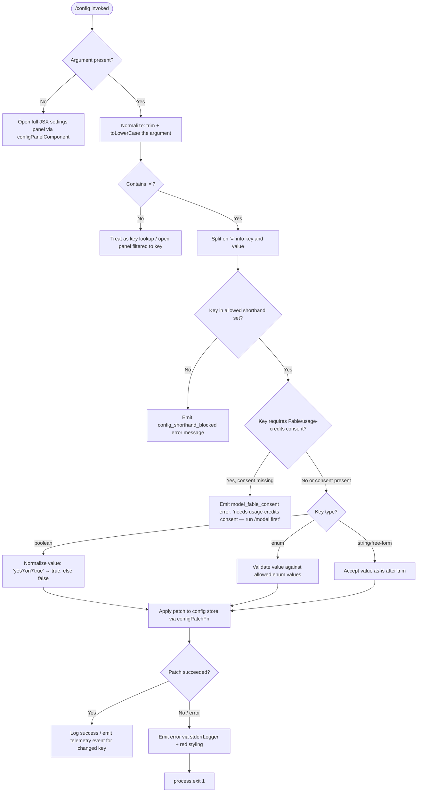

# `/config`

> Analysis basis: CC v2.1.199 bundle.js (AST extraction + Claude interpretation)
> Minimum version: v2.1.199

---

## Overview

The `/config` command (also accessible as `/settings`) opens an interactive settings panel that allows users to inspect and modify a wide range of Claude Code runtime settings. It accepts an optional `key=value` shorthand argument to set a single configuration value non-interactively from the command line. Internally the handler (`Eqf`) dispatches to a rich JSX-based settings UI component or applies a targeted patch to the configuration store when a shorthand argument is provided.

---

## Registration

| Field | Value |
|---|---|
| type | `local-jsx` |
| name | `config` |
| description | `Open settings` |
| aliases | `["settings"]` |
| argumentHint | `[key=value]` |
| module_id | `b8l` |
| load_inline | `true` |
| loc_byte | `12114530` |
| loc_byte_end | `12114808` |
| loc_line | `8717` |
| arbor_handler.name | `Eqf` |
| arbor_handler.fqn | `claude-2.1.199::Eqf` |
| arbor_handler.kind | `AsyncFunction` |
| arbor_handler.resolution_path | `module_id` |
| arbor_handler.n_hits | `0` |

Analysis basis: CC v2.1.199 bundle.js:+12114530

---

## Input Branching

The handler exhibits four distinct top-level branches based on the presence and shape of the argument string, plus sub-branches for known shorthand keys and error conditions.



Analysis basis: CC v2.1.199 bundle.js:+12113594 (JSX dispatch), +12113655 (toLowerCase), +12113674 (includes check on allowed keys), +12113784 (settings-panel render path), +12113826 (key=value parse path)

---

## Behavioral Spec

### 1. Handler Entry — `configCommandHandler` (`Eqf`)

```
async function configCommandHandler(context, argument):
    // Normalize raw argument string
    normalizedArg = argument?.trim().toLowerCase()

    // Decide rendering mode
    if normalizedArg is empty or undefined:
        return renderJSX(configPanelComponent, context)   // full interactive UI

    // Shorthand key=value path
    if normalizedArg.includes("="):
        [key, ...valueParts] = normalizedArg.split("=")
        value = valueParts.join("=").trim()
        result = applyShorthandSetting(key, value, context)
        if result.error:
            stderrLogger(redStyle(result.message))
            process.exit(1)
        return
    else:
        // key-only: open panel scrolled/filtered to that key
        return renderJSX(configPanelComponent, context, { filter: normalizedArg })
```

Analysis basis: CC v2.1.199 bundle.js:+12113594, +12113655, +12113690, +12113707, +12113784, +12113826

### 2. Shorthand Setting Application — `applyShorthandSetting` (`ten`)

```
function applyShorthandSetting(key, rawValue, context):
    // Guard: key must be in the allowlist
    if not allowedShorthandKeys.includes(key):
        return { error: true, message: "config_shorthand_blocked" }

    // Special gate: model key with Fable/usage-credits plan
    if key == "model" and requiresFableConsent(rawValue):
        return { error: true, message: "needs usage-credits consent — run /model first" }

    descriptor = getSettingDescriptor(key)   // looks up type, enum values, etc.

    // Type coercion
    if descriptor.type == "boolean":
        coercedValue = (rawValue in ["yes", "on", "true", "1"])
    else if descriptor.type == "enum":
        if rawValue not in descriptor.allowedValues:
            return { error: true, message: "invalid enum value" }
        coercedValue = rawValue
    else:
        coercedValue = rawValue   // free-form string

    // Write to config
    parsedTokens = parseKeyValueTokens(rawValue)   // t.trim, t.includes, t.split, etc.
    configStore.patch({ [descriptor.configKey]: coercedValue })

    emitTelemetry(descriptor.telemetryEvent, { value: coercedValue })
    return { error: false }
```

Analysis basis: CC v2.1.199 bundle.js:+11910099 (trim), +11910116 (includes), +11910150 (split), +11910168 (Bn token), +11910206 (indexOf), +11910223 (slice), +11910367 (push)

### 3. Interactive Settings Panel — `configSettingsPanel` (`$Tt`)

The panel is a large JSX component that groups settings into logical sections. Each entry is rendered as a toggle, enum picker, or text input depending on the setting's declared type. The sections and their canonical keys found in the bundle are:

| Section key (literal) | Display label | Config key |
|---|---|---|
| `model` | `Model` | `model` |
| `thinking` | `Thinking mode` | (toggle) |
| `tips` | `Show tips` | (toggle) |
| `reduceMotion` | `Reduce motion` | `reduceMotion` |
| `autoCompact` | `Auto-compact` | `autoCompactEnabled` |
| `verbose` | `Verbose output` | `verbose` |
| `progressBar` | `Terminal progress bar` | `terminalProgressBarEnabled` |
| `timestamps` | `Show message timestamps` | `showMessageTimestamps` |
| `turnDuration` | `Show turn duration` | `showTurnDuration` |
| `permissionMode` | `Default permission mode` | enum: `default`/`plan`/`bypassPermissions`/`auto` |
| `worktreeBaseRef` | `Worktree base ref` | enum: `fresh`/`head` |
| `gitignore` | `Respect .gitignore in file picker` | (toggle) |
| `copyFullResponse` | `Skip the /copy picker` | `copyFullResponse` |
| `copyOnSelect` | `Copy on select` | `copyOnSelect` |
| `autoScroll` | `Auto-scroll output` | `autoScrollEnabled` |
| `defaultView` | `Default view` | enum: `transcript`/`chat` |
| `language` | `Language` | free-form, default English |
| `editor` | `Editor mode` | enum: `normal`/`emacs`/`vim` → `editorMode` |
| `theme` | `Theme` | `themes` (custom: use `/theme`) |
| `outputStyle` | `Output style` | `outputStyles` |
| `notifChannel` | `Notifications` | `preferredNotifChannel` |
| `diffTool` | `Diff tool` | `terminal` or custom |
| `autoConnectIde` | `Auto-connect to IDE (external terminal)` | `autoConnectIde` |
| `autoInstallIdeExtension` | `Auto-install IDE extension` | `autoInstallIdeExtension` |
| `chrome` | `Claude in Chrome` | (toggle) |
| `teammateMode` | `Teammate mode` | enum: `tmux`/`iterm2`/`in-process` |
| `teammateDefaultModel` | `Default teammate model` | `teammateDefaultModel` |
| `remoteControl` | `Enable Remote Control for all sessions` | `remoteControlAtStartup` |
| `showExternalIncludesDialog` | `External CLAUDE.md includes` | (toggle) |
| `apiKey` | `Use custom API key` | free-form (last 20 chars shown) |
| `prStatus` | `Show PR status footer` | (toggle) |
| `precomputeCompaction` | `Precompute compaction` | `precomputeCompactionEnabled` |
| `checkpoints` | `Rewind code (checkpoints)` | `fileCheckpointingEnabled` |
| `recap` | `Session recap` | (toggle) |
| `workflows` | `Dynamic workflows` | `workflowKeywordTriggerEnabled` |
| `artifacts` | `Artifacts` | (toggle) |
| `agentsView` | `Agents view` | `defaultToAgentsView` / `leftArrowOpensAgents` |
| `autoUpdatesChannel` | `Auto-update channel` | enum: `default`/`rc`/`slow`/`latest` |

Analysis basis: CC v2.1.199 bundle.js:+11893181 through +11909352 (panel body)

### 4. Model Setting Sub-flow — `modelSettingSection` (`$Tt → bee → Bo`)

```
function modelSettingSection(context):
    currentModel = getModelFromContext(context)
    displayLabel = "Model"
    defaultDescription = "Default (recommended)"

    options = buildModelOptions()   // fable, opusplan, sonnet, haiku, opus, best, …
    if selectedOption.requiresFableConsent:
        // Emit telemetry tengu_config_model_changed
        // Warn: "Draws from usage credits"
        annotate(" · Draws from usage credits")
    if selectedOption.isSessionOnly:
        annotate(" · this session only — /model to set up")

    // Fast-mode availability check
    fastModeStatus = checkFastModeAvailability(authProvider, orgStatus)
    // If not Anthropic API direct: "Fast mode is only available when using the Anthropic API directly"
    // If Agent SDK: "Fast mode is not available in the Agent SDK"
    // If org status pending: "Checking fast mode availability (org status pending)"
    render fast-mode toggle with appropriate disabled reason
```

Analysis basis: CC v2.1.199 bundle.js:+11893181 (tengu_config_model_changed), +2347752 (fable literal), +2347819 (opusplan), +2347861 (sonnet), +2347901 (haiku), +2347940 (opus), +2347978 (best), +2311399 (fast mode error strings), +11893356 ("Draws from usage credits"), +11893396 ("this session only")

### 5. Config Save Guard — `saveGlobalConfig` (`YTm`)

```
function saveGlobalConfig(newConfig):
    // Re-read config from disk before writing
    diskConfig = readConfigFromDisk()

    // Safety check: refuse to write if re-read config lost auth that cache has
    if cache.hasAuth and not diskConfig.hasAuth:
        emitTelemetry("tengu_config_auth_loss_prevented")
        log.warn("saveGlobalConfig fallback: re-read config is missing auth that cache has; refusing to write. See GH #3117.")
        return   // abort write

    mergedConfig = merge(diskConfig, newConfig)
    writeConfigAtomically(mergedConfig)
    emitTelemetry("save_global")
```

Analysis basis: CC v2.1.199 bundle.js:+14381321 (GH #3117 warning literal), +14381449 (tengu_config_auth_loss_prevented), +14381507 (save_global telemetry)

### 6. Error Exit Path — `cliErrorExit` (`Ts → gJe + process.exit`)

```
function cliErrorExit(message):
    console.error(redStyle(message))   // gJe → St.red
    writeFileSync(path.join(...), "cli_error")   // xI → Ale.writeFileSync
    process.exit(1)
```

Error payload written to disk uses the literal `"cli_error"` at exit code `1`.

Analysis basis: CC v2.1.199 bundle.js:+13343371 (St.red), +13343385 (console.error), +13343416 (gJe), +13343426 ("cli_error" literal), +13343439 (process.exit), +13343452 (exit code 1)

---

## State & Side Effects

| Item | Detail |
|---|---|
| Telemetry — model changed | `tengu_config_model_changed` (bundle.js:+11893183) |
| Telemetry — push notif pref | `tengu_push_notif_pref_changed` (bundle.js:+11893970) |
| Telemetry — auto compact | `tengu_auto_compact_setting_changed` (bundle.js:+11894408) |
| Telemetry — refusal fallback | `tengu_refusal_fallback_setting_changed` (bundle.js:+11894646) |
| Telemetry — tips setting | `tengu_tips_setting_changed` (bundle.js:+11894877) |
| Telemetry — reduce motion | `tengu_reduce_motion_setting_changed` (bundle.js:+11895175) |
| Telemetry — thinking toggled | `tengu_thinking_toggled` (bundle.js:+11895396) |
| Telemetry — fast mode off | `tengu_penguins_off` (bundle.js:+2311505) |
| Telemetry — prompt suggestions | `tengu_chomp_inflection` (bundle.js:+11895837) |
| Telemetry — session recap | `tengu_sedge_lantern` (bundle.js:+11896071) |
| Telemetry — file history snapshots | `tengu_file_history_snapshots_setting_changed` (bundle.js:+11896508) |
| Telemetry — agents view | `tengu_maple_sundial` (bundle.js:+11891023) |
| Telemetry — terminal progress bar | `tengu_terminal_progress_bar_setting_changed` (bundle.js:+11897800) |
| Telemetry — terminal sidebar | `tengu_terminal_sidebar` (bundle.js:+11897867) |
| Telemetry — auth loss prevented | `tengu_config_auth_loss_prevented` (bundle.js:+14381449) |
| Telemetry — terminal tab status | `tengu_terminal_tab_status_setting_changed` (bundle.js:+11898115) |
| Telemetry — turn duration | `tengu_show_turn_duration_setting_changed` (bundle.js:+11898339) |
| Telemetry — precompute compaction | `tengu_precompute_compaction_setting_changed` (bundle.js:+11898659) |
| Telemetry — message timestamps | `tengu_show_message_timestamps_setting_changed` (bundle.js:+11898974) |
| Telemetry — respect gitignore | `tengu_respect_gitignore_setting_changed` (bundle.js:+11900896) |
| Telemetry — default view | `tengu_default_view_setting_changed` (bundle.js:+11903803) |
| Telemetry — editor mode | `tengu_editor_mode_changed` (bundle.js:+11904408) |
| Telemetry — external editor context | `tengu_external_editor_context_changed` (bundle.js:+11904723) |
| Telemetry — PR status footer | `tengu_pr_status_footer_setting_changed` (bundle.js:+11905037) |
| Telemetry — diff tool | `tengu_diff_tool_changed` (bundle.js:+11905611) |
| Telemetry — auto connect IDE | `tengu_auto_connect_ide_changed` (bundle.js:+11905883) |
| Telemetry — auto install IDE ext | `tengu_auto_install_ide_extension_changed` (bundle.js:+11906187) |
| Telemetry — Claude in Chrome | `tengu_claude_in_chrome_setting_changed` (bundle.js:+11906523) |
| Telemetry — teammate mode | `tengu_teammate_mode_changed` (bundle.js:+11906919) |
| Telemetry — sepia moth (silk hinge) | `tengu_sepia_moth` (bundle.js:+11898403), `tengu_silk_hinge` (bundle.js:+11898730) |
| Telemetry — amber creek / pewter brook | `tengu_amber_creek` (bundle.js:+3615374), `tengu_pewter_brook` (bundle.js:+3615281) |
| Config store patch | `configStore.patch(...)` called for every shorthand write; guarded by auth-loss check |
| App state mutation | `e.setAppState(...)` called from settings panel on toggle interactions (bundle.js:+11914306) |
| File write on CLI error | `writeFileSync` with `"cli_error"` payload on fatal error path (bundle.js:+203507) |
| Process exit | `process.exit(1)` on unrecoverable config shorthand error (bundle.js:+13343439) |
| Sound | None detected in depth-2 traversal |

---

## Version History

| Version | Change |
|---|---|
| v2.1.199 | Initial analysis — full settings panel with shorthand `key=value` support, Fable/usage-credits model gate, auth-loss write guard (GH #3117), remote control setting, Claude in Chrome toggle, teammate model picker |

---

## Common Mistakes

1. **Omitting the `=` separator in shorthand mode** — running `/config verbose` (without `=`) opens the panel filtered to that key rather than toggling it; use `/config verbose=true` to set it non-interactively.
2. **Using unrecognized key names** — the handler checks the key against an internal allowlist; unrecognized keys trigger a `config_shorthand_blocked` error and exit with code 1. Consult the settings panel for the canonical key names.
3. **Setting `model` to a Fable / usage-credits model without prior consent** — if the account has not completed the `/model` consent flow, the shorthand write is rejected with `"needs usage-credits consent — run /model first"`.
4. **Expecting `/config` to persist API keys permanently without a restart** — some settings (e.g., model) annotated as "this session only" are not written to disk and reset on the next session unless the `/model` command is used to make the change durable.
5. **Assuming the command is named `/settings` only** — both `/config` and `/settings` invoke the same handler; the canonical name is `config`.

---

## Appendix — Identifier Mapping

> For bundle debugging only. Identifiers change across versions.

| Identifier | Role |
|---|---|
| `Eqf` | Main async handler for `/config` command (`configCommandHandler`) |
| `Ts` | CLI error exit orchestrator (`cliErrorExit`) |
| `gJe` | Stderr logger with red styling for CLI errors |
| `xI` | File-write helper used to record `"cli_error"` marker on disk |
| `ren` | Settings panel render dispatcher (`renderSettingsPanel`) |
| `$Tt` | Core JSX settings panel component (large, covers all settings groups) |
| `bee` | Model section builder within the settings panel |
| `Eb` | Model option constructor / fable model helper |
| `Bo` | Model name resolver / display-string builder |
| `G6t` | Enum value helper for model picker |
| `qUe` | Model options list builder (opus-4-6, sonnet-4-6, etc.) |
| `Sg` | Fast-mode availability checker / fast-mode toggle renderer |
| `q6` | Config key validator / Zi-based lookup |
| `W2` | First-party model source resolver |
| `lAe` | Model metadata helper |
| `gpe` | Model picker option renderer |
| `vh` | Display label helper for model section |
| `yb` | Config section row renderer (label + control) |
| `uye` | Row label formatter |
| `pye` | Pro-tier option renderer |
| `gr` | Gateway/provider type resolver |
| `Oi` | JSX element factory for settings rows |
| `Qo` | Settings cache / memoization wrapper |
| `Hf` | Cached fetch helper (myn map-based) |
| `Qw` | Settings panel wrapper calling `Qo` |
| `L` | Away-summary / session-context helper (reused in panel init) |
| `vYe` | App-state getter for away-summary gate |
| `sXt` | Background-task status checker |
| `zMe` | Loop-wakeup pending check |
| `A5o` | Notification preferences section builder |
| `MGl` | Notification pref renderers (Lr + Mt) |
| `FWf` | Notification preference patch function (`notif_prefs_patch`) |
| `qe` | Feature-flag renderer (`GZe` wrapper) |
| `zBn` | EQ-based enum setting renderer |
| `v` | Away-summary cooldown / focus-blur state machine |
| `hc` | Text/color helper (gr + at) |
| `at` | String coercion / display helper |
| `_x` | Composite text cell renderer |
| `Mce` | Full setting row component (label, value, controls, keybinding) |
| `B6` | Boolean toggle component |
| `r0e` | Read-only indicator renderer |
| `g4e` | Section group header renderer |
| `ot` | Config state accessor (bke/mBt/_q maps) |
| `Mt` | Config object accessor / error guard (`BJo`, `GJo`, `hae`) |
| `beo` | Checkpoint (rewind) section renderer |
| `Teo` | Checkpoint toggle with `jqd` helper |
| `cBn` | Key-binding display renderer |
| `kn` | Key-name formatter (iyn + t9) |
| `UTt` | Agents-view section renderer |
| `KUe` | Agents-view toggle (uses `ot`) |
| `Hn` | Global config writer (`saveGlobalConfig`) |
| `Hbc` | Config read helper with `ite` / timestamp |
| `oon` | Config merge/entries helper |
| `Ygr` | In-flight config write deduplicator (f7 map) |
| `YTm` | Full save-global flow with auth-loss guard |
| `j` | Transient write queue with debounce (setTimeout/clearTimeout) |
| `d` | Daemon config-reload writer (`b.updateConfig`, `b.start`, `b.stop`) |
| `O` | Permission-mode section builder (`i.getState`, `$rt`, `kSt`, `s5`) |
| `i` | App-state store close helper |
| `kSt` | Permission-mode option list renderer |
| `s5` | Permission-mode enum renderer (P2f, ku, Rmt, bC) |
| `MN` | Feature-flag inclusion check (`aO.includes`) |
| `fx` | Feature-flag classifier (`O_n`) |
| `vqt` | Output-style section builder (p8, Sgr, R3, ACe) |
| `p8` | Output-style option enumerator |
| `Sgr` | Output-style row renderer (x6, wC, WUr) |
| `ACe` | Output-style additional rules builder |
| `zs` | Fullscreen / terminal-mode section renderer |
| `oO` | Local-agent detection helper |
| `hD` | Feature-flag isEnabled checker |
| `nno` | Fullscreen disabled message renderer |
| `Wre` | eYd-based fullscreen warning helper |
| `tno` | tmux / Windows-SSH flicker detection renderer |
| `Lr` | Config loader (`CV` wrapper) |
| `tYd` | Fullscreen setting toggle renderer |
| `yv` | Agent-view lazy loader |
| `fUe` | Agent-view section with `ta` helper |
| `Mc` | Safe-mode / bare-mode flag renderer |
| `sc` | Safe-mode row (pvr helper) |
| `Md` | Bare-mode row (pvr helper) |
| `SG` | String slice / startsWith utility |
| `nBn` | `ot`-backed config key reader |
| `mHe` | Miscellaneous setting helper |
| `Pe` | Feature panel renderer (`GZe`) |
| `NGl` | Model list / model filter section |
| `lye` | Model display name resolver (gr, gu, aye, iye) |
| `H5o` | Model option matcher (lowercase + pK + yb) |
| `_5o` | Alternative model option matcher (Kw, Bo, yQ) |
| `za` | Config key parser / tokenizer (mOt, gOt, qne, VV, ts…) |
| `Et` | Feature-state toggle emitter (V + Pe) |
| `ul` | Key-binding overlay renderer (at + MXp + ot) |
| `MXp` | Keyboard shortcut display helper |
| `Fvo` | Misc visual overlay component |
| `$vo` | T-based panel overlay component |
| `SJt` | Session-scoped settings flag |
| `Mar` | Teammate section renderer (d9 + AJt) |
| `AJt` | Teammate model picker (gr + tp) |
| `rw` | Remote-control section renderer (Ngr, eon, IB, f7e) |
| `eon` | Remote-control status helper (C0) |
| `IB` | Remote-control toggle (at + ta) |
| `f7e` | Remote-control config writer (Zrn, Fvt, ot) |
| `dge` | External-editor / diff-tool section (Xgr, Xv, qr) |
| `Xgr` | Diff-tool option renderer (C0 + Mt) |
| `qr` | JSX element base renderer (q2e, uTr, Fln, $ln, Fru, tus) |
| `x5o` | Settings panel root (getAppState, setAppState, all sub-sections) |
| `yc` | Settings panel mount helper (HT, GLe, kn, Mt) |
| `HT` | Panel header / tab renderer (hBe, OI.filter) |
| `GLe` | Settings resolution helper (Qh + tX.resolve) |
| `YDn` | Workflow permissions renderer (CGi, Teo) |
| `CGi` | Workflow allow-list renderer (`allow_workflows`) |
| `g6t` | Artifact section renderer (Zga + tha) |
| `Zga` | Artifact option builder (So, gr, Pi, Ul, at, Qga) |
| `tha` | Artifact toggle (ot + rha) |
| `f6t` | Keyboard shortcut section (kn) |
| `zUe` | Auto-mode config renderer (x6) |
| `iXe` | Config-mode toggle (JXo) |
| `JXo` | Config-mode option (ot + XXo) |
| `ipe` | Input-needed push renderer (ot → `tengu_kairos_input_needed_push`) |
| `Pi` | Network traffic section renderer (KTs) |
| `lA` | Js-based label renderer |
| `OVe` | IDE connection status checker (`e.some`, `connected`, `ide`) |
| `rTe` | Update channel renderer (xnt + Mt) |
| `xnt` | Auto-updater env-var gate (`DISABLE_UPDATES`, `DISABLE_AUTOUPDATER`) |
| `ten` | Key=value argument parser (trim, includes, split, indexOf, slice, push) |
| `Bn` | Token builder for parsed config arguments |

---

Note: index built via Arbor fallback; some signals (telemetry, literals) may be missing — see arbor-fallback.js.