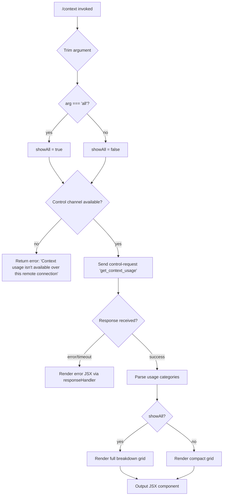

# `/context`

> Analysis basis: CC v2.1.199 bundle.js (AST extraction + Claude interpretation)
> Minimum version: v2.1.199

---

## Overview

The `/context` command visualizes the current context window usage as a colored grid, broken down by category (free space, autocompact buffer, system prompt, tools, MCP tools, memory files, messages, and more). It operates as a `local-jsx` command that dispatches a `control-request` to the thin client and renders a React JSX component showing proportional context consumption. When invoked with the `all` argument, an extended breakdown is displayed.

---

## Registration

| Field | Value |
|---|---|
| type | `local-jsx` |
| name | `context` |
| description | Visualize current context usage as a colored grid |
| argumentHint | `[all]` |
| thinClientDispatch | `control-request` |
| module_id | `q8l` |
| load_inline | `true` |
| loc_byte | `12133787` |
| loc_byte_end | `12134013` |
| loc_line | `8754` |
| arbor_handler.name | `lKf` |
| arbor_handler.fqn | `claude-2.1.199::lKf` |
| arbor_handler.kind | `AsyncFunction` |
| arbor_handler.resolution_path | `module_id` |
| arbor_handler.n_hits | `0` |

Analysis basis: CC v2.1.199 bundle.js:+12133787

---

## Input Branching

The command has 4+ distinct decision branches based on the argument value, the availability of a control channel, and the connection context.



Analysis basis: CC v2.1.199 bundle.js:+12132391, +12132416, +12132442, +12132469, +12132551, +12132611, +12132615

---

## Behavioral Spec

### Handler Entry: `lKf` (AsyncFunction)

```
async function contextCommandHandler(args, appContext):
    trimmedArg = args.trim()                          // +12132391
    showAll = (trimmedArg === "all")                  // +12132416

    if not appContext.hasControlChannel("controlChannel"):  // +12132442
        return error("Context usage isn't available over this remote connection")  // +12132469

    response = await appContext.sendControlRequest({   // +12132551
        event: "get_context_usage"                     // +12132581
    })

    // Register response listener via responseHandler  // +12132611
    responseComponent = buildResponseJSX(response)    // +12132615

    usageData = parseContextUsageResponse(response)
    displayGrid = buildContextGrid(usageData, showAll) // +12132711

    return renderJSX(displayGrid)                     // +12132884, +12132934
```

Analysis basis: CC v2.1.199 bundle.js:+12132385

### Sub-feature: Context Usage Grid Builder (`Hen` / `buildContextGrid`)

The grid builder (`Hen`) processes usage data into a set of proportional colored cells:

```
function buildContextGrid(usageData, showAll):
    categories = usageData.filter(...)                // +12130488
    systemEntry = categories.find(c => c.type === "system")  // +12130806

    // Categories observed in literals:
    // "Free space", "Autocompact buffer", "System prompt",
    // "System tools", "MCP tools", "Memory files",
    // "Messages", "Custom agents", "Skills", "Permission"

    for each category in categories:
        label = String(category.name)                 // +12131724
        pct   = wle(category.tokens, totalTokens)    // +12132223
        // wle uses Math.round (+225263) and Tl (+225260) for formatting

    renderSegments = buildSegmentList(categories, showAll)
    return renderSegments
```

Usage category labels confirmed in literals (bundle.js):
- `"Free space"` (+12130523)
- `"Autocompact buffer"` (+12130546)
- `"System prompt"` (inferred from `"system"` at +12132688)
- `"Project"` / `"User"` / `"Local"` / `"Flag"` / `"Policy"` / `"Plugin"` / `"Built-in"` — settings source labels (+12131492–+12131697)
- `"MCP tools"` (+11473513), `"Memory files"` (+11473831), `"Messages"` (+11474311), `"Custom agents"` (+11473764), `"Skills"` (+11473893)

Analysis basis: CC v2.1.199 bundle.js:+12130447, +12130488, +12130806, +12132143, +12132223

### Sub-feature: Percentage Formatter (`wle`)

```
function formatPercent(tokenCount, totalTokens):
    ratio = Math.round((tokenCount / totalTokens) * 100) / 100  // +225263
    formatted = Tl(ratio)   // locale-format helper (+225190)
    suffix = ".0"           // appended when ratio is integer (+225204)
    if ratio < 20:
        label = "< 20"      // +225243
    return formatted + suffix
```

Threshold: `20` (+225234), minimum display label `"< 20"` (+225243).
Analysis basis: CC v2.1.199 bundle.js:+225260, +225263

### Sub-feature: Control Channel Check (`checkControlChannel`)

```
function checkControlChannel(appContext):
    channelId = "controlChannel"                      // +12132442
    available = appContext.JM(channelId)              // Vl/JM helpers +12132424/+12132439
    return available
```

When the channel is absent (e.g., a remote thin-client connection that has no back-channel), the command immediately returns the error string rather than dispatching any network request.
Analysis basis: CC v2.1.199 bundle.js:+12132424, +12132439, +12132442, +12132469

### Sub-feature: `get_context_usage` Response Handler (`Nyt` / `responseHandler`)

```
function responseHandler(emitter, response):
    emitter.on("data", chunk => {                     // +9032217
        text = chunk.toString()                       // +9032254
        parsed = Oq(text)                             // Oq = response parser +9032281
        output = renderResponseJSX(parsed)            // +9032284
    })
```

The JSX renderer (`Oq`) branches between a "write" channel form (`sso`, +4025260) and an informational overlay form (`ioe`/`zoo`), with `ioe` querying the context details screen (`SRe`, +3994801) and `zoo` rendering the token counts (+3995246).
Analysis basis: CC v2.1.199 bundle.js:+9032217, +9032281

### Sub-feature: Full Context Breakdown (`Bsr` / `contextBreakdownRenderer`)

`Bsr` is the large context renderer reached from the handler (via `aKf` → `Bsr`, +12132934). It aggregates:

- **System prompt tokens** — via `uM` which collects tools, memory, environment info, skills, and agent listings (+14088215–+14089600)
- **Message history** — via `h9f` / `H9f` which processes message arrays with tool-use filtering (+11468112–+11469979)
- **MCP tool definitions** — via `p9f` / `f9f` / `g9f` (+11473043–+11467968)
- **Segment totals** — aggregated via `se.reduce` (+11474040) and `Math.round` / `Math.floor` (+11474730, +11474892)
- **Visual grid cells** — pushed to `vt` array (+11474981) for rendering

```
function contextBreakdownRenderer(conversationState, options):
    systemTokens   = countSystemPromptTokens(conversationState)  // uM +14088215
    messageTokens  = countMessageTokens(conversationState)       // h9f +11468112
    mcpTokens      = countMcpToolTokens(conversationState)       // p9f +11473043
    freeSpace      = contextLimit - (systemTokens + messageTokens + mcpTokens)

    segments = []
    segments.push({ label: "System prompt", tokens: systemTokens, color: "system" })
    segments.push({ label: "Messages",      tokens: messageTokens, color: "purple_FOR_SUBAGENTS_ONLY" })
    segments.push({ label: "MCP tools",     tokens: mcpTokens,    color: "cyan_FOR_SUBAGENTS_ONLY" })
    segments.push({ label: "Free space",    tokens: freeSpace,    color: "free" })

    total = segments.reduce((acc, s) => acc + s.tokens, 0)
    gridCells = segments.map(s => buildCell(s, total))  // Math.round +11474730
    return gridCells

function buildCell(segment, total):
    pct = Math.round((segment.tokens / total) * 100)    // +11474730
    width = Math.floor(pct)                             // +11474892
    return { label: segment.label, pct, width, color: segment.color }
```

Special color labels seen in literals: `"cyan_FOR_SUBAGENTS_ONLY"` (+11473540), `"purple_FOR_SUBAGENTS_ONLY"` (+11474337), `"warning"` (+11473917), `"claude"` (+11473861).
Analysis basis: CC v2.1.199 bundle.js:+11472178, +11473353, +11474040, +11474981

### Sub-feature: Compact-Boundary Marker (`$h` / `compactBoundaryHelper`)

```
function compactBoundaryHelper(messages):
    boundary = findCompactBoundary(messages)     // aar/xE +14318893
    slice    = messages.slice(boundary)          // +14318963
    return slice
```

Literal key: `"compact_boundary"` (+14318810).
Analysis basis: CC v2.1.199 bundle.js:+12132347, +14318810, +14318940

### Sub-feature: Context Limit Lookup (`Koe`)

```
function getContextLimit(modelConfig, envOverride):
    base   = Math.min(modelConfig.limit, envLimit)  // +5313585
    scaled = Nv(base)                               // model-specific limit via Nv +5313608
    result = f4(scaled, envOverride)                // final resolution via f4 +5313633
    return result
```

Relevant env var: `CLAUDE_CODE_MAX_OUTPUT_TOKENS` (+14181439), `CLAUDE_CODE_AUTO_COMPACT_WINDOW` (+5312738).
Analysis basis: CC v2.1.199 bundle.js:+11473320, +5313585

---

## State & Side Effects

| Item | Detail |
|---|---|
| Telemetry | None directly attributed to `/context` handler `lKf` in the traversal; indirect events from called helpers include `tengu_amber_creek` (+3615374), `tengu_pewter_brook` (+3615281), `tengu_orchid_mantis_v2` (+14083373), `tengu_silent_harbor` (+14088699), `tengu_amber_redwood2` (+5309062), `tengu_amber_redwood3` (+5309093) |
| Control channel dispatch | Sends `"get_context_usage"` event over the control channel (+12132551, +12132581) |
| Hook registration | None directly; `Ai`/`bfs.register` (+69837) is called during session logger setup inside `Sdu`, not scoped to this command |
| appState changes | Read-only — the command only reads context state, it does not mutate appState |
| Sound | None |
| Remote connection guard | Returns early with a user-facing error string when `"controlChannel"` is unavailable (+12132442, +12132469) |
| JSX render | Produces a local-jsx component; not streamed to the conversation history |

---

## Version History

| Version | Change |
|---|---|
| v2.1.199 | Initial analysis |

---

## Common Mistakes

1. **Running over a remote SSH/thin-client session with no back-channel**: The command guards for the absence of `"controlChannel"` and immediately returns `"Context usage isn't available over this remote connection"` — it will not render a grid in that environment.
2. **Expecting `/context` to modify the session**: The command is read-only; it queries and renders current usage but does not compact, prune, or otherwise alter the conversation state.
3. **Omitting the `all` argument expecting full detail**: Without `all`, only a compact grid is rendered. Pass `/context all` to see the per-category extended breakdown including deferred tools, agents, and skills.
4. **Interpreting percentage labels literally for small segments**: Segments below the 20-token-percent threshold are labelled `"< 20"` rather than their exact value (+225243); this is a display floor, not a data gap.
5. **Assuming this command works in non-interactive / pipe mode**: The command renders a JSX component intended for an interactive terminal UI; in pipe or SDK modes the visual output may not be meaningful.

---

## Appendix — Identifier Mapping

> For bundle debugging only. Identifiers change across versions.

| Identifier | Role |
|---|---|
| `lKf` | Main handler for `/context` (AsyncFunction, resolved via module_id `q8l`) |
| `zs` | Environment/capability detection orchestrator (fullscreen, iTerm, tmux, Windows SSH guards) |
| `oO` | Feature-flag set membership check |
| `hD` | Feature-flag enabled check (`fOi.isEnabled`) |
| `nno` | Local-agent string builder (`at` → `String`) |
| `Wre` | Terminal environment resolver (calls `eYd`) |
| `eYd` | iTerm/tmux control-mode detector (`Z7d`, `g_e`, `tVi.spawnSync`) |
| `Z7d` | Terminal string prefix checker (`e.startsWith`) |
| `g_e` | tmux client control mode probe (`LWu`, `hHn`, `e.includes`) |
| `T` | Logging / debug output helper (`NBe`, `gdu`, `Nc`, `ntt`, `Sdu`) |
| `Nc` | Path formatter / redactor (`phs`, `e.replace`, `r.at`, `n.lastIndexOf`) |
| `Sdu` | Session logger (writes to file, registers process exit, `bfs.register` via `Ai`) |
| `Let` | Debounced flush helper (`clearTimeout`, `setTimeout`, `setImmediate`, join buffers) |
| `tno` | Boolean converter for control-mode detection |
| `Lr` | Settings loader orchestrator (`CV`) |
| `CV` | Settings-load coordinator (`C0`, `Sa`, `IUr`, `t9`) |
| `IUr` | Incremental settings loader (date-based, `Date.now`, `HV`, `NLe`) |
| `t9` | Settings merger (merges `ar`, `hBe`, `uCr`, `Eet`, … multiple source types) |
| `tYd` | Context-viewer startup / fullscreen guard |
| `ot` | Conversation-state accessor (`hBt`, `HBt`, `HG`, `wDn`, `Mt`) |
| `wDn` | Message deduplication helper (`YZr.has`, `bke.get`, `KZr`, `eeo`) |
| `Vl` | Control-channel existence checker (`jte`) |
| `JM` | Control-channel lookup helper |
| `Nyt` | Response event listener constructor (`o.on`, `i.toString`, `Oq`) |
| `Oq` | Response parser / JSX dispatcher (`Koo`, `sso`, `ioe`) |
| `sso` | Write-channel JSX renderer (`oQi.createElement`) |
| `ioe` | Context details overlay renderer (`hD`, `SRe`, `zoo`) |
| `SRe` | Context details screen builder (`Wre`, `Xno`, `zs`, `hD`, `at`, `ot`) |
| `zoo` | Token-count display component (`hD`, `at`, `ot`) |
| `Hen` | Context usage grid builder (filters, finds system entry, builds segments) |
| `Tl` | Locale number formatter (uses `"en-US"`, `"compact"`) |
| `wle` | Percentage formatter (`Math.round`, `Tl`) |
| `ge` | String coercion helper (`String`) |
| `aKf` | Context breakdown entry point (calls `$h`, then `Bsr`) |
| `$h` | Compact-boundary slicer (`aar`, `xE`, `e.slice`) |
| `aar` | Compact boundary finder (uses `xE`) |
| `Bsr` | Full context breakdown renderer (aggregates all token categories) |
| `uR` | Model/provider resolution (calls `W6`, `yb`, `N$`, `U$`, `za`, `qne`, `VV`, `Bo`, `rA`) |
| `W6` | Model selection helper (`u_`, `x3`, `ts`, `za`) |
| `za` | Model normalization (`mOt`, `gOt`, `qne`, `VV`, `Zi`, `Bo`, `Uw`, …) |
| `Nv` | Context limit lookup (calls `yc`) |
| `yc` | Per-model context limit resolver (`HT`, `GLe`, `kn`, `Mt`) |
| `f4` | Auto-compact window resolver (`io`, `Ty`, `mS`, `ppe`, `hTp`, `Efo`, `mTp`) |
| `mS` | Compact window config parser (`_Pi`, `kXr`, `yPi`) |
| `uM` | System prompt token counter (tools, memory, env, agents, MCP) |
| `Hir` | Tool serializer for token counting (`jTt`, `Dt`, `Object.values`, `T`) |
| `oSm` | Per-session-memory token accumulator |
| `JBt` | CLAUDE.md / memory-file loader and serializer |
| `fSm` | Per-server MCP tool token accumulator (`Ag`, `lXo`) |
| `pSm` | Environment info token counter (`uXo`, `Ag`, `lXo`, `Dt`, `Ym`, `cXo`) |
| `h9f` | Message token counter (main history loop) |
| `H9f` | Message token counter (parallel path, `bUe`, `Lf`, `xe`) |
| `lTt` | Per-message token estimator (`rVe`, `T`, `ge`, `ke`, `W3o`) |
| `rVe` | Tool-result token estimator (`Q3o`, `s3l`, `Y3o`, `ks`, `dq`, …) |
| `W3o` | Attachments / resource token estimator |
| `A9f` | Segment accumulator (`y9f`, `E9f`, `S9f`, `lTt`, `BR`) |
| `BR` | Full message-list compiler (assembles final message array sent to API) |
| `Xsr` | System-prompt section serializer (compiles all system prompt blocks) |
| `Koe` | Effective context limit resolver (`Math.min`, `wBn`, `Nv`, `f4`) |
| `Lf` | Token rounding helper (`Math.round`) |
| `xe` | JSON serializer (`JSON.stringify`) |
| `at` | String converter (`String`) |
| `Ul` | String coercion (`String`) |
| `Pe` | GZe-based utility (feature gate helper) |
| `qr` | Module export bootstrap (`q2e`, `uTr`, `Fln.call`, …) |
| `kt` | Aw-based logging sink |
| `Aw` | Core async/logging primitive |
| `sr` | Error stringifier (`Error`, `String`) |
| `ke` | Error logger with stack push (`sr`, `at`, `Pi`, `Gku`, `knt.push`, `fne.logError`) |
| `cn` | MCP debug logger (`knt.push`, `fne.logMCPDebug`) |
| `pu` | MCP error logger (`knt.push`, `fne.logMCPError`) |
| `Le` | V/Pe utility pair |
| `we` | V/Pe utility pair |
| `Et` | V/Pe utility pair |
| `Mz` | Lr-based settings accessor |
| `D3` | Conversation state accessor (used by `h9f`, `g9f`) |
| `dd` | Tool-use deduplication helper |
| `q0` | Schema validator (`Mt`, `son`, `Object.hasOwn`, `eGi`) |

Note: index built via Arbor fallback; some signals (telemetry, literals) may be missing — see arbor-fallback.js.