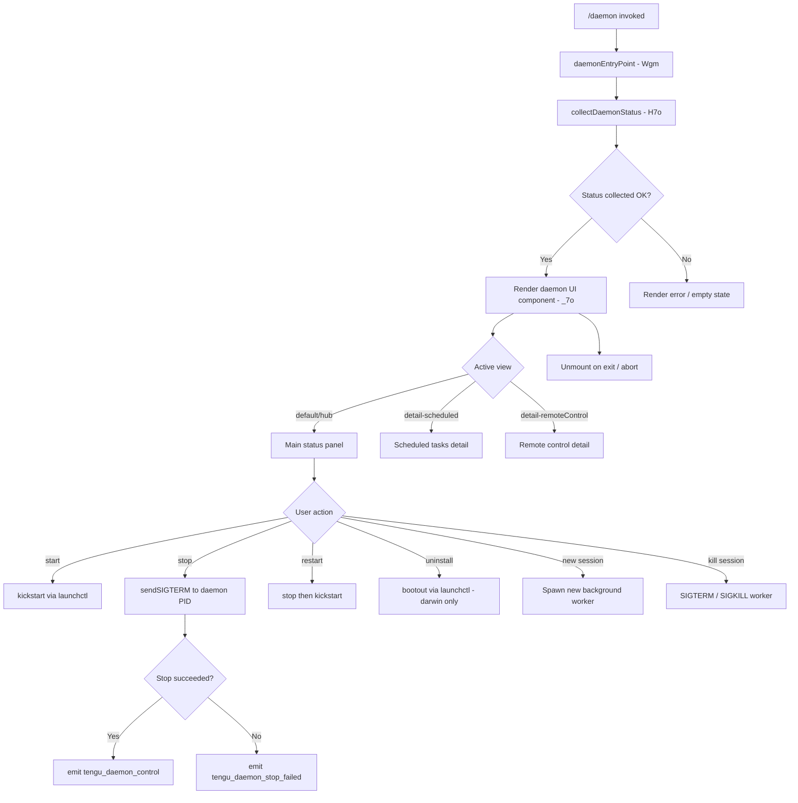

# `/daemon`

> Analysis basis: CC v2.1.199 bundle.js (AST extraction + Claude interpretation)
> Minimum version: v2.1.199

---

## Overview

The `/daemon` command provides an interactive management interface for the Claude Code background daemon process and its subordinate subsystems. It allows the user to inspect daemon status, control the service lifecycle (start, stop, restart, uninstall), and drill into detail views for scheduled tasks and remote-control sessions. The command renders a JSX-based terminal UI that remains live while the user interacts with it.

---

## Registration

| Field | Value |
|---|---|
| type | `local-jsx` |
| name | `daemon` |
| description | `Manage background services and routines` |
| immediate | `true` |
| module_id | `y7o` |
| load_inline | `true` |
| loc_byte | `13671659` |
| loc_byte_end | `13671827` |
| loc_line | `10091` |
| arbor_handler.name | `Wgm` |
| arbor_handler.fqn | `claude-2.1.199::Wgm` |
| arbor_handler.kind | `AsyncFunction` |
| arbor_handler.resolution_path | `module_id` |
| arbor_handler.n_hits | `0` |

Analysis basis: CC v2.1.199 bundle.js:+13671659

---

## Input Branching

The command has more than three distinct UI states/branches driven by view selection and sub-command dispatch.



---

## Behavioral Spec

### Entry Point and Handler Resolution

The Arbor symbol graph resolves the handler to `Wgm` (FQN: `claude-2.1.199::Wgm`, kind: `AsyncFunction`, resolution path: `module_id`). The registration block at bytes 13671659–13671827 specifies `load_inline: true` with `module_id: "y7o"`, meaning the handler is not imported by name at the call site but is resolved through the module export table.

Analysis basis: CC v2.1.199 bundle.js:+13671659

### Top-Level Daemon Entry (Wgm)

```
async function daemonEntryHandler(args, context):
    statusData = await collectDaemonStatus()        // H7o
    render JSX daemonUI component                   // nu.jsx
    registerCleanup via Ehc
    return
```

Analysis basis: CC v2.1.199 bundle.js:+13661508

### Daemon Status Collection (H7o)

`H7o` is the central aggregator that fans out to gather all daemon status signals in parallel using `Promise.all`.

```
async function collectDaemonStatus():
    results = await Promise.all([
        readScheduledTasksStatus(),   // mhc → avt
        readWorkerRosterStatus(),     // ahc → vJe, Wj, vk
        readForegroundDaemonStatus(), // Vfc → Qs, Bnn
        readScheduledDaemonStatus(),  // Egc → ygc
        readRosterFile(),             // p5 → zie/Kie
        getProcessUID(),              // xee → Un → Flr → WVl
        // plus: vk (stop helper), Promise.resolve sentinel
    ])
    return aggregated status object
```

Key status file paths extracted from literals:
- `daemon.json` — per-project daemon configuration (bundle.js:+12176600)
- `daemon.status.json` — foreground daemon PID/status (bundle.js:+13470522)
- `daemon.scheduled.status.json` — scheduled daemon PID/status (bundle.js:+13565867)
- `roster.json` — background worker roster (bundle.js:+12183554)
- `state.json` — per-worker state file (bundle.js:+18536659)

Analysis basis: CC v2.1.199 bundle.js:+13661028

### Scheduled Tasks Reader (mhc / avt / Hzo)

```
async function readScheduledTasks():
    tasks = await Promise.all([
        readTaskFile(path),         // avt → Hzo
        filterByKind("scheduled"),  // Kzo
        buildTaskList(),            // Vzo
    ])
    // File size limit: 1048576 bytes (bundle.js:+13471343)
    // Encoding: "utf8" (bundle.js:+13471462)
    // Parses JSON; validates Array.isArray
    // Each entry stamped with kind "scheduled"
    return tasks
```

Analysis basis: CC v2.1.199 bundle.js:+13655892

### Worker Kill Helper (vk / vee / Y6o)

```
async function stopWorker(pid, pidFilePath):
    stat = await lstat(pidFilePath)
    if stat is not a regular file:
        await rm(pidFilePath, { force: true })  // size limit 65536 (bundle.js:+12175100)
        return

    content = await readFile(pidFilePath)
    parsed = parseUtf8(content)
    // Read last N lines from log tail (Y6o: t.split, n.slice)
    process.kill(pid, signal)   // SIGTERM first, SIGKILL on escalation
    await waitForExit(jI)
```

Signal constants observed:
- `SIGTERM` (bundle.js:+18531010)
- `SIGKILL` (bundle.js:+18529012)

Escalation: SIGKILL is sent after a grace period if SIGTERM does not produce exit. Telemetry event `tengu_bg_dispatch_sigkill_escalate` is emitted on SIGKILL escalation (bundle.js:+18528964).

Analysis basis: CC v2.1.199 bundle.js:+12176134

### Foreground Daemon Control (Vfc / Bnn)

```
async function controlForegroundDaemon(action):
    store = getAsyncLocalStore()          // Qs → EId.getStore
    statusPath = buildPath("daemon.status.json")   // Bnn
    pidContent = await readFile(statusPath)
    parsed = decodeUTF8(pidContent)       // Wa

    switch action:
        case "start":
            // launchctl kickstart (bundle.js:+12179051)
        case "stop":
            process.kill(pid, "SIGTERM")
        case "restart":
            process.kill(pid, "SIGTERM")
            await waitForExit()
            // launchctl kickstart
        case "uninstall":
            // launchctl bootout (bundle.js:+12178688)
            // Note: only darwin (bundle.js:+12179699)
            // "service uninstall not available on darwin" message on other platforms (bundle.js:+12178820)

    await waitWithTimeout(jI)
    // Timeout: daemon did not exit within 10s of SIGTERM; restart aborted before kickstart
    //   (bundle.js:+12179373)
```

Analysis basis: CC v2.1.199 bundle.js:+13470809

### Scheduled Daemon Control (Egc / ygc)

```
async function controlScheduledDaemon():
    statusPath = buildPath("daemon.scheduled.status.json")  // ygc
    content = await readFile(statusPath)                    // hgc.readFile
    pid = parseStatus(content)                              // Wa
    process.kill(pid, signal)
    await waitForExit(jI)
```

Analysis basis: CC v2.1.199 bundle.js:+13566075

### Worker Roster Reader (p5)

```
async function readRosterFile(rosterDir):
    rosterPath = buildRosterPath(rosterDir)  // zie → fg.join; Kie → fg.join + tr
    stat = await lstat(rosterPath)           // bge.lstat

    if not stat.isFile():
        throw Error("is not a regular file — removing")   // bundle.js:+12187961
        // Error codes checked: E2BIG (bundle.js:+12188087), EFTYPE (bundle.js:+12188099)

    // Rotate if oversized (Len → Date.now, qlr → bge.rename)
    raw = await readFile(rosterPath)        // bge.readFile
    decoded = decodeUtf8(pn)
    parsed = JSON.parse(Wt)

    // Validate schema: tql → Array.isArray, Object.keys
    // Merge with existing state: $o → Object.assign
    // Log error on parse failure: sr
    // Telemetry: tengu_bg_roster_parse_failed (bundle.js:+12188007)
    //   message: "bg roster.json read/parse failed" (bundle.js:+12188329)

    return rosterEntries
```

Analysis basis: CC v2.1.199 bundle.js:+12187814

### Process UID Detection (xee / Un / Flr / WVl)

```
async function getProcessUID():
    uid = process.getuid()     // WVl (bundle.js:+12176984)
    // Uses launchctl print to inspect service state
    // launchctl command with args ["print"] (bundle.js:+12180208)
    // timeout: 5000 ms (bundle.js:+12180242)
    return uid
```

Analysis basis: CC v2.1.199 bundle.js:+12180192

### UI Component (_7o / Wgm)

The JSX component `_7o` manages the interactive daemon management view.

```
function DaemonUIComponent(props):
    [view, setView] = useState("hub")   // c7.useState; hub (bundle.js:+13661767)
    clock = useClock($s)                // DJi.useContext; throws if no ClockProvider
    now = Date.now()
    startedAt = s.now

    // Register keyboard handler (Zc → Pq.useRef/useContext/useMemo)
    inputRef = useRef()

    // Kill-all handler (H):
    //   for each process in values: send SIGTERM
    //   literal: "SIGTERM" (bundle.js:+18531010)

    // Background worker manager (h):
    //   spawn new worker: m7.spawn
    //   kill worker: B.kill → SIGTERM then SIGKILL
    //   Telemetry on create: tengu_bg_session_create (bundle.js:+18528779)
    //   Grace window: 30s before SIGKILL (bundle.js:+18528919), retry 15s (bundle.js:+18528930)
    //   Retry limit: 100 attempts (bundle.js:+18529039)
    //   Status labels: "spawned", "claimed", "spare", "exec", "working",
    //                  "active", "done", "killed", "failed", "crashed",
    //                  "blocked", "bg", "resuming" (various loc_bytes)

    // Sweeper/ticker (k):
    //   setInterval loop
    //   On tick: reload config (Eos), prune stale workers (Lin),
    //   check spare capacity, dispatch background sessions
    //   Watch filesystem changes: N.watch (add/change/unlink) (bundle.js:+17510157)

    // Launch/stop service (sIt):
    //   On "start":  launchctl kickstart
    //   On "stop":   launchctl bootout (darwin-only uninstall path)
    //   Unlink PID file: Lee.unlink (bundle.js:+12178728)

    // Scheduled restart (Ten → eGo):
    //   Flr → WVl (process.getuid)
    //   Un (launchctl print)
    //   GVl.setTimeout for deferred kickstart (bundle.js:+12179329)

    // View routing:
    switch view:
        case "hub":              render MainStatusPanel
        case "detail-scheduled": render ScheduledDetailPanel  // literal bundle.js:+13662260
        case "detail-remoteControl": render RemoteControlPanel // literal bundle.js:+13662400

    // Remote control section uses view key "remoteControl" (bundle.js:+13662509)
    // Section labels: "Scheduled" (bundle.js:+13662790),
    //                 "Remote Control" (bundle.js:+13663076),
    //                 "Claude daemon" (bundle.js:+13663350)
    // Permission panel key: "permission" (bundle.js:+13663438)

    // Exit: p → process.exit on "forced shutdown" (bundle.js:+18565426)
    //        u.abort on cancel
    //        EI signal

    unmountOnExit(i.unmount)
```

Analysis basis: CC v2.1.199 bundle.js:+13661640

### Background Worker Sweep / Scheduler (k / Eos)

The sweeper loop runs on `setInterval` and performs the following on each tick:

```
function backgroundWorkerSweep():
    clearInterval(previousTimer)
    workers = getActiveWorkers().filter(isEligible)

    for each worker:
        Eos(worker):          // full lifecycle handler
            pWc(worker)       // check/acquire lock; write exclusion file
            // Reads log: sLt.readFile (utf-8, bundle.js:+17504085)
            // Appends to log: sLt.appendFile
            // Level constants: "info", "exclude" (bundle.js:+17504032/39)
            mWc(worker)       // persist state: Dae.writeFile ("wx" flag, bundle.js:+17505067)
            // EEXIST guard: ignore if already exists (bundle.js:+17505105)
            gWc(worker)       // read current worker state
            yos(worker)       // signal Anthropic backend (Ai, Lin)
            if done: AT(worker) → process.kill  // bundle.js:+2360806
            jI(worker)        // wait for exit
            Dae.unlink(lockFile)   // release lock
            // Log: "[ScheduledTasks] released scheduler lock" (bundle.js:+17506239)

    Lin()                     // cleanup finished workers
    D.write(status)           // write transient status (bundle.js:+18551108)
    // Yield log: "yielding to a foreground/service daemon — bg workers will be re-adopted"
    //   (bundle.js:+18551161); telemetry: tengu_daemon_yield (bundle.js:+18551243)

    // Config reload: telemetry tengu_daemon_config_reload (bundle.js:+18546460)

    rAe()   // build roster path: Z2n.join (bundle.js:+5137345)
    setInterval(sweep, interval)

    // Watch events registered: "add", "change", "unlink" (bundle.js:+17510350/377/407)
```

Analysis basis: CC v2.1.199 bundle.js:+17509800

### Memory Pressure Handler (N / sCe / Tuc)

The filesystem watcher callback `N` runs periodic health checks:

```
async function watcherHeartbeat():
    now = Date.now()
    for each worker in G.values():
        worker.shiftGraceClocksForward()

    checkMemory(sCe):
        // platform: "macos" (bundle.js:+13272070)
        freemem = buc.freemem()
        // Retire grace bridge min: tengu_bg_retire_grace_bridged_min
        // Retire timeout: 480 cycles (bundle.js:+13272618), 60000ms (bundle.js:+13272623)
        // tengu_bg_attach_upgrade on re-attach

    checkTelemetryConfig(Tuc):
        // ot → telemetry dispatch (bundle.js:+13272579)
        // vpr → (bundle.js:+13272651)

    // Low memory path:
    //   log: "bg: low memory persists after shedding non-pinned — retiring pinned settled workers as a last resort"
    //     (bundle.js:+18534181)
    //   telemetry: tengu_bg_retire_pinned_low_mem
    //   worker limits checked: 3, 12 (bundle.js:+18534446/452)
    //   issue URL: "https://github.com/anthropics/claude-code/issues" (bundle.js:+18534836)
    //   package: "@anthropic-ai/claude-code" v2.1.199 (bundle.js:+18534719/809)

    // Prewarm: "prewarm" tagged workers (bundle.js:+18535029)
    //   tengu_bg_prewarm_per_sweep

    Y.has(workerId) check before respawn
    await Promise.all(retireIfSettled tasks)

    // Bn — error boundary (bundle.js:+866460)
    // re.retireIfSettled, se.respawnIfIdleStale
    // ot → telemetry batch
```

Analysis basis: CC v2.1.199 bundle.js:+18533670

### Connection / Claim Dispatch (h / wcs / Mcs)

```
async function dispatchWorkerConnection(workerId):
    // h — main hub handler
    phe → at (resolve path)
    if worker not in map: mkdir(Wd.mkdir)
    ven → (fg.join + Kie) = host-managed path (bundle.js:+12183741)
    writeFile(Wd.writeFile) — write tombstone, limit 448 bytes (bundle.js:+18528707)
    telemetry: tengu_bg_session_create (bundle.js:+18528779)
    telemetry: host_tombstone_write (bundle.js:+18528806)

    if duplicate:
        status = "dropped" (bundle.js:+18528830)
        telemetry: dup_retry_exhausted after 100 retries (bundle.js:+18529374)
        // "dup-live" tag (bundle.js:+18529445)

    B.kill() on existing → SIGTERM (grace 30s) then SIGKILL (15s)
    On timeout: waitWithAbort(On, 100ms)

    // wcs — socket claim
    m7.claim() — acquire socket lock
    aQo → socket auth path
    phe → at path resolution
    bQm / AQm → socket bind options
    o.socketAuth — validate auth token
    fbr.connect(socketPath) — IPC connect
    i.on("connect") / i.once("kill") / i.write() / mM / i.end()
    telemetry: tengu_bg_sendclaim_failed on failure (bundle.js:+18521835)

    // Mcs — session lifecycle
    r.add(sessionId)
    i.finally(() => r.delete(sessionId))
    Bl / mr / Yi / Qg — state machine transitions
    Wd.access + Dcs.join → check state.json accessible (bundle.js:+18536648/659)
    rn on path error
    JRe / op / uIt — handoff phases
    Wd.unlink → remove state.json on done
    wen / t.rosterEntry / jt → roster bookkeeping
    kIe / _M / wk / mP / Ree / Cen — worker lifecycle callbacks
    setTimeout(cleanupStale, 300000)  // 5 min GC (bundle.js:+18538297)
    telemetry: tengu_bg_handoff_settle (bundle.js:+18536348)
    telemetry: tengu_bg_spare_enable (bundle.js:+18530360)
    telemetry: tengu_bg_spare_claim (bundle.js:+18530488)
    telemetry: tengu_bg_spare_claim_fail (bundle.js:+18530754)
```

Analysis basis: CC v2.1.199 bundle.js:+18528639

### Spend / Billing Guard (a / Whe)

A middleware layer intercepts API responses before they reach the daemon:

```
function spendGuardMiddleware(request, context):
    Whe(request)   // JSON.stringify the request body for logging
    switch context.reason:
        case "spend.blocked":    → block and surface error
        case "store_error":      → "spend limit unavailable" (bundle.js:+18345802)
        case "spend limit reached":  → surface limit message (bundle.js:+18345828)
        case "billing_error":    → billing error path
    if statusCode == 429 and header "x-should-retry": retry
    return Response.json(result)
```

Analysis basis: CC v2.1.199 bundle.js:+18345723

---

## State & Side Effects

| Item | Detail |
|---|---|
| Telemetry: tengu_bg_roster_parse_failed | Fired when `roster.json` cannot be read or parsed (bundle.js:+12188007) |
| Telemetry: tengu_feature_ok | Feature flag check passed (bundle.js:+1039941) |
| Telemetry: tengu_feature_bad | Feature flag check failed (bundle.js:+1040008) |
| Telemetry: tengu_daemon_control | Emitted after a daemon start/stop/restart action (bundle.js:+18569105) |
| Telemetry: tengu_daemon_config_reload | Config reloaded during sweep (bundle.js:+18546460) |
| Telemetry: tengu_daemon_yield | Daemon yielded to a foreground service (bundle.js:+18551243) |
| Telemetry: tengu_voice_circuit_breaker_tripped | Voice input failed repeatedly, paused (bundle.js:+15415726) |
| Telemetry: tengu_voice_recording_started | Voice recording session opened (bundle.js:+15417293) |
| Telemetry: tengu_voice_stream_early_retry | Voice stream connection retried early (bundle.js:+15418847) |
| Telemetry: tengu_bg_retire_grace_bridged_min | Worker retired during low-memory grace period (bundle.js:+13272582) |
| Telemetry: tengu_bg_retire_pinned_low_mem | Pinned workers retired under sustained low memory (bundle.js:+18534292) |
| Telemetry: tengu_bg_attach_upgrade | Worker re-attached/upgraded after memory event (bundle.js:+13272654) |
| Telemetry: tengu_bg_prewarm_per_sweep | Prewarm workers spawned per sweep cycle (bundle.js:+18534417) |
| Telemetry: tengu_bg_dispatch_sigkill_escalate | SIGTERM grace expired; SIGKILL sent to worker (bundle.js:+18528964) |
| Telemetry: tengu_bg_dispatch_low_mem | Worker dispatch deferred due to low memory (bundle.js:+18529670) |
| Telemetry: tengu_bg_spare_enable | Spare worker slot enabled (bundle.js:+18530360) |
| Telemetry: tengu_bg_sendclaim_failed | Socket claim send failed (bundle.js:+18521835) |
| Telemetry: tengu_bg_handoff_settle | Background session handoff settled (bundle.js:+18536348) |
| Telemetry: tengu_bg_spare_claim | Spare worker claimed successfully (bundle.js:+18530488) |
| Telemetry: tengu_bg_spare_claim_fail | Spare worker claim attempt failed (bundle.js:+18530754) |
| Filesystem writes | `daemon.json`, `daemon.status.json`, `daemon.scheduled.status.json`, `roster.json`, `state.json` managed under project data directories |
| Process signals | Sends `SIGTERM` and `SIGKILL` to daemon PID and background worker PIDs |
| launchctl integration | Uses `launchctl kickstart`, `print`, `bootout` on macOS (`darwin`) only |
| IPC socket | `fbr.connect` establishes Unix socket connection for worker claim |
| setInterval sweep | Recurring heartbeat manages worker lifecycle, memory pressure, and scheduler lock |
| React/Ink render | `nu.jsx` renders live terminal UI; `i.unmount` called on command exit |
| appState changes | Background worker map updated via `i.set` / `i.delete`; clock context required (`$s` throws if missing) |
| Sound | <!-- TODO: not found in depth-2 traversal; needs --depth 4 --> |

---

## Version History

| Version | Change |
|---|---|
| v2.1.199 | Initial analysis |

---

## Common Mistakes

1. **Running on non-macOS and expecting full lifecycle control**: The `uninstall` (launchctl `bootout`) and `kickstart` paths are macOS (`darwin`) only. On other platforms, the service control sub-commands are not available and will surface the literal message `"service uninstall not available on darwin"` or equivalent.
2. **Expecting immediate daemon stop**: The stop path sends `SIGTERM` and then waits. If the daemon does not exit within 10 seconds, restart is aborted and the UI will report a timeout (`"daemon did not exit within 10s of SIGTERM; restart aborted before kickstart"`). A forced SIGKILL is only issued for background *workers*, not the top-level daemon, in this path.
3. **Missing ClockProvider context**: The `useClock` hook (`$s`) throws `"useClock must be used within a ClockProvider"` if the component is rendered outside the expected provider tree. This is a bug indicator during embedding or testing, not a user-facing error path.
4. **Stale `roster.json`**: If the roster file contains a non-file entry (symlink, directory), the reader removes it and logs `tengu_bg_roster_parse_failed` with `"bg roster.json read/parse failed"`. The UI may show no workers until the next sweep.
5. **5-minute stale GC window**: Background session records are not cleaned up immediately on failure — a `setTimeout` of 300 000 ms (5 minutes) is used for GC (bundle.js:+18538297). Apparent stale sessions in the UI may still be present during this window.

---

## Appendix — Identifier Mapping

> For bundle debugging only. Identifiers change across versions.

| Identifier | Role |
|---|---|
| `Wgm` | Main async handler for `/daemon` (arbor_handler, entry point) |
| `Jgm` | Secondary entry / JSX render wrapper for daemon command |
| `H7o` | Parallel status aggregator (Promise.all fan-out) |
| `_7o` | Daemon UI React/Ink component |
| `mFe` | Pre-flight / setup helper called by status aggregator |
| `mhc` | Scheduled tasks collection coordinator |
| `avt` | Task file reader and kind-tagger |
| `Hzo` | Low-level task JSON file reader (stat, readFile, JSON.parse) |
| `Kzo` | Task array validator (Array.isArray guard) |
| `ke` | Error recording / stderr helper |
| `sr` | Error constructor wrapper |
| `at` | String coercion utility |
| `Pi` | Essential-traffic traffic-class setter |
| `Gku` | Queue rotate helper (shift/push) |
| `vk` | Worker kill coordinator (stop + wait) |
| `vee` | PID file lstat / rm / readFile helper |
| `Y6o` | Log tail reader (readFile, split, slice) |
| `jI` | Process exit waiter / timeout wrapper |
| `ahc` | Worker roster and concurrent control dispatcher |
| `vJe` | Status file reader with ENOENT guard |
| `rn` | Error normalizer / rethrow helper |
| `Qs` | AsyncLocalStorage store accessor |
| `m7o` | Path helper for status directory |
| `f7o` | Base status path builder |
| `ge` | String coercion (String cast) |
| `Wj` | daemon.json path builder (X6o.join + tr) |
| `Vfc` | Foreground daemon control (read PID, kill, wait) |
| `Bnn` | daemon.status.json path builder (Gfc.join + tr) |
| `Egc` | Scheduled daemon control (read PID, kill, wait) |
| `ygc` | daemon.scheduled.status.json path builder (Hgc.join + tr) |
| `p5` | Roster file reader with rotation and schema validation |
| `zie` | Roster directory path builder |
| `Kie` | Roster base path builder (fg.join + tr) |
| `qe` | Feature flag check (GZe) |
| `GZe` | Feature flag evaluator |
| `qlr` | Roster file rotation helper (rename, Date.now) |
| `Len` | Rotation timestamp helper (Date.now) |
| `Wt` | JSON.parse wrapper |
| `pn` | UTF-8 decoder (rn path) |
| `$o` | Object.assign merger |
| `_d` | Path normalizer (rn) |
| `t6` | State key helper |
| `tql` | Roster schema validator (Array.isArray, Object.keys) |
| `Yet` | State merger (_d, t6, Zf) |
| `Zf` | Feature flag sub-check (GZe) |
| `Ro` | Feature flag UI renderer (GZe) |
| `xee` | Process UID and launchctl status gatherer |
| `Un` | launchctl print executor |
| `Wr` | Exec-file wrapper (spawn subprocess) |
| `Dt` | Process argument builder |
| `Flr` | UID resolver wrapper |
| `WVl` | `process.getuid()` caller |
| `Ehc` | Cleanup/unmount registrar |
| `hpe` | Command output renderer |
| `Dje` | Command dispatcher / model selector |
| `rIp` | Model list renderer |
| `T` | Terminal output writer (o.write / o.flush) |
| `Nce` | Model selection action handler |
| `K6` | Model preference persister |
| `io` | Application-inference-profile handler |
| `Bo` | Model metadata builder (trim, toLowerCase, etc.) |
| `oIp` | Model option list builder |
| `b_a` | Model tier display helper |
| `MH` | Model header renderer |
| `Whe` | Spend guard request serializer (JSON.stringify) |
| `$s` | Clock context hook (DJi.useContext; throws without ClockProvider) |
| `Zc` | Keyboard input hook (Pq.useRef/useContext/useMemo/setTimeout) |
| `u` | UI event loop driver (Le, we, n2, w8) |
| `Le` | Normal exit path (V, Pe) |
| `Pe` | Exit code resolver (GZe) |
| `we` | Error exit path (V, Pe) |
| `n2` | Session event emitter (hG, B6e, qZr) |
| `qZr` | Event UUID generator (jZr.randomUUID, clt, cG, e.emit) |
| `w8` | Shutdown sequencer (Promise.race, Promise.all, yEe, wEe, On, process.exit) |
| `yEe` | Telemetry shutdown (_Ee.shutdown) |
| `wEe` | Timeout clearer (clearTimeout, XJo) |
| `On` | Abort-with-timeout helper (setTimeout, clearTimeout, s.unref) |
| `Wfc` | Daemon start writer (Qne, Date.now, Qs, Bnn, xe) |
| `Qne` | Socket path builder (fye → ece, t.trim) |
| `xe` | JSON.stringify wrapper |
| `H` | Kill-all handler (o.values, U.kill) |
| `m` | Worker filter (qAr, Array.isArray, k.filter) |
| `qAr` | Path prefix stripper (t.startsWith, t.slice, r.replace) |
| `k` | Background worker sweep loop (clearInterval, setInterval, Eos, Lin, D, rAe, N.watch, I.on, h.clear) |
| `Eos` | Per-worker lifecycle handler (pWc, ol, kt, Qne, mWc, yos, gWc, AT, jI, Dae.unlink, vin, xe) |
| `pWc` | Lock-file acquire and log appender (dWc.has/add, O0, b6, sLt.readFile/mkdir/appendFile) |
| `ol` | Log level `Aw` helper |
| `kt` | Log destination `Aw` helper |
| `mWc` | State file writer (vin, xe, Dae.writeFile "wx", rn, Dae.mkdir, win.dirname) |
| `yos` | Backend signal sender (Ai, Lin) |
| `gWc` | Worker state reader (Dae.readFile, vin, hGm, Wa) |
| `vin` | Worker path builder (win.join, ol) |
| `AT` | Worker process kill (process.kill) |
| `Lin` | Worker cleanup (kt, gWc, Dae.unlink, vin, T) |
| `D` | Transient status writer (d.write, V) |
| `d` | Supervisor write channel (vJe, r.write, ihc, i.get/stop/delete/set/start, iru, I.start, V) |
| `rAe` | Roster path builder (Z2n.join, ol) |
| `N` | Filesystem watcher callback / heartbeat |
| `G` | Worker map (G.values) |
| `Z` | Worker state machine (shiftGraceClocksForward, respawnIfIdleStale, retireIfSettled, startRecording, etc.) |
| `O` | Permission state accessor (i.getState, $rt, kSt, s5) |
| `sCe` | Memory/platform checker (cum, jt, buc.freemem, pum; "macos") |
| `Tuc` | Telemetry config checker (ot) |
| `HWe` | Old lock file cleaner (IE.lstat/rm/readFile, Wt, Array.isArray, pn, Aup) |
| `Y` | Worker registry map (f, K) |
| `Bn` | Error boundary wrapper (t) |
| `re` | Retired worker collection (g) |
| `vpr` | Telemetry pre-reporter (ot) |
| `ot` | Telemetry batch dispatcher (hBt, HBt, HG, bke.has, wDn, mBt.add, _q.has/get, Mt) |
| `se` | Worker state collection (Z, re, b, w) |
| `I` | Input handler (Math.max/floor, R.preventDefault, b) |
| `R` | HTTP request handler / OAuth + gateway router |
| `b` | Auth token validator (KAr, qAr, H.userinfo, Error) |
| `h` | Worker host manager (phe, Wd.mkdir/writeFile/unlink/access, ven, Sge, ke, we, B.kill, On, Le, sCe, HWe, wcs, Mcs, m7.spawn, etc.) |
| `phe` | Socket path resolver (at) |
| `ven` | Host-managed path builder (fg.join, Kie) |
| `Sge` | Secondary host path builder (fg.join, ven) |
| `B` | Worker process handle (i, U) |
| `Q` | Worker retire helper (vee, FVl) |
| `wcs` | Socket claim handler (m7.claim, aQo, phe, bQm, AQm, fbr.connect, i.on/once/write/end, mM) |
| `Mcs` | Session lifecycle manager (r.add/delete, Bl, mr, Yi, Qg, Wd.rm/unlink/access, JRe, op, uIt, wen, kIe, _M, wk, mP, Ree, Cen, setTimeout) |
| `g` | State read helper (f) |
| `sIt` | Service install/uninstall handler (Z6o, Un, Flr, Lee.unlink, pn, ge) |
| `Z6o` | LaunchAgents path builder (Aen.join, J6o.homedir; "Library/LaunchAgents") |
| `Ten` | Restart orchestrator (eGo) |
| `eGo` | Restart with delay (Flr, Un, GVl.setTimeout) |
| `ar` | Aw/logging adapter |
| `Aw` | Core logger |
| `E` | Remote control connection manager (VQe, VD, qD, Promise.all, tZ, v4, ke, sr) |
| `VQe` | MCP transport type selector (yYc, Math.min; "http", "sse", "dynamic") |
| `yYc` | MCP connection map key counter (Object.keys) |
| `y` | Sub-view router helper (a) |
| `p` | Forced shutdown handler (EI, process.exit, u.abort) |
| `EI` | Emergency interrupt signal |

---

Note: index built via Arbor fallback; some signals (telemetry, literals) may be missing — see arbor-fallback.js.