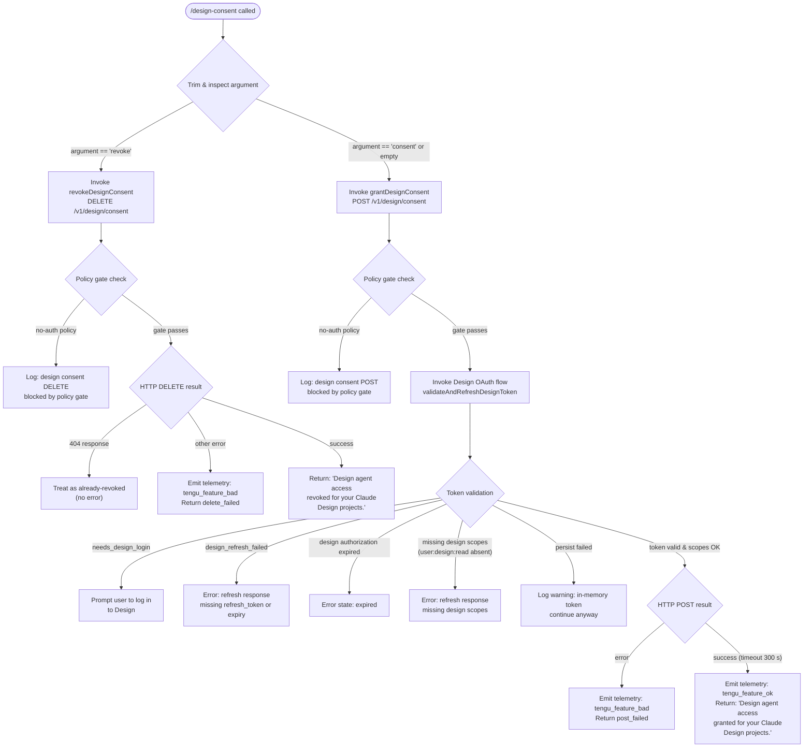

```markdown
---
type: feature-spec
feature: "design-consent"
cc_version: "2.1.199"
updated: "2026-07-03"
tags: ["design-consent", "commands", "slash-commands"]
source: "bundle-analysis"
bundle_verified: true
analysis_basis: "CC v2.1.199 bundle.js (AST extraction + Claude interpretation)"
author: "ryujaeuk <ryujaeuk@gmail.com>"
repository: "https://github.com/MyLittleLuckyDog/cc-gnothi"
license: "AGPL-3.0-only"
---

# `/design-consent`

> Analysis basis: CC v2.1.199 bundle.js (AST extraction + Claude interpretation)
> Minimum version: v2.1.199

---

## Overview

`/design-consent` is a hidden local slash command that grants (or revokes) the Claude agent's access to the user's Claude Design projects by managing an OAuth-backed consent token. It communicates with the Design backend via a dedicated REST endpoint and validates OAuth scope coverage before confirming success. The command supports a `revoke` sub-argument to tear down previously granted access.

---

## Registration

| Field | Value |
|---|---|
| type | `local` |
| name | `design-consent` |
| description | `Grant Claude agent access to your Design projects` |
| supportsNonInteractive | `true` |
| isHidden | `true` |
| module_id | `WKl` |
| load_inline | `true` |
| loc_byte | `12289104` |
| loc_byte_end | `12289313` |
| loc_line | `9058` |
| arbor_handler.name | `oYf` |
| arbor_handler.fqn | `claude-2.1.199::oYf` |
| arbor_handler.kind | `Function` |
| arbor_handler.resolution_path | `module_id` |
| arbor_handler.n_hits | `0` |

Analysis basis: CC v2.1.199 bundle.js:+12289104

---

## Input Branching

The command has four distinct execution paths depending on the argument supplied and the outcome of the HTTP call, making a Mermaid flowchart the required representation.



---

## Behavioral Spec

### Top-Level Handler — `designConsentCommandHandler`

The handler registered as `oYf` (resolved via `module_id` → `WKl`) is the entry point.

Analysis basis: CC v2.1.199 bundle.js:+12288695

```
function designConsentCommandHandler(commandInput):
    subcommand = dispatchSubcommand(commandInput)
    if subcommand == "revoke":
        result = revokeDesignConsent()
    else:
        // default: "consent" or absent argument
        result = grantDesignConsent()
    return result
```

### Argument Parsing — `parseDesignConsentArg`

Analysis basis: CC v2.1.199 bundle.js:+12287833

```
function parseDesignConsentArg(rawInput):
    trimmed = rawInput.trim()
    // literal index 0 used to compare trimmed length
    if trimmed starts at position 0 and matches "revoke":  // bundle.js:+12288268
        return "revoke"
    else:
        return "consent"   // default branch  // bundle.js:+12287913
```

The string `"your Claude Design projects"` (bundle.js:+12287876) is embedded as the human-readable scope label used in user-facing messages.

### Grant Flow — `grantDesignConsent`

Analysis basis: CC v2.1.199 bundle.js:+12287940

```
function grantDesignConsent():
    // 1. Policy gate
    policy = evaluatePolicyGate()
    if policy == "no-auth":                             // bundle.js:+11071339
        log("design consent POST blocked by policy gate")  // bundle.js:+11071371
        return failure

    // 2. OAuth token validation & refresh
    tokenStatus = validateAndRefreshDesignToken()      // callGraph: Den → G2o → N2o
    if tokenStatus == "needs_design_login":            // bundle.js:+11062990
        return promptUserToLogIn()
    if tokenStatus has refresh errors:
        // "refresh response missing refresh_token or expiry"  // bundle.js:+11063778
        // "refresh response missing design scopes"            // bundle.js:+11064031
        return tokenError(tokenStatus)
    if tokenStatus == "design_refresh_failed":         // bundle.js:+11063747
        return failure
    if tokenStatus contains "design authorization expired":  // bundle.js:+11064750
        return expiredError()
    if tokenStatus == persist_failed:
        // "Design OAuth refresh succeeded but persist failed; continuing with in-memory token."
        // bundle.js:+11064482
        log(warning); // continue with in-memory token

    // 3. HTTP POST to Design consent endpoint
    response = httpPost("/v1/design/consent",          // bundle.js:+11071194
                        timeout=300)                   // bundle.js:+11071265
    scope = "agent_design_projects"                    // bundle.js:+12287944
    if response.type == "error":                       // bundle.js:+11064575
        emit telemetry("design_consent", "post_failed")  // bundle.js:+11071435, +11071452
        return failure

    // 4. Emit success
    emit telemetry("design_consent", ok)
    return textMessage(
        "Design agent access granted for your Claude Design projects. Use /design revoke to undo."
        // bundle.js:+12287988
    )
```

Required OAuth scope: `"user:design:read"` (bundle.js:+11069861). The token refresh logic checks `Vle.every` and `Vle.some` on the scope list to verify coverage (bundle.js:+11063834, +11064211).

### Revoke Flow — `revokeDesignConsent`

Analysis basis: CC v2.1.199 bundle.js:+12288294

```
function revokeDesignConsent():
    // 1. Policy gate
    policy = evaluatePolicyGate()
    if policy == "no-auth":                               // bundle.js:+11071339
        log("design consent DELETE blocked by policy gate")  // bundle.js:+11071734
        return failure

    // 2. HTTP DELETE to Design consent endpoint
    response = httpDelete("/v1/design/consent")           // bundle.js:+11071538

    if response.status == 404:                            // bundle.js:+11071628
        // Already revoked; treat as success
        pass
    else if response indicates error:
        emit telemetry("design_consent", "delete_failed") // bundle.js:+11071817
        return failure

    // 3. Success
    return textMessage(
        "Design agent access revoked for your Claude Design projects."
        // bundle.js:+12288342
    )
```

### Design OAuth Token Validation — `validateAndRefreshDesignToken`

Analysis basis: CC v2.1.199 bundle.js:+11069807 (call chain: `G2o → qg → N2o`)

```
function validateAndRefreshDesignToken():
    // Check existing token state via Fkn (token state machine)  // bundle.js:+3137123
    tokenState = readTokenState()

    if tokenState == "none":                            // bundle.js:+11069979
        return "needs_design_login"

    // Attempt refresh cycle
    refreshResult = attemptOAuthRefresh()               // N2o, Cbt, Gne, t$f, mUl, gor

    validate refreshResult:
        - must contain refresh_token and expiry         // bundle.js:+11063778
        - must include "user:design:read" scope         // bundle.js:+11063834
        - check Array.isArray on scope list             // bundle.js:+11063367

    if refresh token flagged "refreshed":               // bundle.js:+3137148
        persist updated token via persistLayer          // ge → String  bundle.js:+184960
        if persist fails:
            log("Design OAuth refresh succeeded but persist failed; continuing with in-memory token.")
            return "persist_degraded"

    return "ok"
```

### Success/Failure Notification — `emitFeatureOutcome`

Analysis basis: CC v2.1.199 bundle.js:+1039941, +1040008

```
function emitFeatureOutcome(success: boolean, context):
    if success:
        V(telemetry("tengu_feature_ok", context))   // bundle.js:+1039941 via Le → V
        Pe(...)                                      // bundle.js:+1039974 GZe renderer
    else:
        V(telemetry("tengu_feature_bad", context))  // bundle.js:+1040008 via we → V
        Pe(...)                                      // bundle.js:+1040047
```

The `we` path (bundle.js:+11071432) handles the POST failure case; `Le` (bundle.js:+11071479) handles success. Both converge on `Pe → GZe` for rendering the result message.

---

## State & Side Effects

| Item | Detail |
|---|---|
| Telemetry: `tengu_feature_ok` | Emitted on successful grant POST (bundle.js:+1039941) |
| Telemetry: `tengu_feature_bad` | Emitted on failed POST or failed DELETE (bundle.js:+1040008) |
| Consent key written | `"agent_design_projects"` stored in session/persist layer on grant (bundle.js:+12287944) |
| OAuth token refresh | `validateAndRefreshDesignToken` may write an updated token in-memory or to persistent storage (bundle.js:+11064482) |
| HTTP POST `/v1/design/consent` | Creates Design consent record; timeout 300 s (bundle.js:+11071194, +11071265) |
| HTTP DELETE `/v1/design/consent` | Removes Design consent record; 404 treated as no-op (bundle.js:+11071538, +11071628) |
| appState changes | Policy gate (`"no-auth"`) blocks all network calls without modifying state (bundle.js:+11071339) |
| Sound | <!-- TODO: not found in depth-2 traversal; needs --depth 4 --> |
| Hook registration | <!-- TODO: not found in depth-2 traversal; needs --depth 4 --> |

---

## Version History

| Version | Change |
|---|---|
| v2.1.199 | Initial analysis |

---

## Common Mistakes

1. **Calling `/design-consent` without logging into Design first.** If the OAuth token state is `"none"`, the command returns a login prompt rather than granting access. The user must complete the Design OAuth flow before this command succeeds.
2. **Expecting `/design-consent revoke` to error on a 404.** A 404 from the DELETE endpoint is silently treated as success (already-revoked). Do not treat a missing consent record as a fatal condition.
3. **Assuming the command is interactive-only.** `supportsNonInteractive: true` means it can run in headless/piped mode, but the OAuth refresh path may still require a browser-based login if the token is absent.
4. **Ignoring the policy gate.** In `"no-auth"` policy environments (e.g., certain enterprise configurations), both the grant and revoke paths are blocked. The command will log a policy block message and return early without making network calls.
5. **Expecting an immediate revoke to clear all sessions.** The DELETE call removes the server-side consent record, but any in-memory token copies held by the current agent session continue until the process exits or the session is cleared.

---

## Appendix — Identifier Mapping

> For bundle debugging only. Identifiers change across versions.

| Identifier | Role |
|---|---|
| `oYf` | Top-level command handler (`designConsentCommandHandler`) — Arbor-resolved entry point |
| `Den` | Argument parsing + flow dispatch (`parseAndDispatchDesignConsent`) |
| `lUe` | Grant consent HTTP flow (`grantDesignConsentHTTP`) |
| `IUl` | Revoke consent HTTP flow (`revokeDesignConsentHTTP`) |
| `G2o` | Design OAuth orchestrator (`orchestrateDesignOAuth`) |
| `qg` | Token state reader (`readDesignTokenState`) |
| `N2o` | OAuth refresh executor (`executeDesignOAuthRefresh`) |
| `Fkn` | Token state machine (`designTokenStateMachine`) |
| `Cbt` | Refresh token extractor (`extractRefreshToken`) |
| `Gne` | Expiry validator (`validateTokenExpiry`) |
| `t$f` | Scope list extractor (`extractDesignScopes`) |
| `mUl` | Scope coverage checker (`checkDesignScopeCoverage`) |
| `gor` | Persist layer writer (`persistDesignToken`) |
| `tye` | Refresh-failure classifier (`classifyRefreshFailure`) |
| `zN` | In-memory token updater (`updateInMemoryDesignToken`) |
| `hor` | Scope presence validator (`validateScopePresence`) |
| `Yxe` | Persist failure handler (`handlePersistFailure`) |
| `ge` | String coercion utility (`coerceToString`) |
| `we` | Failure outcome emitter (`emitFailureOutcome`) |
| `Le` | Success outcome emitter (`emitSuccessOutcome`) |
| `V` | Telemetry dispatcher (`dispatchTelemetry`) |
| `Pe` | Result renderer (`renderCommandResult`) |
| `Iie` | Post-action cleanup (`postConsentCleanup`) |
| `ms` | HTTP client (`httpClient`) |
| `e` | String normalizer / replacer (`normalizeString`) |
| `t` | Raw string input holder (`rawInputString`) |

---

Note: index built via Arbor fallback; some signals (telemetry, literals) may be missing — see arbor-fallback.js.
```