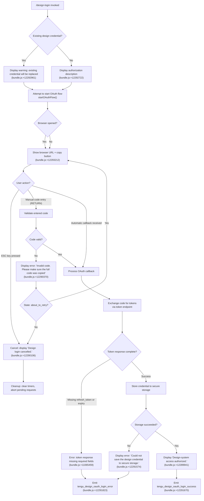

# `/design-login`

> Analysis basis: CC v2.1.199 bundle.js (AST extraction + Claude interpretation)
> Minimum version: v2.1.199

---

## Overview

`/design-login` initiates an OAuth authorization flow that grants Claude Code access to the design-system (claude.ai/design projects). It is a separate credential from the main session authentication and operates via a React/JSX interactive UI component that guides the user through browser-based sign-in, manual code entry, and secure credential storage.

---

## Registration

| Field | Value |
|---|---|
| type | `local-jsx` |
| name | `design-login` |
| description | `Authorize design-system access for /design-sync with your claude.ai account` |
| loc_byte | `12295887` |
| loc_byte_end | `12296086` |
| loc_line | `9058` |
| module_id | `ezl` |
| load_inline | `true` |
| arbor_handler.name | `nzl` |
| arbor_handler.fqn | `claude-2.1.199::nzl` |
| arbor_handler.kind | `Function` |
| arbor_handler.resolution_path | `direct` |
| arbor_handler.n_hits | `1` |

Analysis basis: CC v2.1.199 bundle.js:+12295887

---

## Input Branching

The command has more than three distinct state branches driven by OAuth flow state, user input (escape/return/code entry), and error paths. A Mermaid flowchart is used below.



---

## Behavioral Spec

### Top-level handler: `loginComponentRenderer` (arbor: `nzl`)

The entry point for this command is the handler resolved as `nzl` via Arbor direct resolution. The call graph top entry is `lYf`, which renders a JSX component (`ZKl`) using React JSX factories.

Analysis basis: CC v2.1.199 bundle.js:+12295663

### Sub-feature: UI Component (`designLoginComponent`)

The interactive component (`ZKl`) manages the entire login flow as a stateful React/Ink component.

```
function designLoginComponent(props):
    state.phase = "starting"            // initial state (bundle.js:+12289645)
    state.inputBuffer = ""
    state.cursorPosition = 0
    state.copyConfirmed = false

    clockContext = useClock()           // from ClockProvider (bundle.js:+4015409)
    terminalSize = useTerminalSize()    // from Ink App (bundle.js:+4025840)
    columnWidth = Math.max(50, terminalSize.columns - 4)
                                        // min column width: 50 (bundle.js:+12289855)

    ref = useRef()
    oauthController = props.oauthController

    on mount (useEffect):
        if CLAUDE_CODE_DESIGN_OAUTH_CLIENT_ID not configured:
            display error message about missing client ID
            // (bundle.js:+12290739)
            return

        oauthController.startOAuthFlow()
        set timeout 3000ms for browser open detection
        // (bundle.js:+3000 literal, bundle.js:+12291041)

    on key input:
        if key == "escape":
            phase = "cancelled"
            display "Design login cancelled."
            oauthController.cleanup()
            return

        if key == "return":
            if phase == "waiting_for_login" AND inputBuffer.length > 0:
                validate inputBuffer as manual auth code
                // (bundle.js:+12290567 — r.handleManualAuthCodeInput)

        else:
            append character to inputBuffer, advance cursor
            // (bundle.js:+12289920 — I.preventDefault)

    on phase == "waiting_for_login":
        display authorization URL
        if copied: show "(Copied!)" (bundle.js:+12293308)
        show copy button (bundle.js:+12293381)
        show manual entry field

    on phase == "success":
        display "Design-system access authorized."
        // (bundle.js:+12289941)

    on phase == "about_to_retry":
        re-display input, schedule retry in 1500ms
        // (bundle.js:+1500 literal, bundle.js:+12291799)
```

Analysis basis: CC v2.1.199 bundle.js:+12289626

### Sub-feature: OAuth Flow Controller (`oauthFlowController`)

The controller, reached via `r.startOAuthFlow` and `r.cleanup` in the call graph, orchestrates the device authorization or redirect flow.

```
function startOAuthFlow():
    generate codeVerifier, nonce using randomBytes (32 bytes)
    // (bundle.js:+18376472, +18376494, +18376509)

    codeChallenge = SHA256(codeVerifier), base64url encoded
    // (bundle.js:+18376554, +18377048)

    build authorization URL with params:
        response_type, client_id, redirect_uri (/oauth/callback),
        scope = ["openid", "profile", "email", "offline_access"]
        // (bundle.js:+18373966, +18373975, +18373985, +18376731)
        code_challenge_method = "S256"  // (bundle.js:+18377092)
        state = encrypted oauth_state cookie
        // (bundle.js:+18269432)

    open browser to authorization URL
    // or start device authorization at /oauth/device_authorization
    // (bundle.js:+18374735)

    start polling interval (default polling for authorization_pending)
    // (bundle.js:+18379410)

function handleCallback(callbackParams):
    verify state parameter matches stored state
    // (bundle.js:+18377369)
    if state expired: display "This sign-in link has expired. Try again from your device."
    // (bundle.js:+18377428)

    exchange authorization code for tokens at /oauth/token
    // (bundle.js:+18378978)

    validate id_token claims (iss, sub)
    // (bundle.js:+18378245, +18378396)

    fetch userinfo endpoint, verify sub matches id_token sub
    // (bundle.js:+18379964, +18370063 error literal)

    if refresh_token or expiry missing in response:
        abort with error
        // (bundle.js:+11065459)

    store tokens via credentialStore.write()
```

Analysis basis: CC v2.1.199 bundle.js:+18376472

### Sub-feature: Manual Code Entry (`handleManualAuthCodeInput`)

When the browser fails to open or the user prefers manual entry, the component accepts a code string directly.

```
function handleManualAuthCodeInput(inputBuffer):
    emit telemetry: tengu_design_oauth_manual_entry
    // (bundle.js:+12290529)

    sanitize input:
        strip whitespace, validate format

    if invalid:
        display "Invalid code. Please make sure the full code was copied"
        // (bundle.js:+12290370)
        set state to "about_to_retry" or "cancelled"
        return

    if valid:
        submit code to token exchange
        proceed as handleCallback
```

Analysis basis: CC v2.1.199 bundle.js:+12290567

### Sub-feature: Credential Storage (`credentialStore`)

Reached via `hor` → `Cl` → `Mhi` in the call graph.

```
function writeDesignCredential(tokens):
    attempt primary secure storage write
    // telemetry: secure_storage_credentials_write (bundle.js:+2395401)

    if primary fails with transient error:
        if fallback not skipped:
            write to plaintext fallback
            // telemetry: plaintext_fallback_used (bundle.js:+2395648)
        else:
            emit primary_transient_skip_fallback
            // (bundle.js:+2395499)
            raise error

    if both primary and fallback fail:
        emit primary_and_fallback_failed (bundle.js:+2395751)
        raise "Failed to save design OAuth tokens" (bundle.js:+11061981)
        return error to UI: "Could not save the design credential to secure storage."
        // (bundle.js:+12291574)
```

Analysis basis: CC v2.1.199 bundle.js:+11061588

### Sub-feature: OAuth Environment Resolution (`resolveOAuthEnvironment`)

Reached via `rQt` → `Hor` → `Fs` in the call graph.

```
function resolveOAuthEnvironment():
    env = process.env or config

    if CLAUDE_CODE_DESIGN_OAUTH_CLIENT_ID not set:
        display error about missing OAuth client
        // (bundle.js:+12290739)
        return null

    if custom OAuth URL env var set:
        validate against approved endpoints only
        // "CLAUDE_CODE_CUSTOM_OAUTH_URL is not an approved endpoint." (bundle.js:+868472)

    known base URLs (for local/staging/prod disambiguation):
        prod:    default
        staging: "staging"     (bundle.js:+868312)
        local:   ports 8000, 4000, 3000 (bundle.js:+867351, +867438, +867528)
        local OAuth server: http://localhost:8205 (bundle.js:+868167)

    return resolved OAuthConfig with client_id, endpoints
```

Analysis basis: CC v2.1.199 bundle.js:+866985

### Sub-feature: Token Refresh (`refreshDesignCredential`)

Reached via `R.refresh` in the call graph, exercised when stored tokens are near-expiry.

```
function refreshDesignCredential(storedTokens):
    POST to token endpoint with grant_type = "refresh_token"
    // (bundle.js:+18373856)

    on success:
        update stored tokens
        emit session.refresh (bundle.js:+18380052)

    on error (invalid_grant, temporarily_unavailable, etc.):
        if invalid_grant or invalid_token:
            mark credential as invalid
            emit auth.denied (bundle.js:+18380693)
        if temporarily_unavailable:
            schedule retry

    if response has neither id_token nor access_token:
        raise "IdP refresh response had neither id_token nor access_token"
        // (bundle.js:+18379893)
```

Analysis basis: CC v2.1.199 bundle.js:+18379783

### Sub-feature: Copy-to-Clipboard (`clipboardCopy`)

Reached via `nL` → `W8i` / `V7d` / `Xto` in the call graph. Used for the "copy URL" button in the UI.

```
function copyToClipboard(text):
    detect platform:
        macos:   pbcopy          (bundle.js:+3607426)
        linux:   wl-copy, xclip, xsel in priority order
                 // (bundle.js:+3606184, +3606253, +3606294)
        windows: powershell.exe Set-Clipboard
                 // (bundle.js:+3607828)
        tmux:    tmux load-buffer (bundle.js:+3606681)
        wsl:     powershell.exe  (bundle.js:+3607818)

    encode text as base64 (bundle.js:+3607007)
    execute clipboard command
    on success: show "(Copied!)" indicator in UI
    // (bundle.js:+12293308)
```

Analysis basis: CC v2.1.199 bundle.js:+3607021

---

## State & Side Effects

| Item | Detail |
|---|---|
| Telemetry: `tengu_design_oauth_manual_entry` | Fired when the user submits a manually-typed authorization code (bundle.js:+12290529) |
| Telemetry: `tengu_design_oauth_login_success` | Fired on successful credential storage (bundle.js:+12291670) |
| Telemetry: `tengu_design_oauth_login_error` | Fired when credential storage or token exchange fails (bundle.js:+12291823) |
| Telemetry: `tengu_feature_ok` / `tengu_feature_bad` / `tengu_feature_sad` | Feature flag evaluation telemetry (bundle.js:+1039941, +1040008, +1040089) |
| Secure storage write | Design OAuth tokens written to primary secure store; plaintext fallback may be used if primary fails |
| Browser launch | OAuth authorization URL opened in the default browser during `startOAuthFlow` |
| Clipboard | Authorization URL may be copied to clipboard on user request; shows `(Copied!)` feedback |
| Timer: browser-open detection | 3000 ms timeout after OAuth flow starts (bundle.js:+3000 literal, +12291041) |
| Timer: retry display | 1500 ms delay before showing retry UI (bundle.js:+12291799) |
| Timer: cleanup | All pending timers and OAuth request state cleaned up on cancel/success/error (`r.cleanup`, bundle.js:+12292368) |
| appState changes | Phase field transitions: `starting` → `waiting_for_login` → `success`/`cancelled`/`about_to_retry`/`processing` |
| Sound | None observed in depth-2 traversal |

---

## Version History

| Version | Change |
|---|---|
| v2.1.199 | Initial analysis |

---

## Common Mistakes

1. **Missing `CLAUDE_CODE_DESIGN_OAUTH_CLIENT_ID`**: If the environment variable is not set (or the build does not embed the registered client ID), the command immediately aborts with a message about the OAuth client not being configured (bundle.js:+12290739). This is the most common reason the flow never starts.

2. **Treating design credentials as the main session credential**: `/design-login` is entirely separate from the Claude Code main-session OAuth. Running `/design-login` does not affect API key or main authentication; it only adds or replaces the design-system-specific credential.

3. **Copying an incomplete or expired code**: When using manual code entry, pasting a partial or expired code produces "Invalid code. Please make sure the full code was copied" (bundle.js:+12290370). The flow enters `about_to_retry` and prompts again rather than immediately cancelling.

4. **Using an unapproved custom OAuth URL**: If `CLAUDE_CODE_CUSTOM_OAUTH_URL` is set to a non-approved endpoint, the environment resolver rejects it with an explicit error (bundle.js:+868472). Only the hard-coded approved endpoints are accepted.

5. **Expecting re-entrant use to be additive**: Completing the login flow while a design credential already exists silently replaces the existing credential (bundle.js:+12292961). There is no merge; the prior tokens are overwritten.

---

## Appendix — Identifier Mapping

> For bundle debugging only. Identifiers change across versions.

| Identifier | Role |
|---|---|
| `nzl` | Top-level handler function (Arbor-resolved; renders the login JSX component) |
| `lYf` | JSX render wrapper / command handler entry called by the loader |
| `ZKl` | Design-login interactive UI React/Ink component |
| `$s` | `useClock` hook — reads clock context (ClockProvider) |
| `Ar` | `useTerminalSize` hook — reads terminal size from Ink App context |
| `I` | Key input event handler (preventDefault, cursor movement) |
| `R` | OAuth HTTP request router / handler (main OAuth server request dispatcher) |
| `Whe` | JSON serialization utility |
| `zls` | IP address resolution / validation entry |
| `Vls` | IPv4-mapped address parser |
| `qls` | IP address regex matcher |
| `Xeu` | HTML response builder for OAuth pages |
| `aZe` | HTML template / string escaper |
| `scs` | Bearer token prefix checker |
| `Dls` | JWT decoder entry |
| `Cls` | JWT header parser |
| `veu` | JWK key lookup by `kid` |
| `wtu` | Device authorization / token polling orchestrator |
| `MXm` | OAuth callback parameter processor |
| `Tu` | Token storage writer |
| `BAr` | Rate-limit counter helper |
| `Deu` | Random state generator (BLt.random wrapper) |
| `Meu` | Random bytes generator (FAr.randomBytes wrapper) |
| `Bls` | SHA-256 hash helper (FAr.createHash) |
| `Fls` | Token persistence helper |
| `Rls` | Secure storage sealing helper |
| `$Ar` | URL-safe encoding helper |
| `GYm` | Uppercase normalizer for hex/base64 strings |
| `Yan` | OAuth state cookie builder |
| `zAr` | Random bytes → base64url encoder |
| `P` | Incoming HTTP request object (formData/arrayBuffer handler) |
| `cru` | File-system realpath/stat utility |
| `Dd` | Dependency injection accessor |
| `T` | Stream writer utility |
| `ke` | Error logger / structured log emitter |
| `WQm` | Response queue manager |
| `d` | Writable stream / transport layer |
| `weu` | OAuth state sealer |
| `vo` | Authorization URL builder |
| `H` | OAuth client object (authorizationUrl, callback, userinfo, refresh methods) |
| `lZe` | PKCE code-challenge builder |
| `Leu` | Token validator entry |
| `Mls` | Token seal/unseal dispatcher |
| `x` | Authorization state parser (split/indexOf/slice) |
| `k` | Polling interval manager (setInterval/clearInterval) |
| `N` | Worker/session pool sweep manager |
| `$ls` | Token refresh path validator |
| `ue` | Claims extractor / JWT payload parser |
| `le` | Token string normalizer |
| `eAe` | Template variable substitutor |
| `obe` | String sanitizer / replacer |
| `b` | Userinfo response validator |
| `KAr` | Array-or-string scope normalizer |
| `qAr` | Scope string parser / prefix stripper |
| `Ae` | Token commit (set + delete transactional helper) |
| `ge` | String coercion helper |
| `Z` | Voice/session recording controller (large state machine; reached transitively) |
| `we` | Feature flag evaluator (ok path) |
| `V` | Telemetry event emitter |
| `B` | Background worker pair holder |
| `gyr` | Voice recording queue pusher |
| `q` | Backspace/key interceptor |
| `ie` | Arrow key / cursor push helper |
| `dNc` | Audio amplitude calculator |
| `Te` | Voice frame queue processor |
| `K` | Rate-limit event enqueuer |
| `Lr` | Config/context loader |
| `det` | Language/locale detector |
| `Le` | Feature flag evaluator (ok path, alternate) |
| `Ihs` | Date/time formatter (Intl.DateTimeFormat) |
| `Yfr` | Voice WebSocket stream manager |
| `$Um` | Voice transcription result accumulator |
| `de` | WebSocket connection object |
| `u` | Daemon/session handle |
| `Y` | Permission check / allow-list evaluator |
| `X` | MCP update applier |
| `j` | Idle-exit timeout scheduler |
| `ce` | Stream event enqueuer |
| `Et` | Feature flag evaluator (sad path) |
| `Ce` | Message queue push helper |
| `f` | Ref holder (yV wrapper) |
| `sr` | Error constructor wrapper |
| `Uns` | File-path set builder / basename extractor |
| `ee` | ID-token claims reader |
| `a` | Spend-blocked response builder |
| `O` | Permission state machine |
| `JAr` | Header presence checker (entries/some/includes) |
| `n` | Case-insensitive string normalizer |
| `$tu` | Bootstrap/policy data fetcher |
| `eJm` | Bootstrap response parser (Zls) |
| `tJm` | Permission filter (includes/startsWith) |
| `nJm` | Permission normalizer (Btu) |
| `Wtu` | MCP upstream request batcher |
| `QLt` | Fetch-with-retry helper (VAr.isValid, TLS check) |
| `dcs` | Error string coercer |
| `_tu` | Model list response handler |
| `Zls` | Model registry / filter |
| `ftu` | Excluded-model-list checker |
| `gtu` | Messages endpoint handler |
| `Wt` | JSON parser helper |
| `v2e` | JSON error response builder |
| `Jls` | Request header sanitizer / allowlist enforcer |
| `Qls` | Upstream selector |
| `p` | Process exit / abort controller |
| `xe` | JSON stringifier helper |
| `dtu` | Auth applicator to outbound request |
| `E` | Auth invalidation handler |
| `SXm` | Count-tokens endpoint handler |
| `ptu` | Per-request auth + fetch dispatcher |
| `yg` | HTTP proxy config builder |
| `rQt` | OAuth environment config resolver (entry) |
| `Hor` | OAuth environment loader (calls Fs) |
| `Fs` | OAuth base-URL and client-ID resolver |
| `OTs` | OAuth endpoint string builder |
| `Oku` | OAuth client registration validator |
| `c` | Timeout / cancellation token |
| `ln` | Background session handle |
| `zN` | Token revocation POST helper |
| `U2o` | Design OAuth scope filter and token verifier |
| `hor` | Credential persistence orchestrator (calls Cl) |
| `Cl` | Credential store dispatcher (calls Mhi) |
| `Mhi` | Secure storage read/write engine |
| `R4e` | Async storage read helper |
| `Vd` | MCP server list context consumer |
| `m` | MCP scope/array filter |
| `nL` | Clipboard copy entry |
| `a3t` | Clipboard backend initializer |
| `IH` | Platform clipboard interface |
| `W8i` | macOS `pbcopy` clipboard writer |
| `Un` | Shell command executor (clipboard) |
| `Wr` | `execFileNoThrow` wrapper |
| `Dt` | Child process spawn helper |
| `Jto` | Linux `wl-copy`/`xclip`/`xsel` clipboard writer |
| `tm` | Linux clipboard tool runner |
| `V7d` | tmux / tmux-buffer clipboard writer |
| `Xto` | Screen / OSC52 clipboard writer |
| `l3t` | Clipboard result aggregator |
| `Lx` | OSC52 escape sequence builder |
| `Q_` | Clipboard strategy join helper |
| `G8i` | Screen DCS clipboard writer |
| `w` | Timer clear helper |
| `Cbt` | Cleanup orchestrator (calls Cl, ge) |

---

Note: index built via Arbor fallback; some signals (telemetry, literals) may be missing — see arbor-fallback.js.