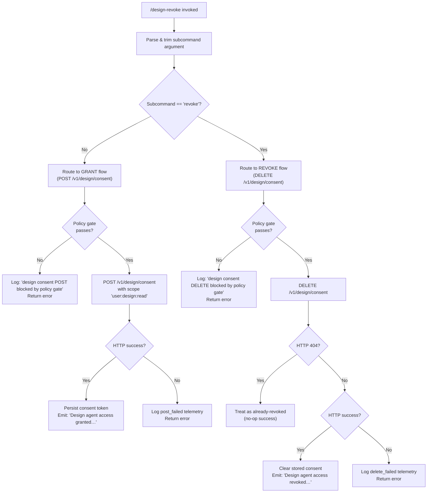

```markdown
---
type: feature-spec
feature: "design-revoke"
cc_version: "2.1.199"
updated: "2026-07-03"
tags: ["design-revoke", "commands", "slash-commands"]
source: "bundle-analysis"
bundle_verified: true
analysis_basis: "CC v2.1.199 bundle.js (AST extraction + Claude interpretation)"
author: "ryujaeuk <ryujaeuk@gmail.com>"
repository: "https://github.com/MyLittleLuckyDog/cc-gnothi"
license: "AGPL-3.0-only"
---

# `/design-revoke`

> Analysis basis: CC v2.1.199 bundle.js (AST extraction + Claude interpretation)
> Minimum version: v2.1.199

---

## Overview

`/design-revoke` is a hidden local command that revokes the Claude agent's OAuth-based access to the user's Claude Design projects. It calls the Design consent API (`DELETE /v1/design/consent`) to remove the previously granted authorization token, then emits a confirmation message. This command is the counterpart to the access-grant flow (which POSTs consent); together they form a symmetric grant/revoke lifecycle for Design project integration.

---

## Registration

| Field | Value |
|---|---|
| type | `local` |
| name | `design-revoke` |
| description | Revoke Claude agent access to your Design projects |
| loc_byte | `12289318` |
| loc_byte_end | `12289527` |
| loc_line | `9058` |
| supportsNonInteractive | `true` |
| isHidden | `true` |
| module_id | `VKl` |
| load_inline | `true` |
| arbor_handler.name | `sYf` |
| arbor_handler.fqn | `claude-2.1.199::sYf` |
| arbor_handler.kind | `Function` |
| arbor_handler.resolution_path | `module_id` |
| arbor_handler.n_hits | `0` |

Analysis basis: CC v2.1.199 bundle.js:+12289318

---

## Input Branching

The command has 3+ distinct execution paths (grant vs. revoke dispatch, policy gate check, HTTP success/failure, and 404 handling), so a Mermaid flowchart is used.



Analysis basis: CC v2.1.199 bundle.js:+12288294 (revoke dispatch), +12288268 (literal `"revoke"`), +11071628 (404 handling), +11071734 (policy gate block log)

---

## Behavioral Spec

### 1. Top-Level Handler (`sYf`)

The Arbor-resolved handler `sYf` (resolution path: `module_id → VKl`) is the entry point for the command.

```
function handleDesignRevoke(args):
    subcommand = parseAndNormalizeSubcommand(args)
    if subcommand == "revoke":
        return executeRevokeConsent()
    else:
        return executeGrantConsent(subcommand)
```

Analysis basis: CC v2.1.199 bundle.js:+12288784 (call from `sYf` → `Den`), +12288268 (literal `"revoke"`)

---

### 2. Subcommand Parsing (`Den`)

The dispatch function `Den` (descriptive name: **designConsentDispatcher**) trims whitespace from the raw argument string before comparing against the `"revoke"` literal. It delegates to either the grant helper or the revoke helper depending on the result.

```
function designConsentDispatcher(rawArg):
    normalized = rawArg.trim()                   // bundle.js:+12287833
    scope = "your Claude Design projects"        // bundle.js:+12287876
    consentType = "consent"                      // bundle.js:+12287913

    if normalized == "revoke":                   // bundle.js:+12288268
        result = executeDeleteConsent()
        if result.ok:
            return {
                type: "text",
                content: "Design agent access revoked for your Claude Design projects."
            }
        else:
            return result.error
    else:
        result = executePostConsent(scope, consentType)
        if result.ok:
            return {
                type: "text",                    // bundle.js:+12287975
                content: "Design agent access granted for your Claude Design projects. Use /design revoke to undo."
            }                                    // bundle.js:+12287988
        else:
            return result.error
```

Analysis basis: CC v2.1.199 bundle.js:+12287833 (trim), +12288197 (call to `ge`), +12288294 (call to `IUl`), +12288342 (revoke success message)

---

### 3. Grant Consent Flow (`lUe` — **designConsentPoster**)

```
function designConsentPoster(scope, consentType):
    // Policy gate check
    if policyGateBlocks():
        log("design consent POST blocked by policy gate")   // bundle.js:+11071371
        emitTelemetry("tengu_feature_bad")
        return { ok: false, error: "no-auth" }             // bundle.js:+11071339

    // HTTP call
    response = httpClient.post("/v1/design/consent", {     // bundle.js:+11071186, +11071194
        scope: "user:design:read",                         // bundle.js:+11069861
        timeout: 300                                       // bundle.js:+11071265
    })

    if response.failed:
        emitDesignConsentTelemetry("design_consent", "post_failed")  // bundle.js:+11071435, +11071452
        return { ok: false, error: response.error }

    // Refresh token validation (via G2o → N2o pipeline)
    refreshResult = validateAndPersistRefreshToken(response)
    if not refreshResult.ok:
        return { ok: false, error: refreshResult.error }

    emitTelemetry("tengu_feature_ok")                      // bundle.js:+1039941
    return { ok: true }
```

Analysis basis: CC v2.1.199 bundle.js:+11071186 (POST call), +11071339 (`"no-auth"`), +11071371 (blocked log), +11071435 (telemetry key)

---

### 4. Revoke Consent Flow (`IUl` — **designConsentDeleter**)

```
function designConsentDeleter():
    // Policy gate check
    if policyGateBlocks():
        log("design consent DELETE blocked by policy gate")  // bundle.js:+11071734
        emitTelemetry("tengu_feature_bad")
        return { ok: false, error: "no-auth" }

    // HTTP call
    response = httpClient.delete("/v1/design/consent")       // bundle.js:+11071538

    if response.status == 404:                               // bundle.js:+11071628
        // Already revoked — treat as success
        return { ok: true }

    if response.failed:
        emitDesignConsentTelemetry("design_consent", "delete_failed")  // bundle.js:+11071817
        return { ok: false, error: response.error }

    // Refresh token re-validation after delete (via G2o pipeline)
    validateAndPersistRefreshToken(response)                 // bundle.js:+11071591

    emitTelemetry("tengu_feature_ok")
    return { ok: true }
```

Analysis basis: CC v2.1.199 bundle.js:+11071538 (DELETE call), +11071628 (404 branch), +11071734 (policy gate log), +11071817 (delete_failed)

---

### 5. OAuth Refresh Token Validation Pipeline (`G2o` → `N2o`)

Both grant and revoke paths share a token-refresh validation pipeline. Descriptive names are used throughout.

```
function validateAndRefreshDesignToken(apiResponse):
    // Stage 1: fetch/validate the refresh token (G2o → qg → Fkn)
    tokenRecord = fetchRefreshToken(apiResponse)            // bundle.js:+11069807

    // Check required scope
    if not tokenRecord.scopes.includes("user:design:read"): // bundle.js:+11069861
        tokenRecord.status = "none"                        // bundle.js:+11069979

    // Stage 2: deep validation (N2o)
    return deepValidateToken(tokenRecord)

function deepValidateToken(tokenRecord):
    // Check login state
    if tokenRecord.needsLogin:                             // bundle.js:+11062990 ("needs_design_login")
        return { ok: false, error: "needs_design_login" }

    // Validate refresh_token and expiry presence
    if missing(tokenRecord.refresh_token) or missing(tokenRecord.expiry):
        log("refresh response missing refresh_token or expiry") // bundle.js:+11063778
        emitEvent("design_refresh_failed")                 // bundle.js:+11063747
        return { ok: false }

    // Validate design scopes present
    if not allScopesPresent(tokenRecord.scopes):
        log("refresh response missing design scopes")      // bundle.js:+11064031
        return { ok: false }

    // Persist token; if persist fails, continue with in-memory token
    persistResult = persistToken(tokenRecord)
    if not persistResult.ok:
        log("Design OAuth refresh succeeded but persist failed; continuing with in-memory token.")
        // bundle.js:+11064482

    // Check for downstream error state
    if tokenRecord.state == "error":                       // bundle.js:+11064575
        log("design authorization expired")               // bundle.js:+11064750
        return { ok: false, error: "design authorization expired" }

    return { ok: true, token: tokenRecord }
```

Analysis basis: CC v2.1.199 bundle.js:+11062945, +11063016, +11063090, +11063298, +11063367, +11063528, +11063697, +11063778, +11064031, +11064482, +11064575, +11064750

---

### 6. Output Formatting (`ge` — **formatTextOutput**)

The output formatter wraps the result string into a text-type content block.

```
function formatTextOutput(content):
    return {
        type: "text",                // bundle.js:+12287975
        value: String(content)       // bundle.js:+184960
    }
```

Analysis basis: CC v2.1.199 bundle.js:+12288197 (call to `ge`), +184960 (String coercion)

---

## State & Side Effects

| Item | Detail |
|---|---|
| Telemetry | `tengu_feature_ok` (bundle.js:+1039941) — emitted on successful grant or revoke; `tengu_feature_bad` (bundle.js:+1040008) — emitted on policy gate block or HTTP failure |
| Design consent telemetry keys | `"design_consent"` with sub-keys `"post_failed"` (bundle.js:+11071452) and `"delete_failed"` (bundle.js:+11071817) |
| HTTP side effects | `POST /v1/design/consent` (grant path, bundle.js:+11071194); `DELETE /v1/design/consent` (revoke path, bundle.js:+11071538) |
| Token persistence | Refresh token is written to persistent storage after a successful grant; cleared after a successful revoke. If persist fails on grant, the session continues with an in-memory token (bundle.js:+11064482) |
| appState changes | Design OAuth consent state (`"agent_design_projects"`, bundle.js:+12287944) is updated to reflect grant or revoke |
| 404 handling | A 404 response from DELETE is treated as a no-op success (consent was already absent) — bundle.js:+11071628 |
| Hook registration | <!-- TODO: not found in depth-2 traversal; needs --depth 4 --> |
| Sound | <!-- TODO: not found in depth-2 traversal; needs --depth 4 --> |
| supportsNonInteractive | `true` — this command can run in CI/script contexts without a TTY |
| isHidden | `true` — not shown in `/help` listings |

---

## Version History

| Version | Change |
|---|---|
| v2.1.199 | Initial analysis |

---

## Common Mistakes

1. **Invoking without the `revoke` subcommand**: Omitting or misspelling the `revoke` argument causes the handler to route to the **grant** path (POST) rather than the revoke path (DELETE). The subcommand string is compared after `trim()` but is otherwise case-sensitive.
2. **Expecting interactive confirmation**: Because `supportsNonInteractive: true`, the command does not prompt for confirmation before revoking access. Revocation is immediate upon invocation.
3. **Assuming 404 is an error**: A `404` response from the DELETE endpoint is intentionally swallowed as a success (idempotent revoke). Scripts checking exit codes should not treat this as a failure.
4. **Confusing this command with `/design`**: `/design-revoke` is a standalone hidden command, not a subcommand of a `/design` parent. The string `"revoke"` inside the handler is a routing key for the internal dispatch logic within module `VKl`, not an exposed CLI subcommand tree.
5. **Persistent token failure is non-fatal on grant**: If the OAuth refresh token cannot be written to disk after a successful POST, the command still reports success and continues with an in-memory token. Users may need to re-grant access after restarting Claude Code.

---

## Appendix — Identifier Mapping

> For bundle debugging only. Identifiers change across versions.

| Identifier | Role |
|---|---|
| `sYf` | Top-level command handler (Arbor-resolved entry point for `/design-revoke`) |
| `Den` | Design consent dispatcher — trims subcommand arg, routes to grant or revoke helper |
| `lUe` | Design consent poster — executes `POST /v1/design/consent` (grant flow) |
| `IUl` | Design consent deleter — executes `DELETE /v1/design/consent` (revoke flow) |
| `G2o` | OAuth token refresh orchestrator — called by both grant and revoke paths post-HTTP |
| `N2o` | Deep token validator — checks refresh_token, expiry, scopes, and persist status |
| `qg` | Refresh token fetcher — retrieves token record from API response |
| `Fkn` | Token refresh sub-helper (called from `qg`; role: refresh state machine step) |
| `we` | Telemetry emitter (bad path) — wraps `tengu_feature_bad` emission |
| `Le` | Telemetry emitter (ok path) — wraps `tengu_feature_ok` emission |
| `V` | Core telemetry dispatch function |
| `Pe` | Telemetry transport / sink |
| `Iie` | Post-HTTP side-effect hook (exact role: <!-- TODO: not found in depth-2 traversal; needs --depth 4 -->) |
| `ge` | Output formatter — coerces result to `{ type: "text", value: String(...) }` |
| `e` | String sanitizer — applies `.replace()` for normalization |
| `t` | Raw input string passed into sanitizer |

---

Note: index built via Arbor fallback; some signals (telemetry, literals) may be missing — see arbor-fallback.js.
```