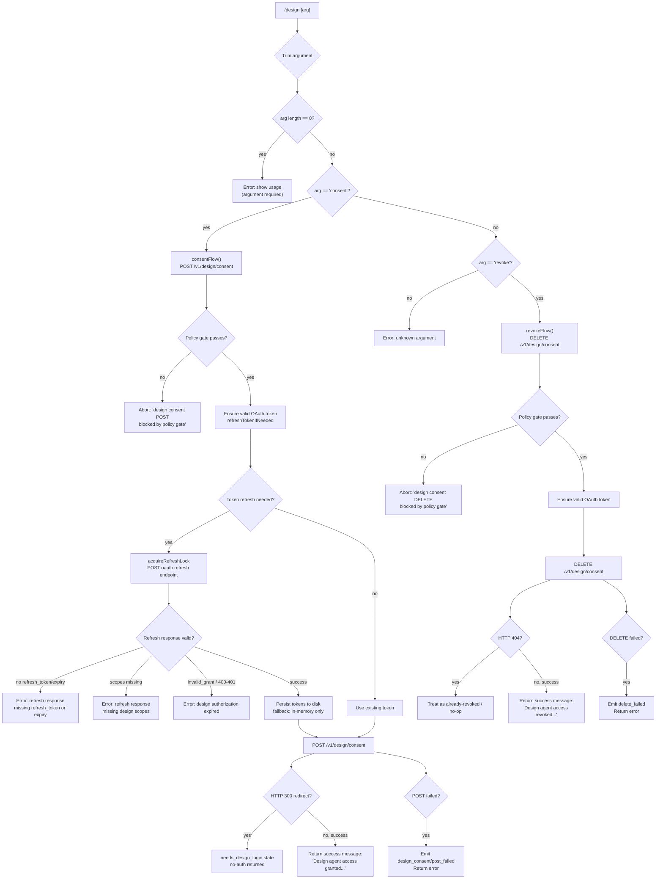

# `/design`

> Analysis basis: CC v2.1.198 bundle.js (AST extraction + Claude interpretation)
> Minimum version: v2.1.198

---

## Overview

The `/design` command grants or revokes a Claude agent's access to the user's Claude Design projects via an OAuth-backed consent flow. When called with `consent`, it performs a policy-gated HTTP POST to register authorization; when called with `revoke`, it issues a DELETE to withdraw that authorization. Both paths share a common token-refresh sub-system that ensures a valid `user:design:read`-scoped credential is in place before the network call proceeds.

---

## Registration

| Field | Value |
|---|---|
| type | `local` |
| name | `design` |
| description | Grant or revoke Claude agent access to your Design projects |
| argumentHint | `consent \| revoke` |
| supportsNonInteractive | `true` |
| module_id | `WWl` |
| load_inline | `true` |
| loc_byte | `12165554` |
| loc_byte_end | `12165785` |
| loc_line | `8184` |
| arbor_handler.name | `ljf` |
| arbor_handler.fqn | `claude-2.1.198::ljf` |
| arbor_handler.kind | `AsyncFunction` |
| arbor_handler.resolution_path | `module_id` |
| arbor_handler.n_hits | `0` |

Analysis basis: CC v2.1.198 bundle.js:+12165554

---

## Input Branching

Four distinct paths exist: missing/empty argument, `consent`, `revoke`, and any other value. A Mermaid flowchart is used.



Analysis basis: CC v2.1.198 bundle.js:+12164704, +12164784, +12165139, +10975510, +10975854

---

## Behavioral Spec

### 1. Top-Level Handler (`ljf`)

The Arbor-resolved handler is the async function `ljf` (module `WWl`, resolved via `module_id` path).

```
async function designCommandHandler(rawArg):
    arg = rawArg.trim()                        // bundle.js:+12164704
    if arg.length == 0:
        return usageError("your Claude Design projects")   // bundle.js:+12164747

    if arg == "consent":                       // bundle.js:+12164784
        result = await consentFlow()           // calls UXt, bundle.js:+12164811
        if result.ok:
            return successMessage(
              "Design agent access granted for your Claude Design projects. Use /design revoke to undo."
            )                                  // bundle.js:+12164859
        else:
            return result.error

    if arg == "revoke":                        // bundle.js:+12165139
        result = await revokeFlow()            // calls DDl, bundle.js:+12165165
        if result.ok:
            return successMessage(
              "Design agent access revoked for your Claude Design projects."
            )                                  // bundle.js:+12165213
        else:
            return result.error

    // implicit: unknown arg falls through to error path via he()
    return errorMessage(arg)                   // bundle.js:+12165068
```

Analysis basis: CC v2.1.198 bundle.js:+12164704

---

### 2. Consent Flow (`UXt`)

```
async function consentFlow():
    // Policy gate check
    if policyGateBlocked("design"):
        log("design consent POST blocked by policy gate")  // bundle.js:+10975687
        return { ok: false, reason: "no-auth" }           // bundle.js:+10975655

    // Ensure valid token with user:design:read scope
    token = await ensureDesignToken()          // calls RUo

    // POST to consent endpoint
    response = await httpPost("/v1/design/consent", token)  // bundle.js:+10975510

    if response.status == 300:                 // bundle.js:+10975581
        // Redirect means login is required
        setState("needs_design_login")         // bundle.js:+10967306
        return { ok: false, reason: "no-auth" }

    if response.failed:
        emitTelemetry("design_consent", "post_failed")     // bundle.js:+10975751, +10975768
        return { ok: false, error: response.error }

    // Emit success feature telemetry
    emitFeatureOk()                            // tengu_feature_ok, bundle.js:+1039573
    return { ok: true }
```

Analysis basis: CC v2.1.198 bundle.js:+10975502, +10975510, +10975581

---

### 3. Revoke Flow (`DDl`)

```
async function revokeFlow():
    // Policy gate check
    if policyGateBlocked("design"):
        log("design consent DELETE blocked by policy gate")  // bundle.js:+10976050
        return { ok: false, reason: "no-auth" }

    // Ensure valid token
    token = await ensureDesignToken()          // calls RUo, bundle.js:+10975907

    // DELETE to consent endpoint
    response = await httpDelete("/v1/design/consent", token)  // bundle.js:+10975854

    if response.status == 404:                 // bundle.js:+10975944
        // Already revoked — treat as success or no-op
        return { ok: true }

    if response.failed:
        emitTelemetry("design_consent", "delete_failed")   // bundle.js:+10976133
        return { ok: false, error: response.error }

    emitFeatureOk()
    return { ok: true }
```

Analysis basis: CC v2.1.198 bundle.js:+10975854, +10975907, +10975944

---

### 4. Token Ensure / Refresh Orchestrator (`RUo`)

```
async function ensureDesignToken():
    // Check current token for user:design:read scope
    currentToken = loadStoredToken()           // calls Fh, bundle.js:+10974123
    requiredScope = "user:design:read"         // bundle.js:+10974177

    if currentToken has requiredScope and not expired:
        return currentToken

    if tokenExpiry == "none":                  // bundle.js:+10974295
        // No token at all — initiate full OAuth
        return initiateOAuthLogin()            // calls vUo

    // Token present but needs refresh
    return await refreshDesignToken()          // calls vUo
```

Analysis basis: CC v2.1.198 bundle.js:+10974123, +10974134, +10974177, +10974235

---

### 5. Token Storage Load (`Fh` / `_0n`)

```
function loadStoredToken():
    // Attempt to read persisted token from storage
    raw = storageRead()                        // calls _0n, bundle.js:+3132536
    if raw is stale or missing:
        return null
    // Mark token as "refreshed" when returning
    token.state = "refreshed"                  // bundle.js:+3132561
    return token
```

Maximum token-age constant used for staleness: `1` (relative unit; see `_0n` at bundle.js:+3132524).

Analysis basis: CC v2.1.198 bundle.js:+3132536, +3132561

---

### 6. OAuth Token Refresh (`vUo`)

This is the core async token-refresh pipeline.

```
async function refreshDesignToken():
    // Step 1: build refresh context
    context = buildRefreshContext()            // calls fAt, bundle.js:+10967261

    // Step 2: generate a timestamp nonce
    nonce = timestampNonce()                   // calls une → Date.now, bundle.js:+10967332
    maxNonceAge = 300000 ms                    // bundle.js:+2185583

    // Step 3: acquire exclusive file-system lock
    lockResult = await acquireLock()           // calls IDf, bundle.js:+10967406
    // Lock timeout: 10000 ms                  // bundle.js:+10966725
    // Lock error code: "ELOCKED"              // bundle.js:+10966844
    // Lock retry delay: 1000 ms              // bundle.js:+10966874
    if lockResult == "ELOCKED":
        throw Error("Design OAuth lock contention: another process is holding the refresh lock")
                                               // bundle.js:+10966920

    // Step 4: read current refresh token from disk
    storedData = await readTokenFile()         // calls SDl → e.readAsync, bundle.js:+10967432

    // Step 5: write updated token context
    await writeTokenFile(context)              // calls Tnr, bundle.js:+10967614
    // Write failure raises: "Failed to save design OAuth tokens" // bundle.js:+10966297

    // Step 6: perform the refresh HTTP call
    refreshResponse = await performOAuthRefresh()   // calls m_e, bundle.js:+10967844
    // Uses: grant_type = "refresh_token"    // bundle.js:+2181983
    // Content-Type: "application/json"      // bundle.js:+2182175
    // HTTP timeout: 30000 ms               // bundle.js:+2182218
    // Expected success status: 200          // bundle.js:+2182240

    // Step 7: validate response
    if refreshResponse missing refresh_token or expiry:
        throw Error("refresh response missing refresh_token or expiry")  // bundle.js:+10968094

    if not Array.isArray(refreshResponse.scopes) or scopes invalid:
        // bundle.js:+10967683
        throw Error("refresh response missing design scopes")            // bundle.js:+10968347

    if all scopes pass validation:
        // Conditional write token
        await conditionalWriteToken()          // calls Inr, bundle.js:+10968418

    if some scopes fail:
        // Partial scope failure path         // bundle.js:+10968527
        setFlag("design_refresh_failed")      // bundle.js:+10968063

    // Step 8: handle OAuth revoke on revoked state
    if tokenRevoked:
        await revokeToken()                    // calls vN → po.post, bundle.js:+10968013
        // Revoke HTTP timeout: 5000 ms        // bundle.js:+2184185

    // Step 9: error handling
    if httpError with status 400 or 401:       // bundle.js:+2189891, +2189900
        if error == "invalid_grant":           // bundle.js:+2189948
            throw authorizationExpiredError("design authorization expired")
                                               // bundle.js:+10969066

    // Step 10: persist failure fallback
    // If persist fails after successful refresh:
    log("Design OAuth refresh succeeded but persist failed; continuing with in-memory token.")
                                               // bundle.js:+10968798

    emitTelemetry("tengu_oauth_token_refresh_success")  // bundle.js:+2182397
    return newToken
```

Analysis basis: CC v2.1.198 bundle.js:+10967261, +10967406, +10967614, +10967844, +10968013

---

### 7. OAuth Refresh HTTP Call (`m_e`)

```
async function performOAuthRefresh(refreshToken, context):
    // Validate input
    if not Array.isArray(scopes):              // bundle.js:+2182050
        throw Error()                          // bundle.js:+2182250

    // Build request
    body = { grant_type: "refresh_token", ... }
    headers = { "Content-Type": "application/json" }   // bundle.js:+2182175
    response = await httpPost(oauthEndpoint, body, { timeout: 30000 })

    if response.status != 200:                 // bundle.js:+2182240
        // Emit refresh failure telemetry
        emitTelemetry("tengu_oauth_token_refresh_failure")   // bundle.js:+2183799
        if isInvalidGrant:
            emitTelemetry("oauth_refresh_invalid_grant")     // bundle.js:+2183892
        else:
            emitTelemetry("oauth_refresh_request_failed")    // bundle.js:+2183953
        return { ok: false }

    emitTelemetry("tengu_oauth_token_refresh_success")       // bundle.js:+2182397
    // Tag event: "oauth_token_refresh"        // bundle.js:+2182440
    return { ok: true, token: response.data }
```

Analysis basis: CC v2.1.198 bundle.js:+2182028, +2182140, +2182218, +2182240

---

### 8. Lock Acquisition (`IDf`)

```
async function acquireLock(lockDir):
    // Ensure directory exists
    await mkdir(lockDir, { recursive: true })  // bundle.js:+10966604
    lockPath = path.join(lockDir, lockFile)    // bundle.js:+10966638

    // Generate random component for lock file
    rand = Math.random()                       // bundle.js:+10966879

    // Attempt atomic lock with timeout 10000 ms
    for attempt in range(maxAttempts):
        try:
            writeLock(lockPath)
            return { acquired: true }
        catch (err if err.code == "ELOCKED"):   // bundle.js:+10966844
            await sleep(1000)                   // bundle.js:+10966874

    throw Error("Design OAuth lock contention: another process is holding the refresh lock")
                                               // bundle.js:+10966920
```

Analysis basis: CC v2.1.198 bundle.js:+10966604, +10966638, +10966844, +10966874, +10966920

---

### 9. Conditional Token Write / Validation (`Inr`)

```
async function conditionalWriteToken(token, options):
    // Only write if the onlyIf predicate passes
    if not options.onlyIf(token):              // bundle.js:+10966101
        return { skipped: true }

    await writeToken(token)                    // calls T, bundle.js:+10966211
    if writeFailed:
        log("error", writeError)               // bundle.js:+10966007

    return { ok: true }
```

Analysis basis: CC v2.1.198 bundle.js:+10966068, +10966101

---

### 10. Token Revocation HTTP Call (`vN`)

```
async function revokeTokenRemote(token):
    // POST to revoke endpoint
    response = await httpPost(revokeEndpoint, token, { timeout: 5000 })
                                               // bundle.js:+2184027, +2184185
    // Tag: "oauth_token_revoke"               // bundle.js:+2184195

    if response is AxiosError:                 // bundle.js:+2184232
        category = "network"                   // bundle.js:+2184319
        logError(category, response)

    return response
```

Analysis basis: CC v2.1.198 bundle.js:+2184027, +2184185, +2184195

---

### 11. HTTP Error Classification (`rxe`)

```
function classifyHttpError(error):
    if isAxiosError(error):                    // bundle.js:+2189819
        status = error.response.status
        if status == 400 or status == 401:     // bundle.js:+2189891, +2189900
            if error.data includes "invalid_grant":  // bundle.js:+2189948
                return "authorization_expired"
        return classifyNetworkError(error)     // calls i4r, bundle.js:+2189920
    return "unknown"
```

Analysis basis: CC v2.1.198 bundle.js:+2189819, +2189891, +2189900, +2189948

---

## State & Side Effects

| Item | Detail |
|---|---|
| Telemetry: `tengu_oauth_token_refresh_success` | Emitted on every successful OAuth refresh (bundle.js:+2182397) |
| Telemetry: `tengu_oauth_token_refresh_failure` | Emitted when the OAuth refresh HTTP call fails (bundle.js:+2183799) |
| Telemetry: `tengu_feature_ok` | Emitted when the full consent or revoke command succeeds (bundle.js:+1039573) |
| Telemetry: `tengu_feature_bad` | Emitted when the command fails a feature gate check (bundle.js:+1039640) |
| Internal event: `oauth_token_refresh` | Tagged on successful refresh response (bundle.js:+2182440) |
| Internal event: `oauth_refresh_invalid_grant` | Tagged when server rejects with invalid_grant (bundle.js:+2183892) |
| Internal event: `oauth_refresh_request_failed` | Tagged on non-invalid_grant refresh failure (bundle.js:+2183953) |
| Internal event: `oauth_token_revoke` | Tagged on remote token revocation call (bundle.js:+2184195) |
| Internal event: `design_consent / post_failed` | Tagged when POST to consent endpoint fails (bundle.js:+10975751, +10975768) |
| Internal event: `design_consent / delete_failed` | Tagged when DELETE to consent endpoint fails (bundle.js:+10976133) |
| App state: `needs_design_login` | Set when consent POST returns HTTP 300 redirect (bundle.js:+10967306) |
| App state: `design_refresh_failed` | Set when refresh response has partial/missing scopes (bundle.js:+10968063) |
| File-system: OAuth lock file | Created/deleted under lock directory during token refresh; uses atomic write with `ELOCKED` detection (bundle.js:+10966638, +10966844) |
| File-system: Token persistence | Refresh tokens written to disk; in-memory fallback if persist fails (bundle.js:+10968798) |
| Network: POST `/v1/design/consent` | Registers agent access; policy-gated (bundle.js:+10975510) |
| Network: DELETE `/v1/design/consent` | Revokes agent access; policy-gated (bundle.js:+10975854) |
| Network: OAuth refresh endpoint | HTTP POST with `grant_type=refresh_token`; timeout 30,000 ms (bundle.js:+2182218) |
| Network: OAuth revoke endpoint | HTTP POST; timeout 5,000 ms (bundle.js:+2184185) |
| Sound | <!-- TODO: not found in depth-2 traversal; needs --depth 4 --> |
| Hook registration | <!-- TODO: not found in depth-2 traversal; needs --depth 4 --> |

---

## Numeric Constants Summary

| Constant | Meaning | Source |
|---|---|---|
| `300000` ms | Maximum nonce age for token refresh | bundle.js:+2185583 |
| `30000` ms | HTTP timeout for OAuth refresh request | bundle.js:+2182218 |
| `10000` ms | Lock acquisition timeout | bundle.js:+10966725 |
| `5000` ms | HTTP timeout for OAuth revoke request | bundle.js:+2184185 |
| `1000` ms | Lock retry sleep interval | bundle.js:+10966874 |
| `300` | HTTP status code triggering `needs_design_login` redirect handling | bundle.js:+10975581 |
| `200` | Expected HTTP success status for refresh | bundle.js:+2182240 |
| `404` | HTTP status for already-revoked consent (DELETE no-op) | bundle.js:+10975944 |
| `400` / `401` | HTTP statuses classified as authorization errors | bundle.js:+2189891, +2189900 |

---

## Version History

| Version | Change |
|---|---|
| v2.1.198 | Initial analysis |

---

## Common Mistakes

1. **Omitting the argument entirely** — `/design` with no argument produces a usage error referencing "your Claude Design projects". Always pass either `consent` or `revoke`.
2. **Calling `/design revoke` when not consented** — the DELETE endpoint returns HTTP 404 in this case, which the handler treats as a no-op rather than an error. The success message is still returned, which may be misleading.
3. **Concurrent invocations during token refresh** — the refresh path uses a file-system lock (`ELOCKED`). Running two `/design consent` calls simultaneously may cause one to fail with "Design OAuth lock contention: another process is holding the refresh lock" (bundle.js:+10966920).
4. **Expecting immediate re-consent after revoke** — the `user:design:read` scope is checked on each consent call. If the underlying OAuth token was already revoked server-side (invalid_grant), the error "design authorization expired" is returned and the user must re-authenticate through the OAuth flow.
5. **Assuming disk persistence is guaranteed** — if the token persist step fails after a successful refresh, the command continues using an in-memory token. The persisted state on disk will be stale on the next process restart.
6. **Using undocumented argument values** — only `consent` and `revoke` are valid; any other string results in an error from the handler's final error path (bundle.js:+12165068).

---

## Appendix — Identifier Mapping

> For bundle debugging only. Identifiers change across versions.

| Identifier | Role |
|---|---|
| `ljf` | Top-level async command handler for `/design` (Arbor-resolved; `claude-2.1.198::ljf`) |
| `UXt` | Consent flow orchestrator — handles POST `/v1/design/consent` with policy gate and token logic |
| `DDl` | Revoke flow orchestrator — handles DELETE `/v1/design/consent` with policy gate and token logic |
| `RUo` | Token ensure/scope-check — decides whether refresh is needed before API call |
| `Fh` | Token storage loader — reads persisted token and marks as "refreshed" |
| `_0n` | Low-level storage read helper called by `Fh` |
| `vUo` | OAuth token refresh pipeline — lock, read, write, HTTP call, validate, persist |
| `fAt` | Refresh context builder |
| `une` | Timestamp nonce generator (wraps `Date.now`) |
| `IDf` | File-system lock acquisition helper — atomic lock with retry and `ELOCKED` detection |
| `SDl` | Token file reader (calls `readAsync`) |
| `Tnr` | Token file writer |
| `m_e` | OAuth refresh HTTP call — POSTs with `refresh_token` grant, validates 200, emits telemetry |
| `vN` | OAuth revoke HTTP call — POSTs to revoke endpoint with 5,000 ms timeout |
| `Inr` | Conditional token write — only persists if `onlyIf` predicate passes |
| `rxe` | HTTP error classifier — maps 400/401/invalid_grant to authorization-expired error |
| `T` | Output/stream writer utility — handles `write` and `flush` on output stream |
| `he` | Error message formatter (wraps `String`) |
| `Le` | Feature gate checker — routes to `tengu_feature_ok` or `tengu_feature_bad` |
| `V` | Success path helper called by `Le` / `xe` |
| `Pe` | Inner feature gate evaluator called by `Le` and `xe` |
| `OQe` | Feature gate primitive called by `Pe` |
| `mAt` | Post-command result handler called by both `UXt` and `DDl` |
| `xe` | Failure path helper called alongside `Le` |
| `e` | String normalization helper (wraps `t.replace`) |
| `t` | Generic parameter / string input in various helpers |

---

Note: index built via Arbor fallback; some signals (telemetry, literals) may be missing — see arbor-fallback.js.