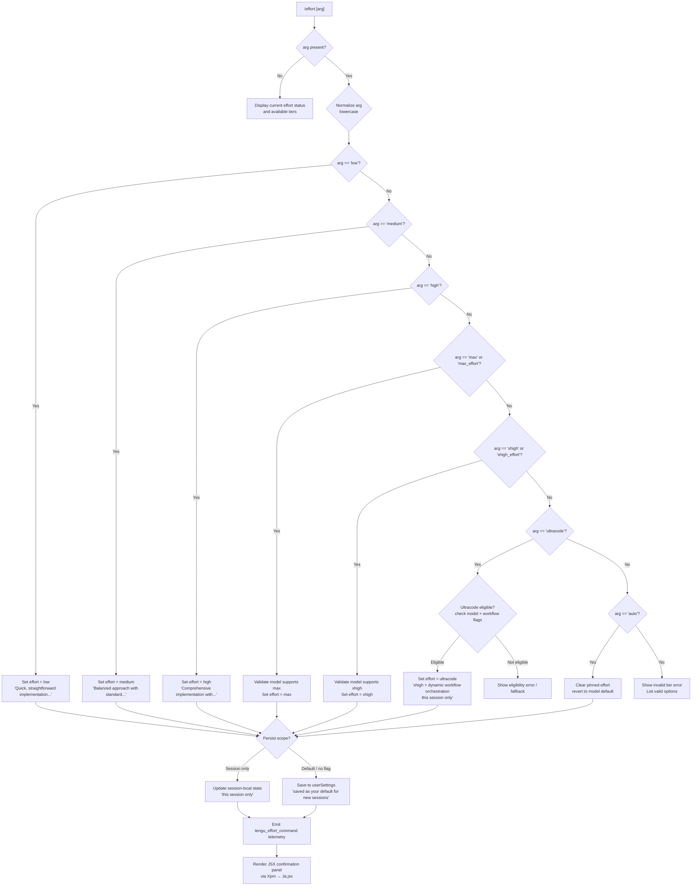

# `/effort`

> Analysis basis: CC v2.1.199 bundle.js (AST extraction + Claude interpretation)
> Minimum version: v2.1.199

---

## Overview

The `/effort` command sets the effort level that controls how deeply the model engages on tasks — from quick low-overhead responses all the way up to extended high-effort or ultracode modes. It accepts a named tier (or no argument to display current status), updates either the session-local state or the persistent user settings, and renders a JSX confirmation panel with animated feedback.

---

## Registration

| Field | Value |
|---|---|
| type | `local-jsx` |
| name | `effort` |
| description | Set effort level for model usage |
| loc_byte | `13452975` |
| loc_byte_end | `13453230` |
| loc_line | `9968` |
| argumentHint | `null` |
| immediate | `null` |
| thinClientDispatch | `control-request` |
| module_id | `ifc` |
| load_inline | `true` |
| arbor_handler.name | `Xpm` |
| arbor_handler.fqn | `claude-2.1.199::Xpm` |
| arbor_handler.kind | `AsyncFunction` |
| arbor_handler.resolution_path | `module_id` |
| arbor_handler.n_hits | `2` |

Analysis basis: CC v2.1.199 bundle.js:+13452975 – +13453230

---

## Input Branching

Six or more distinct execution paths exist depending on the argument supplied and the session context, so a Mermaid flowchart is used.



Analysis basis: CC v2.1.199 bundle.js:+13439112 (dispatch routing), +13450894 (handler entry), +13436891 (tier option assembly)

---

## Behavioral Spec

### 1. Handler Entry — `handlerMain` (`Xpm`)

```
async function handlerMain(context):
    sessionFlags = context.session.flags          # h6.includes check
    currentArg   = context.args                   # first positional token

    if currentArg == "current" or currentArg == "status":
        return renderStatusPanel(context)

    effortOptions = buildEffortOptions(context)   # ufr
    return renderEffortJsx(context, effortOptions) # Ja.jsx
```

Analysis basis: CC v2.1.199 bundle.js:+13450894

---

### 2. Building Effort Option List — `buildEffortOptions` (`ufr`)

```
function buildEffortOptions(context):
    baseOptions = getBaseOptions(context)         # ks → W6
    equalizerEntry = buildEqualizer(context)      # Eq
    filteredEntries = filterEligibleEntries(context) # CEe

    # Conditionally append ultracode tier
    if ultracodeEligible(context):
        options = baseOptions + [ultracodeEntry]  # "|ultracode" literal
    else:
        options = baseOptions

    return options.join(newline)                  # n.join at +13436938
```

Ultracode eligibility appends `"|ultracode"` to the option string
(Analysis basis: CC v2.1.199 bundle.js:+13436954).

The `auto` tier description string `"- auto: Use the default effort level for your model"` is a constant
(Analysis basis: CC v2.1.199 bundle.js:+13437119).

---

### 3. Effort Tier Dispatch — `effortCommandRouter` (`Apm` → `ozo`/`bpm`/`Spm`)

```
function effortCommandRouter(normalizedArg, context):
    switch normalizedArg:
        case "low":
            description = "Quick, straightforward implementation with minimal overhead"
            applyEffortLevel("low", description, context)

        case "medium":
            description = "Balanced approach with standard implementation and testing"
            applyEffortLevel("medium", description, context)

        case "high":
            description = "Comprehensive implementation with extensive testing and documentation"
            applyEffortLevel("high", description, context)

        case "max" | "max_effort":
            validateModelSupportsMax(context)     # Rke → Sv flow
            applyEffortLevel("max", null, context)

        case "xhigh" | "xhigh_effort":
            validateModelSupportsXhigh(context)   # kre → Sv flow
            applyEffortLevel("xhigh", null, context)

        case "ultracode":
            validateUltracode(context)            # nfc path, number constants 3/17
            applyEffortLevel("ultracode", "xhigh + dynamic workflow orchestration...", context)

        case "auto":
            clearPinnedEffort(context)            # sets to "auto" literal at +3445769

        default:
            raise InvalidTierError(normalizedArg)
```

Analysis basis: CC v2.1.199 bundle.js:+13439185 (`Ceo`), +13439310 (`ozo`), +13439822 (`bpm`), +13437726 (`Spm`)

Tier string constants found in literals:
- `"low"` (+3447452), `"medium"` (+3447530), `"high"` (+3448133), `"max"` (+3446495), `"xhigh"` (+3446526), `"ultracode"` (+13443310), `"auto"` (+3445769), `"unset"` (+3445741)

---

### 4. Model Compatibility Check — `modelSupportCheck` (`Sv`)

```
function modelSupportCheck(requiredCapability, context):
    modelId = getActiveModelId(context)           # io → P0t
    
    supportedModels = [
        "claude-3-*",        # prefix match at +3442964
        "claude-opus-4-0",   # +3442982
        "claude-opus-4-1",   # +3443005
        "claude-sonnet-4-0", # +3443028
        "claude-sonnet-4-5", # +3443053
        "claude-haiku-4-5",  # +3443078
    ]
    
    if requiredCapability == "max_effort":
        extendedModels = ["claude-opus-4-5", ...]  # +3443388
    
    if requiredCapability == "xhigh_effort":
        extendedModels = ["claude-opus-4-6", "claude-sonnet-4-6", ...]  # +3443739, +3443812

    providerType = getProviderType(context)   # qN → gr: firstParty/anthropicAws/foundry/mantle
    
    if modelId not in supportedModels + extendedModels:
        return compatibilityError(modelId)

    return OK
```

Analysis basis: CC v2.1.199 bundle.js:+3442900 (effort key literal), +3442944 (`io` call), +3443109 (`at` call)

Provider type values: `"firstParty"` (+2177138), `"anthropicAws"` (+2177156), `"foundry"` (+2177176), `"mantle"` (+2177191).

---

### 5. Ultracode Special Mode — `ultracodeValidator` (`nfc`)

```
function ultracodeValidator(context):
    # Numeric thresholds from literals
    ULTRACODE_TIER_INDEX = 3          # +13443281
    ULTRACODE_HIGH_BOUND = 17         # +13443285
    ULTRACODE_XHIGH_MODEL_INDEX = 4   # +13443379
    EFFORT_NUMERIC_SCALE = 8.5        # +13443491
    XHIGH_WORKFLOWS_BOUND = 18        # +13443591

    eligibleModels = ["claude-mythos-5", ...]   # +3443190
    ultracodeName  = "ultracode"                # +13443310
    animationTag   = "violet-ripple"            # +13443346

    currentEffortIndex = eC.indexOf(normalizedArg)  # +13443207

    if currentEffortIndex < ULTRACODE_TIER_INDEX:
        return notEligible()

    extraDesc = "xhigh + workflows"             # +13443632
    applyWithFlag("ultracode", extraDesc, context)  # ect call at +13443187
```

Analysis basis: CC v2.1.199 bundle.js:+13443187 (`nfc` entry)

The ultracode status banner string confirms session-only scope:
`"Current effort level: ultracode (xhigh + dynamic workflow orchestration; this session only)"`
(Analysis basis: CC v2.1.199 bundle.js:+13438931)

---

### 6. Persistence Scope Decision — `applyEffortLevel` (`Spm` / `bpm`)

```
function applyEffortLevel(tier, description, context):
    isSessionOnly = detectSessionOnlyFlag(context)  # f_ call at +13437784

    if isSessionOnly:
        # Update session-local state only
        scopeNote = " (this session only)"          # +13438600
        updateSessionState(tier, context)           # ozo at +13437953
    else:
        # Persist to userSettings
        scopeNote = " (saved as your default for new sessions)"  # +13438556
        saveToUserSettings(tier, context)           # MBt → Qo → userSettings at +3446924

    applyFlagSettings(context)     # "apply_flag_settings" literal at +13437614
    return buildConfirmation(tier, description, scopeNote)
```

Analysis basis: CC v2.1.199 bundle.js:+13437726 (`Spm`), +13439822 (`bpm`)

---

### 7. Remote Transport Caveat — `remoteTransportNote` (`ozo`)

When the active transport cannot propagate effort to the server, the command appends:
`" (applied locally — this remote transport can't change server effort)"`
(Analysis basis: CC v2.1.199 bundle.js:+13437491)

This is emitted by the `ozo` path at +13439310.

---

### 8. Effort Level Lookup / Validation — `effortLookup` (`c2` / `Q6e`)

```
function effortLookup(rawInput):
    s = String(rawInput).trim()                # c2 → String at +3445341, e.trim at +3444967
    parsed = parseInt(s, 10)                   # +3445402

    if isNaN(parsed):
        return resolveByName(s)                # Pue → eC.includes check
    
    if parsed < 0 or parsed > 10:             # numeric literal 10 at +3445413
        return outOfRangeError(parsed)
    
    # Map integer 0–10 to tier
    return eC[parsed]
```

Analysis basis: CC v2.1.199 bundle.js:+3445319 (`c2`), +3445780 (`Q6e`)

Named tier identifiers: `"unset"` (+3445741), `"auto"` (+3445769), `"opus-4-7"` (+3445829), `"opus-4-8"` (+3445891), `"fable-5"` (+3445953).

---

### 9. JSX Rendering — `renderEffortPanel` (`Xpm` → `Ja.jsx`, `a7`)

```
function renderEffortPanel(context, options):
    # Arc/animation helpers
    cosValues  = computeArcCos(angle)    # sfc → Math.cos, Math.min, Math.round
    sqrtValues = computeRadius(r)        # ofc → Math.sqrt

    # Animate a circular dot indicator per effort tier
    # Numeric dot positions: 2,5,6,7,8,9 at +13445081/503/513/523/533/768
    dotArray = buildDotArray(options)    # a7 → c.push, c.at, c.map

    return Ja.jsx(EffortPanelComponent, {
        options: dotArray,
        onSelect: applyEffortLevel,
        currentTier: context.currentEffort
    })                                   # Ja.jsx at +13450964
```

Analysis basis: CC v2.1.199 bundle.js:+13445181 (`a7`), +13450964 (JSX emit), +13445072 (`sfc`), +13444971 (`ofc`)

---

### 10. Workflow Availability Check — `workflowCheck` (`CGi` → `Ws`)

```
function workflowCheck(context):
    featureKey = "allow_workflows"       # +3442371
    feedbackKey = "allow_product_feedback"  # +3421226

    hasWorkflows   = vqd.has(featureKey)    # +3421170
    hasGateway     = model.includes("gateway")  # ect check at +3444220

    if hasWorkflows and isProTier:          # "pro" literal at +3442817
        return workflowsEnabled()           # tengu_workflows_enabled telemetry
    return workflowsDisabled()
```

Analysis basis: CC v2.1.199 bundle.js:+3442044 (`ES` → `CGi`), +3421154 (`Ws`), +3442572 (telemetry)

---

## State & Side Effects

| Item | Detail |
|---|---|
| Telemetry: `tengu_effort_command` | Fired on every successful effort level change (bundle.js:+13439408) |
| Telemetry: `tengu_workflows_enabled` | Fired when workflow capability is confirmed active (bundle.js:+3442572) |
| Telemetry: `tengu_slate_finch` | Fired during the rendering / confirmation path (bundle.js:+3447918) |
| `userSettings` mutation | When not session-only, the chosen tier is written to persisted user settings under key `"userSettings"` (+3446924) |
| Session-local state mutation | When session-only flag is present, only the in-memory session effort level is updated |
| `apply_flag_settings` side-effect | Feature-flag settings are re-applied after every effort change (+13437614) |
| GrowthBook experiment event | `"GrowthbookExperimentEvent"` / `"growthbook_experiment"` emitted via `vre.emit` during session creation path (+3401006, +3401458) |
| JSX render | A React component is returned (type `local-jsx`); the CLI host mounts it in the terminal UI |
| Animation | Circular arc animation (`violet-ripple` tag, +13443346) rendered for ultracode tier selection |

---

## Version History

| Version | Change |
|---|---|
| v2.1.199 | Initial analysis — `local-jsx` handler `Xpm`; tiers: low / medium / high / max / xhigh / ultracode / auto; `thinClientDispatch: control-request` |

---

## Common Mistakes

1. **Omitting the argument**: Running `/effort` with no argument shows the current status panel rather than setting anything. Provide an explicit tier name to change the level.
2. **Expecting ultracode on all models**: Ultracode is gated behind specific model eligibility (checked in `ultracodeValidator`). On unsupported models the command falls back or errors.
3. **Confusing session-only vs. persistent scope**: By default the selected tier is saved to `userSettings`. To limit the change to the current session only, the appropriate session-only flag must be active — the "(this session only)" suffix in the confirmation indicates which scope was applied.
4. **Using numeric indices without understanding the range**: The effort lookup accepts integers 0–10 mapped to internal tier names. Values outside that range are rejected as out-of-range errors.
5. **Assuming remote transport propagates effort**: On certain transports, effort is applied locally only and the model server is not notified. The confirmation message will include the remote-transport caveat string when this situation applies.
6. **Conflating `max` and `xhigh`**: These are separate tiers with different model eligibility lists. `max` / `max_effort` maps to one extended model set; `xhigh` / `xhigh_effort` maps to a different set including newer Opus/Sonnet variants.

---

## Appendix — Identifier Mapping

> For bundle debugging only. Identifiers change across versions.

| Identifier | Role |
|---|---|
| `Xpm` | Main async handler for `/effort` (arbor_handler; `claude-2.1.199::Xpm`) |
| `dfr` | Top-level effort command orchestrator / entry point |
| `Rre` | Secondary dispatch layer called from `dfr` |
| `ES` | Environment/session state accessor |
| `KDn` | Configuration key normalizer |
| `CGi` | Feature-capability resolver (workflow / feedback flags) |
| `Ws` | Workflow availability checker (reads `vqd`, `wqd` sets) |
| `Teo` | Tier eligibility mapper |
| `jqd` | Tier validation sub-routine |
| `Wqd` | Config value coercion helper |
| `cJ` | Effort command core router (dispatches to Sv, Z6e, DBt, Q6e, Pue, Mke, Rke, kre) |
| `Sv` | Model compatibility check for standard tiers |
| `io` | Active model ID accessor |
| `x$` | Model provider type resolver (`hx` path) |
| `qN` | Provider category classifier (`gr` path) |
| `Vg` | Provider metadata fetcher (`Q1t`, `iId`, `gr`, `OV`) |
| `Z6e` | Effort level lookup by model alias (`opus-4-7`, `opus-4-8`, `fable-5`) |
| `Mt` | Config access guard (raises "Config accessed before allowed." error) |
| `q6` | Alias resolution helper (`Zi`) |
| `DBt` | `high` tier setter |
| `hx` | Provider-type enum accessor (`eId`) |
| `Q6e` | Effort level numeric/string resolver |
| `c2` | Effort string-to-index parser (`parseInt`, `isNaN`, numeric bound 10) |
| `Pue` | Named tier membership validator (`eC.includes`) |
| `Mke` | Effort mutation applicator (calls `ect`, `kke`) |
| `ect` | Core effort state writer (`gr`, `io`, `CX`, `UNt`, `Pue`) |
| `kke` | Effort index finder (`eC.indexOf`) |
| `Rke` | `max` / `max_effort` tier handler |
| `kre` | `xhigh` / `xhigh_effort` tier handler |
| `Vl` | Utility: JSX element factory / view builder |
| `jte` | JSX sub-element helper |
| `TO` | Effort command UI controller (wraps `cJ`, `vEe`) |
| `vEe` | Effort display formatter (calls `Pue`) |
| `Oue` | String conversion utility for effort labels |
| `Ceo` | Telemetry + session event emitter (`tengu_slate_finch`) |
| `qqd` | Session event type constant |
| `pye` | Session/model context accessor |
| `Oi` | Model metadata resolver (`c6r`, `l6r`, `EE`) |
| `EE` | Full model descriptor builder |
| `ot` | Task/session launcher with dedup set (`bke`, `_q`, `mBt`) |
| `HG` | Session hierarchy resolver (`hG`) |
| `wDn` | Session creation with dedup guard (`YZr`, `KZr`, `eeo`) |
| `KZr` | New session initializer (UUID, `xe`, `oqd`, `vre.emit`) |
| `eeo` | Session post-setup (GrowthBook experiment, `zg`, `Mt`) |
| `sfc` | Arc cosine calculator for dot animation |
| `ofc` | Radius calculator (sqrt) for dot animation |
| `nfc` | Ultracode tier validator (thresholds: 3, 17, 4, 8.5, 18) |
| `Opm` | Effort numeric scale mapper (`Math.min`, `Math.max`, tier slices) |
| `rzo` | Tier array slicer/mapper |
| `LGi` | Effort tier list builder with gateway filter |
| `Vqd` | Tier pair selector (`kre`, `Rke`) |
| `Eq` | Equalizer / display option assembler |
| `J6e` | Effort display entry formatter |
| `ufr` | Full effort options list builder |
| `ks` | Model/config state reader (`W6`, `Bo`, `MH`) |
| `W6` | Config bundle accessor (`u_`, `x3`, `ts`, `za`) |
| `za` | Settings aggregator (policy, user, model mappings) |
| `mOt` | OS/platform config loader |
| `gOt` | Settings object builder |
| `qne` | Setting value resolver with trim/dedup |
| `VV` | Value validator/formatter |
| `VN` | Supported-ID list checker |
| `Uw` | Model alias normalizer (`eye.includes`) |
| `uvn` | Recursive settings resolver |
| `wgi` | Entry iterator for settings map |
| `kn` | Settings key normalizer |
| `Rst` | Settings object entries flattener |
| `vgi` | Settings index finder |
| `Gwd` | Setting merge helper |
| `Bo` | Model name resolver (alias → canonical; handles `fable`, `opusplan`, `sonnet`, `haiku`, `opus`, `best`) |
| `NNt` | Model tier normalizer (handles `claude-` prefix stripping) |
| `Wwd` | Setting start-prefix matcher |
| `MH` | Model/setting compound resolver |
| `fv` | Full config state reader (calls `TIr`, `K6`, `aBe`, `kgi`, `UWr`, `VNt`, `jNt`) |
| `TIr` | Config telemetry recorder |
| `K6` | Config key resolver (`Nce`, `kgi`) |
| `aBe` | Config fallback handler |
| `kgi` | Config tier mapper (`VNt`, `jNt`, `sye`) |
| `UWr` | Config value formatter/writer |
| `VNt` | Full config value normalizer (model tier pinning, policy-mapping logic) |
| `jNt` | Config change applier (`VV`, `qne`, `za`, `ONt`) |
| `CEe` | Eligible tier entry filter |
| `pfr` | Effort panel prop builder |
| `tfc` | Effort command UI entry (lowercase normalize, routes to `Apm`, `bpm`, `tct`, `lfr`, `ks`, `Spm`) |
| `Apm` | Effort quick-path handler (`ozo`, `MBt`, `V`, `qe`, `Vl`, `Q6e`) |
| `ozo` | Remote-transport-aware effort applicator |
| `f_` | Session-only flag detector |
| `MBt` | UserSettings effort writer (`Dke`, `Vl`, `Qo`, `u2`) |
| `Dke` | UserSettings key constant for effort |
| `Qo` | UserSettings persistence helper (`Hf`) |
| `u2` | UserSettings accessor (`Hn`) |
| `V` | Confirmation message builder |
| `qe` | JSX element constructor (`GZe`) |
| `bpm` | Full effort change path (session + user settings, `ks`, `Eq`, `lfr`, `kre`, `J6e`, `ozo`, `u2`, `V`, `qe`, `Vl`, `Q6e`) |
| `lfr` | Effort tier label formatter (`CEe`, `Eq`, `t.join`, `ultracode` append) |
| `tct` | Trim + validate effort arg (`Pue`) |
| `Spm` | Session-persistence effort path (`ks`, `Mke`, `Dke`, `f_`, `ozo`, `MBt`, `V`, `Vl`, `Q6e`, `Oue`, `Ceo`) |
| `a7` | Dot-animation array builder (`ZCt.c`, `sfc`, `ofc`, `c.at`, `c.push`, `Ja.jsx`, `c.map`) |
| `c` | Animation frame accumulator |
| `ln` | Animation utility function |

---

Note: index built via Arbor fallback; some signals (telemetry, literals) may be missing — see arbor-fallback.js.