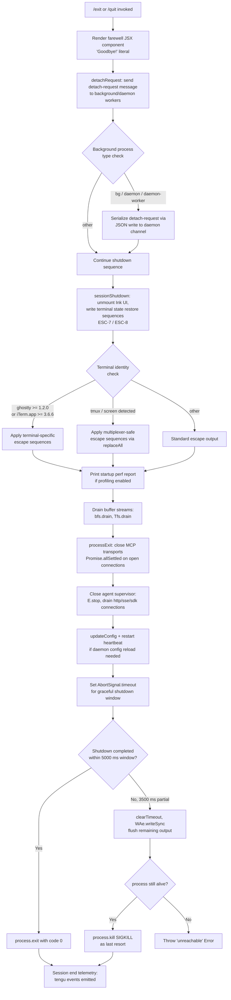

# `/exit`

> Analysis basis: CC v2.1.199 bundle.js (AST extraction + Claude interpretation)
> Minimum version: v2.1.199

---

## Overview

The `/exit` command (also aliased as `/quit`) terminates the Claude Code CLI session immediately. When invoked, it renders a JSX farewell component, tears down all active subsystems in a defined sequence (MCP connections, supervisors, agent loops, UI), and then calls `process.exit`. The command is registered as `immediate`, meaning it executes without waiting for any pending agent turn.

---

## Registration

| Field | Value |
|---|---|
| type | `local-jsx` |
| name | `exit` |
| aliases | `["quit"]` |
| description | `null` |
| immediate | `true` |
| module_id | `Udc` |
| load_inline | `true` |
| loc_byte | `13387363` |
| loc_byte_end | `13387559` |
| loc_line | `9957` |
| arbor_handler.name | `xdm` |
| arbor_handler.fqn | `claude-2.1.199::xdm` |
| arbor_handler.kind | `AsyncFunction` |
| arbor_handler.resolution_path | `module_id` |
| arbor_handler.n_hits | `1` |

Analysis basis: CC v2.1.199 bundle.js:+13387363

---

## Input Branching

The command has more than three distinct internal execution branches (UI render path, terminal-state saving, process-group teardown, graceful shutdown vs. forced SIGKILL, timeout paths). A Mermaid flowchart is used.



Analysis basis: CC v2.1.199 bundle.js:+13386580, +6913009, +6910665, +6910715

---

## Behavioral Spec

### 1. Handler Entry: `exitCommandHandler` (`xdm`)

The primary handler is the `AsyncFunction` resolved by Arbor as `xdm` via the `module_id` → `Udc` path.

```
async function exitCommandHandler(context):
    // Step 1: Render farewell UI
    render farewell JSX element
    // The 'Goodbye!' string literal is displayed (bundle.js:+13386542)

    // Step 2: Check process role and issue detach-request
    processRoleCheck(context)          // calls ii → a0e
    normalizeText(context.input)       // calls e → t.replace

    // Step 3: Dispatch detach-request to daemon channel
    detachAndSerialize(context)        // calls bIe

    // Step 4: Retrieve session metadata
    getSessionMetadata(context)        // calls Ym

    // Step 5: Build scheduled-task list
    buildScheduledTaskList(context)    // calls IYa

    // Step 6: Render JSX shutdown component
    renderShutdownJSX(Fdc.jsx, context)

    // Step 7: Finalize agent loop reference
    finalizeAgentLoop(Ldm → JR)

    // Step 8: Execute full shutdown sequence
    await fullShutdownSequence(context)   // calls Si

    // Step 9: Emit prompt_input_exit telemetry marker
    // literal "prompt_input_exit" at bundle.js:+13386800
```

Analysis basis: CC v2.1.199 bundle.js:+13386580, +13386592, +13386596, +13386613, +13386627, +13386657

---

### 2. Detach-Request Dispatch: `detachAndSerialize` (`bIe`)

Before tearing down the UI, the handler signals any background daemon processes.

```
function detachAndSerialize(context):
    // Resolves background worker process identity
    resolveBackgroundWorker(context)     // calls Rvn

    // Identifies the worker task type ("task" literal at bundle.js:+8066635)
    identifyWorkerTask(context)          // calls wYa → UHt, ln

    // Writes a "detach-request" message to the daemon channel
    // literal "detach-request" at bundle.js:+11857516
    writeDetachedMessage(channel):
        channel.write(serializedMessage)  // calls Mj → gee.write
        serialize(message):               // calls xe → JSON.stringify
            return JSON.stringify(message)

    // Registers completion callback
    registerCompletionCallback(context)   // calls cge
```

Analysis basis: CC v2.1.199 bundle.js:+11857479, +11857498, +11857507, +11857516, +11857592

---

### 3. Full Shutdown Sequence: `fullShutdownSequence` (`Si`)

This is the core multi-stage teardown function. It coordinates UI unmounting, output flushing, MCP connection closure, and the final `process.exit` or `process.kill`.

```
async function fullShutdownSequence(context):
    // Stage A: Unmount UI and restore terminal state
    await unmountAndRestoreTerminal(context)    // calls U8e

    // Stage B: Write terminal restore escape sequences
    writeTerminalEscapes(context)              // calls L1n
        // ESC-7 (\x1b7) save cursor, ESC-8 (\x1b8) restore cursor
        // bundle.js:+3963138, +3963149
        writeSync(stdout, escapeSequence)      // calls soe.writeSync
        // Terminal detection sub-logic:
        detectTerminalKind(context):           // calls xGe
            if terminal == "ghostty" and version >= "1.2.0":
                applyGhosttyEscapes()
            elif terminal == "iTerm.app" and version >= "3.6.6":
                applyiTermEscapes()
        // Multiplexer handling
        detectMultiplexer(context):            // calls Lx
            if env includes "tmux":
                replaceAll("\x1b\x1b", safeSequence)
            elif env includes "screen":
                replaceAll(escapeSequence, safeSequence)

    // Stage C: Drain output buffer streams
    drainBufferStreams(context):
        drainPrimary()                         // calls ket → bfs.drain
        drainSecondary()                       // calls Hun → Tfs.drain

    // Stage D: Build process-exit pipeline
    exitPipeline = buildExitPipeline(context)  // calls G_o
        // Collects argv for restart shell command:
        collectArgv(context)                   // calls ejt
            joinArgs(jh.join)
            checkStatSync(r.statSync)
        // Registers process.on("exit") handler
        registerExitHook(context):             // calls ig → ru
            process.on("exit", exitHookCallback)

    // Stage E: Set timeout guard (5000 ms total, 3500 ms soft)
    // bundle.js:+6913106 (5000), +6913113 (3500)
    shutdownTimer = setTimeout(forceKill, 5000)
    softTimer     = Math.max(0, 3500)

    // Stage F: Await MCP transports closure
    await closeMCPTransports(context):         // calls BPa
        results = await Promise.allSettled(
            Array.from(openConnections)
        )

    // Stage G: Await agent/subprocess closure
    await closeAgentSubprocesses(context):     // calls hOa
        results = await Promise.allSettled(
            Array.from(agentHandles)
        )

    // Stage H: AbortSignal timeout (2000 ms inner fence)
    // bundle.js:+6913291 (2000 ms literal)
    signal = AbortSignal.timeout(2000)

    // Stage I: Write startup perf telemetry
    writeStartupPerfReport(context):           // calls zkt → lLr → Fhs
        if profilingEnabled:
            report = buildPerfReport()
            writeFileSync(reportPath, report, "utf8")
            emit("tengu_startup_perf")         // bundle.js:+230441

    // Stage J: Scroll summary / cache eviction telemetry
    emitScrollSummary(context):                // calls b5n
        emit("tengu_scroll_summary")           // bundle.js:+6912522
        emit("tengu_cache_eviction_hint")      // bundle.js:+6913488

    // Stage K: Stop supervisor (E.stop) and session end marker
    stopSupervisor(context):                   // calls d → E.stop
        supervisor.stop()
        stopHeartbeat()
        updateConfig(newConfig)
        supervisor.start(newConfig)
        emit("tengu_daemon_config_reload")     // bundle.js:+18546460

    // Stage L: Emit session_end event
    emitSessionEnd():                          // calls qe → GZe
        // literal "session_end" at bundle.js:+6913526
        emitEvent("session_end")

    // Stage M: Emit nonconforming / prompt_input_exit markers
    emitInputExitMarker():                     // calls mr → Zf
        // literal "nonconforming" at bundle.js:+2352466
        // literal "prompt_input_exit" at bundle.js:+13386800

    // Stage N: Flush remaining parallel tasks
    await flushParallelTasks(context):         // calls I6 → Promise.all

    // Stage O: Flush final write buffer
    await flushFinalBuffer(context):           // calls $8e → Promise.resolve → y5n

    // Stage P: Synchronous terminal write before exit
    WAe.writeSync(stdout, finalOutput)         // bundle.js:+6913611

    // Stage Q: Graceful exit or force kill
    clearTimeout(shutdownTimer)
    if process still running:
        W_o():
            clearTimeout(inner)
            hu.get(processHandle)
            if handle found:
                process.exit(0)               // bundle.js:+6910665
            else:
                process.kill(pid, "SIGKILL")  // bundle.js:+6910715
                // If neither path reachable:
                throw new Error("unreachable") // bundle.js:+6910738
```

Analysis basis: CC v2.1.199 bundle.js:+6913009, +6913060, +6913077, +6913083, +6913089, +6913097, +6913106, +6913113, +6913226, +6913291, +6913303, +6913351, +6913374, +6913450, +6913463, +6913523, +6913557, +6913574, +6913585, +6913611, +6910665, +6910715, +6910738

---

### 4. Terminal State Writer: `writeTerminalState` (`L1n`)

```
function writeTerminalState(context):
    // Save current cursor position
    soe.writeSync(fd, "\x1b7")               // bundle.js:+3963138
    // Restore cursor position
    soe.writeSync(fd, "\x1b8")               // bundle.js:+3963149

    // Detect terminal emulator
    termKind = detectTerminalKind(env):       // calls xGe
        coerce(hzi.coerce, versionString)
        if name == "ghostty" and version >= "1.2.0":
            return "ghostty"                  // bundle.js:+3683027, +3682057
        elif name == "iTerm.app" and version >= "3.6.6":
            return "iterm"                    // bundle.js:+3683096, +3683128
        else:
            return null

    // Handle multiplexer environments
    detectMultiplexer(env):                   // calls Lx → Xto
        if TERM_PROGRAM includes "tmux":
            replaceAll("\x1b\x1b", ...)       // bundle.js:+3605728, +3605774
        elif TERM includes "screen":
            replaceAll(...)                    // bundle.js:+3605801

    // Write ANSI log output
    writeLogOutput(level, message):           // calls T
        if level == "debug":                  // bundle.js:+218244
            formatAndWrite(message)
        elif level == "error":                // bundle.js:+3963292
            writeError(message)
```

Analysis basis: CC v2.1.199 bundle.js:+3963138, +3963149, +3963158, +3963188, +3963210, +3963231, +3682733, +3683027, +3683096, +3605715, +3605728

---

### 5. Force-Kill Finalizer: `forceKillFinalizer` (`W_o`)

```
function forceKillFinalizer(context):
    clearTimeout(innerTimer)
    handle = hu.get(processHandleMap)
    if handle != null:
        process.exit(0)                       // bundle.js:+6910665
    else:
        pid = process.pid
        process.kill(pid, "SIGKILL")          // bundle.js:+6910690, +6910715
        // This branch should be unreachable:
        throw new Error("unreachable")        // bundle.js:+6910738
```

Analysis basis: CC v2.1.199 bundle.js:+6910584, +6910617, +6910665, +6910690, +6910715, +6910738

---

### 6. Startup Profiling Report: `writeStartupPerfReport` (`zkt` → `lLr` → `Fhs`)

```
function writeStartupPerfReport(context):
    config = loadPerfConfig(o6)              // calls require("perf_hooks")
    if not config.enabled:
        log("Startup profiling not enabled") // bundle.js:+228260
        return
    checkpoints = getCheckpoints()
    if checkpoints.length == 0:
        log("No profiling checkpoints recorded") // bundle.js:+228350
        return

    // Build report string (80-char wide) // bundle.js:+228413
    report = buildReport(checkpoints):
        header = "STARTUP PROFILING REPORT"  // bundle.js:+228425
        for each checkpoint:
            append formatted row (8-char indent) // bundle.js:+228573
    writeFileSync(reportPath, report, "utf8") // bundle.js:+228910, via fwe → Ygs.writeFileSync
    emitTelemetry("tengu_startup_perf", reportData)  // bundle.js:+230441

    // Emit performance mark
    mark("main_after_run")                   // bundle.js:+229490
```

Analysis basis: CC v2.1.199 bundle.js:+228755, +228770, +228847, +228260, +228350, +228413, +228425, +228910, +229490, +230441

---

### 7. Scroll Summary Emitter: `emitScrollSummary` (`b5n`)

```
function emitScrollSummary(rx, context):
    // Collect scroll metrics
    metrics = buildScrollMetrics(context):    // calls rOa
        now = Date.now()
        elapsed = Math.max(0, now - startTime)
        roundedElapsed = Math.round(elapsed)
        merged = Object.assign({}, baseMetrics, { elapsed: roundedElapsed })
        applyScrollOverride(tOa, merged)

    // Emit event
    emitTelemetry("tengu_scroll_summary", metrics) // bundle.js:+6912522

    // Store result
    V(result)                                // stores in shared state

    // Register scroll observer
    registerScrollObserver(oOa, context)

    // Update z-state
    updateZState(zs, context)
```

Analysis basis: CC v2.1.199 bundle.js:+6912508, +6912514, +6912520, +6912549, +6912566, +6912522

---

## State & Side Effects

| Item | Detail |
|---|---|
| Telemetry: `tengu_daemon_config_reload` | Emitted when daemon config is reloaded during supervisor restart (bundle.js:+18546460) |
| Telemetry: `tengu_startup_perf` | Emitted with startup profiling data if profiling was enabled for the session (bundle.js:+230441) |
| Telemetry: `tengu_scroll_summary` | Emitted with scroll metrics collected over the session lifetime (bundle.js:+6912522) |
| Telemetry: `tengu_amber_creek` | Emitted during fullscreen-mode state transitions (bundle.js:+3615374) |
| Telemetry: `tengu_pewter_brook` | Emitted during fullscreen-mode detection / fallback path (bundle.js:+3615281) |
| Telemetry: `tengu_cache_eviction_hint` | Emitted with cache eviction hint data at session end (bundle.js:+6913488) |
| Hook registration | `process.on("exit", ...)` registered via `ru` (bundle.js:+13827589) |
| Daemon channel write | `"detach-request"` message serialized via `JSON.stringify` and written to daemon IPC channel (bundle.js:+11857516) |
| Startup perf report | Written to disk via `Ygs.writeFileSync` in UTF-8 encoding if profiling was active (bundle.js:+195493) |
| Terminal escape sequences | ESC-7 / ESC-8 save/restore cursor written to stdout via `soe.writeSync` (bundle.js:+3963138, +3963149) |
| MCP connections closed | All open MCP transports closed via `Promise.allSettled` over connection set (bundle.js:+6913351) |
| Agent subprocesses closed | All agent handles closed via `Promise.allSettled` (bundle.js:+6913374) |
| Supervisor stopped | `E.stop()` called; supervisor restarted with updated config if daemon reload required (bundle.js:+18545935) |
| `session_end` marker | Event literal `"session_end"` emitted via `qe → GZe` (bundle.js:+6913526) |
| `prompt_input_exit` marker | Literal `"prompt_input_exit"` emitted via `mr → Zf` path (bundle.js:+13386800) |
| `process.exit(0)` | Called unconditionally once handle is confirmed present (bundle.js:+6910665) |
| `process.kill(pid, "SIGKILL")` | Called as fallback if no handle found in final kill step (bundle.js:+6910715) |
| appState changes | Scroll state, session state, and cache eviction hint stored via `V()` shared state accessor |
| Sound | None identified in depth-2 traversal |
| Shutdown timeouts | 5000 ms hard timeout, 3500 ms soft timeout, 2000 ms inner AbortSignal fence (bundle.js:+6913106, +6913113, +6913291) |

---

## Version History

| Version | Change |
|---|---|
| v2.1.199 | Initial analysis |

---

## Common Mistakes

1. **Confusing `/exit` with a graceful no-op**: The command immediately terminates the process; any unsaved agent work in progress is discarded. Because `immediate: true` is set, the command does not wait for a pending agent turn to complete.

2. **Expecting `/exit` and `/quit` to behave differently**: Both names resolve to the same handler (`xdm`) via the `aliases: ["quit"]` registration field. There is no behavioral difference.

3. **Assuming the process always exits cleanly**: If the process handle cannot be found, the shutdown path falls through to `process.kill(pid, "SIGKILL")` rather than a clean `process.exit(0)`. Network-connected MCP sessions may be abruptly terminated.

4. **Ignoring the shutdown timeout**: Operations that take longer than 5000 ms (e.g., slow MCP transport closure or a large startup-perf report write) will be interrupted by the hard-kill timer.

5. **Running `/exit` in a daemon-mode session and expecting daemon to persist**: The `"detach-request"` message is sent to the daemon channel, but the daemon process will also receive the shutdown signal via the supervisor teardown path.

---

## Appendix — Identifier Mapping

> For bundle debugging only. Identifiers change across versions.

| Identifier | Role |
|---|---|
| `xdm` | Main exit command handler (`AsyncFunction`; Arbor-resolved entry point) |
| `ii` | Process role checker (determines bg / daemon / daemon-worker type) |
| `a0e` | Role resolution helper called by process role checker |
| `bIe` | Detach-and-serialize dispatcher (sends detach-request to daemon channel) |
| `Rvn` | Background worker resolver |
| `wYa` | Worker task identifier |
| `UHt` | Task type lookup helper |
| `ln` | Task label accessor |
| `Mj` | Daemon channel message writer |
| `xe` | JSON serializer wrapper |
| `cge` | Completion callback registrar |
| `Ym` | Session metadata retriever |
| `IYa` | Scheduled-task list builder |
| `La` | String truncation / substring utility |
| `sn` | String visual width calculator (via `Bun.stringWidth`) |
| `Os` | Visual width overflow handler |
| `rS` | Width remainder calculator |
| `bvo` | Scheduled-task record builder |
| `QC` | Task queue accessor |
| `Aw` | Global app-state accessor |
| `pXp` | Scheduled-task timestamp resolver |
| `ZO` | Date/time pattern parser |
| `kU` | Time-spec tokenizer |
| `Npt` | Next-occurrence calculator |
| `ha` | Duration formatter (floor/round math) |
| `Ldm` | Agent loop reference finalizer |
| `Si` | Full shutdown sequence orchestrator |
| `U8e` | UI unmount and terminal-write handler |
| `gU` | UI state accessor used during unmount |
| `L1n` | Terminal state writer (escape sequences + log output) |
| `xGe` | Terminal emulator kind detector |
| `TGe` | Terminal geometry accessor |
| `Lx` | Multiplexer-safe escape sequence rewriter |
| `Dd` | Terminal dimension helper |
| `T` | ANSI log formatter and writer |
| `G_o` | Exit pipeline builder (argv collection, shell restart prep) |
| `rx` | Runtime context accessor |
| `X5` | Shell path resolver |
| `kt` | App-state reader (used in multiple contexts) |
| `ejt` | Argv collector for restart command |
| `L3` | Argument accessor helper |
| `ar` | Argument array accessor |
| `zt` | Path joiner / normalizer |
| `ig` | Exit hook registrar |
| `ru` | `process.on("exit")` hook installer |
| `zgi` | Shell command string builder |
| `W_o` | Force-kill finalizer (process.exit / SIGKILL) |
| `ket` | Primary buffer drainer (`bfs.drain`) |
| `d` | Supervisor session manager (stop/start/config) |
| `vJe` | File-stat and session-file reader |
| `rn` | ENOENT error handler |
| `Qs` | Async local storage store getter |
| `m7o` | Session file path resolver |
| `ge` | String coercion helper |
| `ihc` | Config key-width calculator |
| `E` | Supervisor stop/connection manager |
| `VQe` | Connection drain helper |
| `ke` | Connection error logger |
| `sr` | Error serializer |
| `b` | MCP subprocess/server manager |
| `KAr` | Array-check transport handler |
| `qAr` | Transport string processor |
| `H` | OIDC / user-info handler (also MCP process kill) |
| `iru` | Heartbeat restart utility |
| `Mue` | Heartbeat event emitter |
| `I` | Input handler / keyboard event processor |
| `R` | HTTP request router (OAuth, MCP gateway) |
| `V` | Shared state setter |
| `BPa` | MCP transport closer (`Promise.allSettled`) |
| `hOa` | Agent subprocess closer (`Promise.allSettled`) |
| `zkt` | Startup perf report writer entry point |
| `lLr` | Performance measurement collector |
| `Fhs` | Perf report formatter and emitter |
| `Dhs` | Profiling checkpoint aggregator |
| `Nhs` | Checkpoint path builder |
| `fwe` | File writer wrapper (`Ygs.writeFileSync`) |
| `xhs` | Checkpoint entry formatter |
| `o6` | `perf_hooks` module requirer |
| `Uhs` | Checkpoint output path resolver |
| `b5n` | Scroll summary emitter |
| `oOa` | Scroll observer registrar |
| `rOa` | Scroll metrics builder |
| `tOa` | Scroll metric override applier |
| `zs` | Z-state / fullscreen state updater |
| `oO` | Feature-flag set checker |
| `hD` | Feature flag `fOi.isEnabled` checker |
| `nno` | Notification helper |
| `Wre` | Fullscreen disable warning emitter |
| `tno` | Boolean-coercing state toggler |
| `Lr` | Config value reader (`CV`) |
| `tYd` | Display-mode transition handler |
| `ot` | Fullscreen state machine |
| `o0t` | Orphan-task collector |
| `qe` | Session-end event emitter |
| `GZe` | Global event bus |
| `mr` | Nonconforming / prompt_input_exit marker emitter |
| `Zf` | Secondary event bus accessor |
| `I6` | Parallel task flusher (`Promise.all`) |
| `$8e` | Final buffer flush (`Promise.resolve → y5n`) |
| `y5n` | Final write completion callback |
| `cPt` | Post-flush cleanup step |
| `OHe` | Output handle closer |
| `Hun` | Secondary buffer drainer (`Tfs.drain`) |

---

Note: index built via Arbor fallback; some signals (telemetry, literals) may be missing — see arbor-fallback.js.