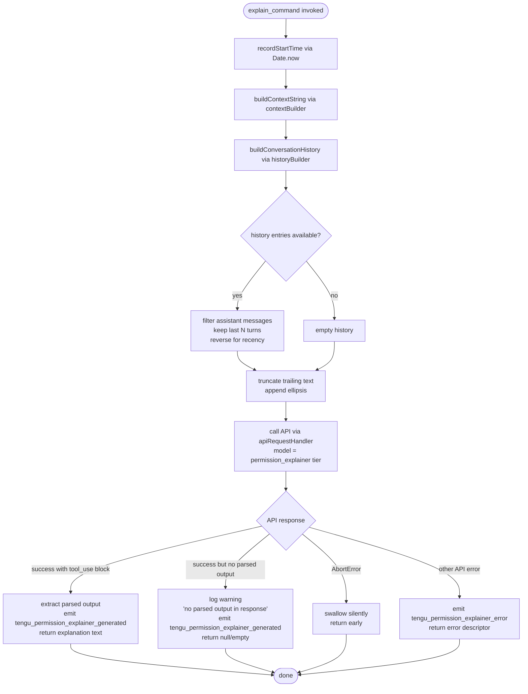

# `/explain_command`

> Analysis basis: CC v2.1.199 bundle.js (AST extraction + Claude interpretation)
> Minimum version: v2.1.199

---

## Overview

The `explain_command` slash command is an internal `tool`-type registration that invokes a **permission explainer** subsystem. When triggered, it queries the model asynchronously to produce a human-readable explanation of why a specific tool invocation requires a given permission, then emits the result as structured output. It is not a user-facing prompt command but rather a background utility tool used by the UI permission-review flow.

---

## Registration

| Field | Value |
|---|---|
| type | `tool` |
| name | `explain_command` |
| description | `null` |
| loc_byte | `15344210` |
| loc_byte_end | `15344246` |
| loc_line | `12510` |
| arbor_handler.name | `zOc` |
| arbor_handler.fqn | `claude-2.1.199::zOc` |
| arbor_handler.kind | `AsyncFunction` |
| arbor_handler.resolution_path | `direct` |
| arbor_handler.n_hits | `1` |

Analysis basis: CC v2.1.199 bundle.js:+15344210

---

## Input Branching

Five or more distinct execution branches are present in the handler and its immediate callees, so a Mermaid flowchart is used.



Analysis basis: CC v2.1.199 bundle.js:+15343905 (handler entry `zOc`), +15344115 (API call site `ks`), +15344693 (success telemetry), +15344905 (error telemetry), +15345363 (AbortError literal), +15345040 (no-parsed-output warning literal)

---

## Behavioral Spec

### Top-level handler (`zOc`)

```
async function explainCommandHandler(toolInput, context):
    startTime = Date.now()                         // +15343929

    contextString = buildContextString(toolInput)  // DNm → +15343950
    history = buildConversationHistory(context)    // PNm → +15343968

    apiResult = await callPermissionExplainerAPI(  // ks  → +15344115
        contextString,
        history,
        context
    )

    if apiResult.type == "tool_use":               // +15344423
        emit tengu_permission_explainer_generated   // +15344693
        return extractExplanation(apiResult)

    if apiResult is AbortError:                    // +15345363
        return                                     // silent

    emit tengu_permission_explainer_error          // +15344905
    return buildErrorDescriptor(apiResult)         // +15345434
```

Analysis basis: CC v2.1.199 bundle.js:+15343905

---

### Context string builder (`DNm`)

```
function buildContextString(toolInput):
    raw = jsonStringify(toolInput)                 // xe → +15343420
    return String(raw).slice(0, MAX_CONTEXT_CHARS) // constant 2 used as indent → +15343430
```

The function serialises the tool-input object via `JSON.stringify` with a numeric indent constant of `2` (bundle.js:+15343430), then coerces to `String` (bundle.js:+15343446).

Analysis basis: CC v2.1.199 bundle.js:+15343950

---

### Conversation history builder (`PNm`)

```
function buildConversationHistory(context):
    entries = context.messages
        .filter(m => m.role == "assistant")        // "assistant" literal → +15343509
        .filter(m => isRecentEnough(m))

    // keep at most last N=1000 chars per entry    // 1000 → +15343474
    trimmed = entries
        .reverse()                                 // recency order → +15343554
        .map(m => truncateEntry(m, maxLen=1000))

    // append ellipsis sentinel when truncated
    result = trimmed
        .map(m => m.text + (truncated ? "..." : ""))  // "..." → +15343705
        .reverse()
        .join(separator)                           // PNm.r.join → +15343746

    // prepend role tag
    result.unshift(roleLabel)                      // +15343713
    return result
```

Key constants:
- Message role filter: `"assistant"` (bundle.js:+15343509)
- Per-entry character ceiling: `1000` (bundle.js:+15343474)
- Maximum turns kept: `3` (bundle.js:+15343529)
- Content type label: `"text"` (bundle.js:+15343612)
- Truncation sentinel: `"..."` (bundle.js:+15343705)

Analysis basis: CC v2.1.199 bundle.js:+15343968

---

### API call orchestrator (`ks` → `W6` → `za` → inner model pipeline)

```
async function callPermissionExplainerAPI(contextString, history, context):
    // resolve model tier for permission explainer
    model = resolveModelTier("permission_explainer")  // literal → +15344268

    // build request via inner model pipeline (W6, za, Bo, NNt, VNt …)
    request = buildAPIRequest(
        model      = model,
        system     = buildSystemPrompt(context),
        messages   = history,
        tools      = [permissionExplainerTool],
        tool_choice = "any"
    )

    response = await apiRequestHandler(request, context.abortSignal)
    return response
```

The `W6` helper (bundle.js:+2331279) delegates to `za` (bundle.js:+2331237), which in turn invokes the full model-selection pipeline (`mOt`, `gOt`, `qne`, `VV`, `Bo`, `NNt`, `VNt`, …). The `VNt` function performs deep tool-choice resolution, deduplication, and schema normalisation before the request is dispatched.

Analysis basis: CC v2.1.199 bundle.js:+15344115

---

### Side-query API transport (`uF`)

```
async function sideQueryAPITransport(request, signal):
    // label this call as a side_query          // "side_query" → +9327234
    request.headers["x-app"] = "side_query"

    // send via apiRequestExecutor (aq)
    response = await apiRequestExecutor(request, signal)
    return response
```

The `uF` function (bundle.js:+15344128) wraps the standard `aq` executor (bundle.js:+9327202) and marks requests with the `"side_query"` label. It also performs lone-surrogate sanitisation (`tengu_lone_surrogate_sanitized`) before handing off the response body.

Analysis basis: CC v2.1.199 bundle.js:+9327234

---

### Output extraction and error classification

```
function extractOrClassify(apiResponse):
    if apiResponse.stopReason == "tool_use":           // "tool_use" → +15344423
        content = apiResponse.content
            .find(block => block.type == "tool_use")
        if content is null:
            warn("Permission explainer: no parsed output in response")
            //   literal → +15345040
            return null
        return content.input                           // structured explanation

    if apiResponse.name == "AbortError":               // +15345363
        return ABORT_SENTINEL

    errorKind = classifyAPIError(apiResponse)          // "api_error" → +15345434
    return { kind: errorKind, raw: apiResponse }
```

Analysis basis: CC v2.1.199 bundle.js:+15344423, +15345040, +15345363, +15345434

---

## State & Side Effects

| Item | Detail |
|---|---|
| Telemetry — success | `tengu_permission_explainer_generated` (bundle.js:+15344693) |
| Telemetry — error | `tengu_permission_explainer_error` (bundle.js:+15344905) |
| Telemetry — API transport (inherited) | `tengu_api_success` (+9328907), `tengu_lone_surrogate_sanitized` (+9328603), `tengu_byte_stream_idle_timeout_ms` (+3087544), `tengu_byte_watchdog_fired_late` (+3088806), `tengu_gzip_request_bodies` (+3089438), `tengu_stream_watchdog_default_on` (+3089607) |
| Telemetry — feature flags (inherited) | `tengu_feature_ok` (+1039941), `tengu_feature_bad` (+1040008), `tengu_feature_sad` (+1040089) |
| Telemetry — daemon / bg workers (reachable via transport) | `tengu_daemon_config_reload`, `tengu_daemon_yield`, `tengu_bg_*` family — fired by the daemon layer, not by `explain_command` directly |
| appState changes | None directly; the handler is read-only with respect to application state |
| Hook registration | None observed in depth-2 traversal |
| Sound | None observed in depth-2 traversal |
| Abort handling | `AbortError` is caught and swallowed silently; no cleanup side effect |
| HTTP headers set | `"side_query"` label injected via `uF`; standard auth/session headers added by `aq` transport |

---

## Version History

| Version | Change |
|---|---|
| v2.1.199 | Initial analysis |

---

## Common Mistakes

1. **Treating `explain_command` as a user-facing slash command.** It is registered as type `tool`, not `prompt`, and is invoked programmatically by the permission-review UI layer rather than by direct user input.
2. **Expecting a text response.** The successful output path returns a structured `tool_use` content block. Callers must check `content[].type == "tool_use"` before accessing the explanation payload.
3. **Ignoring the `AbortError` fast-exit path.** If the enclosing session is cancelled while the explainer API call is in flight, the handler returns silently (no result, no error telemetry). Callers must not treat a missing result as an error in this case.
4. **Assuming unlimited history context.** The history builder caps each entry at `1000` characters and retains at most `3` turns (bundle.js:+15343474, +15343529). Passing a deeper history object has no effect.
5. **Confusing `permission_explainer` model tier with the main conversation model.** The tier label `"permission_explainer"` (bundle.js:+15344268) is resolved through the tier-mapping pipeline independently of the user's configured model.

---

## Appendix — Identifier Mapping

> For bundle debugging only. Identifiers change across versions.

| Identifier | Role |
|---|---|
| `zOc` | Top-level async handler for `explain_command` (arbor_handler) |
| `Tns` | Configuration accessor / guard (called at handler entry) |
| `Mt` | Config state object constructor / accessor |
| `BJo` | Config field reader |
| `GJo` | Config error builder |
| `hae` | Config validation helper |
| `DNm` | Context string builder (JSON-serialises tool input) |
| `xe` | JSON stringifier utility |
| `PNm` | Conversation history builder (filter, reverse, truncate) |
| `kI` | Surrogate-pair character slicer (used in truncation) |
| `ks` | Permission explainer API call orchestrator |
| `W6` | Model-tier resolver entry point |
| `u_` | Model tier default resolver |
| `x3` | Model tier override checker |
| `za` | Full model selection and request builder |
| `mOt` | Model option initialiser |
| `gOt` | Model config expander (Object.keys enumeration) |
| `qne` | First-party / gateway model selector |
| `VV` | Gateway model validator |
| `Zi` | String normaliser / replacer utility |
| `VN` | Session-ID inclusion checker |
| `Uw` | Endpoint inclusion checker |
| `uvn` | Recursive model-option resolver |
| `wgi` | Object-entries model walker |
| `kn` | Policy settings key resolver |
| `Rst` | Policy entry enumerator |
| `vgi` | Model name indexOf finder |
| `Gwd` | Gateway credential builder |
| `Bo` | Model name normaliser and tier dispatcher |
| `NNt` | `claude-` prefix model classifier |
| `Wwd` | Workspace credential builder |
| `MH` | Permission-explainer request assembler |
| `fv` | Tool-choice and schema builder |
| `TIr` | Tool input schema normaliser |
| `K6` | Named tool builder |
| `aBe` | Tool metadata annotator |
| `kgi` | Tool registration entry point |
| `UWr` | Request header composer |
| `VNt` | Deep tool-choice resolver and deduplicator |
| `jNt` | Tool-use block finder / indexer |
| `uF` | Side-query API transport wrapper |
| `yf` | Process mode detector |
| `kt` | Process context accessor |
| `Aw` | App-mode constant |
| `aq` | Core API request executor |
| `wX` | App-type header setter |
| `bXr` | Request body splitter / parser |
| `ii` | App-context type resolver |
| `a0e` | Context kind constant map |
| `KX` | Bugreport URL builder |
| `Evn` | AsyncLocalStorage context getter |
| `WWr` | URL encoder for request paths |
| `T` | Output writer / formatter |
| `gdu` | Output stream initialiser |
| `Nc` | Path redactor (replaces with `[REDACTED]`) |
| `ntt` | Log-line timestamp formatter |
| `Sdu` | Debug output initialiser with process.on exit hook |
| `at` | String coercion utility |
| `qg` | OAuth token refresh orchestrator |
| `Fkn` | Token refresh state machine |
| `Ngi` | Boolean coercion for auth flags |
| `EE` | Main API session manager |
| `Md` | API client builder |
| `bb` | Auth credential selector |
| `ic` | Logging sink for API session |
| `wI` | Request interceptor chain |
| `Jw` | HTTP request dispatcher |
| `m2t` | Auth-token slot helper |
| `slt` | Auth-slot accessor |
| `Vm` | Void / no-op placeholder |
| `y4d` | Request interceptor installer |
| `zat` | Date-stamped request annotator |
| `Hr` | HTTP header collection helper |
| `vAn` | Proxy auth helper resolver |
| `V9e` | Proxy config reader |
| `RKs` | Proxy credential validator |
| `rud` | Integer parser with NaN guard |
| `sD` | Proxy-applied flag setter |
| `Rw` | Proxy library loader |
| `v4d` | HTTP fetch wrapper with retry/backoff |
| `gr` | Generic result wrapper |
| `cPi` | Compression pipeline builder |
| `vXr` | Response queue |
| `w4d` | Response header inspector |
| `I4d` | Request-options normaliser |
| `Lce` | Content-length calculator |
| `uPi` | Unique-request-ID generator |
| `lPi` | Low-level HTTP connector |
| `IXr` | Byte-stream watchdog / idle-timeout enforcer |
| `T4d` | Streaming read loop with backpressure |
| `Vg` | Model-ID validator |
| `Q1t` | Model-ID canonical form builder |
| `iId` | Model-ID prefix checker |
| `OV` | Provider enum case-insensitive matcher |
| `Y3` | AWS region resolver |
| `K3e` | AWS region constant |
| `yg` | Network proxy configuration resolver |
| `Ul` | Generic string converter |
| `MV` | Proxy URL parser |
| `T9e` | No-proxy rule evaluator |
| `MKs` | System proxy env-var reader |
| `F3r` | Proxy exclusion rule matcher |
| `G3r` | IP-address classifier |
| `C4d` | Compression option selector |
| `sPi` | Stream pipeline selector |
| `E4d` | Environment / mode switcher |
| `ykn` | Daemon mode activator |
| `Met` | Module environment checker |
| `Hle` | Vertex endpoint detector |
| `kjr` | Foundry resource ID parser |
| `Fs` | Custom OAuth URL validator |
| `d0e` | Gateway JWT refresh orchestrator |
| `ECr` | JWT expiry extractor |
| `rxd` | Gateway refresh HTTP caller |
| `Xcn` | Gateway refresh scheduler |
| `HCr` | Date.now timestamp utility |
| `Z$t` | Response header lowercase normaliser |
| `tke` | SDK error/warn/info/debug logger |
| `K$` | Bedrock desktop-credential reader |
| `D` | Daemon write-channel dispatcher |
| `d` | Daemon process writer |
| `V` | Void sentinel / pass-through |
| `x` | Path-segment parser |
| `k` | File-watcher process |
| `N` | Background-worker sweep loop |
| `v` | Away-summary generator |
| `Ure` | Window-focus state reader |
| `L` | Away-summary condition evaluator |
| `w` | Generic wait / delay utility |
| `W5c` | Message array tail accessor |
| `j5c` | Rate-limit event emitter |
| `F6` | Foreground API session builder |
| `p0e` | WIF credential resolver |
| `Tit` | WIF token exchange HTTP caller |
| `Le` | Feature-flag OK path |
| `we` | Feature-flag BAD path |
| `lxd` | WIF error classifier |
| `I` | OAuth token getter |
| `R` | Gateway HTTP route handler |
| `b` | OAuth user-info fetcher |
| `h` | Background-session lifecycle manager |
| `phe` | Session file writer |
| `ven` | Host-managed path builder |
| `Kie` | Host key path resolver |
| `Sge` | Session geometry path builder |
| `ke` | Log-ring appender |
| `sr` | Error string formatter |
| `Pi` | Essential-traffic classifier |
| `Gku` | Log-ring rotation helper |
| `B` | Background process handle |
| `U` | Process kill helper |
| `On` | Graceful process terminator with timeout |
| `c` | Stopped-session descriptor |
| `sCe` | System memory checker |
| `cum` | Memory quota calculator |
| `pum` | macOS memory reader via FFI |
| `HWe` | Pin-file reader and cleaner |
| `n4t` | Pin-file path builder |
| `Wt` | JSON parse utility |
| `pn` | ENOENT error classifier |
| `Aup` | Recursive pinned-worker directory walker |
| `Q` | Background-worker retire-if-settled caller |
| `vee` | Session state-file reader |
| `FVl` | Session state-file unlinker |
| `ot` | Worker-process registry accessor |
| `hBt` | Worker-process handle builder |
| `HBt` | Worker-process handle validator |
| `HG` | Worker-process group accessor |
| `wDn` | Worker dedup / dequeue helper |
| `wcs` | Claim-frame sender and socket connector |
| `aQo` | Claim directory writer |
| `bQm` | Claim send timeout enforcer |
| `AQm` | Claim frame builder |
| `_d` | Error descriptor builder |
| `ge` | String error formatter |
| `mM` | Binary frame encoder (uint32 BE + uint8 header) |
| `Mcs` | Background-session full lifecycle handler |
| `Bl` | State-file path builder |
| `mr` | Session state serialiser |
| `Yi` | State-file reader / writer with cache |
| `Qg` | Session cron scheduler |
| `rn` | Error re-thrower |
| `JRe` | Tool-allow/deny list walker |
| `op` | Session options builder |
| `uIt` | Idle-timeout enforcer |
| `wen` | Worker entry path builder |
| `kIe` | Worker key-file path builder |
| `_M` | Worker state-snapshot writer |
| `wk` | Worker key writer |
| `mP` | Worker manifest writer |
| `Ree` | Worker record entry builder |
| `Cen` | Claim entry path builder |
| `p` | Forced-shutdown trigger |
| `g` | Session state machine |
| `f` | State transition helper |
| `Pe` | Feature-flag evaluator |
| `GZe` | Feature-flag store |
| `Y` | Worker lifecycle disposer |
| `K` | Rate-limit event queue |
| `i6e` | Structured-outputs capability checker |
| `io` | Tool-name normaliser |
| `h_` | Tool-name prefix stripper |
| `P0t` | Tool-name constant map |
| `qu` | Tool-name replace helper |
| `qN` | Provider-scoped model namer |
| `Bce` | Foundry resource ID extractor |
| `m0t` | Foundry ID regex |
| `Rjr` | Foundry resource path parser |
| `y` | Tool-use capability list |
| `YEf` | Tool-use block finder |
| `vMo` | Request hash generator |
| `Avn` | API request payload assembler |
| `gu` | Cache-control header builder |
| `wIn` | Content-length validator |
| `$ce` | Sub-agent marker injector |
| `sPn` | Provider-result wrapper |
| `dze` | Prompt-cache 1h config applier |
| `So` | Structured-output schema injector |
| `c9` | Array/includes type guard |
| `ZCr` | Cache-region classifier |
| `evr` | Cache-entry validator |
| `yR` | HIPAA / compliance mode checker |
| `UXr` | Compliance-mode resolver |
| `s6e` | Compliance constant accessor |
| `WV` | Compliance tier inclusion checker |
| `Qhl` | Response deduplication helper |
| `Ckn` | Tool-call context builder |
| `qw` | Message role mapper |
| `HDe` | Response content block dispatcher |
| `cG` | Tool-use block handler with randomBytes ID |
| `Hn` | Tool-use event emitter |
| `Fc` | Final response builder |
| `Adn` | Assistant message normaliser |
| `Edn` | Content block type checker |
| `YP` | structuredClone utility |
| `rtt` | User message normaliser |
| `Sdn` | Text content normaliser |
| `qe` | Generic result wrapper (alias of `GZe` path) |
| `Djr` | Foundry model name resolver |
| `tHi` | Tool-call header pattern matcher |
| `Mjr` | Foundry tool-name deduplicator |
| `Xve` | Request timestamp recorder |
| `Ro` | Response metadata wrapper |
| `u4t` | Agent builtin/custom prefix router |
| `Poa` | Agent builtin handler |
| `Oup` | Agent access-control checker |
| `kdt` | Agent state store accessor |
| `Zf` | Feature-flag zero-state |
| `c4t` | Custom agent handler |
| `xdt` | Custom agent hash builder |
| `R2` | Agent route parser |
| `Pup` | Agent path prefix stripper |
| `YUn` | Agent path secondary stripper |
| `gZr` | URL path slicer |
| `SO` | Path prefix validator |
| `i0t` | Init-time agent registrar |
| `Vi` | MCP tool-name prefix checker (`mcp__`) |
| `Et` | Feature-flag SAD path |
| `MNm` | Permission explanation formatter / output emitter |

---

Note: index built via Arbor fallback; some signals (telemetry, literals) may be missing — see arbor-fallback.js.