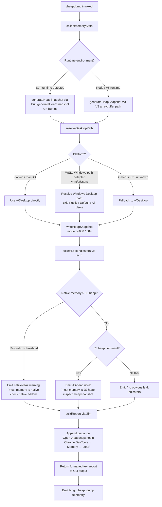

# `/heapdump`

> Analysis basis: CC v2.1.199 bundle.js (AST extraction + Claude interpretation)
> Minimum version: v2.1.199

---

## Overview

`/heapdump` is a hidden diagnostic command that captures a JavaScript heap snapshot of the running Claude Code process, writes it to `~/Desktop`, and emits a structured memory-analysis report alongside it. It collects V8 heap statistics, OS-level memory and resource metrics, open file-descriptor counts, and `/proc/self/smaps_rollup` data (on Linux) before producing actionable leak indicators and a guidance message pointing the developer at Chrome DevTools for inspection.

---

## Registration

| Field | Value |
|---|---|
| type | `local` |
| name | `heapdump` |
| description | `Dump the JS heap to ~/Desktop` |
| supportsNonInteractive | `true` |
| isHidden | `true` |
| module_id | `acc` |
| load_inline | `true` |
| loc_byte | `13222077` |
| loc_byte_end | `13222505` |
| loc_line | `9855` |
| arbor_handler.name | `Zlm` |
| arbor_handler.fqn | `claude-2.1.199::Zlm` |
| arbor_handler.kind | `AsyncFunction` |
| arbor_handler.resolution_path | `module_id` |
| arbor_handler.n_hits | `0` |

Analysis basis: CC v2.1.199 bundle.js:+13222077

---

## Input Branching

The command has 3+ distinct execution branches depending on runtime environment (Bun vs. Node/V8), platform (macOS vs. Linux vs. other), memory ratio outcomes, and write-path resolution. A Mermaid flowchart is used.



Analysis basis: CC v2.1.199 bundle.js:+13219608, +13219904, +13220147, +13220196, +13221065

---

## Behavioral Spec

### 1. Handler Entry — `heapDumpHandler` (Zlm)

The Arbor-resolved handler is `Zlm` (AsyncFunction), reached via `module_id` resolution from module `acc`.

```
async function heapDumpHandler(cmdArgs):
    statsReport = await collectMemoryStats()         // wqo
    leakLines   = await buildLeakAnalysis(statsReport) // ecm
    lines = []
    lines.push(statsReport.formattedLines)
    lines.push(leakLines)
    lines.push("Open the .heapsnapshot in Chrome DevTools → Memory → Load to inspect retainers.")
    return lines.join("\n")
```

Analysis basis: CC v2.1.199 bundle.js:+13220946, +13221065, +13221092, +13221214

---

### 2. Memory Collection — `collectMemoryStats` (wqo)

Called first by the handler. Gathers all runtime metrics, writes the snapshot file, and returns a structured stats object.

```
async function collectMemoryStats():
    // Trigger a manual GC pass before sampling (literal "manual", priority 0)
    triggerGarbageCollection("manual", 0)            // kt → Aw

    stats = await gatherSystemMemoryInfo()           // scc

    desktopPath = resolveDesktopPath()               // Eks
    snapshotFilename = buildTimestampedFilename()    // zt + vqo.join
    fullPath = path.join(desktopPath, snapshotFilename)

    snapshotData = generateHeapSnapshot()            // Qlm
    await fs.writeFile(fullPath, snapshotData, { mode: 384 })  // 0o600
    // Emit telemetry
    emit("tengu_heap_dump")                          // V

    return { stats, snapshotPath: fullPath }
```

Analysis basis: CC v2.1.199 bundle.js:+13219608, +13219621, +13219667, +13219904, +13220013, +13220056, +13220072, +13220196, +13220198

File write permissions are `384` (octal `0o600` — owner read/write only).
Analysis basis: CC v2.1.199 bundle.js:+13220091

---

### 3. Heap Snapshot Generation — `generateSnapshot` (Qlm)

```
function generateSnapshot():
    if runtimeIsBun():
        raw = Bun.generateHeapSnapshot("v8", "arraybuffer")
        Bun.gc(true)   // force full GC after capture
        return raw
    else:
        // Node path — uses V8 heap profiler API
        return captureV8HeapSnapshot()
```

Snapshot format is always V8-compatible (`.heapsnapshot`).
Analysis basis: CC v2.1.199 bundle.js:+13220626, +13220646, +13220671, +13220676, +13220703

---

### 4. System Memory Gathering — `gatherSystemMemoryInfo` (scc)

```
async function gatherSystemMemoryInfo():
    memUsage   = process.memoryUsage()
    heapStats  = v8.getHeapStatistics()
    resUsage   = process.resourceUsage()
    uptime     = process.uptime()
    heapSpaces = v8.getHeapSpaceStatistics()

    // Linux-specific: open file-descriptor count
    fdCount = null
    try:
        entries = await fs.readdir("/proc/self/fd")   // loc +13217340, +13217352
        fdCount = entries.length
    catch: pass

    // Linux-specific: smaps_rollup for native RSS
    smapsRaw = null
    try:
        smapsRaw = await fs.readFile("/proc/self/smaps_rollup", "utf8")  // loc +13217402, +13217415, +13217441
    catch: pass

    // Load bun:jsc intrinsics if available
    jscStats = tryLoadBunJscStats("bun:jsc")          // loc +13217500

    // Kill any processes exceeding 3600-second uptime or 1 MiB threshold
    // (background process hygiene — H, U path)
    pruneStaleBackgroundProcesses(maxAge=3600, threshold=1048576)  // loc +13217641, +13217646

    // Compute native overhead as percentage
    nativeOverheadPct = computeNativeOverhead(heapStats, memUsage)  // h.toFixed, 500ms timeout
    // Warn if native > heap portion
    if nativeOverheadPct > 100:
        noteNativeLeak("Native memory > heap - leak may be in native addons (node-pty, sharp, etc.)")
        // loc +13217879

    return buildStatsObject(memUsage, heapStats, resUsage, uptime, heapSpaces, fdCount, smapsRaw, nativeOverheadPct)
```

Key numeric constants:
- Max process age before pruning: **3600 seconds** (bundle.js:+13217641)
- Pruning size threshold: **1 048 576 bytes** (1 MiB) (bundle.js:+13217646)
- Native-overhead rounding precision: **100** (bundle.js:+13217793)
- Memory ratio polling interval: **500 ms** (bundle.js:+13218034)

---

### 5. Desktop Path Resolution — `resolveDesktopPath` (Eks)

```
function resolveDesktopPath():
    home = os.homedir()                           // XOr.homedir
    candidate = path.join(home, "Desktop")        // Qc.join, literal "Desktop"

    // WSL / Windows path handling
    if home starts with "/mnt/c/Users":           // literal +13219108
        // Scan Windows user directories, skip system dirs
        skip = ["Public", "Default", "Default User", "All Users"]
        // loc +13219152, +13219171, +13219191, +13219216
        winDesktop = findWindowsDesktopUnderMnt(skip)
        if winDesktop: return winDesktop

    // Platform check
    if platform == "darwin":                      // literal +13219152 (darwin)
        return candidate
    return candidate   // fallback for Linux / unknown
```

Analysis basis: CC v2.1.199 bundle.js:+13219904, +1118840, +1118876, +1118886, +1119108

---

### 6. Leak Analysis — `buildLeakAnalysis` (ecm)

```
function buildLeakAnalysis(stats):
    lines = []
    maxVal = Math.max(stats.heapUsed, stats.nativeRss)    // loc +13221321

    if stats.nativeRss > stats.heapUsed:
        // Most memory is in native layer
        lines.push("— most memory is native (NOT in the .heapsnapshot)")    // loc +13221449
        lines.push(nativeAddonHint)
    else if stats.heapUsed dominates:
        lines.push("— most memory is JS heap (inspect the .heapsnapshot)")  // loc +13221389

    if lines is empty:
        lines.push("  (no obvious leak indicators)")     // loc +13221586

    // Additional per-space analysis using xCt
    perSpaceNotes = analyzeHeapSpaces(stats.heapSpaces, threshold=8)  // loc +13221633, +13221721

    // Top-level size gate: warn if total RSS >= 1 GiB
    if stats.rss >= 1073741824:                          // loc +13221995
        lines.push(largeRssWarning)

    return lines.join("\n")
```

Analysis basis: CC v2.1.199 bundle.js:+13221065, +13221321, +13221389, +13221449, +13221586, +13221633, +13221721, +13221995

---

### 7. Output Formatting

The final report returned to the CLI is `"text"` type (literal `"text"` at bundle.js:+13220978). Lines are assembled with `t.push` / `t.join` (bundle.js:+13221092, +13221214) and include:

1. Memory statistics table (heap used, RSS, external, array buffers, heap spaces)
2. Resource usage summary (CPU, uptime)
3. FD count (Linux only)
4. Leak indicator lines from `buildLeakAnalysis`
5. Static guidance: _"Open the .heapsnapshot in Chrome DevTools → Memory → Load to inspect retainers."_ (bundle.js:+13221102)

---

## State & Side Effects

| Item | Detail |
|---|---|
| Telemetry | `tengu_heap_dump` (bundle.js:+13220198); `tengu_feature_ok` (+1039941); `tengu_feature_bad` (+1040008); `tengu_bg_dispatch_sigkill_escalate` (+18528964); `tengu_bg_dispatch_low_mem` (+18529670); `tengu_bg_spare_enable` (+18530360); `tengu_bg_sendclaim_failed` (+18521835); `tengu_bg_handoff_settle` (+18536348); `tengu_bg_spare_claim` (+18530488); `tengu_bg_spare_claim_fail` (+18530754) |
| File write | Heap snapshot written to `~/Desktop/<timestamp>.heapsnapshot` with mode `0o600` (bundle.js:+13220091) |
| GC trigger | Manual GC invoked before snapshot collection (bundle.js:+13219595) |
| Background process pruning | Stale background processes older than 3600 s or exceeding 1 MiB are killed via SIGTERM then SIGKILL (bundle.js:+13217641, +13217646, +18531010, +18529012) |
| Bun GC | If running under Bun, `Bun.gc(true)` is called after snapshot capture (bundle.js:+13220703) |
| appState changes | <!-- TODO: not found in depth-2 traversal; needs --depth 4 --> |
| Sound | None detected |
| Hook registration | Signal handler registered via `process.on` (bundle.js:+217899); crash reporter registered via `bfs.register` (Ai, bundle.js:+69837) |

---

## Version History

| Version | Change |
|---|---|
| v2.1.199 | Initial analysis |

---

## Common Mistakes

1. **Expecting output on `~/Desktop` on a headless server**: The command always writes to `~/Desktop`, which may not exist on Linux servers without a desktop environment. The write will fail silently or throw; ensure the directory exists before invoking.
2. **Invoking in production/interactive sessions**: The command is `isHidden: true` and designed for developer diagnostics only. It triggers a GC pause and a potentially large file write which may cause latency spikes.
3. **Misreading the native-leak warning**: The message "Native memory > heap — leak may be in native addons" does not confirm a leak; it indicates the RSS exceeds V8 heap allocation. Common false positives include `node-pty` and `sharp` (bundle.js:+13217879).
4. **Opening the snapshot in the wrong tool**: The output is a V8 `.heapsnapshot` file. It must be loaded in **Chrome DevTools → Memory → Load** — it is not compatible with generic JSON viewers or Firefox DevTools.
5. **WSL users expecting Windows Desktop**: On WSL, the path resolver attempts to find the Windows Desktop under `/mnt/c/Users`, skipping system accounts (`Public`, `Default`, `Default User`, `All Users`). If no suitable Windows user directory is found, it falls back to `~/Desktop` inside WSL.
6. **Assuming the command is interactive-only**: `supportsNonInteractive: true` means `/heapdump` can be scripted, but the output path is always fixed (`~/Desktop`); there is no `--output` flag.

---

## Appendix — Identifier Mapping

> For bundle debugging only. Identifiers change across versions.

| Identifier | Role |
|---|---|
| `Zlm` | Top-level heap-dump handler (AsyncFunction; Arbor FQN `claude-2.1.199::Zlm`) |
| `wqo` | Memory collection orchestrator — drives GC, stats, snapshot write, and path resolution |
| `kt` | GC trigger utility |
| `Aw` | Low-level GC invocation helper |
| `scc` | System memory info gatherer (process, V8, smaps, FDs) |
| `ecm` | Leak analysis / indicator builder |
| `xCt` | Per-heap-space analysis helper |
| `Eks` | Desktop path resolver (homedir + WSL detection) |
| `Qlm` | Heap snapshot generator (Bun.generateHeapSnapshot / V8 path) |
| `h` | Background subprocess manager (spawn, kill, tombstone, socket) |
| `wcs` | Background session WebSocket connector |
| `Mcs` | Background session handoff / lifecycle manager |
| `sCe` | macOS-specific free-memory helper |
| `HWe` | File utility — lstat, rm, readFile, filter |
| `ke` | Subprocess launcher with error logging |
| `we` | Feature telemetry emitter (ok path) |
| `Le` | Feature telemetry emitter (error path) |
| `Pe` | Core telemetry dispatcher |
| `V` | Generic telemetry event emitter |
| `On` | Timeout-guarded async operation runner |
| `B` | Process kill helper |
| `Q` | Background session retire-if-settled |
| `ot` | Background session routing / dispatch |
| `phe` | Path existence check helper |
| `ven` | Host-managed path builder |
| `Sge` | Secondary path builder (joins via fg.join + ven) |
| `sr` | Error wrapper / coercer |
| `Dd` | Error detail extractor |
| `T` | Structured log / output writer |
| `gdu` | Log entry constructor |
| `vfs` | Log sink router |
| `Sdu` | Log stream manager (flush, rotate, process.on exit) |
| `Let` | Buffered log writer with timeout |
| `Ile` | Log line assembler |
| `ydu` | Log file appender (mkdir + appendFile) |
| `Ai` | Crash-reporter hook registrar |
| `xe` | JSON serializer wrapper |
| `Nc` | Text sanitizer / redactor |
| `phs` | Padding/mapping formatter |
| `ntt` | Stream write helper |
| `ths` | Low-level stream write wrapper |
| `yle` | Path normalization helper |
| `hhs` | Log path joiner |
| `zt` | Timestamp string generator |
| `rn` | Path segment helper |
| `l` | Spare-session factory loader |
| `g` | Session state transition helper |
| `e` | String replace / sanitize helper |
| `s` | Async task tracker (add/delete/finally) |
| `H` | Active-process registry iterator |
| `o` | Generic Map/registry object |
| `U` | Process kill target |
| `Y` | Disposable resource wrapper |
| `_ ` | Async utility / promise wrapper |

---

Note: index built via Arbor fallback; some signals (telemetry, literals) may be missing — see arbor-fallback.js.