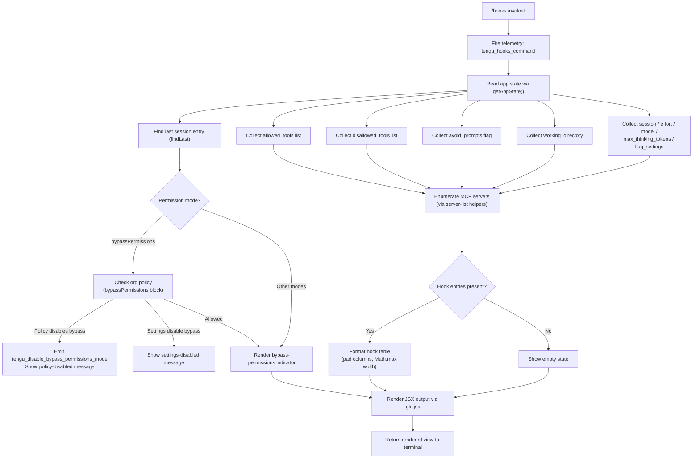

# `/hooks`

> Analysis basis: CC v2.1.199 bundle.js (AST extraction + Claude interpretation)
> Minimum version: v2.1.199

---

## Overview

The `/hooks` command displays the current hook configurations bound to tool events in the active Claude Code session. It reads app state to surface allowed tools, disallowed tools, permission mode, working directory, and other session-level settings, then renders that configuration as a JSX view in the terminal. The command is marked `immediate`, meaning it executes without entering the normal agent loop.

---

## Registration

| Field | Value |
|---|---|
| type | `local-jsx` |
| name | `hooks` |
| description | `View hook configurations for tool events` |
| immediate | `true` |
| module_id | `mlc` |
| load_inline | `true` |
| loc_byte | `13196630` |
| loc_byte_end | `13196780` |
| loc_line | `9839` |
| arbor_handler.name | `Alm` |
| arbor_handler.fqn | `claude-2.1.199::Alm` |
| arbor_handler.kind | `AsyncFunction` |
| arbor_handler.resolution_path | `module_id` |
| arbor_handler.n_hits | `0` |

Analysis basis: CC v2.1.199 bundle.js:+13196630

---

## Input Branching

The handler has more than three distinct internal paths (app-state retrieval, per-category config display, permission-mode validation, MCP server enumeration, and JSX rendering), so a Mermaid flowchart is used.



---

## Behavioral Spec

### 1. Entry Point — Handler Dispatch (`Alm`)

The async handler `Alm` is the primary entry resolved by Arbor via the `module_id` path (module `mlc`).

```
async function hooksCommandHandler(context):
    emit telemetry("tengu_hooks_command")          // bundle.js:+13196440
    appState  = readAppState(context)              // calls getAppState
    sessionConfig = resolveSessionConfig(appState) // calls Or
    hookDisplay   = buildHookDisplay(sessionConfig)// calls BB
    return renderJSX(hookDisplay)                  // calls glc.jsx
```

Analysis basis: CC v2.1.199 bundle.js:+13196438–13196510

---

### 2. Session Configuration Resolution (`Or`)

`Or` reads the app state and extracts the last relevant session record via `findLast`. It then pulls named configuration keys from that record.

```
function resolveSessionConfig(appState):
    rawState = appState.getAppState()
    session  = rawState.findLast(entry =>
                   entry key matches session criteria)

    config = {
        working_directory : session["working_directory"],  // +11434666
        allowed_tools     : session["allowed_tools"],      // +11434721
        disallowed_tools  : session["disallowed_tools"],   // +11434776
        avoid_prompts     : session["avoid_prompts"],      // +11434837
        permission_mode   : session["permission_mode"],    // +11434939
        session           : session["session"],            // +11435269
        effort            : session["effort"],             // +11435294
        model             : session["model"],              // +11435307
        max_thinking_tokens: session["max_thinking_tokens"],// +11435319
        flag_settings     : session["flag_settings"],      // +11435345
    }

    config = applyBypassPermissionsCheck(config)   // calls wR
    config = applyAllowedToolsFilter(config)       // calls Msr
    config = applyDisallowedToolsFilter(config)    // calls Dsr
    return config
```

Analysis basis: CC v2.1.199 bundle.js:+11434561–11434992

---

### 3. Bypass-Permissions Mode Check (`wR` → `Feo`)

When the `permission_mode` value equals `"bypassPermissions"` (bundle.js:+11434970), the handler validates whether the mode is actually permitted.

```
function applyBypassPermissionsCheck(config):
    if config.permission_mode == "bypassPermissions":
        result = checkBypassPermissionsAllowed()   // calls Feo → ot
        if result.blockedByOrgPolicy:
            emit telemetry("tengu_disable_bypass_permissions_mode")
            // message: "Bypass permissions mode was disabled by your organization policy"
            // bundle.js:+3466597
            config.bypassBlocked = "org_policy"
        else if result.blockedBySettings == "disable":
            // message: "Bypass permissions mode was disabled by settings"
            // bundle.js:+3466738
            config.bypassBlocked = "settings"
        else:
            config.bypassBlocked = null
    return config
```

Analysis basis: CC v2.1.199 bundle.js:+3466544–3466817

---

### 4. Hook Display Construction (`BB`)

`BB` assembles all displayable hook/config sections. It inspects which features are enabled, iterates over registered hooks, and builds list entries.

```
function buildHookDisplay(config):
    items = []

    // Platform / CLI source detection
    source = detectPlatformSource(config)    // calls pL; checks "cli"/"remote" literals
    items.push(sourceEntry(source))

    // Allowed-tools section
    filteredAllowed = filterTools(config.allowed_tools)   // calls Tie → kNe
    items.push(allowedToolsEntry(filteredAllowed))

    // MCP server / supervisor registration
    serverEntry = buildServerEntry(config)   // calls RBo, MBo, s5
    items.push(serverEntry)

    // Feature-flag gating
    if featureEnabled("workflows", config):              // calls ES → CGi
        items.push(workflowsEntry(config))
    if featureEnabled("bypassPermissions", config):
        items.push(bypassEntry(config))

    // Per-hook rows
    hookRows = config.allowed_tools
        .filter(tool => not in zptBlocklist)             // +11247540
        .map(tool => buildHookRow(tool, config))         // +11247568

    // Enabled-check per hook
    hookRows = hookRows.filter(row => row.isEnabled)     // calls c.isEnabled, Dl.isEnabled

    // Working-directory and session metadata rows
    items.push(workingDirEntry(config.working_directory))
    items.push(sessionMetaEntry(config))

    return items
```

Analysis basis: CC v2.1.199 bundle.js:+11247063–11247438

---

### 5. Hook File Validation (`vJe`)

For each hook entry that references a file path, `vJe` validates the file exists and is readable before including it in the display.

```
async function validateHookFile(hookPath):
    try:
        stat = await fs.stat(hookPath)         // shc.stat, +13647717
        if not stat.isFile():
            return reject(new Error("not a file"))
        if stat.size > 1048576:                // 1 MiB limit, +13647808
            return reject(new Error("file too large"))
        content = await readFileContent(hookPath)  // calls Qs → EId.getStore
        return { path: hookPath, content }
    catch err:
        if err.code == "ENOENT":               // +13647748
            return reject(err)
        // fall through to format
        keys = Object.keys(hookData)           // +13648226
        return formatHookTable(keys, hookData) // calls ihc
```

Analysis basis: CC v2.1.199 bundle.js:+13647717–13648312

---

### 6. Hook Table Formatting (`ihc`)

```
function formatHookTable(keys, hookData):
    maxWidth = Math.max(...keys.map(k => k.length))  // +13648984
    rows = keys.map(k =>
        k.padEnd(maxWidth) + "  " + hookData[k]     // "  " separator, +18557995
    )
    return rows.join("\n")                           // via Ch, +13649183
```

Analysis basis: CC v2.1.199 bundle.js:+13648938–13649183

---

### 7. MCP Server Enumeration and Daemon Interaction (`s5`, `Le`, `we`, `n2`, `w8`)

The hooks view also reports the status of background MCP daemon processes.

```
async function enumerateMCPServers(config):
    servers = []

    // Start/stop lifecycle management
    for each server in registeredServers:
        if server.type in ["http", "sse", "dynamic", "sdk"]:
            status = await getServerStatus(server)
            servers.push({ server, status })

    // Daemon control
    daemonResult = await controlDaemon(config)  // calls Le/we → tengu_feature_ok/bad
    if daemonResult.stopped:
        emit telemetry("tengu_daemon_control")
        // status file: "daemon.status.json"    // +13470522

    // Graceful shutdown path
    if shutdownRequested:
        await shutdownAllServers()  // calls w8 → Promise.race/all, yEe, wEe, On
        process.exit(0)             // +18564202

    return servers
```

Literal constants surfaced: `"daemon_stop"` (+18569030), `"daemon_stop_failed"` (+18569067), `"background session"` (+18568982), `"stopped"` (+18568939).

Analysis basis: CC v2.1.199 bundle.js:+11245811–11247380, +18564119–18569156

---

### 8. JSX Render (`glc.jsx`)

```
function renderHooksView(items):
    // items is the assembled list from buildHookDisplay
    return glc.jsx(HooksViewComponent, { items })
    // HooksViewComponent formats items as a terminal-friendly list
```

Analysis basis: CC v2.1.199 bundle.js:+13196510

---

## State & Side Effects

| Item | Detail |
|---|---|
| Telemetry: `tengu_hooks_command` | Fired immediately on handler entry (bundle.js:+13196440) |
| Telemetry: `tengu_disable_bypass_permissions_mode` | Fired when bypass-permissions mode is blocked by org policy or settings (bundle.js:+3466547) |
| Telemetry: `tengu_slate_harbor` | Fired from platform-source detection path (bundle.js:+5185571) |
| Telemetry: `tengu_daemon_config_reload` | Fired when daemon configuration is reloaded during server enumeration (bundle.js:+18546460) |
| Telemetry: `tengu_workflows_enabled` | Fired when the workflows feature flag is active (bundle.js:+3442572) |
| Telemetry: `tengu_cobalt_ridge` | Fired from platform/OS detection branch (bundle.js:+5182655) |
| Telemetry: `tengu_feature_ok` | Fired when a feature check passes (bundle.js:+1039941) |
| Telemetry: `tengu_feature_bad` | Fired when a feature check fails (bundle.js:+1040008) |
| Telemetry: `tengu_daemon_control` | Fired during daemon start/stop operations (bundle.js:+18569105) |
| appState changes | Read-only: `getAppState()` is called but no mutations are performed by this command |
| Hook registration | None — this command reads hook config, it does not register new hooks |
| Sound | None detected in depth-2 traversal |
| File I/O | Reads hook script files via `fs.stat` and content reader; enforces 1 MiB size limit (bundle.js:+13647808) |
| Daemon status file | Reads `"daemon.status.json"` (bundle.js:+13470522) via the daemon-status helper |
| immediate flag | `true` — executes synchronously outside the agent turn loop |

---

## Version History

| Version | Change |
|---|---|
| v2.1.199 | Initial analysis |

---

## Common Mistakes

1. **Expecting output when no hooks are configured** — if no hook entries exist and no MCP servers are registered, `/hooks` renders an empty state view rather than an error; this is expected behavior.
2. **Hook file larger than 1 MiB** — files referenced by hook configurations that exceed 1,048,576 bytes (bundle.js:+13647808) will be rejected during the stat check and will not appear in the output.
3. **Bypass-permissions mode appearing blocked unexpectedly** — org policy or local settings can suppress bypass-permissions display silently; check for the `"disable"` settings value (bundle.js:+3466722) or the org policy message (bundle.js:+3466597).
4. **Assuming `/hooks` modifies configuration** — the command is read-only; use the settings file or CLI arguments to change hook bindings.
5. **Running in a context without an active session** — `findLast` over the session list may return `undefined` if no session has been established, causing the config fields (e.g., `allowed_tools`, `working_directory`) to be absent from the output.

---

## Appendix — Identifier Mapping

> For bundle debugging only. Identifiers change across versions.

| Identifier | Role |
|---|---|
| `Alm` | Primary async handler for `/hooks` command (entry point) |
| `Or` | Session configuration resolver; calls `getAppState` and `findLast` |
| `Msr` | Allowed-tools filter helper |
| `Dsr` | Disallowed-tools filter helper |
| `wR` | Bypass-permissions mode validator |
| `Feo` | Bypass-permissions policy checker (calls `ot`) |
| `ot` | Core permission-mode check implementation |
| `BB` | Hook display assembler; builds all displayable sections |
| `pL` | Platform/source detection helper (`"cli"`/`"remote"`) |
| `g6` | Sub-helper within platform detection |
| `Ul` | String-conversion utility used in multiple helpers |
| `at` | String utility (coerces values via `String()`) |
| `vJe` | Hook file validator (stat, size check, content read) |
| `rn` | File-read helper used by hook file validator |
| `Qs` | Async store accessor (`EId.getStore`) |
| `m7o` | File metadata helper (`f7o`) |
| `ge` | String formatter (`String()` wrapper) |
| `ihc` | Hook table column formatter (`Math.max` width, `padEnd`) |
| `E` | MCP server stop/start controller |
| `VQe` | Server connection status helper (`yYc`, `Math.min`) |
| `ke` | Server connection error handler; logs via `fne.logError` |
| `sr` | Error string builder (`Error`, `String`) |
| `b` | Server lifecycle object (stop/start/updateConfig) |
| `KAr` | Array-check helper (`Array.isArray`) |
| `qAr` | String path normalizer (`startsWith`, `slice`, `replace`) |
| `H` | Server userinfo / kill helper |
| `iru` | Heartbeat/config reload helper (`Mue`) |
| `I` | Input scroll/pagination handler (`Math.max`, `Math.floor`) |
| `R` | HTTP request router (OAuth, device auth, token endpoints) |
| `RBo` | Server registration builder (`SFl`, `qr`) |
| `qr` | Module loader/resolver (`q2e`, `uTr`, `Fln`, `tus`) |
| `ES` | Feature-flag evaluator (`KDn`, `CGi`, `Teo`, `Wqd`) |
| `KDn` | Feature-flag config reader (`at`, `C0`) |
| `CGi` | Workflow feature gate checker (`Ws`) |
| `Ws` | Workflow permission resolver (`mGi`, `vqd`, `wqd`, `pEe`, `EG`) |
| `Teo` | Workflow enablement logic (`jqd`) |
| `jqd` | Workflow detail builder (`at`, `ot`, `Ul`, `Oi`) |
| `Wqd` | Workflow config writer (`C0`) |
| `Tie` | Tool-list filter (removes blocked entries via `kNe`) |
| `kNe` | Tool-permission resolver (`tUe`, `jz`, `OXo`, `UXo`) |
| `tUe` | Tool blocked-set membership check (`MAm.has`) |
| `jz` | Permission-policy lookup (`PXo`) |
| `OXo` | Tool permission object builder (`Cne`, `Y_n`, `MLe`, `dUr`, `F0`) |
| `MBo` | MCP server binding builder (`MU`, `OVt`, `qr`) |
| `MU` | MCP server module loader (`jt`, `at`, `Ul`, `Ene`, `ot`) |
| `ku` | Server capability checker (`jt`, `Ene`) |
| `u` | Daemon lifecycle array (push entries: `Le`, `we`, `n2`, `w8`) |
| `Le` | Feature-ok lifecycle step (`V`, `Pe` → `tengu_feature_ok`) |
| `we` | Feature-bad lifecycle step (`V`, `Pe` → `tengu_feature_bad`) |
| `n2` | Session emitter (`hG`, `B6e`, `qZr`) |
| `hG` | Session helper (`b9`) |
| `B6e` | Session init helper (`bx`) |
| `qZr` | Session UUID generator (`jZr.randomUUID`, `clt`, `cG`, `e.emit`) |
| `w8` | Graceful shutdown orchestrator (`Promise.race`, `Promise.all`, `yEe`, `wEe`, `On`, `process.exit`) |
| `yEe` | Shutdown signal sender (`_Ee.shutdown`) |
| `wEe` | Timeout clearer on shutdown (`clearTimeout`, `XJo`) |
| `On` | Abort/timeout wrapper (`setTimeout`, `clearTimeout`, `s.unref`) |
| `s5` | Full session/server startup sequence |
| `P2f` | Pre-flight check for session start (`Pi`, `$Ul`, `qr`) |
| `Pi` | Traffic classifier (`"essential-traffic"`, `KTs`) |
| `Rmt` | Remote agent launcher (`jv`, `ku`) |
| `jv` | Agent config builder (`at`, `rCr`); literal `"local-agent"` |
| `bC` | Config path builder (`Ul`) |
| `ybt` | Session state validator |
| `t1` | Transport selector (`i6t`, `T`, `gr`, `gu`) |
| `i6t` | Transport initializer (`s6e`, `dpo`, `XSp`, `at`, `Ul`); literals `"standard"`, `"tst"`, `"tst-auto"` |
| `T` | Output formatter (`NBe`, `gdu`, `xe`, `Nc`, `mN`, `ntt`, `Sdu`; writes/flushes output) |
| `gr` | Backend router (`Vm`, `at`); literals `"gateway"`, `"bedrock"`, `"foundry"`, `"anthropicAws"`, `"mantle"`, `"vertex"` |
| `gu` | Input stream handler (`wIn`) |
| `wl` | Feature-wall check (used in hook display gating) |
| `c` | Hook-entry enabled-check object (`ln`) |
| `ln` | Enabled-state resolver |
| `l` | Hook-file cache/loader (`Wfc`) |
| `Wfc` | Hook file watcher/loader (`Qne`, `Date.now`, `Qs`, `Bnn`, `xe`) |
| `Qne` | File-change detector (`fye`) |
| `Bnn` | Status file path builder (`Gfc.join`, `tr`); uses `"daemon.status.json"` |
| `xe` | JSON serializer (`JSON.stringify`) |
| `vo` | Shared utility called by both `Msr` and `Dsr` filter helpers |

---

Note: index built via Arbor fallback; some signals (telemetry, literals) may be missing — see arbor-fallback.js.