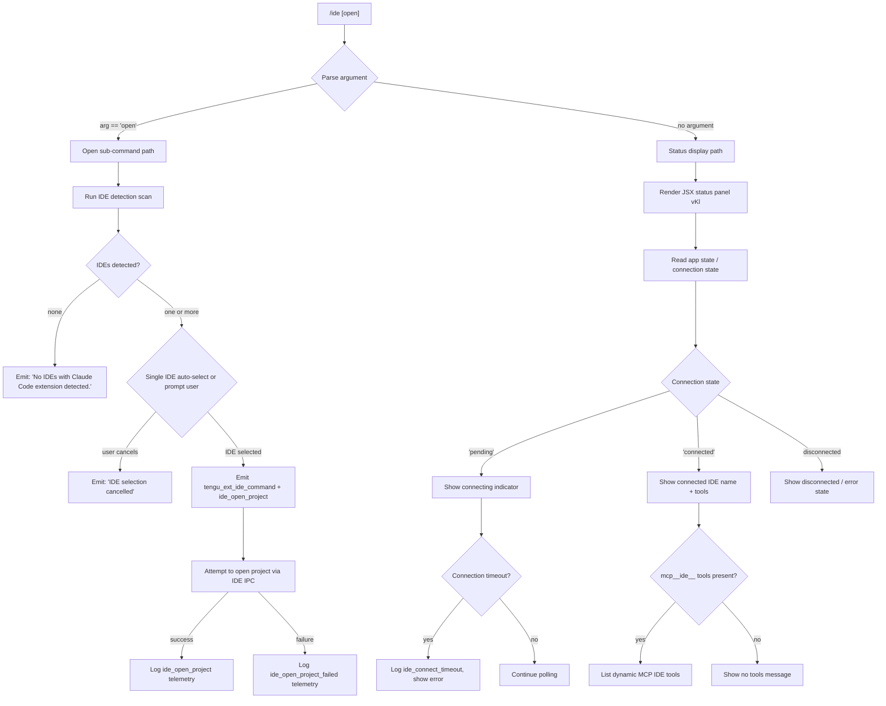

# `/ide`

> Analysis basis: CC v2.1.199 bundle.js (AST extraction + Claude interpretation)
> Minimum version: v2.1.199

---

## Overview

The `/ide` command manages IDE integrations for Claude Code, providing status information about connected IDEs and optionally opening the current project in a detected IDE. It detects running IDE processes (VS Code, Cursor, Windsurf, JetBrains products, and others), connects via the Claude Code extension's IPC channel, and renders a live-updating status panel as a JSX component.

---

## Registration

| Field | Value |
|---|---|
| type | `local-jsx` |
| name | `ide` |
| description | `Manage IDE integrations and show status` |
| argumentHint | `[open]` |
| module_id | `wKl` |
| load_inline | `true` |
| loc_byte | `12262549` |
| loc_byte_end | `12262705` |
| loc_line | `8815` |
| arbor_handler.name | `z7f` |
| arbor_handler.fqn | `claude-2.1.199::z7f` |
| arbor_handler.kind | `AsyncFunction` |
| arbor_handler.resolution_path | `module_id` |
| arbor_handler.n_hits | `0` |

Analysis basis: CC v2.1.199 bundle.js:+12262549

---

## Input Branching

The command has 4+ distinct branches depending on whether IDEs are detected, which IDE is selected, whether the `open` sub-command is given, and whether connection succeeds.



Analysis basis: CC v2.1.199 bundle.js:+12258743 (handler entry), +12258851 (`open` literal), +12258960 (no-IDE message), +12260558 (JSX component), +12260731 (`pending` literal), +12260760 (`connected` literal), +12260969 (`ide_connect_timeout` literal)

---

## Behavioral Spec

### Main Handler (`z7f` — `ideCommandHandler`)

The handler is an `AsyncFunction` resolved via the `module_id` path (`wKl`).

```
async function ideCommandHandler(options):
    emit telemetry: tengu_ext_ide_command   // +12258745

    // Retrieve current project path and app state
    projectPath = getProjectPath(options)    // via Ym +12258865
    connectionState = getConnectionState()   // via Dt +12258889

    arg = options.argument?.trim()

    if arg == "open":                        // +12258851
        return await openInIDESubcommand(options, projectPath)
    else:
        return renderIDEStatusComponent(options)  // OA.jsx +12259020
```

Analysis basis: CC v2.1.199 bundle.js:+12258743

---

### IDE Detection (`ideDetectRunner` — `DWn`)

Scans the system for running IDE processes that have the Claude Code extension installed.

```
async function ideDetectRunner(params):
    // Enumerate running processes via platform-specific scan
    processEntries = await scanRunningProcesses()    // RWn +7470910

    // For each candidate process, resolve its IPC socket path
    results = await Promise.all(
        processEntries.map(entry => resolveIDESocketPath(entry))  // tWp +7470950
    )

    // Parse port or socket from each entry
    for entry in results:
        port = parseInt(entry.portString)             // +7470861
        if isNaN(port): continue

        // Normalize process name to IDE brand
        brand = normalizeBrandName(entry.processName)  // Wx +7471855
        // classify: windsurf/cursor/vscode/jetbrains etc.

    // Emit telemetry
    if detection succeeded:
        emit "ide_detect"                             // +7472216
    else:
        emit "ide_detect_failed"                      // +7472280

    return detectedIDEList
```

Analysis basis: CC v2.1.199 bundle.js:+7470861, +7470910, +7472216, +7472280

---

### Process Scanner (`runningProcessScanner` — `RWn`)

Collects IDE process information using filesystem traversal and process inspection.

```
async function runningProcessScanner():
    // Build list of candidate socket/lock file paths
    candidates = await Promise.all(
        searchPaths.map(dir => scanForIDELockFiles(dir))  // rWp +7467324
    )

    // For each candidate directory, read lock file to extract PID / port
    results = []
    for candidate in flatten(candidates):
        lockData = await readLockFile(candidate + ".lock")  // ".lock" +7467434
        if lockData valid:
            results.push(parseIDEEntry(lockData))

    return results
```

Analysis basis: CC v2.1.199 bundle.js:+7467324, +7467343, +7467434

---

### IDE Path Enumeration (`idePathEnumerator` — `rWp`)

Resolves candidate IDE installation directories across platforms, including WSL support.

```
async function idePathEnumerator(ideType):
    paths = []
    paths.push(g1.join(homeDir(), ".claude"))     // ".claude" +7468654

    platform = detectPlatform()

    if platform == "wsl":                          // "wsl" +7468699
        // Scan Windows user directories under /mnt/c/Users
        // excluding: Public, Default, Default User, All Users
        windowsUsers = listWindowsUsers("/mnt/c/Users")  // +7468861
        for user in windowsUsers:
            if user not in ["Public","Default","Default User","All Users"]:
                paths.push(buildWSLPath(user))

    for path in paths:
        stat = lstat(path)
        if stat.isDirectory() or stat.isSymbolicLink():
            realPath = realpath(path)
            if not visited.has(realPath):
                visited.add(realPath)
                results.push(realPath)

    return results
```

Analysis basis: CC v2.1.199 bundle.js:+7468563, +7468640, +7468654, +7468699, +7468861

---

### IDE Brand Classifier (`ideBrandClassifier` — `K6a`)

Maps a process name or window title string to a known IDE brand.

```
function ideBrandClassifier(processName, windowTitle):
    name = processName.toLowerCase()

    // Check for known brands in order:
    if name.includes("windsurf"):  return "windsurf"    // +7473727
    if name.includes("devin"):     return "devin"       // +7473751
    if name.includes("cursor"):    return "cursor"      // +7473791
    if name.includes("insiders"):  return "insiders"    // +7473831
    if name.includes("vscode")
       or name.includes("vs code")
       or name.includes("visual studio code"): return "vscode"  // +7473856
    if name.includes("vscodium")
       or name.includes("codium"): return "vscodium"    // +7473935
    if name.includes("code - oss"): return "code-oss"  // +7473959

    return null
```

Analysis basis: CC v2.1.199 bundle.js:+7473697, +7473727, +7473751, +7473791, +7473831, +7473856, +7473935, +7473959

---

### Platform-Aware Process Scanner (`platformProcessScanner` — `PWn`)

Selects and executes the correct process listing strategy per OS.

```
async function platformProcessScanner(brand):
    platformName = currentPlatform().toLowerCase()

    if platformName == "linux":                      // +7475601
        // Execute shell command to grep running processes
        output = await execShell(
            'ps aux | grep -E "code|cursor|windsurf|devin-desktop|' +
            'idea|pycharm|webstorm|phpstorm|rubymine|clion|goland|' +
            'rider|datagrip|dataspell|aqua|gateway|fleet|android-studio"' +
            ' | grep -v grep'                        // +7475627
        )
        processes = parseProcessList(output)
    else:
        // macOS / Windows: use native APIs or lock-file discovery
        processes = await nativeProcessList(brand)

    // Filter out AppCode entries                    // "appcode" +7476015
    processes = processes.filter(p => !p.name.includes("appcode"))

    // Classify JetBrains family                     // "jetbrains" +7467035
    return processes
```

Analysis basis: CC v2.1.199 bundle.js:+7474140, +7475601, +7475627, +7476015, +7467035

---

### Open-in-IDE Sub-command (`openInIDESubcommand` — body inside `z7f`)

Handles the `open` argument to launch the current project in a detected IDE.

```
async function openInIDESubcommand(options, projectPath):
    detectedIDEs = await ideDetectRunner(options)    // DWn +12258903

    if detectedIDEs.length == 0:
        return exitWithMessage("No IDEs with Claude Code extension detected.")
        // literal +12258960

    // Select IDE: auto-select if only one, otherwise prompt
    selectedIDE = await selectIDE(detectedIDEs)

    if selectedIDE == null:
        return exitWithMessage("No IDE selected.")   // +12259080

    // Attempt to open the project
    emit telemetry: "ide_open_project"               // +12259278
    context = isWorktree(projectPath) ? "worktree" : "project"  // +12259312, +12259323

    try:
        await openProjectViaIDE(selectedIDE, projectPath)
        logSuccess(selectedIDE, context)
    catch error:
        emit telemetry: "ide_open_project_failed"    // +12259385
        logError(error)
        if error.message includes "Exited without opening IDE":  // +12259675
            showRestartAdvice("restart your IDE")    // +12259944
```

Analysis basis: CC v2.1.199 bundle.js:+12258903, +12258960, +12259080, +12259278, +12259385, +12259675, +12259944

---

### Status Display JSX Component (`ideStatusPanel` — `vKl`)

Renders the live-updating IDE connection status panel returned as JSX.

```
function ideStatusPanel(props):
    [connectionState, setConnectionState] = useState()   // Kj.useState +12260558
    appState = useAppState()                             // yt +12260578
    ideRef = useRef()                                    // Kj.useRef +12260636

    useEffect(() => {
        // Subscribe to IDE connection events
        connectToIDE(ideRef, setConnectionState)         // Le +12260772
    }, [])

    useCallback(() => {
        // Disconnect handler: emit "ide_disconnect"     // +12261468
        disconnect(ideRef)
    }, [ideRef])

    // Filter MCP tools with "mcp__ide__" prefix        // +12261365
    ideTools = appState.mcpTools.filter(t => t.name.startsWith("mcp__ide__"))

    // Determine display state
    if connectionState == "pending":                     // +12260731
        return renderConnecting("Connecting to " + ideName)  // +12261797

    if connectionState == "connected":                   // +12260760
        emit "ide_connect"                               // +12260775
        return renderConnectedView(ideTools, ideName)

    // Connection failed path
    if connectionTimedOut:
        emit "ide_connect_timeout"                       // +12260969
        return renderError("Error connecting to IDE.")   // +12261087

    emit "ide_connect_failed"                            // +12260862

    if connectionType.startsWith("ws:"):                // +12261585
        showWebSocketInfo()

    dynamicLabel = "dynamic"                             // +12261702

    return renderDisconnectedView()
```

Analysis basis: CC v2.1.199 bundle.js:+12260558, +12260578, +12260731, +12260760, +12260775, +12260862, +12260969, +12261087, +12261365, +12261468, +12261572, +12261585, +12261702, +12261797

---

### IDE Connection Client (`ideConnectionClient` — `wcs`)

Manages the low-level IPC socket connection to the IDE extension.

```
async function ideConnectionClient(socketPath, authToken, options):
    // Claim a connection slot
    await claimConnectionSlot(socketPath)            // m7.claim +18521620

    // Write auth claim frame to socket directory
    await writeClaimFile(socketPath, authToken)      // aQo +18521724

    // Build claim frame buffer
    frame = buildClaimFrame(authToken)               // AQm +18521783

    // Emit auth via socket
    socket = socketAuth(options)                     // o.socketAuth +18521791

    // Connect via IPC (net socket)
    conn = await net.connect(socketPath)             // fbr.connect +18521982
    conn.on("data", handleData)
    conn.once("connect", onConnected)                // "connect" +18522033

    // Write framed message
    conn.write(buildMessageFrame(frame))             // mM +18522056
                                                     // "kill"/"SIGTERM" +18522062/73

    // Timeout: 5000 ms                              // +18522269
    if not connected within timeout:
        throw Error("send-claim timeout")            // +18522325

    // Handle ECONNREFUSED gracefully                // +18522417
    if error.code == "ECONNREFUSED":
        emit "ide_connect_failed"
```

Analysis basis: CC v2.1.199 bundle.js:+18521620, +18521724, +18521783, +18521791, +18521982, +18522033, +18522056, +18522269, +18522325, +18522417

---

### Display Width Truncation Helper (`displayWidthTruncator` — `xGo`)

Truncates a list of strings to fit within a terminal display width limit.

```
function displayWidthTruncator(items, maxWidth):
    // Measure total character width
    total = 0
    result = []

    for item in items:
        // Normalize to NFC before measuring          // "NFC" +12262131
        normalized = item.normalize("NFC")
        width = measureDisplayWidth(normalized)        // Math.floor +12262094

        if total + width > maxWidth:                  // 100 +12261990
            // Append ellipsis suffix ", …"           // +12262302
            result.push(", …")
            break

        if result.length > 0:
            result.push(", ")                         // +12262288
        result.push(item)
        total += width

    return result.join("")
```

Analysis basis: CC v2.1.199 bundle.js:+12261990, +12262009, +12262043, +12262063, +12262079, +12262094, +12262119, +12262131, +12262288, +12262302

---

## State & Side Effects

| Item | Detail |
|---|---|
| Telemetry | `tengu_ext_ide_command` (command entry, +12258745); `tengu_feature_ok` (+1039941); `tengu_feature_bad` (+1040008); `tengu_feature_sad` (+1040089); `tengu_daemon_control` (+18569105); `tengu_bg_dispatch_sigkill_escalate` (+18528964); `tengu_bg_low_mem_mb` (+13271978); `tengu_bg_dispatch_low_mem` (+18529670); `tengu_bg_spare_enable` (+18530360); `tengu_bg_sendclaim_failed` (+18521835); `tengu_bg_handoff_settle` (+18536348); `tengu_bg_state_read_transient` (+4362670); `tengu_bg_spare_claim` (+18530488); `tengu_bg_spare_claim_fail` (+18530754); `tengu_daemon_yield` (+18551243); `tengu_bg_retire_pinned_low_mem` (+18534292); `tengu_bg_prewarm_per_sweep` (+18534417); `tengu_mcp_skills` (+7444269) |
| IDE status events emitted | `ide_detect`, `ide_detect_failed`, `ide_open_project`, `ide_open_project_failed`, `ide_connect`, `ide_connect_failed`, `ide_connect_timeout`, `ide_disconnect` |
| IPC socket connection | Creates a Unix domain socket or named pipe connection to the IDE extension; writes a claim frame with auth token; 5000 ms connect timeout (+18522269) |
| MCP tool filtering | Reads `appState.mcpTools`, filters for entries whose name starts with `mcp__ide__` (+12261365) to populate the tools list in the status view |
| File I/O | Reads IDE lock files (`.lock` suffix, +7467434); reads/writes claim files in socket directory; reads `pins.json` (+4364136) and `state.json` (+18536659) for background worker state |
| Process execution | On Linux, executes `ps aux` pipeline via shell (`sh -c`, +2361338/+2361344) with 3000 ms timeout (+2361361) to enumerate running IDEs |
| Background daemon interaction | Calls daemon control APIs (`daemon_stop`, `daemon_stop_failed`, +18569030/67); interacts with background session infrastructure (spare/exec/bg worker lifecycle) |
| Sound | <!-- TODO: not found in depth-2 traversal; needs --depth 4 --> |
| appState changes | Connection state transitions (`pending` → `connected` or error) reflected via React `useState`; MCP tool list populated from app state store via `useSyncExternalStore` |

---

## Version History

| Version | Change |
|---|---|
| v2.1.199 | Initial analysis |

---

## Common Mistakes

1. **Running `/ide open` outside a project directory** — if no `.claude` directory or IDE lock files are found, the command exits with "No IDEs with Claude Code extension detected." Ensure the target IDE is running with the Claude Code extension active before invoking this sub-command.
2. **Expecting instant connection** — the status panel starts in a `pending` state and polls for IDE connection. If the IDE extension is not running or the socket is not yet available, the panel will show a timeout error after 5000 ms. Starting the extension inside the IDE first resolves this.
3. **Confusing `/ide` with MCP tool management** — `/ide` manages the IDE integration connection; the `mcp__ide__*` tools it lists are injected by the connected IDE extension and are not directly configurable through this command.
4. **WSL path assumptions** — on WSL, the scanner looks for Windows user directories under `/mnt/c/Users` and skips system accounts (`Public`, `Default`, `Default User`, `All Users`). Non-standard Windows user directory layouts may cause IDEs to go undetected.
5. **JetBrains detection on Linux requires `ps aux`** — the Linux process scanner runs a shell pipeline. If `ps` is not available or the process grep pattern is filtered by sandboxing, JetBrains IDE detection will silently fail.

---

## Appendix — Identifier Mapping

> For bundle debugging only. Identifiers change across versions.

| Identifier | Role |
|---|---|
| `z7f` | Main async IDE command handler (`ideCommandHandler`) |
| `vKl` | IDE status JSX panel component (`ideStatusPanel`) |
| `DWn` | IDE detection runner — orchestrates scan and classification (`ideDetectRunner`) |
| `RWn` | Running process scanner — reads lock files and enumerates candidates (`runningProcessScanner`) |
| `rWp` | IDE installation path enumerator — per-platform path discovery (`idePathEnumerator`) |
| `K6a` | IDE brand classifier — maps process name to brand string (`ideBrandClassifier`) |
| `PWn` | Platform-aware process scanner — selects `ps aux` vs native strategy (`platformProcessScanner`) |
| `wcs` | IDE IPC connection client — socket auth and frame writing (`ideConnectionClient`) |
| `Wx` | IDE process name normalizer — extracts basename and brand (`ideProcessNormalizer`) |
| `xGo` | Display width truncator for IDE name lists (`displayWidthTruncator`) |
| `Mcs` | Background session manager / handoff handler (`bgSessionManager`) |
| `tWp` | IDE socket path resolver per process entry (`ideSocketPathResolver`) |
| `jWr` | IDE lock file / IPC entry parser (`ideLockFileParser`) |
| `Wr` | Shell command executor wrapper (`shellCommandExecutor`) |
| `dWp` | IDE process list builder — assembles detected IDE descriptors (`ideProcessListBuilder`) |
| `bbo` | Open-in-IDE dispatch helper (`openInIDEDispatcher`) |
| `Un` | IDE IPC message sender — wraps `Wr` and `Dt` (`ideIPCMessageSender`) |
| `Dt` | Connection state accessor (`connectionStateAccessor`) |
| `pHn` | App store accessor helper (`appStoreHelper`) |
| `ule` | Store getter utility (`storeGetter`) |
| `ar` | Connection status resolver (`connectionStatusResolver`) |
| `Aw` | Async wrapper / error boundary (`asyncWrapper`) |
| `Le` | Feature flag evaluator (`featureFlagEvaluator`) |
| `V` | Feature flag state reader (`featureFlagStateReader`) |
| `Pe` | Feature flag recorder (`featureFlagRecorder`) |
| `we` | Secondary feature flag path (`featureFlagSecondaryPath`) |
| `Et` | Tertiary feature flag path (`featureFlagTertiaryPath`) |
| `n2` | Daemon control dispatcher (`daemonControlDispatcher`) |
| `hG` | Daemon state helper (`daemonStateHelper`) |
| `B6e` | Daemon bus event emitter (`daemonBusEmitter`) |
| `qZr` | MCP first-party session creator (`mcpFirstPartySessionCreator`) |
| `w8` | Daemon shutdown orchestrator (`daemonShutdownOrchestrator`) |
| `yEe` | MCP server shutdown invoker (`mcpServerShutdownInvoker`) |
| `wEe` | Timeout clear + exit helper (`timeoutClearExitHelper`) |
| `On` | Timeout with abort signal (`timeoutWithAbort`) |
| `p` | Forced-shutdown normalizer (`forcedShutdownNormalizer`) |
| `u` | Daemon stop sequence (`daemonStopSequence`) |
| `yV` | Windows path normalizer (`windowsPathNormalizer`) |
| `Ts` | CLI error exit handler (`cliErrorExitHandler`) |
| `ot` | Background session dispatcher (`bgSessionDispatcher`) |
| `HG` | Background session group helper (`bgSessionGroupHelper`) |
| `wDn` | Background duplicate-connection resolver (`bgDuplicateConnectionResolver`) |
| `Mt` | Config access guard (`configAccessGuard`) |
| `sCe` | System memory reporter (`systemMemoryReporter`) |
| `cum` | Memory threshold checker (`memoryThresholdChecker`) |
| `pum` | macOS native memory reader via FFI (`macOSNativeMemoryReader`) |
| `HWe` | Tombstone/pin file manager (`tombstonePinFileManager`) |
| `n4t` | Pin file path builder (`pinFilePathBuilder`) |
| `Wt` | JSON parse wrapper (`jsonParseWrapper`) |
| `pn` | Filesystem error handler (`filesystemErrorHandler`) |
| `Aup` | Pin directory scanner (`pinDirectoryScanner`) |
| `Q` | Background session lifecycle tracker (`bgSessionLifecycleTracker`) |
| `vee` | Session retire-if-settled checker (`sessionRetireIfSettledChecker`) |
| `FVl` | Session unlink handler (`sessionUnlinkHandler`) |
| `Yi` | Background state file reader/writer (`bgStateFileReaderWriter`) |
| `Qg` | Session cron scheduler (`sessionCronScheduler`) |
| `JRe` | Ignore-list / filter rule evaluator (`ignoreListEvaluator`) |
| `op` | Session operation dispatcher (`sessionOperationDispatcher`) |
| `uIt` | IDE connect timing tracker (`ideConnectTimingTracker`) |
| `wen` | Session config path builder (`sessionConfigPathBuilder`) |
| `kIe` | Session error path builder (`sessionErrorPathBuilder`) |
| `_M` | Session error state writer (`sessionErrorStateWriter`) |
| `wk` | Session working state writer (`sessionWorkingStateWriter`) |
| `mP` | Session metadata writer (`sessionMetadataWriter`) |
| `Ree` | Session roster entry reader (`sessionRosterEntryReader`) |
| `Cen` | Session config file writer (`sessionConfigFileWriter`) |
| `l` | Background watch loop launcher (`bgWatchLoopLauncher`) |
| `Wfc` | Watch-loop tick handler (`watchLoopTickHandler`) |
| `g` | Claimed-session handler (`claimedSessionHandler`) |
| `Y` | Spawn/dispose controller (`spawnDisposeController`) |
| `K` | Rate-limit event enqueuer (`rateLimitEventEnqueuer`) |
| `Eos` | Session heartbeat / state sync writer (`sessionHeartbeatWriter`) |
| `Lin` | Scheduled-tasks lock release helper (`scheduledTasksLockReleaseHelper`) |
| `D` | Background writer / yield emitter (`bgWriterYieldEmitter`) |
| `rAe` | Roster path helper (`rosterPathHelper`) |
| `N` | Background supervisor watch handler (`bgSupervisorWatchHandler`) |
| `I` | Input scroll/key event handler (`inputScrollKeyHandler`) |
| `zT` | MCP tool cleanup coordinator (`mcpToolCleanupCoordinator`) |
| `TA` | MCP tool hash builder (`mcpToolHashBuilder`) |
| `nOe` | Content hash generator (`contentHashGenerator`) |
| `xe` | JSON stringify wrapper (`jsonStringifyWrapper`) |
| `SL` | MCP skills telemetry emitter (`mcpSkillsTelemetryEmitter`) |
| `c` | Background session label builder (`bgSessionLabelBuilder`) |
| `ln` | Session label formatter (`sessionLabelFormatter`) |
| `Ym` | Project path accessor (`projectPathAccessor`) |
| `aQo` | Claim file writer (`claimFileWriter`) |
| `bQm` | Connection send-claim timeout handler (`connectionSendClaimTimeoutHandler`) |
| `AQm` | Claim frame builder (`claimFrameBuilder`) |
| `_d` | Error code classifier (`errorCodeClassifier`) |
| `mM` | Binary message frame builder (`binaryMessageFrameBuilder`) |
| `mr` | Nonconforming session handler (`nonconformingSessionHandler`) |
| `Bl` | Session base path builder (`sessionBasePathBuilder`) |
| `Vd` | Theme/context hook wrapper (`themeContextHookWrapper`) |
| `yt` | App state hook (`appStateHook`) |
| `pso` | App state context reader (`appStateContextReader`) |
| `No` | Secondary app state hook (`secondaryAppStateHook`) |
| `m` | MCP tool list filter (`mcpToolListFilter`) |
| `qAr` | Tool name prefix stripper (`toolNamePrefixStripper`) |
| `k` | File watcher + interval loop (`fileWatcherIntervalLoop`) |
| `ke` | Error logger with rotation (`errorLoggerWithRotation`) |
| `sr` | Error string converter (`errorStringConverter`) |
| `at` | String coercion helper (`stringCoercionHelper`) |
| `Pi` | Essential traffic queue (`essentialTrafficQueue`) |
| `Gku` | Log rotation handler (`logRotationHandler`) |
| `sta` | String match helper (`stringMatchHelper`) |
| `y` | Spend/billing response handler (`spendBillingResponseHandler`) |
| `a` | Billing check dispatcher (`billingCheckDispatcher`) |
| `Whe` | Spend-blocked response builder (`spendBlockedResponseBuilder`) |
| `h` | Background session connection handler (large, daemon-side) (`bgSessionConnectionHandler`) |
| `phe` | Session closed-state checker (`sessionClosedStateChecker`) |
| `ven` | Host-managed path builder (`hostManagedPathBuilder`) |
| `Kie` | Daemon socket directory builder (`daemonSocketDirectoryBuilder`) |
| `Sge` | Host session path builder (`hostSessionPathBuilder`) |
| `B` | Process kill helper (`processKillHelper`) |
| `U` | Process kill target (`processKillTarget`) |
| `T` | Terminal output writer (`terminalOutputWriter`) |
| `ge` | String coercion with String() (`stringCoercionWithConstructor`) |
| `o` | Padded column formatter (`paddedColumnFormatter`) |
| `oi` | String slice/index helper (`stringSliceIndexHelper`) |
| `Ese` | IDE extension installer prompt (`ideExtensionInstallerPrompt`) |
| `G7f` | IDE status panel footer builder (`ideStatusPanelFooterBuilder`) |
| `Mo` | Filesystem error classifier (`filesystemErrorClassifier`) |
| `rn` | Error node renderer (`errorNodeRenderer`) |
| `gLe` | Language server / IPC client builder (`languageServerIPCClientBuilder`) |
| `Rw` | IPC connection wrapper (`ipcConnectionWrapper`) |
| `j6a` | Process kill via `process.kill` (`processKillViaNodeAPI`) |
| `z6a` | Process name replacer (`processNameReplacer`) |
| `hBt` | Background task header builder (`bgTaskHeaderBuilder`) |
| `HBt` | Background task body builder (`bgTaskBodyBuilder`) |
| `Tuc` | Memory threshold checker (supervisor) (`supervisorMemoryThresholdChecker`) |
| `Bn` | Background session eviction helper (`bgSessionEvictionHelper`) |
| `vpr` | Background prewarm request (`bgPrewarmRequest`) |
| `kWn` | IDE tool display component (`ideToolDisplayComponent`) |
| `tGa` | IDE detection aggregator (`ideDetectionAggregator`) |
| `M8t` | IDE display name mapper (`ideDisplayNameMapper`) |
| `Ezf` | Connect timing emitter (`connectTimingEmitter`) |
| `cB` | Error boundary / catch helper (`errorBoundaryHelper`) |
| `zT` | MCP cleanup coordinator (duplicate — same as above) |
| `dHn` | App store reference (`appStoreReference`) |