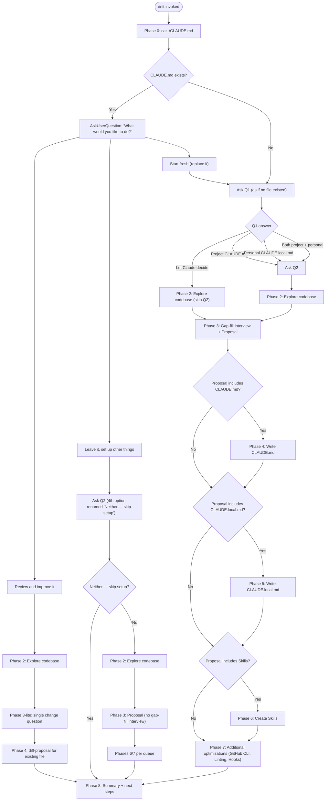

# `/init`

> Analysis basis: CC v2.1.199 bundle.js (AST extraction + Claude interpretation)
> Minimum version: v2.1.199

---

## Overview

`/init` bootstraps a repository for Claude Code by guiding the user through an interactive, phased workflow to create `CLAUDE.md` (and optionally `CLAUDE.local.md`), Skills, and Hooks. It checks for an existing `CLAUDE.md` first, then engages the user with structured questions, explores the codebase via a subagent, fills in gaps through an interview, and writes all approved artifacts in sequence before presenting a summary and optimization to-do list.

---

## Registration

| Field | Value |
|---|---|
| type | `prompt` |
| name | `init` |
| description | `Initialize new CLAUDE.md file(s) and optional skills/hooks with codebase documentation \| Initialize a new CLAUDE.md file with codebase documentation` |
| loc_byte | `12285888` |
| loc_byte_end | `12286281` |
| loc_line | `9057` |
| handler_method | `getPromptForCommand` |
| handler_method_start | `12286204` |
| handler_method_end | `12286280` |
| prompt_body.length | `22519` characters |
| prompt_body.trace | `conditional; identifier→Q7f (var template, 20920 chars); identifier→J7f (var template, 1592 chars)` |
| arbor_handler.name | `getPromptForCommand` |
| arbor_handler.kind | `Method` |
| arbor_handler.resolution_path | `direct` |
| arbor_handler.fqn | `claude-2.1.199::getPromptForCommand` |
| arbor_handler.n_hits | `2` |

Analysis basis: CC v2.1.199 bundle.js:+12285888

The `handler_method` value `"getPromptForCommand"` means the handler is an ObjectMethod inlined directly on the registration object. The Arbor symbol graph confirms this via `resolution_path: "direct"`, resolving unambiguously to `getPromptForCommand` within the registration byte range `(12285888, 12286281)`.

The prompt body is **conditional**: a longer template (~20 920 chars, traced to identifier `Q7f`) covers the full interactive setup flow, while a shorter template (~1 592 chars, traced to identifier `J7f`) covers a legacy/fallback path (the append-only `CLAUDE.md`-creation instructions that end the body). Both templates are selected at runtime before dispatch.

---

## Input Branching

The command has more than three distinct decision paths, driven by the presence of an existing `CLAUDE.md` and the user's Q1/Q2 answers. A Mermaid flowchart is required.



Analysis basis: CC v2.1.199 bundle.js:+12285888

---

## Behavioral Spec

### Phase 0 — Preflight Check for Existing CLAUDE.md

```
function checkExistingClaudeMd():
    read "./CLAUDE.md" using cat (project root only; no tree walk)
    return fileExists: boolean
```

Only the project-root `CLAUDE.md` is checked. The check gates the entire Q1/Q2 branching in Phase 1.

Analysis basis: CC v2.1.199 bundle.js:+12285888

---

### Phase 1 — User Intent Elicitation

```
function elicitUserIntent(fileExists: boolean):
    printPrimer()   # explain CLAUDE.md, Skills, Hooks terminology

    if fileExists:
        answer = AskUserQuestion("I found an existing CLAUDE.md. What would you like to do?",
            options=["Review and improve it", "Leave it, set up other things", "Start fresh (replace it)"])
        route based on answer  # see flowchart
    else:
        askQ1()

function askQ1():
    answer = AskUserQuestion("Which CLAUDE.md files should /init set up?",
        options=["Project CLAUDE.md", "Personal CLAUDE.local.md",
                 "Both project + personal", "Let Claude decide"])
    if answer == "Let Claude decide":
        skip Q2   # treat as Project CLAUDE.md, no skills/hooks constraint
    else:
        askQ2()

function askQ2():
    # Q2 is a hint, not a filter
    AskUserQuestion("Also set up skills and hooks?",
        options=["Skills + hooks", "Skills only", "Hooks only", "Neither, just CLAUDE.md"])
```

**Key constraint**: Q1 and Q2 must be asked in separate `AskUserQuestion` calls. Q2 is never shown when the user picks "Let Claude decide" in Q1.

Analysis basis: CC v2.1.199 bundle.js:+12285888

---

### Phase 2 — Codebase Exploration (Subagent)

```
function exploreCodebase():
    launch subagent to read:
        manifest files: package.json, Cargo.toml, pyproject.toml, go.mod, pom.xml, ...
        README, Makefile, build configs, CI configs
        existing CLAUDE.md, .claude/rules/, AGENTS.md
        .cursor/rules, .cursorrules, .github/copilot-instructions.md
        .devin/rules/, .windsurf/rules/, .windsurfrules, .clinerules
        .mcp.json

    detect:
        buildCommands, testCommands, lintCommands  # especially non-standard
        languages, frameworks, packageManager
        projectStructure  # monorepo | multi-module | single
        codeStyleDeviations
        envVarsAndGotchas
        existingSkillsDir  # .claude/skills/
        existingRulesDir   # .claude/rules/
        formatterConfig    # prettier | biome | ruff | black | gofmt | rustfmt | unified script
        gitWorktrees       # run `git worktree list`

    record what CANNOT be determined from code alone  # becomes interview questions
```

The subagent reads the literal file `"CLAUDE.md"` (string constant confirmed at bundle.js:+4207762) and is aware of the `"workspace"` project structure pattern (bundle.js:+4207800).

Analysis basis: CC v2.1.199 bundle.js:+4207762, +4207800

---

### Phase 3 — Gap-Fill Interview and Proposal

```
function gapFillAndPropose(q1Choice, phaseOneRoute, phase2Findings):
    if phaseOneRoute == "Review and improve":
        askSingleQuestion("Has anything changed about how the team works since this CLAUDE.md was written?",
            options=["No, nothing's changed", "Yes — let me describe"])
        if yes: collectFreeTextDescription()
        skip to Phase 4 (diff mode)

    if q1Choice in ["Project CLAUDE.md", "Both", "Let Claude decide"]:
        askAboutCodebasePractices(phase2Findings)   # non-obvious commands, gotchas, branch/PR, env setup
    if q1Choice in ["Personal CLAUDE.local.md", "Both"]:
        askAboutPersonalPreferences()               # role, familiarity, sandbox URLs, worktree layout, comms style

    proposal = buildProposal(phase2Findings, gapFillAnswers, q1Choice, q2Hint)

    # Artifact selection logic
    for each finding:
        if deterministic fast per-edit shell command:
            type = "Hook"
        elif on-demand multi-step workflow:
            type = "Skill"
        else:
            type = "CLAUDE.md note"

    printProposalAsText(proposal)
    confirmWithUser("Does this look right?",
        options=["Looks good — proceed", "Drop the hook", "Drop the skill", ...])

    preferenceQueue = buildPreferenceQueue(acceptedProposal)
    return preferenceQueue
```

If the Q2 hint conflicts with the best-fit proposal, a one-line deviation note is prepended to the proposal before confirmation.

Analysis basis: CC v2.1.199 bundle.js:+12285888

---

### Phase 4 — Write CLAUDE.md

```
function writeClaudeMd(route, phase2Findings, preferenceQueue):
    if route == "Review and improve":
        existing = readFile("./CLAUDE.md")
        diffs = compareAgainstFindings(existing, phase2Findings)
        printDiffsWithReasons(diffs)
        confirmed = AskUserQuestion("Apply these edits?",
            options=["Apply all", "Let me pick which", "Skip — leave it as is"])
        if confirmed != skip: applySelectedDiffs()
        return

    content = buildMinimalClaudeMd(phase2Findings, preferenceQueue.noteEntries(target="CLAUDE.md"))

    # Inclusion criteria (each line must pass):
    #   "Would removing this cause Claude to make mistakes?" → if No, cut it
    include:
        - non-standard build/test/lint commands
        - code style rules differing from language defaults
        - testing quirks and single-test invocation
        - repo etiquette (branch naming, PR conventions, commit style)
        - required env vars and setup steps
        - non-obvious gotchas and architectural decisions
        - key content from AI-tool configs (AGENTS.md, .cursor/rules, etc.)

    exclude:
        - file-by-file structure (discoverable by reading)
        - standard language conventions
        - generic advice
        - frequently-changing detail (use @path/to/import reference instead)
        - long tutorials (move to separate file or skill)
        - commands obvious from manifest files

    prefix content with standard header:
        "# CLAUDE.md\n\nThis file provides guidance to Claude Code..."

    if multiConcernProject:
        suggest .claude/rules/ subdirectory organization
    if monorepoOrMultiModule:
        offer to create subdirectory CLAUDE.md files

    writeFile("./CLAUDE.md", content)
```

The standard file prefix ("# CLAUDE.md / This file provides guidance…") is mandated by the prompt body and confirmed by the J7f template branch (the shorter 1 592-char fallback also enforces this prefix).

Analysis basis: CC v2.1.199 bundle.js:+12285888, +12286204

---

### Phase 5 — Write CLAUDE.local.md

```
function writeClaudeLocalMd(phase2Findings, preferenceQueue):
    if fileExists("./CLAUDE.local.md"):
        existing = readFile("./CLAUDE.local.md")
        proposeAdditions(existing)   # do NOT silently overwrite

    if phase2Findings.multipleWorktrees and userConfirmedSiblingWorktrees:
        writeFile("~/.claude/<project-name>-instructions.md", personalContent)
        stub = "@~/.claude/<project-name>-instructions.md"
        writeFile("./CLAUDE.local.md", stub)
        # stub must NEVER be placed in project CLAUDE.md
    else:
        content = buildPersonalContent(preferenceQueue.noteEntries(target="CLAUDE.local.md"))
        writeFile("./CLAUDE.local.md", content)

    addToGitignore("CLAUDE.local.md")
```

Analysis basis: CC v2.1.199 bundle.js:+12285888

---

### Phase 6 — Create Skills

```
function createSkills(preferenceQueue, phase2Findings):
    # Step 1: consume queued skill preferences
    for skill in preferenceQueue.skillEntries():
        name = deriveName(skill.description)
        body = buildFromUserWords(skill) + phase2Findings.relevantDetails
        if mapsToExistingBundledSkill(name):
            notifyUser("Bundled skill exists; yours is additive.")
        if underspecified(skill):
            askFollowUp()
        writeSkillFile(".claude/skills/" + name + "/SKILL.md", body)

    # Step 2: suggest additional skills beyond the queue
    for opportunity in phase2Findings.repeatableWorkflows:
        suggestSkill(name, purpose, rationale)

    # Do NOT overwrite existing skills in .claude/skills/
    existing = listDir(".claude/skills/") if exists else []
    onlySuggestNewComplementarySkills(existing)
```

Skill YAML frontmatter schema: `name`, `description`. For user-only side-effect workflows, `disable-model-invocation: true` is added and `$ARGUMENTS` used for input.

Analysis basis: CC v2.1.199 bundle.js:+12285888

---

### Phase 7 — Additional Optimizations

```
function suggestOptimizations(preferenceQueue, phase2Findings, q1Choice):
    # GitHub CLI check
    ghPresent = shell("which gh")  # Windows: "where gh"
    if not ghPresent and projectUsesGitHub(phase2Findings):
        AskUserQuestion("Install GitHub CLI?", ...)

    # Linting check
    if not phase2Findings.lintConfig:
        AskUserQuestion("Set up linting?", ...)

    # Hooks from preference queue
    hookTarget = resolveHookTarget(q1Choice)
    #   q1Choice == "Project" → .claude/settings.json
    #   q1Choice == "Personal" → .claude/settings.local.json
    #   q1Choice == "Both" / ambiguous → ask once for all hooks

    for hook in preferenceQueue.hookEntries() + formatterFallback():
        event, matcher = resolveEventAndMatcher(hook.preference)
        #   "after every edit" → PostToolUse / Write|Edit
        #   "when Claude finishes" / "before I review" → Stop
        #   "before running bash" → PreToolUse / Bash
        #   "before committing" → git pre-commit hook (not settings.json); probe if ambiguous

        if firstHookThisRun:
            invokeSkillTool(skill="update-config",
                args=["[hooks-only]", summaryOfCurrentHook])

        followHookConstructionFlow():
            dedupCheck()
            constructHook()
            pipeTestRaw()
            wrapHook()
            writeJSON(hookTarget)
            jqValidate()
            if PreOrPostToolUse and triggerableMatcher: liveProof()
            cleanup()
            handoff()
```

The "before committing" case **cannot** be a `settings.json` hook because matchers cannot filter Bash by command content (bundle.js:+12285888). Route to `.git/hooks/pre-commit`, husky, or the pre-commit framework instead.

Analysis basis: CC v2.1.199 bundle.js:+12285888

---

### Phase 8 — Summary and Next Steps

```
function summarizeAndSuggest(writtenArtifacts, phase2Findings, phase7Gaps):
    printRecap(writtenArtifacts)   # files written, key points in each
    remindUser("These files are a starting point; run /init again anytime to re-scan.")

    todoList = []

    if frontendDetected(phase2Findings):
        todoList.add("/plugin install frontend-design@claude-plugins-official")
        todoList.add("/plugin install playwright@claude-plugins-official")

    if phase7Gaps.missingGitHubCli and userDeclinedInstall:
        todoList.add("Install GitHub CLI — enables PR/issue workflows")
    if phase7Gaps.missingLinting and userDeclinedSetup:
        todoList.add("Set up linting — fast feedback on edits")

    if testsMissingOrSparse(phase2Findings):
        todoList.add("Set up a test framework")

    # Always include these two:
    todoList.add("/plugin install skill-creator@claude-plugins-official")
    todoList.add("Browse official plugins with /plugin")

    printTodoList(sortByImpact(todoList))
```

Analysis basis: CC v2.1.199 bundle.js:+12285888

---

### Handler Entry Point — getPromptForCommand

```
function getPromptForCommand(commandInput):
    # Selects the appropriate prompt template at runtime
    if fullInteractiveFlow:
        promptText = Q7f_template   # ~20920 chars; full 8-phase workflow
    else:
        promptText = J7f_template   # ~1592 chars; legacy CLAUDE.md creation only

    return { type: "text", content: promptText }
```

The handler emits a return object with `type: "text"` (string constant confirmed at bundle.js:+12286252). The call graph shows `getPromptForCommand` is reached from the synthetic BFS entry `__handler_init`; the Arbor resolver confirms the real symbol is `getPromptForCommand` (direct resolution, n_hits=2).

Analysis basis: CC v2.1.199 bundle.js:+12286204, +12286252, +12286210

---

### Onboarding-Project Completion Signal

After the full init flow completes, the handler calls through `ndt` → `Le` which emits an `"onboarding_project_complete"` event (string literal at bundle.js:+4208274). This marks the project as initialized in application state.

```
function markOnboardingComplete():
    emitEvent("onboarding_project_complete")
    persistProjectConfig()   # via saveProjectConfig path (Jgr)
```

Additionally, the onboarding UI hint string `"Run /init to create a CLAUDE.md file with instructions for Claude"` (bundle.js:+4207937) and the onboarding key `"claudemd"` (bundle.js:+4207921) are cleared once completion is signalled.

Analysis basis: CC v2.1.199 bundle.js:+4208274, +4207921, +4207937

---

### Config Persistence and Locking

The init flow triggers project-config saves via `saveCurrentProjectConfig` (traced through `tIm` → `Jgr` → `con`). The locking subsystem (`don`) enforces:

- Lock acquisition timeout: warns if acquisition takes longer than 100 retries (number constant at bundle.js:+14384752).
- On lock contention: emits `tengu_config_lock_contention` telemetry.
- On stale write detection: emits `tengu_config_stale_write`.
- On auto-repair after parse error: emits `tengu_config_auto_repaired`.
- On auth-loss prevention: emits `tengu_config_auth_loss_prevented`.
- Guard string: `"Config accessed before allowed."` (bundle.js:+14383512) — thrown if config is read before the system is ready.
- Maximum backup files retained: 5 (number constant at bundle.js:+14386501).
- Backup file name suffix: `".backup."` (bundle.js:+14386360).

Analysis basis: CC v2.1.199 bundle.js:+14384752, +14383512, +14386501, +14386360

---

## State & Side Effects

| Item | Detail |
|---|---|
| Telemetry: `tengu_config_lock_contention` | Fired when config lock acquisition is delayed (bundle.js:+14384847) |
| Telemetry: `tengu_config_stale_write` | Fired when a stale write is detected during config save (bundle.js:+14384985) |
| Telemetry: `tengu_config_auto_repaired` | Fired when a parse-error config is auto-repaired under lock (bundle.js:+14385384) |
| Telemetry: `tengu_config_auth_loss_prevented` | Fired when a write that would wipe auth is refused (bundle.js:+14386054) |
| Telemetry: `tengu_config_fallback_write` | Fired when the fallback write path is taken (bundle.js:+14384448) |
| Telemetry: `tengu_feature_ok` | Fired on successful feature gate check during init (bundle.js:+1039941) |
| Telemetry: `tengu_slate_harbor_experiment` | A/B experiment event fired during init (bundle.js:+12262779) |
| appState: `onboarding_project_complete` | Set after the full init flow completes (bundle.js:+4208274) |
| appState: onboarding hint cleared | `"claudemd"` key (`"Run /init to create…"`) cleared on completion (bundle.js:+4207921, +4207937) |
| File writes | `./CLAUDE.md`, optionally `./CLAUDE.local.md`, `.claude/skills/<name>/SKILL.md`, `.claude/settings.json` or `.claude/settings.local.json` for hooks, `~/.claude/<project-name>-instructions.md` for sibling-worktree personal content |
| .gitignore mutation | `CLAUDE.local.md` added when Phase 5 runs |
| Config persistence | Project config written and locked via `saveCurrentProjectConfig` (traced through `tIm`/`Jgr`/`con`/`don`) |
| Lock file management | Up to 5 backup files retained with `.backup.` suffix (bundle.js:+14386501, +14386360) |
| Subagent launch | Phase 2 launches a subagent to read manifest/config files |
| Skill tool invocation | Phase 7 invokes `skill: 'update-config'` with `[hooks-only]` prefix, once per `/init` run |
| Sound | <!-- TODO: not found in depth-2 traversal; needs --depth 4 --> |

---

## Version History

| Version | Change |
|---|---|
| v2.1.199 | Initial analysis — 8-phase interactive init flow; dual-template prompt (Q7f ~20 920 chars, J7f ~1 592 chars); onboarding completion event; config locking with auth-loss guard |

---

## Common Mistakes

1. **Running `/init` in a subdirectory and expecting it to find the project root.** Phase 0 checks only `./CLAUDE.md` relative to the current working directory; the command does not walk up to a parent directory.
2. **Expecting Q2 to appear after "Let Claude decide" in Q1.** Q2 is skipped entirely in that branch — Claude determines skills/hooks scope autonomously.
3. **Placing personal worktree import stubs in `CLAUDE.md`.** The `@~/.claude/<project-name>-instructions.md` import must only go in `CLAUDE.local.md`; putting it in the team-shared file checks a personal reference into source control.
4. **Treating Q2 as a hard filter.** Q2 is described as "a hint, not a filter" — the Phase 3 proposal may deviate from Q2 if the codebase evidence points to different artifact types, with a one-line deviation note prepended.
5. **Expecting `/init` to pick up `CLAUDE.md` files in subdirectories during Phase 0.** Only the project-root file is checked; subdirectory files are not consulted in the initial existence check.
6. **Routing "before committing" intent to a `settings.json` hook.** Matchers cannot filter Bash commands by content, so a git-commit gate must be implemented as a `.git/hooks/pre-commit` hook or via husky/pre-commit framework, not as a `PreToolUse` hook in settings.
7. **Re-invoking the `update-config` skill for each hook in Phase 7.** The skill is loaded exactly once per `/init` run; subsequent hooks reuse the already-loaded context.
8. **Silently overwriting `CLAUDE.local.md`.** If the file already exists, Phase 5 reads it and proposes specific additions — it never overwrites without user confirmation.

---

## Appendix — Identifier Mapping

> For bundle debugging only. Identifiers change across versions.

| Identifier | Role |
|---|---|
| `__handler_init` | Synthetic BFS entry point for the `/init` command handler (not a real bundle symbol) |
| `ndt` | Post-completion wrapper: emits onboarding event and persists project config |
| `zg` | Config read/access utility |
| `Mt` | Config object constructor / validator |
| `BJo` | Config field accessor (branch of `Mt`) |
| `GJo` | Config guard / error branch (branch of `Mt`) |
| `hae` | Config helper (branch of `Mt`) |
| `Dta` | CLAUDE.md detection / workspace hint builder |
| `nio` | CLAUDE.md path resolver and workspace context assembler |
| `zt` | Filesystem stat / existence check utility |
| `Dt` | Path join / resolution helper |
| `_ks` | Secondary path/key resolver |
| `iC` | Config initializer / session-config loader |
| `Hbc` | Config timestamp / metadata updater |
| `ite` | Config write helper |
| `Ygr` | Async config cache manager (get/set/delete with deduplication) |
| `WJo` | Config cache write-back with encoding (`utf-8`) |
| `tIm` | Save-current-project-config orchestrator |
| `don` | Config file writer with lock, backup rotation, and auth-loss guard |
| `con` | Config read-under-lock helper |
| `T` | Structured log / output writer |
| `lon` | Config lock-state reader |
| `che` | Config change detector / equality checker |
| `V` | Promise / async utility |
| `Jgr` | Project-config save coordinator (fallback write path) |
| `Le` | Feature gate checker (emits `tengu_feature_ok`) |
| `Pe` | Feature gate evaluator |
| `GZe` | Feature flag registry |
| `X7f` | Slate-Harbor A/B experiment handler (emits `tengu_slate_harbor_experiment`) |
| `at` | Experiment variant string coercer |
| `ot` | Experiment assignment dispatcher |
| `hBt` | Experiment bucket calculator |
| `HBt` | Experiment result handler |
| `HG` | Growthbook experiment wrapper |
| `hG` | Growthbook client accessor |
| `wDn` | Experiment deduplication and execution guard |
| `KZr` | Experiment registration and UUID assignment |
| `eeo` | Experiment event emitter (emits `growthbook_experiment`) |

---

Note: index built via Arbor fallback; some signals (telemetry, literals) may be missing — see arbor-fallback.js.