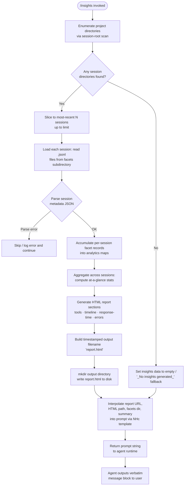

# `/insights`

> Analysis basis: CC v2.1.199 bundle.js (AST extraction + Claude interpretation)
> Minimum version: v2.1.199

---

## Overview

`/insights` generates a shareable HTML usage-analytics report from the user's local Claude Code session data, then instructs the agent to relay a fixed confirmation message pointing to the generated file. The command collects and aggregates `.jsonl` session files from the local facets directory, computes statistics across sessions, writes a timestamped `report.html`, and passes a structured prompt to the agent so the agent's only job is to output a pre-rendered message verbatim.

---

## Registration

| Field | Value |
|---|---|
| type | `prompt` |
| name | `insights` |
| description | `Generate a report analyzing your Claude Code sessions` |
| loc_byte | `13803605` |
| loc_byte_end | `13804909` |
| loc_line | `11146` |
| handler_method | `getPromptForCommand` |
| handler_method_start | `13803779` |
| handler_method_end | `13804908` |
| prompt_body.length | `513` |
| prompt_body.trace | `call→NHc(...) (1 literals)` |
| arbor_handler.name | `getPromptForCommand` |
| arbor_handler.fqn | `claude-2.1.199::getPromptForCommand` |
| arbor_handler.kind | `Method` |
| arbor_handler.resolution_path | `direct` |
| arbor_handler.n_hits | `1` |

Analysis basis: CC v2.1.199 bundle.js:+13803605

---

## Input Branching

The command has more than three distinct internal branches (session-list population, per-session facet loading, report-section rendering, no-data fallback, and file-write), so a Mermaid flowchart is used.



---

## Behavioral Spec

### 1. Session Discovery (`sessionDirectoryScanner`)

The handler calls the session-directory scanner (bundle identifier `g_m`) to enumerate project-level subdirectories under the Claude Code data root.

```
function sessionDirectoryScanner(dataRoot):
    projectsPath = path.join(dataRoot, "projects")   // literal: "projects" @+5463845
    entries = fs.readdir(projectsPath)
    dirs = entries.filter(entry => entry.isDirectory())
    // limit applied: top 50 by recency, then trimmed to 200 total
    // numeric limits: 50 @+13790226, 200 @+13790231
    dirs.sort(byModificationTimeDescending)
    return dirs
```

Analysis basis: CC v2.1.199 bundle.js:+13789815, +13789834, +13789888

### 2. Facet File Enumeration (`facetFileWalker`)

For each session directory, the facet-file walker (bundle identifier `_vt`) reads `.jsonl` files from the facets subdirectory.

```
function facetFileWalker(sessionDir):
    entries = fs.readdir(sessionDir)
    files = entries.filter(e => e.isFile() && isJsonlFile(e))
    // file extension check: ".jsonl" @+13895083
    for each file in files:
        fullPath = path.join(sessionDir, file)
        stat = fs.stat(fullPath)
        recordMap.set(file, stat)
    return recordMap
```

Analysis basis: CC v2.1.199 bundle.js:+13894977, +13895054, +13895083

### 3. Session Record Loading (`sessionRecordLoader`)

Each `.jsonl` file is read as UTF-8 and parsed as JSON (bundle identifiers `r_m` → `M7o` → `grn`). The sub-path structure is `usage-data / session-meta / facets` under the data root.

```
function sessionRecordLoader(sessionPath):
    metaPath = path.join(dataRoot, "usage-data")     // literal @+13728990
    sessionMetaPath = path.join(metaPath, "session-meta")  // literal @+13729086
    facetsPath = path.join(sessionMetaPath, "facets")      // literal @+13729040
    raw = fs.readFile(sessionPath, "utf-8")           // encoding literal @+13735155
    parsed = JSON.parse(raw)
    return parsed
```

Analysis basis: CC v2.1.199 bundle.js:+13735088, +13735131, +13729072, +13728977

### 4. Facet Aggregation (`insightsFacetAggregator`)

The aggregator (bundle identifier `amr`) collects facet records across all loaded sessions and populates multiple analytics maps covering tools used, response times, time-of-day, error categories, and session metadata.

```
function insightsFacetAggregator(sessionRecords):
    toolCounts     = Map()
    responseTimes  = Map()   // buckets: "2-10s","10-30s","30s-1m","1-2m","2-5m","5-15m",">15m"
    timeOfDay      = Map()   // buckets: "Morning (6-12)","Afternoon (12-18)","Evening (18-24)","Night (0-6)"
    errorMap       = Map()
    projectSet     = Set()

    for each record in sessionRecords:
        classify record by type:
            "tool_use"    → increment toolCounts[record.name]
            "tool_result" → check for error patterns
            timestamp     → extract hour → assign time-of-day bucket
            duration      → assign response-time bucket
        accumulate into respective maps

    return { toolCounts, responseTimes, timeOfDay, errorMap, projectSet }
```

Time-of-day hour boundaries: Morning hours 6–11 (`@+13747260`), Afternoon 12–17 (`@+13747299`), Evening 18–23 (`@+13747351`), Night 0–5 (`@+13747378`).

Analysis basis: CC v2.1.199 bundle.js:+13895759, +13895830, +13896102

### 5. HTML Report Generation (`htmlReportBuilder`)

The report builder (bundle identifier `f_m`) converts aggregated maps into HTML sections and writes a complete standalone `report.html` file.

```
function htmlReportBuilder(aggregatedData, outputDir):
    // Escape HTML entities: &amp; &lt; &gt; &quot; &apos; (@+6755373–6755496)
    sections = []

    // Tool usage section — bar chart rendered via inline HTML
    sections.push(renderToolSection(aggregatedData.toolCounts))
    // uses color palette: #2563eb @+13784042, #0891b2 @+13784180,
    //                     #10b981 @+13784352, #8b5cf6 @+13784495

    // Response-time distribution section
    sections.push(renderResponseTimeSection(aggregatedData.responseTimes))
    // empty state: "<p class=\"empty\">No response time data</p>" @+13746325

    // Time-of-day activity section
    sections.push(renderTimeOfDaySection(aggregatedData.timeOfDay))

    // Error analysis section
    // empty state: "<p class=\"empty\">No tool errors</p>" @+13787769
    // success color: #16a34a @+13788007
    // warning color: #eab308 @+13788500
    // error color:   #dc2626 @+13787758
    sections.push(renderErrorSection(aggregatedData.errorMap))

    html = assembleFullHtml(sections)
    return html
```

Analysis basis: CC v2.1.199 bundle.js:+13748011, +13784020, +13784712, +13787545

### 6. Report File Writer (`reportFileWriter`)

The handler (via `OHc`) builds a timestamped output path, creates the output directory if needed, and writes `report.html`.

```
function reportFileWriter(html, baseDir):
    now = new Date()
    // timestamp components extracted individually:
    year    = now.getFullYear()   // @+13792626
    month   = now.getMonth()      // @+13792647
    day     = now.getDate()       // @+13792668
    hour    = now.getHours()      // @+13792686
    minute  = now.getMinutes()    // @+13792704
    second  = now.getSeconds()    // @+13792724

    outputPath = path.join(baseDir, "report.html")   // literal @+13792794
    fs.mkdir(baseDir, { recursive: true })            // @+13792535
    fs.writeFile(outputPath, html)                    // @+13792822
    return outputPath
```

Analysis basis: CC v2.1.199 bundle.js:+13792535, +13792794, +13792822

### 7. Prompt Construction and Agent Relay

After the report is written, the handler (via `getPromptForCommand` / `__handler_insights`) interpolates the collected data into the prompt template using the template function `NHc` (call traced at `@+13804811`).

```
function buildInsightsPrompt(reportUrl, htmlFilePath, facetsDir, atAGlanceSummary):
    // Prompt body (513 chars) describes to the agent:
    //   - context: user ran /insights
    //   - full insights data block
    //   - report URL, HTML file path, facets directory
    //   - at-a-glance summary (for agent context only)
    //   - instruction: output <message>…</message> block verbatim

    // Fallback when no data: "_No insights generated_" @+13804676
    // Separator used in summary: " · " @+13804237
    // Math.round used for numeric formatting @+13804166

    prompt = templateFunction(
        insightsData,
        reportUrl,
        htmlFilePath,
        facetsDir,
        atAGlanceSummary
    )
    return prompt
```

The agent receives a fully pre-rendered `<message>` block. The instruction directs the agent to output that block **verbatim** as its entire response — the agent adds no interpretation or additional commentary.

Analysis basis: CC v2.1.199 bundle.js:+13803785, +13804811, +13804829, +13804875

### 8. "At-a-Glance" Summary Computation

The at-a-glance summary (bundle identifier call site `at_a_glance` literal `@+13743404`) is computed from the aggregated facet data and passed to the prompt. It is marked in the prompt as being "for your context only — the user has not seen any output yet," meaning it informs the agent's conversational readiness without being shown directly.

Analysis basis: CC v2.1.199 bundle.js:+13743404

---

## State & Side Effects

| Item | Detail |
|---|---|
| Telemetry | No `tengu_*` events are emitted directly from the `/insights` handler or its primary call graph nodes (`OHc`, `g_m`, `_vt`, `r_m`, `amr`, `f_m`). Telemetry events present in the traversal (e.g. `tengu_transcript_phantom_parent` @+13879565, `tengu_relink_walk_broken` @+13854623, `tengu_chain_parent_cycle` @+13856400, `tengu_chain_timestamp_fallback` @+13856549, `tengu_chain_parallel_tr_recovered` @+13858415) originate from shared transcript/chain utilities reached transitively, not from the insights command itself. |
| File system writes | Creates output directory and writes `report.html` to the Claude Code data directory (`fs.mkdir` @+13792535, `fs.writeFile` @+13792822). |
| File system reads | Reads project directories (`fs.readdir` @+13789834), `.jsonl` facet files (`fs.readdir` @+13894977, `fs.stat` @+13895286), and session record files (`fs.readFile` @+13735131). |
| appState changes | None observed within depth-2 traversal of the insights handler. |
| Sound | None. |
| Network | None; report is generated entirely from local data. |
| Output artifact | `report.html` written locally; a shareable URL is computed and surfaced in the agent's reply. |
| Session limit | Most-recent sessions sliced to a cap of 50 initially, then up to 200 (`@+13790226`, `@+13790231`). |
| Token budget for insights model call | 4096 tokens (`@+13737037`). |
| Warmup mode | Literal `"warmup_minimal"` present at `@+13792352`, suggesting the insights generation step can be triggered in a reduced warmup path. |
| Idle timeout for insights processing | 1,800,000 ms (30 minutes) (`@+13737579`). |

---

## Version History

| Version | Change |
|---|---|
| v2.1.199 | Initial analysis |

---

## Common Mistakes

1. **Expecting interactive input**: `/insights` takes no arguments. Passing text after the command has no effect — the command ignores trailing user input and proceeds directly to report generation.
2. **Assuming the agent analyzes the report**: The agent's only role is to output a pre-rendered message verbatim. It does not interpret the HTML or compute additional statistics at reply time.
3. **Running before any sessions exist**: If no session directories are found under the `projects` path, the prompt falls back to the literal `"_No insights generated_"` string (`@+13804676`). The command does not error out — it simply reports no data.
4. **Looking for the report in the current working directory**: The report is written to the Claude Code data directory (under a timestamped path), not the project's working directory. The reply message contains the exact file path.
5. **Expecting real-time data**: The report is built from `.jsonl` facet files written during past sessions. Data from the currently active session may not be fully flushed at the time `/insights` is run.
6. **Confusing the at-a-glance summary with the displayed output**: The summary section in the prompt is explicitly marked as context for the agent only. The user sees only the `<message>` block output.

---

## Appendix — Identifier Mapping

> For bundle debugging only. Identifiers change across versions.

| Identifier | Role |
|---|---|
| `__handler_insights` | Synthetic BFS entry point for the `/insights` command handler (corresponds to `getPromptForCommand` ObjectMethod) |
| `OHc` | Primary insights orchestrator: coordinates session loading, aggregation, HTML generation, and file writing |
| `g_m` | Session directory scanner: enumerates project subdirectories under the data root |
| `q2` | Path join helper used to build the projects directory path |
| `_vt` | Facet file walker: reads and stats `.jsonl` files within a session directory |
| `WM` | File-extension test helper (checks for `.jsonl`) |
| `r_m` | Session record loader: reads and parses a single session's JSON file |
| `M7o` | Intermediate path builder for session-meta directory |
| `grn` | Leaf path builder for usage-data and facets sub-paths |
| `MHc` | Session parse error handler / skip logic |
| `Wt` | JSON.parse wrapper |
| `amr` | Facet aggregator: accumulates tool, time, error, and project data across sessions |
| `_me` | Transcript/session data model builder (populates analytics maps by record type) |
| `N_m` | Session node initializer within the data model |
| `Hj` | Helper for processing individual transcript nodes |
| `rtt` | Record-tree traversal utility |
| `xE` | Cross-session index updater |
| `O_c` | Session-level record collector |
| `HTe` | Chain-building helper for ordering session records |
| `eym` | NaN-guard utility for numeric facet values |
| `tym` | Timeline/tool-call classifier and sorter |
| `Q_m` | Queue-based record orderer |
| `FEt` | Facet entry mapper |
| `fYo` | Text normalization helper (replaceAll, slice) |
| `Wtn` | Prompt-text reconstruction helper |
| `hYo` | Content-type classifier for attachments |
| `nym` | Array/text content validator |
| `rym` | Array content-type checker |
| `fTe` | Facet filter helper |
| `Amr` | Per-session aggregation finalizer |
| `bmr` | Values-to-array converter |
| `YHm` | NaN check for numeric session fields |
| `P7o` | Per-session statistics builder (computes rounded numerics, handles arrays) |
| `RHc` | Per-record classifier: assigns tool names, git actions, error categories, timestamps |
| `mrn` | Tool-name normalization helper |
| `zHm` | File extension extractor for tool-use records |
| `EDe` | Diff computation helper |
| `Iu` | Index-of helper for error-type lookup |
| `ih` | Intermediate numeric rounding helper within per-session stats |
| `D7o` | <!-- TODO: not found in depth-2 traversal; needs --depth 4 --> |
| `o_m` | Report output directory creator and file writer (mkdir + writeFile for per-session data) |
| `xe` | JSON.stringify wrapper |
| `t_m` | Temp/cache file reader and cleaner (readFile + unlink) |
| `imr` | Facets sub-path builder (joins data root → facets) |
| `UHc` | File-not-found / parse-skip guard |
| `s_m` | Section-level HTML string assembler |
| `e_m` | Parallel per-session processing coordinator (Promise.all over session list) |
| `JHm` | Section chunk joiner |
| `eUe` | Individual session HTML section renderer |
| `Ec` | HTML escaping utility |
| `Ysr` | Transcript hash / UUID generator for deduplication |
| `Pn` | Random UUID generator wrapper |
| `Mrn` | Agent-message extractor from session records |
| `qP` | <!-- TODO: not found in depth-2 traversal; needs --depth 4 --> |
| `VM` | Rendering context builder |
| `C9` | <!-- TODO: not found in depth-2 traversal; needs --depth 4 --> |
| `kHc` | Config/context loader for insights rendering |
| `z_` | State store accessor |
| `yf` | App context reader |
| `kt` | App-level state initializer |
| `_l` | Filter helper for rendering context |
| `sr` | Error string formatter |
| `n_m` | Per-session HTML file writer (mkdir + writeFile) |
| `h_m` | Object-keys inspector for report metadata |
| `PHc` | Report statistics section builder (percentiles, medians, histograms) |
| `Hvt` | Object.entries iterator for stat maps |
| `oi` | Slice/indexOf helper for percentile computation |
| `DHc` | Numeric distribution builder (push, sort, set for histogram bins) |
| `a_m` | Per-session section array assembler and parallel renderer |
| `xHc` | Individual session section compiler |
| `jHm` | z_ accessor within session compiler |
| `$o` | Object.assign helper |
| `f_m` | Full HTML report string builder (main report template) |
| `Cd` | HTML entity encoder |
| `Fa` | replaceAll-based string sanitizer |
| `smr` | Inline markdown-to-HTML converter (bold → `<strong>`, bullets → `•`) |
| `p_m` | HTML partial builder (uses xe/JSON.stringify for data embedding) |
| `HCe` | Table/bar-chart HTML section renderer |
| `u_m` | Max-value calculator for chart scaling |
| `d_m` | Two-series bar chart renderer |
| `D` | Write-stream helper (used by OHc output pipeline) |
| `NHc` | Prompt template function: interpolates insights data into the 513-char prompt body |
| `vJe` | File stat + existence checker with ENOENT handling |
| `ihc` | Column-width calculator for text layout |
| `E` | Session stop/start lifecycle manager |
| `b` | Auth/userinfo accessor |
| `iru` | Heartbeat initializer |
| `I` | Input event handler / scroll controller |
| `V` | UI render trigger |
| `at` | String coercion utility |
| `gym` | Binary JSONL reader (Buffer-based sync reader) |
| `hym` | Sync file reader helper (openSync/readSync/closeSync) |
| `B` | Session pair container |
| `l_c` | Session link/relink walker |
| `mym` | Binary JSONL message parser |
| `ALe` | SVU/AVU/TVU/bVu module loader group |
| `Mo` | Error-path logger |
| `ke` | Telemetry event emitter |
| `q` | Keyboard event interceptor (backspace handler) |
| `oe` | Input focus/timeout handler |
| `ne` | Session-state set membership tracker |
| `Q` | Queue with vee/FVl backend |
| `Z` | Voice recording session manager |
| `re` | Record accumulator with g backend |
| `L` | Away-summary / rate-limit gate |
| `v` | Blur/focus timing tracker |
| `Y` | Permission-allow list manager |
| `x` | Cookie/token splitter |
| `R` | OAuth/HTTP request router |
| `h` | Daemon background-session lifecycle manager |
| `H` | Background-process kill manager |
| `w` | Content-replacement map |
| `p` | Process-exit / abort handler |
| `f` | yV-backed state store |
| `m` | Array filter with qAr backend |
| `g` | f-backed state relay |
| `dCe` | Array filter with size cap (64/32 limits) |

---

Note: index built via Arbor fallback; some signals (telemetry, literals) may be missing — see arbor-fallback.js.