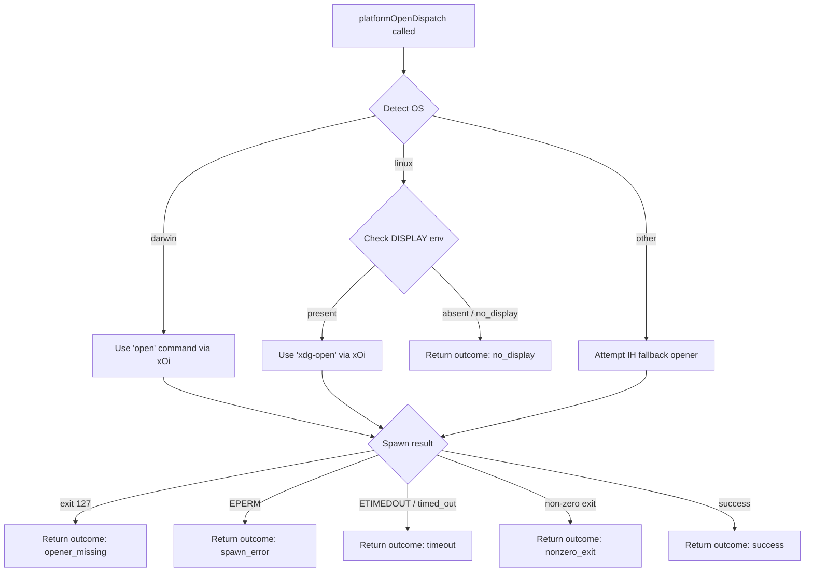

# `/install-slack-app`

> Analysis basis: CC v2.1.199 bundle.js (AST extraction + Claude interpretation)
> Minimum version: v2.1.199

---

## Overview

`/install-slack-app` is a local slash command that opens the Claude Slack app installation page in the user's default browser. When invoked, the command fires a telemetry event, emits an informational text message to the UI, and delegates to the platform-aware browser-open subsystem (`Rc` / `RJr` / `kOi`) to launch the URL. The command does not accept arguments and does not require interactive input.

---

## Registration

| Field | Value |
|---|---|
| type | `local` |
| name | `install-slack-app` |
| description | `Install the Claude Slack app` |
| supportsNonInteractive | `false` |
| module_id | `l7l` |
| load_inline | `true` |
| loc_byte | `12348587` |
| loc_byte_end | `12348773` |
| loc_line | `9206` |
| arbor_handler.name | `SYf` |
| arbor_handler.fqn | `claude-2.1.199::SYf` |
| arbor_handler.kind | `AsyncFunction` |
| arbor_handler.resolution_path | `module_id` |
| arbor_handler.n_hits | `0` |

Analysis basis: CC v2.1.199 bundle.js:+12348587

---

## Input Branching

The command flow is essentially linear (invoke → telemetry → UI message → open URL → return result), with branching only inside the browser-open utility (`kOi`) based on platform and error conditions. The top-level handler has only 1–2 effective paths (success / open-failure), so numbered pseudocode is used here. The platform-specific branching inside the open-URL helper is covered in the Behavioral Spec section below with a Mermaid diagram.

1. User runs `/install-slack-app` (no arguments consumed).
2. Handler `SYf` fires telemetry event `tengu_install_slack_app_clicked`.
3. Handler emits a text message: `"Opening Slack app installation page in browser…"`.
4. Handler calls browser-open helper (`Rc`) with the Slack installation URL.
5. Result of the open operation is returned to the caller.

---

## Behavioral Spec

### Top-Level Handler (`SYf`)

```
async function installSlackAppHandler(context):
    emit telemetry("tengu_install_slack_app_clicked")          // bundle.js:+12348187
    yield { type: "text",                                       // bundle.js:+12348326
            content: "Opening Slack app installation page in browser…" }
                                                                // bundle.js:+12348339
    result = await openUrl(context)                             // bundle.js:+12348306
    return result
```

Analysis basis: CC v2.1.199 bundle.js:+12348185

---

### URL-Open Orchestrator (`Rc` → `RJr`)

The handler calls `Rc` (open-URL entry point), which delegates immediately to `RJr` (URL validation + dispatcher).

```
async function openUrlEntry(url, options):
    return await urlValidateAndDispatch(url, options)           // bundle.js:+3181798
```

```
async function urlValidateAndDispatch(url, options):
    parsed = validateUrl(url)                                   // bundle.js:+3181653
    if parsed is invalid:
        return { outcome: "invalid_url" }                       // bundle.js:+3181689
    stringUrl = String(parsed)                                  // bundle.js:+3181739
    return await platformOpenDispatch(stringUrl, options)       // bundle.js:+3181757
```

Analysis basis: CC v2.1.199 bundle.js:+3181798

---

### URL Validation (`c6d`)

```
function validateUrl(rawUrl):
    try:
        parsed = new URL(rawUrl)
        if parsed.protocol not in ["http:", "https:"]:         // bundle.js:+3180497, +3180519
            throw Error("unsupported protocol")                 // bundle.js:+3180447
        return parsed
    catch:
        return null
```

Analysis basis: CC v2.1.199 bundle.js:+3180447

---

### Platform-Aware Browser Open (`kOi`)

This utility has 3+ distinct branches based on operating system and error outcome.



Analysis basis: CC v2.1.199 bundle.js:+3181841 (`IH`), +3181916 (`xOi`), +3181900 (darwin literal), +3181585 (linux literal), +3181942 (no_display), +3182185 (exit 127), +3182231 (opener_missing), +3182272 (ETIMEDOUT), +3182330 (timeout), +3182386 (EPERM), +3182415 (spawn_error), +3182471 (nonzero_exit)

---

### Process Spawner (`xOi`)

```
async function spawnOpener(command, args):
    proc = spawn(command, args)                                 // bundle.js:+3181578
    await proc completion with timeout
    return proc exit code and stderr
```

Analysis basis: CC v2.1.199 bundle.js:+3181578

---

### Exit-Code Classifier (`d6d`)

```
function classifyExitCode(stderr, exitCode):
    if exitCode == 127:                                         // bundle.js:+3182185
        return "opener_missing"                                 // bundle.js:+3182231
    if stderr.includes("timed out"):                            // bundle.js:+3182190, +3182297
        return "timeout"                                        // bundle.js:+3182330
    // further EPERM / nonzero checks follow
    return "nonzero_exit"                                       // bundle.js:+3182471
```

Analysis basis: CC v2.1.199 bundle.js:+3182190

---

### Config I/O Subsystem (reachable via `Hn` / `YTm` / `don`)

Although `/install-slack-app` itself does not read or write configuration, its call graph reaches the shared config-persistence layer (via `Hn` → `YTm` → `don`). This is because the handler may consult application state (e.g., existing auth) before constructing context. The config subsystem includes:

- **Lock acquisition** (`don`): acquires a filesystem lock before reading or writing `~/.claude.json`; emits `tengu_config_lock_contention` if lock wait exceeds 100 ms (bundle.js:+14384752, +14384758, +14384847).
- **Stale-write guard** (`don`): emits `tengu_config_stale_write` if the on-disk config timestamp is newer than the in-memory snapshot (bundle.js:+14384985).
- **Parse-error auto-repair** (`Zgr`): if re-reading the config under lock produces a JSON parse error, the system auto-repairs from the cached config and emits `tengu_config_auto_repaired` (bundle.js:+14385384; log message references GH #3117 — bundle.js:+14385256).
- **Auth-loss prevention** (`don`): refuses to overwrite `~/.claude.json` if the re-read copy is missing auth data that the cache holds; emits `tengu_config_auth_loss_prevented` (bundle.js:+14386054; references GH #3117 — bundle.js:+14385902).
- **Fallback write** (`Jgr`): emits `tengu_config_fallback_write` when the primary write path fails and the system falls back to an alternate write strategy (bundle.js:+14384448).
- **Backup rotation** (`Zgr`): up to 5 backup copies of the config are retained in a `backups/` subdirectory (literal `5` — bundle.js:+14386501; literal `"backups"` — bundle.js:+14387431), with `.backup.` infix in filenames (bundle.js:+14386360).
- **Atomic write via temp-rename** (`Zle`): config is written to a temp file then renamed; permissions are preserved; fallback in-place write is attempted if rename fails with EACCES (bundle.js:+1117850, +1118637).

Analysis basis: CC v2.1.199 bundle.js:+14380231 (`Hn`), +14380618 (`YTm`), +14380676 (`don`)

---

### UI Message Format

The command outputs exactly one structured message before delegating to the browser-open helper:

- **type**: `"text"` (bundle.js:+12348326)
- **content**: `"Opening Slack app installation page in browser…"` (bundle.js:+12348339)

No additional output is produced on success. Error outcomes from the browser-open helper are propagated to the caller as structured results rather than additional text messages.

---

## State & Side Effects

| Item | Detail |
|---|---|
| Telemetry — `tengu_install_slack_app_clicked` | Fired once at handler entry (bundle.js:+12348187) |
| Telemetry — `tengu_config_lock_contention` | Fired by config subsystem when lock wait is slow (bundle.js:+14384847) |
| Telemetry — `tengu_config_stale_write` | Fired by config subsystem on detected stale write (bundle.js:+14384985) |
| Telemetry — `tengu_config_parse_error` | Fired by config subsystem on JSON parse failure (bundle.js:+14389460) |
| Telemetry — `tengu_config_auto_repaired` | Fired when config auto-repair from cache is executed (bundle.js:+14385384) |
| Telemetry — `tengu_config_auth_loss_prevented` | Fired when a write is refused to prevent auth data loss (bundle.js:+14386054) |
| Telemetry — `tengu_config_fallback_write` | Fired when config falls back to alternate write path (bundle.js:+14384448) |
| Browser launch | Spawns OS default browser via platform command (`open` / `xdg-open`) |
| Filesystem | Config backup files may be created under `~/.claude/backups/` (up to 5) if config subsystem is active |
| Hook registration | None observed in depth-2 traversal |
| appState changes | None directly; config subsystem may update cached config state |
| Sound | None |
| supportsNonInteractive | `false` — command must not be used in non-interactive/headless mode |

---

## Version History

| Version | Change |
|---|---|
| v2.1.199 | Initial analysis |

---

## Common Mistakes

1. **Running in non-interactive mode**: `supportsNonInteractive` is `false` (bundle.js:+12348587). Invoking this command in a headless or piped session will be rejected or produce no output.
2. **Expecting browser to open in SSH/remote sessions**: The platform dispatcher checks for `DISPLAY` on Linux (bundle.js:+3181942). On headless Linux servers the outcome will be `no_display` and no browser will launch.
3. **Missing URL opener on minimal systems**: If `xdg-open` (Linux) or `open` (macOS) is absent, the command returns `opener_missing` (exit code 127 — bundle.js:+3182185). Install the appropriate system utility.
4. **Confusing config telemetry with command failure**: Several `tengu_config_*` events may fire as part of shared config-layer activity; these do not indicate a failure of the Slack app installation step itself.
5. **Passing arguments**: The registration has no `userFacingName`, `arguments`, or prompt body — no arguments are consumed. Any trailing text after the command is ignored.

---

## Appendix — Identifier Mapping

> For bundle debugging only. Identifiers change across versions.

| Identifier | Role |
|---|---|
| `SYf` | Top-level handler for `/install-slack-app` (AsyncFunction) |
| `V` | Telemetry emit helper |
| `Hn` | Config-read / state-initialisation helper |
| `BJo` | Config bootstrap sub-helper (called from `Hn`) |
| `Hbc` | Timestamp / cache-entry builder |
| `ite` | Config iteration / enumeration utility |
| `oon` | Config key enumeration helper (uses `Object.entries`) |
| `Wgr` | Inner key-enumeration sub-helper (uses `Object.entries`) |
| `Ygr` | Async config getter with deduplication map |
| `WJo` | Config value decoder / normaliser |
| `zt` | Filesystem stat / existence check utility |
| `b$` | String prefix-strip helper (`startsWith` + `slice`) |
| `GJo` | Config field getter sub-helper |
| `hae` | Config field post-processor |
| `YTm` | Session/context builder that wraps `don` |
| `don` | Config persistence core (lock, read, write, backup) |
| `wh` | Object-assign wrapper / merge helper |
| `T` | Log / debug writer (writes to output stream) |
| `rn` | JSON parse/stringify utility |
| `Zgr` | Config file reader with backup rotation |
| `che` | Cache-read helper |
| `xe` | JSON stringify wrapper |
| `VJo` | Path-join + transform helper for config directories |
| `v` | Focus/blur state tracker (window activity) |
| `E` | MCP/SDK connection manager |
| `L` | Away-summary generator |
| `Zle` | Atomic file write via temp-rename |
| `a` | Spend-limit / billing check helper |
| `con` | Config cache timestamp updater |
| `ZTm` | Timestamp utility (`Date.now` wrapper) |
| `lon` | Config-read-with-backup-fallback entry |
| `Jgr` | Config fallback write path handler |
| `Pe` | Permission/error propagation wrapper |
| `Rc` | URL open entry point |
| `RJr` | URL validation and platform dispatcher |
| `c6d` | URL protocol validator (enforces http/https) |
| `kOi` | Platform-aware browser-open orchestrator |
| `IH` | Fallback opener for non-darwin/non-linux platforms |
| `xOi` | Process spawner for OS open command |
| `d6d` | Exit-code and stderr classifier |
| `Un` | Process wrapper / spawn abstraction |