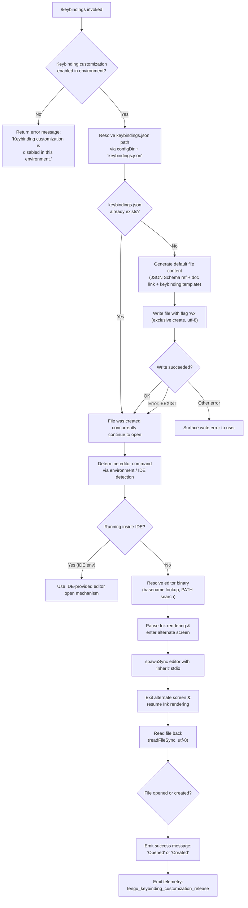

# `/keybindings`

> Analysis basis: CC v2.1.199 bundle.js (AST extraction + Claude interpretation)
> Minimum version: v2.1.199

---

## Overview

`/keybindings` opens the user's keyboard-shortcut customization file (`keybindings.json`) in an external editor. If the file does not yet exist, the command first writes a default scaffold (including a JSON Schema reference and documentation link) before launching the editor. The command is disabled in environments where keybinding customization is not permitted.

---

## Registration

| Field | Value |
|---|---|
| type | `local` |
| name | `keybindings` |
| description | `Open your keyboard shortcuts file` |
| supportsNonInteractive | `false` |
| module_id | `UKl` |
| load_inline | `true` |
| loc_byte | `12287540` |
| loc_byte_end | `12287717` |
| loc_line | `9058` |
| arbor_handler.name | `tYf` |
| arbor_handler.fqn | `claude-2.1.199::tYf` |
| arbor_handler.kind | `AsyncFunction` |
| arbor_handler.resolution_path | `module_id` |
| arbor_handler.n_hits | `0` |

Analysis basis: CC v2.1.199 bundle.js:+12287540

---

## Input Branching

The command follows 4+ distinct paths depending on environment capability, file existence, and editor availability. A Mermaid flowchart is required.



---

## Behavioral Spec

### 1. Entry Point — Handler (`tYf`)

The async handler `tYf` is the primary entry point resolved via `module_id` → `UKl`.

```
async function keybindingsHandler(context):
    // Check if the current environment permits keybinding customization
    featureEnabled = checkKeybindingCustomizationEnabled(context)
    if not featureEnabled:
        return returnTextMessage("Keybinding customization is disabled in this environment.")

    // Resolve the config directory and target file path
    configDir   = getConfigDirectory(context)            // via Qs → EId.getStore
    fileDir     = path.dirname(configDir)                // via NKl.dirname
    filePath    = resolveKeybindingsPath(configDir)      // "keybindings.json" appended

    // Ensure the file exists; write scaffold if not
    fileCreated = ensureKeybindingsFileExists(filePath, fileDir)

    // Open the file in an external editor
    editorResult = openInEditor(filePath, context)

    // Emit outcome notification
    label = fileCreated ? "Created" : "Opened"
    emitNotification(label)

    // Report telemetry (via Uq call chain)
    reportTelemetry("tengu_keybinding_customization_release")
```

Analysis basis: CC v2.1.199 bundle.js:+12286805

---

### 2. Feature-Gate Check (`Uq` → `ot` → `wDn`)

Before any file I/O, the command checks whether keybinding customization is available for the current installation.

```
function checkKeybindingCustomizationEnabled(context):
    // ot checks the bke registry (Set/Map structures) and delegates to wDn
    entry = registryLookup(context)           // bke.has, bke.get
    if entry already processed (YZr.has):
        return cached result
    // wDn fetches the Growthbook experiment flag
    result = fetchGrowthbookFlag("tengu_keybinding_customization_release")
    YZr.add(context)                           // mark as processed
    // KZr emits a GrowthbookExperimentEvent with source "firstParty"
    emitExperimentEvent("GrowthbookExperimentEvent", source="firstParty")
    return result
```

Analysis basis: CC v2.1.199 bundle.js:+12286805 (tYf→Uq), +3407961 (ot→wDn), +3405196 (wDn→YZr.add)

---

### 3. Path Resolution (`rSe`)

```
function resolveKeybindingsPath(configDir):
    // rNn.join is called with the config directory segments
    // The filename literal is "keybindings.json"
    return path.join(...configDir, "keybindings.json")
```

The filename constant `"keybindings.json"` is hardcoded.
Analysis basis: CC v2.1.199 bundle.js:+4052854 (literal), +12286902 (tYf→rSe)

---

### 4. Default File Scaffold Generation (`DKl` → `eYf`)

When the file does not exist, the command builds a default JSON document before writing.

```
function buildDefaultKeybindingsContent():
    // eYf maps over a predefined keybinding template list (y9t.map)
    // Each entry is normalized via XGe (trim, space-handling)
    // Object.entries + Object.keys used to iterate existing bindings
    // A JSON Schema $schema key is set to:
    //   "https://www.schemastore.org/claude-code-keybindings.json"
    // A documentation link is embedded:
    //   "https://code.claude.com/docs/en/keybindings"
    entries = normalizeTemplateEntries(keybindingTemplate)
    document = {
        "$schema": "https://www.schemastore.org/claude-code-keybindings.json",
        // ... keybinding entries ...
    }
    // xe serializes to JSON with indent = 2 (JSON.stringify, spaces=2)
    return JSON.stringify(document, null, 2)
```

JSON Schema URL: `https://www.schemastore.org/claude-code-keybindings.json`
(Analysis basis: CC v2.1.199 bundle.js:+12286558)

Documentation URL: `https://code.claude.com/docs/en/keybindings`
(Analysis basis: CC v2.1.199 bundle.js:+12286623)

JSON indentation: 2 spaces (Analysis basis: CC v2.1.199 bundle.js:+12286705)

---

### 5. File Write — Exclusive Create (`OKl.writeFile`)

```
function ensureKeybindingsFileExists(filePath, fileDir):
    content = buildDefaultKeybindingsContent()
    try:
        // Flag "wx" ensures atomic exclusive create; encoding "utf-8"
        fs.writeFile(filePath, content, { encoding: "utf-8", flag: "wx" })
        return true    // file was newly created
    catch error:
        if error.code == "EEXIST":
            return false   // file already existed; proceed normally
        else:
            throw error    // propagate unexpected errors
```

Write flags: `"wx"` (exclusive create), encoding: `"utf-8"`
(Analysis basis: CC v2.1.199 bundle.js:+12287001, +12286988, +12287028)

---

### 6. Editor Launch (`MIe`)

```
async function openInEditor(filePath, context):
    // Retrieve the Ink renderer instance (zt + hu.get)
    inkInstance = getInkInstance()
    if inkInstance is null:
        throw Error("Ink instance not found - cannot pause rendering")

    // Resolve editor command: Wx checks for IDE environment first
    editorCommand = resolveEditorCommand(filePath)
    // editorCommand.toLowerCase() used for IDE detection ("IDE" literal)
    isIDE = editorCommand.toLowerCase().includes("IDE")

    if isIDE:
        // Use IDE-native open (AGo → zql path with basename + extension checks)
        openViaIDE(filePath)
    else:
        // Pause terminal rendering for full-screen editor
        inkInstance.enterAlternateScreen()
        inkInstance.pause()
        inkInstance.suspendStdin()

        // Split command string into binary + args array (s.split)
        [binary, ...args] = editorCommand.split(" ")
        args = args.slice(...)   // trim any excess

        // Launch editor synchronously with inherited stdio
        result = child_process.spawnSync(binary, [...args, filePath], {
            stdio: "inherit"
        })

        // Restore terminal
        inkInstance.exitAlternateScreen()
        inkInstance.resumeStdin()
        inkInstance.resume()

    // Read back the (possibly modified) file
    updatedContent = fs.readFileSync(filePath, "utf-8")
    return updatedContent
```

stdio mode: `"inherit"` (Analysis basis: CC v2.1.199 bundle.js:+12237086)
Error string for missing Ink instance: `"Ink instance not found - cannot pause rendering"` (Analysis basis: CC v2.1.199 bundle.js:+12236779)

---

### 7. Editor Command Resolution (`Wx`)

```
function resolveEditorCommand(filePath):
    // Wx normalizes the editor name to lowercase for comparison
    raw = getEditorFromEnv()           // environment variable or config
    lower = raw.toLowerCase()

    if lower indicates IDE integration:
        return "IDE"                   // sentinel checked upstream

    // Extract basename for PATH lookup (g1.basename)
    baseName = path.basename(raw)

    // M8t performs additional editor-specific adjustments
    return adjustEditorCommand(baseName, raw)
```

Analysis basis: CC v2.1.199 bundle.js:+12237154 (tYf→Wx), +7476521 (Wx→toLowerCase), +7476579 (Wx→basename)

---

### 8. Outcome Notification (`sc` / `ZC`)

```
function emitNotification(label):
    // sc calls at (which converts value to String) then pvr to render
    // label is either "Opened" or "Created"
    message = String(label)
    renderNotification(message)        // via pvr

function emitSafeModeBanner():
    // ZC checks for --safe-mode flag and renders restart suggestion:
    // "restart without --safe-mode" or "unset CLAUDE_CODE_SAFE_MODE"
    if safeMode:
        renderBanner("restart without --safe-mode")
```

Outcome labels: `"Opened"` and `"Created"` (Analysis basis: CC v2.1.199 bundle.js:+12287115, +12287124)

---

## State & Side Effects

| Item | Detail |
|---|---|
| Telemetry | `tengu_keybinding_customization_release` — fired via the feature-gate check (Uq → ot → wDn → KZr) on every invocation where the feature is active (bundle.js:+4052340) |
| Growthbook experiment event | `GrowthbookExperimentEvent` with source `"firstParty"` and experiment key `"growthbook_experiment"` emitted via `vre.emit` (bundle.js:+3401006, +3401458) |
| File creation | Writes `keybindings.json` to the Claude Code config directory with flag `"wx"` (exclusive, non-overwriting) when the file is absent (bundle.js:+12286956) |
| Terminal state | Ink renderer is paused and alternate screen is entered during synchronous editor launch; both are restored on editor exit (bundle.js:+12236932, +12237434) |
| appState changes | Config directory store read via `EId.getStore` (async store context); no direct global mutation observed in depth-2 traversal |
| Sound | <!-- TODO: not found in depth-2 traversal; needs --depth 4 --> |
| Safe-mode banner | If `--safe-mode` is active, a restart suggestion is rendered alongside the outcome notification (bundle.js:+72149) |

---

## Version History

| Version | Change |
|---|---|
| v2.1.199 | Initial analysis |

---

## Common Mistakes

1. **Invoking in non-interactive mode** — `supportsNonInteractive: false` means the command will not function in piped or headless invocations. The Ink renderer must be active.
2. **Expecting the file to pre-exist** — The command creates `keybindings.json` from a default scaffold on first use. Manually deleting the file and re-running will recreate it, not restore a previous customization.
3. **Editor not on PATH** — If the resolved editor binary is not found in `PATH` and no IDE integration is present, `spawnSync` will fail silently or error. Ensure `$EDITOR` / `$VISUAL` is set to a resolvable binary.
4. **Keybinding customization disabled** — In restricted or embedded environments the feature gate may be off, returning the literal message `"Keybinding customization is disabled in this environment."` with no file operation performed.
5. **Concurrent write race** — If two processes invoke `/keybindings` simultaneously on a missing file, only one will create it (`"wx"` flag); the other receives `EEXIST` and proceeds to open the file the first process created — this is handled gracefully.
6. **JSON Schema URL confusion** — The `$schema` field points to `https://www.schemastore.org/claude-code-keybindings.json`, not the documentation URL (`https://code.claude.com/docs/en/keybindings`). Do not conflate the two.

---

## Appendix — Identifier Mapping

> For bundle debugging only. Identifiers change across versions.

| Identifier | Role |
|---|---|
| `tYf` | Primary async handler for `/keybindings` (Arbor-resolved entry point) |
| `Uq` | Feature-gate check dispatcher; calls `ot` to evaluate experiment flag |
| `ot` | Core experiment registry lookup; checks `bke` map and delegates to `wDn` |
| `hBt` | Helper called within `ot` (exact role not resolved at depth-2) |
| `HBt` | Helper called within `ot` (exact role not resolved at depth-2) |
| `HG` | Intermediate call from `ot`; bridges to `hG` |
| `hG` | Lower-level helper; calls `b9` (exact role not resolved at depth-2) |
| `wDn` | Growthbook flag fetcher; manages `YZr` set and `bke` map for deduplication |
| `KZr` | Experiment event emitter; emits `GrowthbookExperimentEvent` via `vre.emit` |
| `eeo` | Sub-function of `wDn`; calls `hOi`, `Lr`, `G6i`, `oO`, `zg`, `Mt` |
| `Mt` | Config access guard; throws `"Config accessed before allowed."` if premature |
| `BJo` | Helper used within `Mt` |
| `GJo` | Helper used within `Mt` |
| `hae` | Helper used within `Mt` |
| `rSe` | Keybindings file path resolver; joins config dir segments with `"keybindings.json"` |
| `Qs` | Async store accessor; calls `EId.getStore` to retrieve config directory |
| `DKl` | Default file content builder; orchestrates `eYf` and `xe` |
| `eYf` | Template mapper; iterates keybinding template with `Object.entries` / `Object.keys` |
| `XGe` | Entry normalizer; trims whitespace (handles `"space"` literal) |
| `xe` | JSON serializer wrapper; calls `JSON.stringify` with 2-space indent |
| `rn` | Post-write handler or result accumulator (exact role not resolved at depth-2) |
| `MIe` | Editor launch orchestrator; manages Ink pause/resume and `spawnSync` |
| `zt` | Ink instance registry accessor |
| `qj` | Ink instance lookup helper; calls `IH` and `E7f` |
| `IH` | Sub-helper of `qj` |
| `A7f` | IDE detection sub-routine within `MIe`; delegates to `AGo` |
| `AGo` | IDE file-open handler; calls `zql` and `h7f.find` |
| `zql` | File extension / basename classifier for IDE open logic |
| `Wx` | Editor command resolver; lowercases editor name and extracts basename |
| `oi` | String utility: `indexOf` + `slice` (used in editor name parsing) |
| `sc` | Outcome notification renderer; converts label to `String` via `at`, renders via `pvr` |
| `at` | String coercion helper; calls `String()` |
| `pvr` | UI rendering primitive (shared across notification paths) |
| `ZC` | Safe-mode banner renderer; checks `--safe-mode` flag and calls `pvr` |

---

Note: index built via Arbor fallback; some signals (telemetry, literals) may be missing — see arbor-fallback.js.