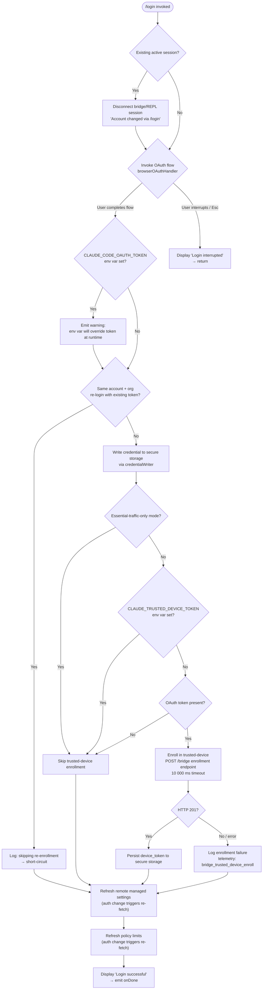

# `/login`

> Analysis basis: CC v2.1.199 bundle.js (AST extraction + Claude interpretation)
> Minimum version: v2.1.199

---

## Overview

`/login` initiates or switches the active Anthropic account by launching an OAuth authentication flow in the user's browser. It persists the resulting credential to secure storage, tears down any existing Remote Control (bridge/REPL) session tied to the prior account, and optionally enrolls the new session in Trusted Device tracking. The command renders a live JSX dialog inside the terminal UI while authentication is in progress.

---

## Registration

| Field | Value |
|---|---|
| type | `local-jsx` |
| name | `login` |
| description | `"Switch Anthropic accounts \| Sign in with your Anthropic account"` |
| module_id | `MOo` |
| load_inline | `true` |
| loc_byte | `12296124` |
| loc_byte_end | `12296380` |
| loc_line | `9058` |
| arbor_handler.name | `ozl` |
| arbor_handler.fqn | `claude-2.1.199::ozl` |
| arbor_handler.kind | `Function` |
| arbor_handler.resolution_path | `direct` |
| arbor_handler.n_hits | `2` |

Registration block spans bytes `(12296124, 12296380)`.

Analysis basis: CC v2.1.199 bundle.js:+12296124

---

## Input Branching

The command has more than three distinct execution paths (OAuth success, interrupted/cancelled, env-token override warning, bridge disconnect, trusted-device enrollment, same-account re-login short-circuit). A flowchart is used.



Analysis basis: CC v2.1.199 bundle.js:+9806178, +9806903, +9807170, +9807787, +9808243, +9808262

---

## Behavioral Spec

### 1. Handler Entry — `loginCommandHandler` (bundle: `mNe`)

The top-level handler (resolved via Arbor as `ozl`, rendered by the JSX wrapper `tvf`) receives the command context and immediately:

1. Calls `onChangeAPIKey` to signal an impending credential change to the rest of the application. Analysis basis: CC v2.1.199 bundle.js:+9806178
2. Applies a message-operation update to the conversation state (`applyMessageOp`, operation type `"update"`, sequence `1`). Analysis basis: CC v2.1.199 bundle.js:+9806197, +9806220, +9806273

```
function loginCommandHandler(context):
    context.onChangeAPIKey()
    context.applyMessageOp({ type: "update", seq: 1 })
    providerType = detectProviderType()   // gateway / bedrock / foundry / …
    authFlowResult = await runOAuthFlow(context)
    if authFlowResult.interrupted:
        display("Login interrupted")
        return
    handlePostLoginTasks(context, authFlowResult)
```

### 2. Provider-Type Detection — `detectProviderType` (bundle: `gr`)

Inspects the current configuration and maps to one of the known provider strings. Known provider literals (Analysis basis: CC v2.1.199 bundle.js:+2176333–2176618):

| String | Meaning |
|---|---|
| `"gateway"` | Anthropic first-party gateway |
| `"bedrock"` | AWS Bedrock |
| `"foundry"` | Azure AI Foundry |
| `"anthropicAws"` | Anthropic-owned AWS account |
| `"mantle"` | Mantle proxy |
| `"vertex"` | Google Vertex AI |
| `"firstParty"` | Direct first-party (non-gateway) |

```
function detectProviderType(config):
    if config has gateway flag:   return "gateway"
    if config has bedrock flag:   return "bedrock"
    if config has foundry flag:   return "foundry"
    // … additional checks …
    return "firstParty"
```

Analysis basis: CC v2.1.199 bundle.js:+2176333

### 3. Bridge/REPL Disconnect — `disconnectBridgeSession` (bundle: `rer`)

When the command detects an existing active Remote Control session, it tears it down before proceeding. The log string `"[bridge:repl] Account changed via /login — disconnecting Remote Control session"` is emitted. Internal caches are cleared (`clearCOo`, `clearCOo.clear`).

Analysis basis: CC v2.1.199 bundle.js:+9806551, +9806903

### 4. OAuth Flow — `runOAuthFlow` (bundle: `qqe`)

Orchestrates the browser-based authentication:

```
async function runOAuthFlow(context):
    configureRequestSettings(kXa)        // HTTP headers, cert-pin logic
    await awaitConsentDialogIfNeeded()   // Wqe → tPs: remote settings load gate
    credentials = await fetchOAuthToken(fZ)
    notifyAuthChange(YVn)                // kD.notifyChange + policy-settings update
    securityCheck = await checkManagedSettingsSecurity(Qvo)
    await applySettingsAfterAuth(two)    // full managed-settings refresh cycle
    await persistAndFinalise(LXa)       // write to disk, fsync
    return credentials
```

Analysis basis: CC v2.1.199 bundle.js:+8115504, +8115510, +8115534, +8115546, +8115555, +8115597, +8115612

#### 4a. Auth-Change Notification — `notifyAuthChange` (bundle: `YVn`)

After credentials are obtained, `YVn` fires `kD.notifyChange` and updates `policySettings` in the global store. This triggers the managed-settings and policy-limits background pollers to re-fetch immediately.

Analysis basis: CC v2.1.199 bundle.js:+8115718, +8115724, +8115740

#### 4b. Managed-Settings Security Check — `managedSettingsSecurityCheck` (bundle: `Qvo`)

```
async function managedSettingsSecurityCheck():
    if new settings arrive that require a security dialog:
        show security dialog (tengu_managed_settings_security_dialog_shown)
        if user accepts:
            record telemetry: tengu_managed_settings_security_dialog_accepted
            apply new settings
        else:
            record telemetry: tengu_managed_settings_security_dialog_rejected
            retain cached settings
    schedule next poll via setTimeout
    return result
```

Analysis basis: CC v2.1.199 bundle.js:+8109265, +8109317

#### 4c. Settings Refresh Cycle — `applySettingsAfterAuth` (bundle: `two`)

Fetches remote managed settings via `uJp` (HTTP fetch with exponential back-off via `kK`, `Math.min/pow/random`). Response codes handled:

| HTTP Code | Action |
|---|---|
| 200 | Parse and validate settings |
| 204 / 304 | Use cached settings |
| 404 | Save empty sentinel |
| 401 | Force-refresh retry (telemetry: `tengu_remote_settings_401_force_refresh_retry`) |
| 500+ | `http_5xx` error path, use stale cache |
| 400–499 | `http_4xx` error path |
| Network error | `network_error`, use stale cache |
| Timeout | `timeout` error path, use stale cache |

Analysis basis: CC v2.1.199 bundle.js:+8113628, +8111254, +8111263, +8111272, +8111281, +8112638, +8113128, +8113158

The gateway TLS certificate pin is verified for managed-settings fetches; when an HTTPS proxy is configured the pin is skipped with a warning: `"[gateway] HTTPS proxy configured — per-request cert pin not applied …"`. Analysis basis: CC v2.1.199 bundle.js:+8111022

### 5. Credential Persistence — `credentialPersist` (bundle: `IXa`)

Opens a file descriptor via `XHt.open`, writes credentials as JSON (`xe` / `JSON.stringify`), calls `datasync`, then `close`. The file is 384 bytes maximum buffer. Encoding is `"utf-8"`.

Analysis basis: CC v2.1.199 bundle.js:+8113238, +8113253, +8113268, +8113280, +8113303, +8113319, +8113346

### 6. Post-Login Tasks — `handlePostLoginTasks` (bundle: `mNe` continuation)

```
function handlePostLoginTasks(context, credentials):
    if CLAUDE_CODE_OAUTH_TOKEN env var is set:
        display warning about env-var override     // loc +9807787
    appState = context.getAppState()
    if sameAccountReloginWithExistingToken(appState, credentials):
        log("[trusted-device] Same account+org re-login … skipping re-enrollment")
        // loc +9807170
    else:
        context.setAppState(updatedState)
        if not essentialTrafficOnly and not CLAUDE_TRUSTED_DEVICE_TOKEN env:
            if oauthToken present:
                await enrollTrustedDevice(dqt)
    await refreshPolicyLimits(JYt)
    refreshFeatureFlags(kue / xDn)
    display("Login successful")           // loc +9808243
    context.onDone()
```

Analysis basis: CC v2.1.199 bundle.js:+9806818, +9806991, +9807123, +9807162, +9807265, +9807277, +9807313, +9807348, +9807352, +9807386, +9807392, +9808243

### 7. Trusted-Device Enrollment — `enrollTrustedDevice` (bundle: `dqt`)

```
async function enrollTrustedDevice(context):
    if CLAUDE_TRUSTED_DEVICE_TOKEN env var set:
        log("[trusted-device] env var set, skipping enrollment")
        return
    if essentialTrafficOnly:
        log("[trusted-device] Essential traffic only, skipping enrollment")
        return
    if no oauthToken:
        log("[trusted-device] No OAuth token, skipping enrollment")
        return
    response = await POST enrollmentEndpoint, {
        headers: { "Content-Type": "application/json" },
        timeout: 10000     // 10 000 ms
    }
    telemetry("bridge_trusted_device_enroll", { status, ... })
    if response.status == 201:
        if response.body missing device_token:
            log("[trusted-device] Enrollment response missing device_token field")
            return error("missing_token")
        await writeDeviceTokenToSecureStorage(Cl / Mhi)
    else:
        record http_error / storage_failed / unknown
```

Analysis basis: CC v2.1.199 bundle.js:+8031299, +8031613, +8031726, +8031977, +8031992, +8032020, +8032122, +8032208, +8032405, +8032506

### 8. Policy-Limits Refresh — `refreshPolicyLimits` (bundle: `JYt`)

Reads the policy limits file via `pGi.readFileSync` through `CBt`, checks file modification time via `abc.statSync`, and fetches updated limits. On success, emits telemetry `tengu_policy_limits_fetch`. Applies exponential back-off (same `kK` utility) for polling.

Analysis basis: CC v2.1.199 bundle.js:+14362828, +14360554, +14360854

### 9. JSX UI Component — `loginUIComponent` (bundle: `gNe`)

The command is of type `local-jsx`; `gNe` is the React component rendered during authentication:

```
function LoginUI(props):
    [status, setStatus] = useState()
    useEffect → register handler via uo.registerHandler
    on props.onDone: call back to parent
    render:
        if status == "in_progress":
            show spinner / progress dialog (wra / jio)
        if status == "success":
            show "Login successful"
        if status == "interrupted":
            show "Login interrupted"
        show "Press Esc / cancel" hint
```

User-facing strings confirmed in literals:
- `"Login successful"` (Analysis basis: CC v2.1.199 bundle.js:+9808243)
- `"Login interrupted"` (Analysis basis: CC v2.1.199 bundle.js:+9808262)
- `"Press "` / `" again to exit"` (Analysis basis: CC v2.1.199 bundle.js:+9808782, +9808801)
- `"Esc"` / `"cancel"` (Analysis basis: CC v2.1.199 bundle.js:+9808881, +9808899)
- `"Settings"` / `"Global"` context labels (Analysis basis: CC v2.1.199 bundle.js:+9808629)
- `"Login"` (page title literal) (Analysis basis: CC v2.1.199 bundle.js:+9809336)

The component uses `Symbol.for("react.memo_cache_sentinel")` for memoisation, with a cache size of 21 slots. Analysis basis: CC v2.1.199 bundle.js:+9808385, +9808332

### 10. Required Environment & Auth Tokens

The error string `"ANTHROPIC_API_KEY, ANTHROPIC_AUTH_TOKEN, CLAUDE_CODE_OAUTH_TOKEN, or WIF env vars (ANTHROPIC_FEDERATION_RULE_ID + ANTHROPIC_ORGANIZATION_ID) required"` is thrown when no valid auth source is present post-login.

Analysis basis: CC v2.1.199 bundle.js:+3121070

Recognised credential env vars and their handling:

| Variable | Usage |
|---|---|
| `ANTHROPIC_API_KEY` | Primary API key |
| `ANTHROPIC_AUTH_TOKEN` | Auth-token override |
| `CLAUDE_CODE_OAUTH_TOKEN` | OAuth token override (warns user if set after /login) |
| `CLAUDE_CODE_OAUTH_TOKEN_FILE_DESCRIPTOR` | FD-based OAuth token delivery |
| `CCR_OAUTH_TOKEN_FILE` | Remote-CCR token file |
| `CLAUDE_CODE_API_KEY_FILE_DESCRIPTOR` | FD-based API key delivery |
| `CLAUDE_TRUSTED_DEVICE_TOKEN` | Skips trusted-device enrollment if present |

Analysis basis: CC v2.1.199 bundle.js:+3118591, +3118680, +3118797, +3118866, +2201898, +8031299

---

## State & Side Effects

| Item | Detail |
|---|---|
| Telemetry | `tengu_remote_settings_401_force_refresh_retry`, `tengu_feature_bad`, `tengu_feature_ok`, `tengu_managed_settings_security_dialog_shown`, `tengu_managed_settings_security_dialog_accepted`, `tengu_managed_settings_security_dialog_rejected`, `tengu_policy_limits_fetch`, `tengu_feature_sad`, `tengu_policy_limits_cache_write_failed`, `tengu_disable_bypass_permissions_mode`, `tengu_auto_mode_config`, `tengu_daemon_config_reload`, `tengu_keybinding_fallback_used` |
| Credential write | OAuth token written to secure storage (primary) with plaintext fallback; `secure_storage_credentials_write` / `plaintext_fallback_used` / `primary_and_fallback_failed` paths |
| Trusted-device enrollment | HTTP POST to bridge enrollment endpoint (10 000 ms timeout); device token stored via `Mhi` secure-storage writer; telemetry `bridge_trusted_device_enroll` |
| Bridge/REPL disconnect | Existing Remote Control session torn down (`COo.clear`); logged as `"[bridge:repl] Account changed via /login"` |
| appState changes | `getAppState` / `setAppState` called; authentication state updated; `authentication_failed` string present for error path |
| Remote managed settings | Immediate re-fetch triggered via `kD.notifyChange`; result cached to disk with fsync; ETag-based 304 handling |
| Policy limits | Re-fetched and applied; cache invalidated; stale cache used on failure |
| Feature flags | Refreshed via `xDn` / `$6i` (clears `bke`, `vDn`, `_q` caches and repopulates) |
| Hook registration | `bfs.register` called via `Ai` (Analysis basis: CC v2.1.199 bundle.js:+69837) |
| Sound | <!-- TODO: not found in depth-2 traversal; needs --depth 4 --> |
| Env-var override warning | `CLAUDE_CODE_OAUTH_TOKEN` detected post-login → `system`-type warning message displayed |

---

## Version History

| Version | Change |
|---|---|
| v2.1.199 | Initial analysis |

---

## Common Mistakes

1. **Expecting instant effect when `CLAUDE_CODE_OAUTH_TOKEN` is set in the environment.** After `/login` completes, the env var still takes precedence at runtime. The user must unset it for the new credentials to be active.
2. **Running `/login` under essential-traffic-only mode and expecting trusted-device enrollment.** Enrollment is silently skipped in that mode; no error is shown.
3. **Assuming the command is non-destructive to the current session.** `/login` immediately disconnects any active Remote Control / bridge session; work in progress via Remote Control will be interrupted.
4. **Cancelling the browser OAuth flow and expecting partial state changes to roll back automatically.** If interrupted mid-flight, the credential store is not written, but the bridge session may already have been disconnected.
5. **Conflating `/login` with an API-key rotation.** The command targets OAuth account switching; API key changes use a different path (`onChangeAPIKey` is a side-effect signal, not the primary mechanism here).

---

## Appendix — Identifier Mapping

> For bundle debugging only. Identifiers change across versions.

| Identifier | Role |
|---|---|
| `ozl` | Arbor-resolved handler function for `/login` (direct resolution) |
| `mNe` | Main login handler body (post-auth orchestration) |
| `tvf` | JSX wrapper / render entry-point for the login command |
| `gNe` | React UI component for the login dialog |
| `LC` | App-state context connector used by login UI |
| `qqe` | OAuth flow orchestrator |
| `fZ` | OAuth token fetcher |
| `YVn` | Auth-change notifier (`kD.notifyChange` + policy-settings update) |
| `Qvo` | Managed-settings security check after auth |
| `two` | Settings refresh cycle after auth |
| `uJp` | HTTP fetch with retry for managed settings |
| `vXa` | Core HTTP request executor for managed-settings |
| `kK` | Exponential back-off utility (Math.min/pow/random) |
| `LXa` | Credential persistence finaliser |
| `IXa` | File-based credential writer (open/writeFile/datasync/close) |
| `dqt` | Trusted-device enrollment handler |
| `Cl` / `Mhi` | Secure-storage writer (primary + fallback) |
| `JYt` | Policy-limits refresh orchestrator |
| `cbc` | Policy-limits cache read/write core |
| `RTm` | Policy-limits poll worker |
| `rer` | Bridge/REPL session teardown |
| `hbl` | COo cache clearer (bridge state reset) |
| `xDn` | Feature-flag refresh dispatcher |
| `$6i` | Feature-flag payload applicator (clears and repopulates bke, vDn, _q) |
| `kue` | Feature-flag shutdown/cleanup (on account change) |
| `W4` | Global config rebuild after login |
| `bXa` | Config field extractor used in rebuild |
| `zHt` | HTTP header policy builder |
| `HT` | CA-cert / mTLS cache invalidator |
| `gr` | Provider-type detector |
| `Vm` | Provider-type mapper helper |
| `eer` | Deep-equality check on config objects |
| `kn` | Settings layer merger |
| `t9` | Settings sub-layer compositor |
| `Or` | App-state last-message finder (post-login state patch) |
| `YYt` | Auto-mode gate evaluator triggered post-login |
| `XYt` | Auto-mode config resolver |
| `dVn` | Settings hash computer (SHA-256) |
| `On` | Async timeout/abort controller |
| `GDn` | Interval-based background poller |
| `Ai` | Hook/BFS registration utility |
| `pJp` | Background managed-settings poll trigger |
| `xXa` | Managed-settings interval poller launcher |
| `het` | Timestamp utility (`Date.now`) |
| `sr` | Error-string formatter |
| `ke` | Error logger with queue (`knt.push`, `fne.logError`) |
| `Pi` | Essential-traffic queue flusher |
| `Gku` | Request queue rotation (shift/push) |
| `Jw` | Settings-layer resolver with key lookup |
| `bb` | Profile-settings merger |
| `SR` | Settings-record reader |
| `Md` | Settings-model deserialiser |
| `ic` | Provider-context reader |
| `Mt` | Config-access guard (throws "Config accessed before allowed.") |
| `iNt` | `CLAUDE_CODE_API_KEY_FILE_DESCRIPTOR` reader |
| `R$` | Token slicer (max 20 chars for display) |
| `gu` / `wIn` | Credential write coordinator |
| `lA` / `h2t` | Settings file path builders |
| `IBt` | Auth-type classifier (third_party_provider / custom_base_url / no_auth / oauth_no_inference_scope / prosumer_oauth) |
| `Bw` | Full-config writer (env var merging: ANTHROPIC_AUTH_TOKEN, CLAUDE_CODE_OAUTH_TOKEN, etc.) |
| `EE` | Config serialiser |
| `m2t` / `slt` | Config field setters |
| `vJo` / `LJo` | Policy-limits HTTP fetch pair |
| `IEe` | Auth-state event emitter (egi / dGi) |
| `Dgr` | Policy-limits fetch scheduler with setTimeout |
| `Ogr` | Policy-limits fetch outer controller |
| `ubc` | Policy-limits background poller |
| `Lke` | Policy-limits file path builder |
| `CBt` | Policy-limits cache reader (readFileSync) |
| `CTm` | Policy-limits content hasher (createHash sha256) |
| `vTm` | Policy-limits payload applier |
| `wTm` | Policy-limits retry wrapper |
| `abc` | Policy-limits cache freshness checker (statSync) |
| `xTm` | Policy-limits cache writer (writeFile) |
| `ROe` | Feature-value getter |
| `ot` | Feature-flag resolver with fallback |
| `wDn` | Feature-flag value cache reader/writer |
| `W6i` | Feature-flag value resolver with policy query |
| `r2` | Feature-flag batch resolver |
| `ZYp` / `qCo` | Feature-flag context readers |
| `Fs` | OAuth endpoint URL formatter |
| `OTs` / `Oku` | OAuth base-URL resolvers |
| `oer` / `teo` | Login-result auth-state reader |
| `Cqt` / `qH` | Permission-state updater post-login |
| `Msr` / `Dsr` | Voice/last-message finder helpers |
| `wR` / `Feo` | Bypass-permissions mode guard |
| `iJ` / `LDn` | Feature-flag direct lookup |
| `ks` / `Bo` / `MH` | Model name resolver and normaliser |
| `fv` / `VNt` / `jNt` | Model config merger and validator |
| `UWr` | Model preference builder |
| `kgi` | Model-tier lookup |
| `Rgi` | Available-model enforcer |
| `za` | Model config parser |
| `uvn` | Model entry normaliser |
| `U$` / `QZn` | Settings composite reader |
| `gS` / `Zi` | Text / model string sanitisers |
| `Mgi` | Model-name composite sanitiser |
| `cd` / `Oce` / `Uw` | Model string classifier helpers |
| `pso` | App-state context hook |
| `yt` | External-store subscriber |
| `y7e` / `oJ` | Store subscription effect hook |
| `oy` | App-state selector |
| `pA` | Permission context reader |
| `uo` | Handler registration hook |
| `dA` | Keyboard context reader |
| `Dh` / `wra` / `jio` | Login progress dialog renderer |
| `Ku` | Keyboard shortcut effect hook |
| `FG` | Inactivity / debounce timer hook |
| `$St` / `Uv` | Post-login assistant-message finder |
| `Abl` | Login UI layout helper |
| `Fc` / `EE` | Config writer called after login |
| `H9t` | Trusted-device-token checker |
| `JCo` / `dqt` | Trusted-device enroll entry points |
| `qr` | React context bootstrapper |
| `Hbl` | Post-login housekeeping (misc cleanup) |
| `zYt` / `oer` | Auth-result handler |
| `kOo` | Post-login flag toggle |
| `MOe` | Same-account re-login detector |
| `uke` | Feature-flag teardown on account change |
| `neo` | Interval/process-listener cleanup |
| `qlt` | Feature cache bulk clear (bke, vDn, mBt, YZr, _q) |
| `HG` / `hG` | Feature-flag store accessors |
| `B6i` | Feature-flag snapshot builder |
| `Hn` | Remote API call wrapper for feature flags |
| `PLe` | Settings field enumerator |
| `TXa` | Settings field type validator |
| `yXa` | Security-dialog decision handler |
| `HXa` | Security-dialog state updater |
| `qXp` | Security-dialog queue manager |
| `Oq` | Permission-write gate |
| `YD` | Dialog result dispatcher |
| `EXa` | Settings applicator after dialog accept |
| `Yc` | Auth-type-to-UI mapper |
| `ewo` / `CXa` | Settings payload validators |
| `OHt` / `pVn` | Settings field transformers |
| `tYa` | Settings hash comparator |
| `Jvo` | Promise.all coordinator for session teardown |
| `Le` / `we` / `Et` / `Pe` / `V` | React-component wrappers / error-boundary helpers |
| `GZe` | React error boundary base |
| `Ro` / `qe` | GZe-derived wrappers |
| `T` | Log/output writer (debug, warn levels) |
| `Sdu` | Child-process / subprocess launcher |
| `Nc` | Log-line formatter (REDACTED masking) |
| `xe` | JSON serialiser wrapper |
| `ntt` / `ths` | Log-timestamp formatter |
| `gdu` | Log-sink configurator |
| `NBe` | Log-level checker |
| `mN` | Log-metadata builder |
| `d2t` / `wI` | Settings diff helpers |
| `Aet` / `Hr` | VSCode-environment detector (`"claude-vscode"`) |
| `Ups` / `iyn` / `Fps` | Settings-cache read/write (Ccn map) |
| `TUr` | Settings-layer type resolver |
| `ar` / `Aw` | Platform detection utility |
| `hBe` | Platform string builder |
| `MV` / `G3r` | Proxy URL parser |
| `q9e` / `kKs` / `xKs` | Proxy agent factory |
| `zUr` / `QUr` / `_1t` | Cache-clear helpers (CA certs, mTLS, proxy agent) |
| `rPn` | Request-header builder |
| `yV` | Windows path normaliser (`replaceAll`) |
| `f` | Process-relaunch utility |
| `Cl` | Secure-storage composite writer |
| `R4e` | Async secure-storage reader |
| `d` | Daemon config reloader (supervisor mode) |
| `vJe` | File-stat / MIME checker |
| `ihc` | File listing formatter |
| `E` | SDK stop/start controller |
| `b` | Remote session connection manager |
| `iru` / `Mue` | Heartbeat manager |
| `I` | Scroll / viewport handler |
| `ste` / `R3` | Post-login state setters |
| `ASe` / `iu` | Permission-mode event emitter |
| `ACe` | Conversation permission map updater |
| `p` | Forced-shutdown handler |

Note: index built via Arbor fallback; some signals (telemetry, literals) may be missing — see arbor-fallback.js.