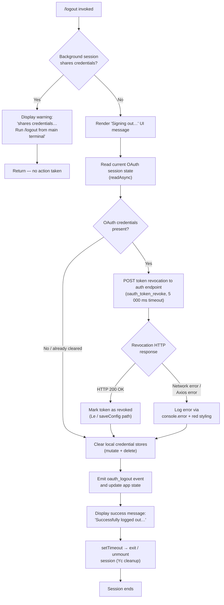

# `/logout`

> Analysis basis: CC v2.1.199 bundle.js (AST extraction + Claude interpretation)
> Minimum version: v2.1.199

---

## Overview

The `/logout` command signs the user out of their Anthropic account by revoking the current OAuth token, clearing credential storage, and then terminating or resetting the active session. It detects whether the current session is a background/shared-credential session and, if so, refuses to proceed and instead instructs the user to run `/logout` from their main terminal.

---

## Registration

| Field | Value |
|---|---|
| type | `local-jsx` |
| name | `logout` |
| description | Sign out from your Anthropic account |
| loc_byte | 12296441 |
| loc_byte_end | 12296725 |
| loc_line | 9058 |
| module_id | `nRo` |
| load_inline | `true` |
| arbor_handler.name | `AHf` |
| arbor_handler.fqn | `claude-2.1.199::AHf` |
| arbor_handler.kind | `AsyncFunction` |
| arbor_handler.resolution_path | `module_id` |
| arbor_handler.n_hits | 0 |

Analysis basis: CC v2.1.199 bundle.js:+12296441

---

## Input Branching

The command has 4+ distinct branches based on session type, background-session detection, OAuth revocation outcome, and sign-out success/failure, so a Mermaid flowchart is used.



Analysis basis: CC v2.1.199 bundle.js:+9017001 (handler entry `AHf`), +9015371, +9017111, +9017460, +9017305, +9016782

---

## Behavioral Spec

### 1. Background-Session Guard

When the handler (`AHf`) is invoked, it first checks whether the current process is running as a background session type — specifically the `"bg"`, `"daemon"`, or `"daemon-worker"` process role (literals at +2367157, +2367167, +2367181). Background sessions share credentials with a parent terminal session.

```
async function logoutHandler(context):
    sessionRole = readSessionRole()           // checks "bg" / "daemon" / "daemon-worker"
    if sessionRole is background:
        displaySystemMessage(
            "This background session shares credentials with other sessions; " +
            "/logout here has no effect. Run /logout from your main terminal to sign out."
        )
        return                                // abort — no credentials are touched
```

Analysis basis: CC v2.1.199 bundle.js:+9017109 (background guard), +9017111 (warning string literal)

---

### 2. UI Feedback — "Signing out…"

Before any async work begins the handler renders a transient status message so the user sees immediate feedback. The JSX component is created via `cpl.jsx` (+9017285) and the text literal `"Signing out…"` appears at +9017460.

```
function renderSigningOutMessage():
    return jsx("system", { text: "Signing out…" })
```

Analysis basis: CC v2.1.199 bundle.js:+9017460, +9017285

---

### 3. OAuth Token Revocation (`tokenRevocationRequest`)

The core revocation logic lives in `zN` (called from `Dyt` at +9015582). It performs an HTTP `POST` to the configured auth endpoint using the `refresh_token` grant type. Key constants:

- Grant type: `"refresh_token"` (literal at +2189002)
- `Content-Type`: `"application/json"` (literal at +2189072)
- Request timeout: **5 000 ms** (literal at +2189100)
- Telemetry label on the revocation path: `"oauth_token_revoke"` (literal at +2189110)

On an Axios error the function distinguishes error categories (auth: HTTP 401/403; timeout: `ECONNABORTED`; network: `ECONNREFUSED`/`ENOTFOUND`) and routes them through the shared error-styling helper (`gJe`/`St.red` at +13343385) before falling through to credential cleanup.

```
async function tokenRevocationRequest(credentials):
    try:
        response = await httpPost(authEndpoint + "/revoke", {
            grant_type : "refresh_token",
            token      : credentials.refreshToken
        }, { "Content-Type": "application/json" }, timeout=5000)
        return { success: true, data: response }
    catch error:
        category = classifyError(error)   // "auth" | "timeout" | "network" | "other"
        logErrorWithRedStyle(category, error)
        return { success: false, category }
```

Analysis basis: CC v2.1.199 bundle.js:+9015582 (`zN` call site), +2189002, +2189100, +2189110, +13343385

---

### 4. Credential Store Cleanup (`credentialClearSequence`)

After revocation (success or failure), the handler calls `Ozt` (+9015438) which coordinates clearing all credential storage layers:

1. **In-memory cache clear** — `Ere`/`NPi.clear` (+3111338)
2. **Keychain / secure storage deletion** — `wXa` (+9016955) calls `XHt.unlink` (+8113577) to remove the keychain entry; on failure the error string `"Failed to delete keychain entry"` is logged (literal at +2203513).
3. **Socket / IPC cleanup** — `rRo` (+9016967) calls `jJe.unlink` (+14362985) and `vJo` (+14356945) which clears pending timeouts (`clearTimeout` at +14356998).
4. **App-state mutation** — `Dyt` performs `o.mutate` (+9015924) and `o.delete` (+9016119) on the session store.
5. **Event emission** — `Le`/`saveConfig` path writes `"oauth_logout"` (literal at +9016782) into the persisted config via `Le` (+9016779).

```
async function credentialClearSequence(store, configWriter):
    clearInMemoryCache()                    // NPi.clear
    await deleteKeychainEntry()             // XHt.unlink — may log warning on ENOENT
    await removeSocketFiles()              // jJe.unlink + clearTimeout
    store.mutate(clearAuthFields)
    store.delete(sessionKey)
    configWriter.emit("oauth_logout")       // persists logout state
```

Analysis basis: CC v2.1.199 bundle.js:+9015438, +3111338, +8113577, +14362985, +9016782, +9016779

---

### 5. Session Teardown and Exit (`sessionExitSequence`)

After credentials are cleared, `AHf` renders the success message `"Successfully logged out from your Anthropic account."` (literal at +9017305) as a `"system"` role message (+9017263), then schedules session teardown via `setTimeout` (+9017369) → `Yc` (+9017385).

`Yc` orchestrates the full shutdown sequence (`Si` at +6910805):

- Writes terminal reset bytes (`WAe.writeSync` at +6913611)
- Drains pending buffer flushes (`ket`/`bfs.drain` at +69880, `Hun`/`Tfs.drain` at +69958)
- Races a 3 500 ms unref timer (+6913113) against active promise settlement (`BPa`/`Promise.allSettled` at +6896889, `hOa`/`Promise.allSettled` at +13938098)
- Emits `"session_end"` telemetry event (literal at +6913526)
- Calls `W_o` which invokes `process.exit` (+6910665) or, on unrecoverable state, `process.kill("SIGKILL")` (+6910715)

```
async function sessionExitSequence(exitDelayMs = 3500):
    displaySystemMessage("Successfully logged out from your Anthropic account.")
    await setTimeout(0)                    // yield to render cycle
    flushTerminalOutput()                  // WAe.writeSync
    await drainBuffers()                   // bfs.drain + Tfs.drain
    winner = await Promise.race([
        Promise.allSettled(activeTasks),   // BPa
        sleep(exitDelayMs)                 // unref timer
    ])
    emitTelemetry("session_end")
    process.exit(0)                        // W_o path
```

Analysis basis: CC v2.1.199 bundle.js:+9017305, +9017263, +9017369, +9017385, +6913113, +6913526, +6910665, +69880, +69958

---

### 6. Error Display Helper (`errorDisplayHelper`)

Used throughout the logout flow whenever a network or storage error occurs:

```
function errorDisplayHelper(error):
    message = formatRedText(error.message)   // St.red
    console.error(message)                    // gJe
    writeCliErrorToLog("cli_error", message)  // literal "cli_error" at +13343426
```

Analysis basis: CC v2.1.199 bundle.js:+13343371, +13343385, +13343426

---

## State & Side Effects

| Item | Detail |
|---|---|
| Telemetry: `tengu_feature_ok` | Emitted on successful credential/config write path (bundle.js:+1039941) |
| Telemetry: `tengu_feature_sad` | Emitted on degraded write (bundle.js:+1040089) |
| Telemetry: `tengu_feature_bad` | Emitted on failed write (bundle.js:+1040008) |
| Telemetry: `tengu_config_lock_contention` | Emitted if config lock acquisition is slow during logout config write (bundle.js:+14384847) |
| Telemetry: `tengu_config_stale_write` | Emitted if a stale write is detected during config flush (bundle.js:+14384985) |
| Telemetry: `tengu_config_auto_repaired` | Emitted if config is auto-repaired from cache under lock (bundle.js:+14385384) |
| Telemetry: `tengu_config_auth_loss_prevented` | Emitted when a write that would wipe auth is blocked (bundle.js:+14386054) |
| Telemetry: `tengu_config_fallback_write` | Emitted when config falls back to an alternate write path (bundle.js:+14384448) |
| Telemetry: `tengu_scroll_summary` | Emitted during session teardown scroll accounting (bundle.js:+6912522) |
| Telemetry: `tengu_cache_eviction_hint` | Emitted during session teardown (bundle.js:+6913488) |
| Telemetry: `tengu_pewter_brook` | Emitted on fullscreen/terminal mode detection during shutdown (bundle.js:+3615281) |
| Telemetry: `tengu_daemon_config_reload` | Emitted if daemon config is reloaded during session end (bundle.js:+18546460) |
| Telemetry: `tengu_startup_perf` | Emitted on startup profiling drain during teardown (bundle.js:+230441) |
| Config mutation | Writes `"oauth_logout"` key into persisted global config via locked writer (bundle.js:+9016782) |
| In-memory cache | `NPi.clear()` clears credential cache (bundle.js:+3111338) |
| Keychain | `XHt.unlink` removes the OS keychain/secure-storage entry (bundle.js:+8113577) |
| Socket file | `jJe.unlink` removes IPC socket file (bundle.js:+14362985) |
| Process exit | `process.exit` called after 3 500 ms drain window (bundle.js:+6910665) |
| Process listeners | `process.removeListener` / `process.off` called during teardown cleanup (bundle.js:+3409544, +3408765) |
| Interval/timers | `clearInterval` called during teardown (bundle.js:+3409509) |
| Multiple Map clears | `bke.clear`, `vDn.clear`, `mBt.clear`, `YZr.clear`, `_q.clear` during teardown (bundle.js:+3408891–+3408939) |
| Session end event | `Vlt.emit` fires on teardown (bundle.js:+3408644) |
| HTTP request | One outbound POST to Anthropic auth endpoint for token revocation, 5 000 ms timeout |

---

## Version History

| Version | Change |
|---|---|
| v2.1.199 | Initial analysis |

---

## Common Mistakes

1. **Running `/logout` in a background session** — The command silently no-ops and prints a warning. Users must run it from the primary/main terminal window for credentials to actually be revoked.
2. **Expecting an instant sign-out** — The command performs async network revocation (up to 5 000 ms) plus a 3 500 ms drain window before process exit. The terminal will appear to hang briefly; this is intentional.
3. **Assuming re-login is immediate** — After `/logout`, the process exits. A new `claude` invocation will restart the authentication flow; there is no in-session re-login command.
4. **Confusing `/logout` with API-key removal** — This command targets OAuth sessions only. If the CLI was configured with a direct API key (`ANTHROPIC_API_KEY`), `/logout` may clear stored OAuth tokens but does not unset environment variables.
5. **Ignoring the "Failed to delete keychain entry" warning** — If the OS keychain delete fails (e.g., permission error), the token revocation POST may still have succeeded. Users should verify on the Anthropic console that the session is truly revoked.

---

## Appendix — Identifier Mapping

> For bundle debugging only. Identifiers change across versions.

| Identifier | Role |
|---|---|
| `AHf` | Main async logout handler (arbor_handler; entry point resolved via module_id `nRo`) |
| `bHf` | Inner logout orchestration helper, calls `Dyt` and renders JSX output |
| `Dyt` | Core logout execution function: sequences revocation, cleanup, state mutation, and teardown |
| `Ozt` | Credential store clear coordinator (clears cache, keychain, socket, maps) |
| `zN` | OAuth token revocation HTTP request function |
| `Fs` | Auth endpoint URL resolver / OAuth config builder |
| `Ts` | CLI error writer — writes error code `"cli_error"` and exits process |
| `gJe` | Error display helper: `console.error` + red ANSI styling |
| `xI` | File-system write helper used by CLI error logger |
| `Ere` | In-memory credential cache clear (`NPi.clear`) |
| `kue` | Teardown event emitter and listener cleanup coordinator |
| `qlt` | Process listener removal and Map clear orchestrator |
| `neo` | Interval and process listener removal helper |
| `wXa` | Keychain / secure-storage unlink helper |
| `I_n` | Path builder for secure storage credential file |
| `rRo` | IPC socket cleanup: unlinks socket file and clears timeouts |
| `vJo` | Socket timeout clear helper (`clearTimeout`) |
| `Lke` | Socket file path builder |
| `IEe` | Socket state predicate checker |
| `aJr` | Config save-with-lock coordinator |
| `XPi` | Config save inner function (calls logger `T` and `ge`) |
| `kii` | Keychain entry lookup/delete helper (SHA-256 hash of path) |
| `YN` | Path normaliser + hash builder (NFC + sha256 + hex, first 8 chars) |
| `gO` | OS user-info fetcher (`VIn.userInfo`) with regex test |
| `Rw` | Keychain read helper |
| `gr` | Auth provider type resolver (`"gateway"`, `"bedrock"`, `"foundry"`, `"vertex"`, etc.) |
| `Vm` | Auth provider enum/constant map |
| `Cl` | Secure storage credential reader (multi-source: `e.read`, `t.read`, async variants) |
| `Mhi` | Credential storage manager (read/readAsync/update/delete across primary + fallback) |
| `R4e` | Primary credential read-with-retry async helper |
| `zLd` | AsyncLocalStorage-based credential read with exponential backoff (10/100/1000/15000 ms) |
| `Le` | Config write helper (calls `V` and `Pe`/`GZe`) |
| `Et` | Config write variant for secondary path |
| `we` | Config write variant for tertiary path |
| `zN` | Token revocation POST (also listed above; same identifier) |
| `T` | Structured logger / telemetry emitter |
| `gdu` | Log formatter helper |
| `vfs` | Log sink selector (`Slu`/`Alu`) |
| `xe` | JSON stringify wrapper for log payloads |
| `Nc` | Log message redactor (`"[REDACTED]"` substitution) |
| `Sdu` | Log file writer (mkdir + appendFile, rotation, `process.on` registration) |
| `ydu` | Log append implementation (`s$.mkdir`, `s$.appendFile`) |
| `Ile` | Log file path builder |
| `hhs` | Log file path joiner |
| `Let` | Batching/debounced log flush (clearTimeout / setTimeout / setImmediate) |
| `Ai` | Log flush drain registration (`bfs.register`) |
| `yle` | EISDIR error handler for log writes |
| `ntt` | Terminal write helper (`ths`/`e.write`) |
| `ths` | Raw terminal write |
| `Yc` | Session teardown dispatcher (delegates to `Si`, `U8e`, `G_o`, `W_o`) |
| `Si` | Full session shutdown sequence: buffer drain, promise race, `process.exit` |
| `U8e` | Terminal unmount helper (`WAe.writeSync`, `e.unmount`, `gU`) |
| `L1n` | Terminal escape-sequence restore writer (saves/restores cursor: `\x1b7`/`\x1b8`) |
| `G_o` | Terminal cleanup: replaces special chars, writes dim notice via `WAe.writeSync` |
| `W_o` | Final exit gate: `process.exit` or `process.kill("SIGKILL")` |
| `ejt` | Stat-based file existence checker used during shutdown |
| `ig` | Runtime helper for teardown routing |
| `zgi` | Terminal post-process string escaper |
| `ket` | Log buffer drain before exit (`bfs.drain`) |
| `Hun` | Secondary log buffer drain (`Tfs.drain`) |
| `BPa` | Active-task settler: `Promise.allSettled` + `Array.from` for main tasks |
| `hOa` | Secondary task settler: `Promise.allSettled` + `Array.from` |
| `zkt` | Startup profiling report emitter |
| `lLr` | Profiling helper (calls `Fhs`, `V`) |
| `Dhs` | Profiling JSON serialiser and logger |
| `b5n` | Scroll/render summary reporter |
| `rOa` | Scroll metrics calculator (Date.now, Math.max, Math.round) |
| `zs` | Display mode detector (tmux/iTerm2/ConPTY fullscreen checks) |
| `qe` | React/UI component base (`GZe`) |
| `mr` | Nonconforming component wrapper |
| `Zf` | Component base alias |
| `I6` | Parallel resource cleanup (`Promise.all`) |
| `$8e` | Deferred resolve helper |
| `o0t` | Post-render callback |
| `cPt` | Cursor position saver |
| `OHe` | Cursor position restorer |
| `Hn` | HTTP session/connection manager (start, stop, updateConfig, userinfo) |
| `BJo` | HTTP connection initialiser |
| `Hbc` | HTTP request builder |
| `oon` | HTTP session config applicator (`Object.entries`) |
| `Wgr` | HTTP options merger |
| `Ygr` | HTTP in-flight request cache (`f7` map: get/set/delete) |
| `WJo` | HTTP request executor with retry logic |
| `YTm` | HTTP response processor and config-save writer |
| `don` | Locked config file writer (mkdir, stat, copyFile, unlink, backup rotation) |
| `con` | Config re-read and parse-error guard |
| `lon` | Config lock helper |
| `Jgr` | Config fallback write path |
| `ii` | Process-mode reader (checks `"bg"`, `"daemon"`, `"daemon-worker"`) |
| `a0e` | Process-mode constant source |
| `ke` | Abort/cancel signal propagator |
| `sr` | Error classifier (string + Error constructor) |
| `at` | String normaliser |
| `Pi` | Priority traffic gate (`"essential-traffic"`) |
| `Gku` | Request queue ring-buffer (shift + push on `ahn`) |
| `pq` | Promise queue / concurrency limiter |
| `aVn` | Auth validation helper |
| `uke` | Credential presence checker |
| `TWe` | JSX component renderer for logout UI |
| `nS` | String coercion helper (`ge`) |
| `iu` | Component event emitter and options splitter |
| `bWe` | OTEL / metrics attribute builder |
| `cG` | Metrics session initialiser (random bytes for session ID) |
| `tFn` | Metrics resource builder (identity, user, org attributes) |
| `f4t` | Metrics attribute normaliser (`at`) |
| `oO` | Metrics allowlist checker (`u5u.has`) |
| `Fc` | Metrics collector initialiser (`EE`, `Mt`) |
| `Yup` | JWT/base64url decoder (`Buffer.from`, `JSON.parse`) |
| `Woa` | Metrics exporter builder (`qup`, `Vup`) |
| `yBe` | Component subscription helper |
| `FIr` | Component event filter |
| `Whe` | Spend/billing event handler (`JSON.stringify`) |
| `$Ir` | Billing signal dispatcher |
| `E` | Agent/supervisor stop coordinator (`VQe`, `VD`, `qD`, `Promise.all`) |
| `b` | MCP/SDK connection manager (start/stop/updateConfig/userinfo) |
| `d` | Main supervisor: manages agent lifecycles, config reload, daemon heartbeat |
| `iru` | Heartbeat helper (`Mue`) |
| `I` | Input handler / keyboard event processor |
| `vJe` | File reader with stat, size cap (1 048 576 bytes), and schema validation |
| `ihc` | File content formatter / column layout (`Math.max`) |
| `gHe` | App-state getter helper |
| `aBe` | App-state setter helper |
| `Bte` | Session context builder |
| `Jvn` | Config validation helper |
| `ge` | String coercion (`String()`) |
| `che` | Config cache accessor |
| `Zgr` | Config lock-file path builder |
| `tb` | Config backup filename builder |
| `xe` | JSON serialiser (also listed above) |
| `ZTm` | Config write timestamp tracker |
| `Idn` | Directory initialiser promise |
| `zt` | File system `mkdirSync` / ensure-dir helper |
| `rn` | EISDIR / path-is-directory error handler |
| `wh` | File write helper |
| `Qs` | File read helper |
| `EX` | AsyncLocalStorage store accessor |
| `Lhi` | AsyncLocalStorage instance |
| `Rhi` | Config directory path segments |