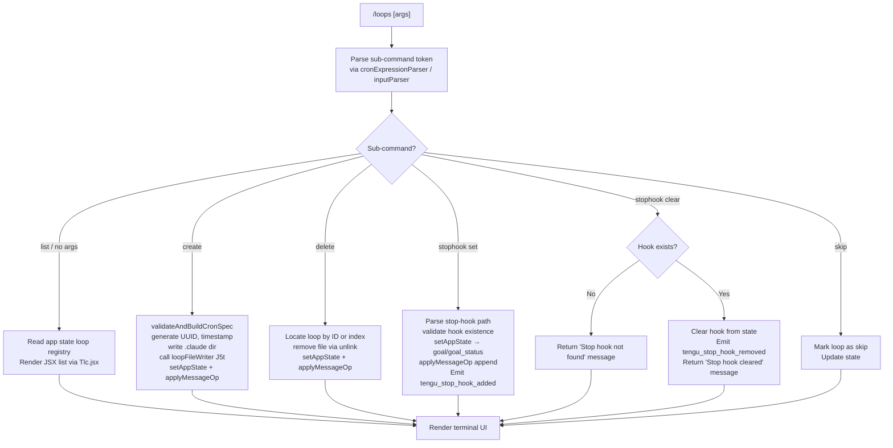

# `/loops`

> Analysis basis: CC v2.1.199 bundle.js (AST extraction + Claude interpretation)
> Minimum version: v2.1.199

---

## Overview

The `/loops` command provides a management interface for Claude Code's scheduled-loop (cron-like) automation feature. It allows users to list existing loops, create new ones with a schedule and stop-hook configuration, and delete loops they no longer need. The command renders a JSX UI directly in the terminal and is dispatched to an async handler (`wlm`) that reads app state, validates the loop registry, and applies structured message operations to persist changes.

---

## Registration

| Field | Value |
|---|---|
| type | `local-jsx` |
| name | `loops` |
| description | `List, create, and delete loops` |
| loc_byte | `13205754` |
| loc_byte_end | `13205911` |
| loc_line | `9839` |
| immediate | `true` |
| module_id | `blc` |
| load_inline | `true` |
| arbor_handler.name | `wlm` |
| arbor_handler.fqn | `claude-2.1.199::wlm` |
| arbor_handler.kind | `AsyncFunction` |
| arbor_handler.resolution_path | `module_id` |
| arbor_handler.n_hits | `0` |

Analysis basis: CC v2.1.199 bundle.js:+13205754

---

## Input Branching

The command handler `wlm` has at least five distinct top-level branches based on the sub-command keyword extracted from the user's input, plus a default list view. A Mermaid flowchart is required.



Analysis basis: CC v2.1.199 bundle.js:+13204719, +13204850, +13205006, +13205145, +13205271, +13205369, +13205457, +13205524

---

## Behavioral Spec

### 1. Entry Point — Main Handler (`wlm`)

The Arbor-resolved handler is `wlm` (AsyncFunction, FQN `claude-2.1.199::wlm`), reached via `module_id → blc`. It is the sole async entry point for `/loops`.

```
async function loopsCommandHandler(context):
    emit telemetry("tengu_loops_command")           // +13204721
    inputText = context.args.trim()
    appState  = context.getAppState()               // +13204771
    loopRegistry = buildLoopRegistry(appState)      // Vbt, +13204767
    parsedSchedule = parseCronExpression(inputText) // ZO,  +13204850

    subCmd = detectSubCommand(inputText)

    if subCmd == "create":
        return handleCreateLoop(context, parsedSchedule, appState)
    elif subCmd == "delete":
        return handleDeleteLoop(context, loopRegistry, appState)
    elif subCmd == "stophook":
        return handleStopHook(context, appState)
    elif subCmd == "skip":
        markLoopSkip(context)
    else:
        return renderLoopList(context, loopRegistry)
```

Analysis basis: CC v2.1.199 bundle.js:+13204719, +13204771, +13204787, +13204799

---

### 2. Loop Registry Builder (`Vbt`)

Reads the persistent loop state from app state and maps loop entries into a normalised in-memory list.

```
function buildLoopRegistry(appState):
    raw = appState.loopsMap                 // TNe → o.set, GCl → e.map  +11291109
    result = []
    for entry in raw.values():
        result.push(normaliseLoopEntry(entry))
    return result
```

Analysis basis: CC v2.1.199 bundle.js:+11291109, +11291233

---

### 3. Cron / Schedule Expression Parser (`ZO` + `vlm`)

Converts a human-readable or cron-syntax schedule string into a structured schedule object. Handles "Every minute" and "Every hour" named presets as well as numeric cron fields.

```
function parseCronExpression(rawInput):
    trimmed = rawInput.trim()                   // +5135186

    if trimmed matches "Every minute":          // literal +5135306
        return { type:"cron", expr:"* * * * *" }

    if trimmed matches "Every hour":            // literal +5135523
        return { type:"cron", expr:"0 * * * *" }

    // Numeric field parsing
    fields = trimmed.match(cronRegex)           // o.match +5135327
    minute = parseInt(fields[0])                // +5135362
    hour   = vlm_parseSubfields(fields)         // vlm +13205271
    day    = computeUTCDay(dateObj)             // g.getUTCDay +5136063
    ...
    adjustForTimezone(dateObj)                  // g.setUTCHours, g.setUTCDate

    return { type:"cron", minute, hour, day, ... }

function vlm_parseSubfields(rawExpr):
    match = rawExpr.match(rangePattern)         // e.match +13204307
    n     = parseInt(match)                     // +13204344
    n     = Math.max(n, 0)                      // +13204429
    n     = Math.ceil(n / divisor)              // +13204440
    n     = Math.round(n)                       // +13204513
    // Cron field limits: minute 0-59 (+13204486), hour 0-23 (+13204557), day 1-31 (+13204610)
    // Maximum minute value: 60  (bundle.js:+13204452)
    return parseInputTokens(n)                  // kU +13204677
```

Analysis basis: CC v2.1.199 bundle.js:+5135186, +5135327, +5135362, +13204307, +13204344, +13204429, +13204452, +13204486, +13204557, +13204610

Cron field constants (maximum values used as range guards):
- Minute upper bound: **60** (bundle.js:+13204452)
- Minute inclusive max: **59** (bundle.js:+13204486)
- Hour inclusive max: **23** (bundle.js:+13204557)
- Day-of-month inclusive max: **31** (bundle.js:+13204610)

---

### 4. Input Token Parser (`kU` + `ESp`)

Breaks the user's free-form argument string into typed tokens (schedule fields, loop names, flags).

```
function parseInputTokens(raw):
    trimmed = raw.trim()                        // +5134015
    // Minimum token length: 5 characters      // literal +5134051
    tokens = tokenizeExpression(trimmed)        // ESp +5134101
    result = []
    for tok in tokens:
        result.push(tok)                        // n.push +5134136
    return result

function tokenizeExpression(expr):
    parts  = expr.split(delimiter)             // e.split +5133435
    match  = parts.match(pattern)              // s.match +5133455
    n      = parseInt(match, 10)               // parseInt +5133500, base 10 +5133514
    rangeSet = new Set()
    rangeSet.add(n)                            // o.add +5133561
    // Range constants: step=3 +5133676, start=6 +5133712, end=7 +5133718
    return Array.from(rangeSet)                // +5133963
```

Analysis basis: CC v2.1.199 bundle.js:+5134015, +5134051, +5134101, +5133435, +5133455, +5133500

---

### 5. Existing-Loop Reader (`spe` → `$pt`)

Reads loop definition files from disk (UTF-8, `bundle.js:+5137442`) to reconstruct loop state before rendering or mutating.

```
async function readExistingLoops(context):
    configPath = resolveLoopConfigPath()        // rAe +5137425 → Z2n.join, ol
    raw = await fs.readFile(configPath, "utf-8")// t.readFile +5137414
    if not Array.isArray(raw):                  // +5137558
        return []
    parsed = parseLoopFileContents(raw)         // T +5137737
    filtered = filterByContext(parsed)          // xe +5137784, kU +5137806
    return filtered
```

File-not-found errors (`ENOENT`) and permission errors (`EACCES`, `EPERM`, `ENOTDIR`, `ELOOP`, `ENAMETOOLONG`, `EROFS`) are handled by the error-classification helper `ke` (bundle.js:+5137486). Errors are logged at level `"error"` via `fne.logError` (+875867).

Analysis basis: CC v2.1.199 bundle.js:+5139403, +5137395, +5137414, +5137425, +5137442, +5137558

---

### 6. Loop File Writer (`J5t`)

Persists a new loop definition to the `.claude` directory (literal `".claude"`, bundle.js:+5138583).

```
async function writeLoopFile(loopDefs, basePath):
    targetDir = path.join(basePath, ".claude")  // Z2n.join +5138572, literal +5138583
    await fs.mkdir(targetDir, { mode: 0o700 })  // Q2n.mkdir +5138562; mode 448 dec +18528707
    mapped = loopDefs.map(serialize)             // e.map +5138623
    await fs.writeFile(destPath, mapped)         // Q2n.writeFile +5138659
    configPath = resolveLoopConfigPath()         // rAe +5138673
    return configPath
```

Analysis basis: CC v2.1.199 bundle.js:+5138551, +5138562, +5138572, +5138583, +5138623, +5138659

---

### 7. Create Loop (`Bpt`)

Assembles a new loop record with a fresh UUID and current timestamp, then delegates to the file writer.

```
async function handleCreateLoop(context, schedule, appState):
    id        = crypto.randomUUID()             // cga.randomUUID +5138742
    createdAt = Date.now()                      // +5138804
    meta      = buildLoopMeta(schedule)         // HHe +5138850
    existing  = await readExistingLoops(context)// $pt +5138894
    existing.push(newLoopEntry(id, createdAt, meta, schedule))
                                                // a.push +5138907
    await writeLoopFile(existing, context.cwd)  // J5t +5139002
    notifyScheduler(context)                    // Qne +5138988, kt +5138939
```

Analysis basis: CC v2.1.199 bundle.js:+5138742, +5138804, +5138850, +5138894, +5138907, +5138988, +5139002

---

### 8. Stop-Hook Management (`Kbt` — set, `qbt` — delete)

**Setting a stop hook** (`Kbt`):

```
async function handleSetStopHook(context, hookPath):
    appState = context.getAppState()            // e.getAppState +11291913
    existing = buildLoopRegistry(appState)      // Vbt +11291909
    newId    = crypto.randomUUID()              // W$l → $$l.randomUUID +11292262
    op = {
        type: "append",                         // literal +11292134
        role: "attachment",                     // literal +11292244
        goalKind: "goal",                       // literal +11292202
    }
    context.applyMessageOp(op)                  // +11292111
    context.setAppState(updated)                // e.setAppState +11292042
    emit telemetry("tengu_stop_hook_added")     // +11291796
    return renderSuccess(context)               // V +11292166, qe +11292199
```

**Clearing a stop hook** (`qbt`):

```
async function handleClearStopHook(context):
    appState   = context.getAppState()          // t.getAppState +11291495
    hooksGate  = checkFeatureGate("hooks_gate") // literal +11291306, qBo +11291410
    trustGate  = checkFeatureGate("trust_gate") // literal +11291360
    goalStatus = appState.goalStatus            // literal "goal_status" +11292331

    if hookNotFound(appState):
        return message("Stop hook not found")   // literal +13205163

    timestamp  = Date.now()                     // +11291659
    outputTok  = countOutputTokens()            // cE → outputTokens +49321
    context.setAppState(cleared)                // t.setAppState +11291697
    context.applyMessageOp({ type:"append" })   // t.applyMessageOp +11291739
    emit telemetry("tengu_stop_hook_removed")   // +11292168
    return message("Stop hook cleared")         // literal +13205185
```

The string `"Stop hook set"` (literal, +13205481) is the success confirmation rendered after `handleSetStopHook` completes.

Analysis basis: CC v2.1.199 bundle.js:+11291909, +11292042, +11292111, +11292134, +11292168, +11291697, +11291739, +13205163, +13205185, +13205481

---

### 9. Daemon / Scheduler Interaction (`ZO` → `k`)

The scheduler supervisor loop uses `setInterval` / `clearInterval` and watches config files via `N.watch`. It manages background worker lifecycle (spawn, retire, respawn, SIGKILL escalation) which is triggered when loops are created or deleted.

```
function initSchedulerSupervisor(config):
    clearInterval(existingTimer)                // +17509800
    timer = setInterval(sweepCallback, interval)// +17509966
    watcher = fs.watch(configPath, onChange)    // N.watch +17510157

    function sweepCallback():
        for agent in workers.values():          // G.values +18533718
            agent.shiftGraceClocksForward()     // +18533729
            if agent.isIdleStale():
                agent.respawnIfIdleStale()      // +18533900
            if agent.isSettled():
                agent.retireIfSettled()         // +18533993
        if lowMemory():
            emit tengu_bg_retire_pinned_low_mem // +18534292
        prewarm(config)                         // tengu_bg_prewarm_per_sweep +18534417
```

Analysis basis: CC v2.1.199 bundle.js:+17509800, +17509966, +17510157, +18533718, +18533729, +18533900, +18533993

---

### 10. JSX Render (`Tlc.jsx`)

After all mutations, the handler returns a JSX element rendered inline in the terminal (type `local-jsx`, `immediate: true`). Column padding uses two-space separators (literal `"  "`, bundle.js:+18557995) and right-pads each column with `i.padEnd` (+18557974).

Analysis basis: CC v2.1.199 bundle.js:+13205524

---

## State & Side Effects

| Item | Detail |
|---|---|
| Telemetry: `tengu_loops_command` | Fired at handler entry (+13204721) |
| Telemetry: `tengu_stop_hook_added` | Fired after a stop hook is successfully registered (+11291796) |
| Telemetry: `tengu_stop_hook_removed` | Fired after a stop hook is cleared (+11292168) |
| Telemetry: `tengu_daemon_yield` | Fired when the daemon yields to a foreground/service daemon (+18551243) |
| Telemetry: `tengu_bg_retire_pinned_low_mem` | Fired during low-memory sweep when pinned workers are retired (+18534292) |
| Telemetry: `tengu_bg_prewarm_per_sweep` | Fired during scheduler sweep pre-warm cycle (+18534417) |
| Telemetry: `tengu_bg_dispatch_sigkill_escalate` | Fired when a SIGKILL is sent to a background worker (+18528964) |
| Telemetry: `tengu_bg_dispatch_low_mem` | Fired during low-memory background dispatch (+18529670) |
| Telemetry: `tengu_bg_spare_enable` | Fired when a spare background slot is enabled (+18530360) |
| Telemetry: `tengu_bg_spare_claim` | Fired when a spare slot is claimed (+18530488) |
| Telemetry: `tengu_bg_spare_claim_fail` | Fired when claiming a spare slot fails (+18530754) |
| Telemetry: `tengu_feature_ok` | Feature gate success (+1039941) |
| Telemetry: `tengu_feature_bad` | Feature gate failure (+1040008) |
| Telemetry: `tengu_feature_sad` | Feature gate error (+1040089) |
| Telemetry: `tengu_daemon_control` | Daemon control operation (+18569105) |
| appState changes | `setAppState` / `applyMessageOp` called on create, stop-hook set, and stop-hook clear |
| File system writes | New loop definition written to `.claude/` directory via `Q2n.writeFile`; directory created with mode `0o700` (448 decimal) |
| File system deletes | Loop file removed via `Dae.unlink` (delete sub-command) or `Lin` (scheduler retirement) |
| Scheduler | `setInterval` / `clearInterval` managed by supervisor; file watcher on loop config |
| Hook registration | Stop-hook paths stored as `"stophook"` role in app state; cleared via `"Stop hook cleared"` message |
| Sound | <!-- TODO: not found in depth-2 traversal; needs --depth 4 --> |

---

## Version History

| Version | Change |
|---|---|
| v2.1.199 | Initial analysis |

---

## Common Mistakes

1. **Omitting the schedule argument on create**: The parser (`ZO` / `vlm`) requires a recognisable cron expression or named preset ("Every minute", "Every hour"). Passing a bare loop name without a schedule will cause the input to fall through to the list branch instead of creating a new loop.
2. **Referencing a non-existent stop hook**: Attempting to clear a stop hook that was never set returns `"Stop hook not found"` and does not modify state. Always verify the hook exists with `/loops list` first.
3. **Assuming synchronous execution**: `wlm` is an `AsyncFunction`. In scripts or automated pipelines, callers must await the result; the JSX render and file writes may not be complete before the promise settles.
4. **Manual edits to `.claude/` loop files**: The loop file writer (`J5t`) controls the schema. Hand-editing files in `.claude/` may produce entries that fail the `Array.isArray` guard in the reader (`$pt`, +5137558) and silently return an empty registry.
5. **Confusing `skip` with `delete`**: The `skip` sub-command marks a loop to be skipped on the next scheduled run but does not remove it. Use `delete` to permanently remove a loop entry.

---

## Appendix — Identifier Mapping

> For bundle debugging only. Identifiers change across versions.

| Identifier | Role |
|---|---|
| `wlm` | Main async handler for `/loops` command (Arbor FQN: `claude-2.1.199::wlm`) |
| `V` | Generic value/render utility called at entry (+13204719) |
| `spe` | Existing-loop reader orchestrator (wraps `$pt`) |
| `$pt` | Core loop file reader (reads UTF-8, validates array) |
| `zt` | Path resolution helper inside file reader |
| `rAe` | Loop config path resolver (uses `Z2n.join` + `ol`) |
| `ol` | Base path lookup utility (calls `Aw`) |
| `Mo` | Error classifier wrapper (calls `rn`) |
| `rn` | Low-level error classification |
| `ke` | File-error handler (ENOENT/EACCES/etc., logs via `fne.logError`) |
| `sr` | Error string builder |
| `at` | String coercion helper |
| `Pi` | Essential-traffic gate (uses `KTs`) |
| `Gku` | Queue shift/push manager |
| `T` | Output writer / terminal render helper |
| `gdu` | Debug render sub-helper |
| `xe` | JSON serializer wrapper |
| `Nc` | Path/string sanitiser (redacts sensitive segments) |
| `ntt` | Notification/output helper |
| `Sdu` | Process-exit / sub-process orchestrator |
| `kU` | Input token parser (trims, delegates to `ESp`) |
| `ESp` | Cron expression tokenizer (split, match, parseInt) |
| `QC` | Secondary render helper (calls `Aw`) |
| `Aw` | Base render/write primitive |
| `Vbt` | Loop registry builder (maps app state to list) |
| `TNe` | Registry map setter (calls `GCl`) |
| `GCl` | Entry mapper (e.map over raw loop data) |
| `kt` | Notification / scheduler-ping utility |
| `ZO` | Cron / schedule expression parser |
| `yV` | Path normaliser (handles Windows paths, `IN.normalize`) |
| `qAr` | String prefix stripper / replacer |
| `k` | Scheduler supervisor (setInterval, file watcher, worker lifecycle) |
| `Eos` | Loop execution engine (writeFile, unlink, Date.now) |
| `Lin` | Loop retirement handler (unlink, notify) |
| `D` | Daemon writer (transient/supervisor mode) |
| `N` | File-watch callback / sweep handler |
| `I` | Key-event handler (Math.max/floor, preventDefault) |
| `h` | Background worker slot manager (spawn, kill, mkdir, writeFile) |
| `p` | Process-exit orchestrator |
| `EI` | Exit signal helper |
| `u` | Abort / daemon-stop controller |
| `Le` | Daemon stop success handler |
| `we` | Daemon stop failure handler |
| `n2` | Daemon stop registration helper |
| `w8` | Promise race/all shutdown helper |
| `l` | Session/daemon status reader (Wfc) |
| `Wfc` | Daemon status file reader (reads `daemon.status.json`) |
| `Qne` | Async notification helper |
| `Qs` | Storage context accessor (`EId.getStore`) |
| `Bnn` | Daemon status path builder |
| `g` | UTC date arithmetic object |
| `ope` | Loop filter/match orchestrator |
| `lY` | Loop existence checker (`t.has`) |
| `J5t` | Loop file writer (mkdir + writeFile to `.claude/`) |
| `Kbt` | Stop-hook set handler |
| `W$l` | UUID generator wrapper |
| `qe` | Post-operation render trigger |
| `GZe` | Base render primitive |
| `vlm` | Cron sub-field parser (parseInt, Math.max/ceil/round) |
| `Bpt` | Create-loop handler (UUID, Date.now, writeLoopFile) |
| `HHe` | Loop metadata builder |
| `a` | Request/response payload builder |
| `Whe` | JSON.stringify wrapper for payloads |
| `qbt` | Stop-hook clear handler |
| `qBo` | Feature-gate orchestrator |
| `w9` | Policy settings reader |
| `kn` | Policy/trust resolver |
| `$ue` | Trust resolver sub-helper |
| `Hr` | Hooks-gate check result handler |
| `Ad` | Trust-gate check result handler |
| `VTm` | Path validation helper |
| `Et` | Goal-set success render helper |
| `Pe` | Render base helper (calls `GZe`) |
| `cE` | Output-token counter helper |

---

Note: index built via Arbor fallback; some signals (telemetry, literals) may be missing — see arbor-fallback.js.