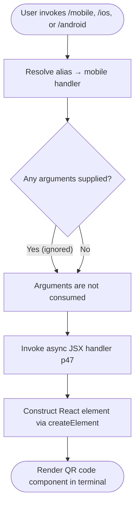

# `/mobile`

> Analysis basis: CC v2.1.132 bundle.js (AST extraction + Claude interpretation)
> Minimum version: v2.1.132

---

## Overview

The `/mobile` command renders a QR code inside the Claude Code CLI terminal, allowing the user to quickly navigate to the Claude mobile app download page by scanning the code with their phone. It is a purely presentational, read-only command implemented as an inline `local-jsx` handler that produces a React element tree — no agent prompt is dispatched and no state mutation occurs.

---

## Registration

| Field | Value |
|---|---|
| type | `local-jsx` |
| name | `mobile` |
| description | `Show QR code to download the Claude mobile app` |
| aliases | `ios`, `android` |
| module\_id | `F1q` |
| load\_inline | `true` |
| handler identifier | `p47` (resolved via `module_id` path) |
| loc\_byte span | `10729853 – 10730041` |
| loc\_line | `6444` |
| `loc_byte_end` | `10730041` |
| `arbor_handler.name` | `p47` |
| `arbor_handler.kind` | `AsyncFunction` |
| `arbor_handler.resolution_path` | `module_id` |
| `arbor_handler.fqn` | `claude-2.1.132::p47` |
| `arbor_handler.n_hits` | `0` |

Analysis basis: CC v2.1.132 bundle.js:+10729853

**Alias note.** The command is reachable as `/mobile`, `/ios`, or `/android`; all three aliases share the same handler. This design reflects the command's intent of covering both major mobile platforms without requiring separate implementations.

---

## Input Branching

The command accepts no user-supplied arguments. The handler is invoked directly upon command dispatch and always follows a single execution path.



Analysis basis: CC v2.1.132 bundle.js:+10729497

---

## Behavioral Spec

### QR Code Rendering

The handler is an `AsyncFunction` (`p47`) that constructs and returns a React element. The `local-jsx` command type means the CLI's command dispatcher calls the handler, receives the element, and mounts it directly into the terminal UI rather than forwarding any text to the language model.

```
async function renderMobileQrCode(commandContext):
    element = createElement(QrCodeComponent, props)
    return element
```

Because the call graph (depth ≤ 2) contains a single edge — from the handler to `createElement` — the entire visible behavior is the construction of that element. No secondary calls (network requests, file I/O, agent invocations) are reachable at the analysed depth.

Analysis basis: CC v2.1.132 bundle.js:+10729497

### Alias Resolution

The `aliases` field registers `ios` and `android` as equivalent entry points. The CLI command registry resolves any of the three names to the same handler before invocation; no branching logic exists inside the handler itself to differentiate which alias was used.

```
function resolveCommand(inputName):
    if inputName in ["mobile", "ios", "android"]:
        return handler_p47
    else:
        return null   # not this command's concern
```

Analysis basis: CC v2.1.132 bundle.js:+10729853

### No Prompt Dispatch

The registration type is `local-jsx`, not `prompt`. Consequently, no prompt body is ever composed or sent to the Claude model. The command is entirely self-contained within the CLI rendering layer.

<!-- TODO: QrCodeComponent props (target URL, size, error-correction level) not found in depth-2 traversal; needs --depth 4 -->

---

## State & Side Effects

| Item | Detail |
|---|---|
| Telemetry | None detected at depth ≤ 2 |
| Agent / LLM invocation | None — `local-jsx` type; no prompt dispatched |
| Hook registration | None detected at depth ≤ 2 |
| appState changes | None detected at depth ≤ 2 |
| File I/O | None detected at depth ≤ 2 |
| Network requests | None detected at depth ≤ 2 |
| Sound | None detected at depth ≤ 2 |
| Terminal output | React element rendered inline in the CLI UI (QR code display) |

---

## Version History

| Version | Change |
|---|---|
| v2.1.132 | Initial analysis — `local-jsx` handler `p47`, aliases `ios` / `android`, single `createElement` call |

---

## Common Mistakes

1. **Expecting model output.** Because the command type is `local-jsx`, no message is sent to Claude. Users who expect a text response or a URL printed as plain text will instead see only the rendered QR code component.
2. **Passing arguments.** The handler accepts no arguments. Any text typed after `/mobile`, `/ios`, or `/android` is silently ignored; it is not forwarded to a model or interpreted as a URL target.
3. **Assuming alias differences.** `/ios` and `/android` are pure aliases — they are not filtered to platform-specific download URLs at the handler level (at least not at depth ≤ 2). Both aliases invoke the identical render path as `/mobile`.
4. **Using the command in non-interactive / pipe mode.** A `local-jsx` command requires an active terminal UI context to mount the React element. Invoking it in a headless or piped session may produce no visible output or an error from the rendering layer.

---

## Appendix — Identifier Mapping

> For bundle debugging only. Identifiers change across versions.

| Identifier | Role |
|---|---|
| `p47` | Async JSX handler for the `/mobile` command; constructs and returns the QR code React element (module `F1q`, resolved via `module_id` path) |