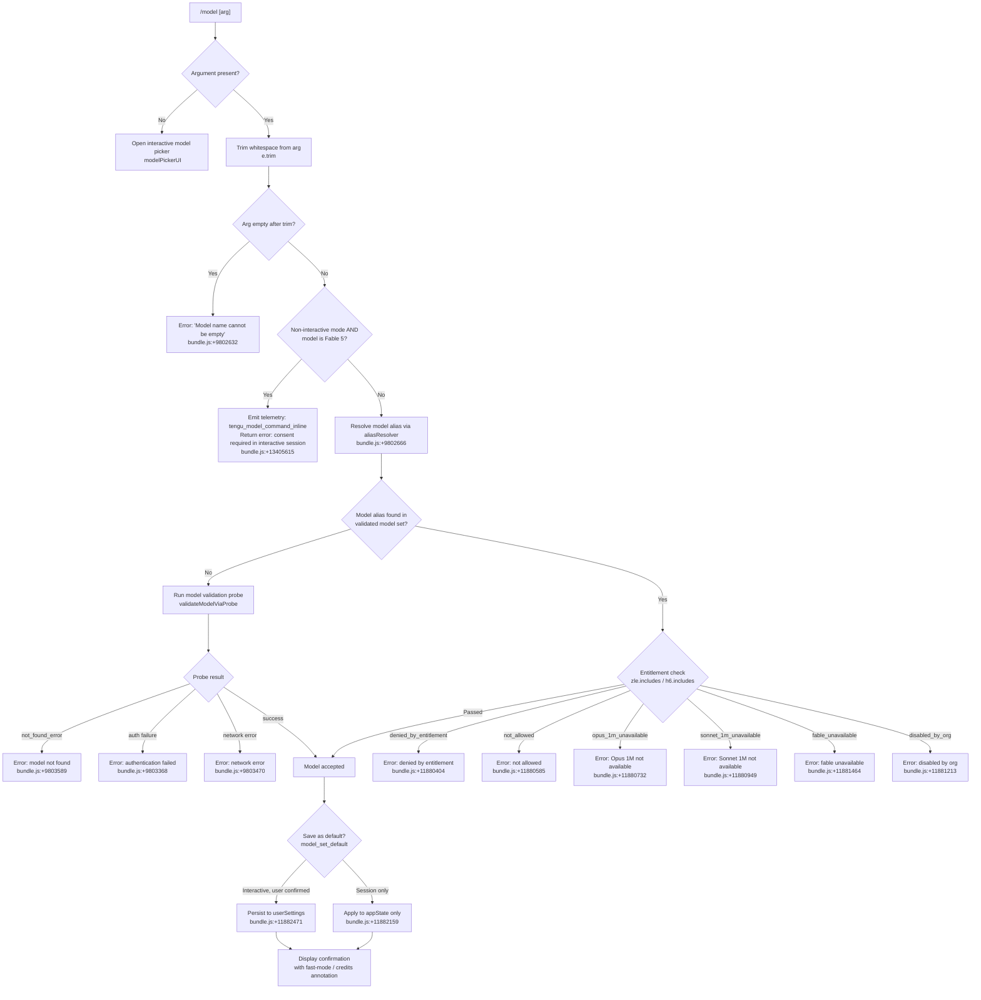

# `/model`

> Analysis basis: CC v2.1.199 bundle.js (AST extraction + Claude interpretation)
> Minimum version: v2.1.199

---

## Overview

The `/model` command allows users to set or switch the active AI model used by Claude Code within the current session. When invoked with a model name argument, it validates the requested model against a known set of aliases and canonical model identifiers, checks entitlements and organization-level policy, applies consent gating for certain premium models (such as Fable 5), and then updates the session and optionally persists the selection as the user default. When invoked with no argument (interactive mode), it opens a model-picker interface allowing the user to browse and select from available models.

---

## Registration

| Field | Value |
|---|---|
| type | `local` |
| name | `model` |
| description | `Set the AI model for Claude Code` |
| argumentHint | `<model>` |
| supportsNonInteractive | `true` |
| module_id | `lpc` |
| load_inline | `true` |
| loc_byte | `13419847` |
| loc_byte_end | `13420021` |
| loc_line | `9961` |
| arbor_handler.name | `Kdm` |
| arbor_handler.fqn | `claude-2.1.199::Kdm` |
| arbor_handler.kind | `AsyncFunction` |
| arbor_handler.resolution_path | `module_id` |
| arbor_handler.n_hits | `0` |

Analysis basis: CC v2.1.199 bundle.js:+13419847

---

## Input Branching

Four or more distinct branches exist: empty input (interactive picker), non-interactive with Fable/consent gate, entitlement denial, and successful model resolution. A Mermaid flowchart is used.



---

## Behavioral Spec

### Handler Entry Point — `modelCommandHandler` (bundle identifier: `Kdm`)

The handler is an `AsyncFunction` resolved via `module_id → lpc` (Arbor resolution path: `module_id`).

Analysis basis: CC v2.1.199 bundle.js:+13405465

```
async function modelCommandHandler(arg, context):
    input = arg.trim()                         # bundle.js:+13405465

    # Non-interactive Fable 5 consent gate
    if isNonInteractive(context) AND isFableModel(input):
        emitTelemetry("tengu_model_command_inline")  # bundle.js:+13405615
        return errorResult(
            "Fable 5 uses usage credits and needs a one-time consent"
            + " · pick Fable from /model in an interactive session to set it up"
        )                                      # bundle.js:+13405845

    # Entitlement check using known model sets
    if knownModelSet.includes(input):          # bundle.js:+13405481
        entitlementResult = checkEntitlement(input, context)
        if entitlementResult != PASS:
            return entitlementError(entitlementResult)

    appState = context.getAppState()           # bundle.js:+13405504

    # Run interactive model selector or inline resolution
    if input is empty:
        return launchModelPicker(appState)     # via xar → gM

    resolvedModel = resolveModelAlias(input)   # via XZt → qYt → za
    if resolvedModel is None:
        probeResult = validateModelViaProbe(input)  # via qYt → uF
        if probeResult.error:
            return probeError(probeResult)

    # Compute a short hash for the model id for telemetry
    modelHash = computeModelHash(resolvedModel)  # via Lu → PGi.createHash sha256, 12 chars
                                               # bundle.js:+3448525, +3448567

    # Apply model to session
    applyModelToSession(resolvedModel, appState)  # via bee → G6t → gpe/Ofo

    # Persist if interactive and user wants default
    if userWantsDefault(context):
        persistToUserSettings("model", resolvedModel)  # bundle.js:+11882471
        displayMessage(resolvedModel + " and saved as your default for new sessions")
                                               # bundle.js:+11882113
    else:
        displayMessage(resolvedModel + " for this session only")
                                               # bundle.js:+11882159

    # Annotate fast-mode or credits state
    if fastModeActive(resolvedModel):
        appendMessage(" · Fast mode ON")       # bundle.js:+11882277
        appendMessage(" · Draws from usage credits")  # bundle.js:+11882328
    else:
        appendMessage(" · Fast mode OFF")      # bundle.js:+11882374
```

---

### Model Alias Resolution — `resolveModelAlias` (bundle identifier: `qYt`)

Converts short user-facing aliases to canonical API model identifiers. Called from within the main handler flow via `XZt`.

Analysis basis: CC v2.1.199 bundle.js:+9802595

```
function resolveModelAlias(rawInput):
    input = rawInput.trim()                    # bundle.js:+9802595
    if input is empty:
        return errorResult("Model name cannot be empty")  # bundle.js:+9802632

    normalized = input.toLowerCase()           # bundle.js:+9802780

    # Tier-shorthand aliases (opusplan, sonnet, haiku, opus, best)
    if normalized in SPECIAL_ALIASES:          # bundle.js:+2347752..2347978
        return expandSpecialAlias(normalized)

    # Known 1M-context aliases
    if normalized in ["sonnet[1m]", "sonnet-4-6[1m]", "sonnet-5[1m]"]:
                                               # bundle.js:+11883597..11883653
        return expand1MAlias(normalized)

    # Version-numbered short forms
    # e.g. fable-5, opus-4-8, sonnet-5, sonnet-4-6, haiku-4-5, etc.
    aliasMap = {
        "fable-5"    : "claude-fable-5",       # bundle.js:+9803950
        "fable_5"    : "claude-fable-5",
        "opus-4-8"   : "claude-opus-4-8",      # bundle.js:+9804050
        "opus_4_8"   : "claude-opus-4-8",
        "opus-4-7"   : "claude-opus-4-7",      # bundle.js:+9804119
        "opus_4_7"   : "claude-opus-4-7",
        "opus-4-6"   : "claude-opus-4-6",      # bundle.js:+9804188
        "opus_4_6"   : "claude-opus-4-6",
        "opus-4-5"   : "claude-opus-4-5",      # bundle.js:+9804257
        "opus_4_5"   : "claude-opus-4-5",
        "sonnet-5"   : "claude-sonnet-5",      # bundle.js:+9804326
        "sonnet_5"   : "claude-sonnet-5",
        "sonnet-4-6" : "claude-sonnet-4-6",    # bundle.js:+9804397
        "sonnet_4_6" : "claude-sonnet-4-6",
        "sonnet-4-5" : "claude-sonnet-4-5",    # bundle.js:+9804472
        "sonnet_4_5" : "claude-sonnet-4-5",
        ...
    }

    if normalized in aliasMap:
        return aliasMap[normalized]

    # If already prefixed with "claude-", pass through
    if normalized.startsWith("claude-"):       # bundle.js:+2337531
        return normalized

    # Otherwise: validate via API probe
    if COo.has(normalized):                    # bundle.js:+9802901 (dedup cache)
        return cachedResult(normalized)
    COo.set(normalized, ...)                   # bundle.js:+9803109

    return validateModelViaProbe(normalized)   # uF
```

---

### Model Validation Probe — `validateModelViaProbe` (bundle identifier: `uF`)

Sends a lightweight side-query API call to verify the model exists and is accessible to the account.

Analysis basis: CC v2.1.199 bundle.js:+9327189

```
async function validateModelViaProbe(modelId):
    # Build a minimal side-query request
    request = buildSideQuery(modelId, queryType="model_validation")
                                               # bundle.js:+9802996

    try:
        response = await apiClient.send(request,
            headers={"x-app": "cli"},          # bundle.js:+3080043
            timeout=10000                       # bundle.js:+2404656
        )

        # Map error types to user-facing messages
        if response.error.type == "not_found_error":
            return error("model:" + modelId)   # bundle.js:+9803589, +9803671
        if response.error is AuthError:
            return error("Authentication failed. Please check your API credentials.")
                                               # bundle.js:+9803368
        if response.error is NetworkError:
            return error("Network error. Please check your internet connection.")
                                               # bundle.js:+9803470

        # Cache result for dedup
        storeValidationResult(modelId, response)  # COo cache

        return success(modelId)

    catch error:
        emitTelemetry("validate_exception")    # bundle.js:+11881856
        return error(error.message)
```

---

### Known Canonical Model List

The following canonical model identifiers are present in the bundle's literal set. These represent the full set of models recognized without an API probe.

Analysis basis: CC v2.1.199 bundle.js:+2344708 – +2345902

| Canonical Identifier | loc_byte |
|---|---|
| `claude-fable-5` | 2344708 |
| `claude-mythos-5` | 2344763 |
| `claude-opus-4-8` | 2344820 |
| `claude-opus-4-7` | 2344877 |
| `claude-opus-4-6` | 2344934 |
| `claude-opus-4-5` | 2344991 |
| `claude-opus-4-1` | 2345048 |
| `claude-opus-4-0` | 2345137 |
| `claude-sonnet-5` | 2345169 |
| `claude-sonnet-4-6` | 2345226 |
| `claude-sonnet-4-5` | 2345287 |
| `claude-sonnet-4-0` | 2345382 |
| `claude-haiku-4-5` | 2345416 |
| `claude-3-7-sonnet` | 2345475 |
| `claude-3-5-sonnet` | 2345536 |
| `claude-3-5-haiku` | 2345597 |
| `claude-3-opus` | 2345656 |
| `claude-3-sonnet` | 2345709 |
| `claude-3-haiku` | 2345766 |
| `application-inference-profile` | 2345902 |

---

### Short-Alias Expansion — `shortAliasExpander` (bundle identifier: `Bo`)

Expands tier-shorthand aliases to canonical model identifiers, including the special `opusplan` alias.

Analysis basis: CC v2.1.199 bundle.js:+2347675

```
function shortAliasExpander(alias, context):
    normalized = alias.trim().toLowerCase()    # bundle.js:+2347675, +2347686

    switch normalized:
        case "opusplan":                       # bundle.js:+2346637
            # "Opus in plan mode, else Sonnet" # bundle.js:+2346654
            return resolveOpusPlanModel(context)

        case "fable":                          # bundle.js:+2347752
            return resolveCanonical("claude-fable-5")

        case "sonnet":                         # bundle.js:+2347861
            return resolveCanonical(currentSonnetDefault)

        case "haiku":                          # bundle.js:+2347901
            return resolveCanonical(currentHaikuDefault)

        case "opus":                           # bundle.js:+2347940
            return resolveCanonical(currentOpusDefault)

        case "best":                           # bundle.js:+2347978
            return resolveCanonical(currentBestDefault)

        default:
            return null  # caller falls through to probe
```

---

### Entitlement & Availability Checks — `entitlementChecker` (bundle identifier: `XZt`)

Performs multiple entitlement checks after alias resolution. Each check may yield a distinct error code.

Analysis basis: CC v2.1.199 bundle.js:+11880367

```
function entitlementChecker(resolvedModel, appState):

    # 1. Model-switch guard
    if not isModelSwitchAllowed(appState):     # bundle.js:+11880389
        return {code: "model_switch", denied: true}

    # 2. Entitlement set membership
    if entitlementDenied(resolvedModel):       # bundle.js:+11880404
        return {code: "denied_by_entitlement"}

    # 3. Blanket not-allowed
    if modelIsNotAllowed(resolvedModel):       # bundle.js:+11880585
        return {code: "not_allowed"}

    # 4. Opus 1M context availability
    if is1MOpusModel(resolvedModel):           # bundle.js:+11880700
        if not account.has1MOpus:
            return {
                code: "opus_1m_unavailable",   # bundle.js:+11880732
                message: "Opus with 1M context is not available for your account..."
            }

    # 5. Sonnet 1M context availability
    if is1MSonnetModel(resolvedModel):         # bundle.js:+11880917
        if not account.has1MSonnet:
            return {
                code: "sonnet_1m_unavailable", # bundle.js:+11880949
                message: "Sonnet with 1M context is not available for your account..."
            }

    # 6. Fable availability / probe
    if isFableModel(resolvedModel):
        probeResult = probeFableAccess()       # bundle.js:+11881464
        if probeResult == "unavailable":
            return {code: "fable_unavailable"}
        if probeResult == "probe_failed":
            return {code: "fable_probe_failed"}# bundle.js:+11881484

    # 7. Org-level disable
    if orgDisabledModel(resolvedModel):        # bundle.js:+11881213
        return {code: "disabled_by_org"}

    # 8. Invalid model (post-probe failure)
    if modelFailedValidation(resolvedModel):   # bundle.js:+11881759
        return {code: "invalid_model"}

    return PASS
```

---

### Model Persistence & Display — `modelApplyAndDisplay` (bundle identifier: `Lar`)

After successful validation and entitlement checks, applies the model to the session state and renders the confirmation message.

Analysis basis: CC v2.1.199 bundle.js:+11881960

```
function modelApplyAndDisplay(resolvedModel, appState, context):

    # Determine persistence scope
    if userHasDefaultSetting(context):         # JZt → Qo → Hf, bundle.js:+11882431
        persistSetting("userSettings", "model", resolvedModel)
                                               # bundle.js:+11882518, +11882434
        scope = " and saved as your default for new sessions"
                                               # bundle.js:+11882113
        emitTelemetry("model_set_default")     # bundle.js:+11882471
    else:
        scope = " for this session only"       # bundle.js:+11882159

    # Apply to live appState
    appState.model = resolvedModel             # via bee → G6t

    # Build display line
    displayLine = bold(resolvedModel) + scope  # St.bold, bundle.js:+11882094

    # Fast-mode annotation
    if isFastMode(resolvedModel):              # Sg → fast_mode, bundle.js:+2312782
        displayLine += " · Fast mode ON"       # bundle.js:+11882277
        displayLine += " · Draws from usage credits"  # bundle.js:+11882328
    else:
        displayLine += " · Fast mode OFF"      # bundle.js:+11882374

    # Fable credits notice
    if isFableModel(resolvedModel):
        displayLine += " · Draws from usage credits"

    # Managed settings display
    if managedSettingsActive():                # h5o → Lne, bundle.js:+11882514
        appendLine("Managed settings")         # bundle.js:+11883289

    output(displayLine)
```

---

### Interactive Model Picker — `modelPickerUI` (bundle identifier: `xar → gM`)

When `/model` is invoked with no argument, the interactive picker is launched.

Analysis basis: CC v2.1.199 bundle.js:+13405548, +11883940

```
function modelPickerUI(appState):
    # Build list of available models with metadata
    availableModels = buildModelList(appState)  # gM → qNt → Fp

    # Display model picker with categories
    # Categories observed in literals: sonnet, haiku, opus, fable, best, opusplan
    # Tier labels: mantle (bundle.js:+2336655)
    # Status labels: refused, inactive, active (bundle.js:+2336889..2336969)

    selectedModel = showPickerUI(availableModels)

    if selectedModel is not None:
        return modelApplyAndDisplay(selectedModel, appState)
    else:
        return cancelled()
```

---

### Model Hash Computation — `modelHashComputer` (bundle identifier: `Lu`)

Computes a short SHA-256 hash of the model identifier for telemetry purposes.

Analysis basis: CC v2.1.199 bundle.js:+3448507

```
function modelHashComputer(modelId):
    hash = crypto.createHash("sha256")         # bundle.js:+3448525
    hash.update(modelId)
    digest = hash.digest("hex")                # bundle.js:+3448552
    return digest.slice(0, 12)                 # bundle.js:+3448567
```

---

## State & Side Effects

| Item | Detail |
|---|---|
| Telemetry: `tengu_model_command_inline` | Fired when `/model <fable>` is invoked in non-interactive mode (consent gate hit). bundle.js:+13405615 |
| Telemetry: `tengu_feature_bad` | Fired on feature failure path. bundle.js:+1040008 |
| Telemetry: `tengu_feature_sad` | Fired on feature degraded path. bundle.js:+1040089 |
| Telemetry: `tengu_feature_ok` | Fired on feature success path. bundle.js:+1039941 |
| Telemetry: `tengu_api_success` | Fired on successful API validation probe. bundle.js:+9328907 |
| Telemetry: `tengu_lone_surrogate_sanitized` | Fired if surrogate characters are stripped from model input. bundle.js:+9328603 |
| Telemetry: `tengu_client_data_cache_key` | Fired during client data cache operations in model bootstrap. bundle.js:+9021383 |
| Telemetry: `tengu_config_auth_loss_prevented` | Fired if auth-loss guard triggers during config save. bundle.js:+14381449 |
| Telemetry: `tengu_prompt_cache_1h_config` | Fired when 1h prompt cache configuration is applied. bundle.js:+14117851 |
| Telemetry: `tengu_saffron_credits_only_tiers` | Fired for credits-only tier entitlement checks. bundle.js:+5326881 |
| Telemetry: `tengu_bg_dispatch_sigkill_escalate` | Background dispatch SIGKILL escalation (indirect, via daemon). bundle.js:+18528964 |
| Telemetry: `tengu_bg_dispatch_low_mem` | Background dispatch low-memory event. bundle.js:+18529670 |
| Telemetry: `tengu_bg_spare_enable` | Background spare session enabled. bundle.js:+18530360 |
| Telemetry: `tengu_bg_spare_claim` | Background spare session claimed. bundle.js:+18530488 |
| Telemetry: `tengu_bg_spare_claim_fail` | Background spare session claim failed. bundle.js:+18530754 |
| appState changes | `appState.model` is updated to the resolved canonical model identifier. |
| Settings persistence | When user confirms default: `userSettings["model"]` is updated (settings.json). bundle.js:+11882518, +1349828 |
| Settings persistence | Project-scope: `projectSettings` and `localSettings` (settings.local.json) are also available scopes. bundle.js:+11882534, +11882557, +1349890 |
| Hook registration | No dedicated hook registration found in depth-2 traversal. |
| Sound | No sound emission found in depth-2 traversal. |
| Dedup cache | `COo` Map caches model validation results to avoid repeated probe calls. bundle.js:+9802901 |
| Model hash | 12-character SHA-256 prefix of model ID computed for telemetry. bundle.js:+3448567 |

---

## Version History

| Version | Change |
|---|---|
| v2.1.199 | Initial analysis. Handler `Kdm` in module `lpc`. Fable 5 consent gate, 1M-context availability checks, org-level disable, model alias map including `fable-5`, `opus-4-8`, `sonnet-5`, `sonnet-4-6`, and others. |

---

## Common Mistakes

1. **Passing an empty argument**: Running `/model ` (with only whitespace) triggers the "Model name cannot be empty" error (bundle.js:+9802632) rather than opening the interactive picker. The empty-check is applied after `trim()`, so trailing spaces do not count as a model name.

2. **Using Fable 5 in non-interactive / headless mode**: When `--print` or other non-interactive flags are active, the command will refuse to set Fable 5 and instead emit a consent-gate error instructing the user to select it interactively first (bundle.js:+13405845).

3. **Assuming short aliases are case-sensitive**: The alias resolver normalizes input via `.toLowerCase()` before lookup (bundle.js:+9802780). `Sonnet`, `SONNET`, and `sonnet` all resolve identically.

4. **Expecting an immediate API model switch for unknown identifiers**: Models not in the built-in canonical list are validated via a live side-query API probe. This introduces network latency and can fail with auth or network errors even if the model identifier is syntactically correct.

5. **Expecting `/model` to persist across machines**: The default-save writes to `userSettings` (the local `settings.json` file, bundle.js:+1349828). It is not synchronized across machines or workspaces unless the file is shared externally.

6. **Ignoring entitlement checks**: Even if a model identifier is canonical and spelled correctly, org-level disable (`disabled_by_org`), seat-tier restrictions, or 1M-context unavailability may still block the selection with a specific error code rather than a generic failure.

---

## Appendix — Identifier Mapping

> For bundle debugging only. Identifiers change across versions.

| Identifier | Role |
|---|---|
| `Kdm` | Main handler (`modelCommandHandler`) — AsyncFunction entry point for `/model` |
| `xar` | Interactive model picker launcher — dispatches to `gM` |
| `gM` | Model list builder — calls `qNt` (available model fetcher) and `fv` (model formatter) |
| `qNt` | Available-model fetcher — calls `Fp` (model record builder) and `Bo` (alias expander) |
| `Fp` | Model record builder — assembles per-model metadata objects |
| `Bo` | Short-alias expander — maps `sonnet`, `haiku`, `opus`, `fable`, `best`, `opusplan` to canonical IDs |
| `fv` | Model list formatter — calls `K6`, `kgi`, `UWr`, `VNt`, `jNt` |
| `TIr` | Model tier resolver (called from formatter) |
| `K6` | Model tier key builder — calls `Nce`, `kgi` |
| `kgi` | Model availability categorizer — calls `VNt`, `jNt`, `sye` |
| `UWr` | Model display record assembler |
| `VNt` | Model validation/normalization pipeline — canonical model set lookup |
| `jNt` | Model list sorter / ordering logic |
| `V` | Config/version constant provider |
| `Lu` | Model hash computer — SHA-256 12-char prefix |
| `Zf` | Crypto utility wrapper |
| `GZe` | Global environment accessor |
| `XZt` | Entitlement & availability checker |
| `qne` | Model name normalizer / whitespace cleaner |
| `Zi` | String replace/sanitizer utility |
| `Uw` | Model type classifier |
| `io` | Model identity resolver |
| `Rst` | Model entry lookup by id |
| `h_` | Model ID normalizer with prefix handling |
| `P0t` | Model property accessor |
| `qu` | String replace utility |
| `VV` | Model alias/variant table builder |
| `gr` | Generic renderer/output formatter |
| `Vm` | Output formatting primitive |
| `at` | String coercion helper |
| `Bwd` | Model set updater |
| `$wd` | Model set entry builder |
| `UNt` | Async model config loader |
| `Mt` | Global config accessor |
| `we` | Config writer/persister |
| `Pe` | Config path resolver |
| `za` | Full model resolution pipeline (alias + probe + entitlement) |
| `mOt` | Remote model settings fetcher |
| `OOs` | Settings filter utility |
| `POs` | Policy settings builder |
| `gOt` | Model settings aggregator |
| `jps` | Policy settings merger |
| `fce` | Feature-check utility |
| `fyn` | Feature-name normalizer |
| `OLe` | Remote settings entry loader |
| `t9` | Settings entry constructor |
| `pce` | Policy constraint evaluator |
| `dOt` | Default settings composer |
| `Vps` | Validated policy settings emitter |
| `r` | Data chunk handler / stream segment |
| `Ts` | Process exit handler |
| `l` | Session logger |
| `Wfc` | Session log writer |
| `o` | Output padder / display row builder |
| `s` | Request lifecycle manager (add/delete/finally) |
| `i` | Connection handler (close/stream) |
| `VN` | Supported-ID membership checker |
| `uvn` | Alias-variant unifier |
| `NNt` | Model name case/prefix normalizer |
| `wgi` | Settings entry iterator |
| `kn` | Settings scope resolver |
| `iyn` | Policy settings path builder |
| `vgi` | Variant index searcher |
| `n` | String lowercaser |
| `Gwd` | Model group/category classifier |
| `kWr` | Group index finder |
| `Wwd` | Model-within-group membership checker |
| `Cgi` | Prefix presence checker |
| `H5o` | Opus-1M entitlement gate |
| `pK` | Entitlement token provider |
| `uye` | Token-format helper |
| `So` | Sync output flusher |
| `u_a` | Entitlement config loader |
| `yb` | 1M-context display annotator |
| `pye` | Pro-tier checker |
| `Oi` | Output item renderer |
| `_5o` | Sonnet-1M entitlement gate |
| `Kw` | Context-window formatter |
| `hx` | Model-id hasher |
| `Vg` | API request parameter builder |
| `gu` | Graphical text renderer |
| `M4d` | Model 4-digit version extractor |
| `yQ` | Entitlement probe for Sonnet 1M |
| `sye` | Model status evaluator (disabled/absent/active) |
| `aye` | Array-safe config accessor |
| `lye` | Layered-model availability checker |
| `iye` | Inclusion checker |
| `vX` | 1M-context suffix detector |
| `fvn` | Feature-flag model checker |
| `lit` | Literal inclusion tester |
| `ait` | Access-intent tester |
| `PWr` | Prefix-with-replacement utility |
| `qYt` | Model alias resolver — main alias-to-canonical mapping |
| `uF` | Model validation probe — sends side-query API call |
| `yf` | Validation result formatter |
| `aq` | API client / request executor |
| `h` | Background session/daemon manager |
| `i6e` | Claude-3 series identifier checker |
| `Bce` | Cache read utility |
| `y` | Validated model accumulator list |
| `YEf` | Model-find helper (find by id/name) |
| `vMo` | Validation hash generator |
| `Avn` | Annotation/inline-comment renderer |
| `sPn` | Stream progress notifier |
| `dze` | Main-thread context gate |
| `yR` | Request header builder |
| `L` | Away-summary / session state manager |
| `Qhl` | Response quality logger |
| `Ckn` | Claude-3 capability checker |
| `qw` | Request payload mapper |
| `HDe` | Response data handler |
| `Adn` | Array-delta normalizer |
| `YP` | Deep-clone utility (structuredClone wrapper) |
| `rtt` | Response-token tracker |
| `qe` | Generic environment reader |
| `Djr` | Error display renderer |
| `Mjr` | Model-request dedup manager |
| `Xve` | Extended validation handler |
| `mr` | Multi-request coordinator |
| `Ro` | Global config root accessor |
| `u4t` | Usage-tracking initializer |
| `R2` | Rate-limit/retry controller |
| `i0t` | Inline options tracker |
| `ZCf` | Model-validation result formatter |
| `evf` | Validation event formatter |
| `IGl` | Case-insensitive model list filter |
| `A1e` | API bootstrap / model discovery |
| `oRo` | Organization model-access checker |
| `oO` | Org-level feature flag accessor |
| `ks` | Known-model set builder |
| `IHf` | Model bootstrap fetch executor |
| `T` | Output terminal writer |
| `vHf` | Bootstrap response validator |
| `Pi` | Auth profile accessor |
| `dpl` | Bootstrap display logger |
| `bXr` | HTTP header parser |
| `Et` | Environment tag reader |
| `jne` | Feature-flag checker |
| `bb` | Bearer-token credential builder |
| `p0e` | WIF token exchange executor |
| `Tit` | WIF credentials resolver |
| `Fs` | OAuth endpoint validator |
| `Gw` | Auth error classifier |
| `AR` | Axios error classifier |
| `Le` | Config file writer |
| `upl` | Upload/send utility |
| `NDn` | Cache key hasher |
| `Hn` | Config save orchestrator |
| `BJo` | Config backup writer |
| `Hbc` | Config modification timestamper |
| `oon` | Config entry serializer |
| `Ygr` | Config save with retry |
| `YTm` | Save-global-config main function |
| `Z6i` | Config entry transformer |
| `Q6i` | Config entry key mapper |
| `pq` | Post-save cache purger |
| `Ere` | NPi cache clearer |
| `j_` | Post-save hook runner |
| `ke` | Error logger / log appender |
| `sr` | Error string builder |
| `Gku` | Log-rotation utility |
| `ge` | String coercion wrapper |
| `bee` | Model application to session state |
| `Eb` | Session model field updater |
| `q6` | String sanitizer |
| `G6t` | Model state broadcaster |
| `gpe` | UI model-pill renderer |
| `FTp` | Model display formatter |
| `UTp` | Credits-only tier UI component |
| `Ofo` | Model status overlay renderer |
| `B6t` | Status badge builder |
| `fDe` | Feature-disabled status renderer |
| `W2` | Model row renderer |
| `lAe` | Inline model annotation renderer |
| `Lar` | Post-selection display & persistence orchestrator |
| `ple` | Display line builder |
| `JZt` | User-settings scope detector |
| `Qo` | Settings scope resolver |
| `Hf` | Flag-settings loader |
| `hc` | Heading/caption renderer |
| `r0e` | Row separator renderer |
| `Sg` | Session-model state inspector |
| `x$` | Model-hash accessor |
| `qUe` | Model picker panel builder |
| `MH` | Model header renderer |
| `vh` | Visual hint renderer |
| `h5o` | Managed-settings display renderer |
| `Lne` | Managed-settings loader |
| `HT` | Hardware/tier capability loader |
| `Nce` | Model-normalization with canonical check |
| `RWr` | Config read-with-retry |
| `Jne` | Feature-availability probe |
| `z6` | Model tier label builder |
| `L6` | Settings path joiner |