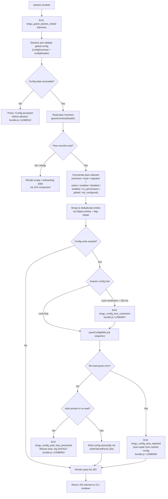

# `/passes`

> Analysis basis: CC v2.1.199 bundle.js (AST extraction + Claude interpretation)
> Minimum version: v2.1.199

---

## Overview

`/passes` is a local-jsx command that presents a UI for sharing a free week of Claude Code ("guest passes") with friends or colleagues. When invoked, the handler (`ilm`) fires a `tengu_guest_passes_visited` telemetry event, initialises configuration state via the shared config subsystem, and renders a JSX component that surfaces the guest-pass sharing interface.

---

## Registration

| Field | Value |
|---|---|
| type | `local-jsx` |
| name | `passes` |
| description | `Share a free week of Claude Code with friends` |
| module_id | `Pac` |
| load_inline | `true` |
| loc_byte | `13154734` |
| loc_byte_end | `13155056` |
| loc_line | `9741` |
| isHidden | `null` (not hidden) |
| arbor_handler.name | `ilm` |
| arbor_handler.fqn | `claude-2.1.199::ilm` |
| arbor_handler.kind | `AsyncFunction` |
| arbor_handler.resolution_path | `module_id` |
| arbor_handler.n_hits | `2` |

Analysis basis: CC v2.1.199 bundle.js:+13154734

---

## Input Branching

The command has two top-level branches at runtime: a configuration-check path and a rendering path. Within the rendering path there are further branches for pass-state enumeration, backup management, and config-lock contention handling. Given the number of distinct branches (≥ 3), a Mermaid flowchart is used.



---

## Behavioral Spec

### 1. Entry Point — Guest Passes Handler (`ilm`)

```
async function guestPassesHandler(context):
    emit telemetry("tengu_guest_passes_visited")        // bundle.js:+13154567
    config = await resolveConfig(context)               // calls configAccessor (odr → Fc → EE)
    passData = await readPassInventory(config)          // calls passInventoryReader (Hn)
    renderResult = await buildPassView(passData, config) // calls passPresentationBuilder (YTm)
    return renderJSX(renderResult)                      // Oac.jsx call at bundle.js:+13154616
```

Analysis basis: CC v2.1.199 bundle.js:+13154421

---

### 2. Config Accessor (`odr` → `Fc` → `EE`)

The config accessor resolves the global Claude configuration. It chains through a file-system reader (`Fc`) that delegates to the full config environment (`EE`), which in turn loads auth details, profile type, and telemetry preferences.

```
function resolveConfig(context):
    rawConfig = fileSystemConfigReader(context)     // Fc at bundle.js:+12794114
    fullConfig = configEnvironmentBuilder(rawConfig) // EE at bundle.js:+3140470
    if not fullConfig.ready:
        raise Error("Config accessed before allowed.") // bundle.js:+14383512
    return fullConfig
```

Auth resolution order (within `EE` → `Jw`):
1. Environment variable `ANTHROPIC_API_KEY` (bundle.js:+3120601)
2. Environment variable `ANTHROPIC_AUTH_TOKEN` / `CLAUDE_CODE_OAUTH_TOKEN` / WIF variables (bundle.js:+3121070)
3. `apiKeyHelper` subprocess (bundle.js:+3120695)
4. OAuth profile (`user_oauth`, `profile-implicit`) (bundle.js:+3116107, +3116034)
5. If none found: throws error listing all required env vars (bundle.js:+3121070)

Analysis basis: CC v2.1.199 bundle.js:+12794114, +3140470, +3120514

---

### 3. Pass Inventory Reader (`Hn`)

Reads the current set of guest passes from persistent storage, constructs a timestamp-stamped snapshot, and merges it with any in-flight pending requests tracked in the module-level cache map (`f7`).

```
async function passInventoryReader(config):
    snapshot = buildSnapshot()                        // Hbc: adds Date.now() timestamp
    pending  = await resolveInflightRequests(config)  // Ygr: checks qgr cache map
    merged   = Object.assign({}, snapshot, pending)
    statuses = enumeratePassObjects(merged)            // oon + Wgr via Object.entries
    return statuses
```

The deduplication helper (`Wgr`) calls `Object.entries` (bundle.js:+14382428) to iterate pass objects. A string-prefix check (`b$`: `e.startsWith` / `e.slice`, bundle.js:+1205216) strips internal key prefixes before comparison.

Analysis basis: CC v2.1.199 bundle.js:+14380400, +14380508, +14380568

---

### 4. In-flight Request Deduplication (`Ygr`)

```
async function resolveInflightRequests(config):
    if qgr.get(key) exists:                 // bundle.js:+14379765
        return Promise.resolve(cached)
    promise = initiatePassFetch(config)
    f7.set(key, promise)                    // bundle.js:+14379795
    result = await promise
    f7.delete(key)                          // bundle.js:+14379917
    notify(result)                          // vy (notifier)
    return result

// On resolution, WJo post-processes result:
function postProcessPassResult(result):
    data = f7.get(key)                      // bundle.js:+14383086
    normalise(data)                         // Wa + b$
    emit(result)                            // GJo + hae
```

Analysis basis: CC v2.1.199 bundle.js:+14379765–14380019

---

### 5. Pass Presentation Builder (`YTm`)

Orchestrates the full display pipeline: reads current pass data, checks config freshness, triggers a background config save if needed, then returns a structured object consumed by the JSX renderer.

```
async function passPresentationBuilder(passData, config):
    notify(passData)                              // vy
    formatted = formatPassEntries(passData)       // e (string formatter)
    expiry = computeExpiry(formatted)             // ite + Date.now
    statuses = enumerateStatuses(formatted)       // oon
    consolidated = consolidateConfig(statuses)    // con
    written = await writeIfNeeded(consolidated)   // lon → Zgr (backup writer)
    viewed = await saveGlobalIfNeeded(written)    // Jgr (global config save)
    return buildViewObject(viewed)                // V + T
```

The `con` helper reads current timestamp via `Date.now` (bundle.js:+14383381) and uses `ZTm` to compare freshness (bundle.js:+14383293). It emits `tengu_config_stale_write` if the on-disk config is outdated (bundle.js:+14384985).

Analysis basis: CC v2.1.199 bundle.js:+14380676

---

### 6. Atomic Config Save with Lock (`don` — `saveConfigWithLock`)

```
async function saveConfigWithLock(config, cacheSnapshot):
    dir = Hy.dirname(configPath)
    await fs.mkdir(dir, { recursive: true })
    lockStart = Date.now()                              // bundle.js:+14384614

    // Acquire file lock (Zle — writeFileAndFlush)
    await acquireFileLock(configPath)

    elapsed = Date.now() - lockStart
    if elapsed > 100:                                   // bundle.js:+14384752
        log("Lock acquisition took longer than expected…") // bundle.js:+14384758
        emit telemetry("tengu_config_lock_contention")  // bundle.js:+14384847

    reRead = await fs.readFile(configPath, "utf-8")     // bundle.js:+14383029

    try:
        parsed = JSON.parse(reRead)
    catch ParseError:
        log("saveConfigWithLock: re-read hit a parse error…") // bundle.js:+14385256
        emit telemetry("tengu_config_auto_repaired")    // bundle.js:+14385384
        parsed = cacheSnapshot   // auto-repair from cache

    if cacheSnapshot.auth present AND parsed.auth missing:
        log("saveConfigWithLock: re-read config is missing auth…") // bundle.js:+14385902
        emit telemetry("tengu_config_auth_loss_prevented") // bundle.js:+14386054
        return  // refuse write

    merged = merge(parsed, config)
    backupCount = countExisting(".backup." files)        // bundle.js:+14386360
    if backupCount >= 5:                                 // bundle.js:+14386501
        removeOldestBackup()

    copyFile(configPath, backupPath)                     // bundle.js:+14386479
    await writeFileAndFlush(configPath, merged)          // Zle
```

Analysis basis: CC v2.1.199 bundle.js:+14384540–14386854

---

### 7. Backup Config Writer (`Zgr`)

Manages the `~/.claude/backups/` directory (bundle.js:+14387431). Reads the existing backup directory (`r.readdir`), filters entries whose names start with the expected prefix (`m.startsWith`, bundle.js:+14388657), timestamps each backup via `Date.now` (bundle.js:+14388889), and copies the file (`r.copyFile`, bundle.js:+14388909). Uses `setImmediate` (bundle.js:+14389433) to schedule deduplication work off the hot path. Emits `tengu_config_parse_error` if the backup file itself cannot be parsed (bundle.js:+14389460).

Analysis basis: CC v2.1.199 bundle.js:+14387901–14389629

---

### 8. Global Config Save (`Jgr`)

```
async function saveGlobalConfig(config):
    snapshot = consolidateConfig(config)           // con
    notify(snapshot)                               // vy
    lockPath = Hy.dirname(globalConfigPath)        // bundle.js:+14384211
    formatted = JSON.stringify(snapshot)           // xe → JSON.stringify
    await writeFileAndFlush(lockPath, formatted)   // Zle
    if cacheSnapshot.auth present AND re-read.auth missing:
        log("saveGlobalConfig fallback: re-read…") // bundle.js:+14381321
    tag = "save_global"                            // bundle.js:+14381507
    return buildViewObject(snapshot)               // V + Pe → GZe
```

Analysis basis: CC v2.1.199 bundle.js:+14381501–14384486

---

### 9. Pass Status Enumeration

The following status strings are recognised by the pass subsystem (all found in literals, bundle.js:+14381717–14381944):

| Status string | Meaning |
|---|---|
| `unknown` | Pass state cannot be determined |
| `local` | Pass is locally tracked only |
| `migrated` | Pass migrated from a prior format |
| `native` | Pass is a native platform pass |
| `installed` | Pass has been installed/activated |
| `disabled` | Pass is explicitly disabled |
| `enabled` | Pass is active |
| `no_permissions` | User lacks permission to use pass |
| `not_configured` | Pass not yet configured |
| `global` | Pass is applied at the global scope |

---

### 10. Theme Awareness

The pass view respects the user's UI theme. Theme literals found in the implementation:

- `"dark"` (bundle.js:+14376754)
- `"auto"` (bundle.js:+14376783)
- `"normal"` (bundle.js:+14376812)

A 60 000 ms (60-second) timeout constant is present in the config subsystem reached from this command (bundle.js:+14377253).

---

## State & Side Effects

| Item | Detail |
|---|---|
| Telemetry: `tengu_guest_passes_visited` | Fired immediately on handler entry (bundle.js:+13154567) |
| Telemetry: `tengu_config_lock_contention` | Fired when config file lock takes > 100 ms to acquire (bundle.js:+14384847) |
| Telemetry: `tengu_config_stale_write` | Fired when the on-disk config is detected as stale before write (bundle.js:+14384985) |
| Telemetry: `tengu_config_auto_repaired` | Fired when a re-read parse error triggers cache-based auto-repair (bundle.js:+14385384) |
| Telemetry: `tengu_config_auth_loss_prevented` | Fired when a write is aborted to prevent wiping auth credentials (bundle.js:+14386054) |
| Telemetry: `tengu_config_fallback_write` | Fired on global-config fallback write path (bundle.js:+14384448) |
| Telemetry: `tengu_config_parse_error` | Fired when a backup config file cannot be parsed (bundle.js:+14389460) |
| Config file mutation | May write to `~/.claude.json` and rotate backups under `~/.claude/backups/` (max 5 backups, bundle.js:+14386501) |
| In-memory cache (`f7`, `qgr`) | Tracks in-flight pass fetch promises; de-duplicates concurrent requests |
| File lock | Acquires an exclusive file lock before any config write; warns if contention exceeds 100 ms (bundle.js:+14384752) |
| JSX rendering | Returns a JSX element via `Oac.jsx` (bundle.js:+13154616) for display by the CLI renderer |
| `appState` changes | <!-- TODO: not found in depth-2 traversal; needs --depth 4 --> |
| Sound | <!-- TODO: not found in depth-2 traversal; needs --depth 4 --> |

---

## Version History

| Version | Change |
|---|---|
| v2.1.199 | Initial analysis |

---

## Common Mistakes

1. **Invoking `/passes` before authentication is configured** — the config guard (`"Config accessed before allowed."`, bundle.js:+14383512) will abort the handler before any UI is shown. Ensure at least one of `ANTHROPIC_API_KEY`, `ANTHROPIC_AUTH_TOKEN`, `CLAUDE_CODE_OAUTH_TOKEN`, or the WIF env-var pair is set.
2. **Concurrent Claude Code instances corrupting config** — the lock-contention telemetry event (`tengu_config_lock_contention`) is a signal that two instances are racing on `~/.claude.json`. Only one instance should invoke config-writing commands at a time.
3. **Manually editing `~/.claude.json` and removing auth fields** — the auth-loss prevention guard (`tengu_config_auth_loss_prevented`) will refuse all subsequent config writes until the file is repaired, effectively blocking `/passes` from persisting any state.
4. **Expecting `/passes` to create API keys** — the command surfaces existing guest-pass tokens; it does not generate API credentials. Auth setup must happen through the normal onboarding flow.
5. **Backup directory growing unbounded** — the system retains at most 5 backup files (bundle.js:+14386501). If external tooling copies or locks files in `~/.claude/backups/`, the rotation may fail silently.

---

## Appendix — Identifier Mapping

> For bundle debugging only. Identifiers change across versions.

| Identifier | Role |
|---|---|
| `ilm` | Guest passes handler (main async entry point, `arbor_handler`) |
| `Mt` | Config error constructor / error factory |
| `BJo` | Config base builder / initialiser |
| `GJo` | Pass result notifier / event emitter |
| `hae` | Post-process completion signal |
| `odr` | Config accessor (outer resolver) |
| `Fc` | File-system config reader |
| `EE` | Config environment builder (full config assembly) |
| `Md` | Auth profile resolver |
| `bb` | Profile/identity builder |
| `ic` | First-party flag checker |
| `wI` | API key environment reader |
| `Jw` | Auth chain orchestrator |
| `m2t` | Slot/profile type mapper |
| `slt` | Storage slot accessor |
| `Hn` | Pass inventory reader |
| `Hbc` | Pass snapshot builder (adds timestamp) |
| `ite` | Pass expiry calculator |
| `oon` | Pass status enumerator |
| `Wgr` | Pass deduplication helper (Object.entries iteration) |
| `Ygr` | In-flight request deduplicator |
| `WJo` | Pass result post-processor |
| `zt` | Filesystem utility (stat/mkdir wrapper) |
| `b$` | String prefix stripper (startsWith / slice) |
| `YTm` | Pass presentation builder |
| `don` | `saveConfigWithLock` — atomic config writer with lock |
| `wh` | Config object merger (Object.assign wrapper) |
| `T` | Log/output writer (debug logger) |
| `V` | View object builder |
| `rn` | Config normaliser |
| `Zgr` | Backup config writer |
| `che` | Cache accessor helper |
| `xe` | JSON serialiser wrapper |
| `VJo` | Path joiner utility |
| `v` | Focus/blur state tracker |
| `E` | SDK connection manager |
| `L` | Away-summary generator |
| `Zle` | `writeFileAndFlush` — atomic file writer with fsync |
| `a` | Spend-limit/billing checker |
| `con` | Config freshness consolidator |
| `ZTm` | Config timestamp comparator |
| `lon` | Backup write dispatcher |
| `Jgr` | Global config save orchestrator |
| `Pe` | Post-save view finaliser |

---

Note: index built via Arbor fallback; some signals (telemetry, literals) may be missing — see arbor-fallback.js.