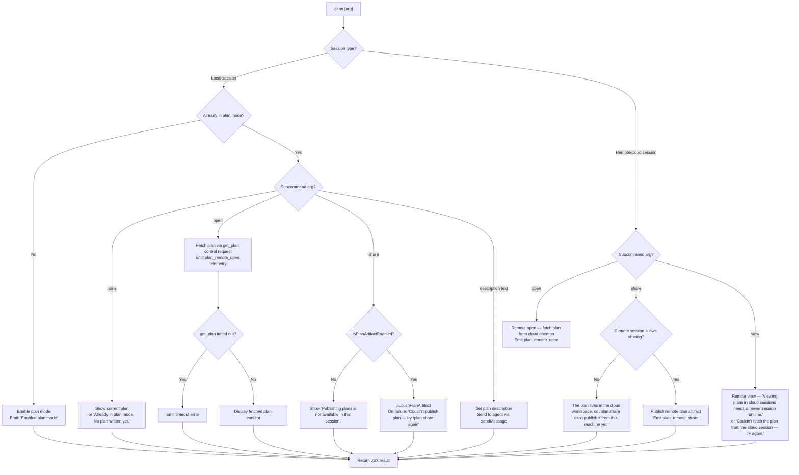

# `/plan`

> Analysis basis: CC v2.1.199 bundle.js (AST extraction + Claude interpretation)
> Minimum version: v2.1.199

---

## Overview

The `/plan` command enables plan mode for the current Claude Code session, or — when already in plan mode — allows the user to open, share, or view the session's current plan. It communicates with a background session daemon (and optionally a remote cloud session) to push and retrieve plan state, and can publish plan artifacts via an integrated publishing pipeline.

---

## Registration

| Field | Value |
|---|---|
| type | `local-jsx` |
| name | `plan` |
| description | Enable plan mode or view the current session plan |
| argumentHint | `[open\|share\|<description>]` |
| module_id | `Eac` |
| load_inline | `true` |
| loc_byte | `13142837` |
| loc_byte_end | `13143042` |
| loc_line | `9741` |
| arbor_handler.name | `Xam` |
| arbor_handler.fqn | `claude-2.1.199::Xam` |
| arbor_handler.kind | `AsyncFunction` |
| arbor_handler.resolution_path | `module_id` |
| arbor_handler.n_hits | `0` |

Analysis basis: CC v2.1.199 bundle.js:+13142837

---

## Input Branching

The command has five or more distinct paths depending on session type, current plan-mode state, and subcommand argument. A Mermaid flowchart is used.



---

## Behavioral Spec

### Main Handler — planCommandHandler (Xam)

The handler is an `AsyncFunction` resolved via `module_id` → `Eac`.

Analysis basis: CC v2.1.199 bundle.js:+13139258

```
async function planCommandHandler(context):
    sessionType = getSessionType(context)        // 'session', 'remote', etc.
    trimmedArg  = context.args.trim()            // bundle.js:+13139536

    // 1. Determine whether plan mode is already active
    isPlanMode = getPlanModeState(context)        // via _He  (+13139307)

    if not isPlanMode:
        // Enable plan mode
        setPlanMode(context, enabled=true)        // via qH   (+13139357)
        emitMessage("Enabled plan mode")          // literal  (+13139473)
        fSt(context)                              // side-effects / mode publish
        return renderJSX()

    // Already in plan mode — branch on arg
    if trimmedArg == "":
        // No subcommand: display existing plan or advisory
        planContent = fetchCurrentPlan(context)   // via Pn   (+13140076)
        if planContent is empty:
            return renderMessage("Already in plan mode. No plan written yet.")  // +13141028
        return renderPlan(planContent)

    if trimmedArg == "open":                      // literal  (+13139558)
        return handleOpen(context)

    if trimmedArg == "share":                     // literal  (+13139570)
        return handleShare(context)

    // Otherwise treat arg as a plan description
    return handleDescriptionUpdate(context, trimmedArg)
```

Analysis basis: CC v2.1.199 bundle.js:+13139258 – +13141806

---

### Sub-feature: Mode Activation (setPlanMode / qH)

```
function setPlanMode(context, enabled):
    // setMode call — checked for bypassPermissions guard
    if mode == "bypassPermissions" and guardActive:
        log("Ignoring permission update: setMode 'bypassPermissions' rejected …")
        return                                    // +13139357, guard literal +6939426

    // Persist new mode into session state via n.set
    sessionState.set("mode", "plan")             // +6940686

    // Update rule sets: allow / deny / alwaysAsk
    applyRuleChanges(context, {
        addRules, replaceRules, removeRules,
        addDirectories, removeDirectories
    })                                            // literals +6939768 … +6941157
```

Analysis basis: CC v2.1.199 bundle.js:+6939490

---

### Sub-feature: Plan Open (handleOpen)

```
async function handleOpen(context):
    if sessionType == "remote":                   // literal "remote" +64400
        // Send control request to remote session
        result = await sendControlRequest(context, type="get_plan")  // +13140893
        if timedOut(result):
            return renderError("get_plan timed out")  // +13140910
        plan = result.plan
        telemetry("plan_remote_open")             // +13140356
        return renderPlan(plan)

    // Local path: fetch via Pn helper
    plan = await fetchLocalPlan(context)
    telemetry("plan_remote_open")
    return renderPlan(plan)
```

Analysis basis: CC v2.1.199 bundle.js:+13140356

---

### Sub-feature: Plan Share (handleShare)

```
async function handleShare(context):
    if sessionType == "remote":
        // Cloud workspace — cannot publish from this machine
        return renderMessage(
            "The plan lives in the cloud workspace, so /plan share " +
            "can't publish it from this machine yet. Use /plan to view it …"
        )                                         // literal +13140681
        telemetry("plan_remote_share")            // +13140658

    // Local session
    if not rnn.isPlanArtifactEnabled(context):    // +13142066
        return renderMessage(
            "Publishing plans is not available in this session."
        )                                         // literal +13142103

    try:
        await rnn.publishPlanArtifact(context)    // +13142271
    catch error:
        return renderError(
            "Couldn't publish plan — try /plan share again, or run with --debug for details."
        )                                         // literal +13142168
    return renderSuccess()
```

Analysis basis: CC v2.1.199 bundle.js:+13142066

---

### Sub-feature: Remote View (handleRemoteView)

```
async function handleRemoteView(context):
    // Attempt to retrieve plan from cloud session via control request
    result = await sendControlRequest(context, type="get_plan")   // +13140984

    if result.subtype == "unsupported_subtype":   // literal +13141399
        return renderError(
            "Viewing plans in cloud sessions needs a newer session runtime."
        )                                         // literal +13141508

    if result.status in ["timeout", "request_failed"]:  // +13141454, +13141464
        return renderError(
            "Couldn't fetch the plan from the cloud session — try again."
        )                                         // literal +13141573

    telemetry("plan_remote_view")                 // literal +13140984
    return renderPlan(result.plan)
```

Analysis basis: CC v2.1.199 bundle.js:+13140984

---

### Sub-feature: Description Update (handleDescriptionUpdate)

```
async function handleDescriptionUpdate(context, description):
    // Construct a human-role message carrying the plan description
    message = buildUserMessage(role="human", content=description)  // +13140103

    // Set synthetic messages on the conversation thread
    context.thread.setMessages([message])          // +13140117

    // Dispatch to the agent
    await context.agent.sendMessage(message)       // +13140153

    // On send failure
    on error "send_failed":                        // literal +13140214
        return renderSendError()

    return renderJSX()
```

Analysis basis: CC v2.1.199 bundle.js:+13140117

---

### Sub-feature: Mode Publish Side-effects (fSt / planModePublisher)

After plan mode is activated the handler invokes a publishing subsystem (`fSt`, resolved through `Sgr`, `Grn`, `p8`, `ACe`, `T`).

```
function publishModeActivation(context):
    // Render plan mode UI component
    component = renderPlanModeComponent(context)  // Sgr +14236752

    // Build configuration entries from Object.entries
    for [key, value] in Object.entries(config):   // ACe +14226144
        applyQH(key, value)                       // qH  +14226194

    // Traverse rule groups via Grn → p8
    for group in ruleGroups:                      // Grn +14236790
        buildRuleSet(group)                       // p8  +14225487

    // Final render pass
    renderToOutput(context)                        // T   +14237106
```

Analysis basis: CC v2.1.199 bundle.js:+14236917

---

### Sub-feature: Control Request / Timeout (Ka)

```
async function sendControlRequestWithTimeout(context, payload):
    return await Promise.race([
        sendRequest(context, payload),
        new Promise((_, reject) =>
            setTimeout(() => reject(new Error("get_plan timed out")), TIMEOUT_MS)
        )
    ])                                             // Ka  +13140860
    // On resolution: clearTimeout                 //     +877854
```

Analysis basis: CC v2.1.199 bundle.js:+13140860

---

### Sub-feature: Plan Artifact Enabled Check (rnn.isPlanArtifactEnabled)

```
function isPlanArtifactEnabled(context):
    // Checks session flags and feature-gate state
    // Returns boolean; false → "Publishing plans is not available in this session."
    return checkFeatureFlag(context, "plan_artifact")  // +13142066
```

Analysis basis: CC v2.1.199 bundle.js:+13142066

---

### Sub-feature: Editor Launch for Plan Viewing (MIe)

When the user requests an inline view of the plan, the handler may launch an external editor:

```
function launchEditorForPlan(context, planFilePath):
    // Pause Ink rendering / alternate screen
    context.terminal.enterAlternateScreen()        // +12236932
    context.terminal.suspendStdin()                // +12236972

    // Detect editor via Wx (checks $EDITOR, IDE env, basename heuristics)
    editorCommand = detectEditor()                 // Wx +13142504

    // spawnSync with inherited stdio
    result = spawnSync(editorCommand, [planFilePath], { stdio: "inherit" })  // +12237054

    // Restore terminal state
    context.terminal.exitAlternateScreen()         // +12237434
    context.terminal.resumeStdin()                 // +12237463
```

Analysis basis: CC v2.1.199 bundle.js:+13141964

---

## State & Side Effects

| Item | Detail |
|---|---|
| Telemetry | `tengu_feature_ok` (+1039941), `tengu_feature_bad` (+1040008), `tengu_bg_dispatch_sigkill_escalate` (+18528964), `tengu_bg_low_mem_mb` (+13271978), `tengu_bg_dispatch_low_mem` (+18529670), `tengu_bg_spare_enable` (+18530360), `tengu_bg_sendclaim_failed` (+18521835), `tengu_bg_handoff_settle` (+18536348), `tengu_bg_state_read_transient` (+4362670), `tengu_daemon_config_reload` (+18546460), `tengu_bg_roster_parse_failed` (+12188007), `tengu_bg_spare_claim` (+18530488), `tengu_bg_spare_claim_fail` (+18530754) |
| Literal event tokens | `plan_remote_query` (+13139647), `plan_remote_open` (+13140356), `plan_remote_share` (+13140658), `plan_remote_view` (+13140984), `mode_push_timeout` (+13139669), `mode_push_rejected` (+13139689) |
| Session mode state | Sets plan-mode flag in session state (`n.set`); persists across the session lifetime |
| Permission rules | Applies `addRules` / `replaceRules` / `removeRules` / `addDirectories` / `removeDirectories` to session permission model when mode is toggled |
| Agent message dispatch | `setMessages` + `sendMessage` invoked when a description argument is supplied |
| Plan artifact | `rnn.publishPlanArtifact` writes or publishes an artifact when `/plan share` succeeds |
| Terminal / Ink | May pause Ink rendering (`enterAlternateScreen`, `suspendStdin`) and restore after editor exits |
| Background daemon | Interacts with `m7` (spawn/claim/send-claim), `wcs` socket communication, and `Mcs` session lifecycle manager |
| File I/O | Reads/writes plan state files through `Wd.writeFile`, `Wd.rm`, `Wd.unlink`, `bge.readFile`, `P1.readFile` |
| Process events | Listens to `process.on("exit")` for cleanup |
| Spend / billing | Calls spending-gate helper (`Pn` → `y` → `a`) before agent dispatch; handles `spend.blocked`, `spend limit reached`, `billing_error`, HTTP 429 |

---

## Version History

| Version | Change |
|---|---|
| v2.1.199 | Initial analysis |

---

## Common Mistakes

1. **Invoking `/plan share` in a remote/cloud session**: The command will refuse and display an advisory message explaining that publishing must be done from within the cloud workspace. Use `/plan` to view the plan there instead.
2. **Providing a description argument when not already in plan mode**: The command will activate plan mode rather than set a description. Run `/plan` once to enable plan mode, then run `/plan <description>` to update the plan.
3. **Expecting `/plan open` to work without an active plan**: If no plan has been written yet the command returns "Already in plan mode. No plan written yet." rather than opening an editor.
4. **Using `/plan share` when the plan-artifact feature gate is disabled**: The command checks `rnn.isPlanArtifactEnabled` and returns "Publishing plans is not available in this session." if the flag is off — this is a session-level or org-level capability, not a user setting.
5. **Assuming `/plan view` works on older remote session runtimes**: The control-request subtype may be unrecognised, yielding "Viewing plans in cloud sessions needs a newer session runtime." Update the remote session to resolve this.

---

## Appendix — Identifier Mapping

> For bundle debugging only. Identifiers change across versions.

| Identifier | Role |
|---|---|
| `Xam` | Main plan command handler (AsyncFunction) |
| `r` | Data-stream / event-stream helper |
| `Ts` | CLI error reporter (calls `gJe` + `xI` + `process.exit`) |
| `gJe` | Error formatter / console.error wrapper |
| `xI` | File writer for CLI error output (Ale.writeFileSync) |
| `_He` | Plan-mode state reader |
| `qH` | Session mode setter / permission-rule manager |
| `T` | Output renderer / write-flush helper |
| `gdu` | Configuration loader (`i$`, `Vwr`, `vfs`) |
| `vfs` | Virtual filesystem selector (`Slu` / `Alu`) |
| `xe` | JSON serialiser wrapper |
| `Nc` | Path/content normaliser |
| `phs` | Rule map builder |
| `ntt` | Terminal write helper (`ths`) |
| `ths` | Low-level stream writer |
| `Sdu` | Logging / session-transcript writer |
| `Let` | Debounced batch flusher (clearTimeout / setTimeout / setImmediate) |
| `Ile` | Log-line formatter (`att`, `Tle.join`, `tr`, `kt`) |
| `ydu` | Async file appender (`s$.mkdir`, `s$.appendFile`) |
| `Ai` | Hook registrar (`bfs.register`) |
| `yle` | Resolved-path helper (`rn`) |
| `hhs` | Path + key builder (`Tle.join`, `kt`) |
| `qp` | Token / string escaper |
| `kqu` | Escape-sequence replacer |
| `fSt` | Plan-mode publish / side-effect driver |
| `Sgr` | Plan mode UI component renderer (`x6`, `wC`, `WUr`) |
| `wC` | Model capability checker (`YXo`, `tEe`, `ks`) |
| `YXo` | Model name resolver (`ts`) |
| `tEe` | Model feature-flag tester (`io`, `gr`, `Zat`) |
| `ks` | Permission source selector (`W6`, `Bo`, `MH`) |
| `WUr` | Settings-layer reader (`kn`) |
| `kn` | Settings resolver (`iyn`, `t9`) |
| `ACe` | Config-entry applicator (`Object.entries`, `qH`, `o.map`) |
| `Grn` | Rule-group traverser (`Sgr`, `p8`) |
| `p8` | Rule-set builder (`Object.entries`, `Wg`, `VXo`, `JSc`, `T`, `qp`) |
| `Wg` | Rule-text normaliser (`Mqu`, `rD`, `Dqu`, `Rqu`) |
| `VXo` | Rule-entry expander (`G7e`, `jXo`, `r.match`) |
| `JSc` | Rule-cache manager (`jAm`, `r.get/set`, `qH`) |
| `Ca` | UI component factory A (`ta`, `Vl`) |
| `Vl` | JSX element wrapper (`jte`) |
| `f_` | UI component factory B (`Vl`) |
| `Hac` | Async promise-with-timeout helper (`Promise.withResolvers`, `setTimeout`, `ICt.push`) |
| `we` | Feature-gate checker (`V`, `Pe`) — emits `tengu_feature_ok` / `tengu_feature_bad` |
| `V` | Telemetry event emitter |
| `Pe` | Feature-ok/bad event builder (`GZe`) |
| `GZe` | Base telemetry primitive |
| `Pn` | Spend / billing gate + agent entry point (`j1.randomUUID`, `y`, `_`) |
| `y` | HTTP response dispatcher (`a`) |
| `a` | Spend-limit checker (`Whe`, `Response.json`) |
| `Whe` | Spend-gate JSON builder |
| `_` | Request builder (`s`) |
| `g` | Agent message bus (`f`) |
| `f` | Message normaliser (`yV`) |
| `yV` | Path normaliser for Windows/Unix (`IN.normalize`, `jt`, `t.replaceAll`) |
| `Le` | Secondary feature-gate checker (`V`, `Pe`) |
| `h` | Background session worker / daemon dispatcher |
| `phe` | Boolean string parser (`at`) |
| `at` | String-to-bool converter |
| `ven` | Host-managed path builder (`fg.join`, `Kie`) |
| `Kie` | Key-path resolver (`fg.join`, `tr`) |
| `Sge` | Session-path builder (`fg.join`, `ven`) |
| `ke` | Tool-execution wrapper (`sr`, `at`, `Pi`, `Gku`, `knt.push`, `fne.logError`) |
| `sr` | Error string builder |
| `Pi` | Permission installer (`KTs`) |
| `KTs` | Permission key builder (`at`) |
| `Gku` | Recent-command rotator (`ahn.shift`, `ahn.push`) |
| `B` | Process handle wrapper (`i`, `U`) |
| `On` | Kill-with-timeout helper (`setTimeout`, `clearTimeout`, `s.unref`) |
| `c` | Stopped-session logger (`ln`) |
| `sCe` | System-context collector (`cum`, `jt`, `buc.freemem`, `pum`) |
| `cum` | OS-info builder (`ot`) |
| `ot` | Tool-state collector |
| `pum` | macOS memory probe (`require("bun:ffi")`, `T`, `String`, `unn`) |
| `HWe` | Pin-file manager (`IE.lstat`, `n4t`, `MR`, `IE.readFile`, `Wt`, `Aup`) |
| `n4t` | Pin-path builder (`S_.join`, `MR`) |
| `MR` | Path resolver (`S_.join`, `tr`) |
| `Wt` | JSON.parse wrapper |
| `pn` | ENOENT / EISDIR error classifier (`rn`) |
| `rn` | Error-code extractor |
| `Aup` | Directory pin reader (`IE.readdir`, `Promise.all`, `aoa`, `Ff`) |
| `aoa` | Pin-file writer (`n4t`, `IE.mkdir`, `Uf`, `xe`) |
| `Ff` | File filter (`rn`, `nV.has`, `T`, `ge`, `ke`) |
| `Q` | Session-retirement manager (`vee`, `FVl`) |
| `vee` | Session-file reader (`P1.lstat`, `Hge`, `P1.readFile`, `pn`, `Wa`) |
| `Hge` | z6o path builder |
| `FVl` | Session-file unlinker (`P1.unlink`, `Hge`, `pn`) |
| `wcs` | Send-claim socket connector (`m7.claim`, `aQo`, `phe`, `bQm`, `AQm`) |
| `aQo` | Session auth-file writer (`jt`, `Cen`, `ate.mkdir`, `Ien`, `ate.writeFile`) |
| `Cen` | fg.join + Ien path helper |
| `Ien` | Auth-path resolver (`fg.join`, `Kie`) |
| `ge` | String coercer |
| `bQm` | Claim-send retry loop (`Date.now`, `Error`, `TQm`, `rn`, `On`) |
| `TQm` | TCP claim-frame sender (`fbr.connect`, `o.once`, `o.end`, `xe`, `n`) |
| `AQm` | Claim-frame builder (`m7.buildClaimFrame`) |
| `_d` | Normalised-error builder (`rn`) |
| `mM` | Binary frame encoder (`Buffer.from`, `Buffer.allocUnsafe`, `n.writeUInt32BE`, `n.writeUInt8`) |
| `Mcs` | Session lifecycle / state machine manager |
| `Bl` | S_.join + MR path helper |
| `mr` | Renderer selector (`Zf`, `qe`) |
| `Zf` | Primary renderer (`GZe`) |
| `qe` | Fallback renderer (`GZe`) |
| `Yi` | Session-file state reader/writer |
| `l` | Wfc wrapper |
| `p` | Forced-shutdown handler (`EI`, `process.exit`, `u.abort`) |
| `d` | Config-reload dispatcher (`vJe`, `r.write`, `ihc`, `b.stop/start/updateConfig`, `iru`) |
| `Zio` | Background state serialiser (`Qio`, `UUn`) |
| `Qg` | Session-active checker (`tk`) |
| `tk` | Active-state probe (`yoe`) |
| `JRe` | Rule-index builder (`GG.has`, `Z9t.has`, `gWe.has`, `T`, `yup`) |
| `yup` | Rule-token parser (`GG.has`, `gWe.has`, `_up.has`, `n.set/get`) |
| `op` | Temp-file operator (`Qg`, `Uf`, `S_.join`, `xe`, `ty`) |
| `Uf` | Atomic-file writer (`WOr.randomBytes`, `FY.writeFile`, `FY.copyFile`, `FY.chmod`, `FY.unlink`) |
| `ty` | Cache-entry deleter (`_oe.delete`) |
| `uIt` | Session-roster updater (`nql.then`, `p5`, `Date.now`, `Ezf`) |
| `p5` | Background session reader (`bge.lstat`, `zie`, `ke`, `V`, `qe`, `qlr`, `bge.rm`) |
| `Ezf` | Session directory initialiser (`zie`, `bge.mkdir`, `rql.dirname`, `Uf`, `xe`, `rn`) |
| `wen` | Session-path unlinker (`fg.join`, `Ien`) |
| `kIe` | PTY-pid path builder (`fg.join`, `hFe`) |
| `hFe` | PTY-pids resolver (`fg.join`, `Kie`) |
| `_M` | QVl wrapper |
| `QVl` | PTY-pid writer (`jt`, `fg.join`, `hFe`, `e.split`) |
| `wk` | PTY-path builder (`jt`, `rGo`, `fg.join`, `cIt`) |
| `rGo` | PTY hash resolver (`hzf`) |
| `cIt` | PTY-path resolver (`fg.join`, `yge`) |
| `mP` | QVl wrapper (late variant) |
| `Ree` | PTY-entry reader (`jt`, `fg.join`, `hFe`, `e.split`) |
| `Y` | Rate-limit event handler (`f`, `K`) |
| `K` | Rate-limit enqueuer (`csc`, `k$`, `O`, `kt`, `fw.randomUUID`) |
| `csc` | Rate-limit classifier |
| `k$` | Usage-based flag checker (`Fc`) |
| `O` | Request queue state machine (`i.getState`, `$rt`, `kSt`, `s5`) |
| `kt` | Aw wrapper |
| `Ka` | Promise-race timeout wrapper (`setTimeout`, `Promise.race`, `clearTimeout`) |
| `cRo` | Control-response renderer (`Nyt`, `Ui`) |
| `Nyt` | Stream-output renderer (`o.on`, `Oq`, `Oyt.jsx`) |
| `Oq` | Styled output component (`Koo`, `sso`, `ioe`) |
| `sso` | React createElement shim |
| `ioe` | Ink display component (`hD`, `SRe`, `zoo`) |
| `Ui` | ANSI-strip renderer (`Bun.stripANSI`) |
| `iJe` | Plan-artifact helper A (`EHe`, `kt`) |
| `EHe` | Plan-artifact primitive |
| `aM` | Plan-artifact helper B (`iM`, `zt`, `pn`, `Mo`, `T`, `ke`) |
| `iM` | Artifact path joiner (`nIe`, `kt`, `d7.join`, `Vy`) |
| `nIe` | Artifact key resolver (`kt`, `EHe`, `r.get`, `Vy`, `JNt`, `fit`, `Tvn`, `d7.join`, `zt`, `r.set`) |
| `JNt` | Artifact name replacer (`e.replace`) |
| `fit` | Artifact name formatter (`XNt`) |
| `Tvn` | Artifact display-name formatter (`XNt`) |
| `Mo` | Path-error logger (`rn`) |
| `MIe` | External-editor launcher (`zt`, `hu.get`, `qj`, `Jql.spawnSync`, `Wx`) |
| `qj` | Editor-config reader (`IH`, `E7f`) |
| `IH` | Editor configuration store |
| `A7f` | Editor argument builder (`AGo`) |
| `AGo` | File-type detector (`zql`, `h7f.find`) |
| `zql` | Extension/language classifier (`lcr.basename`, `g7f.has`, `r.toLowerCase`) |
| `Wx` | Editor name resolver (`e.toLowerCase`, `oi`, `g1.basename`, `M8t`) |
| `oi` | Substring extractor (`e.indexOf`, `e.slice`) |

---

Note: index built via Arbor fallback; some signals (telemetry, literals) may be missing — see arbor-fallback.js.