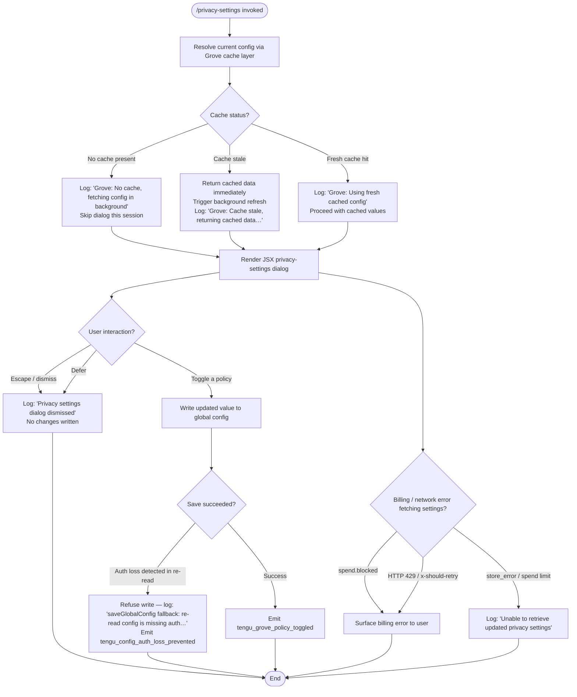

# `/privacy-settings`

> Analysis basis: CC v2.1.199 bundle.js (AST extraction + Claude interpretation)
> Minimum version: v2.1.199

---

## Overview

The `/privacy-settings` command opens an interactive JSX dialog that allows the user to view and toggle privacy-related policy settings (e.g., data-sharing or telemetry preferences) stored in the global configuration. On invocation the handler fetches the current configuration — using a cache-aware "Grove" layer with stale-while-revalidate semantics — renders the settings UI, and persists any changes the user makes back to the global config, emitting a telemetry event on each toggle.

---

## Registration

| Field | Value |
|---|---|
| type | `local-jsx` |
| name | `privacy-settings` |
| description | `View and update your privacy settings` |
| loc_byte | `13165411` |
| loc_byte_end | `13165594` |
| loc_line | `9751` |
| module_id | `Bac` |
| load_inline | `true` |
| arbor_handler.name | `dlm` |
| arbor_handler.fqn | `claude-2.1.199::dlm` |
| arbor_handler.kind | `AsyncFunction` |
| arbor_handler.resolution_path | `module_id` |
| arbor_handler.n_hits | `0` |

Analysis basis: CC v2.1.199 bundle.js:+13165411

---

## Input Branching

The handler has 4+ distinct branches depending on config-cache state, escape/defer interaction, and network/billing errors, so a Mermaid flowchart is used.



Analysis basis: CC v2.1.199 bundle.js:+13164422, +13164586, +13164611, +8035979, +8036099, +8036205

---

## Behavioral Spec

### 1. Handler Entry — `privacySettingsHandler` (`dlm`)

The top-level async handler is the Arbor-resolved function `dlm` (AsyncFunction, module `Bac`).

```
async function privacySettingsHandler(context):
    [parallel] results = await Promise.all([
        fetchCurrentConfig(),          // Rse
        fetchSpendOrBillingData()      // DOe
    ])
    currentConfig  = results[0]
    billingContext = results[1]

    if billingContext indicates spend.blocked:
        return renderBillingError(billingContext)

    dialog = renderPrivacySettingsJsx(currentConfig)   // Eqo.jsx
    outcome = await dialog.waitForUserAction()

    if outcome.action in ["escape", "defer"]:
        log("Privacy settings dialog dismissed")
        return

    if outcome.action == "toggle":
        await saveGlobalConfigWithPolicy(
            currentConfig,
            outcome.updatedPolicies,
            context = "system"
        )

    emitTelemetry("tengu_grove_policy_toggled")
    return renderSettingsView(outcome)   // qe → "settings" literal
```

Analysis basis: CC v2.1.199 bundle.js:+13164422, +13164462, +13164475, +13164481, +13164586, +13164600, +13164611, +13164656, +13164965, +13165028, +13165078

---

### 2. Configuration Cache Layer — `groveConfigFetcher` (`MHt`)

The Grove cache layer implements a stale-while-revalidate pattern for the global config. Three distinct paths exist:

```
async function groveConfigFetcher():
    cacheEntry = readConfigCache()     // Fc → EE

    if cacheEntry is null:
        log("Grove: No cache, fetching config in background (dialog skipped this session)")
        triggerBackgroundFetch()       // j7a
        return null                    // dialog skipped this session

    age = Date.now() - cacheEntry.timestamp

    if age > CACHE_TIMEOUT_MS:        // 60000 ms (bundle.js:+14377253)
        log("Grove: Cache stale, returning cached data and refreshing in background")
        scheduleBackgroundRefresh(cacheEntry)   // j7a
        return cacheEntry.data

    log("Grove: Using fresh cached config")
    return cacheEntry.data
```

Analysis basis: CC v2.1.199 bundle.js:+8035864, +8035953, +8035977, +8036059, +8036099, +8036205, +14377253

---

### 3. Background Config Refresh — `backgroundConfigRefresher` (`j7a`)

```
async function backgroundConfigRefresher(existingCacheEntry):
    freshConfig = await loadConfigFromDisk()    // Mt → BJo
    timestamp   = Date.now()

    resolvedAuth = resolveAuthState(freshConfig)  // Hn
    await persistResolvedConfig(resolvedAuth)      // T (logging/write pipeline)

    updateCacheEntry(freshConfig, timestamp)
```

Analysis basis: CC v2.1.199 bundle.js:+8036059, +8036295, +8036351, +8036403, +8036444, +8036555

---

### 4. Config Read — `configLoader` (`Mt`)

```
function configLoader():
    if configAccessedBeforeAllowed():
        throw new Error("Config accessed before allowed.")   // bundle.js:+14383512
    raw = readConfigBlob()     // BJo
    parsed = parseConfig(raw)  // GJo
    return postProcessConfig(parsed)   // hae
```

> Config-access guard error string: `"Config accessed before allowed."` (bundle.js:+14383512)

Analysis basis: CC v2.1.199 bundle.js:+14383433, +14383506, +14383512, +14383554, +14383558

---

### 5. Auth-Safe Global Config Save — `saveGlobalConfigSafe` (`YTm`)

To protect against accidentally clearing stored credentials during a config round-trip, the save routine re-reads the on-disk config after writing and compares auth fields:

```
async function saveGlobalConfigSafe(updatedConfig):
    write(updatedConfig)                        // T

    reReadConfig = await configLoader()         // f7.get

    if reReadConfig is missing auth fields
       that cachedConfig has:
        log("saveGlobalConfig fallback: re-read config is missing auth that cache has; refusing to write. See GH #3117.")
        emitTelemetry("tengu_config_auth_loss_prevented")
        return  // refuse the write

    label = classifyAuthState(reReadConfig)
    // labels: "unknown" | "local" | "migrated" | "native" |
    //         "installed" | "disabled" | "enabled" |
    //         "no_permissions" | "global" | "not_configured"
    // (bundle.js:+14381738 – +14381944)

    persistFinalConfig(reReadConfig)            // save_global (bundle.js:+14381507)
```

Analysis basis: CC v2.1.199 bundle.js:+14380676, +14381321, +14381449, +14381507, +14381738, +14381800, +14381813, +14381831, +14381845, +14381864, +14381890, +14381904, +14381925, +14381944

---

### 6. Subscription / Auth State Classification (literals)

The auth state is classified into one of nine string labels used when persisting config:

| Label | Meaning (inferred) |
|---|---|
| `"unknown"` | Auth state cannot be determined |
| `"local"` | Local credential present |
| `"migrated"` | Credential migrated from legacy location |
| `"native"` | Native credential store in use |
| `"installed"` | Auth package installed but not yet activated |
| `"disabled"` | Auth explicitly disabled |
| `"enabled"` | Auth active and working |
| `"no_permissions"` | Credential store exists but lacks permission |
| `"not_configured"` | No auth configured at all |
| `"global"` | Global credential active |

Analysis basis: CC v2.1.199 bundle.js:+14381738 – +14381944

---

### 7. Config API Key Handling (within `EE` — configStateReader)

```
function configStateReader(rawConfig):
    if rawConfig.env["ANTHROPIC_API_KEY"] is set:     // bundle.js:+3117849
        apiKey = rawConfig.env["ANTHROPIC_API_KEY"]
    else:
        apiKey = rawConfig["apiKeyHelper"]             // bundle.js:+3117874

    // Subscription tier check
    if tier in ["max", "pro"]:                        // bundle.js:+3143434, +3143445
        applyTierCapabilities(config)

    return normalizedConfig
```

Analysis basis: CC v2.1.199 bundle.js:+3117569, +3117667, +3117688, +3117696, +3117721, +3117849, +3117874, +3143434, +3143445

---

### 8. Billing / Spend Guard — `spendGuard` (`a` → `Whe`)

Before rendering the UI, the handler checks for spend-limit conditions:

```
async function spendGuard(billingContext):
    if billingContext.status == "spend.blocked":      // bundle.js:+18345727
        return { error: "billing_error" }             // bundle.js:+18345897

    if billingContext.status == "store_error":        // bundle.js:+18345788
        return { error: "spend limit unavailable" }   // bundle.js:+18345802

    if billingContext.status == "spend limit reached": // bundle.js:+18345828
        return { error: "billing_error" }

    response = await Response.json(billingContext)
    if response.httpStatus == 429:                    // bundle.js:+18345986
        if response.headers["x-should-retry"]:        // bundle.js:+18345999
            scheduleRetry()
    return billingContext
```

Analysis basis: CC v2.1.199 bundle.js:+18345723, +18345727, +18345788, +18345802, +18345828, +18345897, +18345986, +18345999

---

### 9. Logging Pipeline — `logTransport` (`T` / `Sdu`)

The command uses a buffered, debounced log-write pipeline:

```
function logTransport(level, message):
    // level may be "debug" (bundle.js:+218244)
    sanitized = sanitizeMessage(message)    // Nc — redacts sensitive values as "[REDACTED]" (bundle.js:+209268)
    buffer.push(sanitized)                  // stt.push

    if buffer.length >= 100:               // bundle.js:+67295
        flush(buffer)
    else:
        debounce(flush, 1000 ms)           // bundle.js:+67274, +67550

    writeToFile(sanitized)                 // ydu → s$.appendFile / s$.mkdir
    // File path derived via Tle.dirname
    // Process exit handler registered to flush on "exit" (bundle.js:+217910)
```

> Buffer flush threshold: 100 entries (bundle.js:+67295)
> Debounce delay: 1000 ms (bundle.js:+67274)

Analysis basis: CC v2.1.199 bundle.js:+217630, +217657, +217669, +217696, +217739, +217910, +217966, +218008, +67274, +67295, +67550

---

## State & Side Effects

| Item | Detail |
|---|---|
| Telemetry: `tengu_grove_policy_toggled` | Emitted each time the user successfully toggles a privacy policy setting (bundle.js:+13164967) |
| Telemetry: `tengu_config_auth_loss_prevented` | Emitted when a config save is aborted because the re-read config is missing auth fields present in cache — guards against credential loss (bundle.js:+14381449) |
| Global config write | Updated privacy settings written to global config via `saveGlobalConfigSafe`; write is refused if auth regression is detected |
| Cache update | Grove config cache entry is refreshed (timestamp + data) after successful background fetch |
| Log file append | All log messages are appended to the log file via `s$.appendFile`; directory created with `s$.mkdir` if absent |
| Process `"exit"` handler | Registered by `Sdu` to flush any pending log buffer on process exit (bundle.js:+217899, +217910) |
| JSX dialog render | A `local-jsx` dialog is rendered via `Eqo.jsx` (bundle.js:+13165078); no terminal rewrite occurs if the dialog is dismissed via escape or defer |
| appState changes | Privacy policy state updated in global config; no in-memory appState mutation found at depth ≤ 2 |
| Sound | <!-- TODO: not found in depth-2 traversal; needs --depth 4 --> |

---

## Version History

| Version | Change |
|---|---|
| v2.1.199 | Initial analysis |

---

## Common Mistakes

1. **Dismissing the dialog and expecting settings to be saved** — pressing Escape or choosing "defer" (`"escape"` / `"defer"` literals at bundle.js:+13164586, +13164600) logs `"Privacy settings dialog dismissed"` and exits without writing any changes.
2. **Assuming immediate disk persistence** — the Grove layer returns stale cache data immediately and refreshes in the background; the dialog may briefly reflect slightly outdated settings when the cache is older than 60 000 ms (bundle.js:+14377253).
3. **Ignoring the auth-loss guard** — if the on-disk config is modified externally between the read and write steps, the save will be silently refused to prevent credential loss (see GH #3117, bundle.js:+14381321). No user-visible error is surfaced; check logs for `tengu_config_auth_loss_prevented`.
4. **Expecting the command to work when billing is blocked** — a `spend.blocked` or HTTP 429 response will prevent the settings UI from rendering and will surface a billing error instead (bundle.js:+18345727, +18345986).
5. **Running the command before the config is ready** — if the config subsystem has not finished initialising, `configLoader` will throw `"Config accessed before allowed."` (bundle.js:+14383512), aborting the command.

---

## Appendix — Identifier Mapping

> For bundle debugging only. Identifiers change across versions.

| Identifier | Role |
|---|---|
| `dlm` | Top-level async handler for `/privacy-settings` (Arbor-resolved, AsyncFunction, module `Bac`) |
| `MHt` | Grove config cache fetcher (stale-while-revalidate orchestrator) |
| `sEe` | Config state assembly / normalisation layer |
| `Oi` | Config object builder (assembles env, key, tier fields) |
| `c6r` | Config field extractor A (called from config builder) |
| `l6r` | Config field extractor B (called from config builder) |
| `EE` | Config state reader (reads API key, apiKeyHelper, tier) |
| `So` | Config serialiser / snapshot utility |
| `c9` | Array-membership check helper (`Array.isArray` + `e.includes`) |
| `tOi` | Config post-processor / transform (called from normalisation layer) |
| `Fc` | Cache entry reader (reads current Grove cache entry) |
| `Mt` | Config loader with access-guard (throws if accessed too early) |
| `BJo` | Raw config blob reader |
| `GJo` | Config parser (raw blob → structured object) |
| `hae` | Config post-processor (after parse) |
| `T` | Buffered log-write transport |
| `gdu` | Log entry formatter / dispatcher |
| `vfs` | Log sink selector (chooses between `Slu` and `Alu`) |
| `Slu` | Log sink A |
| `Alu` | Log sink B |
| `xe` | JSON serialiser wrapper (`JSON.stringify`) |
| `Nc` | Log message sanitiser (replaces sensitive values with `[REDACTED]`) |
| `phs` | Sensitive-pattern map builder (`pdu.map`) |
| `ntt` | Terminal write helper (calls `ths`) |
| `ths` | Low-level terminal write (`e.write`) |
| `Sdu` | Log pipeline controller (buffer, debounce, file append, exit handler) |
| `Let` | Debounced batch flusher (`setTimeout` / `setImmediate` / `clearTimeout`) |
| `Ile` | Log file path assembler (`att`, `Tle.join`, `tr`, `kt`) |
| `ydu` | Async file writer (`s$.mkdir` + `s$.appendFile`) |
| `Ai` | Signal/hook registrar (`bfs.register`) |
| `zt` | Log finaliser / close helper |
| `yle` | Error classifier (detects `EISDIR`) |
| `hhs` | Log file path resolver (`Tle.join` + `kt`) |
| `j7a` | Background config refresh scheduler |
| `Hn` | Auth state resolver (`BJo`, `Promise.resolve`, `Object.assign`, `Hbc`, `oon`, `Ygr`, `vy`, `YTm`) |
| `Hbc` | Auth metadata builder (timestamp, `ite`) |
| `oon` | Config entries enumerator (`Wgr`, `Object.entries`) |
| `Ygr` | Deduplication / in-flight request guard (`qgr`, `f7` maps) |
| `YTm` | Auth-safe global config save orchestrator |
| `a` | Spend / billing context fetcher (`Whe`, `Response.json`) |
| `Whe` | Billing request builder (`JSON.stringify`) |
| `V` | UI state / view model builder |
| `qe` | Settings view renderer (renders `"settings"` screen) |
| `GZe` | Settings view component (JSX leaf rendered by `qe`) |
| `NBe` | Logger namespace initialiser (called from `T`) |
| `gdu` | Log-level dispatcher |
| `mN` | Log metadata enricher |
| `Js` | Config merge / defaults applier |
| `i$` | File system path utilities |
| `Vwr` | Log rotation or versioning helper |
| `Rse` | Config fetch initiator (parallel fetch in handler) |
| `DOe` | Billing / spend data fetcher (parallel fetch in handler) |
| `Eqo` | JSX dialog component factory for privacy-settings UI |
| `Md` | Config field accessor A |
| `bb` | Config field accessor B |
| `ic` | Config field accessor C |
| `ts` | Config field accessor D |
| `wI` | Tier-capability applier |
| `Jw` | Config field accessor E |
| `m2t` | Config field accessor F |
| `slt` | Config field accessor G |
| `Wgr` | Config entries walker |
| `don` | Auth object destructor / extractor |
| `con` | Config conflict resolver |
| `lon` | Legacy auth path handler |
| `che` | Credential checker |
| `Jgr` | Config finaliser |
| `WJo` | In-flight request sentinel |
| `vy` | Promise utility / void resolver |
| `ite` | Timestamp / identity helper |
| `att` | Log directory path constant |
| `tr` | Path join utility |
| `kt` | File name constructor |
| `stt` | Log entry buffer (array) |
| `itt` | Buffer overflow handler |
| `Idn` | Async initialisation promise |
| `ydu` | Async file writer (duplicate row — same as above) |
| `_hs` | Log rotation / truncation helper |
| `ghs` | Log size checker (`Buffer.byteLength`) |
| `hhs` | Log path resolver (duplicate row — same as above) |
| `rn` | Error code extractor (detects `"EISDIR"`) |
| `zt` | Flush finaliser (duplicate row — same as above) |
| `Ts` | Data field extractor (`"data"` key, 1024 limit) |
| `pdu` | Sensitive-pattern list |

---

Note: index built via Arbor fallback; some signals (telemetry, literals) may be missing — see arbor-fallback.js.