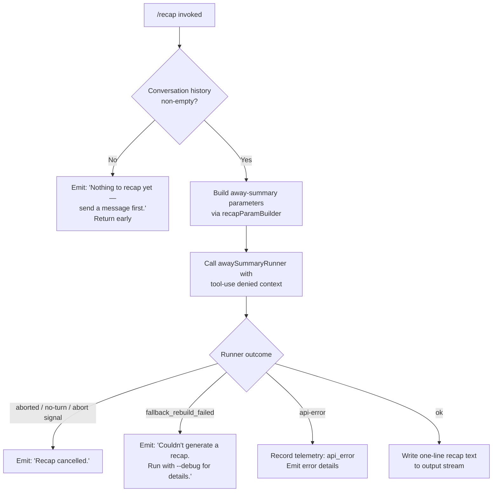

# `/recap`

> Analysis basis: CC v2.1.199 bundle.js (AST extraction + Claude interpretation)
> Minimum version: v2.1.199

---

## Overview

The `/recap` command immediately generates a one-line textual summary of the current session and posts it as a system-level message. It operates by invoking the away-summary pipeline (the same subsystem used for background/away summarisation) under a restricted, tool-less context and then emits the result through the normal output writer. When no conversation history is present, it exits early with a user-facing notice instead of calling the model.

---

## Registration

| Field | Value |
|---|---|
| type | `local` |
| name | `recap` |
| description | `Generate a one-line session recap now` |
| supportsNonInteractive | `true` |
| thinClientDispatch | `post-text` |
| load_inline | `true` |
| load_ident | `Mhm` |
| loc_byte | `13690739` |
| loc_byte_end | `13690955` |
| loc_line | `10104` |
| arbor_handler.name | `Mhm` |
| arbor_handler.fqn | `claude-2.1.199::Mhm` |
| arbor_handler.kind | `AsyncFunction` |
| arbor_handler.resolution_path | `load_ident` |
| arbor_handler.n_hits | `0` |

Analysis basis: CC v2.1.199 bundle.js:+13690739

---

## Input Branching

Four distinct terminal paths exist inside the handler, so a Mermaid flowchart is used.



Analysis basis: CC v2.1.199 bundle.js:+13690040 (entry), +13690401 (early-exit literal), +13690493 (cancellation literal), +13690554 (fallback-rebuild-failed literal), +13690629 (error literal), +13690302 (api_error path)

---

## Behavioral Spec

### Top-level handler — `recapHandler` (`Mhm`)

```
async function recapHandler(context):
    // Check whether there is anything to summarise
    history = recapParamBuilder(context)          // calls Rhm
    if history is empty or has no turns:
        writeOutput("Nothing to recap yet — send a message first.")
        return

    // Kick off the away-summary subsystem
    result = await awaySummaryRunner(context, history)   // calls Tqt

    // Dispatch on the outcome tag
    match result.status:
        case "aborted" | "no-turn" | "abort":
            writeOutput("Recap cancelled.")
        case "fallback_rebuild_failed":
            writeOutput("Couldn't generate a recap. Run with --debug for details.")
        case "api-error":
            recordTelemetry("api_error")
            writeOutput(result.errorDetails)
        case "ok":
            writeOutput(result.text)              // one-line recap line
```

Analysis basis: CC v2.1.199 bundle.js:+13690055 (call to `Tqt`), +13690110 (call to `Rhm`), +13690193 (call to `Le`/output writer), +13690283 (call to `we`/output writer)

---

### Parameter builder — `recapParamBuilder` (`Rhm`)

```
function recapParamBuilder(context):
    // Classify each message in the conversation
    for each message in context.messages:
        type = classifyMessageType(message)       // calls bz, xJe
        if type is a compact-boundary marker:     // "compact_boundary"
            record boundary position
        if isArray(message.content):
            flatten and filter content blocks     // calls e0, YZ

    // Assemble parameter object
    params = buildParamObject(
        filteredMessages,
        Promise.all(resolvedAttachments),         // calls Promise.all, Promise.resolve
        summaryStyle = "away_summary"             // Zfr, Hl, Ao helpers
    )

    // Apply shallow content slice via $h / aar helpers
    params.content = applyContentSlice(params)
    return params
```

Analysis basis: CC v2.1.199 bundle.js:+13688895 (call to `bz`), +13688939 (call to `xJe`), +13688952 (call to `e0`), +13689109 (Promise.all), +13689786 (call to `$h`), +13689152 (call to `Zfr`)

---

### Away-summary runner — `awaySummaryRunner` (`Tqt`)

```
async function awaySummaryRunner(context, params):
    // Gate: cached params must be present
    if not hasCacheSafeParams(context):
        log("[awaySummary] no CacheSafeParams saved, skipping")
        return { status: "no-turn" }

    // Set up abort controller and wire abort listener
    controller = new AbortController()
    context.addEventListener("abort", () => controller.abort())

    // Select model via model-resolution pipeline (Sfe → ks → Bo/MH)
    model = resolveModel(context)

    // Build the actual summary request — tool use is explicitly denied
    request = buildRequest(params, model, toolPolicy = "deny")
    // "Away summary cannot use tools" — tools are blocked for recap
    request.toolUsePolicy = "deny"

    // Execute streaming API call through the query pipeline (WR → utr → R3f)
    streamResult = await queryPipeline(request, controller.signal)

    // Interpret streaming outcome
    match streamResult:
        case { status: "aborted" }:   return { status: "aborted" }
        case { status: "failed" }:    return { status: "fallback_rebuild_failed" }
        case { status: "ok" }:
            recap = streamResult.messages.find(lastAssistantText)
            return { status: "ok", text: recap }
```

Analysis basis: CC v2.1.199 bundle.js:+8086158 (call to `Sfe`), +8086199 (literal `"aborted"`), +8086304 (literal `"failed"`), +8086365 (literal `"[awaySummary] no CacheSafeParams saved, skipping"`), +8086423 (literal `"no-turn"`), +8086479 (literal `"abort"`), +8086538 (call to `WR`), +8086656 (literal `"deny"`), +8086671 (literal `"Away summary cannot use tools"`), +8086739 (literal `"away_summary"`), +8086972 (literal `"api-error"`), +8087033 (literal `"ok"`), +8086460 (`e.addEventListener`), +8086491 (`r.abort`)

---

### Model resolver — `modelResolver` (`Sfe` → `ks` → `Bo` / `MH`)

```
function resolveModel(context):
    // Normalise raw model string: trim, lowercase
    raw = context.model.trim().toLowerCase()

    // Alias table (literals from Bo at +2347752–+2347978)
    aliases = {
        "fable":    <fable model id>,
        "opusplan": <opusplan model id>,
        "[1m]":     <1-million-context model id>,
        "sonnet":   <sonnet model id>,
        "haiku":    <haiku model id>,
        "opus":     <opus model id>,
        "best":     <best-available model id>,
        "nonconforming": <nonconforming model id>
    }

    // Apply alias or use raw; apply replace normalisation
    resolved = aliases[raw] ?? applyModelReplace(raw)

    // Build final model header object (MH helper at +2344358)
    return buildModelHeader(resolved)
```

Analysis basis: CC v2.1.199 bundle.js:+2331279 (`W6`), +2331315 (`Bo`), +2331328 (`MH`), +2347675 (`e.trim`), +2347686 (`t.toLowerCase`), +2347752–+2347978 (alias literals), +2348093 (`t.replace`)

---

### Query pipeline — `queryOrchestrator` (`WR`) and core loop (`R3f`)

The recap request is routed through the same agent query loop used for normal messages, but constrained to a single turn with tool use denied. Key behaviours of this path:

- `Date.now` timestamp is captured at entry (Analysis basis: +11431537).
- App-state is read via `e.getAppState` and written back via `e.setAppState` (Analysis basis: +11428339, +11429589).
- A UUID is generated for the request via `PBl.randomUUID` (Analysis basis: +11430916).
- The core loop (`R3f`) calls the model via `f.callModel` (Analysis basis: +11378722), manages streaming events, and handles the full suite of fallback / refusal / compact sub-paths — all inherited from the shared query engine.
- Because the recap context sets tool policy to `"deny"`, any tool-use response from the model is rejected and treated as a failed turn (Analysis basis: +8086656).
- Session-state compaction (`f.autocompact`) and the rapid-refill circuit-breaker are active in this code path but unlikely to trigger for a single recap turn (Analysis basis: +11370945, +11371119).

---

## State & Side Effects

| Item | Detail |
|---|---|
| Telemetry — query engine | `tengu_auto_compact_rapid_refill_breaker` (+11371153), `tengu_auto_compact_succeeded` (+11371673), `tengu_ptl_surfaced_to_user` (+11376603), `tengu_loggia_denkbild` (+11378076), `tengu_refusal_fallback_suppressed` (+11378376), `tengu_rotunda_pennant_applied` (+11380682), `tengu_rotunda_pennant_tools` (+11381808), `tengu_rotunda_pennant_chain_exhausted` (+11384371), `tengu_refusal_fallback_dialog_suppressed` (+11385378), `tengu_fallback_credit_forfeited` (+11386076), `tengu_refusal_fallback_triggered` (+11387336), `tengu_orphaned_messages_tombstoned` (+11388687), `tengu_refusal_fallback_supersedes` (+11390175), `tengu_model_fallback_triggered` (+11393288), `tengu_query_error` (+11393972), `tengu_model_response_keyword_detected` (+11395054), `tengu_malformed_tool_use_retry_outcome` (+11395660), `tengu_malformed_tool_use_response` (+11399938), `tengu_stop_hook_block_count` (+11402024), `tengu_loop_dynamic_wakeup_ends_turn` (+11405821), `tengu_post_autocompact_turn` (+11406005), `tengu_query_before_attachments` (+11406123), `tengu_query_after_attachments` (+11408449), `tengu_mcp_tools_refreshed_mid_turn` (+11408754) |
| Telemetry — feature gate | `tengu_feature_ok` (+1039941), `tengu_feature_bad` (+1040008) |
| Telemetry — fork/agent | `tengu_forked_agent_default_turns_exceeded` (+11433194), `tengu_fork_agent_query` (+11433637) |
| Telemetry — command-level | `recap_command` string recorded at +13690196; `api_error` path at +13690302 |
| appState changes | `e.getAppState` / `e.setAppState` called inside `utr` (query state manager) — recap turn is tracked in session state like a normal turn (Analysis basis: +11428339, +11429589) |
| Output stream | Text written via `o.write` / `o.flush` helpers (`T` at +218444, +218459); recap dispatcher calls `Le` (+13690193) and `we` (+13690283) writers |
| Hook registration | Signal-handler `process.on("exit", …)` registered inside `Sdu` transcript logger (+217899); `bfs.register` hook inside `Ai` (+69837) |
| Transcript / log | `Sdu` appends the recap turn to the session transcript file via `s$.appendFile` (+217413); directory created with `s$.mkdir` if absent (+217354) |
| Tool use | Unconditionally denied for the recap call ("Away summary cannot use tools", +8086671); policy tag `"deny"` at +8086656 |
| Sound | <!-- TODO: not found in depth-2 traversal; needs --depth 4 --> |
| thinClientDispatch | `post-text` — the recap result is posted as a text message in thin-client / non-interactive mode (registration field) |

---

## Version History

| Version | Change |
|---|---|
| v2.1.199 | Initial analysis |

---

## Common Mistakes

1. **Running `/recap` before sending any message.** The command checks conversation history and, if empty, immediately prints `"Nothing to recap yet — send a message first."` without calling the model. This is intentional; users should not expect a recap to be generated from an empty session.

2. **Expecting tool-augmented recaps.** The away-summary pipeline that `/recap` reuses is explicitly configured with a `"deny"` tool policy. Any mental model of the recap as an agent turn that can read files or run commands is incorrect.

3. **Assuming `/recap` blocks the session.** Because `thinClientDispatch` is `post-text` and `supportsNonInteractive` is `true`, the command is designed to function in CI / headless environments where there is no interactive TTY.

4. **Interpreting the `fallback_rebuild_failed` error as a network issue.** This specific status means the away-summary subsystem could not reconstruct a fallback prompt, not that the network call itself failed. Enabling `--debug` will expose the underlying cause in the transcript.

5. **Expecting the recap to consume or alter conversation history.** The command is read-only with respect to the visible conversation — it does append a record to the internal session transcript (via `s$.appendFile`), but it does not add assistant turns to the chat history visible to the user.

---

## Appendix — Identifier Mapping

> For bundle debugging only. Identifiers change across versions.

| Identifier | Role |
|---|---|
| `Mhm` | Top-level recap handler (`recapHandler`) — AsyncFunction; entry point resolved via `load_ident` |
| `Tqt` | Away-summary runner (`awaySummaryRunner`) — orchestrates the model call for recap |
| `Sfe` | Model resolution dispatcher — routes to alias lookup and normalisation |
| `ks` | Model string normaliser — calls `W6` (model key builder) and `Bo` / `MH` (header builders) |
| `W6` | Model key builder — calls string utilities `u_`, `x3`, `ts`, `za` |
| `Bo` | Model alias table and header field builder — contains the alias literals |
| `MH` | Model header object assembler — delegates to `Bo` and `fv` |
| `T` | Output-pipeline entry / transcript formatter |
| `gdu` | Transcript formatter helper |
| `vfs` | Transcript stream writer helpers (`Slu`, `Alu`) |
| `xe` | JSON-stringify wrapper for debug payloads |
| `Nc` | Content normaliser / redactor (`[REDACTED]` logic) |
| `phs` | Content-block map helper |
| `ntt` | Transcript write dispatcher |
| `ths` | Raw stream writer (`e.write`) |
| `Sdu` | Session transcript manager — handles file append, exit hook, signal binding |
| `Let` | Debounced batch writer (uses `setTimeout`, `setImmediate`, `clearTimeout`) |
| `Ile` | Transcript path resolver |
| `ydu` | Async file append worker (`s$.mkdir`, `s$.appendFile`) |
| `Ai` | Hook registry helper (`bfs.register`) |
| `yle` | EISDIR-safe writer wrapper |
| `hhs` | Path-join helper for transcript directory |
| `WR` | Query orchestrator (`queryOrchestrator`) — captures timestamp, builds request UUID, calls `utr` / `GU` / `K3f` |
| `utr` | Query state manager — reads/writes appState, manages file history ops, handles spend/billing checks |
| `m4` | Request builder for streaming API |
| `qoe` | Store dump/load helper for session state |
| `yDe` | Pre-request validation helper |
| `PDa` | Parameter assembler for API request |
| `Rsr` | Response post-processor |
| `VP` | UUID / random-bytes generator for request IDs |
| `dtr` | Request metadata decorator |
| `Lpe` | MCP / plugin loader for tool context |
| `ru` | Plugin process-signal registration |
| `MYe` | Tool-list filter (filters by `"ant"` prefix) |
| `GU` | Subagent / turn dispatcher — calls `R3f` (core loop) and `J3n` (subagent cleanup) |
| `R3f` | Core agent query loop — streaming, tool execution, fallback, compact logic |
| `J3n` | Subagent exit / cleanup handler |
| `Le` | Feature-gate OK writer — also used as output writer in `Mhm`; emits `tengu_feature_ok` |
| `we` | Feature-gate bad writer — also used as error output writer in `Mhm`; emits `tengu_feature_bad` |
| `qP` | Turn-type classifier |
| `e7e` | Notification-type membership checker (`NIf.has`) |
| `Rie` | Response integrity checker |
| `Psr` | Post-stream result assembler |
| `WSl` | Streaming-window limiter |
| `yV` | Path normaliser (Windows/POSIX, `t.replaceAll`) |
| `wpe` | Tool-set merger — filters and pushes tools into request |
| `xE` | Tool-use schema validator |
| `jDp` | Tool finder (`e.find`) |
| `V` | Result-type value constructor (used across multiple call sites) |
| `K3f` | Fork-agent query wrapper — calls `V`, `Pe`, `mr`; emits `tengu_fork_agent_query` |
| `Pe` | Result wrapper / `GZe` gateway |
| `mr` | Model-refusal classifier (`Zf`, `qe`; emits `"nonconforming"`) |
| `Pn` | Message-object builder — assigns UUID via `j1.randomUUID` |
| `y` | Message content builder |
| `_` | Conversation-state accessor |
| `eXa` | Message flattener (`e.flatMap`) |
| `Rhm` | Recap parameter builder (`recapParamBuilder`) — classifies messages, builds param object |
| `bz` | Message type classifier — checks `dDe` set membership |
| `xJe` | Content-block classifier — handles arrays, `bz` delegation, `indexOf` / `startsWith` checks |
| `e0` | Content-block normaliser |
| `YZ` | Array-safe content unwrapper (`_l` helper) |
| `hee` | Prefix-check helper (`e.startsWith`) |
| `$h` | Content slicer — delegates to `aar` for boundary detection |
| `aar` | Compact-boundary detector (`"compact_boundary"` literal at +14318810); calls `xE` |