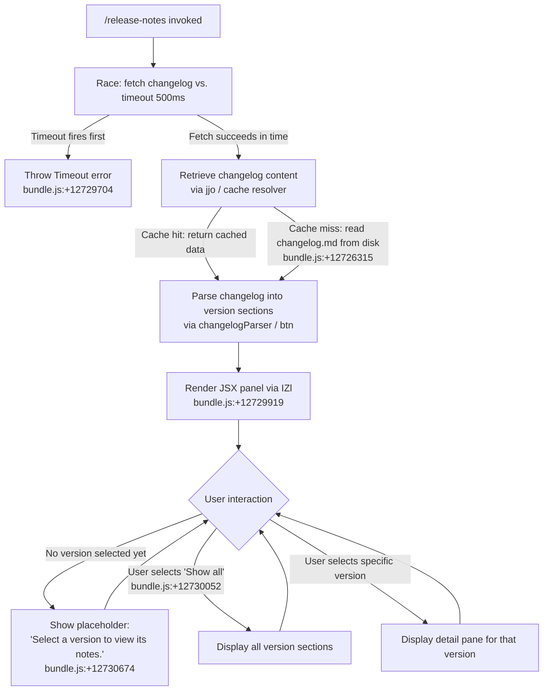

# `/release-notes`

> Analysis basis: CC v2.1.199 bundle.js (AST extraction + Claude interpretation)
> Minimum version: v2.1.199

---

## Overview

The `/release-notes` command opens an interactive JSX-rendered panel that fetches and displays the changelog for Claude Code, allowing users to browse release notes across versions. It resolves the changelog from a local cache path (keyed to `changelog.md`), parses the content into version-keyed sections, and presents a version-selector list alongside a detail pane that shows the notes for the selected version.

---

## Registration

| Field | Value |
|---|---|
| type | `local-jsx` |
| name | `release-notes` |
| description | `View release notes` |
| loc_byte | `12731364` |
| loc_byte_end | `12731505` |
| loc_line | `9361` |
| module_id | `CZl` |
| load_inline | `true` |
| arbor_handler.name | `zem` |
| arbor_handler.fqn | `claude-2.1.199::zem` |
| arbor_handler.kind | `AsyncFunction` |
| arbor_handler.resolution_path | `module_id` |
| arbor_handler.n_hits | `0` |

Analysis basis: CC v2.1.199 bundle.js:+12731364

---

## Input Branching

The command has 3+ distinct internal paths: (1) timeout/race failure, (2) successful changelog fetch with version list rendering, and (3) individual version selection updating the detail pane. A Mermaid flowchart is used.



---

## Behavioral Spec

### 1. Handler Entry — `zem` (AsyncFunction)

The Arbor-resolved handler `zem` is the async entry point for `/release-notes`.

Analysis basis: CC v2.1.199 bundle.js:+12729680

```
async function releaseNotesHandler(context):
    // Race the changelog fetch against a hard timeout
    timeoutPromise = new Promise((_, reject) =>
        setTimeout(() => reject(new Error("Timeout")), 500)
    )
    // bundle.js:+12729704, +12729716

    changelogResult = await Promise.race([
        fetchChangelog(context),   // jjo path
        timeoutPromise
    ])
    // bundle.js:+12729730

    parsedSections = parseChangelog(changelogResult)   // kur / btn path
    // bundle.js:+12729781

    sectionMap = buildSectionMap(parsedSections)       // Ib
    // bundle.js:+12729812

    return renderJSX(sectionMap, context)              // BXe.jsx
    // bundle.js:+12729919
```

### 2. Changelog Fetch — `fetchChangelog` (maps to `jjo`)

Resolves the changelog content. Checks an in-memory cache (`m_.get`) keyed by the cache path, falling back to reading `changelog.md` from disk.

Analysis basis: CC v2.1.199 bundle.js:+12729744

```
async function fetchChangelog(context):
    cacheDir = resolveCacheDir(context)       // Wjo: joins path with "cache"
    // bundle.js:+12726307, +12726315

    cacheKey = buildCacheKey(cacheDir)        // Hr / Pi / KTs
    // bundle.js:+12726559

    if memoryCache.has(cacheKey):             // m_.get
        return memoryCache.get(cacheKey)
    // bundle.js:+12726604

    asyncStoreCtx = getAsyncStore()           // Qs / EId.getStore
    // bundle.js:+12726682

    workDir = path.dirname(cacheDir)          // Stn.dirname
    // bundle.js:+12726693

    timestamp = Date.now()
    // bundle.js:+12726743

    content = await persistentFetch(cacheKey, workDir, timestamp)   // Hn
    // bundle.js:+12726760

    if content was fetched with HTTP 200:
        // bundle.js:+12726628
        memoryCache.set(cacheKey, content)

    return content
```

### 3. Cache Directory Resolution — `resolveCacheDir` (maps to `Wjo`)

Constructs the path to the changelog cache file by joining a path segments array (`Stn.join`) with the string `"cache"` and then `"changelog.md"`.

Analysis basis: CC v2.1.199 bundle.js:+12726293, +12726302, +12726307, +12726315

```
function resolveCacheDir(context):
    segments = pathSegments.join(separator)    // Stn.join
    baseDir  = resolveTransport(segments)      // tr
    return path.join(baseDir, "cache", "changelog.md")
```

### 4. Changelog Parser — `parseChangelog` (maps to `kur` + `btn`)

Tokenises the raw markdown text into an ordered list of `{version, lines[]}` objects. Entries are separated by heading markers; each version block's bullet lines are trimmed and prefixed with `"- "`.

Analysis basis: CC v2.1.199 bundle.js:+12727643, +12727660

```
function parseChangelog(rawText):
    lines = rawText.split("\n")                // btn: e.split — bundle.js:+12727004
    sections = []
    current = null

    for line of lines:
        trimmed = line.trim()                  // r.trim — bundle.js:+12727053
        if isVersionHeading(trimmed):          // oi: e.indexOf / e.slice
            // bundle.js:+12727130
            if current != null:
                sections.push(current)
            current = {version: extractVersion(trimmed), lines: []}
        else if trimmed != "":
            bulletText = trimmed.slice(offset)   // o.slice — bundle.js:+12727170
            current.lines.push("- " + bulletText.trim())
            // bundle.js:+12727193, +12727213

    if current != null:
        sections.push(current)

    // Apply section key extraction (Ib), error logging (ke / sr)
    // bundle.js:+12727701, +12727872
    return sections
```

Separator literal `" - "` is used when joining version heading fragments (bundle.js:+12727135).

### 5. Section Map Builder — `buildSectionMap` (maps to `Ib`)

Reduces the parsed sections array into a `Map<string, string[]>` keyed by normalized version string.

Analysis basis: CC v2.1.199 bundle.js:+12729812

```
function buildSectionMap(sections):
    map = new Map()
    for section of sections:
        map.set(section.version, section.lines)
    return map
```

### 6. JSX Renderer — `renderJSX` (maps to `IZl`)

Builds the interactive React component tree that is rendered in the terminal UI. Uses React memo-cache sentinel (`"react.memo_cache_sentinel"`) for memoisation.

Analysis basis: CC v2.1.199 bundle.js:+12729919, +12729973

```
function ReleaseNotesComponent({sectionMap, context}):
    cache = useReactMemoCache(20)          // bZl.c, sentinel at bundle.js:+12730542
    // initial slot count: 20 — bundle.js:+12729979

    versionList = Array.from(sectionMap.keys())
    // Mapped over with n.map — bundle.js:+12730150

    [selectedVersion, setSelectedVersion] = useState(null)

    // Layout constants (column widths, row heights):
    //   3, 4, 6, 7, 8, 9, 10 used for flex/grid sizing
    //   bundle.js:+12730135, +12730178, +12730220, +12730427, +12730459, +12730508, +12730536

    if sectionMap is empty OR selectedVersion is null:
        detailContent = "Select a version to view its notes."
        // bundle.js:+12730674
    else if selectedVersion == "Show all":
        // bundle.js:+12730052
        detailContent = renderAllSections(versionList, sectionMap)
    else:
        detailContent = renderSingleSection(sectionMap.get(selectedVersion))

    // Entries marked "skip" are excluded from the list
    // bundle.js:+12730357

    headerText = "Release notes"           // bundle.js:+12731025

    return jsx(
        layout="column",                   // bundle.js:+12730609
        children=[
            jsx(VersionList, {
                items: versionList,
                selected: selectedVersion,
                onSelect: setSelectedVersion,
                showAll: "Show all"
            }),
            jsx(DetailPane, {
                content: detailContent,
                header: headerText
            })
        ]
    )
    // BXe.jsx / BXe.jsxs — bundle.js:+12730584, +12731006
```

Memo-cache slot indices used: 3, 4, 6, 7, 8, 9, 10, 11, 12, 13, 14, 15, 16, 17, 18, 19 (bundle.js:+12730135 through +12731087).

### 7. Version List Item Renderer — `renderVersionListItem` (maps to `TZl`)

Renders an individual row in the version list. Trims long version strings via `e.slice` and formats them with the `Ib` formatter. Delegates row painting to `Vjo` (the row painter).

Analysis basis: CC v2.1.199 bundle.js:+12729555, +12729581, +12729608

```
function renderVersionListItem(version, isSelected):
    displayText = version.slice(0, MAX_DISPLAY_LENGTH)   // e.slice
    formatted   = formatEntry(displayText)               // Ib
    return rowPainter(formatted, isSelected)             // Vjo
```

### 8. Row Painter — `rowPainter` (maps to `Vjo`)

Maps an array of entry descriptors to rendered row elements, applying selection highlight where applicable.

Analysis basis: CC v2.1.199 bundle.js:+12729480

```
function rowPainter(entries, context):
    return entries.map(entry => renderRow(entry, context))
```

### 9. Persistent Fetch / Config-Locked Write subsystem — `persistentFetch` (maps to `Hn` → `YTm` → `don` / `Jgr`)

The changelog fetch ultimately writes to and reads from disk under a file-system lock. Key behaviours:

- Lock acquisition timeout: **100 ms** threshold before emitting `tengu_config_lock_contention` (bundle.js:+14384752, +14384847).
- Lock directory sentinel uses `EEXIST` semantics with a **60 000 ms** maximum wait (bundle.js:+14386206, +14386229).
- Up to **5** backup files are retained; older ones are unlinked (bundle.js:+14386501).
- Backup filenames contain the substring `".backup."` (bundle.js:+14386360).
- File encoding: `"utf-8"` (bundle.js:+14383029).
- Parse errors during re-read trigger auto-repair (emits `tengu_config_auto_repaired`); see GH #3117 (bundle.js:+14385256).
- Auth-loss guard: if a re-read result is missing auth that the cache holds, the write is refused and `tengu_config_auth_loss_prevented` is emitted (bundle.js:+14385902, +14386054).

```
async function persistentFetch(cacheKey, workDir, timestamp):
    lockPath = path.join(workDir, lockFilename)
    await acquireLock(lockPath, maxWait=60000)     // don: i.mkdir EEXIST loop

    try:
        existing = await fs.stat(cacheKey)         // don: i.stat
        if exists AND fresh:
            return readCached(cacheKey)            // zt / con

        raw = await networkFetch(cacheKey)         // YTm sub-pipeline
        if raw.status == 200:
            await writeWithBackup(cacheKey, raw, maxBackups=5)
            // don: i.copyFile, i.unlink, L.slice
        return raw.content
    finally:
        await releaseLock(lockPath)                // don: i.unlink on lock
```

---

## State & Side Effects

| Item | Detail |
|---|---|
| Telemetry | `tengu_config_lock_contention` (bundle.js:+14384847) — emitted when lock acquisition exceeds 100 ms threshold |
| Telemetry | `tengu_config_stale_write` (bundle.js:+14384985) — emitted when a stale write is detected |
| Telemetry | `tengu_config_auto_repaired` (bundle.js:+14385384) — emitted on automatic parse-error recovery (GH #3117) |
| Telemetry | `tengu_config_auth_loss_prevented` (bundle.js:+14386054) — emitted when a write is refused to protect auth data |
| Telemetry | `tengu_config_fallback_write` (bundle.js:+14384448) — emitted on fallback write path |
| File system | Reads `changelog.md` from the resolved cache directory (bundle.js:+12726315) |
| File system | Writes changelog data to disk under a file-system lock with backup rotation (max 5 backups) |
| File system | Creates and removes a lock directory using `mkdir`/`unlink` with EEXIST/ENOENT handling (bundle.js:+14386206, +14385115) |
| Memory cache | Stores fetched changelog content in `m_` (in-process Map) keyed by cache path (bundle.js:+12726604) |
| UI rendering | Mounts an interactive JSX panel (`local-jsx` type); does not send any prompt to the AI agent |
| Error logging | CLI error string `"cli_error"` passed to `console.error` via `gJe` on fatal errors (bundle.js:+13343426) |
| Process exit | `process.exit` called via `Ts` on unrecoverable errors (bundle.js:+13343439) |
| Timeout | 500 ms hard deadline on changelog fetch via `Promise.race` (bundle.js:+12729716) |

---

## Version History

| Version | Change |
|---|---|
| v2.1.199 | Initial analysis |

---

## Common Mistakes

1. **Expecting AI-generated content**: `/release-notes` is a `local-jsx` command — it renders a static interactive panel from the cached changelog file. It does not invoke the Claude model or send a prompt.
2. **Assuming instant availability**: The command races fetch against a 500 ms timeout (bundle.js:+12729716). On slow or cold-cache systems the panel may fail to open if the changelog cannot be resolved in time.
3. **Confusing the lock with a global write lock**: The file-system lock used here (`mkdir`/EEXIST pattern with 60 000 ms max wait) is scoped to changelog cache writes, not to the entire Claude Code config. However, contention will be reported via `tengu_config_lock_contention`.
4. **Expecting the "Show all" option always visible**: The `"Show all"` entry appears in the version list only when the parsed changelog contains multiple version sections. An empty or single-section changelog will render the placeholder text `"Select a version to view its notes."` in the detail pane.
5. **Misinterpreting `"skip"` entries**: Version list items tagged `"skip"` (bundle.js:+12730357) are silently filtered out of the visible list; they are not errors.

---

## Appendix — Identifier Mapping

> For bundle debugging only. Identifiers change across versions.

| Identifier | Role |
|---|---|
| `zem` | Main async handler for `/release-notes` (Arbor-resolved; `AsyncFunction`) |
| `IZl` | JSX component — top-level release-notes panel renderer |
| `TZl` | Version list item renderer (slice + format + row paint) |
| `Vjo` | Row painter — maps entry descriptors to rendered rows |
| `jjo` | Changelog fetch orchestrator (cache check → disk read → HTTP fetch) |
| `Wjo` | Cache directory resolver (joins path segments + `"cache"` + `"changelog.md"`) |
| `kur` | Outer changelog parser (splits raw text, delegates to `btn`) |
| `btn` | Inner line-level parser (split, trim, heading detection) |
| `oi` | Version heading extractor (indexOf + slice) |
| `Ib` | Section/entry formatter (normalises keys, formats display strings) |
| `Hn` | Persistent fetch coordinator (config-locked write subsystem) |
| `YTm` | Network fetch sub-pipeline within persistent fetch |
| `don` | Config-file write-with-lock implementation (mkdir lock, copyFile, unlink) |
| `Jgr` | Config save (locked path, fallback write path) |
| `con` | Config re-read under lock |
| `lon` | Config fallback read helper |
| `Atn` | Secondary cache/context resolver (Wjo + Qs path) |
| `Hr` | Cache key seed builder |
| `Pi` | Cache key finaliser (delegates to `KTs`) |
| `KTs` | Key transformer (delegates to `at`) |
| `at` | Low-level string coercion (String()) |
| `Qs` | Async store accessor (EId.getStore) |
| `Wgr` | Entry metadata mapper (Object.entries) |
| `oon` | Section object builder (Object.entries) |
| `Ygr` | In-flight dedup cache (qgr.get/set, f7.get/set/delete) |
| `WJo` | Promise-dedup worker (vy, zt, f7.get, GJo, hae) |
| `Hbc` | Fetch initiator (ite, Date.now) |
| `BJo` | Fetch base resolver |
| `Ts` | Fatal error handler (gJe + xI + process.exit) |
| `gJe` | Error formatter (console.error + St.red) |
| `xI` | Error file writer (Ale.writeFileSync + Owr.join) |
| `ke` | Section error logger (sr + at + Pi + Gku + fne.logError) |
| `sr` | Error constructor wrapper (Error + String) |
| `Gku` | Log buffer manager (ahn.shift + ahn.push) |
| `Wfc` | Telemetry/context emitter reached via `l` (Qne, Date.now, Qs, Bnn, xe) |
| `xur` | Outer parser helper called by `kur` |
| `bZl` | React memo-cache module (`.c` method used for slot allocation) |
| `BXe` | JSX runtime (`.jsx` / `.jsxs`) |

---

Note: index built via Arbor fallback; some signals (telemetry, literals) may be missing — see arbor-fallback.js.