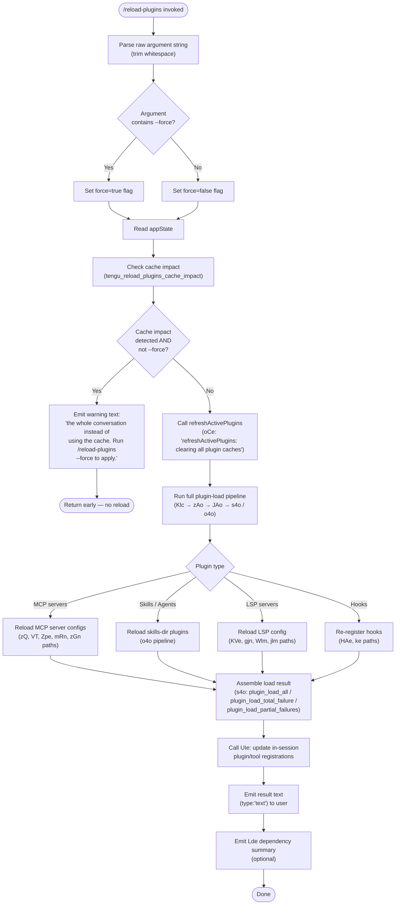

# `/reload-plugins`

> Analysis basis: CC v2.1.199 bundle.js (AST extraction + Claude interpretation)
> Minimum version: v2.1.199

---

## Overview

`/reload-plugins` activates pending plugin changes in the current session by rescanning and reinitializing all registered plugins (MCP servers, skills, agents, LSP servers, and hooks) without requiring a full session restart. It optionally accepts `--force` to bypass prompt-cache-aware restrictions that would otherwise require re-sending the entire conversation context.

---

## Registration

| Field | Value |
|---|---|
| type | `local` |
| name | `reload-plugins` |
| description | `Activate pending plugin changes in the current session` |
| argumentHint | `[--force]` |
| supportsNonInteractive | `false` |
| thinClientDispatch | `control-request` |
| module_id | `Ylc` |
| load_inline | `true` |
| loc_byte | `13215551` |
| loc_byte_end | `13215795` |
| loc_line | `9848` |
| arbor_handler.name | `Vlm` |
| arbor_handler.fqn | `claude-2.1.199::Vlm` |
| arbor_handler.kind | `AsyncFunction` |
| arbor_handler.resolution_path | `module_id` |
| arbor_handler.n_hits | `0` |

Analysis basis: CC v2.1.199 bundle.js:+13215551

---

## Input Branching

The handler exhibits four or more distinct branches based on argument parsing, cache-impact detection, and plugin type routing; a flowchart is used.



Analysis basis: CC v2.1.199 bundle.js:+13214237 (handler entry `Vlm`), +13214628 (trim), +13214664 (--force literal), +13214696 (`Klc` invocation), +13214848 (`zlc`/cache-impact check), +13214974 (`oCe` refresh), +13215006 (`UIe` update), +13215049 (`Lde` summary)

---

## Behavioral Spec

### Handler Entry (asyncPluginReloadHandler)

```
async function asyncPluginReloadHandler(context, rawArg):
    trimmedArg = rawArg.trim()
    forceFlag  = trimmedArg.includes("--force")   # literal "--force" / "force"

    appState = context.getAppState()              # loc +13214742

    cacheImpact = checkCacheImpact(appState)      # zlc → V, loc +13214848
    if cacheImpact AND NOT forceFlag:
        emit telemetry tengu_reload_plugins_cache_impact   # loc +13213524
        return { type: "text", text: "...the whole conversation instead of using the cache. Run /reload-plugins --force to apply." }

    results = await runPluginLoadPipeline(context, forceFlag)
    toolSummary = await updateSessionPlugins(context, results)    # UIe, loc +13215006
    dependencySummary = buildDependencySummary(results)           # Lde, loc +13215049
    return { type: "text", text: formatLoadResult(results) }
```

Analysis basis: CC v2.1.199 bundle.js:+13214237

---

### Cache-Impact Check (cacheImpactChecker)

```
function cacheImpactChecker(appState):
    # zlc calls V internally
    # returns bool: true if reloading would invalidate the conversation prompt cache
    return internalCacheStateCheck(appState)   # V, loc +13213522
```

Analysis basis: CC v2.1.199 bundle.js:+13213522

---

### Plugin Load Pipeline (runPluginLoadPipeline)

```
async function runPluginLoadPipeline(context, force):
    # Klc dispatches to zAo, which fans out to JAo and zQ
    # JAo handles the "skills-dir" path (o4o) and the MCP assembly path (s4o)
    # zQ handles MCP config discovery and server lifecycle

    mcpConfig    = await discoverMcpConfig(context)          # zQ → VT → Zpe etc.
    pluginState  = await loadAllPlugins(context, mcpConfig)  # JAo → s4o + o4o

    # Telemetry emitted inside s4o depending on outcome:
    #   "plugin_load_all"             — all plugins loaded   loc +11719614
    #   "plugin_load_total_failure"   — nothing loaded       loc +11719632
    #   "plugin_load_partial_failures"— some failed          loc +11719701

    return pluginState
```

Analysis basis: CC v2.1.199 bundle.js:+13213248 (`Klc` → `zAo`), +13213381 (`t1`), +13213387 (`cQ`), +13213408 (`cE`)

---

### MCP Config Discovery (discoverMcpConfig)

```
async function discoverMcpConfig(context):
    # zQ reads .mcp.json files across scopes:
    #   "projectSettings" scope → .mcp.json in project directories   loc +7377788
    #   "user" scope                                                  loc +7378578
    #   "local" scope                                                 loc +7378780
    #   "enterprise" scope                                            loc +7378921
    #   "mcpAutoDiscovered"                                           loc +7379529
    # Validates entries; records errors like "mcp-config-invalid"     loc +7380108
    # Suppresses duplicate servers: "mcp-server-suppressed-duplicate" loc +7381585
    # Applies approval state: "approved" / "pending"                  loc +7380615, +7380642
    # Connects servers (zGn) and assigns tool lists

    scopes = ["projectSettings", "user", "local", "enterprise", "mcpAutoDiscovered"]
    configs = {}
    for scope in scopes:
        configs[scope] = readMcpJsonForScope(scope)   # VT, loc +7379669
    merged = mergeMcpConfigs(configs)                 # Zpe, mRn, CE paths
    return merged
```

Analysis basis: CC v2.1.199 bundle.js:+7379526 (`Mc`), +7379565 (`aB`), +7379669 (`VT`), +7379744 (`Zpe`)

---

### Skills / Agent Plugin Loading (loadSkillsAndAgents)

```
async function loadSkillsAndAgents(context, mcpConfig):
    # o4o orchestrates skills-dir scanning
    # Reads "skills-dir" entries                    loc +11696639
    # Resolves each plugin entry:
    #   "unresolved"                                loc +11697150
    #   "renamed"                                   loc +11697340
    #   "target-missing"                            loc +11697452
    #   "plugin-renamed"                            loc +11697707
    #   "marketplace-blocked-by-policy"             loc +11698152
    #   "marketplace-not-found"                     loc +11698705
    #   "marketplace-load-failed"                   loc +11698897
    #   "cache-miss"                                loc +11698953
    #   "plugin-not-found"                          loc +11698991
    #   "plugin-not-installed"                      loc +11699553
    # Uses Promise.allSettled to tolerate per-plugin failures  loc +11698044
    # Checks for "ineffective-disable" warnings                loc +11719499
    # Assembles final result; aborts side-effects if cwd changed mid-scan:
    #   "assemblePluginLoadResult: originalCwd changed mid-scan; skipping side-effects (stale early-kick)"
    #                                               loc +11719767

    entries  = scanSkillsDir(context)
    settled  = await Promise.allSettled(entries.map(loadPlugin))
    result   = assemblePluginLoadResult(settled)
    return result
```

Analysis basis: CC v2.1.199 bundle.js:+11696370 (`o4o`), +11718374 (`s4o` → `ar`)

---

### Active-Plugin Refresh (refreshActivePlugins)

```
async function refreshActivePlugins(context):
    # oCe: logs "refreshActivePlugins: clearing all plugin caches"  loc +13211182
    # Clears caches via:
    #   z9l → T                          loc +11629499 ("Cleared installed plugins cache")
    #   Bh → f5f, ak, Oj, Xdo, sW
    #     sW: QQt.clear()                loc +11560023
    #     ak → KW → e.clearSkillIndexCache()  loc +13810733
    # Loads new plugin manifest via hse  loc +13211486
    # Loads LSP config via KVe          loc +13211648
    # Resolves dependencies via Lde     loc +13211878, +13211911
    # Emits plugin-changed event via V2.emit  loc +13212308

    clearPluginCaches()      # z9l, sW
    clearSkillIndexCache()   # ak → KW
    newState = await loadPluginManifests()   # hse, KVe
    newState = resolveDependencies(newState) # Wlm, jlm
    emitPluginChanged(newState)             # V2.emit
    return newState
```

Analysis basis: CC v2.1.199 bundle.js:+13211180 (`oCe`), +13211182 (log literal), +13211240 (`Bh`), +13211289 (`Promise.all`), +13212308 (`V2.emit`)

---

### In-Session Plugin/Tool Update (updateSessionPlugins)

```
async function updateSessionPlugins(context, pluginState):
    # UIe: updates live tool registrations for the running session
    # Reads existing plugin registry  t.get, t.set  loc +12431887, +12431923
    # Resolves marketplace entries    aP → hm       loc +12432049
    # Validates with wWe, kn, vD, Zo               loc +12432072, +12432076, +12432124
    # Runs dependency resolution Db, HZt             loc +12432189, +12432724
    # Applies MCP updates via HZt → X → uSr (e.applyMcpUpdate)  loc +17703930
    # Registers plugin_installed telemetry            loc +11664986

    currentRegistry = getPluginRegistry()
    newRegistry     = mergePluginState(currentRegistry, pluginState)
    applyMcpConnectionUpdates(newRegistry)   # HZt → X → uSr
    registerHooks(newRegistry)               # HAe path
    return newRegistry
```

Analysis basis: CC v2.1.199 bundle.js:+12431887 (`UIe`), +11656766 (`HZt`), +17703930 (`uSr → e.applyMcpUpdate`)

---

### Argument Parsing (parseReloadArgs)

```
function parseReloadArgs(rawArg):
    # qlm splits the raw argument string on whitespace  loc +13214019
    # checks for "--force" / "force" literal            loc +13214664, +13214679
    tokens = rawArg.split(whitespace)
    return { force: tokens.includes("--force") }
```

Analysis basis: CC v2.1.199 bundle.js:+13214019 (`qlm`), +13214664 (literal `--force`)

---

### Plugin-Type Classification (classifyPluginEntry)

```
function classifyPluginEntry(entry):
    # jee dispatches on plugin type string   loc +13214333
    # Known type literals:
    #   "plugin"            loc +13214354
    #   "skill"             loc +13214386
    #   "agent"             loc +13214415
    #   "plugin MCP server" loc +13214448
    # Separates entries with " · "          loc +13214475
    # Marks errors with "error" status      loc +13214531

    switch entry.type:
        case "plugin", "skill", "agent":
            return routeToSkillsPipeline(entry)
        case "plugin MCP server":
            return routeToMcpPipeline(entry)
        default:
            return { status: "error" }
```

Analysis basis: CC v2.1.199 bundle.js:+13214333 (`jee`), +13214354–+13214531 (type/status literals)

---

### Dependency Summary Builder (buildDependencySummary)

```
function buildDependencySummary(pluginState):
    # Lde: maps plugin entries to dependency strings  loc +13215049
    # Uses Zo for scope parsing, ln for formatting
    # Produces joined dependency list for display

    entries = pluginState.entries
    lines   = entries.map(e => formatDependencyLine(e))   # Zo, loc +4421411
    return lines.filter(Boolean).join(separator)
```

Analysis basis: CC v2.1.199 bundle.js:+13215049 (`Lde`), +4421400–+4421505

---

## State & Side Effects

| Item | Detail |
|---|---|
| Telemetry: `tengu_reload_plugins_cache_impact` | Fired when a cache-impacting reload is blocked (user must pass `--force`) · loc +13213524 |
| Telemetry: `tengu_plugin_state_file_error` | Fired when a plugin state file cannot be read/parsed · loc +11629680 |
| Telemetry: `tengu_feature_ok` / `tengu_feature_bad` / `tengu_feature_sad` | Feature gate events emitted along handler call path · loc +1039941, +1040008, +1040089 |
| Plugin cache clear | `QQt.clear()` (sW) and `e.clearSkillIndexCache()` (KW) are called unconditionally on reload · loc +11560023, +13810733 |
| MCP connection updates | `e.applyMcpUpdate()` is called via `uSr` to apply new server configs to live connections · loc +17703930 |
| Hook re-registration | Plugin hooks are re-registered via `HAe`; safe-mode skips this ("Safe mode: skipping plugin hook registration") · loc +5454310 |
| LSP server update | LSP config reloaded via `KVe`; LSP extension conflicts reported as `"lsp-extension-conflict"` · loc +7614682 |
| `V2.emit` plugin-changed event | Notifies the rest of the session that plugin state has changed · loc +13212308 |
| `thinClientDispatch` | Set to `"control-request"` — on thin clients the command is forwarded as a control request rather than executed locally |
| `supportsNonInteractive` | `false` — command cannot be used in non-interactive (pipe/headless) mode |
| Sound | None observed in depth-2 traversal |

---

## Version History

| Version | Change |
|---|---|
| v2.1.199 | Initial analysis |

---

## Common Mistakes

1. **Omitting `--force` when cache is active.** If the session has an active prompt cache, running `/reload-plugins` without `--force` will be blocked and return a warning. Pass `/reload-plugins --force` to proceed; be aware this causes the entire conversation context to be re-sent on the next model call.
2. **Expecting non-interactive support.** `supportsNonInteractive: false` means this command silently does nothing or errors in headless/pipe sessions; it must be invoked inside an interactive Claude Code session.
3. **Assuming instant effect on thin clients.** `thinClientDispatch: "control-request"` means in thin-client deployments the command is relayed as a control request; effects may be asynchronous relative to the client display.
4. **Not checking partial-failure output.** The reload pipeline uses `Promise.allSettled` internally, so some plugins may fail while others succeed. Check the output text for `plugin_load_partial_failures` conditions rather than assuming all-or-nothing semantics.
5. **Using yarn or pnpm lockfiles for plugin dependencies.** The loader skips plugins that use yarn/pnpm lockfiles (`Skipped: yarn/pnpm lockfiles are not supported`); use bun or npm lockfiles instead.

---

## Appendix — Identifier Mapping

> For bundle debugging only. Identifiers change across versions.

| Identifier | Role |
|---|---|
| `Vlm` | Main async handler for `/reload-plugins` (asyncPluginReloadHandler) |
| `f_` | Pre-reload helper / session-state accessor |
| `Vl` | Low-level session accessor called by `f_` |
| `jte` | Inner utility called by `Vl` |
| `jee` | Plugin-type dispatcher (classifyPluginEntry) |
| `ln` | Dependency-line formatter |
| `Klc` | Plugin-load pipeline entry point |
| `zAo` | Top-level plugin loader (fans out to JAo and zQ) |
| `zve` | Plugin state utility inside `zAo` |
| `JAo` | Orchestrates skills-dir and assembly paths |
| `s4o` | Plugin assembly / result aggregator |
| `o4o` | Skills-dir scanner and per-plugin loader |
| `zQ` | MCP config discovery and server lifecycle manager |
| `Mc` | MCP config reader sub-routine |
| `aB` | Object creation utility (`Object.create` wrapper) |
| `VT` | Per-scope MCP JSON reader and merger |
| `Zpe` | MCP config entry validator/processor |
| `cA` | Config-type classifier |
| `mRn` | HTTP/dynamic MCP type handler |
| `CE` | MCP connection error classifier |
| `T` | Generic logging/output emitter |
| `zGn` | MCP server connection applier |
| `AWe` | Path utility / working-directory helper |
| `g` | Set/collection utility |
| `f` | Set/collection utility (approval state) |
| `m` | Set/collection utility (pending state) |
| `Gx` | MCP server group helper |
| `H5a` | MCP server dedup map manager |
| `v` | Focus/blur timing utility |
| `p` | Forced-shutdown / process-exit utility |
| `R` | HTTP/OAuth request handler |
| `r` | CLI-error exit helper |
| `Ts` | CLI error reporter (`cli_error`) |
| `n` | Case-normalizer (toLowerCase wrapper) |
| `i` | Connection close helper |
| `s` | Resource-set wrapper |
| `t1` | Argument token parser |
| `i6t` | Concurrency/context-size resolver |
| `s6e` | HIPAA mode guard |
| `dpo` | Auto-context-size parser (`auto:` prefix) |
| `XSp` | Context-size prefix checker |
| `at` | Boolean string → value converter ("yes"/"on") |
| `Ul` | Boolean string → value converter ("no"/"off") |
| `gr` | Model-vendor router |
| `Vm` | Gateway vendor constant |
| `gu` | Model-vendor initializer |
| `wIn` | Lce initializer |
| `cQ` | Argument case-folder and sub-command matcher |
| `QSp` | Sub-command resolver (`ot`) |
| `ot` | Sub-command dispatch table |
| `cE` | Output-token counter helper |
| `zlc` | Cache-impact checker (wraps `V`) |
| `V` | Core feature-gate / state accessor |
| `qlm` | Raw argument splitter |
| `oCe` | Active-plugin refresher (`refreshActivePlugins`) |
| `z9l` | Installed-plugin cache clearer |
| `Bh` | Plugin subsystem cache orchestrator |
| `f5f` | Plugin component loader factory |
| `fL` | Plugin file loader utility |
| `Eir` | Plugin error reporter |
| `Iir` | Plugin info reporter |
| `U3n` | Plugin utility #3 |
| `Jmo` | Plugin manifest filter/map helper |
| `ke` | Plugin hook error logger |
| `qGn` | Plugin query helper |
| `R9o` | Plugin result object #1 |
| `R9l` | Plugin result object #2 |
| `ak` | Skill-index cache manager |
| `KW` | `clearSkillIndexCache` dispatcher |
| `y9l` | Skill utility |
| `cqe` | Cache-query utility |
| `Oj` | Plugin info reporter (Iir wrapper) |
| `Xdo` | Plugin cross-domain helper |
| `sW` | `QQt.clear()` — clears plugin tool cache |
| `AKa` | Active-plugin data accessor |
| `ADa` | Active-plugin data setter |
| `ar` | `Aw` wrapper / async-run utility |
| `Aw` | Core async helper |
| `o` | String pad/map utility |
| `hse` | Plugin-manifest discovery and reader |
| `p6p` | Plugin path parser |
| `Soe` | Case-insensitive string comparator |
| `DK` | File-extension checker (`.mcpb`, `.dxt`) |
| `Qle` | Plugin-manifest schema validator |
| `PAo` | MCPB archive extractor |
| `zt` | Filesystem path resolver |
| `pn` | ENOENT error guard |
| `Wt` | `JSON.parse` wrapper |
| `n5a` | Plugin directory scanner |
| `_8t` | Per-plugin directory installer (reads `manifest.json`, computes MD5 hash) |
| `ge` | `String()` coercion utility |
| `KVe` | LSP config file reader (`.lsp.json`) |
| `x8p` | LSP config extension file reader |
| `L8p` | LSP path resolver (relative-path validator) |
| `l` | Conversation reduce / line writer |
| `Wfc` | Daemon status writer (`daemon.status.json`) |
| `Qne` | Telemetry queue helper |
| `Qs` | Async-local store getter |
| `Bnn` | Daemon status path builder |
| `xe` | `JSON.stringify` wrapper |
| `c` | Background-session logger |
| `gpr` | Plugin result processor |
| `gjn` | LSP extension conflict detector |
| `a` | `Whe` / `Response.json` wrapper |
| `Whe` | `JSON.stringify` response helper |
| `Wlm` | Plugin-dependency filter/mapper (enabled plugins) |
| `qlc` | Dependency status checker |
| `jlm` | Plugin-dependency filter/mapper (disabled plugins) |
| `HAe` | Plugin hook registrar |
| `sc` | Boolean argument parser |
| `pvr` | `--safe-mode` flag reader |
| `UIe` | In-session plugin/tool registry updater |
| `aP` | Marketplace entry resolver |
| `hm` | `known_marketplaces.json` reader |
| `xir` | Marketplace path builder |
| `wWe` | Tool-entry validator (Object.entries + kn) |
| `kn` | MCP tool-schema validator |
| `iyn` | Schema-validation sub-helper |
| `t9` | Full MCP tool-schema validator |
| `vD` | "managed scope" error thrower |
| `Zo` | Scope parser (includes/split) |
| `Db` | Plugin URL/source resolver |
| `T4n` | URL index/slice parser |
| `Imt` | Plugin source type dispatcher |
| `dWt` | `kn` wrapper |
| `$Ra` | GitHub source handler |
| `BRa` | NPM source handler |
| `GPp` | Settings-source handler |
| `uW` | `kn` wrapper #2 |
| `GRa` | Generic source-type router |
| `_Pt` | URL scheme checker (http/https) |
| `FRa` | File/directory source handler |
| `Uj` | Plugin config file reader (`.claude-plugin/marketplace.json`) |
| `aZt` | Plugin directory path builder |
| `U9o` | Plugin config safe-parser |
| `rn` | ENOTDIR guard |
| `qR` | Plugin config full resolver |
| `$9o` | Plugin config with scope resolver |
| `aXf` | Plugin registry membership checker |
| `HZt` | Full MCP/plugin connection manager (main MCP lifecycle) |
| `gL` | `kn` wrapper #3 |
| `Bir` | MCP connection state initializer |
| `y9e` | Local-source path prefix checker (`./`) |
| `u` | MCP server update applicator set |
| `Le` | MCP `V`/`Pe` state helper #1 |
| `we` | MCP `V`/`Pe` state helper #2 |
| `n2` | Daemon stop emitter |
| `w8` | Process-race / exit coordinator |
| `Dt` | Async-local context reader |
| `pHn` | Store-getter for Dt |
| `fM` | Plugin state file reader (`load-from-disk`) |
| `B9o` | Sync plugin state file reader |
| `G9o` | Plugin state file entry iterator |
| `dZt` | MCP server state writer |
| `_` | State-map accessor |
| `VO` | Scope + connection-name combiner |
| `nk` | Connection-name normalizer |
| `cFn` | Semver range validator (VJ.valid/coerce/satisfies) |
| `E` | MCP connection pool |
| `VQe` | Pool resize utility |
| `sr` | Error/String coercion |
| `nsa` | Dependency cycle detector |
| `HT` | Hook registration tracker |
| `hBe` | Hook base class |
| `H` | MCP process value iterator |
| `U` | Process/abort helper |
| `D` | MCP server write dispatcher |
| `d` | MCP supervisor writer |
| `P` | MCP server filesystem helper |
| `cru` | Realpath/stat resolver |
| `Dd` | MCP server config delta |
| `WQm` | MCP server connection notifier |
| `a4l` | Plugin load-state cache manager |
| `k` | Plugin file watcher (setInterval/clearInterval/N.watch) |
| `Eos` | Scheduled-task file writer |
| `Lin` | Scheduled-task file cleaner |
| `rAe` | Plugin watcher path builder |
| `N` | Daemon worker-sweep scheduler |
| `I` | Keyboard-input handler |
| `h` | Daemon worker process manager |
| `Hf` | Plugin source fetcher / git-clone dispatcher |
| `Qh` | Plugin source fetch router |
| `fKu` | Git-source cloner and validator |
| `Gir` | Plugin local-path resolver |
| `j` | MCP server debounce timer manager |
| `Qo` | Plugin update poller |
| `fe` | Main session lifecycle manager |
| `Idr` | Session resume state validator |
| `nL` | Terminal encoding utility |
| `q` | Backspace key handler |
| `ih` | Input handler |
| `gme` | Live-session lister |
| `hme` | Session resume handler |
| `qe` | Global event emitter |
| `qr` | ESModule interop helper |
| `Ne` | API retry helper |
| `w` | Current working-directory tracker |
| `Ye` | MCP tool-change applier |
| `Wl` | UUID generator (j1.randomUUID) |
| `QA` | Filesystem helpers (dfs/ufs) |
| `lE` | LSP lifecycle event |
| `Dsn` | Project-file atomic rename helper |
| `See` | Session metadata reader |
| `T5n` | Tool-cache utility |
| `kYe` | Session metadata writer |
| `BCe` | Conversation-mode initializer |
| `PHt` | Post-hook task runner |
| `Usn` | User-settings sync helper |
| `bQe` | Model-refusal fallback handler |
| `TQe` | Session fork/restore helper |
| `Oe` | Timeout clearer |
| `Ve` | MCP tool-set update applier |
| `Nsn` | Notification sync helper |
| `xX` | Session-start timestamp recorder |
| `mae` | Session metadata appender |
| `Irn` | Session interrupt handler |
| `Y1e` | Session completion event |
| `Fsn` | Session working-directory changer |
| `nhe` | Session metadata re-appender |
| `O` | Permission classifier (allow/deny/classify/ask) |
| `Pe` | Global error event emitter |
| `$o` | `Object.assign` wrapper |
| `me` | MCP tool-display formatter |
| `qht` | MCP tool-value enumerator |
| `ue` | Template-variable expander (`${CLAUDE_PROJECT_DIR}` etc.) |
| `dZ` | Display-name formatter |
| `$b` | Tool badge helper |
| `ve` | MCP server connection event handler |
| `Re` | MCP connection registry |
| `cn` | MCP debug logger |
| `B8t` | MCP elicitation form builder |
| `Q7c` | MCP title/description extractor |
| `G8t` | MCP elicitation schema handler |
| `ZQ` | MCP notification dispatcher |
| `FT` | Task notification queue manager |
| `Ae` | OAuth token store |
| `Fls` | OAuth device-grant handler |
| `$Ar` | OAuth token refresh handler |
| `h4t` | Semver range conflict detector |
| `Dao` | Semver range validator helper |
| `Uir` | Plugin install/update coordinator |
| `Q9o` | Install action executor |
| `mZt` | Plugin file-URL converter |
| `$ir` | Git tag resolver and version matcher |
| `t6f` | Plugin source-type string parser |
| `Un` | Git subprocess runner |
| `Yq` | Git credential helper |
| `Fir` | Plugin path normalizer |
| `hZt` | Plugin package installer (npm/bun, hash-based cache) |
| `ETt` | Plugin build runner |
| `Rir` | Plugin installation state reader |
| `u4l` | Plugin install path utility |
| `$ie` | Plugin content hasher (createHash) |
| `bF` | Plugin bundle path builder |
| `Oir` | Plugin package directory reader |
| `Pir` | Plugin binary path builder |
| `Gz` | Plugin install entry-point helper |
| `NUe` | Plugin bundle NUe path helper |
| `bir` | Plugin cleanup (rm) helper |
| `W9o` | Installed-plugin list updater ("Updated"/"Added") |
| `Y` | MCP connection-result map |
| `K` | MCP rate-limit event enqueuer |
| `X` | MCP slot/connection applicator |
| `uSr` | MCP update applier (`e.applyMcpUpdate`) |
| `jVe` | MCP notification emitter (`nOe`) |
| `B` | MCP slot-connection pair |
| `Je` | SIGINT / spawn-mode display handler |
| `le` | MCP tool-change queue |
| `aie` | Tool-change event processor |
| `ks` | MCP connection-state broadcaster |
| `kt` | `Aw` telemetry emitter |
| `ye` | UI render loop |
| `b` | OAuth userinfo verifier |
| `sy` | UI sub-render helper |
| `re` | Render-context accessor |
| `ce` | UI output enqueuer |
| `n6f` | Plugin connection-name builder |
| `Te` | MCP connection cleanup handler |
| `a_a` | MCP connection cleanup helper |
| `RSl` | MCP connection timeout handler |
| `Q` | File-cache read/write manager |
| `vee` | Cache-file lstat/read/rm helper |
| `FVl` | Cache-file unlink helper |
| `Z` | Voice recording session manager |
| `gyr` | Voice audio-queue pusher |
| `ie` | Voice session direction tracker |
| `dNc` | Audio energy calculator (Math.sqrt) |
| `Lr` | CV (conversation-view) helper |
| `det` | Locale/language normalizer |
| `Ihs` | `Intl.DateTimeFormat` wrapper |
| `Yfr` | Voice WebSocket stream manager |
| `$Um` | Voice session state helper |
| `de` | WebSocket/audio connection handle |
| `Et` | `V`/`Pe` state accessor #3 |
| `Ce` | UI message queue |
| `Uns` | Voice audio-file manager |
| `rk` | MCP server name case-normalizer |
| `Tg` | `at` wrapper |
| `iu` | OTEL metrics emitter (plugin_installed event) |
| `bWe` | OTEL resource-attribute builder |
| `yBe` | OTEL workspace-path emitter |
| `FIr` | OTEL event emitter |
| `$Ir` | OTEL metric helper |
| `ne` | Voice session focus/blur state |
| `Lde` | Dependency summary builder |

---

Note: index built via Arbor fallback; some signals (telemetry, literals) may be missing — see arbor-fallback.js.