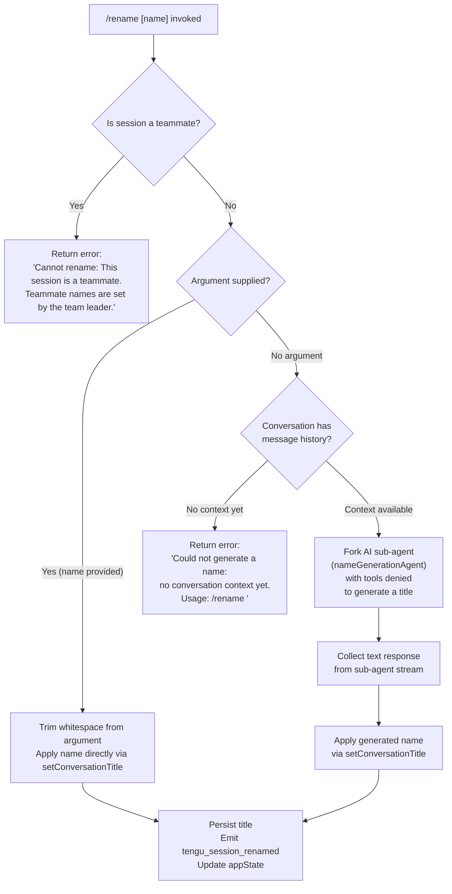

# `/rename`

> Analysis basis: CC v2.1.199 bundle.js (AST extraction + Claude interpretation)
> Minimum version: v2.1.199

---

## Overview

The `/rename` command (also accessible as `/name`) renames the current conversation session. When invoked with an explicit name argument it applies that name directly; when invoked with no argument and sufficient conversation history is available it calls an AI sub-agent to generate a name automatically; if no conversation context exists yet it surfaces an error message to the user.

---

## Registration

| Field | Value |
|---|---|
| type | `local-jsx` |
| name | `rename` |
| description | `Rename the current conversation` |
| argumentHint | `[name]` |
| aliases | `["name"]` |
| immediate | `true` |
| module_id | `DZl` |
| load_inline | `true` |
| loc_byte | `12737801` |
| loc_byte_end | `12738000` |
| loc_line | `9385` |
| arbor_handler.name | `ttm` |
| arbor_handler.fqn | `claude-2.1.199::ttm` |
| arbor_handler.kind | `AsyncFunction` |
| arbor_handler.resolution_path | `module_id` |
| arbor_handler.n_hits | `0` |

Analysis basis: CC v2.1.199 bundle.js:+12737801

---

## Input Branching

Four distinct execution paths are present (empty argument with no context, empty argument with context triggering AI generation, explicit name provided, and teammate-session guard), so a Mermaid flowchart is used.



---

## Behavioral Spec

### Top-level handler (`ttm`)

The Arbor-resolved handler `ttm` is an `AsyncFunction` that receives the slash-command invocation context. It delegates immediately to the teammate-guard (`sessionTypeGuard`) and then to the primary rename orchestrator (`renameOrchestrator`).

Analysis basis: CC v2.1.199 bundle.js:+12737497

```
async function ttm(invocationContext):
    sessionTypeGuard(invocationContext)        // Dur
    await renameOrchestrator(invocationContext) // Pur
```

### Teammate-session guard (`sessionTypeGuard` / `Dur`)

Checks whether the current session is a teammate-type session. If it is, raises the hardcoded error string and aborts further execution. Also retrieves a metadata context object (`MC`).

Hardcoded error message: `"Cannot rename: This session is a teammate. Teammate names are set by the team leader."` (bundle.js:+12736965)

Analysis basis: CC v2.1.199 bundle.js:+12737555

```
function sessionTypeGuard(ctx):
    meta = getSessionMeta(ctx)              // MC
    if meta.isTeammate:
        throw UserFacingError(
            "Cannot rename: This session is a teammate. ..."
        )
```

### Primary rename orchestrator (`renameOrchestrator` / `Pur`)

Coordinates all rename logic: reads the current store state, branches on whether an explicit name was provided or auto-generation is needed, invokes the title persistence layer, and finally updates app state.

Analysis basis: CC v2.1.199 bundle.js:+12737497

```
async function renameOrchestrator(ctx):
    store = getAppStore(ctx)               // Ef -> W0 -> YWr.getStore
    trimmedArg = ctx.argument.trim()       // e.trim loc:+12737064

    if trimmedArg is not empty:
        // Explicit name path
        applyTitle(store, trimmedArg)
    else:
        // Auto-generation path
        result = await autoGenerateName(store, ctx)  // YIt loc:+12737098
        if result is error:
            showError(result)
        else:
            applyTitle(store, result)

    store.setAppState(newTitleState)       // t.setAppState loc:+12737304
    updateConversationFiles(store)         // Cde loc:+12737346
    refreshSidebarEntry(store)             // Uy  loc:+12737350
    logActivity(dIe, ctx)                 // dIe loc:+12737290
```

### Auto-name generation orchestrator (`autoGenerateNameOrchestrator` / `YIt`)

Forks a restricted sub-agent to produce a session name when no explicit argument is given. The sub-agent is configured with `"deny"` tool permissions (bundle.js:+12735059) and the constant string `"Session name generation cannot use tools"` (bundle.js:+12735074) is used as the denial reason.

Analysis basis: CC v2.1.199 bundle.js:+12737098

```
async function autoGenerateNameOrchestrator(store, ctx):
    // Check that conversation has history
    history = getConversationHistory(store)  // ot loc:+12735614
    if history is empty:
        return Error(
            "Could not generate a name: no conversation context yet. Usage: /rename <name>"
        )                                    // literal loc:+12737176

    // Emit telemetry for forked session rename
    emit("tengu_rename_full_session_fork")   // loc:+12735617

    // Build session snapshot for sub-agent
    sessionSnapshot = buildNameGenerationRequest(history)   // M3o loc:+12735655

    // Run sub-agent with output streaming
    stream = forkSubAgentStream(sessionSnapshot, ctx)       // etm loc:+12735674

    // Collect text output
    nameCandidate = collectTextResponse(stream)             // Rur loc:+12735726

    // Run through render pipeline
    rendered = renderResponse(nameCandidate)                // VR  loc:+12735767

    // Convert to string
    finalName = toString(rendered)                          // ge  loc:+12736338

    return finalName
```

### Sub-agent fork stream (`nameGenerationSubAgent` / `etm`)

Starts a forked agent stream whose only purpose is to produce a conversation title. Tools are blocked (mode `"deny"`, bundle.js:+12735059). An `AbortController` is registered on the `"abort"` event (bundle.js:+12734882). The sub-agent stream is driven through the main query engine (`queryEngine` / `WR`).

Analysis basis: CC v2.1.199 bundle.js:+12735674

```
async function* nameGenerationSubAgent(snapshot, ctx):
    abortController = new AbortController()
    registerAbortListener(ctx, abortController)    // e.addEventListener loc:+12734863

    toolPolicy = { mode: "deny",
                   reason: "Session name generation cannot use tools" }

    queryRequest = buildQueryRequest(snapshot, toolPolicy)  // WR loc:+12734941

    permissionContext = { tools: "deny" }                   // Pn loc:+12734961

    for event in queryRequest.stream:
        if event.type == "text":
            yield { type: "text", value: event.value }      // loc:+12735400

    if stream produced error:
        yield { type: "error", value: error }               // loc:+12735547

    // Finalize: flatten to message list
    messages = flattenMessages(stream.results)              // r.flatMap loc:+12735299
    rendered = renderMessages(messages)                     // MZl loc:+12735464
    log(rendered)                                           // T   loc:+12735494
```

### Name generation request builder (`sessionSnapshotBuilder` / `M3o`)

Constructs the request payload sent to the sub-agent by stamping the current time and passing the conversation key store. Confidence threshold 0.9 is referenced at bundle.js:+11426736.

Analysis basis: CC v2.1.199 bundle.js:+12735655

```
function sessionSnapshotBuilder(history):
    timestamp = Date.now()                   // loc:+11426618
    keyStore = buildKeyStore(history, 0.9)   // ks  loc:+11426674; threshold loc:+11426736
    payload = buildSessionPayload(keyStore)  // s0t loc:+11426694
    return payload
```

### Text response collector (`textResponseCollector` / `Rur`)

Walks the sub-agent output, collecting `text`-typed content blocks into an array, then joins them.

Analysis basis: CC v2.1.199 bundle.js:+12735726

```
function textResponseCollector(streamOutput):
    parts = []
    for item in streamOutput:                 // aW loc:+12731994
        parts.push(item)                      // t.push loc:+12732063
        if Array.isArray(item):
            // Handle array-shaped blocks
            parts = parts.concat(item)
    joined = parts.join("")                   // t.join loc:+12732179
    return joined.slice(0, MAX_NAME_LENGTH)   // n.slice loc:+12732211
```

### Session title persistence (`conversationFilePersister` / `Cde`)

Writes the new title back to conversation files, handling file-system operations including directory creation. Emits `tengu_session_renamed` when writing a custom title (bundle.js:+13865847). Emits `tengu_agent_name_set` when the title originates from an agent (bundle.js:+13870781).

Analysis basis: CC v2.1.199 bundle.js:+12737346

```
async function conversationFilePersister(store, newTitle, origin):
    // Validate file state
    fileState = readCurrentConversationFile(store)   // Bl loc:+4364966
    fileInfo = resolveFileInfo(fileState)            // Yi loc:+4364980
    // Write new title
    await writeConversationTitle(fileInfo, newTitle) // op loc:+4365101
    // Update cache entry
    updateTitleCache(fileInfo.path, newTitle)        // ty loc:+4365024
    // Clean up stale entries
    removeStaleCacheEntry(fileInfo.oldPath)          // pn loc:+4365191

    if origin == "custom-title":
        emit("tengu_session_renamed")                // loc:+13865847
    if origin == "ai-title":
        emit("tengu_agent_name_set")                 // loc:+13870781
```

### HTML entity sanitizer (`htmlEntitySanitizer` / `par`)

Sanitizes text prior to display, replacing HTML entity sequences. Constants found in the implementation:

- `"&amp;"` → `&` (bundle.js:+14291670)
- `"&lt;"` → `<` (bundle.js:+14291694)
- `"&gt;"` → `>` (bundle.js:+14291717)
- `"&#13;"` → carriage return (bundle.js:+14291741)
- `"&#10;"` → newline (bundle.js:+14291765)

Analysis basis: CC v2.1.199 bundle.js:+12736813

```
function htmlEntitySanitizer(text):
    text = text.replaceAll("&amp;", "&")
    text = text.replaceAll("&lt;", "<")
    text = text.replaceAll("&gt;", ">")
    text = text.replaceAll("&#13;", "\r")
    text = text.replaceAll("&#10;", "\n")
    return text
```

---

## State & Side Effects

| Item | Detail |
|---|---|
| Telemetry — primary | `tengu_rename_full_session_fork` (bundle.js:+12735617) — emitted when the auto-generation path is taken |
| Telemetry — session renamed | `tengu_session_renamed` (bundle.js:+13865847) — emitted after a custom-title write succeeds |
| Telemetry — agent name set | `tengu_agent_name_set` (bundle.js:+13870781) — emitted after an AI-generated title is applied |
| Telemetry — sub-agent query | `tengu_fork_agent_query` (bundle.js:+11433637) — emitted during the forked sub-agent query lifecycle |
| Telemetry — sub-agent turns exceeded | `tengu_forked_agent_default_turns_exceeded` (bundle.js:+11433194) |
| Telemetry — streaming | Multiple `tengu_streaming_*` events inherited from the shared query engine (`WR`) |
| appState changes | `t.setAppState` is called (bundle.js:+12737304) to reflect the updated conversation title in the UI |
| File system | Conversation JSON file is rewritten with the new title via the persistence layer (`Cde`); directory is created if absent (`gIe.mkdir` / `Ysr`) |
| Title cache | In-memory title cache (`_oe`) is updated and stale entries are removed |
| Tool permissions | Sub-agent for auto-generation runs in `"deny"` tool mode — no tools are available to the name-generation agent |
| AbortController | Registered on the `"abort"` event during sub-agent streaming; `n.abort` is called on cancellation (bundle.js:+12734894) |
| Hook registration | <!-- TODO: not found in depth-2 traversal; needs --depth 4 --> |
| Sound | <!-- TODO: not found in depth-2 traversal; needs --depth 4 --> |

---

## Version History

| Version | Change |
|---|---|
| v2.1.199 | Initial analysis |

---

## Common Mistakes

1. **Running `/rename` with no argument before any messages exist** — the command will fail with `"Could not generate a name: no conversation context yet. Usage: /rename <name>"`. Always send at least one exchange before relying on auto-generation.
2. **Attempting to rename a teammate session** — teammate session titles are controlled by the team leader; `/rename` will return the hardcoded error and make no changes.
3. **Expecting instant persistence** — the title is written asynchronously to the conversation file. Killing the process immediately after invoking `/rename` may leave the file in an inconsistent state.
4. **Using `/rename` as a blocking operation in scripts** — the `immediate: true` registration flag means the command fires without waiting for a preceding agent turn to complete, but the underlying file write is still async.
5. **Assuming the alias `/name` behaves differently** — `/name` is a full alias registered in the `aliases` array and is identical in every way to `/rename`.

---

## Appendix — Identifier Mapping

> For bundle debugging only. Identifiers change across versions.

| Identifier | Role |
|---|---|
| `ttm` | Top-level handler for `/rename`; async entry point resolved by Arbor via `module_id` |
| `Dur` | Teammate-session type guard; checks `isTeammate` and emits error |
| `par` | HTML entity sanitizer (`replaceAll` chain for `&amp;`, `&lt;`, etc.) |
| `MC` | Session metadata accessor |
| `Pur` | Primary rename orchestrator; branches on explicit vs. auto-generated name |
| `Ef` | App store accessor wrapper |
| `W0` | Inner store resolver (calls `YWr.getStore`) |
| `YIt` | Auto-name generation orchestrator; guards on conversation history |
| `ot` | Conversation history reader / session state fetcher |
| `hBt` | History sub-component A |
| `HBt` | History sub-component B |
| `HG` | History grouping helper |
| `hG` | History group builder |
| `wDn` | Deduplication / cache-checked history fetcher |
| `KZr` | History entry constructor (calls `jZr.randomUUID`, emits `vre`) |
| `eeo` | History enrichment pipeline |
| `Mt` | Config-access guard (throws `"Config accessed before allowed."`) |
| `M3o` | Session snapshot / name-generation request builder |
| `ks` | Key-store builder |
| `W6` | Key-store sub-builder |
| `Bo` | Model-name normaliser (trim, toLowerCase, alias mapping) |
| `MH` | Model-hierarchy resolver |
| `s0t` | Session payload assembler |
| `etm` | Name-generation sub-agent fork stream driver |
| `Sfe` | Sub-agent pre-flight setup |
| `WR` | Main query engine / streaming driver |
| `utr` | Query state manager (reads/writes appState) |
| `dtr` | Query delta tracker |
| `VP` | ID generator (uses `Tcn.randomBytes`) |
| `Lpe` | Request logger (`ru`, `MYe`) |
| `T` | Output writer (writes to stream, flushes) |
| `GU` | Sub-agent exit/lifecycle handler (emits `subagent_exit`, `command_lifecycle`) |
| `qP` | Query post-processor |
| `e7e` | Stream event type checker |
| `Rie` | Rate/error interceptor |
| `Psr` | Partial-stream reducer |
| `WSl` | Stream-level event filter |
| `wpe` | Worker/process event accumulator |
| `V` | Generic JSX/render node factory |
| `K3f` | Render tree builder for sub-agent output |
| `Pn` | Permission-context constructor |
| `MZl` | Message flattener / renderer |
| `T6` | Text trimmer |
| `ge` | Generic string coercer |
| `Rur` | Text response collector; joins content blocks, slices to limit |
| `aW` | Content-block walker |
| `VR` | Response render pipeline entry |
| `Ec` | Render context |
| `Ysr` | Conversation snapshot reader/writer (reads file, writes UUID, manages cache) |
| `zsr` | Snapshot key builder |
| `BR` | Message normalisation engine (large call graph; handles `tool_use`, `tool_result`, etc.) |
| `k9f` | Content-block mapper |
| `Dt` | Display text formatter |
| `xe` | JSON serialiser wrapper |
| `Wt` | JSON parser wrapper |
| `n3l` | Snapshot sub-component builder |
| `rn` | Error formatter |
| `Mrn` | Multi-conversation snapshot resolver |
| `z3o` | Snapshot entry iterator |
| `oSc` | Core API streaming / query execution engine (very large; handles all streaming events) |
| `VM` | Anthropic SDK client wrapper |
| `Aw` | Render primitive |
| `mv` | Backend selector (gateway, foundry, anthropicAws, mantle, vertex) |
| `$w` | Auth-key reader |
| `gr` | Gateway config builder |
| `gu` | GCP/Vertex URL builder |
| `$Wr` | Managed-key prefix stripper (`/login managed key`, `sk-ant-`) |
| `j6` | JWT/key helper |
| `C9` | Client cache manager |
| `yf` | JSX layout wrapper |
| `kt` | Base render component |
| `_l` | Content filter |
| `dIe` | Conversation file activity logger (hook type `"hook"`, emits to log files) |
| `ML` | Log-level filter |
| `Lg` | Log-line formatter |
| `L3` | Render helper A |
| `ar` | Render helper B |
| `Rj` | File append logger (uses `Ol.appendFile`; emits `tengu_session_renamed` via `vrn.emit`; tag `"custom-title"`) |
| `$v` | Log-entry formatter |
| `kj` | File-write logger (appends to log file, manages `_rn` map) |
| `K2` | Log-entry constructor |
| `ru` | Process-exit handler registrar |
| `Pe` | Render finaliser |
| `GZe` | Base render primitive |
| `mee` | AI-title logger (emits `tengu_agent_name_set` via `vrn.emit`; tag `"ai-title"`) |
| `ME` | Multi-entry log helper |
| `jme` | JSON meta extractor |
| `Whe` | Spend-block response builder |
| `Vme` | Void-response builder |
| `CYe` | Agent-name setter (emits `yYo`; tag `"agent-name"`) |
| `xX` | Config file read/write helper |
| `rUt` | Config file I/O (reads/writes JSON; uses `$$.readFile`, `$$.writeFile`) |
| `Vl` | JSX layout node |
| `jte` | Terminal layout primitive |
| `yar` | App-state key enumerator |
| `Cde` | Conversation file persistence orchestrator |
| `Bl` | Path builder for jobs |
| `MR` | Path resolver |
| `Yi` | Conversation file reader/writer (lstat, readFile, writeFile, cache management) |
| `Wfc` | File-change watcher helper |
| `pn` | Cache-eviction helper |
| `_d` | Error-suppressing cache delete |
| `vJe` | File stat / read validator (enforces 1 048 576-byte max: bundle.js:+13647808) |
| `ihc` | Column-width calculator |
| `iru` | Daemon heartbeat helper |
| `Zio` | File-type classifier |
| `Qio` | MIME/extension sub-classifier |
| `UUn` | Extension-to-type map lookup |
| `ty` | Cache-entry updater (calls `_oe.delete`) |
| `op` | Title write orchestrator (calls `Uf`, `S_.join`, `xe`, `ty`) |
| `Qg` | Write queue manager |
| `tk` | Queue entry constructor |
| `Uf` | Atomic file writer (randomBytes salt, copyFile, chmod, unlink) |
| `d_e` | Temp-file path builder |
| `Ff` | File-write finaliser (checks `nV`, calls `T`, `ge`, `ke`) |
| `ke` | Error-handling / retry layer |
| `sr` | Base error constructor |
| `at` | String coercion helper |
| `Pi` | Error metadata builder |
| `Gku` | Error history ring-buffer manager |
| `Uy` | Sidebar / conversation-list entry updater (basename, `LX`, `kt`) |
| `LX` | Sidebar render helper |

---

Note: index built via Arbor fallback; some signals (telemetry, literals) may be missing — see arbor-fallback.js.