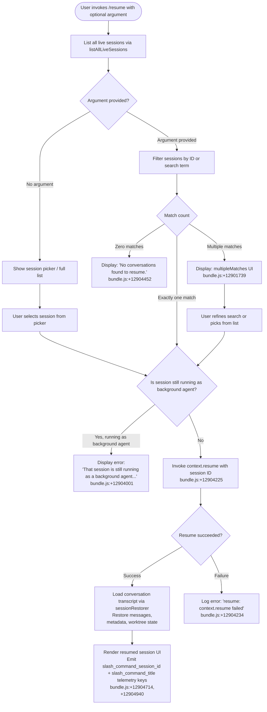

# `/resume`

> Analysis basis: CC v2.1.199 bundle.js (AST extraction + Claude interpretation)
> Minimum version: v2.1.199

---

## Overview

The `/resume` command (also aliased as `/continue`) allows the user to reattach to a previous Claude Code conversation by specifying a conversation ID or a search term. It queries the live session store for matching conversations, validates session state (blocking reattachment to still-running background agents), and then restores the selected conversation context into the current REPL session.

---

## Registration

| Field | Value |
|---|---|
| type | `local-jsx` |
| name | `resume` |
| description | `Resume a previous conversation` |
| aliases | `["continue"]` |
| argumentHint | `[conversation id or search term]` |
| module_id | `Trc` |
| load_inline | `true` |
| loc_byte | `12905398` |
| loc_byte_end | `12905595` |
| loc_line | `9423` |
| arbor_handler.name | `Kom` |
| arbor_handler.fqn | `claude-2.1.199::Kom` |
| arbor_handler.kind | `AsyncFunction` |
| arbor_handler.resolution_path | `module_id` |
| arbor_handler.n_hits | `0` |

Analysis basis: CC v2.1.199 bundle.js:+12905398

---

## Input Branching

The handler has four or more distinct paths depending on session lookup results and session state, so a Mermaid flowchart is used.



Analysis basis: CC v2.1.199 bundle.js:+12903887, +12903917, +12903991, +12904001, +12904452, +12904571

---

## Behavioral Spec

### 1. Handler Entry Point — `resumeCommandHandler` (`Kom`)

The primary async handler is `Kom`, resolved by Arbor via `module_id → Trc`.

```
async function resumeCommandHandler(commandContext):
    argument = commandContext.userArgument  // may be empty

    // Step 1: Retrieve live session list
    sessions = await listAllLiveSessions()          // gme → n.listAllLiveSessions

    // Step 2: Filter if argument present
    if argument is non-empty:
        filtered = sessions.filter(session => matchesArgument(session, argument))
    else:
        filtered = sessions  // show all

    // Step 3: Branch on match count
    if filtered.length == 0:
        displayMessage("No conversations found to resume.")  // literal: +12904452
        return

    if filtered.length > 1:
        showMultipleMatchesUI(filtered)     // "multipleMatches" literal: +12901739
        // User selects one; then falls through to single-match logic
        selected = await userPick(filtered)
    else:
        selected = filtered[0]

    // Step 4: Guard — block if session is a live background agent
    if isRunningAsBackgroundAgent(selected):
        displayError(
            "That session is still running as a background agent. " +
            "Open `claude agents` to attach to it, or stop it there first to resume here."
        )                                   // literal: +12904001
        return

    // Step 5: Attempt resume
    try:
        await context.resume(selected.sessionId)    // $o, ke, sr: +12904222–12904228
    catch error:
        logError("resume: context.resume failed")   // literal: +12904234
        return

    // Step 6: Restore conversation
    restoredMessages = await loadSessionTranscript(selected)
    renderResumedSession(restoredMessages, selected.title)

    // Step 7: Emit telemetry keys
    emitKey("slash_command_session_id", selected.sessionId)   // +12904714
    emitKey("slash_command_title", selected.title)            // +12904940
```

Analysis basis: CC v2.1.199 bundle.js:+12903991, +12904222, +12904291, +12904327, +12904388, +12904553, +12904679, +12904820

---

### 2. Session Enumeration — `listAllSessionsWithStatus` (`gme`)

`gme` is called by `Kom` to retrieve the list of restorable sessions. It resolves a `Promise` and calls `n.listAllLiveSessions`, filtering by session type `"interactive"` (literal: +9477093).

```
async function listAllSessionsWithStatus():
    rawSessions = await Promise.resolve()
                    .then(() => bze())          // session store helper
                    .then(() => n.listAllLiveSessions())

    // Only interactive sessions are eligible for /resume
    interactiveSessions = rawSessions.filter(s => s.type === "interactive")
    return interactiveSessions
```

Analysis basis: CC v2.1.199 bundle.js:+9476950, +9476980, +9477002, +9477093

---

### 3. Session Filtering and Search — `sessionSearchFilter` (`brc`)

`brc` is called prior to the handler to provide the filtered list used for argument matching. It applies `e.filter` and a string replacement via `t.replace`.

```
function sessionSearchFilter(sessions, searchTerm):
    normalizedTerm = searchTerm.replace(...)   // normalize whitespace/case
    return sessions.filter(session =>
        session.id.includes(normalizedTerm) ||
        session.title.toLowerCase().includes(normalizedTerm.toLowerCase())
    )
```

Analysis basis: CC v2.1.199 bundle.js:+12903887, +12903917, +18149542

---

### 4. Worktree Detection — `worktreeDetector` (`gTe`)

When restoring a session, the worktree associated with the original conversation is detected. This calls `git worktree list --porcelain` (literals: +9465429, +9465440, +9465447) to resolve the working directory for the session.

```
async function detectWorktreeForSession(sessionPath):
    timestamp = Date.now()                      // +9465385
    worktreeOutput = await runGit(["worktree", "list", "--porcelain"])  // literals +9465440,+9465447
    lines = worktreeOutput.split("\n")          // +9465610

    for line in lines:
        if line.startsWith("worktree "):        // literal "worktree ": +9465648
            path = line.slice(9)                // skip "worktree " (9 chars): +9465682
            normalized = vH(path)               // path normalizer (NFC): +67829,+67841
            if normalized matches sessionPath:
                return normalized

    // Filter and sort candidates by locale compare
    candidates = lines.filter(...)              // +9465820
    candidates.sort((a,b) => a.localeCompare(b)) // +9465853

    emitTelemetry("tengu_worktree_detection")   // +9465529
    return bestMatch
```

Analysis basis: CC v2.1.199 bundle.js:+9465385, +9465420, +9465529, +9465610, +9465635, +9465648, +9465671, +9465674

---

### 5. Transcript Loading — `transcriptLoader` (`_Te` → `hTe` / `_me`)

After the session ID is confirmed, the full conversation transcript is loaded from disk. This involves reading the JSONL/binary transcript store (`_me`, `gym`, `mym`, `hym`) and rebuilding the message chain.

```
async function loadTranscriptForSession(sessionId):
    // Resolve session directory
    sessionDir = resolveSessionDirectory(sessionId)   // Hym, ar, jh.join

    // Read raw transcript file
    rawData = await fs.readFile(sessionDir)           // Ol.readFile: +13883215

    // Parse message chain
    messages = parseTranscriptChain(rawData)          // gym, mym, hym, _me

    // Reconstruct metadata from stored keys:
    // "summary", "last-prompt", "custom-title", "ai-title",
    // "tag", "mode", "permission-mode", "agent-name", "agent-color",
    // "worktree-state", "pr-link", "bridge-session", etc.
    metadata = extractMetadataKeys(messages)

    return { messages, metadata }
```

Key metadata literals found:
- `"summary"` (+13880833), `"last-prompt"` (+13880900), `"custom-title"` (+13881104), `"ai-title"` (+13881182), `"tag"` (+13881252), `"mode"` (+13881619), `"permission-mode"` (+13881682), `"agent-name"` (+13881389), `"agent-color"` (+13881463), `"worktree-state"` (+13881840), `"bridge-session"` (+13882055), `"file-history-snapshot"` (+13882272), `"marble-origami-commit"` (+13882666).

Analysis basis: CC v2.1.199 bundle.js:+13872846, +13873394, +13883215, +13883267, +13885725

---

### 6. Session-Not-Found / Multiple-Matches UI (`Src`)

When the search yields no results, a styled UI element is rendered using `St.bold` (via `Src`). Two named states are present as string literals:

- `"sessionNotFound"` (+12901668) — shown when zero sessions match
- `"multipleMatches"` (+12901739) — shown when more than one session matches

```
function renderResumeResultUI(state, sessions):
    if state == "sessionNotFound":
        renderBold("No conversations found to resume.")
    elif state == "multipleMatches":
        renderSessionList(sessions)   // user picks one
```

Analysis basis: CC v2.1.199 bundle.js:+12901668, +12901703, +12901739, +12904990

---

### 7. Context Restoration Pipeline (`Cdr` → `Lrn` → `$_c` / `PJe`)

After the target session is chosen, full context restoration merges file-system state, stored metadata, and message history.

```
async function restoreContext(sessionId, metadata):
    // Step A: Assemble context directories
    contextPaths = buildContextPaths(sessionId)     // Lrn, ar, jh.join, e.join

    // Step B: Scan project files relevant to session
    projectFiles = await scanProjectFiles(contextPaths)   // $_c, tYo, g$e, yrn

    // Step C: Ingest transcript content blocks
    contentBlocks = await ingestTranscriptBlocks(sessionId)  // PJe, Iym, Buffer.alloc

    // Step D: Merge into restorable state object
    restoredState = Object.assign({}, contextPaths, projectFiles, contentBlocks)

    return restoredState
```

Analysis basis: CC v2.1.199 bundle.js:+12904402, +13888294, +13888380, +13888429, +13888522, +13888540, +13901535

---

## State & Side Effects

| Item | Detail |
|---|---|
| Telemetry — `tengu_worktree_detection` | Fired during worktree resolution for the session being resumed (bundle.js:+9465529) |
| Telemetry — `tengu_transcript_phantom_parent` | Fired if a message's declared parent UUID cannot be found in the chain (bundle.js:+13879565) |
| Telemetry — `tengu_relink_walk_broken` | Fired when transcript walk hits a broken parent link (bundle.js:+13855906) |
| Telemetry — `tengu_transcript_parent_cycle` | Fired when a parent-UUID cycle is detected in the transcript (bundle.js:+13883753) |
| Telemetry — `tengu_chain_parent_cycle` | Fired during chain reconstruction on cycle detection (bundle.js:+13856400) |
| Telemetry — `tengu_chain_timestamp_fallback` | Fired when timestamp is missing and a fallback ordering is used (bundle.js:+13856549) |
| Telemetry — `tengu_chain_parallel_tr_recovered` | Fired when parallel transcript branches are recovered (bundle.js:+13858415) |
| Telemetry — `tengu_daemon_control` | Fired in daemon interaction path reachable from resume (bundle.js:+18569105) |
| appState changes | Session ID, conversation title, message list, worktree path, metadata keys (mode, permission-mode, agent settings) are all written to app state upon successful resume |
| Session guard | If the target session is flagged as a running background agent (`"interactive"` type, live), resume is blocked and the user is directed to `claude agents` |
| Slash command metadata keys emitted | `slash_command_session_id` (+12904714), `slash_command_title` (+12904940) |
| Sound | <!-- TODO: not found in depth-2 traversal; needs --depth 4 --> |
| Hook registration | <!-- TODO: not found in depth-2 traversal; needs --depth 4 --> |

---

## Version History

| Version | Change |
|---|---|
| v2.1.199 | Initial analysis |

---

## Common Mistakes

1. **Trying to resume a background agent session**: If a session is still running as a background agent, `/resume` will block the attempt and display an error directing the user to `claude agents`. The user must stop the background session there first.
2. **Ambiguous search terms**: If the supplied argument matches more than one session, a multi-match picker is shown. Providing a full session UUID avoids ambiguity.
3. **Using `/resume` with no sessions available**: If no prior sessions exist or all have been pruned, the command displays "No conversations found to resume." and exits silently.
4. **Expecting cross-worktree resume**: Worktree detection (`gTe`) matches sessions to their original working directories. Resuming from a different working directory may fail to restore worktree-specific state.
5. **Confusing `/resume` with `/continue`**: Both aliases are fully equivalent — `"continue"` is a registered alias and produces identical behavior (registration aliases: +12905398).

---

## Appendix — Identifier Mapping

> For bundle debugging only. Identifiers change across versions.

| Identifier | Role |
|---|---|
| `Kom` | Primary async handler for `/resume` (arbor_handler, AsyncFunction) |
| `brc` | Session search filter — filters session list by user argument |
| `gme` | Live session enumerator — calls `listAllLiveSessions` |
| `ih` | Shared utility called during session filtering (depth-1 callee from `brc`) |
| `ke` | Error/context helper used in resume attempt and transcript loading |
| `sr` | Error serialization/wrapping helper |
| `at` | String utility (toString-like) |
| `Pi` | Helper calling `KTs` for string/context work |
| `KTs` | Sub-helper in string/format chain |
| `Gku` | Shift-push queue manager (history rotation) |
| `$o` | Object.assign-based state merger |
| `ge` | String coercion helper |
| `gTe` | Worktree detection — runs `git worktree list --porcelain` |
| `Wr` | Main session runner / process lifecycle coordinator |
| `gLe` | Low-level process execution engine |
| `wMs` | Process spawn utility (utf8, win32 platform handling) |
| `L1r` | Process output reader variant |
| `x1r` | Process output reader variant with `I8u` |
| `R1r` | Process output reader variant (`w8u`) |
| `ORs` | Finite-number validator for process args |
| `rPt` | Process rejection handler with `jju`/Boolean |
| `w1r` | Reflect.apply-based invocation wrapper |
| `pMs` | Event registration helper (`e.on`) |
| `PRs` | Timeout race helper using `Promise.race` |
| `NRs` | Process kill helper (`Sne`, `e.kill`) |
| `MRs` | Process message handler bound function (`Yju`) |
| `DRs` | Process forced-kill handler (`e.kill`) |
| `uMs` | Multi-promise coordinator (`Promise.all`, `v1r`, `C1r`) |
| `aPt` | Async completion helper (`l1r`) |
| `lMs` | Pipe output handler (`E8u`, `NHn`, `n.pipe`) |
| `cMs` | Stream add helper (`sMs.default`, `n.add`) |
| `BRs` | Bind-based stream registry helper (`_1r`) |
| `Cdr` | Context directory resolver — entry to restoration pipeline |
| `Lrn` | Transcript loader orchestrator — calls `$_c`, `PJe` |
| `$_c` | Project file scanner — reads directory, filters, maps paths |
| `q2` | Path join helper for project directory (`CDe.join`) |
| `E` | SDK/API connection object (MCP, messages) |
| `g$e` | File content ingestion helper (`_vt`, `v3e`) |
| `tYo` | Directory walker for transcript/project files |
| `yrn` | Cache map manager (get/set/values) |
| `JS` | String-slice/replacement utility |
| `b` | User info or auth context lookup |
| `d` | Supervisor/daemon session manager |
| `I` | Math/UI scroll calculation helper |
| `m` | Array filter helper for session/item lists |
| `h` | Session process host manager (spawn, kill, memory, config) |
| `_` | Mapping helper (general) |
| `g` | Flat-map source (file content array) |
| `y` | Flat-map source (context path array) |
| `PJe` | Transcript block ingester (Buffer.alloc, `Iym`) |
| `Iym` | Transcript file reader and parser (`B_c`, `jh.dirname`, `cH`, `T`) |
| `WM` | UUID/regex tester (`Xau.test`) |
| `oie` | Session open/init entry |
| `_Te` | Session restorer — reads all metadata maps, calls chain builders |
| `_me` | Full metadata map writer — sets all session metadata keys |
| `N_m` | Metadata key validator |
| `Hj` | Metadata helper |
| `rtt` | Message chain pop/push reconstructor |
| `Edn` | Chain element decoder (`ydn`, `cdu.test`) |
| `Sdn` | Chain string normalizer (`nhs`, `e.replace`) |
| `xE` | Cross-reference entry setter |
| `Whe` | JSON.stringify helper (spend/auth context) |
| `ln` | Log/notify utility |
| `yV` | Path normalize + replaceAll helper |
| `dCe` | Array filter for metadata (dedup check) |
| `Ure` | Rate-limit/usage tracker |
| `W5c` | Array `.at()` accessor helper |
| `j5c` | Tool-result set builder (`X1e`, `HEr`, `aBn`) |
| `Y` | Session queue / push collector |
| `K` | Event enqueue helper (`csc`, `k$`, `O.enqueue`, `fw.randomUUID`) |
| `x` | Cookie/header split-index helper |
| `k` | File watcher with setInterval/clearInterval |
| `N` | Background session sweeper (memory, retire, respawn) |
| `R` | OAuth/auth route handler |
| `zls` | Auth sub-routing (`Vls`, `qls`) |
| `Xeu` | Auth token validator (`aZe`) |
| `scs` | URL prefix checker (`e.startsWith`) |
| `Dls` | Token/response handler (`Cls`, `veu`) |
| `wtu` | Auth request handler (UUID, `MXm`, `Tu`) |
| `Bls` | Hash creator (`FAr.createHash`, sha256) |
| `Fls` | Token storage helper (`Rls`) |
| `$Ar` | Auth record manager (`GYm`) |
| `Yan` | Auth callback helper (`aZe`, `zAr`) |
| `weu` | OAuth state helper (`Rls`) |
| `lZe` | Auth redirect handler (`zAr`, `aZe`) |
| `Leu` | Token exchange (`Mls`) |
| `$ls` | Token set persistence (`Mls`) |
| `Ae` | Token store finalizer (`Promise.all`, `s.set`, `Fls`, `s.del`, `$Ar`) |
| `Tu` | JWT/token wrapper (`WYm`) |
| `Z` | Voice/session state machine (recording, websocket) |
| `ee` | Claim extractor (`Y.trim`, `f`, `a`, `G`, `O`) |
| `JAr` | Scope/claim matcher (`e.entries`, `i.some`, `n.includes`) |
| `$tu` | Device auth rate-limit handler (`eJm`, `tJm`, `nJm`) |
| `Wtu` | API request orchestrator (`Promise.allSettled`, `AbortSignal.timeout`) |
| `_tu` | Model list response mapper (`Response.json`, `Zls`, `t.map`) |
| `ftu` | Bedrock inclusion check (`gXm.includes`) |
| `gtu` | Message body handler (protobuf/JSON, `v2e`, `Jls`, `Qls`) |
| `ptu` | Auth-applied request sender (`i.applyAuth`, `QLt`, `AbortSignal.timeout`) |
| `gym` | Binary transcript file parser (Buffer, JSONL, seek/read) |
| `U_c` | Buffer position accessor (`n.at`) |
| `Wt` | JSON.parse wrapper |
| `fym` | Buffer compare helper (`e.compare`) |
| `X` | MCP update applier (`Y.applyMcpUpdate`, `jVe`, `B.push`, `q.push`) |
| `kHe` | JSON.parse wrapper (transcript metadata) |
| `hym` | Lightweight transcript file reader (openSync/readSync/closeSync) |
| `B` | Session init pair (`i`, `U`) |
| `l_c` | Conversation link resolver (walk, graph traversal) |
| `J_m` | Linked session traverser (`t.get`, `r.has`, `r.add`, `qe`) |
| `Ro` | Graph root locator (`GZe`) |
| `Bn` | Node traversal entry (`t`) |
| `mym` | Metadata JSONL parser (Buffer.from, indexOf, compare, subarray) |
| `ALe` | BOM/encoding detector (`SVu`, `AVu`, `TVu`, `bVu`) |
| `SVu` | BOM strip helper |
| `AVu` | BOM-aware concat helper (`o.concat`) |
| `TVu` | JSON line parser with indexOf/substring/push |
| `bVu` | Binary-to-string JSONL parser |
| `Mo` | Error/log router (`rn`) |
| `q` | Keyboard event handler (preventDefault, `U`) |
| `oe` | Input focus/blur watcher (`asn`, `le.trim`, `k.setTimeout`, `ne`) |
| `le` | Output/stream writer (`Wl`, `aie`, `ks`, `Y.push`, `O.enqueue`) |
| `ne` | Session pair holder (`T`, `Z`, `Y`) |
| `Q` | File lifecycle manager (`vee`, `FVl`) |
| `vee` | File lstat/rm/readFile handler (`P1.lstat`, `Hge`, `pn`, `Wa`) |
| `FVl` | File unlink handler (`P1.unlink`, `Hge`, `pn`) |
| `RJe` | Timestamp parser (`Date.parse`) |
| `D` | Output write/display handler (`d.write`, `V`) |
| `mYo` | Timestamp-based session sorter (`RJe`) |
| `HTe` | Chain builder — assembles ordered message chain from parsed entries |
| `eym` | NaN-guard validator for message entries |
| `tym` | Message sorter/grouper (filter, sort, set operations) |
| `Q_m` | Priority queue manager (shift, get, has, add, sort, push) |
| `O_c` | Ordered collection builder (values, get, set, push) |
| `FEt` | Entry formatter (`e.map`) |
| `fYo` | Text cleanup (replaceAll, slice) |
| `Wtn` | Structured text parser (Array.isArray, `yl`, `xz`, `m_c.test`) |
| `yl` | Inline-markdown line parser (`ix`, `r.exec`, `a.exec`, `l.exec`) |
| `hYo` | Content-type detector (`nym`, `rym`) |
| `nym` | Image/document type tester (`t.trim`, `t.some`) |
| `rym` | Alternative content-type tester (`t.some`) |
| `fTe` | Feature flag / inline test helper |
| `Y1e` | Session view state helper |
| `Amr` | Ancestor map builder (`e.get`, `r.get`, `r.set`, `n.push`) |
| `bmr` | Branch collector (`Array.from`, `e.values`) |
| `hTe` | Full session reload — reads all metadata maps + chain, returns composite session object |
| `F_c` | Session factory — calls `Hym` (directory resolver), `_me` (metadata writer), `Object.assign` |
| `Hym` | Session directory resolver (`L3`, `ar`, `jh.join`, `cH`, `px`, `Ol.stat`) |
| `L3` | Root path resolver (`Aw`) |
| `px` | Directory reader for session files (`bN.readdir`, `JS`, `TN`, `$Y.join`) |
| `Z7o` | Context slice builder (`e.at`, `fYo`, `FEt`, `hYo`) |
| `YIe` | Session view init helper |
| `Eee` | Session search and sort — filters by lowercase match, sorts candidates, slices results |
| `Src` | Session-not-found / multiple-matches UI renderer (`St.bold`) |