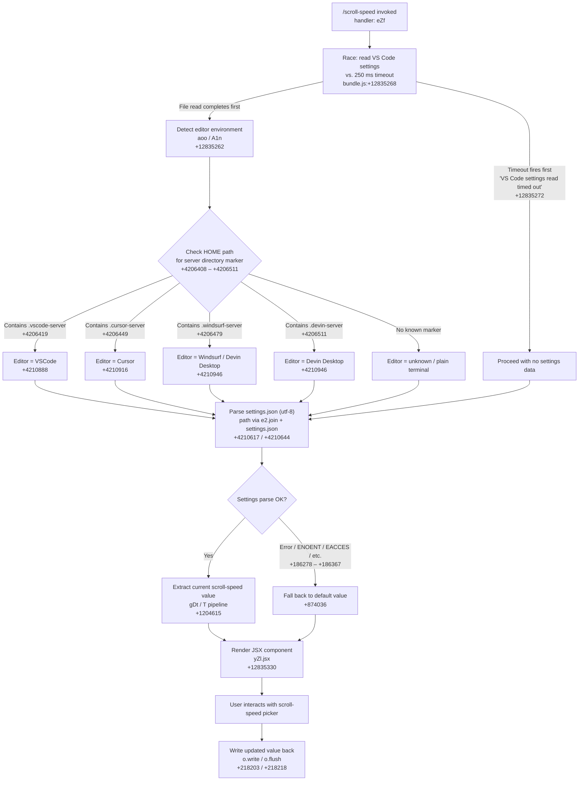

```markdown
---
type: feature-spec
feature: "scroll-speed"
cc_version: 2.1.199
updated: "2026-07-02"
tags: ["scroll-speed", "commands", "slash-commands"]
source: "bundle-analysis"
bundle_verified: true
inherited_from: 2.1.198
analysis_basis: "CC v2.1.198 bundle.js (AST extraction + Claude interpretation)"
author: "ryujaeuk <ryujaeuk@gmail.com>"
repository: "https://github.com/MyLittleLuckyDog/cc-gnothi"
license: "AGPL-3.0-only"
---

# `/scroll-speed`

> Analysis basis: CC v2.1.198 bundle.js (AST extraction + Claude interpretation)
> Minimum version: v2.1.198

---

## Overview

`/scroll-speed` is a local JSX command that adjusts the mouse wheel scroll speed within Claude Code's terminal UI. It works by detecting the host editor environment (VS Code, Cursor, Windsurf, Devin Desktop, or plain terminal), reading that editor's `settings.json` when applicable, and rendering an interactive JSX component that allows the user to modify the scroll-speed setting in place.

---

## Registration

| Field | Value |
|---|---|
| type | `local-jsx` |
| name | `scroll-speed` |
| description | `Adjust mouse wheel scroll speed` |
| module_id | `_Zl` |
| load_inline | `true` |
| loc_byte | `12835486` |
| loc_byte_end | `12835733` |
| loc_line | `8657` |
| arbor_handler.name | `eZf` |
| arbor_handler.fqn | `claude-2.1.198::eZf` |
| arbor_handler.kind | `AsyncFunction` |
| arbor_handler.resolution_path | `module_id` |
| arbor_handler.n_hits | `0` |

Analysis basis: CC v2.1.198 bundle.js:+12835486

---

## Input Branching

The handler follows 4+ distinct paths depending on detected editor environment and timeout outcomes, so a Mermaid flowchart is used.



---

## Behavioral Spec

### 1. Handler Entry (`eZf`) and Timed Settings Read

The async handler `eZf` immediately races two concurrent operations: a read of the editor's `settings.json` file against a 250 ms deadline.

```
async function handleScrollSpeed(context):
    result = await raceWithTimeout(
        readEditorSettings(),   // ul → Promise.race path
        timeoutMs = 250,        // literal +12835268
        timeoutMessage = "VS Code settings read timed out"  // +12835272
    )
    editorKind  = detectEditor(result.env)
    currentVal  = parseScrollValue(result.data) ?? DEFAULT
    renderScrollSpeedUI(editorKind, currentVal)
```

Analysis basis: CC v2.1.198 bundle.js:+12835259, +12835268, +12835272

### 2. Timeout Race (`ul`)

`ul` implements a generic promise-race helper:

```
function raceWithTimeout(promise, ms):
    token = setTimeout(resolve_timeout, ms)   // +877537
    winner = await Promise.race([promise, timeoutPromise])  // +877568
    clearTimeout(token)   // +877615
    return winner
```

The timeout sentinel value is `0` (number literal at +877613), used as the resolved value of the timeout branch so callers can distinguish it from a real result.

Analysis basis: CC v2.1.198 bundle.js:+877537, +877568, +877615

### 3. Editor Detection (`aoo` + `A1n`)

`aoo` orchestrates reading the host HOME directory, checking it against known server-directory suffixes to classify the editor, then reading `settings.json`.

```
async function readEditorSettings():
    homePath = getHomePath()   // crp  +4210537
    editorTag = classifyEditor(homePath)   // A1n  +4210550

    settingsPath = pathJoin(editorTag.configDir, "settings.json")  // +4210617
    raw = await readFile(settingsPath, "utf-8")  // Vw.readFile  +4210584, +4210644
    return { editorTag, raw }
```

`classifyEditor` (`A1n`) checks whether the home path includes one of four server-directory strings:

| String literal | Mapped editor display name | loc_byte |
|---|---|---|
| `.vscode-server` | `VSCode` | +4206419 / +4210888 |
| `.cursor-server` | `Cursor` | +4206449 / +4210916 |
| `.windsurf-server` | `windsurf` → `Devin Desktop` | +4206479 / +4210929 |
| `.devin-server` | `Devin Desktop` | +4206511 / +4210946 |

Analysis basis: CC v2.1.198 bundle.js:+4210537, +4210550, +4210584, +4210596, +4210617, +4210644, +4206408

### 4. Settings JSON Parsing (`gDt` → `T` pipeline)

Once the raw file content is available, a chain of helpers extracts the scroll-speed value:

```
function extractScrollSpeed(rawJson):
    stripped = stripComments(rawJson)     // c6: startsWith / slice  +1203898, +1203921
    parsed   = safeJsonParse(stripped)    // gDt → jgn / c6  +1204615

    if parse error:
        logError("error", ...)            // gDt → String "error"  +1204718, +1204699
        return DEFAULT

    value = lookupField(parsed)           // T pipeline  +1204642
    if value includes "debug" marker:     // +218003
        value = redact(value)             // "[REDACTED]"  +209027

    return normaliseValue(value)          // trim / toUpperCase / Oc  +218152, +218129
```

The `Oc` helper trims and normalises the string representation:
- Calls `.replace` to sanitise separators (+208975)
- Calls `.at` and `.lastIndexOf` / `.slice` to extract the trailing numeric segment (+209085, +209111, +209137)

Analysis basis: CC v2.1.198 bundle.js:+1204615, +1204642, +1204699, +218003, +218129, +218152, +209027

### 5. Error Handling (`Re` / `sr`)

File-system errors are caught and classified by POSIX code:

```
function handleFsError(err):
    code = err.code   // "code"  +184850
    if code in [ENOENT, EACCES, EPERM, ENOTDIR, ELOOP, ENAMETOOLONG, EROFS]:
        // +186278 – +186367
        return classify(code)   // xo → en  +186261
    logError(err)               // Re → Dte.logError  +875628
    pushToErrorBuffer(err)      // jvu: Bmn.shift / Bmn.push  +874902, +874914
```

Telemetry consent state is inspected during error processing; recognised values are `"essential-traffic"` (+873903), `"no-telemetry"` (+873962), and `"default"` (+874036).

Analysis basis: CC v2.1.198 bundle.js:+875227, +875240, +875486, +875569, +875588, +875628

### 6. Sub-process Execution Path (`biu`)

`T` delegates actual execution to `biu`, a sub-process runner that:

```
function runSubprocess(cmd, args):
    workDir = Wae.dirname(resolvedPath)   // +217455
    proc    = AZe(cmd, args, workDir)     // +217389
    results = []                          // QZe
    results.push(chunk)                   // QZe.push  +217416

    // Grace-period: wait up to 1000 ms, retrying every 100 ms
    await proc.then(callback)             // +217498
    proc.bind(Siu)                        // +217507

    process.on("exit", cleanup)           // +217658, +217669
    output = results.join("")             // QZe.join  +217725

    // Formatting: two-space indent, padEnd alignment
    // "  "  +18403772
    return formatOutput(output)           // zt / Uae / Jps  +217767, +217846, +217877
```

Timeout constants: 1000 ms overall wait (+217569), 100 ms polling interval (+217588).

Analysis basis: CC v2.1.198 bundle.js:+217389, +217416, +217455, +217498, +217507, +217569, +217588, +217658, +217725

### 7. JSX Render

After all data is resolved, `eZf` calls `yZl.jsx` to mount the interactive scroll-speed picker component. The component receives the detected editor kind and the current scroll-speed value as props and handles write-back via `o.write` / `o.flush`.

Analysis basis: CC v2.1.198 bundle.js:+12835330, +218203, +218218

---

## State & Side Effects

| Item | Detail |
|---|---|
| Telemetry | No `tengu_*` events detected in depth-2 traversal |
| Settings file read | Reads `settings.json` (UTF-8) from the detected editor's config directory (+4210584) |
| Settings file write | Writes updated scroll-speed value back via `o.write` / `o.flush` (+218203, +218218) |
| Timeout | 250 ms deadline on settings read; fires `"VS Code settings read timed out"` on expiry (+12835268, +12835272) |
| Error buffer | File-system and parse errors are pushed to a rotating error buffer (`Bmn.shift` / `Bmn.push`) (+874902, +874914) |
| Error logging | Errors are forwarded to `Dte.logError` (+875628) |
| Process event | Sub-process runner registers a `"exit"` listener on `process` for cleanup (+217658) |
| JSX component | Mounts an interactive UI element via `yZl.jsx` (+12835330) |
| appState changes | <!-- TODO: not found in depth-2 traversal; needs --depth 4 --> |
| Sound | <!-- TODO: not found in depth-2 traversal; needs --depth 4 --> |

---

## Version History

| Version | Change |
|---|---|
| v2.1.198 | Initial analysis |

---

## Common Mistakes

1. **Assuming the command works without an editor settings file** — the handler races against a 250 ms timeout and falls back gracefully, but if no `settings.json` exists (ENOENT) the rendered picker will show the hardcoded default value rather than any persisted preference.
2. **Expecting telemetry events** — no `tengu_*` telemetry is emitted by this command in v2.1.198. Do not rely on analytics pipelines to track scroll-speed changes.
3. **Assuming editor auto-detection is exhaustive** — only four server-directory suffixes are checked (`.vscode-server`, `.cursor-server`, `.windsurf-server`, `.devin-server`). Any other remote-server setup will fall through to the "unknown / plain terminal" branch.
4. **Confusing the 250 ms file-read timeout with the 1000 ms sub-process timeout** — the two timeouts govern different operations and should not be conflated.
5. **Treating `"windsurf"` and `"Devin Desktop"` as distinct branches** — both `.windsurf-server` and `.devin-server` resolve to the `"Devin Desktop"` display label in the current implementation.

---

## Appendix — Identifier Mapping

> For bundle debugging only. Identifiers change across versions.

| Identifier | Role |
|---|---|
| `eZf` | Main async handler for `/scroll-speed` (Arbor-resolved, AsyncFunction) |
| `ul` | Promise-race timeout helper |
| `aoo` | Editor settings orchestrator (detects editor + reads settings.json) |
| `crp` | Home-directory / environment path resolver |
| `A1n` | Editor classifier (checks HOME path against known server-dir suffixes) |
| `gDt` | JSON settings parser entry point |
| `c6` | Comment-stripping / string-normalisation helper |
| `T` | Value extraction and normalisation pipeline |
| `Hiu` | Inner field lookup helper within T |
| `Me` | JSON.stringify wrapper |
| `Oc` | String sanitisation and numeric-segment extractor |
| `YZe` | Supplementary value transform (calls Ops) |
| `biu` | Sub-process runner / output formatter |
| `o` | Output stream writer (write + flush) |
| `ioo` | Array.isArray guard utility |
| `xo` | File-system error classifier entry point |
| `en` | POSIX error-code handler |
| `Re` | Top-level error handler / error-buffer manager |
| `sr` | Error construction helper |
| `st` | String coercion utility |
| `qi` | Telemetry-consent-aware error filter |
| `wSs` | Consent-check helper (calls st) |
| `jvu` | Rotating error buffer manager (shift/push on Bmn) |

---

Note: index built via Arbor fallback; some signals (telemetry, literals) may be missing — see arbor-fallback.js.
```