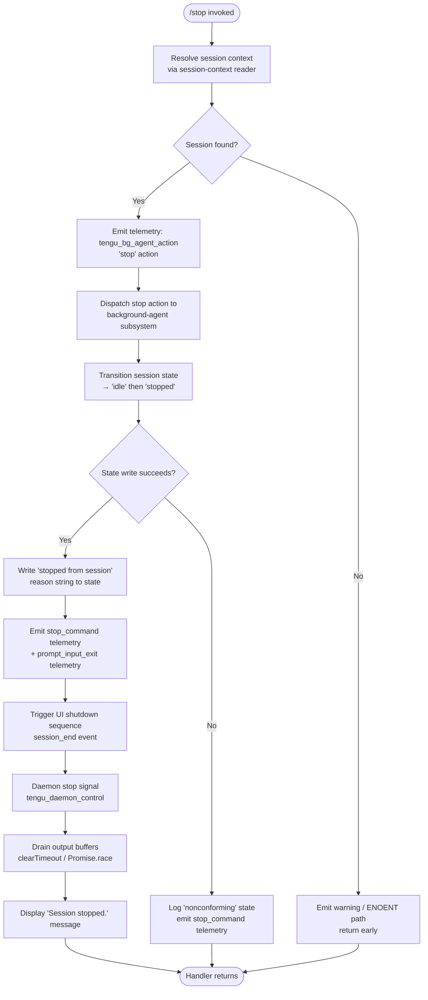

# `/stop`

> Analysis basis: CC v2.1.199 bundle.js (AST extraction + Claude interpretation)
> Minimum version: v2.1.199

---

## Overview

The `/stop` command terminates the current background session immediately, sending a stop action to the background-agent subsystem and transitioning the session to an idle/stopped state. The conversation transcript and any associated worktree are preserved after the session ends. The command is marked `immediate`, meaning it executes without awaiting further user input.

---

## Registration

| Field | Value |
|---|---|
| type | `local-jsx` |
| name | `stop` |
| description | `Stop this background session; transcript and worktree are kept` |
| immediate | `true` |
| module_id | `THc` |
| load_inline | `true` |
| loc_byte | `13728244` |
| loc_byte_end | `13728428` |
| loc_line | `10248` |
| arbor_handler.name | `FHm` |
| arbor_handler.fqn | `claude-2.1.199::FHm` |
| arbor_handler.kind | `AsyncFunction` |
| arbor_handler.resolution_path | `module_id` |
| arbor_handler.n_hits | `0` |

Analysis basis: CC v2.1.199 bundle.js:+13728244

---

## Input Branching

The handler has more than three distinct internal paths (session lookup, stop action dispatch, state transition to idle/stopped, UI teardown, and error/fallback routes), so a flowchart is used.



---

## Behavioral Spec

### Top-Level Handler (`FHm`)

```
async function stopCommandHandler(context):
    sessionId = resolveCurrentSessionId(context)       // calls stringNormalizer(e)
    result = await stopSessionOrchestrator(sessionId)  // calls omr
    return result
```

Analysis basis: CC v2.1.199 bundle.js:+13727963, +13727973

---

### Session ID Resolution

```
function resolveCurrentSessionId(rawInput):
    normalized = rawInput.replace(...)   // string normalization via `e` → t.replace
    return normalized
```

Analysis basis: CC v2.1.199 bundle.js:+13727963, +18149542

---

### Stop Session Orchestrator (`omr`)

This is the central coordinator. It assembles session context, validates the session type, sends the stop signal, updates state, and triggers UI teardown.

```
async function stopSessionOrchestrator(sessionId):
    // 1. Validate session type (bg / daemon / daemon-worker)
    sessionType = getSessionType()                 // via qe → GZe
    if sessionType not in ["bg", "daemon", "daemon-worker"]:
        logNonconforming("nonconforming")          // literal at +2352466
        return

    // 2. Read current session state
    stateHandle = readSessionState(sessionId)      // via Pe → GZe

    // 3. Emit stop telemetry event
    emitTelemetry("tengu_bg_agent_action", {       // +13727370
        action: "stop",
        sessionId: sessionId
    })

    // 4. Dispatch stop to agent subsystem (ii → a0e)
    await dispatchAgentStopAction(sessionId)       // via ii → a0e at +2367234

    // 5. Update background state file (Yi)
    await updateBackgroundState(sessionId, {       // via Yi
        reason: "stopped from session",            // literal +13727572
        targetState: "idle"                        // literal +13727601
    })

    // 6. Enqueue session job result (Qg → tk → yoe)
    enqueueJobResult(sessionId, {                  // via Qg +13727526
        status: "stopped"                          // literal +4371142
    })

    // 7. Rotate/persist cron entry for this session (op)
    await persistCronEntry(sessionId)              // via op +13727538

    // 8. Emit completion reason + session_end event (Le, Si)
    await emitSessionEndReason("stopped from session") // via Le +13727773
    await teardownSession(sessionId)               // via Si +13727793

    // 9. Display final message
    displayMessage("Session stopped.")             // literal +13727745

    // 10. Emit command telemetry
    emitTelemetry("stop_command", {})              // literal +13727977
    emitTelemetry("prompt_input_exit", {})         // literal +13727798
```

Analysis basis: CC v2.1.199 bundle.js:+13727368 – +13727977

---

### Background State Updater (`Yi`)

Manages the on-disk or in-memory background-session state file. Handles file existence checks, reads current JSON state, merges stop reason, and persists the update.

```
async function updateBackgroundState(sessionId, patch):
    statePath = pathJoin(stateDir, sessionId)      // S_.join +4361761

    // Check file existence
    entries = await Promise.all(
        fileStat(statePath)                        // IE.lstat +4361884
    )
    if not entries[0].isFile():                    // l.isFile +4361986
        logWarn("not a regular file")              // literal +4362192
        return

    // Read current state
    raw = await readFile(statePath, "utf-8")       // IE.readFile +4362872, literal +4362886
    state = parseJSON(raw)                         // Wt → JSON.parse +195597

    // Apply patch fields
    state.reason = patch.reason
    state.stateOrder = computeOrder(state)         // literal "stateOrder" +4361809
    state.group = resolveGroup(state)              // literal "group" +4361835

    // Validate numeric fields
    if not Number.isFinite(state.order):           // +4363523
        state.order = 0

    // Process entries
    merged = Object.fromEntries(                   // +4363487
        Object.entries(state).filter(...)          // +4363425
    )

    // Persist
    await writeStateFile(statePath, merged)

    // Manage in-memory caches
    stateCache.delete(sessionId)                   // _oe.delete +4362474
    seenSet.delete(sessionId)                      // QRe.delete +4362488

    // If state is now terminal, clear cache
    if shouldClearCache(state):
        stateCache.clear()                         // _oe.clear +4363722

    // Emit transient-read telemetry
    emitTelemetry("tengu_bg_state_read_transient") // +4362670
```

Analysis basis: CC v2.1.199 bundle.js:+4361761 – +4363722

---

### Session Teardown (`Si`)

Handles the full async teardown sequence: UI unmount, output drain, abort signal, process coordination.

```
async function teardownSession(sessionId):
    // Unmount UI components
    unmountUI()                                    // U8e → e.unmount +6910078

    // Write terminal escape sequences (save/restore cursor)
    writeSync("\x1b7")                             // literal +3963138
    writeSync("\x1b8")                             // literal +3963149

    // Emit session_end event
    emitEvent("session_end")                       // literal +6913526

    // Stop active agent loops (mr, qe)
    await stopAgentLoop()                          // mr +6913557, qe +6913523

    // Collect and settle all pending sub-processes
    await Promise.race([                           // +6913226
        Promise.allSettled(                        // BPa +6913351
            Array.from(pendingTasks)
        ),
        Promise.allSettled(                        // hOa +6913374
            Array.from(hookTasks)
        )
    ])

    // Wait up to 5000 ms for drain, fallback 3500 ms    // literals +6913106, +6913113
    timeout = Math.max(5000, 3500)
    timer = setTimeout(forceShutdown, timeout)
    timerRef.unref()                               // HPe.unref +6913122

    // Drain output buffers
    await drainBuffers()                           // ket → bfs.drain +69880

    // If not yet exited after 2000 ms              // literal +6913291
    clearTimeout(timer)

    // Abort any remaining signals
    abortSignal = AbortSignal.timeout(remaining)   // +6913414

    // Emit cache-eviction hint
    emitTelemetry("tengu_cache_eviction_hint")     // +6913488

    // Scroll summary telemetry
    emitTelemetry("tengu_scroll_summary")          // +6912522
```

Analysis basis: CC v2.1.199 bundle.js:+6913009 – +6913710

---

### Daemon Stop Sub-path (`d` / supervisor)

When the session is connected to a daemon supervisor, an additional stop cycle is performed.

```
async function supervisorStopCycle(supervisorHandle):
    // Write supervisor event
    supervisorHandle.write("supervisor")           // literal +18545667

    // Read active session entry
    entry = supervisorMap.get(sessionId)           // i.get +18545915

    // Stop active session runner
    await entry.stop()                             // E.stop +18545935

    // Remove from registry
    supervisorMap.delete(sessionId)                // i.delete +18545944

    // Stop background session manager
    await bgManager.stop()                         // b.stop +18546055

    // Update config and restart manager
    bgManager.updateConfig(newConfig)              // b.updateConfig +18546064
    await bgManager.start()                        // b.start +18546082

    // Register heartbeat handler
    registerHeartbeat(supervisorHandle)            // iru → Mue +18544899

    // Update registry entry
    supervisorMap.set(sessionId, newEntry)         // i.set +18546229

    // Start session watcher
    await sessionWatcher.start()                   // I.start +18546240

    // Emit daemon telemetry
    emitTelemetry("tengu_daemon_control", {        // +18569105
        event: "daemon_stop"                       // literal +18569030
    })

    // Emit config reload telemetry
    emitTelemetry("tengu_daemon_config_reload")    // +18546460
```

Analysis basis: CC v2.1.199 bundle.js:+18545667 – +18546460

---

### Job Result Enqueue (`Qg` → `tk` → `yoe`)

```
function enqueueJobResult(sessionId, result):
    jobEntry = lookupJob(sessionId)                // tk → yoe +4371202
    if jobEntry.state == "done":                   // literal +4371080
        return
    jobEntry.status = result.status                // "stopped" / "success" / "failure"
    // literals: "success" +4371093, "failure" +4371125, "stopped" +4371142, "active" +4371261
    publishResult(jobEntry)
```

Analysis basis: CC v2.1.199 bundle.js:+4371238

---

### Cron Entry Rotation (`op` → `Uf`)

The stop command updates the session cron entry so that the session's scheduled record reflects it is no longer active.

```
async function persistCronEntry(sessionId):
    existing = lookupCronEntry(sessionId)          // Qg +4361215
    cronPath = pathJoin(cronDir, sessionId)        // S_.join +4361320

    // Generate fresh random token (4 bytes hex)   // Uf → WOr.randomBytes +1070065, literal 4 +1070081
    token = randomBytes(4).toString("hex")         // literal "hex" +1070093

    // Write updated cron file
    await writeFile(cronPath, token, "utf8")       // FY.writeFile +1070112, literal "utf8" +1070139

    // Set permissions (mode 384 = 0o600)          // literal 384 +4361348
    await chmod(cronPath, 384)                     // Uf → FY.chmod +1070269

    // Clean up old entry from cache
    cronCache.delete(sessionId)                    // ty → _oe.delete +4361720

    // Emit telemetry: session_cron
    // literal "session_cron" at +4361142
```

Analysis basis: CC v2.1.199 bundle.js:+4361215 – +4361720

---

### Forced Shutdown Path (`p` / `u`)

If the session does not terminate gracefully within the timeout window, a forced shutdown is triggered.

```
function forceShutdown():
    emitMessage("forced shutdown")                 // literal +18565426
    abortController.abort()                        // u.abort +18565466
    process.exit(1)                                // p → process.exit +18565445

// Daemon-level forced stop emits:
//   "daemon_stop"         literal +18569030
//   "daemon_stop_failed"  literal +18569067
```

Analysis basis: CC v2.1.199 bundle.js:+18565423 – +18569156

---

## State & Side Effects

| Item | Detail |
|---|---|
| Telemetry: `tengu_bg_agent_action` | Emitted at the start of stop dispatch (bundle.js:+13727370) |
| Telemetry: `tengu_bg_state_read_transient` | Emitted when background state file is read (bundle.js:+4362670) |
| Telemetry: `tengu_daemon_control` | Emitted on daemon stop cycle with `daemon_stop` / `daemon_stop_failed` payloads (bundle.js:+18569105) |
| Telemetry: `tengu_daemon_config_reload` | Emitted after daemon config is updated post-stop (bundle.js:+18546460) |
| Telemetry: `tengu_feature_ok` | Emitted via `Le` feature-gate check (bundle.js:+1039941) |
| Telemetry: `tengu_startup_perf` | Emitted during startup profiling path reached via `zkt` (bundle.js:+230441) |
| Telemetry: `tengu_scroll_summary` | Emitted during session teardown (bundle.js:+6912522) |
| Telemetry: `tengu_pewter_brook` | Emitted from fullscreen/terminal-mode detection during teardown (bundle.js:+3615281) |
| Telemetry: `tengu_cache_eviction_hint` | Emitted after abort signal raised (bundle.js:+6913488) |
| Literal event: `stop_command` | Named event string recorded at command exit (bundle.js:+13727977) |
| Literal event: `prompt_input_exit` | Named event string recorded at prompt exit (bundle.js:+13727798) |
| Literal event: `session_end` | Named event string recorded at teardown (bundle.js:+6913526) |
| appState changes | Session state transitions: `"idle"` → `"stopped"` (literals +13727601, +4371142); reason string `"stopped from session"` written to state file (+13727572) |
| File I/O | Background state JSON file read (`IE.readFile`) and written; cron entry file written with mode `0o600` (384) via `FY.writeFile` + `FY.chmod` |
| Cache mutations | `_oe` (state cache) entries deleted/cleared; `QRe` (seen set) entries deleted; cron cache (`_oe.delete` via `ty`) cleared |
| Process signals | `process.on("exit", ...)` registered during teardown (+217910); `process.kill` / `SIGKILL` issued on forced shutdown path (+6910690, +6910715) |
| Output drain | `bfs.drain` and `Tfs.drain` called to flush buffered output before exit (+69880, +69958) |
| UI | Ink component unmounted (`e.unmount`); terminal cursor save/restore escape sequences written (`\x1b7` / `\x1b8`) |
| Timeout constants | Graceful shutdown window: `Math.max(5000, 3500)` ms; fallback wait: `2000` ms (literals +6913106, +6913113, +6913291) |
| Sound | <!-- TODO: not found in depth-2 traversal; needs --depth 4 --> |
| Hook registration | `process.on("exit", ...)` registered at +217910 to ensure cleanup on unexpected exit |

---

## Version History

| Version | Change |
|---|---|
| v2.1.199 | Initial analysis |

---

## Common Mistakes

1. **Expecting the worktree to be deleted** — `/stop` explicitly preserves both the transcript and the worktree. Use a separate cleanup command if worktree removal is needed.
2. **Invoking `/stop` from a non-background session** — the orchestrator validates that the session type is one of `"bg"`, `"daemon"`, or `"daemon-worker"` and logs a `"nonconforming"` warning for any other type (bundle.js:+2352466). The stop action will not proceed in a regular interactive session.
3. **Assuming the command waits for agent work to finish** — `/stop` is registered as `immediate: true` and forcibly terminates the session; any in-flight agent task is aborted, not completed.
4. **Missing the timeout window** — if graceful teardown exceeds `~5000 ms`, the forced shutdown path triggers `process.exit` and `SIGKILL` (bundle.js:+18565445, +6910715). Long-running tool calls will not complete.
5. **Confusing `/stop` with a pause** — the session transitions to `"stopped"` state (not `"paused"`); it cannot be resumed. A new session must be created.

---

## Appendix — Identifier Mapping

> For bundle debugging only. Identifiers change across versions.

| Identifier | Role |
|---|---|
| `FHm` | Top-level stop command handler (AsyncFunction; arbor_handler) |
| `omr` | Stop session orchestrator — central coordinator |
| `e` | Session ID string normalizer |
| `V` | Shared value/state accessor utility |
| `qe` | Session type reader (reads "bg"/"daemon"/"daemon-worker") |
| `GZe` | Underlying state store getter (shared by `qe`, `Pe`, `Zf`) |
| `Pe` | Session state handle reader |
| `mr` | Agent loop stop dispatcher |
| `Zf` | Session-flag reader (uses GZe) |
| `kt` | Feature gate / capability checker |
| `Aw` | Feature gate resolver |
| `UHm` | Unknown utility reached from orchestrator |
| `ii` | Agent stop action dispatcher |
| `a0e` | Agent action executor (reached via `ii`) |
| `Yi` | Background state file updater |
| `l` | File stat wrapper (lstat result handler) |
| `Wfc` | File cache / stat metadata recorder |
| `T` | Terminal output writer / formatter |
| `gdu` | Display/output helper |
| `xe` | JSON serializer wrapper |
| `Nc` | String path/name formatter |
| `ntt` | Theme/style resolver |
| `Sdu` | Sub-process / child-process launcher |
| `o` | Column-padded table output writer |
| `f` | File path normalizer |
| `yV` | Path normalization with Windows path handling |
| `p` | Forced shutdown trigger |
| `EI` | Exit message emitter |
| `u` | Abort controller / daemon stop signal |
| `pn` | ENOENT error handler |
| `rn` | Generic error code inspector |
| `_d` | Error code checker (reads `.code` field) |
| `Wt` | JSON parser wrapper |
| `d` | Supervisor session manager (read/write/stop/start) |
| `vJe` | State file validator and reader |
| `r` | Data stream writer (1024-byte buffer) |
| `ihc` | Column-width calculator for output table |
| `i` | Supervisor session registry (Map get/set/delete) |
| `E` | Active session runner (stop/SDK/connection lifecycle) |
| `b` | Background session manager (stop/updateConfig/start) |
| `iru` | Heartbeat registration helper |
| `I` | Session watcher / scroll-area controller |
| `Zio` | Session state transition coordinator |
| `Qio` | State machine step executor |
| `UUn` | Case-insensitive state lookup |
| `Qg` | Job queue lookup |
| `tk` | Job entry resolver |
| `yoe` | Job state store |
| `op` | Cron entry rotation handler |
| `Uf` | Cron file writer (randomBytes + writeFile + chmod) |
| `d_e` | Cron file content builder |
| `ty` | Cron cache invalidator |
| `Rvn` | Unknown — reached from orchestrator |
| `cge` | Unknown — reached from orchestrator |
| `Le` | Feature-gate checker emitting `tengu_feature_ok` |
| `Si` | Full session teardown coordinator |
| `U8e` | UI unmount + terminal write handler |
| `gU` | Terminal glyph/status helper |
| `L1n` | Terminal escape sequence writer |
| `G_o` | Shutdown display renderer (writes dim text to terminal) |
| `rx` | Terminal raw-mode accessor |
| `X5` | Terminal size/capability reader |
| `ejt` | Working-directory stat checker |
| `ig` | Process runner / capability inspector |
| `zgi` | Terminal string escaper (backslash/quote) |
| `W_o` | Forced-kill coordinator (clearTimeout / process.kill / SIGKILL) |
| `ket` | Output buffer drain (bfs.drain) |
| `BPa` | Pending-tasks settler (Promise.allSettled + Array.from) |
| `hOa` | Hook-tasks settler (Promise.allSettled + Array.from) |
| `zkt` | Startup performance profiler |
| `lLr` | Perf report emitter (`tengu_startup_perf`) |
| `Dhs` | Profiling data serializer |
| `b5n` | Scroll summary reporter (`tengu_scroll_summary`) |
| `oOa` | Scroll event accumulator |
| `rOa` | Scroll metrics calculator (Date.now / Math.max / Math.round) |
| `zs` | Terminal mode detector (fullscreen / tmux-CC / ConPTY) |
| `o0t` | Post-teardown cleanup hook |
| `I6` | Parallel async task runner (Promise.all) |
| `$8e` | Deferred resolve wrapper |
| `y5n` | Deferred continuation handler |
| `cPt` | Post-session cleanup step |
| `OHe` | Output flush / finalize step |
| `Hun` | Final output drain (Tfs.drain) |

---

Note: index built via Arbor fallback; some signals (telemetry, literals) may be missing — see arbor-fallback.js.