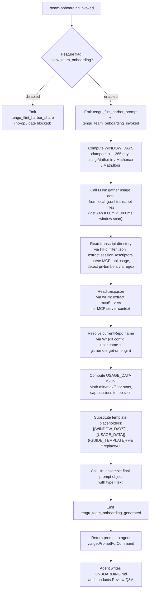

# `/team-onboarding`

> Analysis basis: CC v2.1.199 bundle.js (AST extraction + Claude interpretation)
> Minimum version: v2.1.199

---

## Overview

`/team-onboarding` is a `prompt`-type slash command that analyzes the invoking user's local Claude Code session transcripts and co-authors a shareable `ONBOARDING.md` guide for teammates who are new to Claude Code. It collects usage statistics, classifies past sessions by task type, gathers repository and MCP server context, and produces a draft guide through an interactive two-turn dialogue that ends with the file written to disk.

---

## Registration

| Field | Value |
|---|---|
| type | `prompt` |
| name | `team-onboarding` |
| description | `Help teammates ramp on Claude Code with a guide from your usage` |
| isHidden | `false` |
| handler_method | `getPromptForCommand` |
| handler_method_start (byte) | `13726250` |
| handler_method_end (byte) | `13726966` |
| loc_byte | `13725887` |
| loc_byte_end | `13726967` |
| loc_line | `10248` |
| prompt_body.length | `4539` characters |
| prompt_body.trace | `identifier→l (local→1 ext vars)` |
| arbor_handler.name | `getPromptForCommand` |
| arbor_handler.kind | `Method` |
| arbor_handler.fqn | `claude-2.1.199::getPromptForCommand` |
| arbor_handler.resolution_path | `direct` |
| arbor_handler.n_hits | `2` |
| `handler_method_start` | `13726250` |
| `handler_method_end` | `13726966` |

Analysis basis: CC v2.1.199 bundle.js:+13725887

---

## Input Branching

The handler executes several distinct preparation paths before assembling the final prompt, warranting a Mermaid flowchart.



Analysis basis: CC v2.1.199 bundle.js:+13726256, +13726284, +13726453, +13726508, +13726694, +13726703, +13726812, +13726835

---

## Behavioral Spec

### 1. Feature-Flag Gate

Before any work begins, the handler checks the `allow_team_onboarding` feature flag (literal found at bundle.js:+11186245) via `Obt`, which calls `Pi` (feature-flag evaluator) and `Ws` (flag-state resolver). If the flag is absent or disabled for the current user tier, the command emits `tengu_flint_harbor_share` and exits early without generating a prompt.

```
function checkFeatureFlag(flagName):
    state = resolveFeatureFlag(flagName)   // Obt → Pi → Ws
    if not state.enabled:
        emitTelemetry("tengu_flint_harbor_share")
        return NO_OP
    return PROCEED
```

Analysis basis: CC v2.1.199 bundle.js:+11186245, +11186224, +11186242, +11186304

### 2. Transcript Scanning and Usage-Data Collection (`LHm` / `HHc`)

The handler calls `LHm` (usage-data collector), which internally calls `HHc` (transcript file reader). `HHc` opens the local Claude Code transcript directory, filters for `.jsonl` files modified within the last `24 × 60 × 1000` milliseconds (i.e., 24-hour rolling window scaled to the final `WINDOW_DAYS` value), reads each file, and extracts per-session metadata:

- Session title and first user message
- Pull-request numbers (`prNumbers`) extracted by regex (`bHm`, `THm`, `IHm`)
- MCP tool-call counts (scanning for `"name":"mcp__` literal prefix at bundle.js:+13715511)
- Message content arrays (scanning for `"content":[` at bundle.js:+13715861)

The scan window ceiling is `365` days and the floor is `1` day, enforced via `Math.min` / `Math.max` / `Math.floor` before the directory walk. Up to `10` sessions per file are retained (literal at bundle.js:+13715328).

```
function collectUsageData(windowDays):
    clampedDays = Math.floor(Math.min(Math.max(windowDays, 1), 365))
    cutoffMs    = Date.now() - clampedDays * 24 * 60 * 60 * 1000
    transcriptDir = resolveTranscriptDirectory()   // Q3 → TN / JS
    files = fs.readdir(transcriptDir)
              .filter(f => extname(f) == ".jsonl")
    sessions = []
    for file in files:
        stat = fs.stat(file)
        if stat.mtime < cutoffMs: continue
        lines = fs.readFile(file, "utf-8").split("\n")
        parsed = parseSessionDescriptors(lines)    // regex via bHm / THm / IHm
        sessions.extend(parsed[:10])
    return sessions
```

Analysis basis: CC v2.1.199 bundle.js:+13714804, +13714817, +13714820, +13714826, +13714845, +13714915, +13714932, +13714951, +13715302, +13715328, +13715389, +13715511, +13715652, +13715708, +13715883

### 3. MCP Server Context (`wHm`)

`wHm` reads `.mcp.json` from the workspace root (literal at bundle.js:+13716962, encoding `"utf8"` at bundle.js:+13716975), parses the `mcpServers` key (literal at bundle.js:+13717018) via `Wt` (JSON parser), and returns an array of server descriptors (name, optional `urlOrigin`) for inclusion in `USAGE_DATA`. Parse errors are caught and treated as an empty server list via `pn` (error normalizer).

```
function readMcpServers(workspaceRoot):
    path = join(workspaceRoot, ".mcp.json")
    try:
        raw  = fs.readFile(path, "utf8")
        data = JSON.parse(raw)            // Wt
        return data.mcpServers ?? []
    catch error:
        normalizeError(error)             // pn
        return []
```

Analysis basis: CC v2.1.199 bundle.js:+13716938, +13716962, +13716975, +13717018, +13717114, +13717120

### 4. Repository Resolution (`Wr`)

`Wr` runs two `git` subcommands via the child-process executor (`gLe`):

1. `git config user.name` (literals at bundle.js:+13717585, +13717592, +13717601) — to get `generatedBy`.
2. `git remote get-url origin` (literals at bundle.js:+13717657, +13717666, +13717676) — to identify `currentRepo`.

Both calls go through `gLe` (child-process spawner), which enforces a 1,000,000-byte stdout buffer limit (literal at bundle.js:+1153761). Origin URL parsing is handled by `y_e`, which strips the `git/` prefix (literal at bundle.js:+1173920) and extracts the hostname via `o_n`.

```
function resolveRepoContext():
    authorName  = execGit(["config", "user.name"]).stdout.trim()
    originUrl   = execGit(["remote", "get-url", "origin"]).stdout.trim()
    repoName    = parseGitOrigin(originUrl)    // y_e → o_n
    return { generatedBy: authorName, currentRepo: repoName }
```

Analysis basis: CC v2.1.199 bundle.js:+13717582, +13717585, +13717592, +13717601, +13717657, +13717666, +13717676, +13717765, +13717773, +1153761

### 5. Template Placeholder Substitution

The handler holds three template placeholder literals:
- `{{WINDOW_DAYS}}` (bundle.js:+13726716)
- `{{GUIDE_TEMPLATE}}` (bundle.js:+13726756)
- `{{USAGE_DATA}}` (bundle.js:+13726791)

These are replaced via `t.replaceAll` (bundle.js:+13726703) and `String(...)` coercion (bundle.js:+13726734) before the prompt is handed to `Hn` (prompt object assembler). The JSON-serialized usage object is embedded at `{{USAGE_DATA}}` and the computed day count at `{{WINDOW_DAYS}}`.

```
function buildPromptText(templateBody, usageData, windowDays, guideTemplate):
    text = templateBody
    text = text.replaceAll("{{WINDOW_DAYS}}",    String(windowDays))
    text = text.replaceAll("{{USAGE_DATA}}",     JSON.stringify(usageData))
    text = text.replaceAll("{{GUIDE_TEMPLATE}}", guideTemplate)
    return text
```

Analysis basis: CC v2.1.199 bundle.js:+13726703, +13726716, +13726734, +13726756, +13726791

### 6. Prompt Assembly and Return (`Hn`)

`Hn` wraps the final text string in a prompt object with `type: "text"` (literal at bundle.js:+13726950), attaches a timestamp via `Hbc` / `Date.now`, and returns a `Promise.resolve`-wrapped structure to the caller. `YTm` (session context assembler) ensures the prompt is attached to the active session before delivery.

```
function assemblePrompt(text):
    return Promise.resolve(
        Object.assign(
            { type: "text", content: text },
            buildSessionMetadata()    // Hbc: timestamp via Date.now
        )
    )
```

Analysis basis: CC v2.1.199 bundle.js:+13726565, +13726950, +14380400, +14380438, +14380463, +14380508

### 7. Agent-Side Onboarding Workflow (Prompt-Driven Behavior)

Once the assembled prompt reaches the agent, the following multi-step workflow is instructed (grounded in the prompt body, length 4539, trace `identifier→l`):

**Step 1 — Immediate acknowledgment.** The agent must emit a single blockquote line summarising the window period and intent before any reasoning or tool calls. This prevents a blank-screen experience for the guide creator.

**Step 2 — Session classification.** The agent reads `sessionDescriptors` from the injected usage data and classifies each session into one of seven canonical task types: `build_feature`, `debug_fix`, `improve_quality`, `analyze_data`, `plan_design`, `prototype`, `write_docs`. It selects the top 3–5 by frequency with rough percentages. Display names use Title Case with spaces. New categories are invented only when no existing type fits.

**Step 3 — Context gathering.** The agent identifies the primary repository from `currentRepo`, checks for sibling repos, and maps each MCP server entry to its likely function and access path using the `name` and optional `urlOrigin` fields.

**Step 4 — Guide generation.** The agent writes `ONBOARDING.md` using the embedded guide template, substituting real numbers (ASCII bar charts using `█` / `░`, 20 characters wide) and the `generatedBy` name. Placeholder sections (Team Tips, Get Started) are left as TODO items.

**Step 5 — Review turn.** The agent renders the guide in a fenced code block, then appends a horizontal rule and a `**Review**` heading with exactly three numbered questions covering: team name confirmation, a starter task link, and team tips not already in `CLAUDE.md`.

**Step 6 — Finalisation.** After the guide creator responds, the agent updates `ONBOARDING.md` with confirmed name, tips, and starter task, then closes with a specific prescribed line directing the creator to drop the file in team docs and channels.

```
function agentWorkflow(usageData, windowDays, guideTemplate):
    emit("acknowledgment blockquote")              // Step 1 — mandatory first output
    breakdown = classifySessions(usageData.sessionDescriptors)  // Step 2
    repoContext = gatherRepoAndMcpContext(usageData)             // Step 3
    draft = renderGuide(guideTemplate, breakdown, repoContext,
                        usageData.generatedBy)                   // Step 4
    writeToDisk("ONBOARDING.md", draft)
    renderCodeBlock(draft)
    renderReviewQuestions()                                      // Step 5
    // --- second turn ---
    updatedDraft = applyReviewAnswers(draft, answers)            // Step 6
    writeToDisk("ONBOARDING.md", updatedDraft)
    emit("Saved to `ONBOARDING.md`. Drop it in your team docs...")
    applySubsequentEdits()
```

Analysis basis: CC v2.1.199 bundle.js:+13725887 (prompt body, length 4539)

---

## State & Side Effects

| Item | Detail |
|---|---|
| Telemetry: `tengu_flint_harbor_prompt` | Emitted at handler entry (bundle.js:+13726287) |
| Telemetry: `tengu_team_onboarding_invoked` | Emitted after WINDOW_DAYS computation (bundle.js:+13726510) |
| Telemetry: `tengu_team_onboarding_generated` | Emitted after prompt assembly succeeds (bundle.js:+13726835) |
| Telemetry: `tengu_flint_harbor_share` | Emitted on feature-flag gate block (bundle.js:+11186307) |
| Telemetry: `tengu_config_lock_contention` | Emitted if config lock is slow (bundle.js:+14384847) |
| Telemetry: `tengu_config_stale_write` | Emitted on stale config write detection (bundle.js:+14384985) |
| Telemetry: `tengu_config_parse_error` | Emitted on config parse failure (bundle.js:+14389460) |
| Telemetry: `tengu_config_auto_repaired` | Emitted after auto-repair of broken config (bundle.js:+14385384) |
| Telemetry: `tengu_config_auth_loss_prevented` | Emitted when auth-loss guard fires (bundle.js:+14386054) |
| Telemetry: `tengu_config_fallback_write` | Emitted on config fallback write path (bundle.js:+14384448) |
| Telemetry: `tengu_feature_ok` / `tengu_feature_bad` | Feature-flag resolution outcomes (bundle.js:+1039941, +1040008) |
| Telemetry: `tengu_daemon_control` | Background daemon lifecycle event (bundle.js:+18569105) |
| Feature flag checked | `allow_team_onboarding` (bundle.js:+11186245) |
| File written | `ONBOARDING.md` in the current workspace (agent side, via write-file tool) |
| Config file read | `~/.claude.json` (global config, via `don` / `Zgr` / `Zle`) |
| MCP config read | `.mcp.json` in workspace root (via `wHm`) |
| Transcript files read | Local `.jsonl` session transcripts (via `HHc`), filtered by age |
| Git subprocess | `git config user.name` and `git remote get-url origin` (via `Wr` / `gLe`) |
| Hook registration | None observed in depth-2 traversal |
| appState changes | None observed in depth-2 traversal |
| Sound | None observed in depth-2 traversal |
| Session deduplication | `YZr` (Set) used to avoid reprocessing the same transcript (bundle.js:+3405156, +3405196) |
| Config lock | Advisory file lock acquired during any config save triggered in the flow (bundle.js:+14384573) |

---

## Version History

| Version | Change |
|---|---|
| v2.1.199 | Initial analysis |

---

## Common Mistakes

1. **Running without the `allow_team_onboarding` flag enabled.** The command silently no-ops if the feature flag is disabled for the account tier. Verify flag status before expecting output.
2. **No local transcripts.** If the user has no `.jsonl` files in the Claude Code transcript directory (or all are older than the computed window), the `sessionDescriptors` array will be empty and the guide's work-type breakdown will be left as a TODO placeholder by the agent.
3. **Missing `.mcp.json`.** If no `.mcp.json` exists in the workspace, MCP server entries will be absent from the guide. This is non-fatal; the MCP section is simply omitted.
4. **Git not initialised.** If the workspace is not a Git repository, both `git config user.name` and `git remote get-url origin` will fail. `generatedBy` and `currentRepo` will be omitted from the guide rather than causing a hard error.
5. **Editing `ONBOARDING.md` manually between turns.** The agent re-reads and overwrites the file after the Review Q&A. Manual edits made between the first and second turns may be clobbered unless the user mentions them explicitly in their review answers.
6. **Expecting the guide immediately without the acknowledgment line.** The prompt instructs the agent to emit a specific blockquote as its very first output. Any tool calls or reasoning emitted before that line indicate the agent is not following the prompt instructions correctly.
7. **Window-day clamping.** The effective scan window is always clamped to the range `[1, 365]` days. Passing a value outside this range (if the UI ever allowed it) would be silently clamped, not rejected.

---

## Appendix — Identifier Mapping

> For bundle debugging only. Identifiers change across versions.

| Identifier | Role |
|---|---|
| `__handler_team-onboarding` | BFS synthetic entry point for the command handler |
| `ot` | Prompt-type command runner / dispatcher |
| `hBt` | Sub-handler A within prompt dispatcher |
| `HBt` | Sub-handler B within prompt dispatcher |
| `HG` | Prompt context builder (outer) |
| `hG` | Prompt context builder (inner) |
| `b9` | Context state initialiser |
| `wDn` | Deduplication / session-cache manager |
| `KZr` | New-session creator (UUID, event emit) |
| `B6e` | First-party session tagger |
| `cG` | Random-bytes / hex token generator |
| `xe` | JSON serialiser wrapper |
| `oqd` | Session metadata finaliser |
| `eeo` | Conversation history assembler |
| `hOi` | History entry builder |
| `Lr` | Config value reader (conversation) |
| `G6i` | Guard: conversation state check |
| `oO` | Capability-set membership checker |
| `zg` | API endpoint resolver |
| `Mt` | Anthropic API client / request executor |
| `V` | Async utility / promise wrapper |
| `Hn` | Prompt object assembler (wraps text, attaches metadata) |
| `BJo` | Request header builder |
| `Hbc` | Timestamp metadata builder |
| `ite` | Session identifier helper |
| `oon` | Usage-stats aggregator |
| `Wgr` | Object-entries usage reducer |
| `Ygr` | Session cache get/set manager |
| `WJo` | Cache entry resolver |
| `zt` | Async filesystem wrapper |
| `b$` | String prefix stripper |
| `GJo` | API response error handler |
| `hae` | HTTP error classifier |
| `YTm` | Session context assembler (attaches prompt to active session) |
| `don` | Config save-with-lock orchestrator |
| `wh` | Config write helper |
| `T` | File write / flush executor |
| `rn` | Error normaliser (filesystem) |
| `Zgr` | Config backup and rotation manager |
| `che` | Config cache invalidator |
| `VJo` | Path join helper |
| `v` | Window-focus / blur tracker |
| `E` | SDK connection manager |
| `L` | Away-summary generator |
| `Zle` | Atomic file writer (temp + rename) |
| `con` | Config timestamp comparator |
| `ZTm` | Timestamp delta calculator |
| `lon` | Config load-or-backup helper |
| `Jgr` | Config write-with-atomic-rename executor |
| `Pe` | Feature-flag state finaliser |
| `LHm` | Usage-data collector (top-level, calls HHc + wHm + Wr) |
| `ar` | App-state reader |
| `Aw` | App-state accessor |
| `Q3` | Transcript directory path resolver |
| `TN` | Projects-directory path builder |
| `JS` | Project-path hasher / encoder |
| `$Wu` | Hash absolute-value helper |
| `HHc` | Transcript file scanner and session descriptor extractor |
| `Mo` | Filesystem error re-thrower |
| `ln` | Background-session lifecycle manager |
| `Wfc` | JSONL line parser |
| `Le` | Feature-flag OK evaluator |
| `we` | Feature-flag BAD evaluator |
| `n2` | Prompt-queue push helper |
| `w8` | Background process race/kill coordinator |
| `EI` | Forced-shutdown handler |
| `wHm` | `.mcp.json` reader and `mcpServers` extractor |
| `Wt` | JSON.parse wrapper with error handling |
| `pn` | Error normaliser (JSON parse) |
| `vHm` | Additional usage-data enricher |
| `Wr` | Git-based repository and author resolver |
| `gLe` | Child-process spawner (git subcommands) |
| `wMs` | Process argument builder |
| `L1r` | Stdout buffer handler |
| `x1r` | Stderr buffer handler |
| `R1r` | Process exit-code handler |
| `ORs` | Buffer-size validator |
| `rPt` | Child-process error formatter |
| `w1r` | Reflect.apply wrapper for process calls |
| `pMs` | Process event listener registrar |
| `PRs` | Process timeout race executor |
| `NRs` | Process kill helper |
| `MRs` | Process stdout data collector |
| `DRs` | Process SIGTERM sender |
| `uMs` | Multi-stream pipe manager |
| `aPt` | Stream reader helper |
| `lMs` | Pipe connector |
| `cMs` | Stream set manager |
| `BRs` | Stdout/stderr stream binder |
| `M8u` | String coercion for process output |
| `Dd` | Process descriptor builder |
| `R8u` | Error wrapper for child-process failures |
| `ke` | Child-process executor with logging |
| `sr` | Error string formatter |
| `at` | String coercion helper |
| `Pi` | Feature-flag evaluator |
| `Gku` | Telemetry queue manager |
| `$o` | Object.assign metadata merger |
| `y_e` | Git URL parser |
| `o_n` | URL hostname extractor |
| `Obt` | Feature-flag gate + command dispatcher for team-onboarding |
| `Ws` | Flag-state resolver |
| `mGi` | Flag category router |
| `EG` | Flag evaluation engine |
| `s2` | Flag initialiser |
| `IBt` | Flag state builder |
| `pEe` | Flag telemetry emitter |
| `Ts` | CLI error reporter |
| `lA` | Conversation context loader |