# `/terminal-setup`

> Analysis basis: CC v2.1.199 bundle.js (AST extraction + Claude interpretation)
> Minimum version: v2.1.199

---

## Overview

`/terminal-setup` installs a Shift+Enter (and, on macOS Apple Terminal, Option+Enter) key binding that sends a newline escape sequence to the terminal without submitting input. The command auto-detects the running terminal emulator and OS, then writes or patches the appropriate configuration file for that terminal (VS Code / Cursor / Windsurf, Alacritty, Zed, or Apple Terminal.app). On iTerm2, WezTerm, Ghostty, Kitty, Warp, and Windows Terminal the binding is already supported natively, so the command informs the user and exits gracefully.

---

## Registration

| Field | Value |
|---|---|
| type | `local-jsx` |
| name | `terminal-setup` |
| description | `Install Shift+Enter key binding for newlines` |
| module_id | `qta` |
| load_inline | `true` |
| loc_byte | `13081671` |
| loc_byte_end | `13082303` |
| loc_line | `9727` |
| arbor_handler.name | `dlp` |
| arbor_handler.fqn | `claude-2.1.199::dlp` |
| arbor_handler.kind | `AsyncFunction` |
| arbor_handler.resolution_path | `module_id` |
| arbor_handler.n_hits | `1` |

Analysis basis: CC v2.1.199 bundle.js:+13081671

---

## Input Branching

Seven or more distinct terminal-identity branches are detected (via the literals and call-graph). A Mermaid flowchart is used.

```mermaid
flowchart TD
    Start(["/terminal-setup invoked"]) --> DetectPlatform["Detect OS platform\n(foe.platform)"]

    DetectPlatform -->|darwin| DetectTerminal["Detect terminal emulator\nvia environment / process ancestry\n(sWe → foe.platform check)"]
    DetectPlatform -->|other| NonMac["Non-macOS path\n(limited support)"]

    DetectTerminal -->|Apple_Terminal| TerminalApp["macOS Terminal.app handler\n(flp → Fta)"]
    DetectTerminal -->|vscode / cursor / windsurf| VSCodeFamily["VS Code-family handler\n(WNn → cio / lio / $Nn)"]
    DetectTerminal -->|alacritty| AlacrittyHandler["Alacritty handler\n(WNn → mlp)"]
    DetectTerminal -->|zed| ZedHandler["Zed handler\n(WNn → glp)"]
    DetectTerminal -->|iterm2 / screen| NativeSupport["Native support notice\n(dlp → jt)"]
    DetectTerminal -->|unknown / other| FallbackNotice["Generic fallback notice\n(dlp → St.dim output)"]

    %% Terminal.app sub-flow
    TerminalApp --> BackupPlist["Backup com.apple.Terminal.plist\nvia 'defaults export'\n(Fta → Un → odt)"]
    BackupPlist -->|backup fails| AbortTerminalApp["Abort: 'Failed to create backup'\n(bundle.js:+4221909)"]
    BackupPlist -->|success| ReadDefaultProfile["Read 'Default Window Settings'\nprofile name\n(flp → r.trim, bundle.js:+4222047)"]
    ReadDefaultProfile -->|read fails| ErrorDefaultProfile["Error: 'Failed to read default\nTerminal.app profile'\n(bundle.js:+4222107)"]
    ReadDefaultProfile -->|success| ReadStartupProfile["Read 'Startup Window Settings'\nprofile name\n(bundle.js:+4222224)"]
    ReadStartupProfile -->|read fails| ErrorStartupProfile["Error: 'Failed to read startup\nTerminal.app profile'\n(bundle.js:+4222284)"]
    ReadStartupProfile -->|success| PlistBuddyLoop["For each profile: set Meta key +\ndisable audio bell via PlistBuddy\n(/usr/libexec/PlistBuddy -c …)\n(Bta / Gta)"]
    PlistBuddyLoop -->|all fail| AbortMeta["Abort: 'Failed to enable Option\nas Meta key or disable audio bell'\n(bundle.js:+4222494)"]
    PlistBuddyLoop -->|at least one succeeds| KillCfprefsd["Kill cfprefsd to flush prefs\n(killall cfprefsd, bundle.js:+4222593)"]
    KillCfprefsd --> SuccessTerminalApp["Print success + restart notice\n(bundle.js:+4222826 / +4222875 / +4222960)"]

    %% VS Code-family sub-flow
    VSCodeFamily --> DetectRemoteVSCode["Detect remote SSH / GPU accel flags\n($Nn checks TERM_PROGRAM env)"]
    DetectRemoteVSCode --> FindKeybindingsJson["Locate keybindings.json\n(T2.join, aL.readFile, bundle.js:+4219800)"]
    FindKeybindingsJson -->|missing| CreateEmpty["Create empty [] keybindings file\n(bundle.js:+4219863)"]
    FindKeybindingsJson -->|present| ParseKeybindings["Parse + patch JSON\n(LPt → IDs / ANr)"]
    CreateEmpty --> WriteKeybindings["Write patched keybindings.json\n(aL.writeFile, bundle.js:+4220749)"]
    ParseKeybindings --> BackupKeybindings["Backup existing file\n(sdt.randomBytes + aL.copyFile)"]
    BackupKeybindings -->|fails| AbortVSCode["Abort: backup_failed\n(bundle.js:+4218454)"]
    BackupKeybindings -->|success| WriteKeybindings
    WriteKeybindings -->|fails| ErrorWrite["Error: write_failed\n(bundle.js:+4218233)"]
    WriteKeybindings -->|success| SuccessVSCode["Print shift+enter binding installed\n(bundle.js:+4220249)"]

    %% Alacritty sub-flow
    AlacrittyHandler --> FindAlacrittyConfig["Locate alacritty.toml\n(home/.config/…, platform check\nbundle.js:+4223604)"]
    FindAlacrittyConfig -->|not found| AbortAlacritty["Error: 'No valid config path found'\n(bundle.js:+4223967)"]
    FindAlacrittyConfig -->|found| CheckAlacrittyBinding["Check if Shift+Return already present\n(mods=Shift / key=Return literals,\nbundle.js:+4224035/+4224065)"]
    CheckAlacrittyBinding -->|already set| AlreadyAlacritty["Notice: already configured\n(bundle.js:+4224108)"]
    CheckAlacrittyBinding -->|not set| BackupAlacritty["Backup existing config\n(sdt.randomBytes + aL.copyFile)"]
    BackupAlacritty -->|fails| AbortAlacrittyBackup["Error: 'Error backing up…'\n(bundle.js:+4224318)"]
    BackupAlacritty -->|success| WriteAlacritty["Append Shift+Enter binding to TOML\n(aL.writeFile, bundle.js:+4224636)"]
    WriteAlacritty --> SuccessAlacritty["Print installed + restart notice\n(bundle.js:+4224692/+4224762)"]

    %% Zed sub-flow
    ZedHandler --> FindZedKeymap["Locate keymap.json\n(home/.config/zed/keymap.json,\nbundle.js:+4225122)"]
    FindZedKeymap --> ReadZedKeymap["Read + parse JSON\n(aL.readFile + Wt → JSON.parse)"]
    ReadZedKeymap --> CheckZedBinding["Check if shift-enter already bound\n(bundle.js:+4225288)"]
    CheckZedBinding -->|already set| AlreadyZed["Notice: already configured\n(bundle.js:+4225328)"]
    CheckZedBinding -->|not set| BackupZed["Backup existing keymap\n(sdt.randomBytes + aL.copyFile)"]
    BackupZed -->|fails| AbortZedBackup["Error: 'Error backing up…'\n(bundle.js:+4225532)"]
    BackupZed -->|success| WriteZed["Write patched keymap with\nterminal::SendText binding\n(aL.writeFile, bundle.js:+4225817)"]
    WriteZed --> SuccessZed["Print installed\n(bundle.js:+4225888)"]

    NativeSupport --> PrintNative["Print: 'iTerm2, WezTerm, Ghostty…\nsupport Shift+Enter natively'\n(bundle.js:+4215579)"]
    FallbackNotice --> PrintFallback["Print generic dim notice\n(dlp → St.dim)"]
```



---

## Behavioral Spec

### Entry Point — Main Handler (`dlp`)

The Arbor-resolved handler is `dlp` (AsyncFunction, resolution path: `module_id`).

```
async function terminalSetupHandler(context):
    platform = detectOsPlatform()          // foe.platform, bundle.js:+4214245

    terminalId = identifyTerminal(context) // sWe + Vta, bundle.js:+4214442

    if terminalId is "Apple_Terminal" and platform is "darwin":
        await configureAppleTerminal()     // flp → Fta chain

    else if terminalId in {vscode, cursor, windsurf, devin-desktop}:
        await configureVSCodeFamily(terminalId)  // WNn → cio/lio/$Nn

    else if terminalId is "alacritty":
        await configureAlacritty()         // WNn → mlp

    else if terminalId is "zed":
        await configureZed()               // WNn → glp

    else if terminalId in {iterm2, screen, kitty, …}:
        printNativeSupport()               // dlp → jt, bundle.js:+4214845

    else:
        printFallbackNotice()              // dlp → St.dim, bundle.js:+4215087
```

Analysis basis: CC v2.1.199 bundle.js:+4214245

---

### Terminal Identification (`sWe`, `Vta`)

```
function identifyTerminal(context):
    platform = foe.platform()              // bundle.js:+4212210

    // Environment inspection (Vta reads TERM_PROGRAM, LC_TERMINAL, etc.)
    termProgram = readTermProgramEnv()     // Vta → Un → execShellRead

    if termProgram contains "Apple_Terminal":  return "Apple_Terminal"
    if termProgram contains "vscode":          return "vscode"
    if termProgram contains "cursor":          return "cursor"
    if termProgram contains "windsurf":        return "windsurf"
    if termProgram contains "alacritty":       return "alacritty"
    if termProgram contains "zed":             return "zed"
    // additional checks for iTerm.app, screen, …
    return "unknown"
```

Supported terminal literal constants (bundle.js:+4212227–+4212384):
- `"darwin"`, `"Apple_Terminal"`, `"vscode"`, `"cursor"`, `"windsurf"`, `"alacritty"`, `"zed"`

Analysis basis: CC v2.1.199 bundle.js:+4212210

---

### Apple Terminal.app Configuration (`flp`, `Fta`, `Bta`, `Gta`)

```
async function configureAppleTerminal():
    plistPath = path.join(homedir(),
        "Library", "Preferences", "com.apple.Terminal.plist")
    // bundle.js:+4208960/+4208970/+4208984

    backupOk = await exportDefaultsToBackup(
        "defaults", "export", "com.apple.Terminal", plistPath)
    // Un → shell exec, bundle.js:+4209083/+4209095/+4209104

    if not backupOk:
        throw Error("Failed to create backup of Terminal.app preferences, bailing out")
        // bundle.js:+4221909

    defaultProfile = await readPlistKey("Default Window Settings")
    // bundle.js:+4222047
    if not defaultProfile:
        throw Error("Failed to read default Terminal.app profile")
        // bundle.js:+4222107

    startupProfile = await readPlistKey("Startup Window Settings")
    // bundle.js:+4222224
    if not startupProfile:
        throw Error("Failed to read startup Terminal.app profile")
        // bundle.js:+4222284

    successCount = 0
    for profile in [defaultProfile, startupProfile]:
        ok = await applyPlistBuddySettings(profile)
        // /usr/libexec/PlistBuddy -c …, bundle.js:+4221136/+4221163
        if ok: successCount++

    if successCount == 0:
        throw Error("Failed to enable Option as Meta key or disable audio bell for any Terminal.app profile")
        // bundle.js:+4222494

    execNoThrow("killall", "cfprefsd")   // bundle.js:+4222593/+4222604

    print("Configured Terminal.app settings:")
    print("- Enabled \"Use Option as Meta key\"")   // bundle.js:+4222719
    print("- Switched to visual bell")              // bundle.js:+4222781
    print("Option+Enter will now enter a newline.")  // bundle.js:+4222875
    print("Shift+Return will now enter a newline.")  // bundle.js:+4222826
    print("You must restart Terminal.app for changes to take effect.")
    // bundle.js:+4222960
```

Analysis basis: CC v2.1.199 bundle.js:+4221863

---

### VS Code-Family Configuration (`cio` — new install, `lio` — existing file, `$Nn` — with GPU-accel/remote-SSH check)

```
async function configureVSCodeFamily(terminalId):
    // Detect remote SSH or GPU acceleration context
    isRemoteSsh = checkEnvFlag("remote_ssh")        // bundle.js:+4217660
    gpuAccelCheck = checkEnvFlag("terminal_setup_gpu_accel") // bundle.js:+4217633

    keybindingsPath = path.join(
        resolveVSCodeConfigDir(terminalId), "keybindings.json")
    // T2.join, bundle.js:+4219790/+4219800

    existingContent = await readFileSafe(keybindingsPath)
    // aL.readFile, bundle.js:+4219890

    if existingContent is null or empty:
        keybindings = []                // bundle.js:+4219863
    else:
        keybindings = parseAndPatchJson(existingContent)
        // LPt → IDs/ANr JSON patch logic

    binding = {
        key: "shift+enter",                                     // bundle.js:+4220249
        command: "workbench.action.terminal.sendSequence",      // bundle.js:+4220271
        args: { text: "\x1b\r" },                              // bundle.js:+4220323
        when: "terminalFocus"                                   // bundle.js:+4220338
    }

    if binding already present in keybindings:
        print notice "already configured"
        return

    // Backup existing file before mutation
    if existingContent is not null:
        backupSuffix = randomBytes(4).toString("hex")           // sdt.randomBytes, bundle.js:+4219997/+4220009
        await copyFile(keybindingsPath, keybindingsPath + "." + backupSuffix)
        // aL.copyFile, bundle.js:+4220044

    keybindings.push(binding)
    await writeFile(keybindingsPath, JSON.stringify(keybindings, null, 4), "utf-8")
    // aL.writeFile, bundle.js:+4220749

    print success message
```

Analysis basis: CC v2.1.199 bundle.js:+4219123

---

### Alacritty Configuration (`mlp`)

```
async function configureAlacritty():
    platform = foe.platform()                   // bundle.js:+4223701

    candidatePaths = buildAlacrittyConfigPaths(platform)
    // path.join(homedir(), ".config", …), alacritty.toml
    // bundle.js:+4223604/+4223643/+4223657

    if platform is "win32":                     // bundle.js:+4223718
        add Windows-specific path to candidates

    configPath = candidatePaths.find(exists)   // foe.homedir + aL.readFile
    if configPath is null:
        throw Error("No valid config path found for Alacritty")  // bundle.js:+4223967

    content = await readFile(configPath)        // aL.readFile, bundle.js:+4223854

    if content includes "mods = \"Shift\"" and content includes "key = \"Return\"":
        // bundle.js:+4224035/+4224065
        print "Alacritty Shift+Enter key binding already configured"  // bundle.js:+4224108
        return

    backupSuffix = randomBytes(4).toString("hex")   // bundle.js:+4224207
    backupOk = await copyFile(configPath, configPath + "." + backupSuffix)
    // aL.copyFile, bundle.js:+4224270
    if not backupOk:
        throw Error("Error backing up existing Alacritty config. Bailing out.")
        // bundle.js:+4224318

    mkdir(path.dirname(configPath))                // aL.mkdir, bundle.js:+4224466
    newContent = content + appendShiftEnterBinding()
    await writeFile(configPath, newContent)         // aL.writeFile, bundle.js:+4224636

    print "Installed Alacritty Shift+Enter key binding"   // bundle.js:+4224692
    print "You may need to restart Alacritty for changes to take effect"
    // bundle.js:+4224762
```

Analysis basis: CC v2.1.199 bundle.js:+4223575

---

### Zed Configuration (`glp`)

```
async function configureZed():
    keymapPath = path.join(homedir(), ".config", "zed", "keymap.json")
    // bundle.js:+4225122

    await mkdir(path.dirname(keymapPath))  // aL.mkdir, bundle.js:+4225147

    content = await readFileSafe(keymapPath)  // aL.readFile, bundle.js:+4225202

    keymap = (content exists) ? JSON.parse(content) : []
    // Wt → JSON.parse, bundle.js:+4225254/bundle.js:+4225685

    if keymap includes entry with key "shift-enter":
        // bundle.js:+4225288
        print "Zed Shift+Enter key binding already configured"  // bundle.js:+4225328
        return

    backupSuffix = randomBytes(4).toString("hex")   // sdt.randomBytes, bundle.js:+4225421
    backupOk = await copyFile(keymapPath, keymapPath + "." + backupSuffix)
    // aL.copyFile, bundle.js:+4225484
    if not backupOk:
        throw Error("Error backing up existing Zed keymap. Bailing out.")
        // bundle.js:+4225532

    binding = {
        context: "Terminal",                       // bundle.js:+4225741
        bindings: { "shift-enter": ["terminal::SendText", "\x1b\r"] }
        // bundle.js:+4225777
    }
    keymap.push(binding)                           // bundle.js:+4225725
    await writeFile(keymapPath, JSON.stringify(keymap, null, 4))
    // xe → JSON.stringify, aL.writeFile, bundle.js:+4225817/+4225832

    print "Installed Zed Shift+Enter key binding"  // bundle.js:+4225888
```

Analysis basis: CC v2.1.199 bundle.js:+4225071

---

### iTerm2 Configuration — Clipboard Access (`Vta`)

On macOS with iTerm2 detected, the handler also enables clipboard access in addition to noting native Shift+Enter support:

```
async function configureITerm2():
    // Check if AllowClipboardAccess already set
    currentValue = await execShell("defaults", "read",
        "com.googlecode.iterm2", "AllowClipboardAccess")
    // bundle.js:+4213302/+4213326

    if currentValue indicates already enabled:
        print "iTerm2 clipboard access already enabled"  // bundle.js:+4213401
        return

    result = await execShell("defaults", "write",
        "com.googlecode.iterm2", "AllowClipboardAccess", "-bool", "true")
    // bundle.js:+4213489/+4213544

    if result indicates failure:
        print warning "Couldn't update iTerm2 clipboard setting."  // bundle.js:+4213595
        return

    print "Enabled \"Applications in terminal may access clipboard\" in iTerm2"
    // bundle.js:+4213686
    print "Restart iTerm2 for this to take effect. Undo: defaults write …"
    // bundle.js:+4213769
```

Analysis basis: CC v2.1.199 bundle.js:+4213237

---

### Shell Execution Utilities (`Un`, `Wr`, `Fta`)

The command relies on an internal `execFile`-style helper (`Un → Wr`) that:

```
async function execFileNoThrow(command, args, options):
    // timeout: 10 processes in flight (bundle.js:+1153151)
    // execution timeout: 1,000,000 ms (bundle.js:+1153761)

    try:
        result = await spawnProcess(command, args)
        return { stdout, stderr, code }
    catch unexpectedRejection:
        logError("execFileNoThrow unexpected rejection")  // bundle.js:+1154300
        return errorResult
```

Analysis basis: CC v2.1.199 bundle.js:+1153206

---

### Config File JSON Patching (`LPt`, `IDs`, `ANr`, `ENr`, `SNr`)

When patching existing JSON config files (keybindings.json, settings.json):

```
function patchJsonConfig(rawContent, newEntry):
    trimmed = rawContent.trim()           // IDs → e.trim, bundle.js:+1207713
    parsed  = parseJsonWithComments(trimmed)  // xe → JSON.stringify path

    if not Array.isArray(parsed):
        return error "not_json_object"    // bundle.js:+4217889

    // Insert new entry using structured AST edits (ENr / SNr)
    // Handles: remove, insert, modify, array, property operations
    // bundle.js:+1202242/+1202270/+1202279/+1202388/+1202396

    if overlap detected:
        return error "Overlapping edit"   // bundle.js:+1203320

    return updatedJsonString
```

Analysis basis: CC v2.1.199 bundle.js:+1205933

---

### Onboarding / Project Completion (`ndt`, `zg`, `Dta`)

After configuration is applied, the command fires a project onboarding completion event and optionally saves project config:

```
function completeOnboarding():
    emit telemetry("onboarding_project_complete")  // bundle.js:+4208274
    Le(...)   // trigger UI update / config save via ndt → Dta → nio → zt
```

Analysis basis: CC v2.1.199 bundle.js:+4208169

---

## State & Side Effects

| Item | Detail |
|---|---|
| Telemetry — `tengu_feature_ok` | Fired on successful feature execution (bundle.js:+1039941) |
| Telemetry — `tengu_feature_bad` | Fired on feature failure (bundle.js:+1040008) |
| Telemetry — `tengu_feature_sad` | Fired on partial / degraded success (bundle.js:+1040089) |
| Telemetry — `tengu_daemon_control` | Fired during daemon lifecycle events touched by the command (bundle.js:+18569105) |
| Telemetry — `tengu_config_lock_contention` | Fired when config file lock takes longer than expected (bundle.js:+14384847) |
| Telemetry — `tengu_config_stale_write` | Fired when a stale write to config is detected (bundle.js:+14384985) |
| Telemetry — `tengu_config_auto_repaired` | Fired when config JSON auto-repair occurs (bundle.js:+14385384) |
| Telemetry — `tengu_config_auth_loss_prevented` | Fired when a write that would erase auth is blocked (bundle.js:+14386054) |
| Telemetry — `tengu_config_fallback_write` | Fired when config write falls back to cached snapshot (bundle.js:+14384448) |
| Onboarding event | `"onboarding_project_complete"` string emitted after successful setup (bundle.js:+4208274) |
| File mutations — Apple Terminal | Exports and modifies `~/Library/Preferences/com.apple.Terminal.plist`; kills `cfprefsd` |
| File mutations — VS Code family | Patches or creates `keybindings.json` in the editor's config directory |
| File mutations — settings.json | Patches `settings.json` for VS Code-family GPU/remote-SSH variant (bundle.js:+4216467) |
| File mutations — Alacritty | Patches or creates `~/.config/…/alacritty.toml` |
| File mutations — Zed | Patches or creates `~/.config/zed/keymap.json` |
| Backups | All file mutations create a random-hex-suffixed backup before writing (sdt.randomBytes) |
| iTerm2 side effect | Writes `defaults write com.googlecode.iterm2 AllowClipboardAccess -bool true` |
| Process spawn | `defaults export/read/write`, `/usr/libexec/PlistBuddy`, `killall cfprefsd` on macOS |
| appState changes | Project onboarding state updated via `ndt → Le` path (bundle.js:+4208271) |
| Sound | None detected |

---

## Version History

| Version | Change |
|---|---|
| v2.1.199 | Initial analysis |

---

## Common Mistakes

1. **Running on a non-macOS system and expecting Apple Terminal.app support** — The `flp` / `Fta` path gates on `platform === "darwin"` (bundle.js:+4212227); on Linux/Windows the Terminal.app branch is never entered.
2. **Forgetting to restart the terminal after setup** — The command explicitly warns that a restart is required for Terminal.app (bundle.js:+4222960) and Alacritty (bundle.js:+4224762). Changes will not be visible until the application is restarted.
3. **Expecting Shift+Enter setup for iTerm2** — iTerm2 (and WezTerm, Ghostty, Kitty, Warp, Windows Terminal) already support Shift+Enter natively (bundle.js:+4215579). The command only enables clipboard access for iTerm2 and prints a notice.
4. **Alacritty on Windows without a config file** — The command needs at least one valid candidate config path; if none exist it errors with "No valid config path found for Alacritty" (bundle.js:+4223967). Create the config file manually first.
5. **VS Code remote-SSH / Devin environments** — The `$Nn` branch performs additional checks for `remote_ssh` and `terminal_setup_gpu_accel` environment flags (bundle.js:+4217660 / +4217633) before patching `settings.json` rather than `keybindings.json`. Ensure the correct environment context is active.
6. **Corrupted keybindings.json** — The JSON patcher (`LPt → IDs / ANr`) will reject non-object / non-array JSON and return `"not_json_object"` (bundle.js:+4217889) without writing. Fix or remove the corrupt file before running the command.

---

## Appendix — Identifier Mapping

> For bundle debugging only. Identifiers change across versions.

| Identifier | Role |
|---|---|
| `dlp` | Main async handler for `/terminal-setup` (Arbor-resolved entry point) |
| `sWe` | Terminal emulator detection function (reads env, calls `foe.platform`) |
| `WNn` | Dispatcher routing to per-editor config handlers |
| `flp` | Apple Terminal.app full configuration orchestrator |
| `Fta` | Apple Terminal.app plist export + PlistBuddy invocation helper |
| `odt` | Constructs path to `com.apple.Terminal.plist` via `homedir` + `path.join` |
| `Un` | Shell `execFile` wrapper (no-throw variant entry) |
| `Wr` | Core process-spawn / exec implementation |
| `Dt` | Exec result parser / stdout decoder |
| `llp` | Writes output line to terminal UI (render helper) |
| `Hn` | Ink/React render helper for JSX output |
| `Mo` | File-error classifier (ENOENT, EACCES, EPERM, etc.) |
| `rn` | Async retry / error propagation utility |
| `T` | Shell command builder / argument formatter |
| `gdu` | Debug log emitter |
| `xe` | `JSON.stringify` wrapper with redaction |
| `Nc` | Command-line argument sanitiser / redactor |
| `ntt` | Path normaliser utility |
| `Sdu` | Child-process spawner with signal handling |
| `ke` | Command execution queue / throttle manager |
| `sr` | Error string normaliser |
| `at` | Error-to-string converter |
| `Pi` | Network traffic priority setter (`"essential-traffic"`) |
| `Gku` | Rolling execution history buffer (shift/push queue) |
| `Ts` | Fatal error handler (writes error file then calls `process.exit`) |
| `gJe` | Console error printer with red colouring |
| `xI` | CLI error persistence writer (`Ale.writeFileSync`) |
| `Bta` | PlistBuddy "enable Meta key" command builder + executor for default profile |
| `Gta` | PlistBuddy "enable Meta key" command builder + executor for startup profile |
| `rdt` | Ink render wrapper used by NNn/clp output path |
| `Lo` | Terminal colour/style string renderer (foreground/rgb/ansi256/ansi) |
| `tRe` | Chalk-style ANSI colour code resolver |
| `_J` | Fallback style passthrough |
| `p` | Process exit / abort signal collection array |
| `EI` | Forced-shutdown marker (`"forced shutdown"`) |
| `u` | Abort controller / signal coordinator |
| `Le` | Feature-ok telemetry emitter (`tengu_feature_ok`) |
| `we` | Feature-bad telemetry emitter (`tengu_feature_bad`) |
| `n2` | Daemon control telemetry emitter (`tengu_daemon_control`) |
| `w8` | Main process orchestrator (Promise.race / Promise.all runner) |
| `NNn` | Terminal.app failure recovery renderer (restore from backup) |
| `clp` | Config backup renderer helper |
| `Mt` | Config reader with lock (main config `~/.claude.json`) |
| `cio` | VS Code keybindings.json installer (new file path) |
| `GNn` | Remote server environment detector (`.vscode-server`, `.cursor-server`, etc.) |
| `LPt` | JSON config patcher entry point |
| `b$` | JSON string prefix stripper / normaliser |
| `I2` | Config directory URL resolver (`Wta.pathToFileURL`) |
| `sL` | Hyperlink capability detector (checks `FORCE_HYPERLINK`, `JetBrains-JediTerm`, `tmux`, `kitty`) |
| `IH` | Terminal hyperlink support evaluator |
| `IDs` | JSON keybindings patch applicator (for new-install path) |
| `ENr` | JSON AST insert/remove editor |
| `HDs` | JSON AST node locator and splice helper |
| `SNr` | JSON AST overlapping-edit detector |
| `d_n` | JSON substring extractor |
| `lio` | VS Code-family `settings.json` updater (existing-file path) |
| `mio` | Array-type JSON validator |
| `ANr` | JSON keybindings patch applicator (for existing-file path) |
| `$Nn` | VS Code-family handler with GPU-accel / remote-SSH environment check |
| `Et` | Feature-sad telemetry emitter (`tengu_feature_sad`) |
| `V` | Telemetry event dispatcher |
| `Pe` | Telemetry payload builder |
| `GZe` | Telemetry initialiser |
| `mlp` | Alacritty `alacritty.toml` key-binding installer |
| `glp` | Zed `keymap.json` key-binding installer |
| `Wt` | `JSON.parse` wrapper |
| `ndt` | Onboarding project-completion trigger |
| `zg` | Project config initialiser (reads `Mt`, calls `Wa`) |
| `Dta` | Project config directory setup |
| `nio` | CLAUDE.md workspace initialiser |
| `zt` | App state accessor |
| `_ks` | App state key builder |
| `iC` | Config write-with-lock implementation |
| `Hbc` | Config cache accessor |
| `ite` | Config cache entry type |
| `Ygr` | Pending config-write queue manager |
| `WJo` | Config write executor (acquires lock, writes, releases) |
| `tIm` | Project config save orchestrator |
| `don` | Global config save with file locking (`~/.claude.json`) |
| `con` | Config cache read helper |
| `lon` | Zgr-based cache lookup |
| `che` | Config cache hit checker |
| `Jgr` | Project config write helper |
| `gio` | VS Code read-only config reader |
| `plp` | VS Code config path probe |
| `fio` | Config format detector |
| `dio` | Config directory detector |
| `pio` | Config path provider |
| `Vta` | iTerm2 clipboard-access configurator |
| `UNn` | Terminal display name resolver (maps internal ID to `"iTerm2"`, `"macos"`, etc.) |

---

Note: index built via Arbor fallback; some signals (telemetry, literals) may be missing — see arbor-fallback.js.