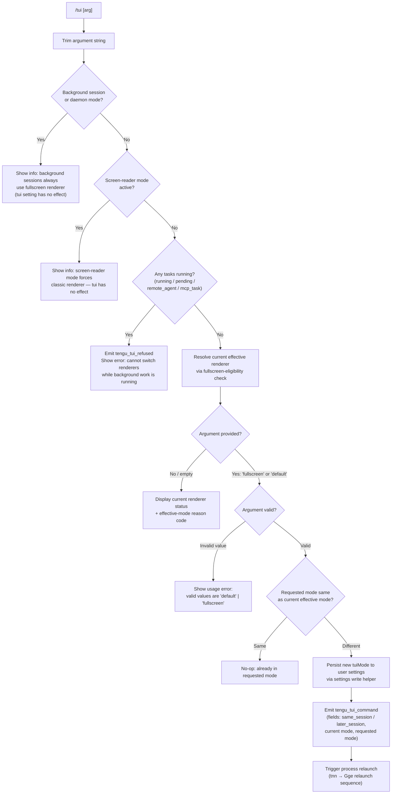

# `/tui`

> Analysis basis: CC v2.1.199 bundle.js (AST extraction + Claude interpretation)
> Minimum version: v2.1.199

---

## Overview

The `/tui` command lets the user switch the terminal UI renderer between `default` and `fullscreen` modes at runtime. It inspects the current environment and session state, enforces several preconditions (screen-reader mode, background work, environment overrides), and — when all checks pass — persists the chosen renderer to user settings and relaunches the Claude Code process using the new renderer. The command is a local-jsx type backed by the async handler `_am`.

---

## Registration

| Field | Value |
|---|---|
| type | `local-jsx` |
| name | `tui` |
| description | `Set the terminal UI renderer (default \| fullscreen)` |
| argumentHint | `[default\|fullscreen]` |
| module_id | `Uic` |
| load_inline | `true` |
| loc_byte | `13110222` |
| loc_byte_end | `13110404` |
| loc_line | `9739` |
| arbor_handler.name | `_am` |
| arbor_handler.fqn | `claude-2.1.199::_am` |
| arbor_handler.kind | `AsyncFunction` |
| arbor_handler.resolution_path | `module_id` |
| arbor_handler.n_hits | `0` |

Analysis basis: CC v2.1.199 bundle.js:+13110222

---

## Input Branching

The handler has more than three distinct decision paths, so a Mermaid flowchart is used.



Analysis basis: CC v2.1.199 bundle.js:+13107803 – +13109861

---

## Behavioral Spec

### 1. Argument Normalisation

```
function normaliseArgument(rawArg):
    trimmed = rawArg.trim()
    if trimmed is empty:
        return null
    return trimmed
```

The handler trims the raw argument string before any further evaluation.

Analysis basis: CC v2.1.199 bundle.js:+13107803

---

### 2. Background-Session Guard

```
function checkBackgroundSessionGuard(context):
    mode = context.processMode   // 'daemon' | 'daemon-worker' | normal
    if mode is 'daemon' or 'daemon-worker':
        displayInfoMessage(BACKGROUND_SESSION_NOTE)
        return ABORT
```

When Claude Code is running as a background session (daemon), the fullscreen renderer is always forced on. The `/tui` setting applies only to sessions started directly with `claude`. The informational string begins with "Background sessions always use the fullscreen renderer…" (bundle.js:+13108113).

Analysis basis: CC v2.1.199 bundle.js:+13108099 (call to `ii` → `a0e`)

---

### 3. Screen-Reader Guard

```
function checkScreenReaderGuard(context):
    if screenReaderModeEnabled(context):
        displayInfoMessage(SCREEN_READER_NOTE)
        return ABORT
```

When screen-reader mode is active, the classic (default) renderer is always used regardless of the saved setting. The informational string begins with "Screen-reader mode always uses the classic renderer…" (bundle.js:+13108323).

Analysis basis: CC v2.1.199 bundle.js:+13108309

---

### 4. Active-Task Guard

```
function checkActiveTaskGuard(appState):
    activeTasks = appState.tasks.filter(task =>
        task.status in ['running', 'pending', 'remote_agent', 'mcp_task']
    )
    if activeTasks.length > 0:
        emitTelemetry('tengu_tui_refused')
        displayError(CANNOT_SWITCH_WHILE_WORK_RUNNING_MSG)
        return ABORT
```

The guard uses `Object.values` over the tasks map and checks four status strings: `running`, `pending`, `remote_agent`, `mcp_task`. The error message begins with "Cannot switch renderers while work is running in the background…" (bundle.js:+13108820).

Analysis basis: CC v2.1.199 bundle.js:+13108620 – +13108820

---

### 5. Effective-Renderer Resolution

```
function resolveEffectiveRenderer(context):
    // Delegates to fullscreen-eligibility logic (zke)
    // Returns one of: 'fullscreen' | 'default'
    // Also returns a reason code string (see reason codes below)
    eligibility = computeFullscreenEligibility(context)
    return { renderer: eligibility.renderer, reasonCode: eligibility.reason }
```

Eligibility is computed by the function mapped to identifier `zke`, which itself calls the core fullscreen-decision function (`zs`). Reason codes emitted include: `bg_forced_on`, `sr_auto_off`, `env_off`, `env_on`, `tmux_cc_auto_off`, `win_ssh_auto_off`, `settings_on`, `settings_off`, `downsell_on`, `gb_on`, `gb_off` (bundle.js:+3615702 – +3616108).

The decision tree inside `zs` checks, in order:

1. Background-agent mode → forces `fullscreen` (`bg_forced_on`).
2. Screen-reader mode → forces `default` (`sr_auto_off`).
3. `CLAUDE_CODE_NO_FLICKER` or `CLAUDE_CODE_DISABLE_ALTERNATE_SCREEN` env vars → forces `default` (`env_off`).
4. `CLAUDE_CODE_FORCE_FULLSCREEN_UPSELL` env var → forces `fullscreen` (`env_on`).
5. tmux `-CC` (iTerm2 integration) detected → forces `default` (`tmux_cc_auto_off`) with message "fullscreen disabled: tmux -CC (iTerm2 integration mode) detected…" (bundle.js:+3614856).
6. Windows over SSH (ConPTY) detected → forces `default` (`win_ssh_auto_off`) with message "fullscreen disabled: Windows over SSH (ConPTY re-rendering) detected…" (bundle.js:+3615042).
7. User settings `tuiMode` = `fullscreen` → `settings_on`.
8. User settings `tuiMode` = `default` → `settings_off`.
9. Growthbook flag off/on → `gb_off` / `gb_on`.

Analysis basis: CC v2.1.199 bundle.js:+13108992 (`zke`) and +3614628 – +3616108 (`zs`)

---

### 6. Status Display (No Argument)

```
function displayCurrentStatus(effectiveRenderer, reasonCode):
    lines = [
        "Current renderer: " + effectiveRenderer,
        "Reason: " + reasonCode
    ]
    displayInfoPanel(lines)
```

When the user invokes `/tui` with no argument, the handler reads the resolved renderer and reason code and renders them in the UI.

Analysis basis: CC v2.1.199 bundle.js:+13107873 – +13107961

---

### 7. Validation and Write

```
function validateAndApply(arg, currentRenderer, context):
    VALID = ['fullscreen', 'default']
    if arg not in VALID:
        displayError("Valid values: " + VALID.join(' | '))
        return

    if arg == currentRenderer:
        displayInfo("Already in " + arg + " mode")
        return

    writeSettingToUserConfig('tuiMode', arg)
    emitTelemetry('tengu_tui_command', {
        session_timing: determineSessionTiming(),   // 'same_session' | 'later_session'
        from: currentRenderer,
        to: arg
    })
    triggerRelaunch(context)
```

Valid argument values are exactly `"fullscreen"` (bundle.js:+3615190) and `"default"` (bundle.js:+3615216). The telemetry payload distinguishes whether the relaunch will happen in the same session (`same_session`, bundle.js:+13109705) or a later session (`later_session`, bundle.js:+13109720).

Analysis basis: CC v2.1.199 bundle.js:+13107961 – +13109861

---

### 8. Relaunch Sequence (`tnn` → `Gge`)

```
async function relaunchProcess(context):
    // Save cursor position (ESC-7)
    // Unmount current Ink/React tree
    // Flush write queue (timeout: 30 000 ms, "flush timeout (relaunch)")
    // Start new QT signal handler
    // Drain BFS queue (timeout: 2 000 ms, "cleanup timeout")
    // Flush analytics (timeout: variable, "analytics flush timeout")
    // Reinitialise working directory (xic)
    // Remove all process signal listeners
    // Re-attach SIGINT / SIGTERM / SIGHUP / beforeExit handlers
    // spawnSync new process with 'inherit' stdio and '--resume' flag
    // On spawn error: write 'relaunch_spawn_error' marker file (xI)
    // process.exit or process.kill to hand off
```

Key timeout constants:
- Flush timeout (relaunch): **30 000 ms** (bundle.js:+13102964)
- Cleanup timeout: **2 000 ms** (bundle.js:+13103021)

The relaunch passes the `--resume` flag (bundle.js:+13102897) and uses `spawnSync` with `inherit` stdio (bundle.js:+13103582). On spawn error, the string `"relaunch_spawn_error"` is written to a marker file (bundle.js:+13103772). Signals cleared before relaunch: `SIGINT`, `SIGTERM`, `SIGHUP` (bundle.js:+13103449 – +13103468).

Analysis basis: CC v2.1.199 bundle.js:+13105167 (`tnn`) and +13102751 – +13103861 (`Gge`)

---

### 9. Terminal Compatibility Detection

The `hU` function is invoked from `_am` to detect terminal properties that influence eligibility:

```
function detectTerminalCapabilities():
    termProgram = env.TERM_PROGRAM     // checked against 'cursor', 'vscode'
    isJetBrains = fU.isJetBrainsIdeTerminal()
    columnCount = measureTerminalColumns()   // hZd: parseFloat, capped at 20 min
    return { termProgram, isJetBrains, columnCount }
```

Analysis basis: CC v2.1.199 bundle.js:+13109125 – +13109298

---

## State & Side Effects

| Item | Detail |
|---|---|
| Telemetry: `tengu_tui_command` | Fired on every successful renderer change; carries `same_session` / `later_session`, `from`, and `to` fields (bundle.js:+13109259) |
| Telemetry: `tengu_tui_refused` | Fired when the active-task guard blocks the switch (bundle.js:+13108779) |
| Telemetry: `tengu_amber_creek` | Fired during fullscreen eligibility evaluation — tmux-CC path (bundle.js:+3615374) |
| Telemetry: `tengu_pewter_brook` | Fired during fullscreen eligibility evaluation — Windows-SSH path (bundle.js:+3615281) |
| Telemetry: `tengu_scroll_summary` | Fired as part of the relaunch/teardown flow (bundle.js:+6912522) |
| Telemetry: `tengu_feature_ok` / `tengu_feature_bad` / `tengu_feature_sad` | General feature-gate outcome events emitted during settings read path (bundle.js:+1039941, +1040008, +1040089) |
| Telemetry: `tengu_daemon_control` | Emitted within background-session control flow (bundle.js:+18569105) |
| Telemetry: `tengu_disable_bypass_permissions_mode` | Emitted when bypass-permissions mode is overridden by policy (bundle.js:+3466547) |
| User settings write | `tuiMode` key written to user `settings.json` (via `fKu` → `Zle` atomic write path with temp file, rename, chmod) |
| Settings path | `~/.claude/settings.json` (bundle.js:+1349818 / +1349828) |
| Cache clear | `Ccn.clear` and `$Tr.clear` called after settings write (`l_`, bundle.js:+29358 / +29370) |
| Process relaunch | `spawnSync` with `inherit` stdio and `--resume` CLI flag; process terminated via `process.exit` or `process.kill` |
| Cursor save/restore | ESC-7 (`\x1b7`, bundle.js:+3963138) saved before teardown; ESC-8 (`\x1b8`, bundle.js:+3963149) available for restore |
| Ink/React unmount | `e.unmount()` called on current render tree before relaunch (bundle.js:+6910078) |
| Signal handlers | All existing listeners removed (`process.removeAllListeners`); `SIGINT`, `SIGTERM`, `SIGHUP`, `beforeExit` re-registered before spawn |
| Spawn error marker | Written to disk via `xI` → `Ale.writeFileSync` if `spawnSync` fails (bundle.js:+203507) |
| Environment variables consulted | `CLAUDE_CODE_NO_FLICKER`, `CLAUDE_CODE_DISABLE_ALTERNATE_SCREEN`, `CLAUDE_CODE_FORCE_FULLSCREEN_UPSELL` (bundle.js:+13105263 – +13105327) |

---

## Version History

| Version | Change |
|---|---|
| v2.1.199 | Initial analysis |

---

## Common Mistakes

1. **Running `/tui fullscreen` while tasks are active** — the command will be refused with a message directing users to `/tasks`. Wait for all background work (`running`, `pending`, `remote_agent`, `mcp_task`) to finish, then retry.
2. **Expecting `/tui` to affect background (daemon) sessions** — background sessions always force the fullscreen renderer regardless of this setting; the command will display an informational notice and take no action.
3. **Using `/tui` with screen-reader mode enabled** — screen-reader mode forces the classic renderer; the setting is silently ignored and the command notifies the user.
4. **Passing an unsupported value** — only `default` and `fullscreen` are accepted. Any other string produces a usage error.
5. **Expecting immediate visual change without a relaunch** — the renderer switch requires a full process relaunch via `spawnSync`; the current session terminates and a new one begins with `--resume`.
6. **Assuming environment variables are overridden by the setting** — `CLAUDE_CODE_NO_FLICKER`, `CLAUDE_CODE_DISABLE_ALTERNATE_SCREEN`, and `CLAUDE_CODE_FORCE_FULLSCREEN_UPSELL` take precedence over the stored setting in the eligibility decision tree.
7. **Omitting the argument to change the mode** — calling `/tui` with no argument only displays the current renderer and reason code; it does not toggle or reset anything.

---

## Appendix — Identifier Mapping

> For bundle debugging only. Identifiers change across versions.

| Identifier | Role |
|---|---|
| `_am` | Main `/tui` command handler (AsyncFunction, resolved via module_id `Uic`) |
| `tnn` | Outer wrapper / entry point that invokes `Gge` relaunch and `cke` env checks |
| `Gge` | Core relaunch orchestrator — unmounts UI, flushes queues, spawns new process |
| `wB` | Config/version-path builder used during relaunch setup |
| `CQn` | Claude version directory resolver |
| `Nf` | Path normalisation helper |
| `nse` | User-local share path resolver |
| `Dpe` | Binary path resolver (`.local/share/claude/…/bin`) |
| `N4n` | Home directory base resolver (`XMa.homedir`) |
| `ML` | Logging/message helper used in relaunch |
| `kt` | Utility wrapper calling `Aw` |
| `QWt` | Interval-clear wrapper (`J_o` → `clearInterval`) |
| `U8e` | UI teardown: writes sync, unmounts Ink tree, triggers cleanup |
| `gU` | Post-unmount cleanup step |
| `L1n` | Terminal restore sequence writer (ESC-7/8, cursor restore) |
| `xGe` | Terminal capability checker (Ghostty ≥ 1.2.0, iTerm ≥ 3.6.6) |
| `TGe` | Additional terminal restore helper |
| `Lx` | tmux / screen escape sequence handler (`\x1b\x1b` double-escape) |
| `Dd` | Debug drain helper |
| `T` | Low-level terminal output writer (write + flush) |
| `b5n` | Scroll-summary emitter (`tengu_scroll_summary`) |
| `rx` | Scroll position reader |
| `oOa` | Scroll data aggregator |
| `V` | Generic value container / observable |
| `rOa` | Timing calculator (`Date.now`, `Math.max`, `Math.round`, `Object.assign`) |
| `tOa` | Timing sub-helper |
| `zs` | Fullscreen-eligibility core decision function |
| `oO` | Local-agent capability check (`u5u.has`) |
| `hD` | Feature-flag/colour-mode check (`fOi.isEnabled`) |
| `nno` | Node context helper (`at`) |
| `Wre` | Environment variable reader (`eYd`) |
| `tno` | Boolean coercion helper for platform check |
| `Lr` | Settings-read dispatcher (`CV`) |
| `tYd` | Eligibility post-processor (`ot`) |
| `ot` | Renderer decision applier (checks `bke`, `wDn`, `mBt`, `_q`, `Mt`) |
| `Ka` | Promise race with timeout (`setTimeout`, `Promise.race`, `clearTimeout`) |
| `QT` | Signal/process-exit handler initialiser (`ru`) |
| `ru` | BFS register + `process.on('exit')` hook |
| `Ai` | BFS registration helper |
| `ket` | BFS drain caller |
| `$8e` | Analytics flush orchestrator (`Promise.resolve`, `y5n`) |
| `y5n` | Analytics flush sub-helper |
| `eqo` | Working-directory reinitialiser (uses `Oic.dirname`, `cH`, `ol`) |
| `ar` | Utility calling `Aw` (used in directory init) |
| `ol` | Path-join utility calling `Aw` |
| `Ric` | Multi-queue drain orchestrator (debug, diag, pre-exit, write queues) |
| `OHe` | Debug flush helper |
| `cPt` | Diag flush helper |
| `Hun` | `Tfs.drain` caller |
| `I6` | Write-queue drain (`Promise.all`) |
| `xic` | Process-replace / execve wrapper (loads `bun:ffi`, `libSystem`/`libc`) |
| `Wfc` | Telemetry event emitter (uses `Date.now`, `Qs`, `Bnn`, `xe`) |
| `yV` | Path normalisation (`IN.normalize`, `replaceAll`) |
| `ln` | Module cache helper |
| `Whe` | JSON-response builder (`JSON.stringify`) |
| `Le` | Feature-gate check — OK path (`tengu_feature_ok`) |
| `we` | Feature-gate check — bad path (`tengu_feature_bad`) |
| `n2` | First-party flag checker (`hG`, `rJ`, `B6e`, `qZr`) |
| `w8` | Process-exit race (`Promise.race`, `Promise.all`, `yEe`, `wEe`, `On`, `process.exit`) |
| `ge` | String coercion helper |
| `xI` | Spawn-error marker file writer (`Ale.writeFileSync`) |
| `cke` | Environment-variable reader for `CLAUDE_CODE_*` flags |
| `rpr` | CLI argument builder for relaunch (`Array.from`, `iBe`, `Pke`) |
| `iBe` | Argument-list builder sub-helper |
| `Pke` | Config-access guard (`Mt`, `Boolean`) |
| `Mt` | Config accessor (throws if accessed before allowed) |
| `BJo` | Config read sub-helper |
| `GJo` | Config fallback sub-helper |
| `hae` | Config schema helper |
| `Or` | App-state reader for session context (`working_directory`, `allowed_tools`, etc.) |
| `Msr` | Session metadata extractor — allowed tools (`vo`) |
| `Dsr` | Session metadata extractor — disallowed tools (`vo`) |
| `vo` | Tool-list formatter |
| `wR` | Bypass-permissions resolver (`Feo`) |
| `Feo` | Bypass-permissions policy checker (`tengu_disable_bypass_permissions_mode`) |
| `sg` | App-state reader for effort/model/thinking-tokens/flag settings |
| `ii` | Process-mode detector (`a0e`) — distinguishes `daemon` / `daemon-worker` |
| `a0e` | Daemon-mode identifier |
| `zke` | Fullscreen eligibility wrapper called from `_am` |
| `Qo` | Settings loader entry point (`Hf`) |
| `Hf` | Settings load orchestrator (cache, `fKu`, then/set) |
| `Qh` | Settings cache resolver (`NLe`, `t9`) |
| `NLe` | Settings file path builder (`userSettings`, `projectSettings`, `localSettings`) |
| `t9` | Settings schema/default builder |
| `fKu` | Full settings-load-from-disk function (reads JSON, resolves symlinks, writes gitignore) |
| `TUr` | Settings hierarchy merger (`HOs`, `NLe`, `IV`, `gOs`, `HV`) |
| `f_e` | Settings file reader (`n.readFile`, slice, replaceAll) |
| `pn` | Error code normaliser (`rn`) |
| `zt` | Async file utility |
| `TNr` | Settings timestamp recorder (`f_n.set`, `Date.now`) |
| `S9e` | Settings post-processor (`oyn`, `t9`) |
| `Zle` | Atomic file writer (temp file → rename → chmod; handles ELOOP, ENOTDIR, EACCES) |
| `xe` | JSON serialiser (`JSON.stringify`) |
| `l_` | Cache invalidator (`Ccn.clear`, `$Tr.clear`) |
| `a_n` | Gitignore-tracking helper (`SLe.mkdir`, `readFile`, `appendFile`, `writeFile`) |
| `L6` | Settings path joiner (`ON.join`, `.claude/settings.json`) |
| `Et` | Feature-gate check — sad path (`tengu_feature_sad`) |
| `CV` | Settings read dispatcher (`C0`, `Sa`, `IUr`, `t9`, `vcn`) |
| `ke` | Telemetry event sender (`sr`, `at`, `Pi`, `Gku`, `fne.logError`) |
| `hU` | Terminal capability detector (JetBrains, column count, Cursor/VSCode) |
| `x3t` | Terminal size query helper |
| `IH` | Terminal property reader |
| `Qno` | VSCode/Cursor terminal version checker (`gZd`, `x3t`) |
| `gZd` | Terminal version string parser |
| `Oy` | Platform/terminal reporter (`IH`) |
| `hZd` | Column count measurer (`parseFloat`, `Number.isNaN`, `Math.min`, cap 20) |
| `Zno` | Terminal column raw reader |
| `Pe` | Render component root (`GZe`) |
| `GZe` | Top-level JSX render target |
| `hG` | Analytics/telemetry batch writer (`b9`) |
| `b9` | Batch record builder (`Q8d`, `Vm`, `i_e`) |
| `Q8d` | Record formatter (`at`, `ic`) |
| `at` | String coercion primitive |
| `ic` | Record serialiser (`gr`) |
| `Vm` | Batch metadata appender |
| `i_e` | Telemetry queue flusher (`KTs`) |
| `KTs` | Queue-drain utility |
| `Ws` | Telemetry consent / product-feedback checker (`mGi`, `vqd`, `wqd`, `Pi`, `pEe`, `EG`) |
| `mGi` | Telemetry mode resolver (`EG`) |
| `EG` | Telemetry config reader (`s2`, `CBt`, `IEe`) |
| `s2` | Telemetry state holder (`IBt`) |
| `CBt` | Telemetry config file reader (`pGi.readFileSync`, `Lke`, `Wa`, `BDn`) |
| `IEe` | Telemetry domain/inclusion checker (`egi`, `dGi`, `n.some`, `t.includes`, `pq`) |
| `Pi` | Telemetry send primitive (`KTs`) |
| `pEe` | Telemetry pre-flight checker (`at`) |