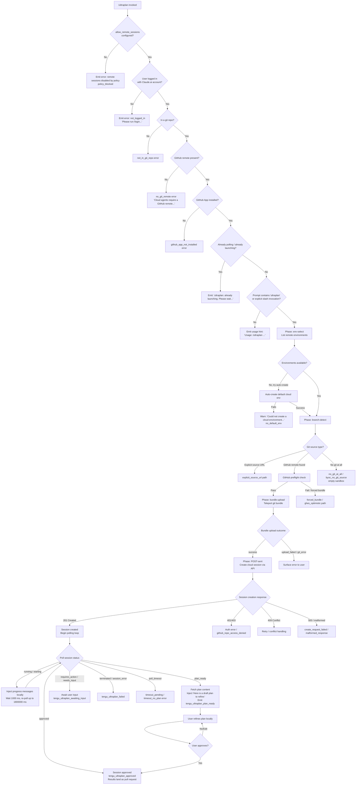

# `/ultraplan`

> Analysis basis: CC v2.1.199 bundle.js (AST extraction + Claude interpretation)
> Minimum version: v2.1.199

---

## Overview

`/ultraplan` launches a cloud-hosted planning session on Claude.ai that drafts an editable plan for the given prompt, then polls for the plan to be returned to the local session for user refinement. It performs a multi-phase teleport sequence—eligibility checks, git/source detection, bundle upload, session creation via the Anthropic cloud API, and result ingestion—before injecting the completed plan back into the local conversation.

---

## Registration

| Field | Value |
|---|---|
| type | `local-jsx` |
| name | `ultraplan` |
| description | `"Draft an editable plan in Claude Code on the web ( ... ) · See  ... "` |
| argumentHint | `<prompt>` |
| load_inline | `true` |
| load_ident | `_sm` |
| loc_byte | `12939290` |
| loc_byte_end | `12939522` |
| loc_line | `9514` |
| arbor_handler.name | `_sm` |
| arbor_handler.fqn | `claude-2.1.199::_sm` |
| arbor_handler.kind | `AsyncFunction` |
| arbor_handler.resolution_path | `load_ident` |
| arbor_handler.n_hits | `1` |

Analysis basis: CC v2.1.199 bundle.js:+12939290

The handler is inlined via a `load:()=>Promise.resolve({call: _sm})` shape. Arbor resolved the handler as `_sm` following the `load_ident` resolution path. The registration block spans bytes `(12939290, 12939522)`.

---

## Input Branching

The command has many distinct branches across precondition checks, source-detection phases, and session lifecycle events. A Mermaid flowchart is used.



Analysis basis: CC v2.1.199 bundle.js:+12937425, +12934648, +12934872, +12934890, +12935465, +12930312

---

## Behavioral Spec

### 1. Entry Point — Handler Dispatch (`_sm`)

The async handler `_sm` is the primary entry point, loaded via inline `Promise.resolve`.

```
async function handleUltraplan(context, args):
    check remoteSessionsAllowed(context)          // allow_remote_sessions setting
    userPrompt = extractPromptText(args)
    eligibilityResult = await checkEligibility(context)
    if eligibilityResult.blocked:
        return emitError(eligibilityResult.reason)
    sessionState = context.getAppState()
    taskDescriptor = buildTaskDescriptor(userPrompt, sessionState)
    result = await launchAndPoll(taskDescriptor, context)
    context.setAppState(updatedState)
    return renderResult(result)
```

Analysis basis: CC v2.1.199 bundle.js:+12937425, +12937443, +12937478, +12937760, +12937791, +12937982

The `allow_remote_sessions` literal is checked early (`bundle.js:+12937446`). The handler calls `t.getAppState()` at `+12937760` and `t.setAppState()` at `+12937982` to read/write session tracking state.

---

### 2. URL / Prompt Normalization (`urlNormalizer`, `promptCleaner`)

Before eligibility checks, the raw argument string is preprocessed.

```
function normalizePromptText(rawInput):
    // Strip leading slash-command prefix if present
    stripped = rawInput.slice(relevantOffset)
    // Collapse repeated whitespace; replace matched pattern with "$1$2"
    cleaned = stripped.replace(collapsePattern, "$1$2")
    // Lowercase for comparison (max 40 chars for key segment)
    key = cleaned.toLowerCase().slice(0, 40)
    return { cleaned, key }
```

Analysis basis: CC v2.1.199 bundle.js:+11534301, +11534372, +11534398, +18559902, +18559976

Replacement literal `"$1$2"` (`+11534398`), slice limit `40` (`+18559976`), and `5` (`+11534421`) are observed numeric constants in the normalization path.

---

### 3. Remote Eligibility Check (`remoteEligibilityChecker`)

```
async function checkRemoteEligibility(context):
    if not isFirstPartyProvider(context):
        return blocked("policy_denied",
            "Cloud sessions are only available on the first-party Anthropic API provider.")
    if not hasAccessToken(context):
        return blocked("no_access_token",
            "Cloud sessions require a claude.ai login. Run /login to authenticate.")
    orgUUID = await getOrganizationUUID(context)
    if not orgUUID:
        return blocked("no_org_uuid",
            "Unable to get organization UUID for cloud session creation")
    if policyBlocksRemoteSessions(context):
        return blocked("policy_blocked",
            "Cloud sessions are disabled by your organization's policy...")
    return eligible(orgUUID)
```

Analysis basis: CC v2.1.199 bundle.js:+9509273, +9509328, +9509806, +9510100, +9510154, +9510396, +9528552, +9528575

The `"firstParty"` literal (`+2176689`) is checked via `ic` → `gr`. Access token presence is tested at `+9510068`. Organization UUID retrieval is performed at `+9510136`.

---

### 4. Pre-flight State Guard (`stateLockGuard`)

```
function checkNotAlreadyLaunching(state):
    if state.has("already_polling"):
        return abort("already_polling")
    if state.has("already_launching"):
        emit("ultraplan: already launching. Please wait for the session to start.")
        return abort("already_launching")
    state.add("already_launching")
```

Analysis basis: CC v2.1.199 bundle.js:+12934872, +12934890, +12933425

Literal `"already launching"` message at `+12933425`. The guard runs inside `qtn` before any network calls.

---

### 5. Usage Validation (`usageValidator`)

```
function validateUsage(prompt, invocationStyle):
    if invocationStyle == "slash":
        if prompt is empty and "ultraplan" not in prompt:
            emit('Usage: /ultraplan <prompt>, or include "ultraplan" anywhere in your prompt')
            return invalid
    return valid
```

Analysis basis: CC v2.1.199 bundle.js:+12934937, +12935003, +12937571

Literal `"slash"` at `+12937571`; usage string split across `+12934937` and `+12935003`.

---

### 6. Prompt Identifier Telemetry (`promptIdentifierReporter`)

```
function reportPromptIdentifier(prompt):
    identifier = hashOrClassifyPrompt(prompt)   // via ot / r2 pipeline
    emit_telemetry("tengu_ultraplan_prompt_identifier", { identifier })
```

Analysis basis: CC v2.1.199 bundle.js:+12930312

Telemetry event `tengu_ultraplan_prompt_identifier` fires early in the `Mdr`/`ot` call chain to classify the prompt for analytics.

---

### 7. Environment Selection (`environmentSelector`, `kse`)

```
async function selectEnvironment(orgUUID, accessToken):
    envList = await fetchRemoteEnvironments(orgUUID)   // GET teleport_environments_list
    if envList is empty:
        defaultEnv = await tryAutoCreateDefaultEnv()
        if defaultEnv fails:
            warn("Could not create a cloud environment. Set one up at https://claude.ai/code/onboarding?magic=env-setup")
            return error("no_default_env")
        log("[teleportToRemote] Auto-created default cloud env")
        return defaultEnv
    bridgeEnvs = filterBridgeEnvironments(envList)
    if bridgeEnvs is empty:
        return error("no_environments", "No environments available for session creation")
    return selectBestEnvironment(bridgeEnvs)
```

Analysis basis: CC v2.1.199 bundle.js:+8020873, +9513137, +9513160, +9513268, +9513426, +9513530, +9514340, +9514406, +9514448, +9514565

Timeout for environment list fetch: `15000` ms (`+8021508`). Default env tag: `"Default"` (`+8021910`). Default cloud env creation tag: `"teleport_default_environment_create"` (`+8021935`).

---

### 8. Source / Branch Detection (`branchDetector`, `tD`)

```
async function detectSourceAndBranch(context):
    // Phase logged as "[teleport] phase: branch-detect"
    remoteURL = await getGitRemoteOriginURL()   // git config --get remote.origin.url
    if no remoteURL:
        if CCR_FORCE_BUNDLE env set:
            return { mode: "forced_bundle" }
        return { mode: "no_git_at_all" }
    branch = await getCurrentBranch()
    // git symbolic-ref --short refs/remotes/origin/HEAD
    // Fallback candidates: "main", "master"
    if githubPreflightPassed:
        return { mode: "github", branch }
    else:
        return { mode: "ghes_optimistic" or "no_github_remote" }
```

Analysis basis: CC v2.1.199 bundle.js:+9514965, +1169976, +1181842, +1181857, +1181867, +1181980, +1181987, +9515176, +9515198, +9515429

Git commands used: `git config --get remote.origin.url`, `git symbolic-ref --short refs/remotes/origin/HEAD`, `git show-ref --quiet`, `git rev-parse --verify HEAD`.

---

### 9. Bundle Upload / Teleport Seed (`bundleUploader`, `IDo`)

```
async function uploadGitBundle(sessionId, context):
    // Phase: "[teleport] phase: bundle-upload"
    // Cleanup prior seed refs
    git("update-ref", "-d", "refs/seed/stash")
    git("update-ref", "-d", "refs/seed/root")
    // Enumerate refs
    refs = git("for-each-ref", "--count=1", "refs/")
    if refs empty:
        return error("empty_repo", "Not in a git repository")
    head = git("rev-parse", "--verify", "HEAD")
    // Stash working tree changes
    stashResult = git("stash", "create")
    if stashFailed: return error("stash_failed")
    // Write bundle file: ccr-seed-<id>.bundle
    bundleFile = writeBundleFile("ccr-seed", ".bundle", context)
    uploadResult = await uploadBundleToAPI(bundleFile, sessionId)
    unlink(bundleFile)     // cleanup temp file
    if uploadResult.status == "failed":
        return error("upload_failed")
    return {
        status: "success",
        mode: one of ["head","fallback_head","squashed","fallback_squashed"]
    }
```

Analysis basis: CC v2.1.199 bundle.js:+9490775, +9490804, +9490905, +9490923, +9490956, +9491007, +9491022, +9491293, +9491301, +9491645, +9491657, +9491668, +9492100, +9492111, +9492407, +9492512, +9492556, +9492708, +9493052

Telemetry `tengu_ccr_bundle_upload` fires at `+9491097`. Telemetry `tengu_teleport_bundle_mode` fires at `+9510841`.

---

### 10. Session Creation (`sessionCreator`, `gj` / `Byl`)

```
async function createCloudSession(payload, orgUUID, accessToken):
    // Phase: "[teleport] phase: POST-sent"
    endpoint = selectEndpoint(apiVersion)
    // v1alpha2 -> /v1/code/sessions; v1 -> /v1/sessions
    headers = {
        "x-organization-uuid": orgUUID,
        "anthropic-beta": betaFlag
    }
    response = await httpPost(endpoint, payload, headers)
    if response.status == 201:
        sessionId = extractSessionId(response)
        if not sessionId:
            return error("malformed_response",
                "Server returned a malformed session response (no session id)")
        return { sessionId }
    if response.status in [401, 403]:
        return error("github_repo_access_denied")
    if response.status == 409:
        handleConflict()
    if response.status >= 500:
        return error("create_request_failed")
```

Analysis basis: CC v2.1.199 bundle.js:+9508940, +9508951, +9508971, +9509006, +9509044, +9511898, +9511955, +9511993, +9512065, +9512069, +9512119, +9512731, +9512794, +9512857, +9518675

HTTP status constants: `200` (`+9491621`), `201` (`+9511993`), `401`/`403` (`+9512065`/`+9512069`), `409` (`+9521596`), `500` (`+9511955`).

---

### 11. Task Descriptor / Plan Prefix Builder (`taskDescriptorBuilder`, `psm`)

```
function buildTaskDescriptor(userPrompt, priorPlan):
    parts = []
    if priorPlan:
        parts.push("Here is a draft plan to refine:")
        parts.push(formatPlan(priorPlan))   // dsm -> lsm formatting
    parts.push(userPrompt)
    return parts.join("\n")
```

Analysis basis: CC v2.1.199 bundle.js:+12930479, +12930486, +12930539, +12930569

Literal `"Here is a draft plan to refine:"` at `+12930486` is the injected prefix when an existing draft plan is present.

---

### 12. Session Polling Loop (`sessionPoller`, `fsm` / `jrc`)

```
async function pollSessionUntilDone(sessionId, context):
    maxPollMs = 1800000    // 30 minutes
    pollIntervalMs = 1000
    timeoutUnit = 60000    // 1 minute per unit
    startTime = Date.now()
    while elapsed < maxPollMs:
        sessionState = await fetchSessionState(sessionId)
        emit_telemetry("tengu_ultraplan_timeout_seconds", elapsedSeconds)
        match sessionState.status:
            "starting" | "running":
                injectProgressMessage(sessionState)
                await sleep(pollIntervalMs)
                continue
            "plan_ready":
                plan = extractPlanContent(sessionState)
                injectLocalMessage("Here is a draft plan to refine: ...")
                emit_telemetry("tengu_ultraplan_plan_ready")
                return { outcome: "plan_ready", plan }
            "requires_action" | "needs_input":
                emit_telemetry("tengu_ultraplan_awaiting_input")
                awaitUserInput()
            "approved":
                emit_telemetry("tengu_ultraplan_approved")
                injectMessage("Results will land as a pull request when the cloud session finishes.")
                return { outcome: "approved" }
            "terminated" | "session_error" | "orchestrator_error":
                emit_telemetry("tengu_ultraplan_failed")
                return { outcome: "failed" }
            "archived" | "completed":
                return { outcome: "done" }
    if elapsed >= maxPollMs:
        return error("poll_timeout")
```

Analysis basis: CC v2.1.199 bundle.js:+12930145, +12930179, +12930623, +12930789, +12930857, +12931277, +12932166, +12921007, +12921136, +12921505, +12922005, +12922143, +12922195, +12922210, +12922325, +12922340, +12922548, +12922566, +9533666, +9533673

Poll interval: `1000` ms (`+9533666`). Max poll window: `1800000` ms / 30 minutes (`+9533673`). Timeout unit: `60000` ms (`+12922325`). Maximum session age constant: `5400` seconds (`+12930179`).

---

### 13. Result Injection into Local Session (`resultInjector`, `Hsm`)

```
async function injectResultToLocalSession(plan, sessionContext):
    systemMessage = buildSystemMessage(plan)        // type: "system"
    taskNotification = buildNotification(plan, "task-notification")
    preconditionBlock = buildPreconditionContext(plan, "precondition")
    // Render "Refine local plan" UI element with action "plan"
    renderLocalPlanEditor("Refine local plan", plan)
    // Register abort handler
    registerAbortHook()     // Ai -> bfs.register
    // Post via hj -> mo.post with timeout 1500ms
    await postLocalMessage(systemMessage, { timeout: 1500 })
```

Analysis basis: CC v2.1.199 bundle.js:+12935140, +12935247, +12935382, +12935462, +12935465, +12935573, +12935641, +12935709, +12935717, +12935742, +12935797, +12935832, +12936224, +12936270, +12936347, +12936428, +12936463, +12936521, +12936628, +12936648, +12936664, +12936698, +12936726, +12936706

Literals involved: `"system"` (`+12937518`), `"task-notification"` (`+12935641`), `"precondition"` (`+12935465`), `"Refine local plan"` (`+12935797`), `"plan"` (`+12935832`), `"cli"` (`+12936270`), `"Ultraplan"` (`+12936521`). Post timeout: `1500` ms (`+12936706`).

---

### 14. Error / Failure Handling (`errorHandler`)

```
function handleLaunchError(err, context):
    if err.type == "create_api_fail":
        emit_telemetry("tengu_ultraplan_create_failed")
        log("Cloud ultraplan session failed. Wait for the user's next instructions.")
    elif err.type == "teleport_null":
        emit("teleport_null")
    elif err.type == "unexpected_error":
        log("Ultraplan hit an unexpected error during launch. Wait for the user's next instructions.")
    tryArchiveOrphanedSession(sessionId)   // logs "ultraplan: failed to archive orphaned session" on failure
    emit_telemetry("tengu_ultraplan_launched", { outcome: err.type })
```

Analysis basis: CC v2.1.199 bundle.js:+12934650, +12936033, +12936051, +12936133, +12936357, +12936777, +12936949, +12937110, +12932590

---

### 15. GitHub App Pre-flight Check (`githubPreflightChecker`, `Tqe`)

```
async function checkGithubAppInstalled(orgUUID, accessToken, repoURL):
    if not accessToken:
        log("checkGithubAppInstalled: No access token found, assuming app not installed")
        return false
    if not orgUUID:
        log("checkGithubAppInstalled: No org UUID found, assuming app not installed")
        return false
    response = await httpGet(githubCheckEndpoint, { orgUUID, repoURL })
    if response.status == 400:
        return false    // bad request -> not installed
    if isAxiosError(response):
        return false
    return response.data.installed == true
```

Analysis basis: CC v2.1.199 bundle.js:+8023358, +8023391, +8023484, +8023504, +8023761, +8023902, +8023907, +8024108, +8024162

Literals `"is"` and `"is not"` (`+8023902`, `+8023907`) are used in log formatting of installation status. HTTP 400 triggers non-installed (`+8024162`).

---

### 16. Context Initialization (`fCt` — parallel resource fetch)

```
async function initializeSessionContext():
    [remoteUrl, repoInfo, headFragment] = await Promise.all([
        fetchRemoteURL(),    // eD
        fetchRepoState(),    // r2
        fetchHeadInfo()      // gc / Dt
    ])
    prefix = extractPathPrefix(headFragment)   // hf
    githubInstalled = await checkGithubAppInstalled(...)   // Tqe
    return buildContext(remoteUrl, repoInfo, prefix, githubInstalled)
```

Analysis basis: CC v2.1.199 bundle.js:+12919230, +12919243, +12919248, +12919288, +12919291, +12919306, +12919424, +12919442

---

## State & Side Effects

| Item | Detail |
|---|---|
| Telemetry: `tengu_ultraplan_create_failed` | Fires when the cloud session creation call fails (`+12934650`) |
| Telemetry: `tengu_ultraplan_prompt_identifier` | Fires with prompt classification hash on every invocation (`+12930312`) |
| Telemetry: `tengu_ultraplan_launched` | Fires at conclusion of launch sequence with outcome tag (`+12936357`) |
| Telemetry: `tengu_ultraplan_timeout_seconds` | Fires each poll cycle with elapsed seconds (`+12930145`) |
| Telemetry: `tengu_ultraplan_awaiting_input` | Fires when session reaches `requires_action`/`needs_input` state (`+12930789`) |
| Telemetry: `tengu_ultraplan_plan_ready` | Fires when the remote plan is returned and injected (`+12930857`) |
| Telemetry: `tengu_ultraplan_approved` | Fires when the plan is approved and session proceeds (`+12931277`) |
| Telemetry: `tengu_ultraplan_failed` | Fires when the session terminates with an error (`+12932166`) |
| Telemetry: `tengu_ccr_bundle_seed_enabled` | Fires during bundle-seed eligibility check (`+8025887`) |
| Telemetry: `tengu_ccr_bundle_upload` | Fires during bundle upload phase (`+9491097`) |
| Telemetry: `tengu_teleport_bundle_mode` | Records the resolved bundle mode (head/squashed/etc.) (`+9510841`) |
| Telemetry: `tengu_ccr_session_link` | Records the cloud session link after creation (`+9502011`) |
| Telemetry: `tengu_teleport_source_decision` | Records the resolved source strategy (`+9517467`) |
| appState changes | `t.getAppState()` read at `+12937760`; `t.setAppState()` written at `+12937982`; in-flight session IDs tracked in a Set (`s.add`/`s.delete` in `qtn`) |
| Hook registration | `Ai` calls `bfs.register` at `+69837` to register an abort handler for the remote session |
| File I/O | Temp bundle file `ccr-seed-<uuid>.bundle` written and deleted via `GEt.unlink` / `Ol.unlink` (`+9493052`, `+13825652`) |
| Network | HTTP POST to `/v1/code/sessions` or `/v1/sessions`; HTTP GET for environment list and GitHub app check; Axios used (`mo.post`, `mo.get`, `mo.isAxiosError`, `mo.isCancel`) |
| Process exit | `Ee` → `process.exit` (`+17690910`) on forced shutdown; `p` → `process.exit` (`+18565445`) on abort |

---

## Version History

| Version | Change |
|---|---|
| v2.1.199 | Initial analysis |

---

## Common Mistakes

1. **Invoking without a Claude.ai login**: `/ultraplan` requires OAuth authentication, not just an API key. Running it with only `ANTHROPIC_API_KEY` set triggers `not_logged_in` / `no_access_token` errors. Run `/login` first.
2. **Running outside a git repository**: The command requires a git repo with a GitHub remote. Without one, it fails at the `not_in_git_repo` or `no_git_remote` precondition check.
3. **GitHub App not installed**: Even with a GitHub remote, the GitHub App must be installed on the repository. The pre-flight check (`checkGithubAppInstalled`) will abort the session if the app is absent.
4. **Invoking while a session is already launching**: A second `/ultraplan` call while one is in progress immediately returns the `"already launching"` guard message and takes no further action.
5. **Organization policy restriction**: If your Anthropic organization has disabled cloud/remote sessions, `/ultraplan` will always fail with `policy_blocked`. Contact your organization admin to enable `allow_remote_sessions`.
6. **Empty git history**: A repository with no commits (`Repository has no commits yet`) cannot be bundled. Commit at least one change before invoking `/ultraplan`.
7. **Prompt omission on slash invocation**: Invoking `/ultraplan` with no argument displays the usage hint rather than launching. A non-empty prompt is required.

---

## Appendix — Identifier Mapping

> For bundle debugging only. Identifiers change across versions.

| Identifier | Role |
|---|---|
| `_sm` | Main async handler for `/ultraplan` (Arbor `load_ident` entry point) |
| `uir` | URL / prompt normalization helper |
| `cir` | Sub-routine called by prompt normalizer |
| `f9o` | Inner normalization / pattern-matching function |
| `Ws` | Remote-session settings / eligibility resolver |
| `mGi` | Settings module loader called by `Ws` |
| `EG` | Config reader called by settings resolver |
| `s2` | Config subsystem accessor |
| `CBt` | Config file reader (`readFileSync`-based) |
| `IEe` | Policy / telemetry settings checker |
| `Pi` | Telemetry-level resolver |
| `KTs` | Telemetry string builder |
| `at` | String conversion utility |
| `pEe` | Product-feedback permission checker |
| `sie` | Session invocation descriptor builder |
| `qtn` | Session-launch state-machine / orchestrator |
| `V` | React/JSX rendering primitive |
| `qe` | JSX element factory |
| `GZe` | Core JSX helper |
| `s` | Abort-signal / in-flight-set tracker |
| `Qrc` | Prompt / message queue helper |
| `Ddr` | Pre-dispatch validator |
| `Mdr` | Prompt-identifier dispatch helper |
| `ot` | Prompt-type router / classifier |
| `csm` | Session-message compositor |
| `Hsm` | Session result injector / local-plan renderer |
| `yme` | Remote eligibility check aggregator |
| `v7a` | Background remote eligibility check runner |
| `os` | Output stream helper (Aw/qc) |
| `Aw` | Output stream primitive |
| `qc` | Output stream secondary primitive |
| `psm` | Task-descriptor / plan-prefix builder |
| `dsm` | Plan formatter sub-routine |
| `gj` | Cloud session creation orchestrator (teleport main) |
| `Dt` | Debug/trace logger |
| `yG` | First-party API provider checker |
| `ic` | Provider-type classifier |
| `Iyl` | Project-flag validator |
| `qg` | Token refresh coordinator |
| `WQn` | Organization UUID fetcher |
| `ke` | Access-token retriever |
| `u9` | Organization UUID resolver |
| `Byl` | Session-endpoint selector (v1 / v1alpha2) |
| `IDo` | Git bundle creator and uploader |
| `kt` | Output-stream primitive (Aw wrapper) |
| `Fs` | API base-URL resolver |
| `T` | Streaming output writer |
| `Pe` | JSX element constructor |
| `eD` | Git remote URL fetcher |
| `$yl` | Control-request / UUID generator |
| `iqt` | Session-payload assembler |
| `xe` | JSON serializer helper |
| `pe` | Polling timer manager |
| `bDo` | Session state branch handler A |
| `vDo` | Session state branch handler B |
| `wDo` | Session state branch handler C |
| `Gyl` | Session state branch handler D |
| `$o` | Object-merge utility (`Object.assign`) |
| `Fyl` | Error-type classifier for session creation failures |
| `tVn` | Task-notification builder |
| `Lbf` | Title / branch generation helper (teleport_generate_title) |
| `Dbf` | Result-filter helper |
| `kse` | Remote environment list fetcher |
| `LHt` | Default environment creator |
| `ge` | String coercion helper |
| `p` | Process-abort / forced-shutdown handler |
| `r2` | Repository state reader |
| `hf` | Git-remote-URL prefix stripper (www. / github.com check) |
| `Tqe` | GitHub App installation checker |
| `tD` | Current-branch detector |
| `ks` | Miscellaneous sub-utility (W6/Bo/MH) |
| `EV` | Git remote URL parser |
| `Z` | Voice input state machine (incidentally reachable) |
| `Ee` | Process-exit handler |
| `sr` | Error string normalizer |
| `bm` | Boolean coercion helper |
| `j_` | Cancel-signal checker |
| `sy` | React renderer / root initializer |
| `qr` | React root constructor |
| `Hjt` | React hydration helper |
| `gsm` | Boolean-flag builder for local-session message |
| `STe` | Remote-agent polling driver |
| `VU` | Remote-agent session ID generator |
| `Mqe` | Browser-open helper for cloud session URL |
| `$T` | Polling timestamp tracker |
| `Jbf` | Session-status message formatter |
| `Yyl` | Poll-loop body (status transitions, hook events) |
| `QR` | Task/session state-event dispatcher |
| `oqp` | `task_started` event handler |
| `nqp` | `task_updated` event handler |
| `jjn` | App-state setter (`Ebe.setState`) |
| `EIo` | State-event emit helper |
| `sqp` | Session stop handler |
| `iqp` | Session key-change handler |
| `fsm` | Session poll orchestrator (calls `jrc`, `asm`, `QR`) |
| `jrc` | Individual poll-request executor with retry logic |
| `asm` | Poll-abort-signal handler |
| `hsm` | Poll-state updater |
| `X7t` | Orphaned-session cleanup helper |
| `o` | Column-padder / table formatter |
| `hj` | Local-message poster (mo.post wrapper) |
| `Ai` | Abort-hook registrar (`bfs.register`) |
| `msm` | Pre-launch message emitter |
| `Mt` | App-config accessor (guards config access) |
| `BJo` | Config migration helper |
| `GJo` | Config native accessor |
| `hae` | Config state reader |
| `fCt` | Parallel context initializer (`Promise.all` over eD/r2/gc) |

Note: index built via Arbor fallback; some signals (telemetry, literals) may be missing — see arbor-fallback.js.