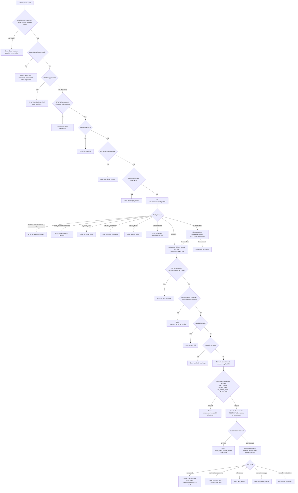

# `/ultrareview`

> Analysis basis: CC v2.1.199 bundle.js (AST extraction + Claude interpretation)
> Minimum version: v2.1.199

---

## Overview

`/ultrareview` launches a cloud-based agent on the Claude Code web platform that performs deep bug-finding and verification across the current Git branch. It runs entirely remotely (estimated cost `$10–$20 USD`, duration `~10–20 min`) and requires a Claude.ai OAuth account, a GitHub remote, and the organization's cloud-session policy to permit remote agents. Results stream back to the local CLI as the remote session progresses.

---

## Registration

| Field | Value |
|---|---|
| type | `local-jsx` |
| name | `ultrareview` |
| description | `"Start a cloud agent that finds and verifies bugs in your branch ( ... , ... USD) · Runs in Claude Code on the web. See ..."` |
| loc_byte | `12950709` |
| loc_byte_end | `12950979` |
| loc_line | `9530` |
| module_id | `roc` |
| load_inline | `true` |
| arbor_handler.name | `Msm` |
| arbor_handler.fqn | `claude-2.1.199::Msm` |
| arbor_handler.kind | `AsyncFunction` |
| arbor_handler.resolution_path | `module_id` |
| arbor_handler.n_hits | `1` |

Analysis basis: CC v2.1.199 bundle.js:+12950709

The handler `Msm` was resolved via `module_id → roc → moduleExports → Msm`. The registration block spans bytes `(12950709, 12950979)`.

---

## Input Branching

The command involves more than three distinct branching paths across precondition checks, preflight, and post-launch polling. A Mermaid flowchart is used.



---

## Behavioral Spec

### 1. Top-level Handler (`Msm`)

The async function `Msm` (handler for `/ultrareview`) orchestrates the entire command lifecycle.

```
async function ultrareviewHandler(args, appState):
    // Step 1: Check allow_remote_sessions policy flag
    if not checkRemoteSessionsAllowed(appState):
        emit telemetry("tengu_review_remote_precondition_failed", reason="allow_remote_sessions")
        return renderError("Cloud sessions are disabled by your organization's policy.")

    // Step 2: Parse --fix flag from args
    fixMode = parseFixFlag(args)   // "fix" | "comment" mode from dVo

    // Step 3: Run preflight validation (Ldr)
    preflightResult = await runPreflight(appState, fixMode)
    if preflightResult.blocked:
        return renderError(preflightResult.reason)

    // Step 4: Show overage dialog if needs-confirm
    if preflightResult.status == "needs-confirm":
        emit telemetry("tengu_review_overage_dialog_shown")
        confirmed = await showCostConfirmationDialog(
            cost="$10-$20",
            duration="~10–20 min"
        )
        if not confirmed:
            return renderMessage("Ultrareview cancelled.")

    // Step 5: Check org subscription / user role (VSt, _b)
    validateSubscriptionAndRole(appState)

    // Step 6: Launch remote session (Rsm → kdr → STe → Yyl)
    sessionResult = await launchRemoteSession(appState, preflightResult, fixMode)
    if sessionResult.failed:
        emit telemetry("tengu_review_remote_teleport_failed")
        return renderError("Ultrareview failed to launch the cloud session.")

    emit telemetry("tengu_review_remote_launched")

    // Step 7: Render JSX session tracker (ooc.jsx)
    return renderSessionTracker(sessionResult)
```

Analysis basis: CC v2.1.199 bundle.js:+12948186

---

### 2. Precondition Checks (`checkRemoteSessionsAllowed` → `yG`, `Ws`, `mGi`, `EG`)

```
function checkRemoteSessionsAllowed(appState):
    // Checks "allow_remote_sessions" feature flag
    // Also checks "allow_product_feedback" setting
    // Returns false if:
    //   - essential-traffic-only mode active (literal: "essential-traffic")
    //   - no-telemetry mode active (literal: "no-telemetry")
    //   - auth type is "no_auth", "oauth_no_inference_scope"
    //   - provider type is "third_party_provider" or "custom_base_url"
    if featureFlag("allow_remote_sessions") is disabled:
        return false
    if authType in ["no_auth", "oauth_no_inference_scope"]:
        return false
    if providerType in ["third_party_provider", "custom_base_url"]:
        return false
    return true
```

Analysis basis: CC v2.1.199 bundle.js:+12948186 (yG call), +3421427 (Ws), +3421154 (mGi), +3422033 (EG)

Literals observed: `"allow_remote_sessions"` (+12948189), `"Cloud sessions"` (+12948213), `"essential-traffic"` (+874142), `"no_auth"` (+3420784), `"third_party_provider"` (+3420579).

---

### 3. Argument Parsing — `--fix` flag (`dVo` → `vdr`)

```
function parseFixFlag(rawArgs):
    // Trims and splits the raw args string
    // Recognizes "--fix" as a boolean flag
    // Maps to mode: "fix" (apply findings) or "comment" (annotate only)
    // Validates against allowed set {"fix", "comment", "/code-review ultra"}
    tokens = rawArgs.trim().split(" ")
    if "--fix" in tokens:
        return "fix"
    return "comment"
```

Analysis basis: CC v2.1.199 bundle.js:+12948308 (dVo), +12909715 (vdr), +12909722 (`"fix"`), +12909728 (`"comment"`), +12909807 (`"/code-review ultra"`)

---

### 4. Preflight Validation (`Ldr`)

`Ldr` is a large async function that validates all local and remote preconditions before allowing the cloud session to launch.

```
async function runPreflight(appState, fixMode):
    // 4a. Verify inside a git repo
    gitCheck = execGit(["rev-parse", "--is-inside-work-tree"])
    if gitCheck.failed:
        emit telemetry("tengu_review_remote_precondition_failed", reason="not_git_repo")
        return {blocked: true, reason: "not_git_repo"}

    // 4b. Resolve git remote URL (eD → JHn / QHn)
    remoteUrl = getGitRemoteUrl()   // git remote get-url origin
    if not remoteUrl:
        emit telemetry("tengu_review_remote_precondition_failed", reason="no_github_remote")
        return {blocked: true, reason: "No git remote URL found"}

    // 4c. Validate GitHub remote (hf → hPt)
    // Strips "www." prefix, checks for "github.com"
    if not isGithubRemote(remoteUrl):
        emit telemetry("tengu_review_remote_precondition_failed", reason="no_github_remote")
        return {blocked: true}

    // 4d. Block Anthropic monorepos
    if repoOwner in ["anthropics", "anthropic"]:
        emit telemetry("tengu_review_remote_precondition_failed", reason="monorepo_blocked")
        return {blocked: true, reason: "monorepo_blocked"}

    // 4e. Fetch PR metadata via `gh pr view --repo --json additions,deletions,changedFiles`
    prData = execGh(["pr", "view", "--repo", repoSlug, "--json",
                     "additions,deletions,changedFiles"], timeout=5000)

    // 4f. Check PR diff size
    if prData.additions + prData.deletions > 8000:
        emit telemetry("tengu_review_remote_precondition_failed", reason="pr_diff_too_large")
        return {blocked: true, reason: "pr_diff_too_large"}

    // 4g. Check repo object count (Uyl → count-objects -v, threshold 5000000)
    objectCount = getRepoObjectCount()
    if objectCount > 5000000:
        emit telemetry("tengu_review_remote_precondition_failed", reason="repo_too_large_to_bundle")
        return {blocked: true}

    // 4h. Verify base ref exists (tD, Ly → git symbolic-ref, git branch --abbrev-ref HEAD)
    baseRef = resolveBaseRef()   // tries refs/remotes/origin/HEAD → "main" | "master" fallback
    currentBranch = getCurrentBranch()
    mergeBase = execGit(["merge-base", baseRef, currentBranch])
    if not mergeBase:
        return {blocked: true, reason: "no_merge_base"}

    // 4i. Compute local diff stat
    diffStat = execGit(["diff", "--shortstat", mergeBase])
    if diffStat is empty:
        return {blocked: true, reason: "empty_diff"}
    if diffStat indicates too_large changes:
        return {blocked: true, reason: "local_diff_too_large"}

    // 4j. Call /v1/ultrareview/preflight API (Frc → xHt → POST)
    preflightResp = await apiPost("/v1/ultrareview/preflight", {
        teleportOrg: orgHeader,
        branch: currentBranch,
        baseRef: baseRef
    })
    emit telemetry("api_ultrareview_preflight")

    // 4k. Interpret preflight response
    if preflightResp.status == "blocked":
        if preflightResp.mode == "essential-traffic-only":
            return {blocked: true, reason: "Ultrareview runs in Claude Code on the web and is unavailable when essential-traffic-only mode is active."}
        if preflightResp.mode == "data-residency":
            return {blocked: true, reason: "data_residency"}
    if preflightResp.status == "proceed":
        return {blocked: false, status: "proceed"}
    if preflightResp.status == "needs-confirm":
        return {blocked: false, status: "needs-confirm", cost: "$10-$20", duration: "~10–20 min"}
    if preflightResp.status == "server" and unavailable:
        return {blocked: true, reason: "Ultrareview is unavailable for your organization."}

    return {blocked: false, status: "proceed"}
```

Analysis basis: CC v2.1.199 bundle.js:+12948323 (Ldr), +12907891 (`"/v1/ultrareview/preflight"`), +12909907 (`"not_git_repo"`), +12910240 (`"no_github_remote"`), +12910735 (`"monorepo_blocked"`), +12911059 (`"additions,deletions,changedFiles"`), +12911104 (timeout `5000`), +12911314 (`"pr_diff_too_large"`), +12911741 (`"repo_too_large_to_bundle"`), +12913089 (`"empty_diff"`), +12913409 (`"local_diff_too_large"`), +12914008 (`"Ultrareview is unavailable for your organization."`)

PR diff threshold: 8000 additions+deletions (bundle.js:+12911059 / dOo context +9784420).
Repo object threshold: 5,000,000 objects (bundle.js:+9488219).
`gh pr view` timeout: 5,000 ms (bundle.js:+12911104).

---

### 5. Auth and Provider Checks Inside Preflight (`Frc` → `lVo`)

```
function checkProviderEligibility(appState):
    // Blocks if third-party provider or data-residency mode
    if providerType == "third_party_provider":
        return {blocked: true,
                reason: "Ultrareview runs in Claude Code on the web and is unavailable on third-party providers."}
    if mode == "data_residency":
        return {blocked: true, reason: "data_residency"}
    if authMode == "no-auth":
        return {blocked: true,
                reason: "Ultrareview requires a Claude.ai account. Run /login to authenticate."}
    if not oauthToken:
        return {blocked: true, reason: "no_oauth_token"}
```

Analysis basis: CC v2.1.199 bundle.js:+12907816 (Frc), +12908021 (`"essential-traffic-only"` message), +12908168 (`"third-party providers"` message), +12908301 (`"Run /login to authenticate."`), +12908373 (`"no_oauth_token"`)

---

### 6. Remote Session Launch — Teleport Pipeline (`Rsm` → `kdr` → `STe` → `Yyl`)

```
async function launchRemoteSession(appState, preflightResult, fixMode):
    // 6a. Remote eligibility re-check (yme → v7a)
    eligibility = await checkRemoteAgentEligibility(appState)
    // Checks: policy_blocked, not_logged_in, byoc, not_in_git_repo,
    //         no_git_remote, github_app_not_installed
    if eligibility.ineligible:
        emit telemetry("tengu_ccr_bundle_seed_enabled") // or appropriate event
        return {failed: true, reason: eligibility.reason}

    // 6b. Determine git source strategy (kdr: branch-detect phase)
    // Tries GitHub source first; falls back to bundle upload
    branchInfo = detectBranch()   // git branch --abbrev-ref HEAD, merge-base
    emit log("[teleport] phase: branch-detect")

    // 6c. Check GitHub App installation (Tqe → mo.get / mo.isAxiosError)
    githubAppOk = await checkGithubAppInstalled(orgUUID, accessToken)
    // If no access token: "checkGithubAppInstalled: No access token found, assuming app not installed"
    // If no org UUID:   "checkGithubAppInstalled: No org UUID found, assuming app not installed"

    // 6d. Decide bundle mode (gj → teleport_bundle_mode)
    if CCR_FORCE_BUNDLE env set:
        bundleMode = "forced_bundle"
    else if githubAppOk:
        bundleMode = "github"
    else:
        bundleMode = "bundle"    // fall back to seed bundle upload
    emit telemetry("tengu_teleport_bundle_mode", mode=bundleMode)

    // 6e. If bundle mode: upload git bundle (IDo → teleport_git_bundle_upload)
    if bundleMode != "github":
        emit log("[teleport] phase: bundle-upload")
        bundleResult = await uploadGitBundle(workingDir, sessionInfo)
        // Creates git stash, bundles refs/seed/stash + refs/seed/root
        // Uploads to presigned URL, emits tengu_ccr_bundle_upload
        emit telemetry("tengu_ccr_bundle_upload", status=bundleResult.status)

    // 6f. Select/create cloud environment (kse / LHt)
    emit log("[teleport] phase: env-select")
    envList = await listRemoteEnvironments(orgUUID)   // teleport_environments_list
    if not envList or envList.empty:
        env = await createDefaultEnvironment()        // teleport_default_environment_create
        if not env:
            return {failed: true,
                    reason: "Could not create a cloud environment. Set one up at https://claude.ai/code/onboarding?magic=env-setup"}

    // 6g. Create cloud session (gj → $yl → POST /v1/code/sessions or /v1/sessions)
    emit log("[teleport] phase: POST-sent")
    sessionPayload = buildSessionPayload({
        env: selectedEnv,
        branch: branchInfo.branch,
        bundleMode: bundleMode,
        fixMode: fixMode,
        taskType: "ultrareview"   // literal "ultrareview" +12915981
    })
    sessionResp = await apiPost(sessionEndpoint, sessionPayload,
                                headers={"x-organization-uuid": orgUUID,
                                         "anthropic-beta": "v1alpha2"})
    if sessionResp.status == 401 or 403:
        return {failed: true, reason: "github_repo_access_denied"}
    if sessionResp.status != 201:
        emit telemetry event for create_request_failed
        return {failed: true}

    sessionId = sessionResp.data.id
    emit telemetry("tengu_ccr_session_link", sessionId=sessionId)

    // 6h. Poll session until terminal state (STe → Yyl)
    emit log("[teleport] phase: polling")
    pollResult = await pollSessionUntilDone(sessionId, {
        pollIntervalMs: 1000,
        timeoutMs: 1800000    // 30 minutes
    })
    // Terminal states: "completed", "archived", "orchestrator_error", "session_error"
    // Intermediate: "pending", "running", "starting"
    // Events streamed: hook_progress, hook_response, hook_started, SessionStart, result

    return pollResult
```

Analysis basis: CC v2.1.199 bundle.js:+12948979 (Rsm), +12947632 (kdr), +12914388 (yme), +9527967 (v7a), +9531985 (STe), +9532308 (Jbf), +9532510 (Yyl), +9508951 (`"/v1/code/sessions"`), +9508971 (`"/v1/sessions"`), +9509006 (`"x-organization-uuid"`), +9533666 (poll interval `1000` ms), +9533673 (timeout `1800000` ms), +9534192 (`"completed"`), +12915981 (`"ultrareview"`)

---

### 7. Git Bundle Upload Sub-flow (`IDo`)

```
async function uploadGitBundle(workingDir, sessionInfo):
    // Validate repo has commits (git for-each-ref --count=1 refs/)
    // Stash uncommitted work (git stash create)
    // Write stash ref to refs/seed/stash
    // Bundle HEAD → file "ccr-seed-<id>.bundle" or "_source_seed.bundle"
    // Attempt strategies in order: head, fallback_head, squashed, fallback_squashed
    // Upload via presigned URL
    // Clean up temporary refs (git update-ref -d refs/seed/stash, refs/seed/root)
    emit telemetry("tengu_ccr_bundle_upload", strategy=chosenStrategy, status="success"|"failed")
```

Analysis basis: CC v2.1.199 bundle.js:+9490775 (IDo), +9490905 (`"refs/seed/stash"`), +9490923 (`"refs/seed/root"`), +9492100 (`"ccr-seed"`), +9492111 (`".bundle"`), +9492407 (`"_source_seed.bundle"`), +9491742 (`"stash_failed"`), +9492556 (`"upload_failed"`)

---

### 8. Overage Confirmation Dialog (`VSt`)

```
function showOverageConfirmationDialog(appState):
    // Renders JSX dialog showing estimated cost and time
    // Cost: "$10-$20" (literal +9784061)
    // Duration: "~10–20 min" (literal +9784153)
    // User must confirm to proceed
    // If user has subscription (stripe/apple/google): checks billing status via B0/lke
    emit telemetry("tengu_review_overage_dialog_shown")
    // On accept → return true
    // On reject → return false (triggers "Ultrareview cancelled.")
```

Analysis basis: CC v2.1.199 bundle.js:+12948584 (VSt), +9784061 (`"$10-$20"`), +9784153 (`"~10–20 min"`), +12948778 (telemetry `tengu_review_overage_dialog_shown`)

---

### 9. Base-Ref Resolution (`tD`, `Ly`)

```
function resolveDefaultBranch():
    // Strategy 1: git symbolic-ref --short refs/remotes/origin/HEAD
    // Strategy 2: check known names ["main", "master"] via git show-ref
    // Returns "defaultBranch" key from config (jY.get)
    return branch or "main"

function getCurrentBranch():
    // git branch --abbrev-ref HEAD
    return branchName.trim()
```

Analysis basis: CC v2.1.199 bundle.js:+12912335 (tD), +12912356 (Ly), +1181842 (`"symbolic-ref"`), +1181857 (`"--short"`), +1181867 (`"refs/remotes/origin/HEAD"`), +1181980 (`"main"`), +1181987 (`"master"`), +1166028 (`"branch"`), +1181670 (`"--abbrev-ref"`), +1181685 (`"HEAD"`)

---

### 10. Session Polling and Result Streaming (`Yyl`)

```
async function pollSessionUntilDone(sessionId, options):
    startTime = Date.now()
    loop:
        await sleep(options.pollIntervalMs)   // 1000 ms
        if Date.now() - startTime > options.timeoutMs:   // 1800000 ms
            emit telemetry(..., reason="poll_timeout")
            return {status: "poll_timeout"}
        sessionStatus = await getSessionStatus(sessionId)
        match sessionStatus.state:
            "pending" | "running" | "starting":
                continue
            "completed":
                findings = extractFindings(sessionStatus)
                emit "Cloud review completed"
                return {status: "completed", findings: findings}
            "archived":
                return {status: "session_error"}
            "orchestrator_error":
                return {status: "orchestrator_error"}
        // Stream hook_progress, hook_response, hook_started, result events
        // to local CLI as they arrive
```

Analysis basis: CC v2.1.199 bundle.js:+9532510 (Yyl), +9533666 (`1000` ms interval), +9533673 (`1800000` ms timeout), +9534117 (`"archived"`), +9534192 (`"completed"`), +9534254 (`"orchestrator_error"`), +9534911 (`"hook_progress"`), +9534940 (`"hook_response"`), +9535431 (`"hook_started"`), +9535521 (`"SessionStart"`), +9536301 (`"Cloud review completed"`), +9536480 (`"poll_timeout"`), +9536495 (`"no_review_output"`)

---

### 11. Cancellation and Error Teardown (`wdr`)

```
function handleCancellation(reason):
    if reason is AbortError or "__CANCEL__":
        renderMessage("Ultrareview cancelled.")
    else if reason is network error:
        emit telemetry(..., reason="network_error")
        renderError("Remote session create failed")
    else:
        emit telemetry(..., reason="exception")
        renderError(stringifyError(reason))
```

Analysis basis: CC v2.1.199 bundle.js:+12949045 (wdr), +12949067 (`"Ultrareview cancelled."`), +9521147 (`"Remote session create failed"`), +9521250 (`"network_error"`), +9521266 (`"exception"`)

---

## State & Side Effects

| Item | Detail |
|---|---|
| Telemetry: `tengu_review_remote_precondition_failed` | Fired when any local precondition blocks launch (git, remote, monorepo, diff size, etc.) — +12909854 |
| Telemetry: `tengu_review_overage_dialog_shown` | Fired when the cost-confirmation dialog is displayed to the user — +12948778 |
| Telemetry: `tengu_review_overage_blocked` | Fired when an overage condition blocks the command — +12948441 |
| Telemetry: `tengu_review_remote_teleport_failed` | Fired when the teleport/launch phase fails — +12916885 |
| Telemetry: `tengu_review_remote_launched` | Fired on successful session creation — +12917561 |
| Telemetry: `tengu_review_bughunter_config` | Fired during bughunter configuration phase — +9783944 |
| Telemetry: `tengu_ccr_bundle_upload` | Fired after each git bundle upload attempt with strategy and status — +9491097 |
| Telemetry: `tengu_ccr_bundle_max_bytes` | Fired to record the max bundle byte threshold — +9487601 |
| Telemetry: `tengu_ccr_bundle_seed_enabled` | Fired when seed-bundle strategy is selected — +8025887 |
| Telemetry: `tengu_teleport_bundle_mode` | Records whether GitHub or bundle mode was used — +9510841 |
| Telemetry: `tengu_ccr_session_link` | Fired after session ID is obtained from server — +9502011 |
| Telemetry: `tengu_teleport_source_decision` | Records which repository source strategy was chosen — +9517467 |
| Telemetry: `tengu_feature_ok` / `tengu_feature_bad` / `tengu_feature_sad` | Feature flag evaluation events — +1039941 / +1040008 / +1040089 |
| Telemetry: `tengu_daemon_yield` | Fired when daemon yields to foreground — +18551243 |
| Telemetry: `tengu_bg_*` | Background worker lifecycle events (low mem, SIGKILL, spare) — various |
| Telemetry: `tengu_daemon_control` | Daemon control event (stop/stop_failed) — +18569105 |
| Hook registration | `hook_progress`, `hook_response`, `hook_started`, `SessionStart`, `result` events streamed from remote session — +9534911, +9534940, +9535431, +9535521 |
| appState changes | `allow_remote_sessions` flag read; session state rendered via JSX component (`ooc.jsx` — +12948825) |
| Git side effects | Temporary refs `refs/seed/stash` and `refs/seed/root` created and deleted during bundle upload — +9490905, +9490923 |
| Remote session | POST to `/v1/code/sessions` or `/v1/sessions` creates a live cloud agent session — +9508951, +9508971 |
| Admin settings | Admin settings URL `/admin-settings/` referenced for org-level enablement — +12948563 |
| Sound | <!-- TODO: not found in depth-2 traversal; needs --depth 4 --> |

---

## Version History

| Version | Change |
|---|---|
| v2.1.199 | Initial analysis |

---

## Common Mistakes

1. **Running without a Claude.ai login**: `/ultrareview` requires an OAuth token from a Claude.ai account. API-key-only authentication is explicitly rejected with the message "Ultrareview requires a Claude.ai account. Run /login to authenticate." — bundle.js:+12908301
2. **Running outside a GitHub repository**: The command requires a `github.com` remote. Non-GitHub remotes (GitLab, Bitbucket, bare SSH) are rejected with `no_github_remote`. Add a GitHub remote with `git remote add origin REPO_URL` — bundle.js:+12910240
3. **Using with a third-party or custom-base-URL provider**: Any non-first-party Anthropic API provider will be blocked — bundle.js:+12908168
4. **Invoking in an Anthropic monorepo** (`anthropics/*` or `anthropic/*` org): These repositories are explicitly blocked — bundle.js:+12910735
5. **Invoking with a very large PR or diff**: Branches with more than 8,000 net diff lines or local changes exceeding the local-diff-too-large threshold will be rejected before launching — bundle.js:+12911314, +12913409
6. **Not having the GitHub App installed**: Without the Claude Code GitHub App installed on the repository's organization, the command falls back to bundle upload mode. If bundle upload also fails, the session will not start. Set up the GitHub integration at `https://claude.ai/code` — bundle.js:+9516356
7. **Expecting immediate results**: The cloud review takes `~10–20 min` and costs approximately `$10–$20 USD`. The CLI polls for up to 30 minutes (`1800000 ms`) before timing out — bundle.js:+9784153, +9533673

---

## Appendix — Identifier Mapping

> For bundle debugging only. Identifiers change across versions.

| Identifier | Role |
|---|---|
| `Msm` | Top-level async handler for `/ultrareview` command |
| `yG` | Remote-sessions feature-flag checker |
| `Ws` | Auth/provider/flag eligibility evaluator |
| `mGi` | Sub-checker called by eligibility evaluator |
| `EG` | Auth-type classification function |
| `s2` | Provider-type resolver |
| `IBt` | Auth state inspector (firstParty / third_party / no_auth etc.) |
| `Pi` | Telemetry/traffic-mode policy checker |
| `KTs` | Traffic-level evaluator (essential-traffic / no-telemetry / default) |
| `pEe` | Product-feedback policy accessor |
| `at` | String coercion / environment lookup utility |
| `Ts` | CLI error emitter (calls `process.exit`) |
| `dVo` | `--fix` flag argument parser |
| `vdr` | Raw argument token splitter / sanitizer |
| `ix` | String escape utility (escapes `$&` for regex replacement) |
| `Whe` | Spend-limit/billing JSON response handler |
| `Ldr` | Main preflight validation function |
| `xHt` | Git repo detection helper (runs `rev-parse --is-inside-work-tree`) |
| `Dt` | App config / state accessor |
| `pHn` | AsyncLocalStorage store accessor |
| `ar` | Config field reader |
| `Wr` | Child-process executor (execFile wrapper) |
| `gLe` | Core process-execution engine with stdio management |
| `M8u` | String conversion for child-process output |
| `T` | Terminal/stream output writer |
| `rn` | Process result normalizer |
| `R8u` | Alternative process result normalizer |
| `ke` | Error handler with telemetry logging |
| `$o` | Object.assign-based merger |
| `sr` | Error stringifier |
| `V` | React/JSX rendering primitive |
| `qe` | React element factory |
| `GZe` | React component base |
| `eD` | Git remote URL resolver (tries `get-url`, `config --get remote.origin.url`) |
| `JHn` | Git remote URL extractor (push URL path) |
| `oi` | String slice/index utility |
| `_Le` | Credential scrubber (replaces `://***@` in URLs) |
| `EV` | Git remote URL parser and type classifier |
| `nDs` | GitHub URL component splitter |
| `hLe` | Git remote URL prefix tester |
| `QHn` | Git config remote URL fallback resolver |
| `hf` | GitHub remote hostname normalizer (strips `www.`, validates `github.com`) |
| `hPt` | Hostname cleanup and regex tester |
| `eDs` | Hostname substring extractor |
| `Un` | Git command runner for branch/ref operations |
| `m` | Background-session / schedule manager |
| `qAr` | Session argument prefix stripper |
| `k` | Background worker supervisor / file watcher |
| `Eos` | Scheduled-task file writer |
| `Lin` | Scheduled-task file cleanup |
| `D` | Daemon write/value broadcaster |
| `rAe` | Path joiner for daemon sockets |
| `N` | Background worker sweep/health-check loop |
| `I` | Keyboard/input event handler |
| `h` | Background worker lifecycle manager |
| `Wt` | JSON.parse wrapper |
| `dOo` | PR diff size calculator (additions+deletions, threshold 8000) |
| `p7e` | Bughunter config loader (emits `tengu_review_bughunter_config`) |
| `ot` | Config cache accessor |
| `y` | Locale string formatter |
| `Uyl` | Repo object-count checker (threshold 5,000,000) |
| `Nyl` | Git `count-objects -v` runner |
| `Oyl` | Object-count config reader |
| `f` | Path normalizer |
| `yV` | Windows path normalizer |
| `tD` | Default-branch resolver (symbolic-ref → `refs/remotes/origin/HEAD`) |
| `V1r` | Default-branch config reader (key `defaultBranch`) |
| `Ly` | Current-branch resolver (git branch --abbrev-ref HEAD) |
| `j1r` | Branch config reader (key `branch`) |
| `u` | Daemon control/stop function |
| `Le` | Daemon stop emitter (ok path) |
| `Pe` | React error/ok event emitter |
| `we` | Daemon stop-failed emitter |
| `n2` | Message/event dispatcher |
| `hG` | Message queue consumer |
| `B6e` | Event bus publisher |
| `qZr` | UUID-based session event emitter |
| `w8` | Process lifecycle / graceful-shutdown coordinator |
| `yEe` | Shutdown signal emitter |
| `wEe` | Timeout-clear / shutdown cleanup |
| `On` | Graceful-abort with timeout wrapper |
| `T8n` | Git output integer parser (parseInt + regex match) |
| `xdr` | Remote-session launch coordinator |
| `Frc` | Preflight API caller (`/v1/ultrareview/preflight`) |
| `lVo` | Preflight response interpreter |
| `Et` | JSX component renderer (ok-state) |
| `pNe` | PR stat normalizer (calls `p7e`) |
| `VSt` | Subscription / overage dialog renderer |
| `B0` | Billing/subscription state accessor |
| `lke` | Subscription type checker (stripe / apple / google_play) |
| `Fc` | Subscription feature gate |
| `EE` | Subscription eligibility evaluator |
| `Mt` | Config-access guard (throws if accessed too early) |
| `So` | Subscription plan mapper |
| `c9` | Plan-inclusion checker (Array.isArray + includes) |
| `_b` | User-role checker (max / pro / admin / billing / owner) |
| `Oi` | Role classification function |
| `c6r` / `l6r` | Role category constants |
| `WZ` | Session metadata accessor (calls `p7e`) |
| `Rsm` | JSX session-tracker renderer |
| `kdr` | Core teleport/launch orchestrator |
| `yme` | Remote-agent eligibility check entry point |
| `v7a` | Eligibility sub-checks (policy, login, byoc, git, GitHub app) |
| `v` | Session-state renderer (blurred/focused transitions) |
| `Ure` | Session UI update helper |
| `L` | Away-summary / session-state manager |
| `w` | Session write helper |
| `W5c` | Session array accessor (`.at()`) |
| `j5c` | Session tracker / hook event accumulator |
| `sie` | Session init helper |
| `$Al` | Session config accessor (calls `p7e`) |
| `c` | Session log channel (`ln`) |
| `ln` | Log writer |
| `gj` | Main teleport-to-remote async function |
| `ic` | Icon/indicator renderer |
| `Iyl` | Teleport environment initializer |
| `qg` | Token refresh handler (emits `"refreshed"`) |
| `WQn` | Teleport pre-session setup |
| `u9` | Session error classifier |
| `Byl` | Session file/state loader |
| `IDo` | Git bundle uploader (`teleport_git_bundle_upload`) |
| `kt` | Platform/process utility |
| `Fs` | API base-URL resolver (local/staging/prod/custom-oauth) |
| `$yl` | Session creation request builder (POST to `/v1/code/sessions`) |
| `iqt` | Request payload builder |
| `xe` | JSON.stringify wrapper |
| `pe` | Timer / rate-limit manager |
| `bDo` | Bundle-mode decision helper |
| `vDo` | Source-decision event emitter |
| `wDo` | Source-URL extractor |
| `Gyl` | Environment selection helper |
| `Fyl` | Session-link telemetry emitter (`tengu_ccr_session_link`) |
| `tVn` | Teleport event normalizer |
| `Lbf` | Title-generation task builder (`teleport_generate_title`) |
| `Dbf` | Session filter (e.filter) |
| `kse` | Environment list fetcher (`teleport_environments_list`) |
| `LHt` | Default environment creator (`teleport_default_environment_create`) |
| `ge` | String coercion for error messages |
| `r2` | Config-cache lookup with bke/wDn/mBt tracking |
| `Tqe` | GitHub App installation checker (`checkGithubAppInstalled`) |
| `ks` | Session-state machine |
| `Z` | Voice recording session manager |
| `Ee` | Process-exit wrapper |
| `bm` | Boolean coercion |
| `j_` | Session cancellation handler |
| `Ro` | React root component |
| `STe` | Remote agent poll-and-stream orchestrator |
| `VU` | Random-bytes session token generator |
| `Mqe` | Browser/web session opener (cw.open) |
| `$T` | Session open-time stamper |
| `Jbf` | Polling state display updater |
| `Yyl` | Session status poller and event streamer |
| `Eme` | Post-completion handler |
| `sy` | Result renderer |
| `ksm` | Session map transformer |
| `wdr` | Cancellation/error teardown handler |