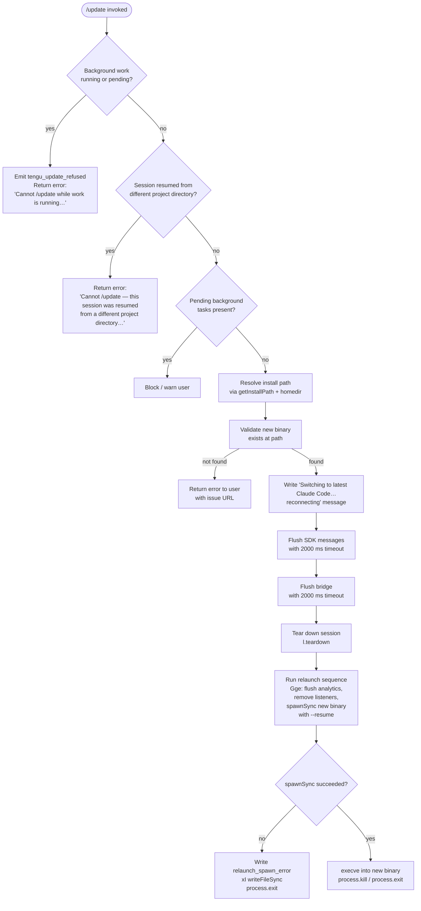

# `/update`

> Analysis basis: CC v2.1.199 bundle.js (AST extraction + Claude interpretation)
> Minimum version: v2.1.199

---

## Overview

The `/update` command performs an in-place upgrade of the Claude Code CLI to the latest available version while keeping the current conversation session alive. It validates preconditions, flushes in-flight work, replaces the running binary via `execve`, and resumes the session in the new process. The command is hidden from help menus and does not support non-interactive invocation.

---

## Registration

| Field | Value |
|---|---|
| type | `local` |
| name | `update` |
| description | `Switch to the latest version (conversation continues)` |
| supportsNonInteractive | `false` |
| isHidden | `true` |
| module_id | `Jdc` |
| load_inline | `true` |
| loc_byte | `13399700` |
| loc_byte_end | `13399941` |
| loc_line | `9960` |
| arbor_handler.name | `Odm` |
| arbor_handler.fqn | `claude-2.1.199::Odm` |
| arbor_handler.kind | `AsyncFunction` |
| arbor_handler.resolution_path | `module_id` |
| arbor_handler.n_hits | `0` |

Analysis basis: CC v2.1.199 bundle.js:+13399700

---

## Input Branching

The handler contains 4+ distinct decision branches (background-work guard, project-directory guard, pending-tasks guard, exec-path resolution), requiring a flowchart.



---

## Behavioral Spec

### 1. Precondition: Background-Work Guard

Before any upgrade action is taken, the handler (`Odm`) inspects the current set of active tasks obtained via the background-task registry (`Rz` / `yym.has`).

```
function checkBackgroundWorkGuard(taskRegistry):
    runningOrPending = taskRegistry.filter(
        task => task.status == "running" OR task.status == "pending"
    )
    if runningOrPending is not empty:
        emit telemetry("tengu_update_refused")
        return Error(
            "Cannot /update while work is running in the background" +
            " — wait for it to finish, then try again."
        )
    return OK
```

Error message (citation fragment): `"Cannot /update while work is running…"` — Analysis basis: CC v2.1.199 bundle.js:+13397961

Telemetry `tengu_update_refused` is emitted immediately upon this refusal (bundle.js:+13397597).

### 2. Precondition: Project-Directory Guard

The handler checks whether the current session was resumed from a project directory that differs from the process working directory.

```
function checkProjectDirectoryGuard(appState, processInfo):
    sessionDir = appState.workingDirectory
    if sessionDir != processInfo.cwd:
        return Error(
            "Cannot /update — this session was resumed from a different" +
            " project directory. Restart manually with --resume to" +
            " continue on the latest version."
        )
    return OK
```

Error message citation fragment: `"Cannot /update — this session was resumed…"` — Analysis basis: CC v2.1.199 bundle.js:+13398205

### 3. Install Path Resolution

The handler resolves the path to the versioned binary and the "latest" target through two cooperating helpers (`wB` → `CQn` and `nse` / `Dpe`). These helpers use `os.homedir()` (via `XMa.homedir`, `N4n`) and `path.join` to construct paths under `~/.local/share/versions/` and `~/.local/share/bin/`.

```
function resolveInstallPath(homeDir):
    versionsDir = path.join(homeDir, ".local", "share", "versions")
    binDir      = path.join(homeDir, ".local", "share", "bin")
    // Nf normalises/validates both dirs
    latestBin   = path.join(binDir, "claude")
    return { versionsDir, binDir, latestBin }
```

Path components cited: `.local` (bundle.js:+6835231), `share` (bundle.js:+6835240), `versions` (bundle.js:+9437896), `bin` (bundle.js:+6835311), `claude` (bundle.js:+13397500).

`Bun.which` (via `eIs`, bundle.js:+877962) is additionally used to locate the `claude` executable on `$PATH` as a fallback resolution.

### 4. App-State Freeze and Session Serialisation

Before the process is replaced, the handler:

1. Reads current app state via `t.getAppState` (bundle.js:+13398464).
2. Applies a state mutation (`ME`, bundle.js:+13398504) that marks the session as being in upgrade transit.
3. Writes back the mutated state with `t.setAppState` (bundle.js:+13398579).
4. Serialises pending SDK messages to durable storage via `l.writeSdkMessages` (bundle.js:+13398665), which ultimately calls `Wfc` → `Qne` and writes a `daemon.status.json` file (bundle.js:+13470522).
5. Generates a fresh session UUID through `Ydc` (→ `knn.randomUUID`, bundle.js:+13396565) to tag the resumed session.

```
function serialiseSession(sessionHandle, appState):
    updatedState = applyUpgradeMarker(appState)
    sessionHandle.setAppState(updatedState)
    sessionHandle.writeSdkMessages()          // persists daemon.status.json
    newSessionId = crypto.randomUUID()
    return newSessionId
```

### 5. User-Visible Progress Message

Immediately before teardown, the handler emits a text-type message to the conversation:

`"Switching to latest Claude Code… reconnecting"` — Analysis basis: CC v2.1.199 bundle.js:+13398689

This message is of content type `"text"` (bundle.js:+13397643) and is posted as an `"assistant"` role turn (bundle.js:+13396541).

### 6. Flush and Teardown Sequence

```
async function flushAndTeardown(sessionHandle, bridgeHandle):
    await Promise.race([
        bridgeHandle.flush(),
        timeout(2000)            // "bridge flush", bundle.js:+13398769/+13398774
    ])
    await sessionHandle.flush()
    await sessionHandle.teardown()           // bundle.js:+13398810
```

The 2 000 ms flush timeout is a hard constant (bundle.js:+13398769).

### 7. Relaunch / execve Sequence (`Gge`)

After teardown the handler delegates to the relaunch helper (`Gge`), which:

1. Stats the resolved binary path via `Dic.stat` (bundle.js:+13102845) to confirm existence.
2. Runs concurrent flush operations with a 30 000 ms outer timeout (bundle.js:+13102964): analytics flush, debug flush, diag flush, write-queue drain.
3. Removes all signal listeners (`process.removeAllListeners`, bundle.js:+13103478) for `SIGINT`, `SIGTERM`, `SIGHUP` (bundle.js:+13103449/+13103458/+13103468).
4. Installs a `beforeExit` handler (bundle.js:+13103636).
5. Calls `spawnSync` (`Mic.spawnSync`, bundle.js:+13103547) with `inherit` stdio (bundle.js:+13103582) to launch the new binary, forwarding reconstructed CLI arguments (via `rpr`) including `--resume` (bundle.js:+13102897).
6. On spawn failure: writes an error marker via `xI` (`Ale.writeFileSync`, bundle.js:+203507) tagged `"relaunch_spawn_error"` (bundle.js:+13103772), then calls `process.exit` (bundle.js:+13103796).
7. On success: uses `xic` to `execve` (bundle.js:+13102400) into the new binary on POSIX (loading `bun:ffi` / `libSystem.B.dylib` on macOS or `libc.so.6` on Linux, bundle.js:+13102045/+13102074), or calls `process.kill` / `process.exit` (bundle.js:+13103861/+13103796) on platforms where `execve` is unavailable.

```
async function relaunchIntoNewBinary(resolvedPath, cliArgs, sessionId):
    assertBinaryExists(resolvedPath)          // Dic.stat
    await Promise.all([
        withTimeout(flushAnalytics(),   30000, "flush timeout (relaunch)"),
        withTimeout(flushDebug(),       30000, "debug flush timeout (relaunch)"),
        withTimeout(flushDiag(),        30000, "diag flush timeout (relaunch)"),
        withTimeout(drainWriteQueue(),  30000, "write queue drain timeout (relaunch)"),
    ])
    process.removeAllListeners("SIGINT")
    process.removeAllListeners("SIGTERM")
    process.removeAllListeners("SIGHUP")
    reconstructedArgs = buildRelaunchArgs(cliArgs, sessionId)
                        // includes --resume; see rpr / iBe
    result = spawnSync(resolvedPath, reconstructedArgs, { stdio: "inherit" })
    if result.error:
        writeErrorMarker("relaunch_spawn_error")
        process.exit(128)                     // bundle.js:+13103909
    execve(resolvedPath, reconstructedArgs)   // POSIX path via bun:ffi
    // Fallback if execve not available:
    process.exit(result.status)
```

Timeout label constants: `"flush timeout (relaunch)"` (bundle.js:+13102970), `"cleanup timeout"` (bundle.js:+13103026), `"analytics flush timeout"` (bundle.js:+13103082), `"debug flush timeout (relaunch)"` (bundle.js:+13104127), `"diag flush timeout (relaunch)"` (bundle.js:+13104189), `"pre-exit flush timeout (relaunch)"` (bundle.js:+13104250), `"write queue drain timeout (relaunch)"` (bundle.js:+13104314).

### 8. CLI Argument Reconstruction (`rpr`)

The helper `rpr` rebuilds the argument vector for the resumed process, preserving flags from the original invocation:

```
function buildRelaunchArgs(originalArgs, newSessionId):
    args = Array.from(originalArgs)
    args = injectSessionFlag(args, newSessionId)   // iBe
    if "--allow-dangerously-skip-permissions" in originalArgs:
        args.push("--allow-dangerously-skip-permissions")
                          // bundle.js:+13104873
    if "--effort" in originalArgs:
        args.push("--effort", originalArgs.effort) // bundle.js:+13105015
    if "--permission-mode" in originalArgs:
        args.push("--permission-mode", ...)        // bundle.js:+13105032
    if "--add-dir" paths exist:
        args.push("--add-dir", ...)                // bundle.js:+13104758
    args.push("--resume")                          // bundle.js:+13102897
    return args
```

### 9. Session-State Carry-over (`Or`, `sg`)

After the new process starts, `Or` reads `appState` (bundle.js:+11434561) and uses `findLast` (bundle.js:+11434641) to locate the last conversation turn. It then reconstructs context fields: `working_directory` (bundle.js:+11434666), `allowed_tools` (bundle.js:+11434721), `disallowed_tools` (bundle.js:+11434776), `avoid_prompts` (bundle.js:+11434837), `permission_mode` (bundle.js:+11434939), `bypassPermissions` (bundle.js:+11434970), `effort` (bundle.js:+11435294), `model` (bundle.js:+11435307), `max_thinking_tokens` (bundle.js:+11435319), `flag_settings` (bundle.js:+11435345).

`sg` additionally reads `appState` (bundle.js:+11435397) to restore display-level session flags after the new binary takes over.

---

## State & Side Effects

| Item | Detail |
|---|---|
| Telemetry | `tengu_update_refused` (bundle.js:+13397597) — emitted when background work blocks the update; `tengu_scroll_summary` (bundle.js:+6912522) — emitted during terminal relaunch rendering; `tengu_amber_creek` (bundle.js:+3615374) — fullscreen/terminal feature probe; `tengu_pewter_brook` (bundle.js:+3615281) — fullscreen feature probe; `tengu_feature_ok` (bundle.js:+1039941) — feature flag check success; `tengu_feature_bad` (bundle.js:+1040008) — feature flag check failure; `tengu_daemon_control` (bundle.js:+18569105) — daemon stop/start signalling; `tengu_disable_bypass_permissions_mode` (bundle.js:+3466547) — emitted if bypass-permissions mode is revoked during relaunch |
| Session persistence | Writes `daemon.status.json` via `l.writeSdkMessages` / `Bnn` → `Gfc.join` (bundle.js:+13470508); appends `"last-prompt"` entry via `Mnn` / `n.appendEntry` (bundle.js:+13843119) |
| appState changes | `t.getAppState` read → upgrade-transit marker applied (`ME`) → `t.setAppState` write (bundle.js:+13398464/+13398504/+13398579); `Object.assign` used to merge state fragments (bundle.js:+13398900) |
| Signal handling | Removes all listeners for `SIGINT`, `SIGTERM`, `SIGHUP` before exec (bundle.js:+13103449–13103478); installs `process.on("beforeExit", …)` (bundle.js:+13103636) |
| Process replacement | `execve` via `bun:ffi` / `libSystem.B.dylib` (macOS) or `libc.so.6` (Linux) (bundle.js:+13102045/+13102074); fallback `process.kill` + `process.exit` (bundle.js:+13103861/+13103796) |
| Error file | On spawn failure writes an error marker file via `Ale.writeFileSync` (bundle.js:+203507) with label `"relaunch_spawn_error"` (bundle.js:+13103772) |
| Feature flag check | `cke` → `fOi.isEnabled` (bundle.js:+3159845) consulted before relaunch path chosen |
| Terminal | Unmounts current Ink/terminal instance (`e.unmount`, bundle.js:+6910078); restores cursor via ANSI escape sequences `\x1b7` / `\x1b8` (bundle.js:+3963138/+3963149); checks for tmux, ghostty ≥ 1.2.0, iTerm2 ≥ 3.6.6 compatibility (bundle.js:+3683027/+3683057/+3683096/+3683128) |
| Sound | <!-- TODO: not found in depth-2 traversal; needs --depth 4 --> |

---

## Version History

| Version | Change |
|---|---|
| v2.1.199 | Initial analysis; build timestamp `2026-07-02T01:14:04Z`, commit `968b0c4118bde7c998acd97511e68daecacd8507` (bundle.js:+13399408/+13399439) |

---

## Common Mistakes

1. **Running `/update` during background tasks** — The command will refuse with "Cannot /update while work is running in the background" if any task has status `"running"` or `"pending"`. Wait for all background work to complete first.
2. **Using `/update` in a `--resume` session that crossed project directories** — If the process working directory no longer matches the session's recorded `working_directory`, the command aborts. Restart manually with `--resume` to continue on the new version.
3. **Expecting interactive prompts** — `supportsNonInteractive` is `false` and the command is hidden (`isHidden: true`). It should not be invoked programmatically or in scripts; it is designed exclusively for interactive terminal sessions.
4. **Assuming the conversation is lost** — The entire point of `/update` is session continuity. The old session state (`allowed_tools`, `permission_mode`, `effort`, `model`, `max_thinking_tokens`, etc.) is serialised to `daemon.status.json` and restored by the new binary via `--resume`.
5. **Interrupting during the flush window** — The command has a hard 2 000 ms bridge-flush timeout and a 30 000 ms analytics-flush timeout. Sending `SIGINT` during this window may leave `daemon.status.json` in a partial state; the signal listeners are removed precisely to prevent accidental interruption.
6. **Expecting the command to appear in `/help`** — The `isHidden: true` flag means `/update` is intentionally omitted from the help listing.

---

## Appendix — Identifier Mapping

> For bundle debugging only. Identifiers change across versions.

| Identifier | Role |
|---|---|
| `Odm` | Main `/update` handler (AsyncFunction); entry point resolved via `module_id` path |
| `tfr` | Background-task-status checker; calls `tm` for Bun.which resolution |
| `tm` | Executable location helper; delegates to `eIs` → `Bun.which` |
| `eIs` | `Bun.which` wrapper for locating the `claude` binary on PATH |
| `wB` | Install-path builder; composes versioned and bin directories |
| `CQn` | Versioned-directory path constructor; uses `Nf`, `hze.join`, `nse` |
| `Nf` | Path normaliser / validator utility |
| `nse` | Home-relative share-directory resolver; calls `N4n` + `vWt.join` |
| `N4n` | `os.homedir()` wrapper via `XMa.homedir` |
| `Dpe` | Bin-directory path resolver; calls `N4n` + `vWt.join` |
| `ii` | Task/context type classifier (checks `"bg"`, `"daemon"`, `"daemon-worker"` modes) |
| `a0e` | Mode-string constant provider |
| `V` | General utility / value accessor |
| `Uy` | Process-name resolver; uses `S_.basename`, `LX`, `kt` |
| `LX` | Basename extraction helper |
| `kt` | Low-level async utility; delegates to `Aw` |
| `Aw` | Core async scheduler/runner |
| `ML` | Path or module loader utility |
| `eqo` | Module-export resolver; uses `ar`, `Oic.dirname`, `cH`, `ol` |
| `ar` | Module require/resolution helper |
| `ol` | Object-lookup utility |
| `Xge` | State-transition marker (pre-exec) |
| `Rz` | Background-task registry accessor; checks `yym.has` |
| `_mr` | Registry map reference |
| `Mnn` | Last-prompt logger; calls `ru` + `n.appendEntry` |
| `ru` | IPC / signal bus initialiser; calls `Ai` (bfs.register) + `process.on` |
| `Ai` | BFS event registration wrapper |
| `ke` | Error reporting / logging pipeline; uses `sr`, `at`, `Pi`, `Gku`, `knt.push`, `fne.logError` |
| `sr` | Error constructor helper |
| `at` | String-coercion utility |
| `Pi` | Error formatter; calls `KTs` |
| `KTs` | Error message builder; calls `at` |
| `Gku` | Rotating log buffer; shifts/pushes `ahn` |
| `Ef` | Async context / store reader; calls `W0` |
| `W0` | AsyncLocalStorage `.getStore()` wrapper via `YWr` |
| `ME` | App-state upgrade-marker applicator |
| `Wfc` | SDK message writer; calls `Qne`, `Date.now`, `Qs`, `Bnn`, `xe` |
| `Qne` | Message serialiser; calls `fye` |
| `fye` | Message-text normaliser; calls `ece`, `t.trim` |
| `Qs` | Store accessor via `EId.getStore` |
| `Bnn` | Status-file path builder (`daemon.status.json`) via `Gfc.join` + `tr` |
| `xe` | JSON serialiser wrapper (`JSON.stringify`) |
| `Ydc` | Session UUID generator; calls `knn.randomUUID` |
| `Ka` | Timeout-race helper; uses `setTimeout`, `Promise.race`, `clearTimeout` |
| `cke` | Feature-flag enablement check; calls `fOi.isEnabled` |
| `ZRe` | String-coercion / version-string formatter; calls `String` |
| `Gge` | Full relaunch orchestrator: stat, flush, remove listeners, spawnSync, execve |
| `QWt` | Interval-clear helper; calls `J_o` |
| `J_o` | `clearInterval` wrapper |
| `U8e` | Terminal/Ink unmount helper; calls `WAe.writeSync`, `hu.get`, `e.unmount`, `gU`, `L1n` |
| `gU` | Terminal cleanup utility |
| `L1n` | Terminal output writer; calls `soe.writeSync`, `xGe`, `TGe`, `Lx`, `Dd`, `T` |
| `xGe` | Terminal-type detector (ghostty, iTerm2); calls `IH`, `hzi.coerce`, `IR` |
| `TGe` | Terminal state saver/restorer |
| `Lx` | tmux / screen escape-sequence handler; calls `Xto`, `e.replaceAll` |
| `Dd` | Display dimensions utility |
| `T` | Terminal output formatter/writer; calls `NBe`, `gdu`, `xe`, `Nc`, `mN`, `ntt`, `Sdu`, `o.write`, `o.flush` |
| `b5n` | Scroll/render summary emitter; calls `rx`, `oOa`, `V`, `rOa`, `zs` |
| `rx` | Render-cycle counter |
| `oOa` | Output accumulator |
| `rOa` | Timing calculator; uses `Date.now`, `Math.max`, `Math.round`, `Object.assign`, `tOa` |
| `tOa` | Timing sub-helper |
| `zs` | Local-agent renderer; calls `oO`, `hD`, `nno`, `Wre`, `T`, `tno`, `Lr`, `tYd`, `ot` |
| `oO` | Feature-set membership check (`u5u.has`) |
| `hD` | Feature-flag probe (`fOi.isEnabled`) |
| `nno` | String formatter; calls `at` |
| `Wre` | Event emitter / write-result handler; calls `eYd` |
| `tno` | Boolean-cast filter; calls `jt`, `Boolean` |
| `Lr` | Layout renderer; calls `CV` |
| `tYd` | Conditional output helper; calls `ot` |
| `ot` | React/Ink render helper; calls `hBt`, `HBt`, `HG`, `bke.has`, `wDn`, `mBt.add`, `_q.has`, `_q.get`, `Mt` |
| `QT` | Signal/bus cleanup; calls `ru` |
| `ket` | BFS drain helper; calls `bfs.drain` |
| `$8e` | Promise-resolution relay; calls `Promise.resolve`, `y5n`, `e` |
| `y5n` | Async resolution helper |
| `Ric` | Pre-exit flush coordinator; calls `Promise.all`, `Ka`, `OHe`, `cPt`, `Hun`, `I6` |
| `OHe` | Debug flush operation |
| `cPt` | Diag flush operation |
| `Hun` | Tfs drain wrapper; calls `Tfs.drain` |
| `I6` | Write-queue drain; calls `Promise.all`, `e` |
| `xic` | `execve` invocation via `bun:ffi`; handles path normalisation, dlopen, arg encoding, platform branching |
| `f` | Argument normaliser iterable; calls `yV` |
| `yV` | Path normaliser; uses `IN.normalize`, `jt`, `t.replaceAll` |
| `c` | Environment-map builder; calls `ln` |
| `ln` | Environment variable provider |
| `a` | HTTP / IPC response builder; calls `Whe`, `Response.json` |
| `Whe` | JSON response serialiser |
| `u` | Daemon-control dispatcher; calls `Le`, `we`, `n2`, `w8` |
| `Le` | Daemon-stop signal sender; calls `V`, `Pe` |
| `we` | Daemon-stop confirmation receiver; calls `V`, `Pe` |
| `n2` | Daemon registry mutator; calls `hG`, `rJ.push`, `B6e`, `qZr` |
| `w8` | Daemon process exit handler; uses `Promise.race`, `Promise.all`, `yEe`, `wEe`, `On`, `process.exit` |
| `ge` | String coercion helper; calls `String` |
| `xI` | Error-marker file writer; calls `Ale.writeFileSync`, `Owr.join` |
| `rpr` | CLI argument reconstructor for relaunch; uses `Array.from`, `iBe`, `Pke`, flag injection |
| `iBe` | Session-ID flag injector |
| `Pke` | Boolean-flag filter; calls `Mt`, `Boolean` |
| `Mt` | Config accessor with guard; calls `BJo`, `Error`, `GJo`, `hae` |
| `BJo` | Config readiness checker |
| `GJo` | Config value extractor |
| `hae` | Config fallback provider |
| `Or` | Session-state carry-over reader; calls `e.getAppState`, `n.findLast`, `Msr`, `Dsr`, `wR` |
| `Msr` | Working-directory/tools state mapper; calls `vo` |
| `Dsr` | Permission/effort state mapper; calls `vo` |
| `vo` | State-field extractor |
| `wR` | Bypass-permissions mode validator; calls `Feo` |
| `Feo` | Permission-mode policy enforcer; calls `ot`, `ts` |
| `sg` | Post-resume display-flag restorer; calls `e.getAppState` |

---

Note: index built via Arbor fallback; some signals (telemetry, literals) may be missing — see arbor-fallback.js.