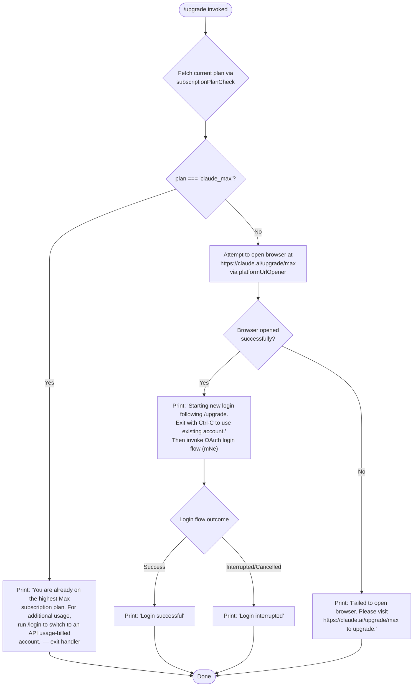

# `/upgrade`

> Analysis basis: CC v2.1.199 bundle.js (AST extraction + Claude interpretation)
> Minimum version: v2.1.199

---

## Overview

The `/upgrade` command guides a Claude.ai consumer-plan user to upgrade their subscription to the Max tier, which provides higher rate limits and expanded access to Opus-class models. It first inspects the current account's subscription plan and, if already on the top-tier Max plan, prints an informational message and exits; otherwise it attempts to open `https://claude.ai/upgrade/max` in the system browser, then initiates a new OAuth login flow so the upgraded credentials are immediately reflected in the running session.

---

## Registration

| Field | Value |
|---|---|
| type | `local-jsx` |
| name | `upgrade` |
| description | `Upgrade to Max for higher rate limits and more Opus` |
| module_id | `QKo` |
| load_inline | `true` |
| loc_byte | `13426871` |
| loc_byte_end | `13427118` |
| loc_line | `9961` |
| arbor_handler.name | `Onn` |
| arbor_handler.fqn | `claude-2.1.199::Onn` |
| arbor_handler.kind | `AsyncFunction` |
| arbor_handler.resolution_path | `module_id` |
| arbor_handler.n_hits | `0` |

Analysis basis: CC v2.1.199 bundle.js:+13426871

---

## Input Branching

The command has four distinct execution paths depending on current subscription state and browser-open success, so a flowchart is used.



Analysis basis: CC v2.1.199 bundle.js:+13425753 (handler entry `Onn`), +13425839 (plan string `"max"`), +13425983 (`"claude_max"`), +13426084 (already-on-Max message), +13426230 (upgrade URL), +13426379 (starting-login message), +13426573 (`"Login successful"`), +13426592 (`"Login interrupted"`), +13426664 (browser-open failure message)

---

## Behavioral Spec

### 1. Plan Detection (`subscriptionPlanCheck`)

The handler first resolves the active subscription plan by calling the internal plan-check helper (`So` → `c9`, `Js`).

```
async function subscriptionPlanCheck(context):
    authState = getAuthState(context)          # So → EE path
    planId    = authState.planId               # string, e.g. "claude_max"
    return planId
```

If `planId` equals `"claude_max"`, the handler emits the already-on-Max message and returns without opening any browser.

Analysis basis: CC v2.1.199 bundle.js:+13425753, +13425839, +13425983

#### Already-on-Max guard

```
if planId === "claude_max":
    print("You are already on the highest Max subscription plan. " +
          "For additional usage, run /login to switch to an API usage-billed account.")
    return
```

Analysis basis: CC v2.1.199 bundle.js:+13426084

---

### 2. Browser Launch (`platformUrlOpener`)

When the plan check does not short-circuit, the handler calls the platform URL opener (`Rc` → `RJr` → `kOi`) with the hard-coded upgrade URL.

```
async function platformUrlOpener(url):
    # url = "https://claude.ai/upgrade/max"
    validate url scheme in ["http:", "https:"]
    detect OS: darwin → "open", linux → check $DISPLAY, windows → platform default
    spawn OS browser-open command with url
    on ENOENT / exit 127 → raise "opener_missing"
    on ETIMEDOUT / "timed out" → raise "timeout"
    on EACCES / EPERM → raise "spawn_error"
    on non-zero exit → raise "nonzero_exit"
    on unknown → raise "unknown"
    return success
```

The upgrade URL is the fixed constant `"https://claude.ai/upgrade/max"`.

Analysis basis: CC v2.1.199 bundle.js:+13426227 (`Rc` call), +13426230 (URL literal), +3181798 (`RJr`), +3181900 (`"darwin"`), +3181585 (`"linux"`), +3181942 (`"no_display"`), +3182201 (`"ENOENT"`), +3182272 (`"ETIMEDOUT"`), +3182364 (`"EACCES"`), +3182471 (`"nonzero_exit"`)

---

### 3. Login Flow Initiation (`loginAfterUpgrade`)

After a successful browser open, a brief `setTimeout` delay is introduced before the OAuth login flow starts, so the browser can complete its redirect before the CLI continues.

```
async function loginAfterUpgrade(context):
    print("Starting new login following /upgrade. " +
          "Exit with Ctrl-C to use existing account.")
    await sleep(...)                           # setTimeout at +13426069
    result = await oauthLoginFlow(context)     # mNe — full OAuth + credential-store sequence
    if result.success:
        print("Login successful")
    else:
        print("Login interrupted")
```

Analysis basis: CC v2.1.199 bundle.js:+13426069 (`setTimeout`), +13426379 (starting-login string), +13426492 (`mNe` call), +13426573, +13426592

#### Browser-open failure fallback

```
function handleBrowserOpenFailure():
    print("Failed to open browser. Please visit https://claude.ai/upgrade/max to upgrade.")
    return
```

Analysis basis: CC v2.1.199 bundle.js:+13426664

---

### 4. OAuth Login Flow (`oauthLoginFlow` / `mNe`)

The `mNe` function is the same full OAuth login flow used by `/login`. When invoked from `/upgrade`, it:

1. Fetches a fresh OAuth token via the platform-specific flow (`qqe`, `fZ`, `Jw`).
2. Stores credentials securely (`Cl` → `Mhi`).
3. Applies the new API key / OAuth token to the running session (`e.onChangeAPIKey`, `e.applyMessageOp`).
4. Refreshes remote managed settings and policy limits (`rer`, `W4`, `JYt`).
5. Resets trusted-device enrollment if the account changed (`dqt`).
6. Updates `appState` via `e.setAppState`.

```
async function oauthLoginFlow(context):
    token = await fetchOAuthToken(context)     # qqe → fZ → Jw
    storeCredentials(token)                    # Cl → Mhi
    context.onChangeAPIKey(token.apiKey)
    context.applyMessageOp(...)
    refreshRemoteSettings()                    # rer → xDn, W4
    refreshPolicyLimits()                      # JYt
    enrollTrustedDevice(context)               # dqt
    context.setAppState(...)
    return { success: true }
```

Analysis basis: CC v2.1.199 bundle.js:+13426492, +9806178 (`e.onChangeAPIKey`), +9806197 (`e.applyMessageOp`), +9806566 (`W4`), +9806603 (`JYt`), +9807277 (`dqt`), +9806991 (`e.setAppState`)

---

### 5. OAuth Profile Fetch and Token Acquisition (`oauthTokenFetcher` / `zxe`)

```
async function oauthTokenFetcher(endpoint):
    url = buildOAuthEndpointUrl(endpoint)      # Fs — validates scheme, replaces vars
    headers = {
        "Content-Type":  "application/json",
        "Cache-Control": "no-cache"
    }
    timeout = 10000   # ms
    response = await httpGet(url, headers, timeout)    # mo.get
    if response body malformed:
        logTelemetry("oauth_profile_fetch", "malformed_response_body")
        raise error
    parse token from response
    return token
```

Token acquisition errors emit `"oauth_profile_token_failed"` at bundle.js:+2183969.

Analysis basis: CC v2.1.199 bundle.js:+2183736 (`zxe`), +2183837 (`"Content-Type"`), +2183852 (`"application/json"`), +2183871 (`"Cache-Control"`), +2183887 (`"no-cache"`), +2183907 (`10000`), +2183069 (`"oauth_profile_fetch"`)

---

### 6. Remote Settings Refresh (`remoteSettingsRefresh` / `rer` + `W4`)

After login completes, remote managed settings are re-fetched and applied. If a new settings payload differs from the cached version, a security dialog is shown (`yXa`). The user may accept (`"approved"`) or reject (`"rejected"`) new settings.

```
function remoteSettingsRefresh():
    clearLocalCaches()                          # hbl → COo.clear
    refreshFeatureFlags()                       # xDn → $6i, B6i
    refreshGlobalConfig()                       # W4 → zHt, Mt, kn, ...
    clearNetworkCaches()                        # zUr, QUr, _1t
```

Analysis basis: CC v2.1.199 bundle.js:+9806551, +9804633, +3409143 (`xDn`), +8108540 (`W4`), +8105475 (`"approved"`), +8105589 (`"rejected"`)

---

## State & Side Effects

| Item | Detail |
|---|---|
| Telemetry | `tengu_feature_sad` (bundle.js:+1040089), `tengu_feature_ok` (+1039941), `tengu_feature_bad` (+1040008), `tengu_managed_settings_security_dialog_shown` (+8105011), `tengu_managed_settings_security_dialog_accepted` (+8105348), `tengu_managed_settings_security_dialog_rejected` (+8105507), `tengu_policy_limits_fetch` (+14360854), `tengu_disable_bypass_permissions_mode` (+14235453), `tengu_auto_mode_config` (+14233139), `tengu_daemon_config_reload` (+18546460) |
| Browser open | Spawns OS `open` / `xdg-open` / platform opener with `https://claude.ai/upgrade/max` |
| setTimeout | Delay introduced at +13426069 before login flow begins |
| Credential store | OAuth token written via secure storage (`Mhi`); plaintext fallback used if primary fails (`"plaintext_fallback_used"` at +2395648) |
| appState changes | `e.getAppState` read (+9806818), `e.setAppState` written (+9806991) after successful login |
| Remote managed settings | Feature-flag caches (`bke`, `vDn`, `_q`) cleared and rebuilt; security dialog shown if new settings require user approval |
| Policy limits cache | Cleared and refreshed via `JYt` → `Ogr` → `cbc` |
| Trusted-device enrollment | Re-evaluated via `dqt`; skipped if `CLAUDE_TRUSTED_DEVICE_TOKEN` env var is set (+8031299) or essential-traffic-only mode (+8031613) or no OAuth token present (+8031726) |
| Feature flags | `tengu_feature_ok`, `tengu_feature_bad`, `tengu_feature_sad` emitted on feature evaluation success/failure/error |
| Hook registration | `bfs.register` called via `Ai` (+69837) for background polling of remote settings |
| Sound | None detected |
| Process listeners | `process.on("exit")` registered in `Sdu` (+217910); `process.off` / `process.removeListener` called in cleanup (`qlt` +3408765, `neo` +3409544) |

---

## Version History

| Version | Change |
|---|---|
| v2.1.199 | Initial analysis |

---

## Common Mistakes

1. **Running `/upgrade` on an API-key account**: The command targets Claude.ai consumer OAuth accounts. Users authenticated via `ANTHROPIC_API_KEY` will not benefit from the Max upgrade flow and should instead manage their subscription at claude.ai directly.

2. **Expecting immediate rate-limit change**: After `/upgrade` completes the browser flow, the user must complete the subscription purchase in the browser before the CLI re-login reflects the new plan. The CLI only re-authenticates; it does not poll for the upgrade transaction result.

3. **No-browser environments**: In headless or SSH sessions without `$DISPLAY` set on Linux, the browser open will fail with `"no_display"` and the fallback message will be printed. Users must manually visit `https://claude.ai/upgrade/max`.

4. **Already-on-Max users**: Users already subscribed to `claude_max` will see the informational message and no browser will be opened. Use `/login` to switch to an API-billed account if higher raw quota is needed.

5. **Interrupting the login step**: Pressing Ctrl-C after the browser opens but before completing the OAuth flow will print `"Login interrupted"` and leave the existing credentials unchanged.

---

## Appendix — Identifier Mapping

> For bundle debugging only. Identifiers change across versions.

| Identifier | Role |
|---|---|
| `Onn` | Main handler (`AsyncFunction`) for `/upgrade` command |
| `So` | Subscription plan check helper (reads current plan from auth state) |
| `EE` | Auth-state resolver (determines login/provider type) |
| `Md` | Config/flag-settings accessor |
| `at` | Generic argument normalizer / string coercer |
| `pvr` | Bare-flag parser (handles `"--bare"` CLI argument) |
| `bb` | Auth provider classifier (distinguishes `profile-implicit`, `user_oauth`, etc.) |
| `NIn` | OAuth token validator |
| `NV` | Notification/value emitter |
| `slt` | Auth-scheme selector (picks between API key, OAuth, etc.) |
| `K$` | Key-storage lookup helper |
| `UV` | OAuth file-descriptor reader (env: `CLAUDE_CODE_OAUTH_TOKEN_FILE_DESCRIPTOR`) |
| `SR` | API-key resolver (reads `ANTHROPIC_API_KEY`, `apiKeyHelper`, etc.) |
| `c9` | Array/include membership checker |
| `ic` | Invocation context builder |
| `gr` | Gateway/provider type router (`"gateway"`, `"bedrock"`, `"vertex"`, etc.) |
| `wI` | Write/IO helper |
| `Jw` | Full auth-chain orchestrator |
| `d2t` | Dispatch/task helper used inside auth chain |
| `Aet` | VSCode environment detector (`"claude-vscode"`) |
| `iNt` | API-key file-descriptor reader (env: `CLAUDE_CODE_API_KEY_FILE_DESCRIPTOR`) |
| `Mt` | Config-access guard (raises `"Config accessed before allowed."`) |
| `R$` | Token slicer (trims to 20 chars) |
| `m2t` | Auth-scheme metadata builder |
| `zxe` | OAuth profile fetcher (HTTP GET with JSON/no-cache headers, 10 s timeout) |
| `Fs` | OAuth endpoint URL builder (validates scheme, substitutes `{server_id}`) |
| `OTs` | OAuth environment selector (`"prod"`, `"local"`, `"staging"`) |
| `Oku` | OAuth base-URL resolver |
| `_ii` | Token-response parser (emits `"oauth_profile_fetch"` telemetry) |
| `Et` | Feature-flag evaluator |
| `V` | Feature-ok telemetry emitter (`tengu_feature_ok`) |
| `Pe` | Feature-evaluation dispatcher |
| `T` | Debug/trace logger |
| `gdu` | Credential-file writer |
| `xe` | JSON serializer wrapper |
| `Nc` | Sensitive-string redactor (replaces with `"[REDACTED]"`) |
| `ntt` | Token-type handler |
| `Sdu` | Credential-file persistence manager (manages `stt` stack, process exit handler) |
| `Le` | Feature-bad telemetry emitter (`tengu_feature_bad`) |
| `j_` | JSON-parse helper |
| `ke` | Structured error logger |
| `sr` | Error string normalizer |
| `Pi` | KV-store ping/probe |
| `KTs` | KV-store accessor |
| `Gku` | Request-queue manager (shift/push `ahn`) |
| `Rc` | Platform URL opener dispatcher |
| `RJr` | URL scheme validator + OS-command selector |
| `c6d` | URL validation error builder |
| `kOi` | OS-specific browser-open command executor |
| `IH` | Browser-open result inspector |
| `xOi` | Linux `$DISPLAY` presence checker |
| `d6d` | Browser-open error classifier (ENOENT, ETIMEDOUT, etc.) |
| `Un` | URL-open retry / wrapper |
| `Fc` | Auth + message-context builder (calls `EE` and `Mt`) |
| `mNe` | Full OAuth login flow component (post-upgrade re-auth) |
| `het` | Timestamp helper (`Date.now`) |
| `qqe` | OAuth token acquisition orchestrator |
| `kXa` | OAuth initialization helper |
| `Wqe` | OAuth transport setup |
| `tPs` | OAuth transport provider |
| `fZ` | OAuth session state manager |
| `ice` | In-progress credential checker |
| `sce` | Session credential store |
| `mBe` | Message bus emitter |
| `Vm` | Value mapper / transformer |
| `gu` | Window/UI notifier (`wIn`) |
| `lA` | Login-complete action dispatcher |
| `h2t` | Post-login hook runner |
| `YVn` | Notification + feature-flag refresh after login (`kD.notifyChange`) |
| `nPs` | Notification payload builder |
| `Qvo` | Consent / settings-loading orchestrator (with `setTimeout` guard) |
| `CXa` | Settings-change event dispatcher |
| `_Xa` | Settings-load timeout fallback |
| `two` | Remote managed settings fetch-and-apply routine |
| `TLe` | Settings cache-update dispatcher |
| `kNr` | Settings cache reader/validator |
| `ePs` | Settings ETag/304 handler |
| `dVn` | Settings content hasher (`sha256` via `z7a.createHash`) |
| `uJp` | Settings HTTP fetch helper |
| `we` | Feature-sad telemetry emitter (`tengu_feature_sad`) |
| `Ort` | Settings stale-cache fallback handler |
| `Jvo` | Settings parallel-load coordinator (`Promise.all`) |
| `qe` | UI component renderer helper |
| `TXa` | Remote-settings security policy loader (`PLe`) |
| `yXa` | Remote-settings security-check dialog renderer |
| `EXa` | Settings approval handler (`Yc`) |
| `IXa` | Settings file writer (384-byte chunk, utf-8, `datasync`) |
| `LXa` | Settings load-error handler (`ez`) |
| `xXa` | Remote-settings change watcher (poll interval via `GDn`) |
| `GDn` | Interval scheduler (`setInterval` / `clearInterval`) |
| `pJp` | Background-poll settings applier |
| `Ai` | Background-file-system hook registrar (`bfs.register`) |
| `eer` | Deep-equality auth-state comparator (`Bun.deepEquals`) |
| `_Cr` | Auth credential resolver |
| `kn` | App-state change notifier |
| `iyn` | Update/notification dispatcher |
| `t9` | Comprehensive app-state subscriber (aggregates many sub-state slices) |
| `f` | Process exec-relaunch helper |
| `yV` | Path normalizer (Windows `replaceAll`) |
| `rer` | Post-login cleanup + settings reset orchestrator |
| `$cn` | Cache-clear sequence initiator |
| `pq` | Pending-queue flusher |
| `hbl` | Session cache clearer (`COo.clear`) |
| `fue` | Feature-update emitter |
| `ike` | In-flight-key expirer |
| `mbl` | Message-bus listener cleaner |
| `wOo` | WebSocket/observer closer |
| `xDn` | Feature-flag payload refresher (calls `$6i`, `B6i`, `Vlt.emit`) |
| `HG` | Feature-flag store accessor (`hG`) |
| `$6i` | Feature-flag payload parser and cache updater (`bke`, `vDn`, `_q`) |
| `B6i` | Feature-flag key enumerator (`Object.fromEntries`, `Array.from`, `bke.keys`) |
| `W4` | Global-config refresh orchestrator (network caches, mTLS, proxy, CA certs) |
| `bXa` | Config-accessor wrapper (`at`, `gV`) |
| `gV` | Feature-gate checker (`d5u.has`) |
| `zHt` | Header/config merger (`QXp`, `JXp`, `XXp`, `eJp`, `KXp`) |
| `QXp` | Header-merge strategy resolver |
| `JXp` | Request-header filter (`Rqt.has`) |
| `XXp` | Custom-header normalizer (`ANTHROPIC_CUSTOM_HEADERS`, `toUpperCase`) |
| `eJp` | Additional-header normalizer (`ZXp.has`) |
| `KXp` | Header-merge finisher |
| `HT` | Allowed-origin set manager (`t.add`, `OI.filter`, `t.has`) |
| `hBe` | Header-builder helper |
| `rPn` | Remote-policy-network helper |
| `zUr` | CA-cert cache clearer (logs `"Cleared CA certificates cache"`) |
| `QUr` | mTLS config cache clearer (logs `"Cleared mTLS configuration cache"`) |
| `_1t` | Proxy agent cache clearer (logs `"Cleared proxy agent cache"`) |
| `q9e` | Network proxy resolver (undici, port 443/80) |
| `sD` | Proxy-settings detector |
| `kKs` | Proxy chain builder |
| `MV` | Proxy URL parser (split, toLowerCase, startsWith, substring, endsWith) |
| `JYt` | Policy-limits refresh orchestrator |
| `vJo` | Policy-limits in-flight guard (`clearTimeout`) |
| `LJo` | Policy-limits loader initiator |
| `IEe` | Policy-limits eligibility checker |
| `Dgr` | Policy-limits fetch with timeout (`setTimeout`) |
| `s2` | Policy-limits HTTP client |
| `Lke` | Policy-limits file-path builder (`fGi.join`) |
| `Ogr` | Policy-limits cache reader + fetch coordinator |
| `cbc` | Policy-limits response parser and cache writer |
| `ubc` | Policy-limits background-poll scheduler (`GDn`, `RTm`) |
| `uke` | Policy-limits teardown helper |
| `kue` | Feature-flag teardown helper (`qlt`, `Vlt.emit`, `TR`) |
| `qlt` | Feature-flag subscription cleanup (clears `bke`, `vDn`, `mBt`, `YZr`, `_q`) |
| `neo` | Interval + process-listener cleanup (`clearInterval`, `process.removeListener`) |
| `H9t` | Account-context hash helper |
| `JCo` | REPL-bridge disconnection handler |
| `qr` | React-style render/component runner |
| `$ln` | Bound render callback |
| `ROe` | Observable/reactive subscription handler |
| `ot` | Feature-flag observable getter (`bke.has`, `wDn`, `mBt.add`, `_q`) |
| `Cl` | Secure-credential storage dispatcher |
| `Mhi` | Credential read/write/update/delete store (primary + fallback) |
| `dqt` | Trusted-device enrollment flow |
| `r2` | Feature-flag read helper (with `W6i` for override) |
| `hBt` | Feature-flag base-value reader |
| `HBt` | Feature-flag override reader |
| `wDn` | Feature-flag watched-dependency tracker (`YZr`, `bke.get`, `KZr`, `eeo`) |
| `W6i` | Feature-flag policy-value resolver (`s.getFeatureValue`) |
| `ZYp` | App-state HB reader |
| `qCo` | App-state `zc` reader |
| `r` | CLI exit-on-data handler |
| `Ts` | CLI error + process-exit helper (`process.exit`) |
| `n` | String lowercase normalizer |
| `i` | Stream close helper |
| `uhn` | Upgrade-flow HTTP utility |
| `ge` | String coercer (wraps `String()`) |
| `Hbl` | Account-hash logger |
| `zYt` | Auth-state watcher / policy-limits trigger |
| `oer` | Policy-limits auth-change handler |
| `teo` | Policy-limits auth eligibility checker |
| `Cqt` | Policy-limits conditional loader |
| `qH` | Permission-state manager (setMode, addRules, replaceRules, removeRules, etc.) |
| `Or` | Session-context last-message finder |
| `Msr` | Message summary builder (`vo`) |
| `vo` | Message-render helper |
| `Dsr` | Disallowed-tool context builder |
| `wR` | Bypass-permissions-mode enforcer (reads policy, disables if org-disallowed) |
| `Feo` | Permission-mode policy checker |
| `kOo` | Account-state observer |
| `YYt` | Auto-mode config watcher |
| `XYt` | Auto-mode configuration resolver (reads `bypassPermissions`, `session`, `plan`, `provider`, model lists) |
| `iJ` | Auto-mode daemon config loader (`LDn`) |
| `XXo` | Auto-mode environment validator |
| `YXo` | Auto-mode `ts` context builder |
| `ks` | Auto-mode bootstrap (`W6`, `Bo`, `MH`) |
| `tEe` | Model-compatibility checker (claude-3, opus-4, sonnet-4, haiku-4 series) |
| `zUe` | Auto-mode gate checker (`x6`) |
| `Grn` | Auto-mode gate notification builder (`Sgr`, `p8`) |
| `d` | Supervisor/daemon config writer (start/stop/updateConfig) |
| `Zat` | Auto-mode model-string normalizer |
| `ste` | Auto-mode state serializer |
| `R3` | Auto-mode result recorder |
| `ASe` | Permission-mode-changed telemetry emitter (`permission_mode_changed`) |
| `ACe` | Auto-mode mapping updater (`Object.entries`, `qH`, `o.map`) |
| `$St` | Last-assistant-message finder (calls `Uv`) |
| `Uv` | Array `findLast` wrapper |

---

Note: index built via Arbor fallback; some signals (telemetry, literals) may be missing — see arbor-fallback.js.