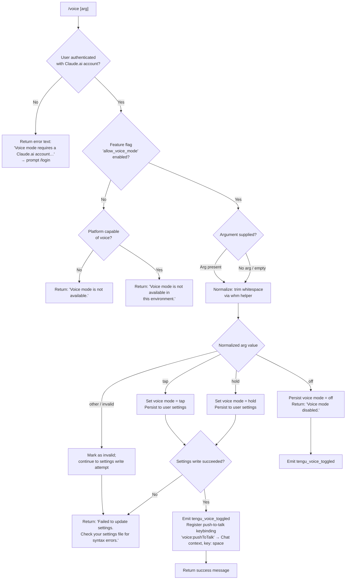

# `/voice`

> Analysis basis: CC v2.1.199 bundle.js (AST extraction + Claude interpretation)
> Minimum version: v2.1.199

---

## Overview

The `/voice` command toggles voice mode in Claude Code, allowing users to switch between push-to-talk (`hold`), tap-to-talk (`tap`), and disabled (`off`) input modes. It validates authentication requirements and environment capability before applying or persisting any mode change via the user settings layer. The command accepts an optional sub-argument to set the mode explicitly; with no argument it cycles or reports current state.

---

## Registration

| Field | Value |
|---|---|
| type | `local` |
| name | `voice` |
| description | Toggle voice mode |
| argumentHint | `[hold\|tap\|off]` |
| supportsNonInteractive | `false` |
| isHidden | `null` |
| module_id | `Phc` |
| load_inline | `true` |
| loc_byte | `13685769` |
| loc_byte_end | `13686011` |
| loc_line | `10104` |
| arbor_handler.name | `Lhm` |
| arbor_handler.fqn | `claude-2.1.199::Lhm` |
| arbor_handler.kind | `AsyncFunction` |
| arbor_handler.resolution_path | `module_id` |
| arbor_handler.n_hits | `1` |

Analysis basis: CC v2.1.199 bundle.js:+13685769

---

## Input Branching

The handler resolves at least six distinct paths based on authentication state, feature flag, environment capability, and the argument value (`hold`, `tap`, `off`, or absent/invalid). A Mermaid flowchart is used.



Analysis basis: CC v2.1.199 bundle.js:+13683147, +13683268, +13683367, +13683488, +13683564, +13683663, +13683801, +13684045

---

## Behavioral Spec

### 1. Entry Point — Main Handler

The Arbor-resolved handler is `Lhm` (AsyncFunction, reached via `module_id → Phc`).

```
async function voiceCommandHandler(args, context):
    rawArg = args.trim()          // via trimArgument helper
    
    // --- Auth gate ---
    authInfo = resolveAuthContext(context)   // calls pvt → qfr → EE
    if authInfo does not have a Claude.ai account:
        return { type: "text",
                 content: "Voice mode requires a Claude.ai account. Please run /login to sign in." }
    
    // --- Feature-flag gate ---
    featureEnabled = checkFeatureFlag("allow_voice_mode", authInfo)   // calls yG → Ws/EG
    platformCapable = checkEnvironmentCapability()

    if not featureEnabled:
        if not platformCapable:
            return { type: "text", content: "Voice mode is not available." }
        else:
            return { type: "text", content: "Voice mode is not available in this environment." }
    
    // --- Argument normalization ---
    normalizedArg = normalizeVoiceArg(rawArg)   // calls whm; trims, lowercases

    // --- Settings persistence ---
    settingsResult = persistVoiceModeToSettings(normalizedArg, context)  // calls Qo → Hf → fKu
    if settingsResult is error:
        return { type: "text",
                 content: "Failed to update settings. Check your settings file for syntax errors." }

    // --- Post-persist actions ---
    emit("tengu_voice_toggled", { mode: normalizedArg })   // telemetry via V at +13683744-46

    if normalizedArg == "off":
        return { type: "text", content: "Voice mode disabled." }

    // Register push-to-talk keybinding in Chat context
    registerKeybinding("voice:pushToTalk", context="Chat", key="space")  // calls wv → oNn/iNn

    return successMessage(normalizedArg)
```

Analysis basis: CC v2.1.199 bundle.js:+13683147, +13683158, +13683268, +13683405, +13683421, +13683488, +13683564, +13683744, +13683891, +13685019

---

### 2. Argument Normalization — `normalizeVoiceArg`

```
function normalizeVoiceArg(rawInput):
    trimmed = rawInput.trim()             // whm helper, +13683017
    lower   = trimmed.toLowerCase()

    if lower == "hold":   return "hold"   // literal at +13683064
    if lower == "tap":    return "tap"    // literal at +13683076
    if lower == "off":    return "off"    // literal at +13683087
    return "invalid"                      // literal at +13683108
```

Analysis basis: CC v2.1.199 bundle.js:+13683017, +13683064, +13683076, +13683087, +13683108

---

### 3. Authentication Context Resolution

The call chain `Lhm → pvt → qfr → EE → bb` resolves the current auth profile. Key behaviors:

```
function resolveAuthContext(context):
    profile = loadCurrentProfile()           // pvt → qfr
    authState = evaluateAuthState(profile)   // EE → bb

    // bb inspects:
    //   - OAuth token presence (user_oauth, +3116107)
    //   - API key environment variable ANTHROPIC_API_KEY (+3120601)
    //   - apiKeyHelper field (+3120695)
    //   - Falls back to "none" if absent (+3120734)
    // If no valid credential found, throws:
    //   "ANTHROPIC_API_KEY, ANTHROPIC_AUTH_TOKEN, CLAUDE_CODE_OAUTH_TOKEN,
    //    or WIF env vars … required"  (+3121070)

    // ic helper checks auth type == "firstParty" (+2176689)
    // Voice mode requires firstParty (Claude.ai account)
    return authState
```

Analysis basis: CC v2.1.199 bundle.js:+13672056, +13683147, +3116107, +3120601, +3120695, +3120734, +3121070, +2176689

---

### 4. Feature-Flag Check — `allow_voice_mode`

```
function checkFeatureFlag(flag, authState):
    // yG calls Ws (capability check) then EG (flag evaluation)
    // Ws checks:
    //   - vqd Set membership (.has)  (+3421170)
    //   - wqd Set membership (.has)  (+3421202)
    //   - pEe (policy check)         (+3421252)
    //   - r.includes() for environment strings (+3421373)
    // EG evaluates "allow_voice_mode" string (+13672014)
    //   against resolved flag settings
    // yG also lowercases the flag name before lookup (+3421516)
    return boolean
```

Analysis basis: CC v2.1.199 bundle.js:+13672014, +13683268, +3421154, +3421170, +3421202, +3421252, +3421373, +3421427, +3421448, +3421516

---

### 5. Settings Persistence — `persistVoiceModeToSettings`

```
async function persistVoiceModeToSettings(mode, context):
    // Qo → Hf: settings read/write orchestrator
    // Hf uses myn (Map) as an in-flight deduplication cache (+1369757 / +1369825)
    // fKu performs the actual disk write:
    //   1. loadSettingsFromDisk (CV → IUr) emitting:
    //        "loadSettingsFromDisk_start" (+1367162)
    //        "settings_load_started"      (+1354744)
    //        "settings_load_completed"    (+1355644)
    //        "loadSettingsFromDisk_end"   (+1367218)
    //   2. Resolves settings layers in priority order:
    //        flagSettings, policySettings, userSettings,
    //        projectSettings, localSettings, SDK inline settings
    //   3. Writes to ~/.claude/settings.json (+1349818 / +1349828)
    //      or settings.local.json (+1349890) for local overrides
    //   4. Uses atomic write helper (Zle) with:
    //        temp file + chmod + fsync + rename
    //        random hex suffix (6 bytes, +1116528/+1116556)
    //        fallback on EACCES (+1117850)
    //   5. Clears caches (l_: Ccn.clear, $Tr.clear) after write (+1370912)
    //   6. Emits Qrt event on completion (+1371323)
    //
    // On any parse error → returns error sentinel
    return result
```

Atomic write uses a 6-byte random hex suffix for the temporary file.
(Analysis basis: CC v2.1.199 bundle.js:+1369586, +1369793, +1370099, +1370912, +1115790, +1116528, +1117680)

---

### 6. Keybinding Registration — Push-to-Talk

When voice mode is set to `hold` or `tap`, a push-to-talk keybinding is registered:

```
function registerPushToTalkKeybinding():
    // wv → oNn → E9t: loads keybindings.json (+4052854)
    // Looks for "bindings" array (+4054924)
    // Validates structure; emits telemetry on load:
    //   tengu_custom_keybindings_loaded  (+4052760)
    //   tengu_keybinding_customization_release (+4052340)
    //
    // iNn → Iso → Tso: resolves terminal emulator type
    //   Detects: iTerm2 (+4058313), Apple_Terminal (+4058341), iTerm.app (+4058377)
    //
    // Registers action: "voice:pushToTalk"  (+13685022)
    //   Context: "Chat"                     (+13685041)
    //   Key:     "space"                    (+13685048)
    //
    // If action not found in registry → emits tengu_keybinding_fallback_used (+4062062)
    //   with "action_not_found" tag (+4062140)
```

Analysis basis: CC v2.1.199 bundle.js:+13685019, +13685022, +13685041, +13685048, +4052760, +4062062, +4062140

---

### 7. Config Write Safety (Lock Contention & Fallbacks)

The settings save path (via `don` / `Jgr`) includes several safety guards:

```
function saveConfigWithLock(newConfig, context):
    // Acquires file lock; if lock takes > 100 ms → emit tengu_config_lock_contention (+14384847)
    // Re-reads config under lock before writing
    // If re-read parse fails → auto-repair from cached config
    //   emit tengu_config_auto_repaired (+14385384)
    //   log: "saveConfigWithLock: re-read hit a parse error…" (+14385256)
    // If re-read is missing auth that cache has → refuse write
    //   emit tengu_config_auth_loss_prevented (+14386054)
    //   log: "saveConfigWithLock: re-read config is missing auth…" (+14385902)
    // On stale write detected → emit tengu_config_stale_write (+14384985)
    // Fallback write path → emit tengu_config_fallback_write (+14384448)
    // Keeps up to 5 rotating backups in "backups/" sub-directory (+14387431, +14386501)
    //   Backup files named with ".backup." infix (+14386360)
    //   Max 384 backup bytes retained per backup entry (+14386806)
```

Analysis basis: CC v2.1.199 bundle.js:+14384758, +14384847, +14384985, +14385256, +14385384, +14385902, +14386054, +14386360, +14386501, +14387431

---

### 8. Microphone Permission Hint

If the platform is capable but microphone permission is denied, the command surfaces the OS-level path:

- macOS guidance string: `"System Settings → Privacy & Security → Microphone"` (bundle.js:+13684552)

Analysis basis: CC v2.1.199 bundle.js:+13684552

---

## State & Side Effects

| Item | Detail |
|---|---|
| Telemetry: `tengu_voice_toggled` | Fired after successful mode change (loc: +13683746) |
| Telemetry: `tengu_feature_ok` | Fired on successful feature gate check (loc: +1039941) |
| Telemetry: `tengu_feature_sad` | Fired on non-critical feature gate miss (loc: +1040089) |
| Telemetry: `tengu_feature_bad` | Fired on hard feature gate failure (loc: +1040008) |
| Telemetry: `tengu_keybinding_customization_release` | Fired when custom keybinding system loads (loc: +4052340) |
| Telemetry: `tengu_custom_keybindings_loaded` | Fired after keybindings.json parsed (loc: +4052760) |
| Telemetry: `tengu_keybinding_fallback_used` | Fired if push-to-talk action not found in registry (loc: +4062062) |
| Telemetry: `tengu_config_lock_contention` | Fired when config file lock takes too long (loc: +14384847) |
| Telemetry: `tengu_config_stale_write` | Fired when a stale write is detected under lock (loc: +14384985) |
| Telemetry: `tengu_config_parse_error` | Fired if config parse fails (loc: +14389460) |
| Telemetry: `tengu_config_auto_repaired` | Fired when cached config is used to repair corrupt on-disk config (loc: +14385384) |
| Telemetry: `tengu_config_auth_loss_prevented` | Fired when write is refused to avoid wiping auth credentials (loc: +14386054) |
| Telemetry: `tengu_config_fallback_write` | Fired when fallback write path is used (loc: +14384448) |
| Settings write | Persists `voiceMode` field to `~/.claude/settings.json` (or `settings.local.json`) |
| Cache invalidation | `Ccn` and `$Tr` caches cleared after settings write (loc: +1370912) |
| Keybinding registration | `voice:pushToTalk` bound to `space` in `Chat` context when mode ≠ `off` (loc: +13685022–48) |
| Config backups | Up to 5 rotating backups written to `backups/` directory on each save |
| `supportsNonInteractive` | `false` — command cannot run in non-interactive/headless contexts |
| Sound | <!-- TODO: not found in depth-2 traversal; needs --depth 4 --> |
| appState changes | Voice mode field updated in application state after successful persist |

---

## Version History

| Version | Change |
|---|---|
| v2.1.199 | Initial analysis |

---

## Common Mistakes

1. **Running without a Claude.ai account**: The command exits with a login prompt if the active authentication is not first-party (`firstParty`). API key–only setups will be rejected. Run `/login` first.
2. **Expecting non-interactive support**: `supportsNonInteractive: false` means `/voice` cannot be invoked in headless or scripted pipelines; doing so will fail silently or error.
3. **Assuming `off` and an empty argument are equivalent**: An empty argument is normalized differently from the explicit `"off"` string and may not produce the "Voice mode disabled." message.
4. **Ignoring the `allow_voice_mode` feature flag**: Even authenticated users will see "Voice mode is not available." if the server-side feature flag is not enabled for their account tier or region.
5. **Editing `settings.json` concurrently**: The command uses a file lock for safe writes. Running a separate process that modifies the settings file simultaneously risks `tengu_config_stale_write` events and a refused write to protect auth credentials.
6. **Expecting the `hold` keybinding immediately**: The `voice:pushToTalk` / `space` keybinding in the `Chat` context is only registered after a successful settings persist; if settings write fails, no keybinding is activated.

---

## Appendix — Identifier Mapping

> For bundle debugging only. Identifiers change across versions.

| Identifier | Role |
|---|---|
| `Lhm` | Main voice command async handler (entry point, Arbor-resolved) |
| `pvt` | Auth profile loader (called by Lhm) |
| `qfr` | Auth context resolver (called by pvt) |
| `EE` | Auth state evaluator (called by qfr) |
| `Md` | Credential presence checker |
| `bb` | Auth type classifier (firstParty / oauth / apiKey / none) |
| `ic` | First-party auth type verifier |
| `wI` | Auth state accessor |
| `Jw` | Auth error thrower (missing credentials) |
| `m2t` | Settings merge helper |
| `slt` | Settings layer loader |
| `lA` | Async settings loader helper |
| `lrn` | Login redirect helper |
| `Kfr` | Capability / environment feature resolver |
| `Ws` | Feature flag evaluator (checks Sets and policy) |
| `mGi` | Feature flag set initializer |
| `s2` | Flag Set builder |
| `Pi` | Policy traffic classifier ("essential-traffic") |
| `pEe` | Policy settings checker |
| `EG` | Feature flag gate evaluator |
| `yG` | Voice-specific feature flag orchestrator |
| `Lr` | Settings load orchestrator (calls CV) |
| `CV` | Settings-from-disk loader (emits perf marks) |
| `C0` | Settings schema validator |
| `Sa` | Performance measurement helper (memoryUsage) |
| `o6` | `perf_hooks` require wrapper |
| `IUr` | Settings load inner implementation |
| `In` | Async settings initializer |
| `wcn` | Settings watch/cache helper |
| `iOt` | Flag settings collector |
| `HOs` | Policy settings collector |
| `NLe` | User settings file path resolver |
| `i` | In-flight request deduplicator (Set-based) |
| `IV` | SDK inline settings injector |
| `gOs` | SDK inline settings collector |
| `t9` | Settings layer aggregator |
| `ar` | Platform/runtime detector |
| `hBe` | WSL environment detector |
| `uCr` | Settings upgrade helper |
| `Eet` | Settings encryption helper |
| `dBe` | Settings defaults applier |
| `pBe` | Settings parser |
| `T0t` | Settings type validator |
| `pce` | Settings path computer |
| `$Le` | Settings cache layer |
| `fyn` | Settings feature-flag resolver |
| `MOs` | macOS-specific settings helper |
| `vne` | Settings version normalizer |
| `aOt` | Settings migration helper |
| `vcn` | Settings validation completion helper |
| `crn` | Command argument context builder |
| `whm` | Argument trim/normalize helper |
| `Qo` | Settings write orchestrator |
| `Hf` | Settings read/write deduplicator (Map-based) |
| `Qh` | Settings snapshot builder |
| `fKu` | Core settings file write implementation |
| `TUr` | Settings load for write verification |
| `f_e` | File read helper (with CLAUDE config awareness) |
| `pn` | ENOENT error handler |
| `T` | Terminal output / logging helper |
| `zt` | Filesystem `fs` module reference |
| `TNr` | Write timestamp tracker (Map-based) |
| `S9e` | Settings serializer |
| `Zle` | Atomic file write helper (temp + rename) |
| `xe` | JSON serializer (JSON.stringify wrapper) |
| `l_` | Cache invalidation helper (clears Ccn, $Tr) |
| `a_n` | Git-aware file append/write helper |
| `L6` | Settings path joiner |
| `Le` | Feature "ok" telemetry emitter |
| `Et` | Feature "sad" telemetry emitter |
| `we` | Feature "bad" telemetry emitter |
| `ke` | Feature gate check implementation |
| `V` | Telemetry event emitter |
| `Whe` | HTTP spend/billing response handler |
| `l` | Daemon status checker |
| `Wfc` | Daemon status file reader |
| `Qne` | Daemon socket status checker |
| `fye` | Socket connection tester |
| `Qs` | Async local storage accessor |
| `Bnn` | Daemon status path builder |
| `wv` | Keybinding registration orchestrator |
| `oNn` | Keybinding config loader (from disk) |
| `E9t` | Keybinding config parser and validator |
| `Eso` | Keybinding schema validator |
| `Uq` | Keybinding telemetry emitter |
| `Mc` | Keybinding platform resolver |
| `rSe` | keybindings.json path builder |
| `Wt` | JSON.parse wrapper |
| `tNn` | Keybinding block array validator |
| `Q1n` | Keybinding entries collector |
| `vQi` | Keybinding telemetry value builder |
| `_so` | Duplicate key detector (regex-based) |
| `yso` | Keybinding conflict resolver |
| `ge` | String coercion helper |
| `iNn` | Terminal environment detector |
| `Iso` | Terminal app identifier |
| `Tso` | Terminal type resolver |
| `yQi` | Platform-specific keybinding mapper |
| `mso` | Key sequence formatter |
| `Fut` | Keybinding action lookup |
| `Pe` | Telemetry emit helper (variant) |
| `GZe` | Core telemetry sink |
| `qe` | Telemetry error variant emitter |
| `det` | Language/locale detector |
| `Mt` | Config accessor (throws if accessed too early) |
| `BJo` | Config readiness gate |
| `GJo` | Global config getter |
| `hae` | Config merge helper |
| `Hn` | Config save orchestrator |
| `Hbc` | Config pre-save snapshot helper |
| `ite` | Config integrity checker |
| `oon` | Config diff/merge helper |
| `Wgr` | Config entry merger |
| `Ygr` | Config promise deduplicator (Map-based) |
| `WJo` | Config write executor |
| `b$` | Path prefix stripper |
| `YTm` | Save-with-lock orchestrator |
| `don` | saveConfigWithLock implementation |
| `wh` | Config write metadata builder |
| `rn` | Error code classifier |
| `Zgr` | Backup file writer |
| `che` | Config cache checker |
| `VJo` | Config file path builder |
| `con` | Config lock acquisition helper |
| `ZTm` | Lock timestamp recorder |
| `lon` | Config load-before-write helper |
| `Jgr` | Global config fallback save implementation |