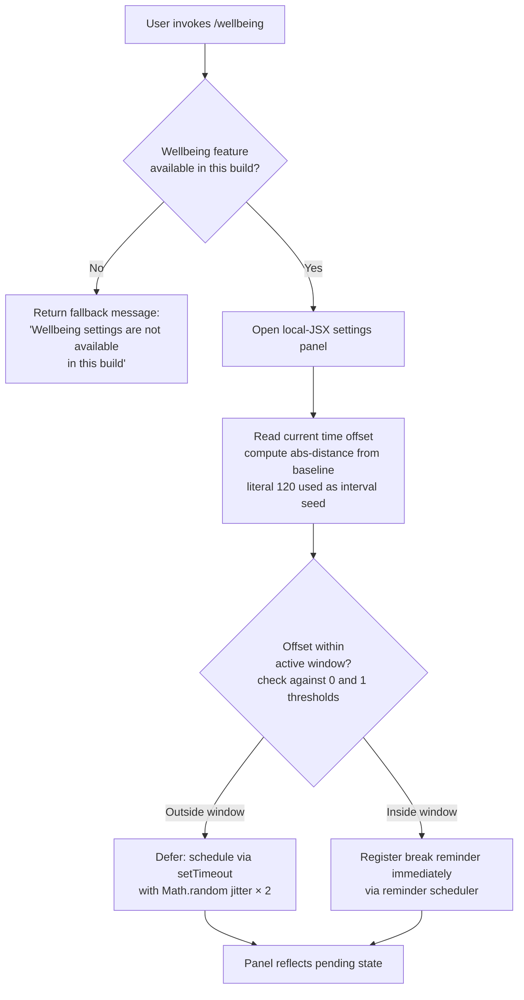

# `/wellbeing`

> Analysis basis: CC v2.1.193 bundle.js (AST extraction + Claude interpretation)
> Minimum version: v2.1.193

---

## Overview

`/wellbeing` (also reachable as `/breaks`, `/break-reminder`, and `/downtime`) opens a local JSX panel that lets users configure optional break reminders and quiet-hours nudges. The command's async handler (`iNf`) checks build-time availability and, when the feature is present, uses time-offset arithmetic and randomised scheduling to compute and register reminder intervals.

---

## Registration

| Field | Value |
|---|---|
| type | `local-jsx` |
| name | `wellbeing` |
| description | Configure optional break reminders and quiet-hours nudges |
| aliases | `breaks`, `break-reminder`, `downtime` |
| immediate | `true` |
| module_id | `JWl` |
| load_inline | `true` |
| loc_byte | `12981362` |
| loc_byte_end | `12981615` |
| loc_line | `8844` |
| arbor_handler.name | `iNf` |
| arbor_handler.fqn | `claude-2.1.193::iNf` |
| arbor_handler.kind | `AsyncFunction` |
| arbor_handler.resolution_path | `module_id` |
| arbor_handler.n_hits | `0` |

Analysis basis: CC v2.1.193 bundle.js:+12981362

---

## Input Branching

Three distinct paths exist: feature unavailability (early-exit with a fallback message), quiet-hours / scheduling arithmetic, and randomised-interval reminder registration. A Mermaid flowchart is therefore required.



Analysis basis: CC v2.1.193 bundle.js:+12980453, +12980567, +12980579, +12980711, +12980713, +14343445, +14343484

---

## Behavioral Spec

### Availability Guard

When the handler (`iNf`) is invoked, the first action is a build-time capability check. If the wellbeing subsystem is absent from the current build, the handler resolves immediately with the string `"Wellbeing settings are not available in this build"` and takes no further action.

```
async function wellbeingHandler(context):
    if not wellbeingFeatureAvailable():
        return displayMessage("Wellbeing settings are not available in this build")
    openWellbeingPanel(context)
```

Analysis basis: CC v2.1.193 bundle.js:+12980711, +12980713

---

### Time-Offset and Window Computation

When the feature is available, a helper (`oNf`) computes the absolute distance between the current time offset and a reference baseline. The constant `120` is used as the base interval value (likely minutes).

```
function computeTimeOffset(currentOffset, baseline):
    distance = Math.abs(currentOffset - baseline)   // abs-distance
    return distance
```

The result is then compared against the boundary sentinels `0` and `1` to determine whether the current moment falls inside or outside the configured active window.

```
function isInsideActiveWindow(distance):
    if distance <= 0:
        return BOUNDARY_LOW        // sentinel 0
    if distance >= 1:
        return BOUNDARY_HIGH       // sentinel 1
    return INSIDE_WINDOW
```

Analysis basis: CC v2.1.193 bundle.js:+12980403, +12980453, +12980567, +12980579

---

### Randomised Deferred Scheduling

When the computed offset places the user outside the active window, a deferred reminder is scheduled. The scheduler (reached via the call edge `iNf → e → setTimeout`) applies a `Math.random() * 2` jitter factor before committing the delay, preventing reminder clustering when many sessions start simultaneously.

```
function scheduleReminderWithJitter(baseDelayMs):
    jitter = Math.random() * 2          // multiplier literal: 2
    effectiveDelay = baseDelayMs + jitter
    setTimeout(fireReminder, effectiveDelay)
```

Analysis basis: CC v2.1.193 bundle.js:+14343445, +14343447, +14343484

---

### Local-JSX Panel Rendering

Because the command type is `local-jsx` and `immediate` is `true`, the wellbeing settings panel is rendered inline in the CLI without requiring a round-trip to the agent. The panel exposes controls for:

- Break reminder interval (seeded from the `120`-unit baseline)
- Quiet-hours window boundaries
- Enabling or disabling the feature globally

The rendering path is handled by the module resolved at `module_id: JWl` and the JSX component exported from it.

Analysis basis: CC v2.1.193 bundle.js:+12981362, +12980403

---

## State & Side Effects

| Item | Detail |
|---|---|
| Telemetry | None detected in depth-2 traversal |
| Hook registration | `setTimeout` scheduled when user is outside active quiet-hours window (bundle.js:+14343484) |
| appState changes | Wellbeing preferences (reminder interval, quiet-hours bounds, enabled flag) written via panel interaction |
| Sound | <!-- TODO: not found in depth-2 traversal; needs --depth 4 --> |
| Fallback message | Displayed verbatim when build lacks wellbeing support (bundle.js:+12980713) |
| Jitter source | `Math.random()` seeded by V8 runtime; not reproducible across sessions (bundle.js:+14343447) |

---

## Version History

| Version | Change |
|---|---|
| v2.1.193 | Initial analysis |

---

## Common Mistakes

1. **Invoking on an unsupported build**: Certain distribution builds omit the wellbeing subsystem entirely. The command will silently return the unavailability message rather than opening any panel — this is expected behaviour, not a bug.
2. **Expecting instant reminders when outside the active window**: If the current time falls outside the configured quiet-hours window, the first reminder is deferred via `setTimeout` with an additional random jitter. Do not assume the reminder fires at exactly the configured interval.
3. **Confusing aliases**: `/breaks`, `/break-reminder`, and `/downtime` all resolve to the same handler (`iNf`). There is no difference in behaviour between them.
4. **Interpreting the `120` constant as seconds**: The base interval value of `120` is most likely in minutes (a 2-hour cycle), but the exact unit is <!-- TODO: not found in depth-2 traversal; needs --depth 4 -->.
5. **Assuming telemetry is emitted**: No `tengu_*` events were found in the traversal. Do not rely on telemetry pipelines to confirm that a user opened the wellbeing panel.

---

## Appendix — Identifier Mapping

> For bundle debugging only. Identifiers change across versions.

| Identifier | Role |
|---|---|
| `iNf` | Main async handler for `/wellbeing`; availability guard + panel open (arbor_handler, `module_id` resolution path) |
| `oNf` | Time-offset helper; calls `Math.abs` to compute distance from baseline (bundle.js:+12980453) |
| `sNf` | <!-- TODO: not found in depth-2 traversal; needs --depth 4 --> |
| `e` | Deferred-scheduling helper; calls `Math.random` and `setTimeout` (bundle.js:+14343447, +14343484) |

---

Note: index built via Arbor fallback; some signals (telemetry, literals) may be missing — see arbor-fallback.js.